## 1、AJAX 简介
### AJAX是什么
`AJAX`全称为`Asynchronous JavaScript And XML`，就是异步的 JS 和 XML。

通过`AJAX`可以在浏览器中向服务器发送异步请求，最大的优势：  `无刷新获取数据` 。

`AJAX`不是新的编程语言，而是一种将现有的标准组合在一起使用的新方式。

### **AJAX使用场景**
+ 场景1：关键字检索

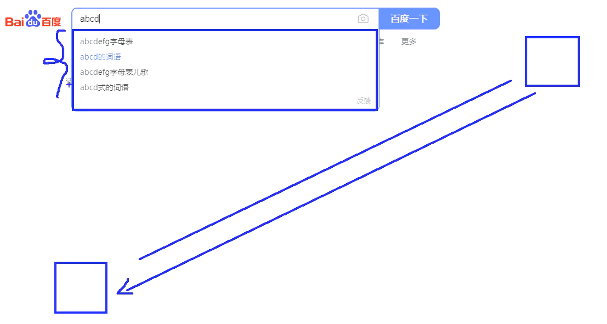

+ 场景2：注册用户名重名检测

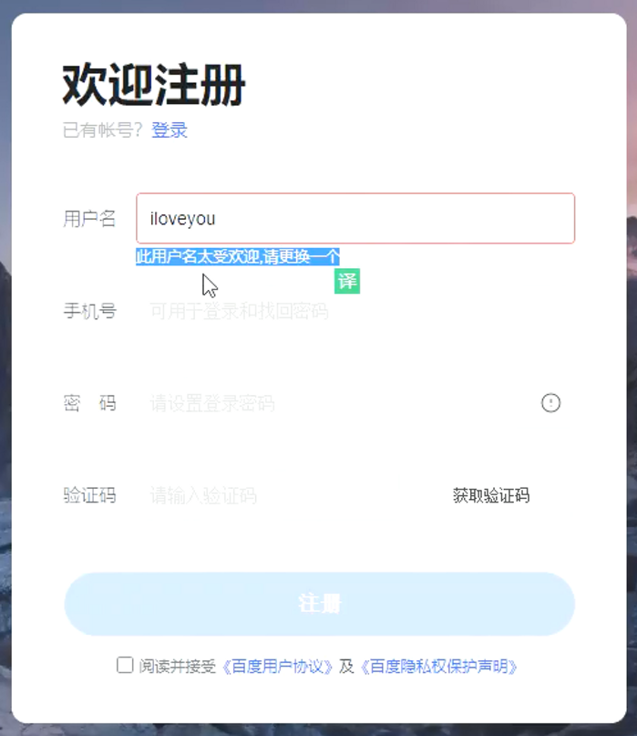

+ 场景3：菜单详情内容

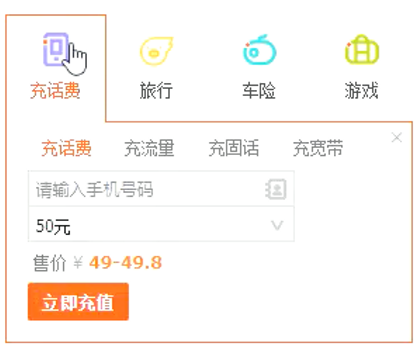

+ 场景4：二级三级菜单分类

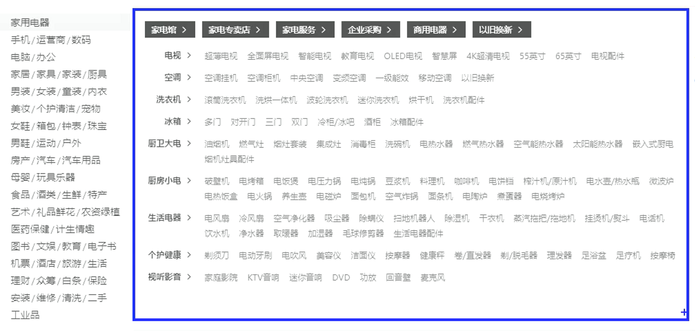

+ 场景5：加载更多


**好处：** 懒加载，按需加载，提高资源利用率，加快页面整体加载速度，提升用户体验


## 2、XML 简介
XML 可扩展标记语言，被设计用来传输和存储数据。

XML 和 HTML 类似，不同的是 HTML 中都是预定义标签，而 XML 中没有预定义标签，全都是自定义标签，用来表示一些数据。

比如说我有一个学生数据：`name="孙悟空";age=18;gender="男";`，用 XML 表示：

```xml
<student>
    <name>孙悟空</name>
    <age>18</age>
    <gender>男</gender>
</student>
```

现在 XML 已经被 JSON 取代了，用 JSON 表示：

```json
{"name":"孙悟空","age":18,"gender":"男"}
```


## 3、AJAX 的特点
### AJAX 的优点
+ 可以无需刷新页面而与服务器端进行通信
+ 允许你根据用户事件来更新部分页面内容

### AJAX 的缺点
+ 没有浏览历史，不能回退
+ 存在跨域问题（同源）
+ SEO（Search Engine Optimization，搜索引擎优化）不友好，爬虫无法爬取


## 4、HTTP 协议
HTTP（hypertext transport protocol）协议「超文本传输议」，协议详细规定了浏览器和万维网服务器之间互相通信的规则。

重点是 **格式与参数**

### 请求报文
+ 请求行
    - 请求类型：`GET`/`POST`/`PUT`/`DELETE`/`PATCH `
    - URL 路径：`s?ie=utf-8`
    - HTTP 协议版本：`HTTP/1.1`
+ 请求头
    - `Host: atguigu.com` 
    - `Cookie: name=guigu` 
    - `Content-type: application/x-www-form-urlencoded`
    - `User-Agent: chrome 83`
    - ...
+ 空行：固定格式，必须有
+ 请求体：`GET`请求，请求体为空；`POST`请求，请求体可以不为空
    - `username=admin&password=admin`

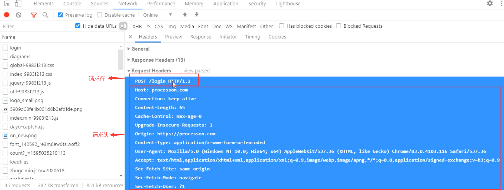

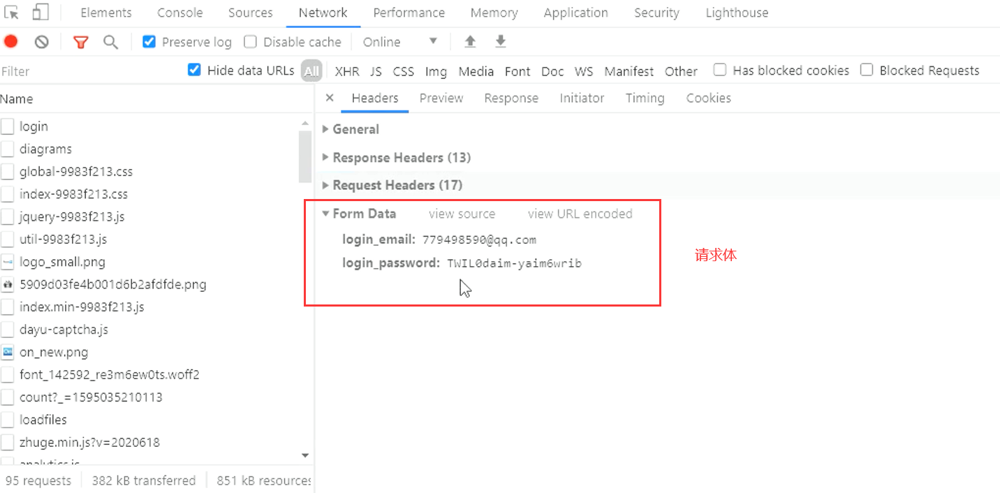

### 响应报文
+ 响应行
    - HTTP 协议版本：`HTTP/1.1`
    - 响应状态码：`200/404/500`
    - 响应状态字符串：`OK/Not Found/Internal Server Error`，与响应状态码对应
+ 响应头
    - `Content-Type: text/html;charset=utf-8`
    - `Content-length: 2048`
    - `Content-encoding: gzip`
    - ...
+ 空行：固定格式，必须有
+ 响应体

```html
<html>
    <head></head>
    <body>
        <h1>响应体</h1>
    </body>
</html>
```

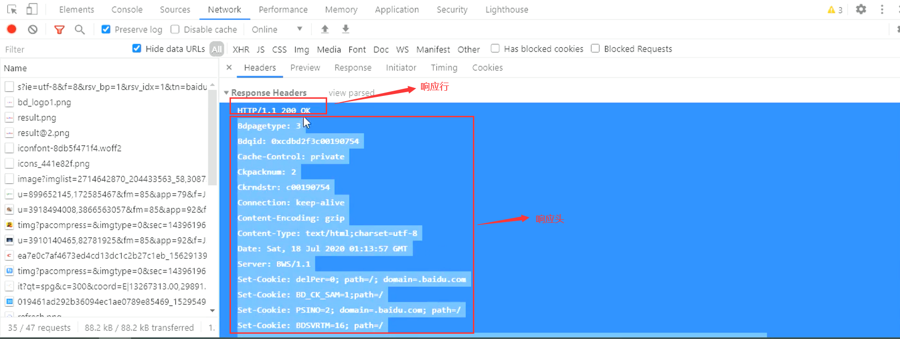

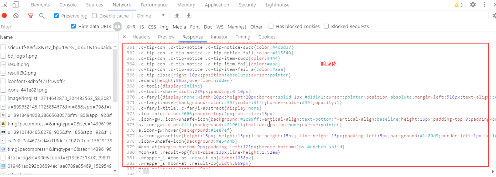

### 状态码分类表
| 状态码 | 类别 | 描述 |
| :--- | :--- | :--- |
| `1xx` | `Informational(信息性状态码)` | 请求正在处理 |
| `2xx` | `Success(成功状态码)` | 请求正常处理完毕 |
| `3xx` | `Redirection(重定向)` | 需要进行附加操作以完成请求 |
| `4xx` | `Client error(客户端错误)` | 客户端请求出错 |
| `5xx` | `Server Error(服务器错误)` | 服务器处理请求出错 |


### 常见的响应状态码
| 状态码 | 状态字符串 | 描述 |
| :--- | :--- | :--- |
| `200` | `OK` | 请求成功 |
| `302` | `Found` | 请求资源的 URL 被暂时修改到 Location 提供的 URL |
| `304` | `Not Modified` | 资源未变更 |
| `308` | `Permanent Redirect` | 永久重定向 |
| `400` | `Bad Request` | 请求语法有问题，服务器无法识别 |
| `401` | `UnAuthorized` | 客户端未授权该请求 |
| `403` | `Forbidden` | 服务器拒绝响应 |
| `404` | `Not Found` | URL 无效或者 URL 有效但是没有资源 |
| `500` | `Internal Server Error` | 服务器内部错误 |
| `502` | `Bad Gateway` | 服务器作为网关使用时，收到上游服务器返回的无效响应 |
| `503` | `Service Unavailable` | 无法服务。一般发生在因维护而停机或者服务过载 |
| `504` | `Gateway Timeout` | 网关超时 |
| `505` | `Http Version Not Supported` | 发出的请求http版本服务器不支持 |


## 5、开发准备
### 安装 Node.js
+ 官网地址：[https://nodejs.org/en/](https://nodejs.org/en/)
+ cmd 键入命令`node -v`，出现版本号信息说明安装成功

```shell
node -v
```

### 使用 express
+ 官网地址：[https://www.expressjs.com.cn/](https://www.expressjs.com.cn/)
+ **npm（node package manager）**：`Node.js`的包管理器，用于`node`插件管理（包括安装、卸载、管理依赖等）

打开终端（VScode`Ctrl+j`），键入命令

```shell
# 初始化
npm init --yes  #注意要在最外层文件夹
# 安装express框架
npm i express
```

创建 js 文件，编写代码

```javascript
// 1、引入express
// const express = require('express');
import express from 'express';

// 2、创建应用对象
const app = express();

// 3、创建路由规则
// request 请求报文的封装
// response 响应报文的封装
app.get('/', (request, response) => {
    // 设置响应
    response.send('Hello Express');
});

// 4、监听端口启动服务
app.listen(8000, () => {
    console.log("服务已经启动，8000 端口监听中...");
});
```

再次打开终端，键入命令 `node js文件名`

```shell
node 01-express基本使用.js
```

出现`服务已经启动，8000 端口监听中...`字样，说明启动成功

我们打开浏览器，访问`http://127.0.0.1:8000/`，出现`Hello Express`字样，验证 OK

### 案例前准备
新建 HTML

```html
...
<style>
    #result {
        width: 200px;
        height: 100px;
        border: 1px solid #90b;
    }
</style>

...
<button>点击发送请求</button>

<div id="result"></div>
```

对路由规则稍作修改

```javascript
app.get('/server', (request, response) => {
    // 设置响应头，设置允许跨域
    response.setHeader('Access-Control-Allow-Origin', '*');
    // 设置响应体
    response.send('Hello Express');
});
```

按照上述步骤启动express后，浏览器访问`http://127.0.0.1:8000/server`，能够正常访问，并且响应头中出现我们设置的头部信息即可

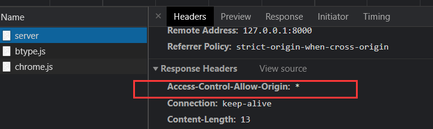


## 6、AJAX 发送 GET 请求
---

+ 1、创建对象

```javascript
const xhr = new XMLHttpRequest();
```

+ 2、初始化

```javascript
xhr.open('GET', 'http://127.0.0.1:8000/server');
```

+ 3、发送

```javascript
xhr.send();
```

+ 4、事件绑定，处理服务器端返回的结果

```javascript
xhr.onreadystatechange = function () {...}
```

+ `readeyState`
    - `0`：未初始化
    - `1`：open 方法调用完毕
    - `2`：send 方法调用完毕
    - `3`：服务端返回部分结果
    - `4`：服务端返回所有结果
+ `status`：状态码
+ `statusText`：状态字符串
+ `getAllResponseHeaders()`：响应头
+ `response`：响应体

**完整代码**

```javascript
const result = document.getElementById('result');
// 按钮绑定事件
const button = document.getElementsByTagName('button')[0];
button.onclick = function () {
    // 1、创建对象
    const xhr = new XMLHttpRequest();
    // 2、初始化
    xhr.open('GET', 'http://127.0.0.1:8000/server');
    // 3、发送
    xhr.send();
    // 4、事件绑定，处理服务器端返回的结果
    xhr.onreadystatechange = function () {
        // 服务端返回所有结果
        if (this.readyState === 4) {
            // 2xx 成功
            if (this.status >= 200 && this.status < 300) {
                // 状态码、状态字符串
                console.log(this.status); // 200
                console.log(this.statusText); // OK
                // 响应头
                console.log(this.getAllResponseHeaders()); // content-length: 13  content-type: text/html; charset=utf-8
                // 响应体
                console.log(this.response); // Hello Express
                // 将响应体内容设置为文本
                result.innerHTML = this.response;
            }
        }
    };
}
```

**效果**

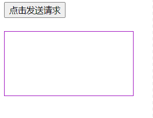

### GET 设置请求体
```javascript
xhr.('GET', 'http://127.0.0.1:8000/server?a=100&b=200&c=300');
```


## 7、AJAX 发送 POST 请求
我们对之前的发送请求代码稍作修改，将`GET`请求改为`POST`即可

```javascript
const result = document.getElementById('result');
result.addEventListener('mouseover', function () {
    const xhr = new XMLHttpRequest();
    xhr.open('POST', 'http://127.0.0.1:8000/server');
    xhr.send();
    xhr.onreadystatechange = function () {
        if (this.readyState === 4 && this.status >= 200 && this.status < 300) {
            result.innerHTML = this.response;
        }
    };
});
```

在浏览器中测试结果，报错

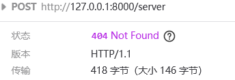

这是因为，`server.js`中只设置了`GET`请求方式的路由规则，并没有创建`POST`请求的路由规则

我们添加下，同样只是稍作修改，将`get`方法改为`post`方法

```javascript
app.post('/server', (request, response) => {
    // 设置响应头，设置允许跨域
    response.setHeader('Access-Control-Allow-Origin', '*');
    // 设置响应体
    response.send('Hello Express');
});
```

重新运行`node server.js`命令，并访问浏览器，能够正常获取数据


### POST 设置请求体
可以设置任意类型、任意格式的数据，只要服务器端有与之对应的处理方式即可

从语法上来说，请求体格式非常灵活；但实际使用场景中，一般会按照特定格式书写（如 JSON）

```javascript
xhr.send('a=100&b=200&c=300');
```


## 8、AJAX 设置请求头信息
### 预定义的请求头
在初始化之后、发送请求之前，可以设置请求头信息

```javascript
xhr.setRequestHeader('Content-Type','application/x-www-form-urlencoded');
```

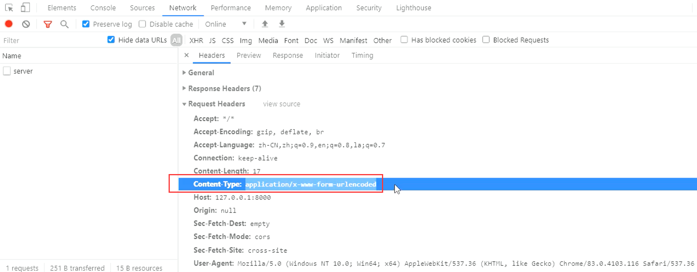

### 自定义的请求头
除了可以设置上述预定义的请求头信息，也可以设置自定义的请求头信息

```javascript
xhr.setRequestHeader('name', 'atguigu');
```

查看头信息已经有了

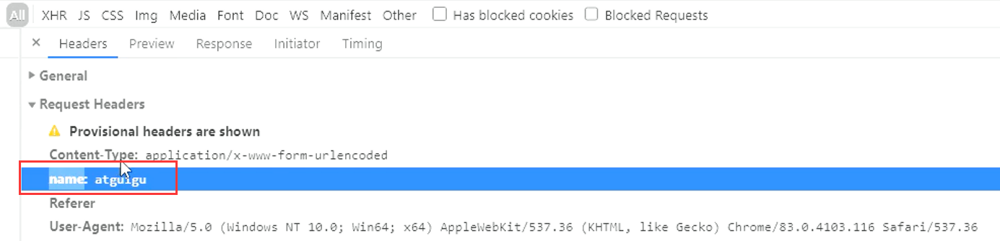

但是，这时候会有报错，这是因为浏览器的安全机制

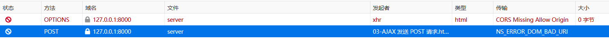

我们需要在`server.js`中添加一行响应头的设置

```javascript
response.setHeader('Access-Control-Allow-Headers', '*');
```

但是仅仅如此，依然不行。我们注意到还有一个`OPTIONS`请求方法，它会对请求头进行校验，检测头信息可用不可用

要知道，我们在`server.js`中并没有创建过`OPTIONS`相关的路由规则，所以是接收不到`OPTIONS`请求的

我们可以用将`post`方法改为`all`，它可以接收任意类型的（GET/POST/PUT/DELETE/PATCH/OPTIONS...）

```javascript
app.all('/server', (request, response) => {
    // 设置响应头，允许跨域
    response.setHeader('Access-Control-Allow-Origin', '*');
    // 设置响应头，允许任意类型的头信息
    response.setHeader('Access-Control-Allow-Headers', '*');
    // 设置响应体
    response.send('Hello Express');
});
```

重启`server.js`服务，查看网络控制台，状态已经正常了

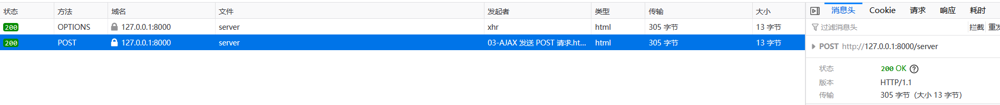


## 9、服务器端响应 JSON 数据
修改`server.js`中`send`方法中的内容，需要注意的是该方法只能接收字符串和`buffer`，所以对其需要做转换

```javascript
const data = {
    name:'Hello Ajax'
}
let str = JSON.stringify(data);
response.send(str);
```

js 代码

```javascript
const result = document.getElementById('result');
window.onkeydown = function () {
    const xhr = new XMLHttpRequest();
    xhr.open('POST', 'http://127.0.0.1:8000/server-json');
    xhr.send();
    xhr.onreadystatechange = function () {
        if (this.readyState === 4 && this.status >= 200 && this.status < 300) {
            console.log(this.response);
            result.innerHTML = this.response;
        }
    };
}
```

**效果**


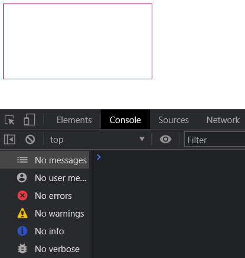

上述返回数据比较简单，获取其中内容相对方便。一旦结果比较复杂，想要提取某些数据，就会很麻烦

这时候就需要对返回结果进行处理

### 手动转换数据
因为我们服务端返回的是`json`字符串内容，所以`response`的内容类型也是字符串

这个时候使用`JSON`工具方法，可以将`json`字符串转换为`json`对象

```javascript
let response = this.response;
console.log(typeof response); // string
data = JSON.parse(response);
result.innerHTML = data.name;
```


### 自动转换数据
```javascript
// 设置响应体类型
xhr.responseType = 'json';
```

这样在获取结果就是`json`对象了，不用进行手动转换即可使用

```javascript
let response = this.response;
console.log(typeof response); // object
result.innerHTML = response.name;
```


## 10、nodemon 自动重启工具安装
+ 官网地址：[https://www.npmjs.com/package/nodemon](https://www.npmjs.com/package/nodemon)
+ 安装命令：`npm install -g nodemon`
+ 启动命令：`nodemon xxx.js`替代`node xxx.js`
+ 优点：修改服务端代码不用每次手动`shutdown`重启，而是每次在我们修改完代码后自动重启

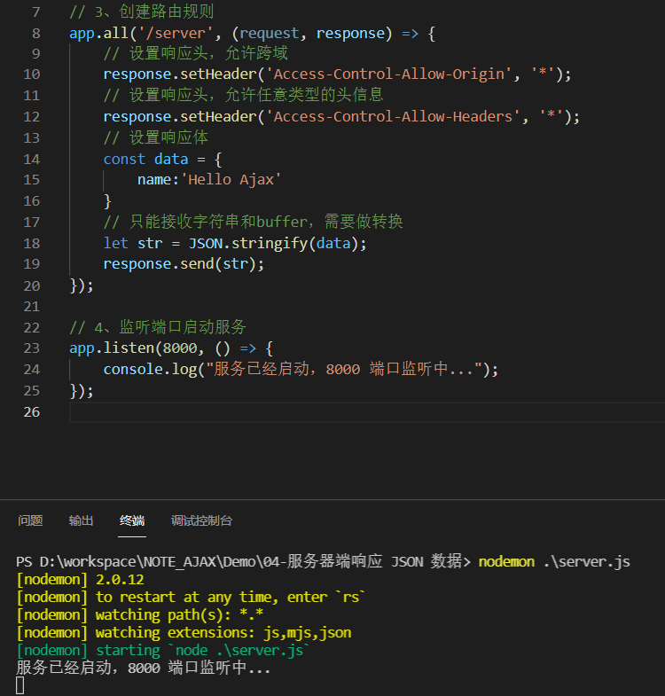


## 11、IE缓存问题
使用`nodemon`启动项目后，对响应体内容进行修改

在 Chrome 中表现正常，二次请求都是`200`

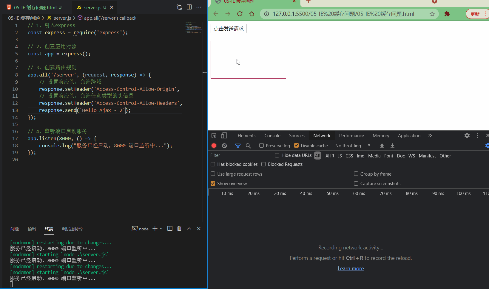

在 IE 中表现异常，这是因为 IE 默认走了缓存，我们可以看到第二次网络请求状态码为`304`

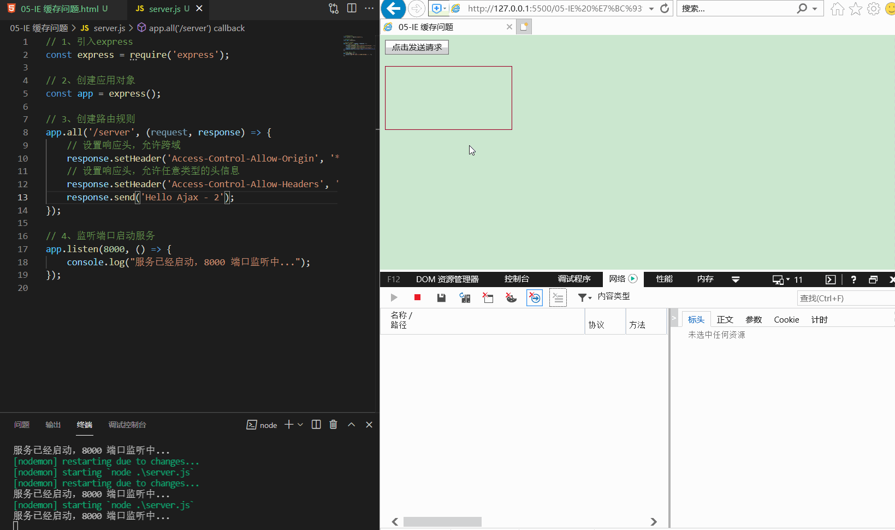

怎么解决 IE 浏览器缓存的问题呢？

处理很简单，只需将代码添加一个时间戳参数

因为时间戳几乎是时刻变化的，这样每次请求参数都会不一样，浏览器就会将其当成不同的请求

```javascript
xhr.open('GET', 'http://127.0.0.1:8000/server-ie?t' + Date.now());
```

再来看下 IE 中的效果

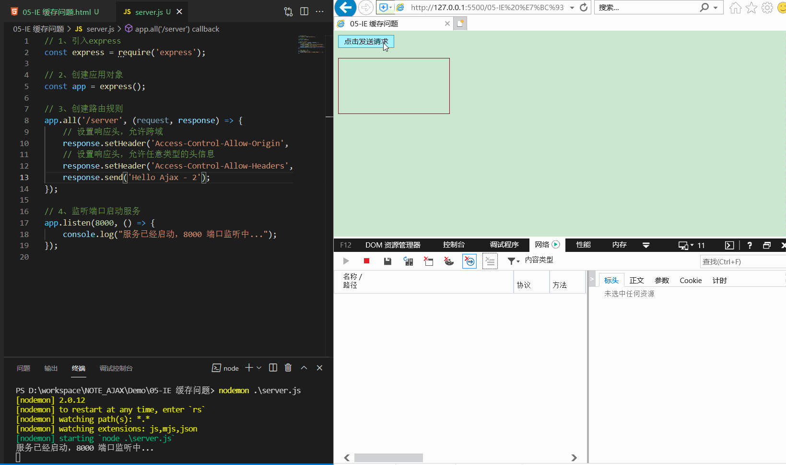


## 12、请求超时与网络异常
### 请求超时
修改`server.js`，设置延时发送响应报文

```javascript
setTimeout(() =>{
    response.send('Hello Ajax');
}, 2000);
```

**效果**

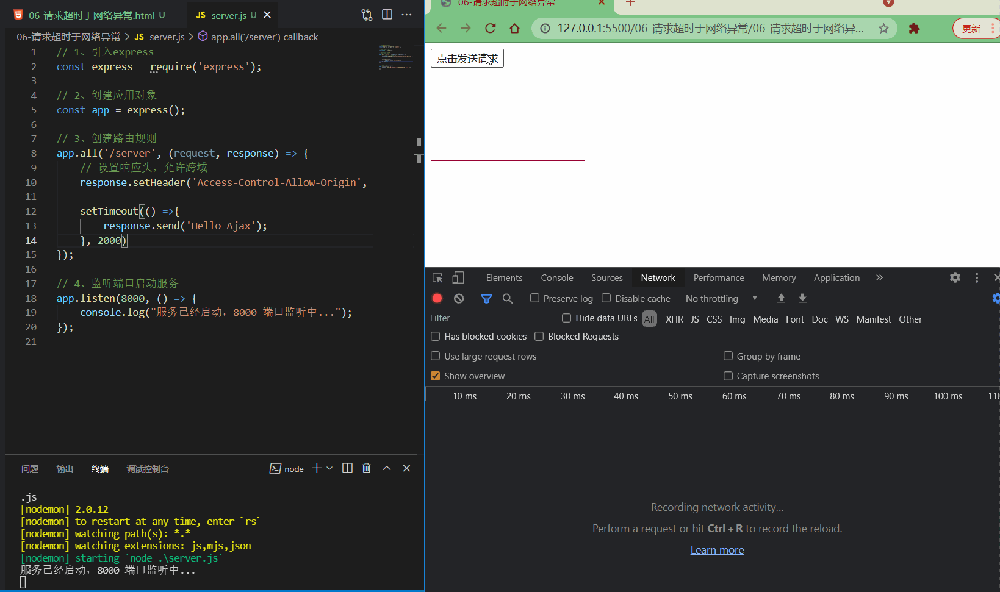

我们这里为模拟超时而设置的延时时间较短，但是一般情况下，请求时间如果过长的话必须要进行处理

如果请求超时，则应该给出相应的超时提醒，一方面可以减少网络带宽资源的占用，一方面也可以提升用户体验

**那么要怎么设置超时的相关信息呢？**

+ 超时时间：`timeout`
+ 超时回调：`ontimeout`

```javascript
// 设置超时时间
xhr.timeout = 1000;
// 设置超时回调
xhr.ontimeout = () => {
    alert('请求超时！');
};
```

**效果**

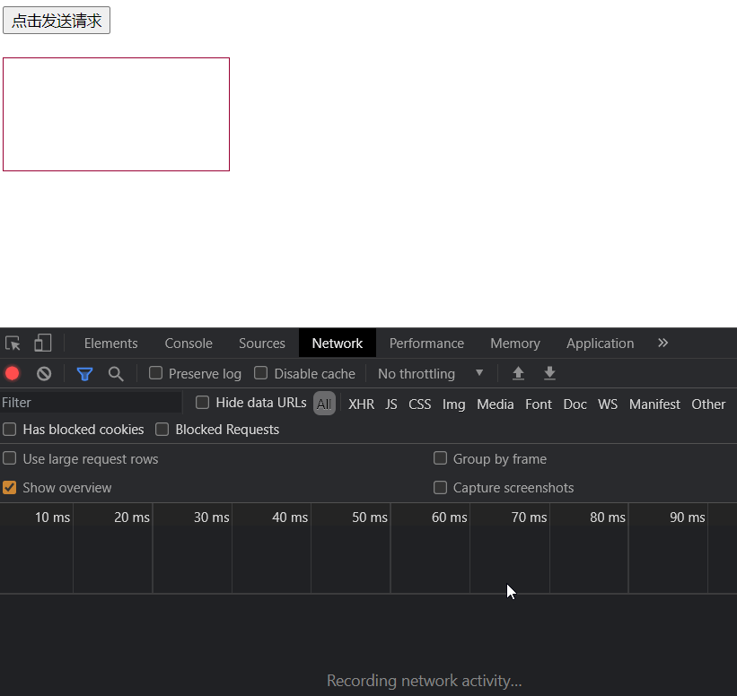

可以看到，当请求时间超过我们设置的`timeout`时长后，就会调用超时回调函数，并且还能看到网络请求状态变成了`(canceled)`

### 网络异常
当然除了服务器响应时间较长导致`请求超时`之外，还有可能因为我们的网速或者其他网络问题导致请求失败

我们可以添加一个`onerror`回调函数，对此类问题进行处理

```javascript
// 设置网络异常回调
xhr.onerror = () => {
    alert("网络异常");
};
```

我们将 Chrome 的网络控制台状态切换为`offline`，模拟断网环境下的请求

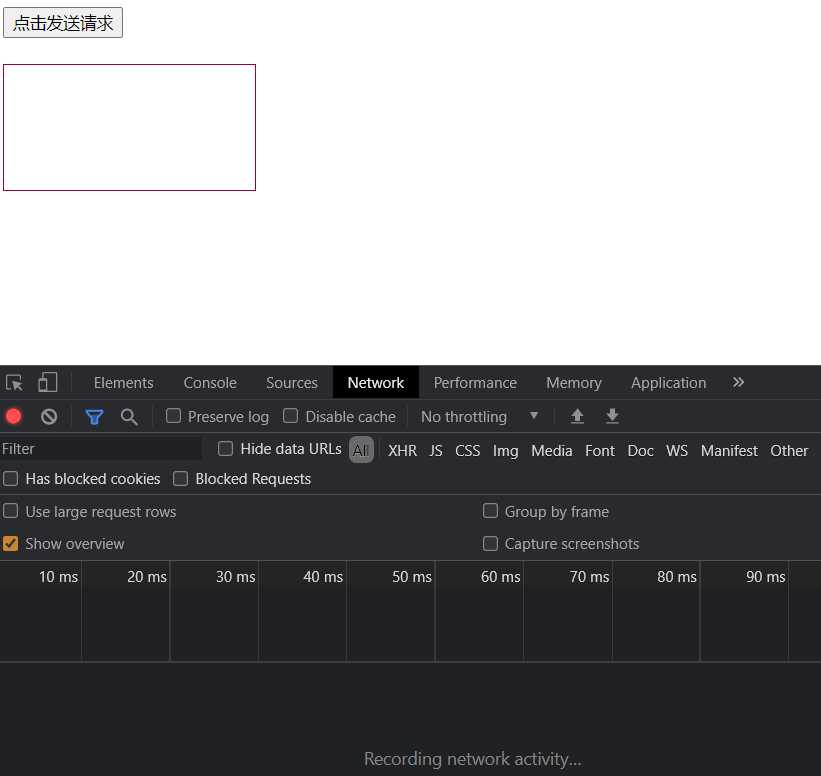

可以看到，这里提示了`网络异常`，也就是走了`onerror`的回调函数，且状态变成了`(failed) net::ERR_INTERNET_DISCONNECTED`


## 13、手动取消请求
`abort()`方法：手动取消请求

```javascript
const btns = document.getElementsByTagName('button');
const btn1 = btns[0];
const btn2 = btns[1];

let xhr = null;
btn1.addEventListener('click', () => {
    xhr = new XMLHttpRequest();
    xhr.open('GET', 'http://127.0.0.1:8000/server-timeout');
    xhr.send();
});
btn2.addEventListener('click', () => {
    xhr.abort();
});
```

**效果**

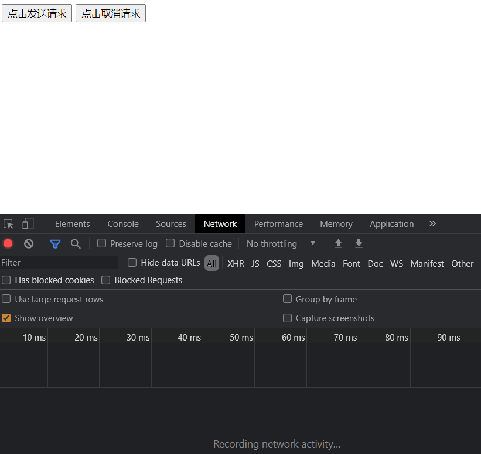


## 14、请求重复发送
如果服务器响应相对比较慢，而用户因为得不到响应而频繁地点击按钮。那么，浏览器短时间内会向服务器发起大量重复的请求，服务器就要对这些请求进行频繁的处理，服务器端的压力就会非常的大

**那么有什么办法可以解决请求重复发送的问题呢？**

思路：发送一个请求之前，查询之前是否有正在进行处理的相同请求，如果有，则取消之前的相同请求，发送一个新的请求。这样保证同一个请求同一时间内只会有一个，这样服务器的压力就会小一些

```javascript
const btns = document.getElementsByTagName('button');
let xhr = null;
// 标识是否正在发送 AJAX 请求
let isSending = false;
btns[0].addEventListener('click', () => {
    // 若上一个请求尚未完成，则手动取消请求
    if (isSending) {
        xhr.abort();
    }
    xhr = new XMLHttpRequest();
    xhr.open('GET', 'http://127.0.0.1:8000/servertimeout');
    isSending = true;
    xhr.send();
    xhr.onreadystatechange = () => {
        // 请求响应完毕后，修改变量标识
        if (xhr.readyState === 4) {
            isSending = false;
        }
    };
});
```

**效果**

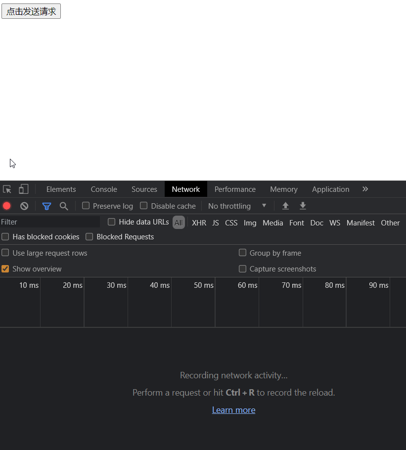

可以看出，如果频繁的点击按钮，发起同一个请求，则每次发起一个新的请求之前，都会取消上一个请求的发送


## 15、jQuery 发送 AJAX 请求
---

+ jQuery 脚本

```html
<script src="https://cdn.bootcdn.net/ajax/libs/jquery/3.6.0/jquery.min.js"></script>
```

+ bootstrp 脚本

```html
<link href="https://cdn.bootcdn.net/ajax/libs/twitter-bootstrap/5.0.2/css/bootstrap.css" rel="stylesheet">
```

### GET 请求
```javascript
$.get(url,[data],[callback],[type])
```

+ `url`：请求的 URL 地址
+ `data`：请求携带的参数
+ `callback`：载入成功时回调函数
+ `type`：设置返回内容格式，xml，html，script，json，text，_default

```javascript
btns.eq(0).click(() => {
    $.get('http://127.0.0.1:8000/server-jquery', { a: 100, b: 200 }, (data) => {
        console.log(typeof data, data); // object {name: "Hello jquery"}
    }, 'json');
});
```

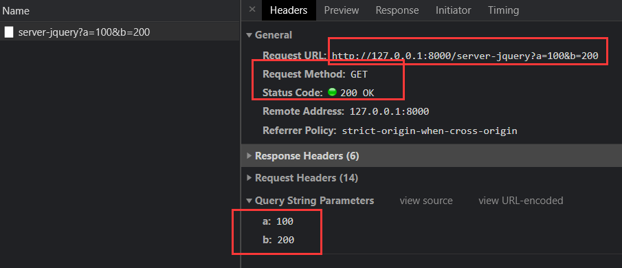

### POST请求
```javascript
$.post(url,[data],[callback],[type])
```

+ `url`：请求的 URL 地址
+ `data`：请求携带的参数
+ `callback`：载入成功时回调函数
+ `type`：设置返回内容格式，xml，html，script，ison，text，_default

```javascript
btns.eq(1).click(() => {
    $.post('http://127.0.0.1:8000/server-jquery', { a: 100, b: 200 }, (data) => {
        console.log(typeof data, data); // string {name: "Hello jquery"}
    });
});
```

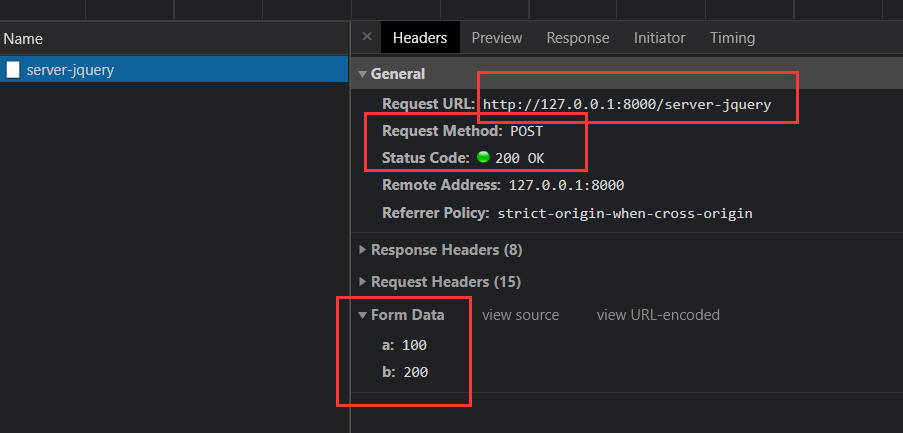

### 通用方法
```javascript
$.ajax({
    // 请求地址
    url: 'http://127.0.0.1:8000/server-jquery',
    // 请求参数
    data: { a: 100, b: 200 },
    // 请求类型
    type: 'GET',
    // 响应体类型
    dataType: 'json',
    // 成功回调
    success: data => {
        console.log(typeof data, data); // string {name: "Hello jquery"}  开启dataType后：object {name: "Hello jquery"}
    },
    // 超时时间
    timeout: 1000,
    // 失败的回调
    error: () => {
        alert('出错了');
    },
    // 头信息
    headers: {
        c: 300,
        d: 400
    }
});
```

**error 回调**


**error 网络状态**

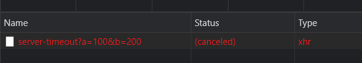

**头信息**

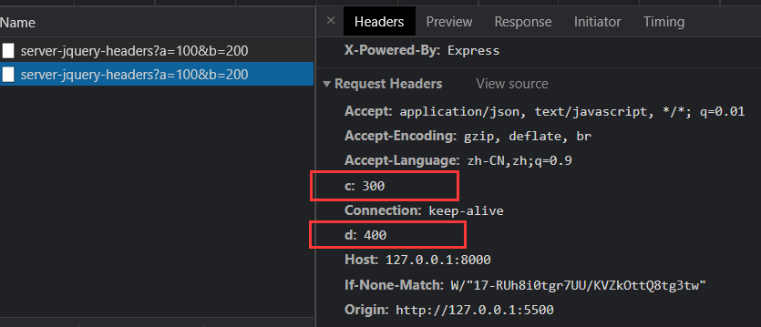


## 16、axios 发送 AJAX 请求
+ axios 官网：[https://www.npmjs.com/package/axios](https://www.npmjs.com/package/axios)

### GET 请求
+ `axios#get(url[,config])`
+ 函数返回结果是一个`promise`对象，用`then`回调处理

```javascript
//首先要npm下载axios 或者直接引入
<script src="https://cdn.bootcdn.net/ajax/libs/axios/1.7.2/axios.js"></script>

axios.defaults.baseURL = 'http://127.0.0.1:8000/';
axios.get('server-axios', {
    // 请求参数
    params: {
        a: 100,
        b: 200
    },
    // 请求头
    headers: {
        c: 300,
        d: 400
    }
}).then(value => {
    console.log(value);
});
```

**请求参数、头信息**

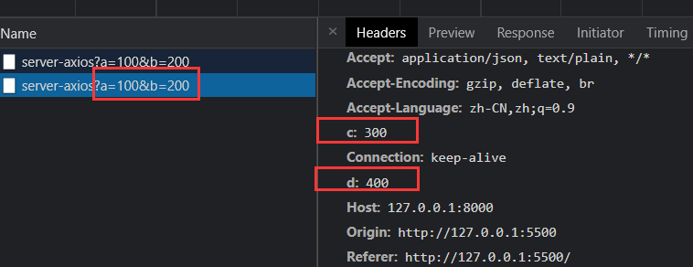

**控制台信息**

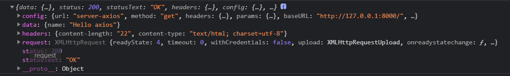

### POST 请求
+ `axios#post(url[,data[,config]])`

```javascript
axios.post('server-axios', {
    // 请求体
    e: 500,
    f: 600
}, {
    // 请求参数
    params: {
        a: 100,
        b: 200
    },
    // 请求头
    headers: {
        c: 300,
        d: 400
    }
}).then(value => {
    console.log(value);
});
```

**头信息**

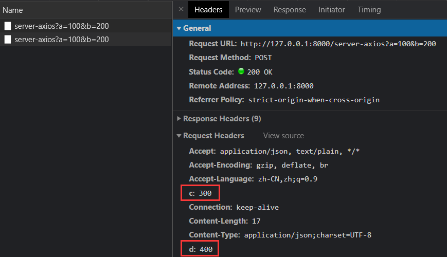

**请求参数、请求体**

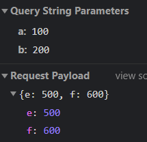

### 通用方法
+ `axios(url[, config])`

```javascript
axios({
    method: 'POST',
    url: 'server-axios',
    // 请求参数
    params: {
        a: 100,
        b: 200
    },
    // 请求头
    headers: {
        c: 300,
        d: 400
    },
    // 请求体
    data: {
        e: 500,
        f: 600
    },
    // 响应体类型
    dataType: 'json'
}).then(response => {
    console.log(response.status); // 200
    console.log(response.statusText); // OK
    console.log(response.headers); // {content-length: "22", content-type: "text/html; charset=utf-8"}
    console.log(typeof response.data, response.data); // object {name: "Hello axios"}
});
```


## 17、fetch 函数 发送 AJAX 请求
```javascript
fetch('http://127.0.0.1:8000/server-fetch?a=100&b=100', {
    // 请求方法
    method: 'POST',
    // 请求头
    headers: {
        c: 300,
        d: 400
    },
    // 请求体
    body: 'e=500&f=600'
}).then(response => {
    console.log(response);
});
```

**请求参数、头信息**

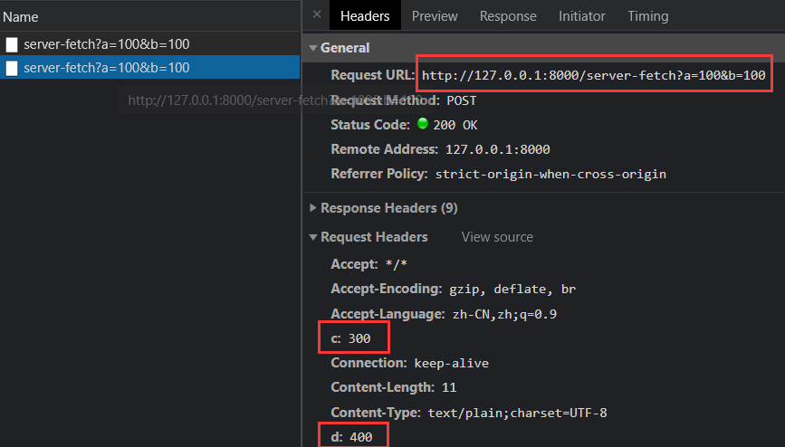

**请求体信息**

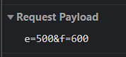

**控制台信息**

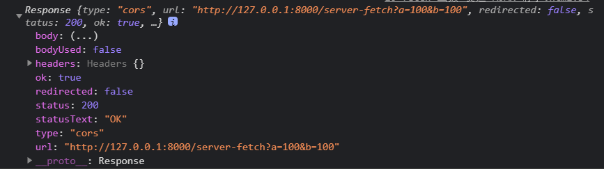

如果我们只想要响应体内容，可以修改`then`回调

```javascript
...
.then(response => {
    return response.text();
}).then(response => {
    console.log(typeof response, response); // string {"name":"Hello fetch"}
});
```

如果明确响应体内容为 json 字符串，可以按如下修改，将会返回一个 object 对象

```javascript
...
.then(response => {
    return response.json();
}).then(response => {
    console.log(typeof response, response); // object {"name":"Hello fetch"}
});
```


## 18、跨域问题
### 同源策略
同源策略（Same-Origin Policy）最早由 Netscape 公司提出，是浏览器的一种安全策略

同源：协议、域名、端口号必须完全相同，**违背同源策略就是跨域**

**server.js 代码**

```javascript
import express from 'express';
const express = require('express');
const app = express();

app.get('/home', (request, response) => {
    // 响应一个页面
    response.sendFile(__dirname + '/11-同源策略.html');
});
app.get('/data', (request, response) => {
    response.send('用户数据');
});

app.listen(9000, () => {
    console.log("服务已经启动，9000 端口监听中...");
});
```

**js 代码**

```javascript
const xhr = new XMLHttpRequest();
// 这里因为是满足同源策略的，所以url可以简写
xhr.open('GET', '/data');
xhr.send();
xhr.onreadystatechange = function () {
    if (xhr.readyState === 4 && xhr.status >= 200 && xhr.status < 300) {
        console.log(xhr.response);// 用户数据
    }
};
```

### 如何解决跨域
#### JSONP
##### 1）JSONP是什么
JSONP （JSON with Padding），是一个非官方的跨域解决方案，纯粹凭借程序员的聪明才智开发出来，只支持 get 请求

##### 2）JSONP怎么工作的？
在网页有一些标签天生具有跨域能力，比如：`img` `link` `iframe` `script`

比如我们之前引入过，并没有报错，可以使用

```html
<script src="https://cdn.bootcdn.net/ajax/libs/jquery/3.6.0/jquery.min.js"></script>

<script src="https://cdn.bootcdn.net/ajax/libs/axios/0.21.1/axios.min.js"></script>
```

**JSONP 就是利用 script 标签的跨域能力来发送请求的**

我们在 HTML 里加入以下内容

```html
<div id="result"></div>

<script>
    function handle(data) {
        const result = document.getElementById('result');
        result.innerHTML = data.name;
    }
</script>

<script src="./js/app.js"></script>
```

**app.js 代码**

```javascript
const data = {
    name: 'JSONP'
};
handle(data);
```

我们使用`Open With Live Server`服务启动项目后，可以获取到`app.js`对应的 HTTP 地址

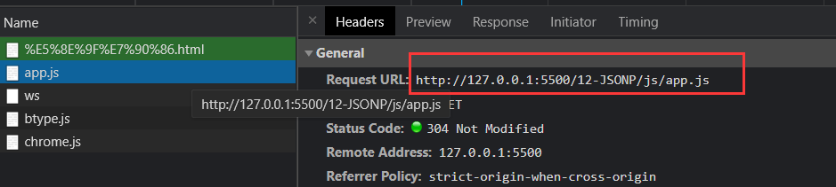

我们替换下`app.js`的 src 地址

```html
<script src="http://127.0.0.1:5500/12-JSONP/js/app.js"></script>
```

我们是不是可以将这个`script`脚本的 src 地址看成是服务端的方法地址？

不就是跟之前引入的`jQuery`和`axios`的 src 地址类似么，既然如此我们当然可以在服务端编写一个路由规则

```javascript
app.all('/server-jsonp', (request, response) => {
    response.send('hello jsonp'); 
});
```

控制台报错

```javascript
Uncaught SyntaxError: Unexpected identifier
```

但是查看下网络响应体信息，实际上是获取到的

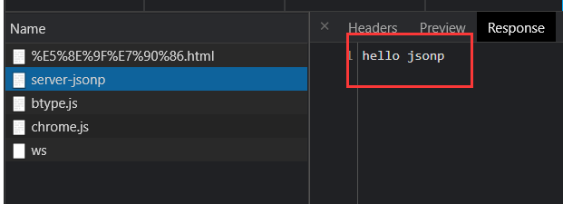

因为`script`标签需要的是一个 JS 脚本代码，而现在获取到的却是一串字符，是无法进行解析的

所以我们需要修改服务端响应内容

```javascript
const data = {
    name: 'JSONP'
};
let str = JSON.stringify(data);
// end 方法不会有特殊响应头
// 为了方便拼接，用模板字符串
response.end(`handle(${str})`); // 返回结果是一个函数调用
```

这次内容正常呈现，查看控制台没有报错信息，而且请求内容是我们编写的一串 JS 代码

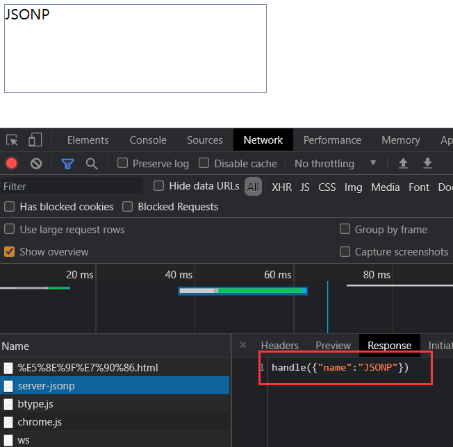

##### 3）JSONP的使用
**HTML 代码**

```html
用户名：<input type="text" id="username">
<p></p>

<script>
    //声明handle函数
    function handle(data) {
        var input = document.querySelector('input');
        input.style.border = "solid 1px #f00";
        //修改p标签的提示文本
        var p = document.querySelector('p');
        p.innerHTML = data.msg;
    }
</script>

<script>
    const input = document.querySelector('input');
    input.onblur = () => {
        let username = this.username;
        // 1、创建一个 script 标签
        var script = document.createElement('script');
        // 2、设置 src 属性
        script.src = 'http://127.0.0.1:8000/check-username';
        // 3、将 script 插入文档中
        document.body.appendChild(script);
    };
</script>

```

**服务端代码**

```javascript
app.all('/check-username', (request, response) => {
    const data = {
        exist: 1,
        msg:'用户名已存在'
    };
    let str = JSON.stringify(data);
    response.end(`handle(${str})`); 
});
```

**效果**

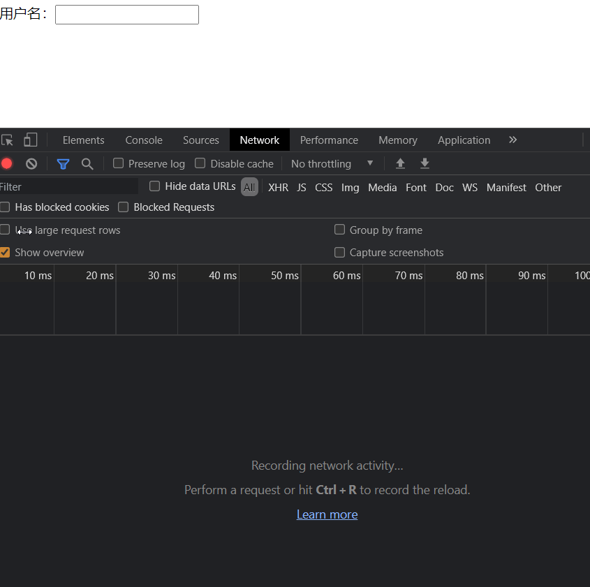

##### 4）jQuery 发送 JSONP 请求
```javascript
$.getJSON(url,[data],[fn])
```

+ **url**：发送请求地址
+ **data**：待发送 key/value 参数
+ **callback**：载入成功时回调函数

**HTML 代码**

```html
<button>点击发送请求</button><br><br>
<div id="result"></div>

<script src="https://cdn.bootcdn.net/ajax/libs/jquery/3.6.0/jquery.min.js"></script>

<script>
    $('button').eq(0).click(() => {
        $.getJSON('http://127.0.0.1:8000/server-jsonp-jquery?callback=?', data => {
            $('#result').html(data.msg);
        });
    });
</script>

```

**服务端代码**

```javascript
app.all('/server-jsonp-jquery', (request, response) => {
    const data = {
        exist: 1,
        msg:'用户名已存在'
    };
    let str = JSON.stringify(data);
    response.end(`(${str})`);
});
```

此时并没有任何输出，但是请求参数中自动生成了一个`callback`的参数

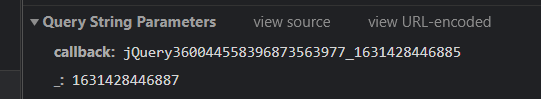

因为我们现在是通过`live-server`服务的5500端口访问的`nodemon`服务的8000端口，也就是说现在是跨域访问

所以需要返回一个 JS 脚本代码，但是我们就需要一个字符串作为返回结果啊，怎么办呢？

按照`jsonp`原生代码思路，我们是一定要返回一个 JS 脚本代码的

那么`callback`参数就排上用场了，我们需要改造下服务端代码

```javascript
// 接收callback参数
var cb = request.query.callback;
response.end(`${cb}(${str})`); 
```

**效果**

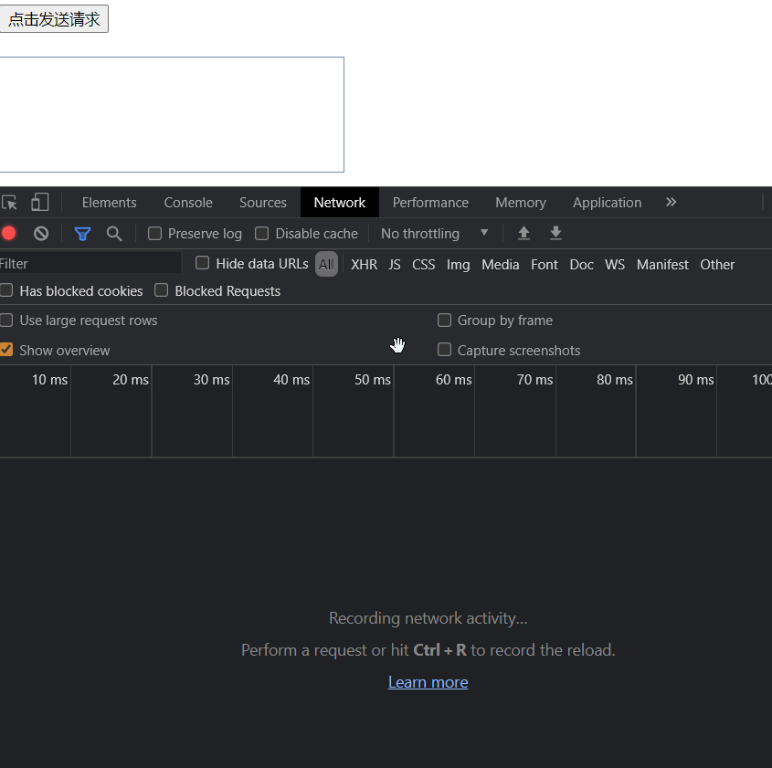

我们可以看到响应体内容已经自动获取了`callback`参数和服务端返回结果

#### CORS
+ 官网地址：[https://developer.mozilla.org/zh-CN/docs/Web/HTTP/CORS](https://developer.mozilla.org/zh-CN/docs/Web/HTTP/CORS)

##### 1）CORS是什么？
CORS（Cross-Origin Resource Sharing），跨域资源共享。CORS 是官方的跨域解决方案，它的特点是不需要在客户端做任何特殊的操作，完全在服务器中进行处理，支持 get 和 post 请求。跨域资源共享标准新增了一组 HTTP 首部字段，允许服务器声明哪些源站通过浏览器有权限访问哪些资源

##### 2）CORS怎么工作的？
CORS 是通过设置一个响应头来告诉浏览器，该请求允许跨域，浏览器收到该响应以后就会对响应放行

##### 3）CORS的使用
**HTML 代码**

```html
<button>点击发送请求</button><br><br>
<div id="result"></div>

<script>
    const btn = document.getElementsByTagName('button')[0];
    const result = document.querySelector('#result');
    btn.addEventListener('click', function () {
        const xhr = new XMLHttpRequest();
        xhr.open('GET', 'http://127.0.0.1:8000/server-cors');
        xhr.send();
        xhr.onreadystatechange = function () {
            if (this.readyState === 4 && this.status >= 200 && this.status < 300) {
                result.innerHTML = this.response;
            }
        };
    });
</script>
```

**服务端代码**

```javascript
app.all('/server-cors', (request, response) => {
    response.send('Hello cors');
});
```

**效果**


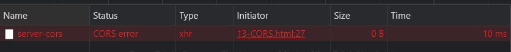

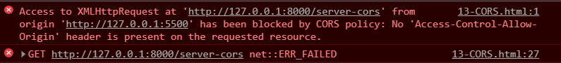

我们要想进行跨域请求，必须在服务端返回结果时设置允许跨域的响应头

```javascript
// 设置响应头，允许跨域
response.setHeader('Access-Control-Allow-Origin', '*');
```

除此之外，还有一些 HTTP 响应首部字段

##### 5）HTTP 响应首部字段
| HTTP 响应首部字段 | 作用 |
| :--- | :--- |
| `Access-Control-Allow-Origin` | 指定了允许访问该资源的外域 URI |
| `Access-Control-Expose-Headers` | 让服务器把允许浏览器访问的头放入白名单 |
| `Access-Control-Max-Age` | 指定了 preflight 请求的结果能够被缓存多久 |
| `Access-Control-Allow-Credentials` | 是否允许浏览器读取 response 的内容 |
| `Access-Control-Allow-Methods` | 指明了实际请求所允许使用的 HTTP 方法 |
| `Access-Control-Allow-Headers` | 指明了实际请求中允许携带的首部字段 |


我们一般这么使用，允许跨域、带有自定义头部信息、任意方法

```javascript
response.setHeader("Access-Control-Allow-Origin", "*"); 
response.setHeader("Access-Control-Allow-Headers", "*"); 
response.setHeader("Access-Control-A1low-Method", "*"); 
```
