# 1.docker相关介绍

## 1.1.docker的介绍

```sh
1.问题描述:
  a.问题1:如果我们开发,我们需要安装开发语言的环境,mysql环境,redis环境,node.js环境,我们就需要在当前计算机上安装各种各样的环境,我们开发好的应用程序需要部署到服务器上运行,那么服务器上也需要安装这些环境,那么多台服务器都要安装一遍这些环境,而且我们有开发环境,测试环境,生产环境,跑项目都需要这些环境,这样就非常麻烦
  b.问题2:公司没有钱,只需要一台服务器,但是需要跑不同的项目,那么不同的项目有可能就会针对同一个技术的环境安装不同的版本,比如mysql在同一台服务器上安装了不同的版本,这样就会有冲突了
  
2.问题解决:
  我们可以用docker去解决以上的问题,docker将项目以及依赖,还有运行环境都打包成一个一个的相互隔离的镜像,然后可以快速移植到不同的服务器上去跑,想运行,直接用docker将打包好的镜像拉到对应的服务器上即可
      
3.docker的概述:
  一个开源的应用容器引擎，基于 Go 语言开发。docker 可以让开发者打包他们的应用以及依赖包到一个轻量级、可移植的容器中，然后发布到任何流行的 Linux 机器上
      
  docker的主要目标是:在任何地方构建、发布并运行任何应用程序（一次封装，到处运行）
      
4.docker下载地址:https://www.docker.com/

5.docker的优势:
  a.可移植性：可以将项目以及依赖,运行环境一起打包为一个镜像,然后可以迁移到任意Linux操作系统中(一次封装,到处部署运行)
  b.可伸缩性：docker容器可以根据负载(比如说请求,访问量)的变化进行快速扩展和收缩(负载大了,多开几个容器,负载少了,就少开几个容器)，从而更好地满足应用程序的需求。
  c.隔离性：docker容器提供了隔离的运行环境，使得不同容器中运行的应用程序互相隔离，避免了应用程序之间的干扰
```

## 1.2.docker容器和镜像的区别

```sh
1.镜像(Image):docker将应用程序以及所需的依赖,运行环境,配置文件等打包在一起,称之为镜像
2.容器(Container):将镜像拉下来并将镜像中的应用程序运行起来后形成的进程就是容器,docker会给这些容器做隔离,互不干扰   
```

## 1.3.docker和虚拟机的区别

docker和虚拟机的区别如下图所示：因为docker直接利用宿主机的系统内核，它启动速度更快。


| 特性     | docker                                        | 虚拟机                                                       |
| -------- | --------------------------------------------- | ------------------------------------------------------------ |
| 性能     | 接近原生(执行应用程序直接调用操作系统内核)    | 性能较差(执行应用程序时先启动虚拟机,再传递给Hypervisor,再传递给主机操作系统,再给计算机硬件) |
| 硬盘占用 | 一般为MB(仅仅封装了应用需要的运行环境,体积小) | 一般为GB(需要直接安装一个操作系统)                           |
| 启动     | 秒级                                          | 分钟级                                                       |

## 1.4.docker架构说明

```sh
1.概述:docker是一个CS架构的程序,由两部分构成
  a.服务端(Server):在服务端有一个docker的守护进程,负责处理docker指令,管理镜像,容器等
  b.客户端(Client):通过客户端直接往docker的服务端发送请求,然后等待docker服务端完成工作并返回结果
```

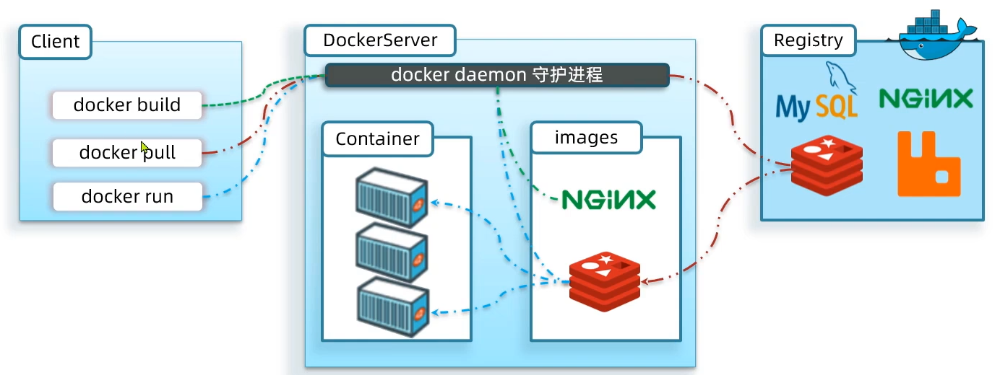 

| 名称                              | 说明                                                         |
| --------------------------------- | ------------------------------------------------------------ |
| Docker 镜像（Images）             | Docker 镜像是用于创建 Docker 容器的模板。镜像是基于联合文件系统的一种层式结构，由一系列指令一步一步构建出来。 |
| Docker 容器（Container）          | 容器是独立运行的一个或一组应用。镜像相当于类，容器相当于类的实例 |
| Docker 客户端（Client）           | Docker 客户端通过命令行或者其他工具使用 Docker API 与 Docker 的守护进程通信。 |
| Docker 主机（Host）               | 一个物理或者虚拟的机器用于执行 Docker 守护进程和容器。       |
| Docker 守护进程                   | 是 Docker 服务器端进程，负责支撑 Docker 容器的运行以及镜像的管理。 |
| Docker 仓库 DockerHub（Registry） | Docker 仓库用来保存镜像，可以理解为代码控制中的代码仓库。Docker Hub 提供了庞大的镜像集合供使用。用户也可以将自己本地的镜像推送到 Docker 仓库供其他人下载。 |

# 2.windows下docker的安装和卸载

## 2.1.说明

```sh
1.说明:
  我们使用docker需要去docker的仓库(docker hub)中下镜像,但是docker官方的docker hub我们正常访问是访问不了的,我们需要通过"科学上网"的方式去访问,当然我们可以使用国内的镜像源,但是国内的镜像源有的好使,有的不好使,或者访问起来会比较慢,咱们去可以试试
      
  今天我们为了实现一次打包,到处运行,所以我们可以先在window上安装一套docker,然后在windows上写一个程序,然后docker打包,然后扔到咱们ubuntu上运行,所以后面我们还需要在ubuntu上安装docker
      
  但是我们要知道的是docker主要在linux上使用,所以我们在windows上安装,需要有WSL2(window系统中内置的一个轻量级linux系统)的支持
      
2.windows系统要求:
  a.win11系统
  b.win10系统(内部版本必须是19041及以上)
      
3.查看windows系统版本:
  a.win+r
  b.输入:winver
```

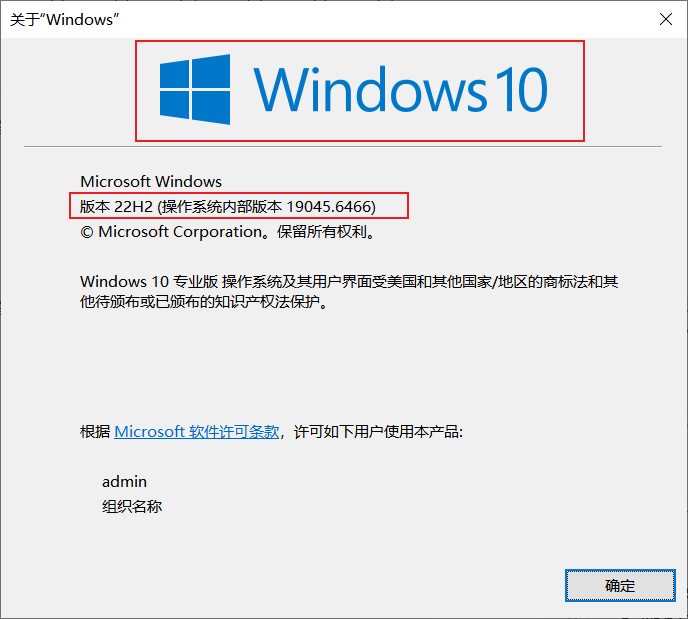

## 2.2.安装前准备

### 2.2.1.开启虚拟化

```sh
打开任务管理器(ctrl+alt+del)->性能
```

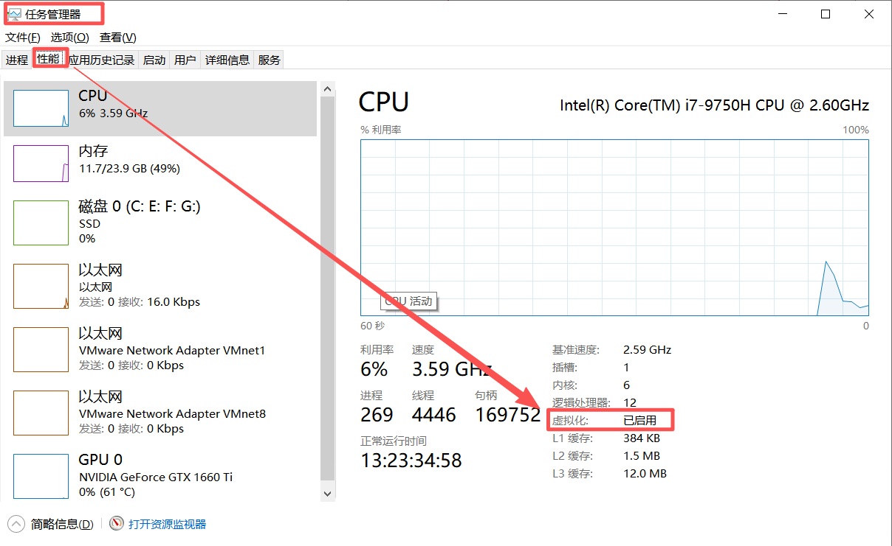

> 一般电脑都已经开启，如果没有开启，重启电脑，开机时按主板快捷键（联想F2、戴尔F12、华硕F8）进入BIOS，找到“Virtualization Technology”（虚拟化技术），设置为“Enabled”（启用），保存并**重启电脑**。

### 2.2.2.启动WSL和虚拟机平台功能

```sh
1.方式1:在控制面板-程序-启用或关闭Windows功能中勾选适用于Linux的Windows子系统以及虚拟机平台(WSL2需要)
2.方式2:
  a.按win+r
  b.输入optionalfeatures    
```

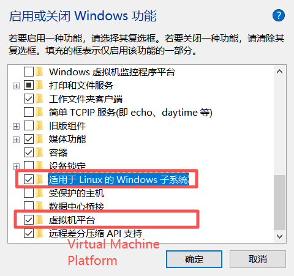

### 2.2.3.更新WSL内核

```sh
如果通过命令更新会非常慢。为了加快速度，直接从github里面下载最新版本。
https://github.com/microsoft/WSL/releases
```

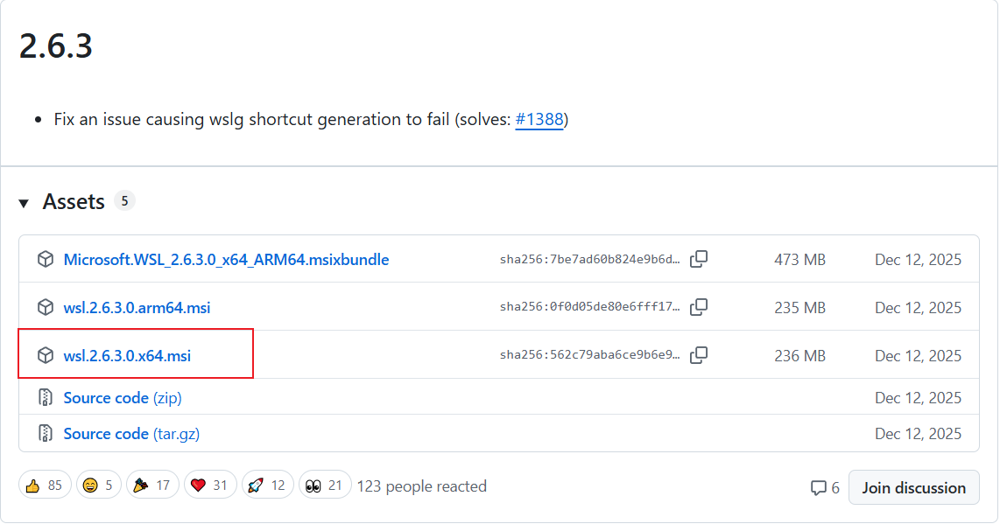

## 2.3.docker的安装与验证

```sh
由于我们安装了WSL,然后再装docker,就相当于在linux中安装了docker一样
```

### 2.3.1.下载安装包

```sh
访问Docker官方下载页，下载“Docker Desktop for Windows”安装包。
官方下载地址：https://www.docker.com/products/docker-desktop/
```

### 2.3.2.安装

```sh
双击下载的安装包，安装时如果弹出一下选项勾选：Use WSL 2 instead of Hyper-V（推荐）,点击“下一步”，默认安装即可，安装完成后Docker会自动启动，如果安装的过程中有阻止对host的修改，点击允许。
```

### 2.3.3.验证安装

```sh
打开windows系统终端(cmd或PowerShell),执行以下两条命令，若均能显示版本号，说明安装成功
docker --version
docker compose version
```

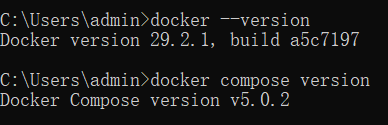

> 1.首次打开Docker Desktop服务端可能出现的问题:
>
> ```sh
> running wslexec: WSL2 requires the Windows Subsystem for Linux Optional Component.
> Install it by running: wsl.exe --install --no-distribution
> The system may need to be restarted so the changes can take effect. Wsl/WSL_E_WSL_OPTIONAL_COMPONENT_REQUIRED: c:\windows\system32\wsl.exe --terminate docker-desktop: exit status 0xffffffff (wslErrorCode: Wsl/WSL_E_WSL_OPTIONAL_COMPONENT_REQUIRED, stderr: )
> ```
>
> 2.解决方式
>
> ```sh
> 1.这个错误的核心原因是：你的 Windows 系统没有开启 WSL2（Windows Subsystem for Linux）必需的可选组件，Docker Desktop 依赖 WSL2 运行，所以启动失败
>   
> 2.解决:
>   步骤 1：以管理员身份打开 PowerShell
>          a.按下 Win + X 键
>          b.选择 Windows PowerShell (管理员) 或 终端 (管理员)
>          c.确保窗口标题显示管理员
>       
>   步骤 2：执行 WSL 安装命令 -> 直接复制粘贴这条命令，回车运行：
>          wsl.exe --install --no-distribution   
>       
>          这个命令会自动做 3 件事：
>          a.开启 WSL 系统组件
>          b.开启 虚拟机平台 组件
>          c.配置 WSL2 为默认版本
>       
>   步骤 3：重启电脑
>          命令执行完成后，必须重启 Windows，让组件生效。 
>       
>   步骤 4：重启后验证 WSL 是否正常
>          重启后，再次打开 PowerShell（普通权限即可），输入：wsl --status
>             
>          如果显示 默认版本：2，说明 WSL2 已正常启用  
>       
>   步骤 5：重启 Docker Desktop
>          打开 Docker Desktop，它会自动连接 WSL2，报错彻底消失    
> ```

## 2.4.配置docker的镜像源

```sh
默认Docker镜像源为国外官方仓库（Docker Hub），国内下载镜像（如mysql:8.0.45、python:3.12-slim）速度较慢，甚至超时失败，配置国内镜像源（阿里云）可大幅提升下载速度。
```

### 2.4.1.打开Docker Desktop

```sh
1.可以跳过登录
2.打开设置
3.找到"Docker Engine",点击进入配置页面
4.添加国内镜像源
```

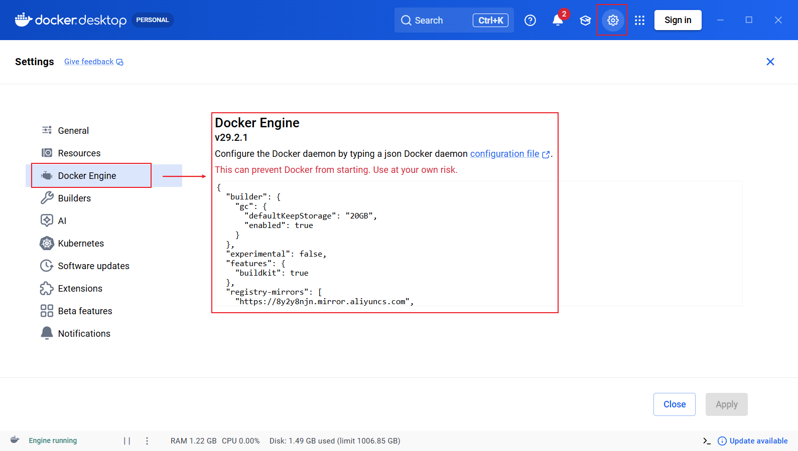

### 2.4.2.配置国内镜像源

```sh
{
  "builder": {
    "gc": {
      "defaultKeepStorage": "20GB",
      "enabled": true
    }
  },
  "experimental": false,
  "features": {
    "buildkit": true
  },
  "registry-mirrors": [
    "https://docker.m.daocloud.io",
    "https://mirror.aliyuncs.com"
  ]
}
```

> 点击页面右下角“Apply & Restart”（应用并重启），等待Docker重启完成，镜像源配置生效

## 2.5.docker的卸载

```sh
若Docker安装失败、版本不兼容，或无需使用Docker，可按以下步骤彻底卸载，避免残留文件影响后续操作：
```

### 2.5.1.停止Docker服务

```sh
找到任务栏右下角的 Docker 鲸鱼图标（可能在隐藏图标里，点 ^ 展开） ，右键点击 → 选择 Quit Docker Desktop / 退出 Docker Desktop ，等待几秒，Docker 就完全停止了
```

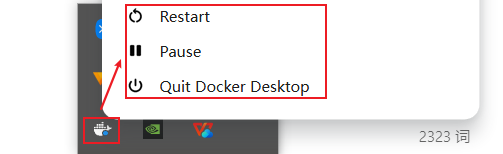

### 2.5.2.卸载docker应用

```sh
打开 “控制面板” → “程序应用” → “卸载”，在搜索框输入“Docker Desktop”，点击右侧“三个点” → “卸载”，按提示完成卸载（过程约1-2分钟）
```

### 2.5.3.删除 WSL 2 相关的 Docker 发行版(关键)

```sh
以管理员身份打开 PowerShell，执行
# 停止所有 WSL 实例
wsl --shutdown

# 查看已安装的 WSL 发行版（会看到 docker-desktop、docker-desktop-data）
wsl --list --verbose

# 删除 Docker 相关的 WSL 发行版（彻底清理镜像/容器数据）
wsl --unregister docker-desktop
wsl --unregister docker-desktop-data
```

### 2.5.4.删除残留文件(可选，彻底清理)

```sh
1.删除用户目录下的Docker残留：打开文件资源管理器，进入 C:\Users\你的用户名\.docker，删除整个.docker文件夹；
2.删除C:\Users\你的用户名\AppData\Local\Docker，docker-secrets-engine（WSL 虚拟磁盘、日志） 
3.删除C:\Program Files\Docker（安装目录残留）
```

### 2.5.5.验证卸载

```sh
cmd终端执行 docker --version，若提示“不是内部或外部命令”，说明卸载成功
```

### 2.5.6.卸载wsl

```sh
1.右键wsl.2.6.3.0.x64.msi卸载wsl
2.取消勾选 虚拟机平台
3.取消勾选 适用于Linux的Windows子系统
```

# 3.基础案例_windows下Python连接MySQL

```sh
原来我们自己在windows上安装的MySQL，现在MySQL从Docker镜像下载。
基础案例适合初学者理解“镜像→容器→连接”的核心流程，手动操作、步骤简单，无需复杂工具，重点掌握“下载镜像→启动容器→本地连接”的逻辑
```

## 3.1.使用docker下载并启动mysql

### 3.1.1.下载mysql镜像

```sh
1.打开cmd
2.输入命令    
#从docker仓库中拉取镜像
docker pull mysql:8.0.45

#查看镜像
docker images
```

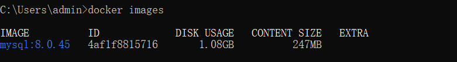

### 3.1.2.启动mysql容器(假如密码为123456)

```sh
docker run -d --name mysql-db -p 9999:3306 -e MYSQL_ROOT_PASSWORD=123456 mysql:8.0.45

注意:如果出现了问题,有可能之前mysql-db运行着,所以需要彻底停止并删除:
     docker rm -f mysql-db 后再 run
命令说明:
  1.docker run:使用docker工具执行某个容器
      
  2.-d:代表后台运行,就是不让这个程序霸占你的命令行窗口,默默在后台跑
      
  3.--name mysql-db:给容器取名字
    a.--name:给容器取个名字
    b.mysql-db:给这个容器真正取的名字 -> 后面要是想停,删,看日志,直接用这个名字即可,不用记一长串 ID
        
  4.-p 9999:3306:端口映射
    a.9999:自己主机对外用的端口 -> docker的容器中有mysql容器跑着,windows中的mysql也跑着,端口都是3306,会出现端口号冲突,这里相当于给容器中的mysql这个3306端口取一个别名
      别人访问自己电脑主机的9999端口=直接访问容器中的mysql的3306端口  
        
    b.3306:mysql自己默认用的端口
        
  5.-e MYSQL_ROOT_PASSWORD=123456:设置mysql管理员(root)密码
  
  6.mysql:8.0.45:这是镜像名称+版本号
    
```

> docker stop mysql-db # 停止
>
> docker start mysql-db # 启动
>
> docker rm mysql-db # 删除

```sh
用一句话解释就是:
  用 Docker 启动一个后台运行的 MySQL 容器，
  名字叫 mysql-db，
  把我电脑的 9999 端口映射到容器里 MySQL 的 3306 端口，
  MySQL 的管理员密码设为 123456，
  使用的 MySQL 版本是 8.0.45。
咱们以后怎么连这个容器中的mysql呢?
  1.主机:localhost
  2.端口:9999
  3.用户名:root
  4.密码:123456
```

## 3.2.python连接mysql

### 3.2.1.在本地dos命令窗口中安装pymysql依赖

```sh
#安装pymysql依赖
pip install pymysql
    
    
#查看本地依赖    
pip list     
```

### 3.2.2.测试代码

```sh
在本地创建test.py
import pymysql

# 连接MySQL（参数与启动容器时一致）
conn = pymysql.connect(
  host='localhost', # 本地地址，端口已映射
  port=9999,     # 映射后的端口
  user='root',    # MySQL默认用户名
  password='123456', # 启动容器时设置的密码
  database='mysql', # MySQL默认数据库
  charset='utf8mb4', # 避免中文乱码
  cursorclass=pymysql.cursors.DictCursor # 可选，让查询结果更易读
)

cursor = conn.cursor()
# 测试连接：查询MySQL版本
cursor.execute("SELECT VERSION()")
print(f"MySQL版本：{cursor.fetchone()['VERSION()']}")

# 关闭连接
cursor.close()
conn.close()
print("基础版：Python连接MySQL（8.0.45）成功！")
进入到test.py目录对应的cmd窗口:输入  python test.py   -> 执行python代码
```


# 4.进阶案例_windows下Python连接MySQL

## 4.1.案例说明

```sh
1.目的:我们要实现一键封装打包,到处运行
2.思路:
  a.在windows中写一个python连接mysql的程序,运行成功之后,利用docker打包
  b.然后将这个包放到linux上运行
  c.运行的时候,我们希望linux上的环境和打包好的环境一毛一样
      
3.注意:进阶版是实际开发中最常用的方式
    
4.用到的核心工具:实现一键启动多容器,环境可复用
  a.Dockerfile
  b.Docker Compose
```

## 4.2.核心工具说明

### 4.2.1.Dockerfile工具

```sh
创建自定义镜像(包括python环境+依赖+脚本的镜像),避免手动配置环境
```

### 4.2.2.Docker Compose工具

```sh
多容器的"一键管理工具",通过yaml配置文件,一键启动或停止多个关联容器(比如mysql和python容器),简化"部署"   
```

## 4.3.操作步骤

### 4.3.1.步骤1:新建项目目录_docker-python-mysql

```sh
在本地某个位置上创建一个文件夹,命名为docker-python-mysql(文件夹名可以自定义)
```

### 4.3.2.步骤2:编写Dockerfile(构建python自定义镜像)

```sh
1.进入docker-python-mysql文件夹,新建一个文本文档,删除后缀名,取名为Dockerfile
2.复制以下代码
# 1. 指定基础镜像：Python 3.12（稳定版，兼容性好）
FROM python:3.12

# 2. 设置docker内的工作目录，用于存放脚本和依赖
WORKDIR /app

# 3. 复制本地项目目录下的所有文件（test_mysql.py、Dockerfile等），到docker的/app目录
COPY . /app

# 4. 安装Python依赖（pymysql），使用清华源加速下载，避免超时（初学者无需修改）
RUN pip install pymysql cryptography 

# 5. 容器启动时，自动执行的命令：运行Python连接脚本->相当于在cmd中输入python test_mysql.py命令运行py脚本
CMD ["python", "test_mysql1.py"]
```

> ```sh
> 💡 关键理解：通过以上指令，Docker会自动构建一个包含Python 3.12、pymysql依赖的镜像(去docker仓库去下载)，无需我们在宿主机中手动下载python解释器,安装Python环境了
> ```

### 4.3.3.步骤3:编写docker-compose.yml(配置多容器)

```yaml
1.在docker-python-mysql目录下,新建一个文本文件,命名为docker-compose.yml(后缀为yml,不能错)
2.复制以下代码    
# 核心功能：一键启动MySQL容器+Python应用容器，实现容器间通信、数据持久化

services:
 # 容器1：MySQL服务容器（命名为mysql-db，容器间可通过该名称访问）
 mysql-db:
  # 基础镜像：指定MySQL 8.0.45版本（稳定性高，适配Python连接）
  # 先去docker中找有么有这个mysql镜像,如果没有就去docker仓库中找
  image: mysql:8.0.45
  # 重启策略：容器意外关闭/服务器重启时，自动重启（保证服务可用性）
  restart: always
  # 环境变量：配置MySQL核心参数（无需手动进入容器修改）
  environment:
   MYSQL_ROOT_PASSWORD: "123456" # root用户密码（自定义，Python连接需一致）
   MYSQL_DATABASE: "test_db"   # 自动创建初始数据库（无需手动建库）
   # 字符编码配置：适配MySQL 8.0+，避免中文乱码/连接报错
   MYSQL_INITDB_ARGS: "--character-set-server=utf8mb4 --collation-server=utf8mb4_unicode_ci"
  # 端口映射：本地9999端口 → 容器内3306端口（避免与本地MySQL端口冲突）
  ports:
   - "9999:3306"
  # mysql产生的数据放到下面设置的指定位置,映射的是/var/lib/mysql(这个才是真正存放mysql数据的地方)
  # 只不过可以使用我们自己设置的指定位置去映射
  volumes:
   - D:/mysql/docker-mysql:/var/lib/mysql
  # 加入自定义网络：与Python容器互通（容器间通信的基础）
  networks:
   - app-network
  # 健康检查：判断MySQL服务是否真正就绪（而非仅容器启动），解决连接拒绝问题
  healthcheck:
   # 在cmd下使用mysqladmin ping -h localhost -uroot -p123456命令检测mysql是否能ping通
   test: ["CMD", "mysqladmin", "ping", "-h", "localhost", "-uroot", "-p123456"] # 检测MySQL是否可ping通
   interval: 3s     # 每3秒检查一次
   timeout: 3s      # 单次检查超时时间3秒
   retries: 10      # 最多重试10次（覆盖MySQL启动初始化时间）
   start_period: 5s   # 容器启动后，延迟5秒再开始检查（避免过早检测）

 # 容器2：Python应用容器（命名为python-app，业务代码运行载体）其实就是我们写的python项目
 python-app:
  # 构建规则：基于当前目录下的Dockerfile，构建自定义Python镜像
  # 由于是我们写的项目，所以不会去docker仓库中去下载，而是基于Dockerfile构建python镜像
  build: .
  # 依赖条件：等待mysql-db容器的健康检查通过后，再启动本容器（核心修复：解决MySQL未就绪问题）
  depends_on:
   mysql-db:
    condition: service_healthy # 仅当MySQL服务就绪时，才启动Python容器
  # 环境变量：传递MySQL连接信息（Python代码可通过os.getenv获取，无需硬编码）
  environment:
   MYSQL_HOST: "mysql-db"  # 容器间通信地址：直接填MySQL容器名（无需IP）
   MYSQL_PORT: "3306"    # MySQL容器内端口（非本地9999）因为是内部访问mysql，外部访问用9999
   MYSQL_USER: "root"    # 与MySQL容器的用户名一致
   MYSQL_PASSWORD: "123456" # 与MySQL容器的密码一致（修改需同步）
   MYSQL_DB: "test_db"    # 与MySQL容器自动创建的数据库名一致
  # 加入自定义网络：与MySQL容器在同一网络，才能通信
  networks:
   - app-network

# 自定义网络：桥接模式（Docker默认），保证两个容器相互可见、可访问
networks:
 app-network:
  driver: bridge
```

### 4.3.4.步骤4:在docker-python-mysql下编写python程序(test_mysql1.py)

```python
import pymysql
import os
import sys
import time

# 新增：MySQL连接重试函数，解决服务未就绪问题
def get_mysql_conn():
  max_retries = 10 # 最多重试10次
  retry_delay = 2  # 每次重试间隔2秒
  for i in range(max_retries):
    try:
      conn = pymysql.connect(
        host=os.getenv('MYSQL_HOST', 'localhost'),
        port=int(os.getenv('MYSQL_PORT', 3306)),
        user=os.getenv('MYSQL_USER', 'root'),
        password=os.getenv('MYSQL_PASSWORD', '123456'),
        database=os.getenv('MYSQL_DB', 'test_db'),
        charset='utf8mb4',
        connect_timeout=3
      )
      print(f"✅ 第{i+1}次尝试：MySQL连接成功！")
      return conn
    except pymysql.err.OperationalError as e:
      print(f"❌ 第{i+1}次尝试：MySQL连接失败 - {e}")
      if i < max_retries - 1:
        print(f"⏳ 等待{retry_delay}秒后重试...")
        time.sleep(retry_delay)
      else:
        raise Exception("❌ 重试10次后仍无法连接MySQL，请检查容器配置！") from e

# 主逻辑
if __name__ == "__main__":
  conn = None
  cursor = None
  try:
    # 获取带重试的数据库连接
    conn = get_mysql_conn()
    cursor = conn.cursor()

    # 原测试逻辑不变
    cursor.execute("SELECT DATABASE()")
    db_name = cursor.fetchone()[0]
    print(f"当前连接的数据库：{db_name}")

    cursor.execute("CREATE TABLE IF NOT EXISTS test_table (id INT PRIMARY KEY AUTO_INCREMENT, name VARCHAR(50))")
    cursor.execute("INSERT INTO test_table (name) VALUES ('Docker Compose测试')")
    conn.commit()

    cursor.execute("SELECT * FROM test_table")
    data = cursor.fetchall()
    print("test_table中的测试数据：", data)

    # 输出Python版本
    python_version = sys.version
    print(f"\n当前运行的Python版本：{python_version}")
    print("🎉 Docker Compose环境下，Python连接MySQL（8.0.45）成功！")

  except Exception as e:
    print(f"\n❌ 程序执行失败：{e}")
    if conn:
      conn.rollback() # 出错回滚事务
  finally:
    # 确保资源关闭
    if cursor:
      cursor.close()
    if conn:
      conn.close()
```

### 4.3.5.步骤5:执行程序

```sh
打开windows终端(cmd窗口)，进入docker-python-mysql目录，执行以下命令(可直接复制,按需求选择)
# 1. 停止基础案例中启动的mysql-db容器，否则端口冲突 ,因为刚才做基础案例的时候mysql-db启动过一次了
docker ps   #查看正在运行的容器
docker stop mysql-db     # 停止运行中的容器
docker ps -a  #查看正在运行的容器  包括已经停止的

# 2. 一键启动所有容器（后台运行，首次执行会自动构建Python镜像、下载MySQL镜像）
#  mysql镜像之前我们已经下载了,所以会直接创建mysql容器,但是python镜像需要下载以及构建python容器
docker compose up -d

# 2. 查看所有容器的运行状态
docker compose ps

# 3. 查看Python容器的运行日志（验证Python是否成功连接MySQL）
docker compose logs python-app
```

> 如果启动失败,可以尝试其他命令
>
> ```sh
> # 1. 停止并删除所有容器（数据保留，下次启动可恢复）
> docker compose down
> 
> # 2. 停止并删除所有容器+数据卷（数据清空，慎用）
> docker compose down -v
> 
> # 3. 重新构建Python镜像，并启动所有容器（修改Dockerfile后需执行）
> docker compose up -d --build
> 
> # 4. 彻底清理旧资源（关键：避免缓存干扰） 删除所有镜像
> docker-compose down --rmi all && docker system prune -af
> ```

# 5.Ubuntu下docker的安装与卸载

## 5.1.说明

```sh
1.目的:我们需要将docker-python-mysql这个目录下的环境移植到linux上去跑
2.操作:
  a.linux上需要安装docker
  b.然后将docker-python-mysql这个目录上传到linux上
  c.使用命令:docker compose up -d (一键启动所有容器)
```

## 5.2.docker的安装

```sh
为避免Ubuntu安装Docker时，依赖包下载缓慢，先替换Docker软件源为国内阿里云源，再执行安装步骤，终端逐行执行以下命令
# 1. 卸载可能存在的旧版本Docker（若有）
sudo apt remove -y docker docker-engine docker.io containerd runc

# 2. 后续参考docker官网-> 直接复制里面的命令,直到开启docker命令
https://docs.docker.com/engine/install/ubuntu/#install-using-the-repository 

#如果网慢访问不了,就直接运行下面的命令
# Add Docker's official GPG key:
sudo apt update
sudo apt install ca-certificates curl
sudo install -m 0755 -d /etc/apt/keyrings

#如果执行sudo curl -fsSL...这个长命令出现问题,重新执行这个命令
sudo curl -fsSL https://download.docker.com/linux/ubuntu/gpg -o /etc/apt/keyrings/docker.asc
sudo chmod a+r /etc/apt/keyrings/docker.asc

# Add the repository to Apt sources:从下一行开始到EOF结束一起粘贴执行
sudo tee /etc/apt/sources.list.d/docker.sources <<EOF
Types: deb
URIs: https://download.docker.com/linux/ubuntu
Suites: $(. /etc/os-release && echo "${UBUNTU_CODENAME:-$VERSION_CODENAME}")
Components: stable
Architectures: $(dpkg --print-architecture)
Signed-By: /etc/apt/keyrings/docker.asc
EOF

sudo apt update
sudo apt install docker-ce docker-ce-cli containerd.io docker-buildx-plugin docker-compose-plugin
sudo systemctl status docker
sudo systemctl start docker

# 3. 验证安装（查看版本，无报错即成功）
docker --version
docker compose version

# 4. 设置docker开机自启 可以先不执行
sudo systemctl enable docker --now

# 5. 免sudo运行
sudo usermod -aG docker $USER
```

> ❤️注意：执行完此步后，请关闭当前终端并重新连接，配置才会生效

## 5.3.docker镜像源配置

```sh
安装完成后，配置国内镜像源，提升Ubuntu下Docker镜像下载速度，终端逐行执行以下命令
```

### 5.3.1.创建/修改镜像源配置文件

```sh
sudo vim /etc/docker/daemon.json
```

### 5.3.2.添加镜像源配置

```sh
{
  "registry-mirrors": [
    "https://docker.m.daocloud.io",
    "https://mirror.aliyuncs.com"
  ]
}
```

### 5.3.3.重启docker服务,使配置生效

```sh
sudo systemctl daemon-reload  # 重新加载配置
sudo systemctl restart docker  # 重启Docker服务
```

### 5.3.4.验证配置是否成功

```sh
docker info
查看输出结果中“Registry Mirrors”字段，显示配置的国内镜像源即可
```


## 5.4.docker的卸载

```sh
若Ubuntu下Docker安装失败、版本不兼容，或无需使用，按以下步骤彻底卸载
# 1. 停止Docker服务
sudo systemctl stop docker

# 2. 卸载Docker相关软件包
sudo apt remove -y docker-ce docker-ce-cli containerd.io docker-compose-plugin

# 3. 删除Docker数据和配置文件（彻底清理，可选）
sudo rm -rf /var/lib/docker
sudo rm -rf /var/lib/containerd

# 4. 验证卸载：执行以下命令，无版本输出即成功
docker --version
```

# 6.环境移植到Ubuntu

```sh
1.移植核心目标：将Windows下的“MySQL（8.0.45）+ Python”完整环境，移植到Ubuntu系统，无需重新配置，数据保留，两种移植方式
  a.在线下载式（简单，适合网络良好场景）
  b.离线同步式（无网络也能用，环境 100% 一致）
```

## 6.1.准备工作(两种方式都需要执行)

```sh
1.在windows中进入cmd窗口,进入到docker-python-mysql目录,执行以下命令:
  docker compose down  #关闭当前目录下 docker-compose.yml 里的所有容器，并且把这些容器彻底删除（但镜像和数据还在）
  

2.确认docker-python-mysql目录包含以下文件(后续需要上传到Ubuntu上)
  a.docker-compose.yml（容器配置文件）
  b.test_mysql1.py（Python 连接脚本，可选，镜像已包含）
  c.Dockerfile（可选，离线同步式无需）
```

## 6.2.方式1:在线下载(简单,推荐网络良好的环境)

### 6.2.1.上传文件

```sh
将 windows下的docker-python-mysql目录（包含docker-compose.yml等核心文件）上传到Ubuntu 的/home/你的用户名/docker-python-mysql目录下。
```

### 6.2.2.Ubuntu终端操作(一键启动)

```sh
# 1. 进入项目目录
cd /home/你的用户名/docker-python-mysql

# 2. 修改docker-compose.yml的MySQL数据卷路径（适配Ubuntu）
vim docker-compose.yml

# 找到mysql-db的volumes行，修改为：
# volumes:
#   - /home/你的用户名/mysql-data:/var/lib/mysql

# 3. 一键启动所有容器（自动下载MySQL镜像、构建Python镜像）
docker compose up -d

# 4. 验证移植成功
docker compose logs python-app
# 看到“连接成功”和测试数据，说明移植完成
```

## 6.3.方式2:离线同步式（无网络可用，环境 100% 一致）

### 6.3.1.查看windows本地镜像(确认需要打包的镜像)

```sh
# 列出本地镜像，记录关键信息
docker images
# 输出示例（重点关注REPOSITORY和TAG列）：
REPOSITORY                          TAG          IMAGE ID
mysql                               8.0.45      xxxxxxxx  # MySQL官方镜像
docker-python-mysql-python-app   latest     yyyyyyyy  # 自定义Python镜像
```

### 6.3.2.打包 MySQL 8.0.45 镜像和自定义python镜像(离线文件)

```sh
# 进入docker-python-mysql项目目录
# 打包MySQL镜像为tar文件（存到项目目录下）
docker save mysql:8.0.45 -o ./mysql-8.0.45.tar

# 替换【Python镜像名】为实际名称（如docker-python-mysql-python-app）
docker save 【Python镜像名】:latest -o ./python-app.tar
```

### 6.3.3.将必要文件上传到Ubuntu上

```sh
将docker-python-mysql目录上传到 /home/你的用户名下
    
将  mysql-8.0.45.tar 和  python-app.tar 以及 docker-compose.yml放到次目录中
```

### 6.3.4.Unbuntu离线导入镜像

```sh
# 1. 进入项目目录
cd /home/你的用户名/docker-python-mysql

# 2. 导入MySQL镜像（离线，无需联网）
docker load -i ./mysql-8.0.45.tar

# 3. 导入Python自定义镜像（离线）
docker load -i ./python-app.tar

# 4. 验证镜像导入成功（能看到两个镜像）
docker images
```

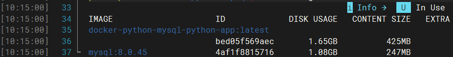

### 6.3.5.修改docker-compose.yml

```sh
# 1. 修改docker-compose.yml的MySQL数据卷路径（适配Ubuntu）
vim docker-compose.yml

# 找到mysql-db的volumes行，修改为：
# volumes:
#   - /home/你的用户名/mysql-data:/var/lib/mysql
#
#  python-app:
#    # 关键修改：替换build: . 为导入的镜像名
#    image: docker-python-mysql-python-app:latest
#


# 2. 一键启动所有容器（自动下载MySQL镜像、构建Python镜像）
docker compose up -d

# 3. 验证移植成功
docker compose logs python-app
# 看到“连接成功”和测试数据，说明移植完成
```

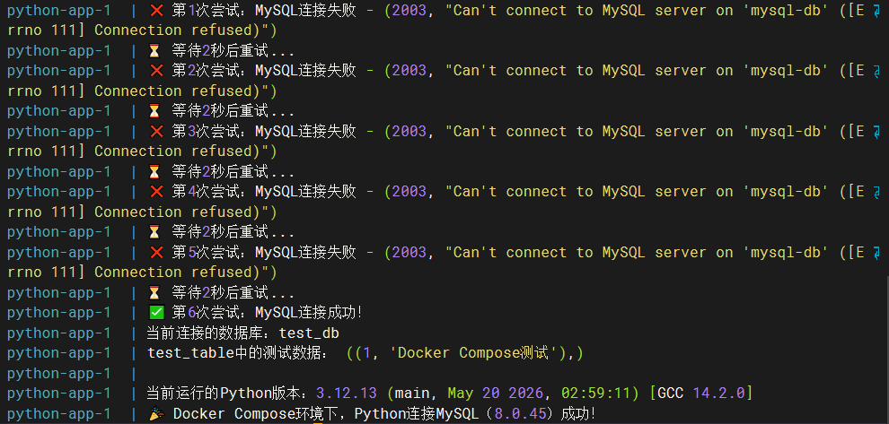

# 7.docker常用命令

## 7.1.镜像管理

| **命令**                                 | **作用**                        | **示例**                                          |
| ---------------------------------------- | ------------------------------- | ------------------------------------------------- |
| docker pull <镜像名:版本>                | 拉取镜像（版本不写默认 latest） | docker pull mysql:8.0.26                          |
| docker images                            | 查看本地所有镜像                | docker images（精简）docker images -a（含中间层） |
| docker rmi <镜像ID/镜像名>               | 删除单个镜像                    | docker rmi mysql:8.0.26                           |
| docker rmi -f $(docker images -q)        | 强制删除所有本地镜像（慎用）    | -                                                 |
| docker search <关键词>                   | 搜索 Docker Hub 镜像            | docker search mysql                               |
| docker build -t <自定义镜像名:版本> .    | 基于 Dockerfile 构建镜像        | docker build -t my-app:1.0 .                      |
| docker save -o <保存文件名.tar> <镜像名> | 导出镜像为压缩包（离线传输）    | docker save -o mysql8.tar mysql:8.0.26            |
| docker load -i <压缩包.tar>              | 导入本地镜像压缩包              | docker load -i mysql8.tar                         |

## 7.2.容器管理

| **命令**                        | **作用**                          | **示例**                                                     |
| ------------------------------- | --------------------------------- | ------------------------------------------------------------ |
| docker run [参数] <镜像名>      | 创建并启动容器（最核心）          | docker run -d --name mysql-db -p 3306:3306 -e MYSQL_ROOT_PASSWORD=123456 mysql:8.0.26 |
| docker ps                       | 查看正在运行的容器                | docker ps（精简）docker ps -a（含已停止的）                  |
| docker start <容器名/容器ID>    | 启动已停止的容器                  | docker start mysql-db                                        |
| docker stop <容器名/容器ID>     | 停止运行中的容器（优雅停止）      | docker stop mysql-db                                         |
| docker restart <容器名/容器ID>  | 重启容器                          | docker restart mysql-db                                      |
| docker rm <容器名/容器ID>       | 删除已停止的容器                  | docker rm mysql-db                                           |
| docker rm -f <容器名/容器ID>    | 强制删除运行中的容器              | docker rm -f mysql-db                                        |
| docker rm -f $(docker ps -aq)   | 强制删除所有容器（慎用）          | -                                                            |
| docker exec -it <容器名> <命令> | 进入容器交互终端（最常用）        | docker exec -it mysql-db bash（进容器）docker exec -it mysql-db mysql -uroot -p（直接进 MySQL） |
| docker logs <容器名>            | 查看容器日志                      | docker logs mysql-db（实时）docker logs -f mysql-db（实时跟踪） |
| docker inspect <容器名/镜像名>  | 查看容器 / 镜像详细信息（排障用） | docker inspect mysql-db                                      |

## 7.3.docker compose常用命令

| 分类     | 命令                                                     | 作用                                                         | 教程适配示例                                                 |
| -------- | -------------------------------------------------------- | ------------------------------------------------------------ | ------------------------------------------------------------ |
| 核心启动 | docker compose up -d                                     | 后台启动项目：自动下载 / 构建镜像、创建容器、启动服务，处理依赖 | docker compose up -d（启动 MySQL+Python）                    |
| 核心启动 | docker compose up -d mysql-db                            | 后台仅启动指定服务（如 MySQL）                               | docker compose up -d mysql-db（仅启动 MySQL）                |
| 核心启动 | docker compose up python-app                             | 前台启动指定服务（如 Python），实时输出日志                  | docker compose up python-app（前台运行 Python 脚本）         |
| 停止管理 | docker compose stop                                      | 停止所有运行中的服务（保留容器）                             | docker compose stop（停止 MySQL+Python）                     |
| 停止管理 | docker compose stop mysql-db                             | 仅停止指定服务（如 MySQL）                                   | docker compose stop mysql-db（仅停止 MySQL）                 |
| 停止管理 | docker compose down                                      | 停止并删除容器 + 自定义网络，保留镜像和数据卷                | docker compose down（停止项目，保留数据）                    |
| 状态查看 | docker compose ps                                        | 查看运行中的容器状态                                         | docker compose ps（检查 MySQL 是否运行）                     |
| 状态查看 | docker compose ps -a                                     | 查看所有容器状态（含已退出的 Python 容器）                   | docker compose ps -a（查看 Python 容器状态）                 |
| 日志调试 | docker compose logs python-app                           | 查看 Python 服务的全部日志                                   | docker compose logs python-app（查看 Python 连接结果）       |
| 日志调试 | docker compose logs -f python-app                        | 实时跟踪 Python 服务的日志                                   | docker compose logs -f python-app（实时看 Python 执行过程）  |
| 镜像构建 | docker compose build python-app                          | 仅构建 Python 服务的镜像（不启动）                           | docker compose build python-app（构建 Python 镜像）          |
| 镜像构建 | docker compose up -d --build                             | 强制重建所有镜像并启动项目                                   | docker compose up -d --build（重建所有镜像并启动）           |
| 镜像构建 | docker compose up -d --build python-app                  | 仅重建 Python 镜像并启动                                     | docker compose up -d --build python-app（重建 Python 并启动） |
| 脚本执行 | docker compose run --rm python-app                       | 临时运行 Python 脚本，执行后自动删除容器                     | docker compose run --rm python-app（重新执行 Python 脚本）   |
| 容器调试 | docker compose exec mysql-db mysql -uroot -p123456       | 进入 MySQL 容器，打开 MySQL 控制台                           | docker compose exec mysql-db mysql -uroot -p123456           |
| 清理重置 | docker compose down -v                                   | 停止并删除容器 + 网络 + 数据卷（清空 MySQL 数据，慎用）      | docker compose down -v（清空 MySQL 数据）                    |
| 清理重置 | docker compose down --rmi all                            | 停止并删除容器，删除项目关联的所有镜像                       | docker compose down --rmi all（删除 MySQL+Python 镜像）      |
| 清理重置 | docker compose down --rmi all && docker system prune -af | 彻底清理容器、镜像、全局未使用资源                           | docker compose down --rmi all && docker system prune -af（完全重置） |