## 1、JS介绍
### JavaScript是什么
JavaScript是基于`客户端`(浏览器)的编程语言。

### JavaScript的组成
JavaScript由`ECMAScript`和`Web APIs`（DOM 和 BOM）组成。

`DOM`是操作文档，比如对页面元素的操作。

`BOM`是操作浏览器，比如页面弹窗、存储数据。

### JavaScript的书写位置
+ 行内 JavaScript：代码写在标签内部
+ 内部 JavaScript：直接写在html文件里，用`script标签`包住，`script标签`要写在`</body>`上面
+ 外部 JavaScript：代码写在`.js`结尾的文件里，通过`<script src="my.js"></script>`引入到HTML页面中

### JavaScript的注释
+ 单行注释：`//`
+ 多行注释：`/* */`

### JavaScript的结束符
分号`;`，可写可不写。

### 输入和输出语法
```javascript
//输入语法，用于弹出一个对话框提示用户输入内容
prompt('请输入你的姓名：')

//输出语法1，用于向body输入内容
document.write('要输出的内容')

//输出语法2，用于页面弹出警告对话框
alert('要输出的内容')

//输出语法3，用于控制台打印
console.log('控制台打印的内容')
```

### 字面量
字面量是计算机中描述的事/物，比如数字字面量`100`、字符串字面量`''`、数组字面量`[]`、对象字面量`{}`等等。

## 2、变量
### 变量是什么
变量是一个用于存储数据的`容器`，可以理解为是一个盒子。

### 变量的基本使用
变量的基本使用包括`声明变量`、`变量赋值`、`更新变量`等，声明变量的同时直接赋值叫做变量`初始化`。

```javascript
//声明变量
let age
    
//变量赋值
age = 18
    
//变量初始化
let age = 18
    
//更新变量
age = 20
    
//声明多个变量
let age = 18，uname = 'zhangsan'   
```

### 变量命名规则与规范
1. 规则
    - 不能使用关键字，如：let、var、if、for等
    - 严格区分大小写
    - 只能用`字母`、`数字`、`_`、`$`组成，且数字不能开头
2. 规范
    - 见到名字知道意思
    - 小驼峰命名法，如：userName

### let 和 var 的区别
在旧的 JavaScript 中使用 var 声明变量而不是使用 let 。

var 在开发中一般不使用，只是我们在老的程序中可以看到。

let 为了解决 var 的一些问题。

var 声明：

+ 可以先使用再声明（不合理）
+ 声明过的变量可以重复声明（不合理）
+ 变量提升、全局变量、没有块级作用域等等

## 3、常量
### 常量是什么
使用`const`声明的变量称为常量，常量是不会变化的值。

常量声明时必须赋值，不允许重新赋值。

```javascript
const PI = 3.14   
```

### 用 let 还是 const
变量声明时有三个 var let 和 const，我们应该用哪个呢？

建议：

+ const 优先，然后 let ,var是老派写法，问题很多，不做考虑
+ 数组和对象使用 const 来声明
+ 如果基本数据类型的值或者引用类型的地址发生改变时，需要用let

## 4、数据类型
JS数据类型分为`基本数据类型`和`引用数据类型`。

基本数据类型： 数字型（number）、字符串型（string）、布尔型（boolean）、未定义型（undefined）、空类型（null）。

引用数据类型：object对象。

### 数字型（number）
数字型可以是整数、小数、正数、负数，如：`let num = 1.2` 。

算术运算符（数字可以进行很多操作）：加（+）、减（-）、乘（*）、除（/）、取模（%）。

计算错误或未定义会显示NaN（not a number），如`console.log('老师' - 2)`;对任何NaN操作返回NaN。

算术运算符的优先级：

+ 优先级相同时从左到右执行
+ 加、减优先级相同
+ 乘、除、取模 优先级相同
+ 乘、除、取模 优先于 加、减
+ 使用括号()可以提升优先级

### 字符串型（string）
通过单引号（' '）、双引号（” “）、反引号（` `）包裹的数据都叫字符串，如：`let uname = '小明'`。

单引号（' '）和双引号（” “）可以相互嵌套，必要时可以使用转义字符`\`。

通过`+`运算符可以实现字符串拼接,如：`console.log('他今年' + age + '岁')`。

用`模板字符串`反引号（` `）也可以实现字符串拼接，拼接变量时变量用`${}`包住。如：`console.log(`他今年${age}岁`)`

### 布尔型（boolean）
要是肯定或否定时计算机使用的是布尔型，他有两个固定值`true`和`false`，如：`let isMarry = false`。

### 未定义型（undefined）
一个变量只声明未赋值默认值为undefined。

工作中我们可以通过接收的参数是否为undefined判断是否有数据传递过来。

### 空类型（null）
空类型（null）表示”无“、”空“、”值未知“的特殊值，如：`let obj = null` 。

工作中通常把 null 作为未创建的对象。

null 与 undefined 的区别：

+ null 表示赋值了但是内容为空，计算时 null 为0。
+ undefined 表示没有赋值，undefined 与任何计算都为 NaN。

## 5、类型转换
### 如何测数据类型
`typeof`运算符可以返回检测的数据类型，它有两种语法形式：

1. 作为运算符：typeof 数据（常用的写法）
2. 函数形式：typeof(数据)

### 为什么需要类型转换
JavaScript是弱数据类型，即JavaScript不知道变量到底属于哪种数据类型，只有赋值了才清楚。

坑：使用表单、prompt获取过来的数据默认是字符串类型，不能直接简单地进行加法运算。

数据类型转换就是把一种数据类型的变量转换成我们需要的数据类型。

### 隐式转换
某些运算符执行时，系统内部自动将数据进行转换，这种转换称为隐式转换。

规则：

+ 除了+以外的算术运算符都会把数据转成数字类型
+ 任何数据和字符串相加的结果都是字符串
+ +作为正号时可以转换成数字类型
+ ' '、null、false 经过数字转换后定为0
+ undefined 经过数字转换后变为NaN

### 显示转换
显示转换是自己写代码告诉系统转成什么类型。

转换为数字型：

+ `Number(数据)`：转换为数值型
+ `parseInt(数据)`：转换为数值型，只保留整数
+ `parseFloat(数据)`：转换为数值型，可以保留小数

转换为boolean型：`Boolean(内容)`

+ ' '、0、undefined、null、false、NaN 转换为布尔值后都为false，其余为true。

## 6、运算符
### 赋值运算符
赋值运算符是对变量进行赋值的运算符，可以简化代码。

赋值运算符`=`：将右边的值赋予左边，要求左边必须是一个容器。

其他赋值运算符：

+ `+=`
+ `-=`
+ `*=`
+ `/=`
+ `%=`

### 一元运算符
根据表达式的个数，可以分为一元运算符、二元运算符、三元运算符。

一元运算符中通常是自增运算符（++）和自减运算符（--），表示自增或自减1，一般用于记数。

自增运算符又分为前置自增（++i）、后置自增（i++），单独单独使用时二者没有区别，如果参与运算二者就有区别：

+ 前置自增（++i）：先自增后运算，如：`let i = 1 ; console.log(++i + 2)` 结果为4
+ 后置自增（i++）：先运算后自增，如：`let i = 1 ; console.log(i++ + 2) `结果为3

### 比较运算符
比较运算符可以用于比较运算,返回值为true或false。

不同类型之间比较会发生隐式转换，最终转换成number类型再比较。

字符串比较的是ASCII码，从左到右依次比较，如果第一位一样再比较第二位，以此类推。

NaN 不等于任何值,包括它本身。

尽量不要比较小数，因为小数有精度问题。

比较运算符有：

+ `>`：左边是否大于右边
+ `<`：左边是否小于右边
+ `>=`：左边是否大于等于右边
+ `<=`：左边是否小于等于右边
+ `==`：左右两边值是否相等
+ `===`：左右两边值和类型是否相等,开发中推荐使用
+ `!==`：左右两边是否不全等

### 逻辑运算符
逻辑运算符用于逻辑判断，结果为true或false。

逻辑运算符有：

+ 逻辑与（&&）：一假则假
+ 逻辑或（||）：一真为真
+ 逻辑非（ ! ）：真假相反

逻辑短路：逻辑与（&&）左边为false就短路，不再执行右边；逻辑或（||）左边为true就短路，不再执行右边。

### 运算符的优先级
| 优先级 | 运算符 | 顺序 |
| --- | --- | --- |
| 1 | 小括号 | （） |
| 2 | 一元运算符 | ++  --  ！ |
| 3 | 算术运算符 | 先  *  /  后  +  - |
| 4 | 关系运算符 | >  >=  <  <= |
| 5 | 相等运算符 | ==  !=  ===  !== |
| 6 | 逻辑运算符 | 先  &&  后  || |
| 7 | 赋值运算符 | = |
| 8 | 逗号运算符 | ， |


## 7、语句
### 表达式和语句
表达式是可以被求值的代码，写在赋值语句的右侧，如：num++ 、x = 7 、3+4 等。

语句不一定有值，如alert弹出对话框、 console.log()控制台打印输出。

### 分支语句
#### if语句
if语句有3种：单分支、双分支、多分支。

1. 单分支if语句语法：

```javascript
if(条件){
  满足条件要去执行的代码
}
```

+ 条件为true时执行大括号里面的代码，为false不执行。
+ 小括号内的结果不是布尔类型时，会发生隐式转换为布尔类型。
    - 除了`0`所有数字都为真
    - 除了`' '`所有字符串都为真
2. 双分支if语句语法：

```javascript
if(条件){
  满足条件要去执行的代码
}else{
  不满足条件要去执行的代码
}
```

3. 多分支if语句语法：

```javascript
if(条件1){
  代码1
}else if(条件2){
  代码2
}else if(条件3){
  代码3
}else{
  代码n
}
```

#### 三元运算符
三元运算符和if双分支作用相同，但是比if双分支写法更简单，一般用来取值。

```javascript
条件？满足条件执行的代码:不满足条件执行的代码	
```

#### switch语句
```javascript
switch(数据){
  case 值1:
    代码1
    break
  case 值2:
    代码2
    break
  default:
    代码n
    break
}
```

+ switch语句一般用于等值判断，不适合期间判断
+ switch语句一般配合break关键字使用，没有break会造成case穿透

### 循环语句
#### 断点调试
断点调试可以在学习中帮助我们更好理解代码运行，工作时可以更快找到bug。

过程：

1. 浏览器按F12打开开发者工具
2. 点击sources一栏
3. 点击选择代码文件
4. 打断点并刷新浏览器

#### while循环
```javascript
变量起始值
while(终止条件){
  循环体
  变量变化量
}
```

+ 循环的三要素：①变量起始值  ②终止条件  ③变量变化量
+ break：退出循环
+ continue：结束本次循环，继续后面的循环

#### for循环
```javascript
for(变量起始值;终止条件;变量变化量){
  循环体
}
```

+ for循环通常用来遍历数组
+ continue和break在for循环中也适用
+ for循环里面可以嵌套for循环

## 8、数组
### 数组是什么
数组是一种可以按顺序保存数据的数据类型。

如果有多个数据，可以用数组保存起来，然后放到一个变量中，管理非常方便。

数组可以存储任意类型的数据。

### 数组的基本使用
1. 一些术语：
+ 元素：数组中保存的每个数据叫做数组元素
+ 下标：数组中数据的编号，从0开始
+ 长度：数组中数据的个数，通过数组的length属性获得，如：`arr.length`
2. 声明语法

```javascript
var arr = ['张三','李四','王五','赵六']
```

3. 取值语法

```javascript
arr[0] // 张三
arr[3] // 赵六
```

4. 遍历数组

```javascript
for (let i = 0; i < arr.length; i++) {
  arr[i]	
}	
```

### 操作数组
1. 添加新的数据：
+ `arr.push(元素1, ... ,元素n)`：将一个或多个元素添加到数组的末尾，并返回该数组的新长度
+ `arr.unshift(元素1, ... ,元素n)`：将一个或多个元素添加到数组的开头，并返回该数组的新长度
2. 删除数组中的数据：
+ `arr.pop()`：从数组中删除最后一个元素，并返回该元素的值
+ `arr.shift()`：从数组中删除第一个元素，并返回该元素的值
+ `arr.splice(起始位置,删除个数)`：从数组中删除指定几个元素
3. 修改数组中的数据：`arr[下标] = 新值`
4. 查找数组中的数据：`arr[下标]`

### 常用数组方法
+ map方法：可以遍历数组处理数据，并且返回新的数组。

```javascript
const arr = ['red','blue','green']
const newArr = arr.map(function(ele,index){
  console.log(ele); //数组元素
  console.log(index); //数组索引号
  return ele + '颜色'
})
console.log(newArr);//['red颜色','bule颜色','green颜色']
```

+ join方法：用于把数组中的所有元素转换为一个字符串。

```javascript
const arr = ['red颜色', 'blue颜色', 'green颜色']
console.log(arr.join('') // red颜色blue颜色green颜色 空字符串''表示没有任何间隔
```

+ forEach方法：用于调用数组的每个元素，并将元素传递给回调函数，主要用于遍历数组的每个元素

```javascript
const arr = ['pink','red','green']
arr.forEach(function(item,index){//item是必须要写的，index可选
    console.log(${item})//依次打印每一个元素
    console.log(${index})//依次打印每一个元素的索引
})
```

+ filter方法：用于筛选数组，返回值是一个符合条件的数组，如果没有则返回一个空数组

```javascript
const arr = [100,200,300]
const newArr = arr.filter(functio(item,index){//item是必须要写的，index可选
    console.log(${item})//依次打印每一个元素
    console.log(${index})//依次打印每一个元素的索引
    return item >= 200
})
```

+ from方法：将伪数组转化为真数组

```javascript
const lis = doucment.querySelectorAll('ul li')
//lis.pop() 报错
const liss = Array.from(lis)
liss.pop()
```

+ every方法：检测数组中的元素是否满足指定条件，返回符合条件的第一个元素，没有则返回undefined

```javascript
const arr = [10,20,30]
const flag = arr.every(function(item){
    return item >= 10
})
console.log(flag)//true
```

+ find方法：查找元素  返回符合条件的第一个元素，没有则返回undefined

```javascript
const arr = [
    {
        name:'小米',
        price:1999
    },
    {
        name:'华为',
        price:3999
    }
]
arr.find(function(item){
    return item.name === '小米'  //返回值是第二条数据
})
```

+ reduce方法：返回累计处理的结果，经常用于求和等

```javascript
//没有初始值，上一次的值是第一个数组元素的值，每一次循环把返回值给作为下一次循环的上一次值
const arr = [1,5,8]
const total = arr.reduce(function(prev,current){
    return prev + current
})
//执行流程：
    // 上一次值    当前值    返回值  （第一次循环）
    //  1          5         6
    // 上一次值    当前值    返回值  （第二次循环）
    //  6          8         14

//有起始值，起始值为上一次值
const arr2 = [1,5,8]
const total2 = arr2.reduce(function(prev,current){
    return prev + current
},10)//起始值为10
//执行流程：
    // 上一次值    当前值    返回值  （第一次循环）
    //  10         1         11
    // 上一次值    当前值    返回值  （第二次循环）
    //  11         5         16
    // 上一次值    当前值    返回值  （第三次循环）
    //  16         8         24
```

## 9、函数
### 为什么需要函数
函数是执行特定任务的代码块。

函数可以实现代码复用提高开发效率。

### 函数使用
1. 函数的命名规范
+ 这个变量命名基本保持一致
+ 尽量小驼峰式命名法
+ 前缀应该为动词

| 动词 | 含义 |
| --- | --- |
| can | 判断是否可以执行某个动作 |
| has | 判断是否含有某个值 |
| is | 判断是否为某个值 |
| get | 获取某个值 |
| set | 设置某个值 |
| load | 加载某些数据 |


2. 函数声明语法

```javascript
function 函数名(形参1,形参2,...,形参n) {
    函数体
    return 返回值
}
```

+ 函数中可以不传递参数，也可以不传递返回值
+ 函数传递参数可以提高函数的灵活性
+ 调用函数时尽量保持参数的一致
+ return后面的代码不被执行，没有return时返回值默认为undefined
+ 函数的断点调试：进入函数内部看执行过程 F11
3. 函数调用语法

```javascript
函数名(实参1,实参2,...,实参n)	
```

### 作用域
代码中的名字的可用性的代码范围就是这个名字的作用域。

作用域分为全局作用域和局部作用域。

全局作用域作用于所有代码执行的环境（整个script标签内部或一个独立的JS文件）。

局部作用域作用于函数内的代码环境，跟函数有关系，所以也称为函数作用域。

坑：局部变量如果没有let声明直接赋值是全局变量，这种方式强烈不提倡。

变量的访问原则：在能够访问的情况下先找局部，没有再找全局。

### 匿名函数
匿名函数是没有名字的函数，无法直接使用。

匿名函数使用方式有两种：（1）函数表达式（2）立即执行函数。

函数表达式：将匿名函数给一个变量并通过变量名称进行调用，我们将这个称为函数表达式。

```javascript
// 声明
let fn = function (形参1,形参2,...,形参n) {
    函数体
    return 返回值
}
 
// 调用
fn()
```

+ 具名函数和函数表达式语法基本一致。
+ 具名函数调用可以写在任何位置，而函数表达式必须先声明后调用。

立即执行函数：用于避免全局变量之间的污染，不需要调用立即执行。

```javascript
// 写法1
(fcunction(){})();

//写法2
(function(){}());
```

## 10、对象
### 什么是对象
对象是一种数据类型，是无序的数据集合，可以详细的描述某个事物。

### 对象使用
1. 对象的组成
+ 属性：信息或特征（名词），比如 手机尺寸、颜色、重量等。
+ 方法：功能或行为（动词），比如 手机打电话、发短信、玩游戏等。
2. 声明对象

```javascript
let 对象名 = {
  属性名:属性值,
  方法名:匿名函数
}	
```

3. 对象方法的使用

```javascript
对象名.方法名()
```

4. 遍历对象

```javascript
for(let k in 对象名){ 
    obj[k] // k是属性值，是带引号的字符串。obj.k是错误的，结果为undefined。
} 
```

### 操作对象
1. 添加属性：`对象名.新属性名 = 新值`
2. 删除属性：` delete 对象名.属性名`
3. 修改属性：`对象名.属性名 = 新值`
4. 查找属性：①`对象名.属性名 `  ②`对象名['属性名']`

### 内置对象
内置对象是JavaScript内部提供的对象，包含各种属性和方法给开发者调用，如：document.write()、console.log()。

内置对象Math常用的方法：

+ random：生成0-1之间的随机数（包含0不包含1），如生成M-N的随机数：`Math.floor(Math.random() * (M - N + 1) + N)`
+ ceil：向上取整
+ floor：向下取证
+ max：取最大值
+ min：取最小值
+ pow：幂运算
+ abs：绝对值

字符串也有一个常用方法：`字符串.trim()`，作用是清除字符串左右两边的空格。

## 11、Web API 基本认知
### Web API 的作用和分类
Web API 就是使用 JS 去操作 html 和浏览器。

Web API 分为 DOM（文档对象模型）、BOM（浏览器对象模型）。

### 什么是DOM
DOM（ Document Object Model——文档对象模型）是用来呈现以及与任意HTML或XML文档交互的API。

即 DOM 是浏览器提供的一套专门用来操作网页内容的功能，用来开发网页内容特效和实现用户交互。

### DOM树
DOM树 是将 HTML 文档以树状结构直观的表现出来，我们称之为文档树或DOM树。

DOM树 直接体现了标签与标签之间的关系。

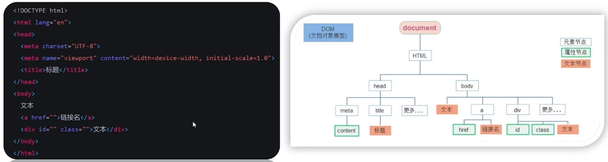

### DOM对象
DOM对象是浏览器根据 html 标签生成的 JS 对象。

所有标签属性都可以在这个对象上找到，修改这个对象的属性会自动映射到标签身上。

DOM的核心思想是把网页内容当作对象来处理。

document 对象是 DOM 提供的一个对象，网页所有内容都在里面，它提供的属性和方法都是来访问和操作网页内容的。

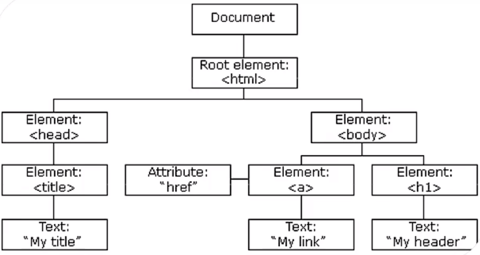

## 12、获取DOM对象
获取 DOM 对象就是用 JS 选择页面中的标签元素。

### 用CSS选择器获取
querySelector：选择匹配的第一个元素，返回值是匹配的第一个元素，一个HTMLElement对象，如果没有匹配到，则返回null。

```javascript
document.querySelector('css选择器')
```

querySelectorAll：选择匹配的多个元素，返回值是NodeList 对象集合。

```javascript
document.querySelectorAll('css选择器')
```

+ 得到的数组是一个伪数组，有长度有索引号，但是没有 pop()、push() 等数组方法
+ 想要得到里面的每一个对象，则需要通过遍历的方式获得

### 其他获取方法（了解）
```javascript
// 根据id获取一个元素
document.getElementById('nav')

// 根据标签获取多个元素
doucment.getElementsByTagName('div')

// 根据类名获取多个元素
document.getElementsByClassName('w')	
```

## 13、操作元素内容
### innerText属性
innerText属性可以将文本内容添加或更新到任意标签位置。

innerText属性显示为纯文本，不解析标签。

```javascript
// 获取标签内部的文字
标签对象.innerText

// 添加或修改标签内部的文字内容
标签对象.innerText = '添加的内容'
```

### innerHTML属性
innerHTML属性可以将文本内容添加或更新到任意标签位置。

innerHTML属性显示为纯文本，会解析标签。

```javascript
// 获取标签内部的文字
标签对象.innerHTML

// 添加或修改标签内部的文字内容
标签对象.innerHTML = '添加的内容'
```

### 二者的区别
innerText属性只能识别文本，不能解析标签。

innerHTML属性能解析文本，能解析标签。

## 14、操作元素属性
### 操作元素常用属性
通过JS设置或修改标签元素属性，比如通过src更换图片。

最常见的属性比如：href、title、src等。

语法：

```javascript
对象名.属性名 = '值'
```

### 操作元素样式属性
1. 通过 style 属性操作CSS

```javascript
对象名.style.样式属性 = '值'
```

+ 如果属性有`-`连接符，需要转换为小驼峰命名法
+ 赋值时不要忘记加CSS单位
2. 通过类名 className 操作CSS

```javascript
对象名.className = '类名'
```

+ 如果修改的样式较多，直接通过style属性修改比较繁琐，我们可以借助CSS类名的形式
+ 由于class是关键字，所以使用className去替代
+ className是使用新值换旧值，如果需要添加一个类，需要保留之前的类名
3. 通过 classList 操作CSS

```javascript
// 追加一个类
对象名.classList.add('类名')

// 删除一个类
对象名.classList.remove('类名')

// 切换一个类  有就删除 没有就添加
对象名.classList.toggle('类名')
```

+ 为了解决className容易覆盖以前的类名，我们可以使用classList
+ classList追加和删除不影响以前的类名

### 操作表单元素属性
表单很多情况下也需要修改属性，比如：点击眼睛可以看到密码，本质上是把表单类型转换为文本框。

表单对象通过value属性修改内容，通过type属性修改表单类型。

```javascript
表单对象.value = '内容'
表单对象.type = '表单类型'
```

表单属性中添加就有效果，移除就没有效果，一律用布尔值表示，比如：disabled、checked、selected

```javascript
// 单选框勾选
表单对象.checked = true

// 按钮禁用
表单对象.disabled = true
```

### 自定义属性
在 html5 中推出了专门的 data- 自定义属性，在标签上一律以 data- 开头，在DOM对象中一律以 dataset 对象方式获取。

```javascript
// 自定义属性
<div data-自定义名称="值">盒子</div>

// 获取属性
对象名.dataset.自定义名称
```

## 15、定时器-间歇函数
### 定时器函数介绍
定时器函数可以根据时间自动重复执行某些代码，比如网页中的倒计时。

定时器有间歇函数（setInterval）、延时函数（setTimeout）两种。

### 间歇函数的使用
```javascript
// 开启定时器 -- 写法1
let timer = setInterval(函数,间隔时间)

// 开启定时器 -- 写法2
函数
let timer = setInterval(函数名,间隔时间)

// 关闭定时器
clearInterval(timer)
```

+ 定时器函数可以开启和关闭定时器
+ 时间间隔的单位是毫秒
+ 定时器返回的是一个id数字

### 延时函数的使用
```javascript
// 开启定时器 -- 写法1
let timer = setTimeout(函数,间隔时间)

// 开启定时器 -- 写法2
函数
let timer = setTimeout(函数名,间隔时间)

// 关闭定时器
clearsetTimeout(timer)
```

+ 延时函数需要等待，所以后面的代码先执行
+ 延时函数仅执行一次，每一次调用延时器都会产生一个新的延时器

## 16、事件监听
### 什么是事件
事件是在编程时系统内部发生的动作或发生的事情，如用户在网页上点击一个按钮。

### 什么是事件监听
事件监听就是让程序检测是否有事件产生，一旦有事件触发就立即调用一个函数作出响应，也称之为绑定事件或注册事件。

比如：鼠标经过时显示下拉菜单、点击可以播放轮播图等等。

### 事件监听的三要素
+ 事件源：哪个dom元素被事件触发了，就要获取哪个dom元素
+ 事件类型：用什么方式触发，比如鼠标单击click、鼠标经过moveover等
+ 事件调用的函数：要做什么事

### 语法
```plain
对象名.addEventListener('事件类型',要执行的函数) 
```

### 事件监听版本
DOM L0：`事件源.on事件 = function(){}`。

DOM L2：`事件源.addEventListener(事件,事件处理函数)`。

区别：

+ on方式会被覆盖，addEventListener方式可绑定多次，拥有事件更多新特性，推荐使用
+ on方式直接使用null覆盖就可以实现事件解绑，addEventListener方式需要使用`removeEventListener('事件类型',函数,[捕获或冒泡阶段])`
+ on方式都是冒泡阶段执行的，addEventListener方式通过第三个参数确定是在冒泡或者捕获阶段执行

## 17、事件类型
### 鼠标事件
鼠标事件通过鼠标触发。

+ click：鼠标点击
+ mouseenter：鼠标经过
+ mouseleave：鼠标离开

### 焦点事件
焦点事件通过表单获得光标。

+ focus：获得焦点
+ blur：失去焦点

### 键盘事件
键盘事件通过键盘触发。

+ keydown：键盘按下触发
+ deyup：鼠标抬起输入法

### 文本事件
文本事件通过表单输入触发。

+ input：用户输入事件

## 18、事件对象
### 获取事件对象
事件对象也是个对象，这个对象里面有事件触发时的相关信息。

比如：鼠标点击事件中事件对象是存储了鼠标点击在哪个位置等信息。

在事件绑定的回调函数的第一个参数就是事件对象，通常命名为 e、ev。

```javascript
对象名.addEventListener('事件类型',funcetion(e){

})
```

### 事件对象常用属性
+ type：获取当前事件类型
+ clientX/clientY：获取光标相对于浏览器可见窗口左上角位置
+ offsetX/offsetY：获取光标相对于Dom元素左上角位置
+ key：用户按下键盘的值，现不提倡使用keyCode

### 事件对象常用方法
+ preventDefault()：阻止默认行为的发生，比如 链接跳转、表单域跳转等
+ stopPropagation()：阻止事件冒泡和事件捕获

## 19、环境对象
### 环境对象是什么
环境对象指的是函数内部特殊的变量this，它代表着当前函数运行时所处的环境。

弄清楚this的指向可以让我们的代码更简洁。

### 环境对象粗略规则
函数的调用方式不同，this所指代的对象也不同。

【谁调用，this就是谁】是判断this指向的粗略规则。

直接调用函数，其实相当于window.函数,所this指代window。

## 20、回调函数
### 回调函数是什么
把函数当做另一个函数的参数传递，这个函数叫做回调函数。

回调函数还是函数，只不过把他的当成参数使用。

使用匿名函数作为回调函数比较常见。

### 常见应用场景
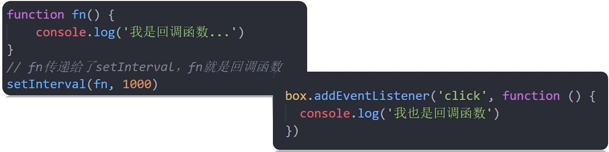

## 21、事件流
### 什么是事件流
事件流指的是事件完整执行过程中的流动路径。

事件流分为捕获阶段和冒泡阶段，实际工作中都是使用事件冒泡为主。

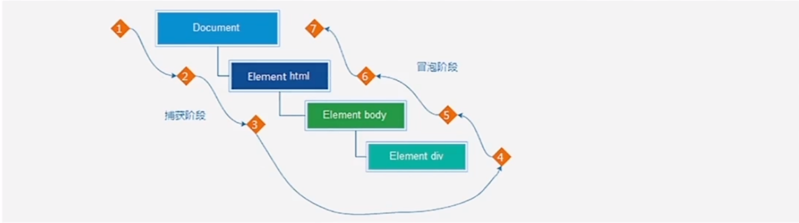

说明：假设页面里有个div，当它触发事件时会经历两个阶段，分别是捕获阶段和冒泡阶段。

### 事件捕获
事件捕获是从到DOM的根元素开始去执行对应的事件（从外到里）。

事件捕获需要写对应的代码才能看到效果，`DOM.addEventListener('事件类型',函数,是否用捕获机制)`。

```css
.father {
  width: 400px;
  height: 400px;
  background-color: pink;
}

.son {
  width: 50px;
  height: 50px;
  background-color: green;
}
```

```html
<div class="father">
    <div class="son"></div>
</div>
```

```javascript
const father = document.querySelector('.father')
const son = document.querySelector('.son')

document.addEventListener('click', function () {
    console.log('我是爷爷');
}, true)
father.addEventListener('click', function () {
    console.log('我是爸爸');
}, true)
son.addEventListener('click', function () {
    console.log('我是儿子');
}, true)
```

+ addEventListener第三个参数传入true代表是捕获阶段触发（很少使用）
+ 浏览器点击son的div时结果分别为：我是爷爷、我是爸爸、我是儿子。

### 事件冒泡
事件冒泡是当一个元素触发事件后，会依次向上调用所有父级元素的同名事件。

代码示例同上事件捕获示例，只不过需要把addEventListener第三个参数去掉，表示这是冒泡事件。

示例的结果分别为：我是儿子、我是爸爸、我是爷爷。

### 阻止冒泡
因为默认具有冒泡模式的存在，所以容易导致事件影响到父级元素。

想把事件就限定在当前元素内，就需要阻止事件冒泡。

语法：

```javascript
事件对象.stopPropagation()
```

+ 阻止事件冒泡需要拿到事件对象e
+ 此方法可以阻断事件流动传播，不光在冒泡阶段有效，捕获阶段也有效。

### 解绑事件
1. on事件方式，直接用null覆盖就可以实现事件的解绑。

```javascript
// 绑定事件
btn.onclick = function(){
    alert('点击了')
}

// 解绑事件
btn.onclick = null
```

2. addEventListener方式，必须使用：`removeEventListener('事件类型',函数,[捕获或冒泡阶段])`

```javascript
function fn(){
    alert('点击了')
}

// 绑定事件
btn.addEventListener('click',fn)

// 解绑事件
btn.removeEventListener('click',fn)
```

+ 匿名函数无法被解绑

## 22、事件委托
### 事件委托是什么
事件委托是利用事件流的特性解决一些开发需要的知识技巧。

事件委托可以减少注册次数，提高程序性能。

事件委托其实是利用了事件冒泡的特点。

给父元素注册事件，当我们触发子元素时，会冒泡到父元素身上，从而触发父元素的事件。

`事件对象.target.tagName`可以获得真正触发事件的元素。

### 代码示例
```javascript
const ul = document.querySelector('ul')
ul.addEventListener('click',function(e){
    if(e.target.tagName === 'LI'){
        e.target.style.color = 'pink'
    }
})
```

## 23、其他事件
### 页面加载事件
页面加载事件是加载外部资源（如图片、外联CSS 、JavaScript等）加载完毕时触发的事件。

有时候需要等页面资源全部处理完才做一些事情、老代码喜欢把script写在head中，这时候直接到dom元素找不到，需要用到页面加载事件。

1. load事件：用于监听所有资源加载完毕，也可以针对某个资源绑定load事件。

```javascript
window.addEventListener('load',function(){
    // 执行的操作
})
```

2. DOMContentLoaded：当初始的html文档被完全加载和解析完成之后，事件被触发，无需等待样式表、图片等全部加载。

```javascript
document.addEventListerer('DOMContentLoaded',function(){
    // 执行的操作
})
```

### 元素滚动事件
元素滚动事件就是滚动条在滚动时持续触发的事件。

```javascript
window.addEventListener('scroll',function(){
    // 执行的操作    
})
```

页面滚动事件-获取位置：

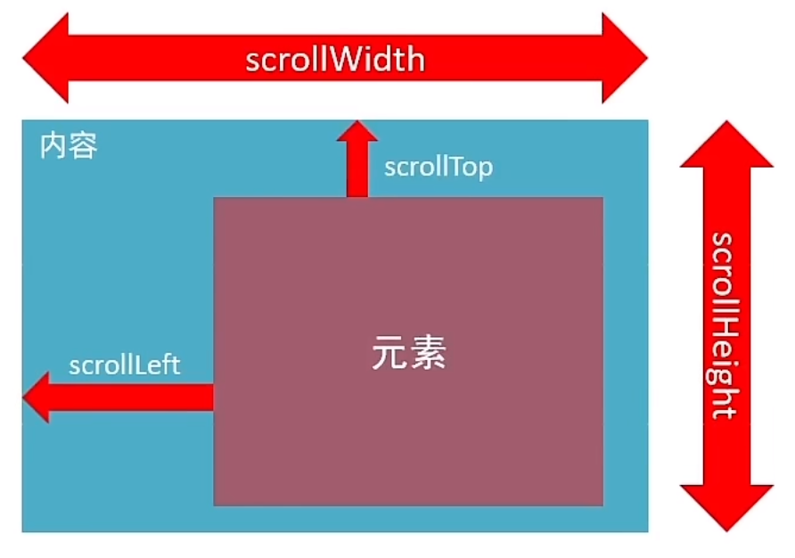

+ 通过`scrollLeft`和`scrollTop`属性可以获取位置
+ 这两个值是可以读写的，即可以读取也可以修改（赋值）
+ 检测页面滚动的头部距离（被卷去的头部）可以用`document.documentElement.scrollTop`
+ 通过`window.scrollTo(x轴坐标，y轴坐标)`方法也可以定位

### 页面尺寸事件
窗口尺寸改变时触发的事件是页面尺寸事件。

```javascript
window.addEventListener('resize',function(){
    // 执行的代码
})
```

`clientWidth`和`clientHeight`属性可以获取元素可见部分宽高（不包含边框、margin、滚动条等）。

```javascript
let w = document.documentElement.clientWith
let h = document.documentElement.clientHeitht
```

### 元素尺寸与位置
获取元宽高：`offsetWidth`和`offsetHeight`获取元素的自身宽高（包括自身设置的宽高、padding、border等）。

```javascript
let w = 对象名.offsetWidth
let h = 对象名.offsetHeight
```

+ 获取出来的数值方便计算
+ 获取的是可视宽高，如果盒子是隐藏的，获取的结果是零

获取位置：`offsetLeft`和`offsetTop`可以获取元素距离自己定位父级元素的左、上距离。

```javascript
let l = 对象名.offsetLeft
let t = 对象名.offsetTop 
```

+ 注意二者是只读属性
+ 二者的位置以带有定位的父级为主，如果都没有则以文档为准

## 24、日期对象
日期对象是用来表示时间的对象，可以得到当前系统时间。

### 实例化
在代码中发现了new关键字是，一般将这个操作称为实例化。

```javascript
// 当前时间
const date = new Date()// Mon Sep 09 2024 08:58:21 GMT+0800 (中国标准时间)

// 指定时间
const date1 = new Date('2022-5-1 08:30:00')// Sun May 01 2022 08:30:00 GMT+0800 (中国标准时间)
```

### 事件对象方法
getFullYear()：获取年份

getMonth()：获取月份，取值为0-11

getDate()：获取月份中的每一天，不同月份取值也不同

getDay()：获取星期，取值为0-6

getHours()：获取小时，取值为0-23

getMinutes()：获取分钟，取值为0-59

getSeconds()：获取秒，取值为0-59

tolocaleString()：获取当前日期和时间，以 2024/9/9 12:27:11 的形式

toLocaleDateString()：获取当前日期，以 2024/9/9 的形式

toLocaleTimeString()：获取当前时间，以 12:27:11 的形式

### 时间戳
时间戳是指1970年01月01日00时00秒起到现在的毫秒数，它是一种特殊的计量时间的方式。

算法：将来的时间戳 - 现在的时间戳 = 剩余时间的毫秒数

三种获取时间戳的方式：

```javascript
// 方式一
const date = new Date('指定时间')
date.getTime()

// 方式二
+new Date('指定时间')

// 方式三
Date.now() //只能得到当前的时间戳
```

## 25、节点操作
### DOM节点
DOM树里每一个内容都称之为节点。

节点类型：

+ 元素节点：所有的标签，比如：body、div
+ 属性节点：所有的属性，比如：href
+ 文本节点：所有的文本

### 查找节点
查找父节点：`子元素.parentNode`,返回最近一级的父节点，找不到返回null。

查找兄弟点：`兄弟元素.nextElementSibling`,查找下一个兄弟节点；`子元素.previousElementSibling`,查找下一个兄弟节点。

查找子节点：`父元素.children`,仅获得所有子元素节点，返回的是一个伪数组；`父元素.childrens`,获得所有节点包括文本节点、注释节点等。

### 增加节点
增加节点分两步：一创建节点，二追加节点。

创建节点：

+ `document.createElement('节点名称')`
+ 克隆节点：

追加节点：`元素.cloneNode(布尔值)`，ture克隆时会包含后代节点一起克隆，false则代表克隆时不包含后代节点。

+ 插入父元素最后一个子元素：`父元素.appendChild(要插入的元素)`
+ 插入到某一个子元素前面：`父元素.insertBefore(要插入的元素,在哪个元素前面)`

### 删除节点
在 JavaScript 原生DOM操作中，要删除元素必须通过父元素删除。

`父元素.removeChild(要删除的元素)`，如不存在父子关系则删除失败。

## 26、M端事件
移动端也有独特的事件。

touch触摸事件：

+ touchstart：手指触摸到一个dom元素时触发
+ touchmove：手指在一个dom元素上滑动触发
+ touchend：手指从一个dom元素上移开时触发

## 27、插件
插件就是别人写好的一些代码，我们只需要复制对应的代码，就可以直接实现对应的效果。

swiper官网：[https://www.swiper.com.cn/](https://www.swiper.com.cn/)

使用流程：

1. 熟悉官网，了解这个插件可以完成什么需求
2. 看在线演示，找到符合自己需求的demo
3. 查看基本使用流程
4. 查看APi文档，去配置自己的插件

注意：多个swiper同时使用的时候，类名需要注意区分

## 28、Window对象
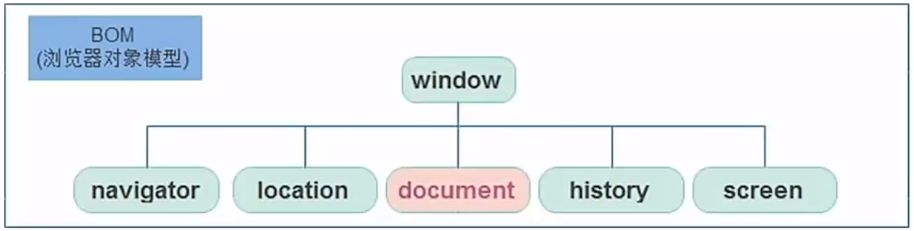

### Window对象
window对象是一个全局对象，也可以说是JavaScript中的顶级对象。

像document、alert()、console.log()，这些都是window的属性，基本BOM的属性和方法都是window的。

所有通过var定义在全局作用域中的变量、函数都会变成window对象的属性和方法。

window对象下的属性和方法调用的时候可以省略window。

### JS执行机制
Javascript语言的一大特点就是单线程，也就是说，同一时间只能做一件事。

单线程就意味着，所有任务需要排队，前一个任务结束，才会执行后一个任务。如果JS执行的时间过长，这样就会造成页面的渲染不连贯，导致界面渲染加载阻塞的感觉。

为了解决这个问题，利用多核CPU的计算能力，HTML5提出 Web Worker 标准，允许JavaScript脚本创建多个线程。于是，JS中出现了同步和异步。

同步：前一个任务结束后再执行后一个任务，程序的执行顺序与任务的排序顺序时一致的、同步的。

异步：你在做一件事情时，因为这件事会花很长时间，在做这件事的同时，你还可以去处理其他事情。

同步任务：同步任务都在主线程上执行，形成一个执行线。

异步任务：JS的异步是通过回调函数实现的，异步任务相关添加到任务队列中，一般而言异步任务有以下三种类型：

1. 普通事件，如click、resize等
2. 资源加载，如load、error等
3. 定时器，包括setinterval、setTimeout等

JS执行机制：

1. 先执行执行栈中的同步任务
2. 异步任务放入任务队列中
3. 一旦执行栈中的所有同步任务执行完毕，系统会按次序读取任务队列中的异步任务，于是被读取的异步任务结束等待状态，进入执行栈，开始执行。

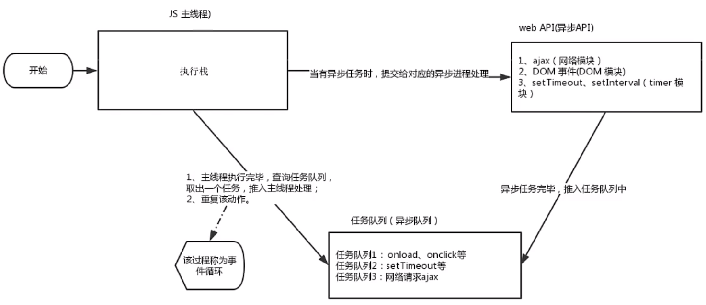

### location对象
location的数据类型是对象，它拆分并保存了URL地址的各个组成部分。

常用属性及方法：

+ href 属性获取完整的URL地址，对其赋值时用于地址的跳转
+ search 属性获取地址中携带的参数（符号？后面部分）
+ hash 属性获取地址中的哈希值（符号#后面部分），后期vue路由的铺垫
+ reload 方法用来刷新当前页面，传入参数true时表示强制刷新

### navigator对象
navigator的数据类型是对象，该对象记录了浏览器自身的相关信息。

通过 userAgent 属性检测浏览器的版本及平台：

```javascript
//检测userAgent(浏览器信息)
!(function () {
    const userAgent = navigator.userAgent
    //验证是否为Android或iPhone
    const android = userAgent.match(/(Android);?[￥s￥/]+([￥d.]+)?/)
    const iPhone = userAgent.match(/(iPhone￥sOS)￥s([￥d_]+)/)
    //如果是Android或iPhone，则跳转至移动站点
    if (android || iphone) {
        location.href = 'http://baidu.com'
    }
})()
```

### history对象
history的数据类型是对象，主要管理历史记录，该对象与浏览器地址栏的操作相对应，如前进、后退、历史记录等

常用属性和方法：

+ back() 方法：可以实现浏览器后退功能
+ forward() 方法：可以实现浏览器前进功能
+ go(数值) 方法：可以实现浏览器前进、后退功能，如果参数是1 前进一个页面，如果参数是-1 后退一个页面

## 29、本地存储
### 本地存储介绍
以前我们页面写的数据一刷新页面就没有了，随着互联网的快速发展，基于网页的应用越来越普遍，同时也变得越来越复杂，为了满足各种各样的需求，会经常在本地存储大量的数据，HTML5规范提出了相关解决方案。

1. 数据存储在用户浏览器中
2. 设置、读取方便、甚至页面刷新不丢失数据
3. 容量较大，sessionStorage和localStorage约 5M 左右

### localStorage
localStorage可以将数据永久存储在本地（用户的电脑），除非手动删除，否则关闭页面也会存在

特点：

+ 可以多窗口（页面）共享（同一浏览器可以共享）数据
+ 以键值对的形式存储使用

基本操作：

```javascript
// 存储或修改数据
localStorage.setItem(key,value)

// 获取数据
localStorage.getItem(key)

// 删除数据
localStorage.removeItem(key)
```

### sessionStorage
sessionStorage可以将数据临时存储在本地。

特点：

+ 生命周期为关闭浏览器窗口
+ 在同一个窗口（页面）下数据可以共享
+ 以键值对形式存储使用

基本操作：

```javascript
// 存储或修改数据
sessionStorage.setItem(key,value)

// 获取数据
sessionStorage.getItem(key)

// 删除数据
sessionStorage.removeItem(key)
```

### 存储复杂数据类型
问题：浏览器只能存储string类型的数据，数组、对象等复杂的数据类型无法直接存储。

解决方案：

+ 存储时将复杂数据类型转换为JSON字符串，`JSON.stringify(复杂数据类型)`
+ 取用数据时将JSON字符串转换为复杂数据类型，`JSON.parse(JSON字符串)`

## 30、正则表达式
### 介绍
正则表达式是用于匹配字符串中字符组合的模式，在JavaScript中，正则表达式也是对象。

正则表达式通常用来查找、替换那些复合正则表达式的文本，许多语言都支持正则表达式。

正则表达式使用场景：

+ 表单验证：用户名表单只能输入英文字母、数字或者下划线，昵称输入框可以输入中文：/^[a-z0-9_-]{3,16$}
+ 过滤掉页面内容中的一些敏感词（替换）
+ 从字符串中获取我们想要的特定部分（提取）

### 语法
JavaScript中定义正则表达式的语法有两种，我们先学习其中比较简单的方法。

```javascript
const 变量名 = /表达式/
```

判断字符串是否符合规则的方法：

+ test() 方法：用来查看正则表达式与指定字符串是否匹配，匹配返回true，不匹配返回false

```javascript
const str = '要检测的字符串'
const reg = /规则/
console.log(reg.test(str))
```

+ exec()方法：在一个指定字符串中执行一个搜索匹配，匹配成功返回一个数组，不匹配返回null

```javascript
const str = '要检测的字符串'
const reg = /规则/
console.log(reg.exec(str))
```

+ replace()方法：将匹配的正则表达式用文本替换

```javascript
字符串.replace(/正则表达式/,'要替换的文本')
```


### 元字符
大多数的字符仅能够描述他们本身，这些字符称为普通字符，例如 所有的字母和数字。

元字符是一些具有特殊含义的字符，可以极大提高灵活性和匹配功能，比如 26个英文字母用普通字符必须abcd...，而换成元字符则为[a-z]。

参考文档：

+ MDN：https//developer.mozilla.org/zh-CN/docs/web/JavaScript/Guide/Regular_Expressions
+ 正则测试工具：[http://tool.oschina.net/regex](http://tool.oschina.net/regex)

元字符可以拆分为：

+ 边界符（表示位置，开头^和结尾$）
+ 量词（表示重复次数）
+ 字符类（比如 \d 表示 0-9）

常见的量词：

| 量词 | 说明 |
| --- | --- |
| * | 重复零次或者更多次 |
| + | 重复一次或者更多次 |
| ？ | 重复零次或者一次 |
| {n} | 重复n次 |
| {n,} | 重复n次或者更多次 |
| {n,m} | 重复n次到m次 |


常见字符类：

| 类型 | 说明 |
| --- | --- |
| [abc] | 表示abc中任意一个 |
| [a-z]、[0-9]、[a-zA-Z] | 表示范围内的任何一个，返回true或false |
| [^a-z] | 表示除了小写字母外的字符 |
| . | 表示匹配除了换行符之外的任何单个字符 |


预定义类：

| 预定义类 | 说明 |
| --- | --- |
| \d | 匹配0-9之间的任一数字，相当于[0-9] |
| \D | 匹配0-9之外的任一数字，相当于[^0-9] |
| \w | 匹配任一的字母、数字、下划线，相当于[A-Za-z0-9] |
| \W | 匹配任一除字母、数字、下划线外的字符，相当于[^A-Za-z0-9] |
| \s | 匹配空格（包括换行符、制表符、空格符等），相当于[\t\r\n\v\f] |
| \S | 匹配非空格的字符（包括换行符、制表符、空格符等），相当于[^\t\r\n\v\f] |


### 修饰符
修饰符约束正则执行的某些细节行为，如是否区分大小写，是否支持多行匹配等。

语法：

```javascript
/表达式/修饰符
```

+ 修饰符`i`是单词ignore的缩写，表示正则匹配时字母不区分大小写
+ 修饰符`g`是单词global的缩写，表示匹配所有满足正则表达式的结果

## 31、作用域
作用域（scope）规定了变量能够访问的范围，离开了这个范围变量便不能访问。

作用域分为局部作用域和全局作用域。

### 局部作用域
在函数内部声明的变量只能在函数内部被访问，外部无法直接访问。

```javascript
function getSum(){
    //函数内部是函数作用域，属于局部变量
    const num = 10
}
console.log(num)//此处报错，函数外部不能使用局部作用域变量
```

+ 函数内部的变量，在函数外部无法被访问
+ 函数的参数也是函数内部的局部变量
+ 不同函数内部声明的变量无法相互访问
+ 函数执行完毕后，函数内部的变量实际被清空了

### 全局作用域
`<script>标签`和`.js文件`的最外层就是所谓的全局作用域，在此声明的变量在函数内部也可以被访问。

全局作用域中的变量，任何其他作用域都可以被访问。

```javascript
//全局作用域
//全局作用域下声明了num变量
const num = 10
function fn(){
    //函数内部可以使用全局作用域的变量
    console.log(num)
}
//此处为全局作用域
```

+ 为window对象动态添加的属性默认也是全局的，不推荐！
+ 函数中未使用任何关键字声明的变量为全局变量，不推荐！！
+ 尽可能少的声明全局变量，防止全局变量污染

### 作用域链
作用域链本质上是底层的变量查找机制。

在函数被执行时，会优先查找当前函数作用域中查找变量，如果当前作用域查找不到则会逐级查找父级作用域直到全局作用域。

```javascript
//全局作用域
let a = 1
let b = 2
//局部作用域
function f(){
    let a = 1
    //局部作用域
    function g(){
        a=2
        console.log(a)
    }
    g()//调用g
}
f()//调用f
```

+ 嵌套关系的作用域串联起来形成了作用域链
+ 相同作用域链中按着从小到大的规则查找变量
+ 字作用域能够访问父作用域，父作用域无法访问子作用域

### JS垃圾回收机制
垃圾回收机制（Garbage Collection）简称GC。

JS中内存的分配和回收都是自动完成的，内存在不使用的时候会被垃圾回收器自动回收。

JS环境中分配的内存，一般有如下生命周期：

1. 内存分配：当我们声明变量、函数、对象的时候，系统会自动为他们分配内存
2. 内存使用：即读写内存，也是就使用变量、函数等
3. 内存回收：使用完毕，有垃圾回收器自动回收不再使用的内存

说明：全局变量一般不会回收（关闭页面回收），一般情况下局部变量的值不用了，会被自动回收掉。

内存泄漏：程序中分配的内存由于某种原因程序未释放或无法释放叫做内存泄漏。

```javascript
//为变量分配内存
const age = 18

//为对象分配内存
const obj = {
    age:19
}

//为函数分配内存
function fn() {
    const age = 18
    consloe.log(age)
}
```

堆栈空间分配区别：

1. 栈（操作系统）：由操作系统自动分配释放函数的参数值、局部变量等，基本数据类型放到栈里面。
2. 堆（操作系统）：一般由程序员分配释放，诺程序员不释放，由垃圾回收机制回收。复杂类型数据放到堆里面。

下面介绍两种常见浏览器垃圾回收算法：引用计数法 和 标记清除法。

垃圾回收算法-引用计数法：IE采用的引用计数算法，定义“内存不再使用”，就是看一个对象是否有指向它的引用，没用引用就回收对象。

算法：

1. 跟踪记录被引用的次数
2. 如果被引用了一次，那么就记录次数1，多次引用还会累加++
3. 如果减少一个引用就减1--
4. 如果引用次数是0，则释放内存

引用计数存在一个致命的问题：嵌套引用（循环引用），即如果有两个对象相互引用，尽管它们已不再使用，垃圾回收器不会进行回收，导致内存泄漏。因为他们的引用次数永远不会是0，这样的相互引用如果说大量的存在就会导致大量的内存泄漏。

```javascript
function fn(){
    let o1 = {}
    let o2 = {}
    o1.a = o2
    o2.a = o1
    return '引用计数无法回收'
}
fn()
```

垃圾回收算法-标记清除法：现代浏览器通用的大多是基于标记清除算法的某些改进算法，总体思想都是一致的。

### 闭包
一个函数堆周围状态的引用绑定在一起，内层函数访问到其他外层函数的作用域，简单理解为 闭包 = 内层函数 + 外层函数的变量。

闭包的作用：封闭数据，提供操作，外部也可以访问函数内部的变量。

闭包的基本格式：

```javascript
function outer(){
    let i =1
    function fn(){
        console.log(i)
    }
    return fn
}
const fun = outer()
fun()
//外层函数使用内部函数的变量
```

闭包的应用：实现数据的私有，比如，我们要做个统计函数调用次数，函数调用一次，就++

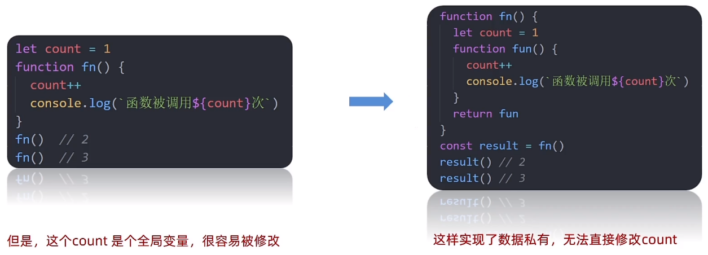

### 变量提升
变量提升是JavaScript中比较“奇怪”的现象，它允许在变量声明之前被访问（仅存在于var声明变量）。

JS初学者经常花费很多时间才能习惯变量提升，还经常出现一些意想不到的bug，正因为如此，ES6引入了块级作用域，用let或者const声明变量，让代码写法更加规范和人性化。

```javascript
//访问变量str
console.log(str + 'world!')//undefinedworld!
//声明变量str
var str = 'hello'
```

+ 变量在未声明即被访问时会报语法错误
+ 变量在var声明之前即被访问，变量的值为undefined
+ let/const声明的变量不存在变量提升
+ 变量提升发生在相同作用域当中
+ 实际开发中推荐先声明再访问变量

变量提升流程：

1. 先把var变量提升到当前作用域最前面
2. 只提升变量声明，不提升变量赋值
3. 然后依次执行代码

## 32、函数进阶
### 函数提升
函数提升与变量提升比较类似，是指函数在声明之前即可被调用。

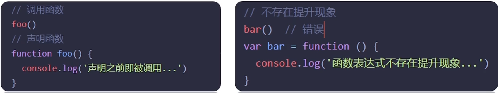

+ 函数提升能够使函数的声明调用更加灵活
+ 函数表达式不存在提升的现象
+ 函数提升出现在相同的作用域当中

### 函数参数
函数参数的使用细节，能够提升函数应用的灵活度。

函数参数有 动态参数arguments 和 剩余参数...。

+ 动态参数：arguments是函数内部内置的伪数组变量，它包含了调用函数时传入的所有实参。

```javascript
//求和函数，计算所有参数的和
function sum(){
    let s =0
    for(let i = 0;i < arguments.length;i++){
        s += arguments[i]
    }
    console.log(s)
}
//调用求和函数
sum(5,10)//两个参数
sum(1,2,4)//三个参数
```

+ 剩余参数：...是语法符号，置于最末函数形参之前，用于获取多余的实参，结果是一个真数字。

```javascript
function config(baseURL,...other){
    console.log(baseURL)// 'http://baidu.com'
    console.log(other)// ['get','json']
}
//调用函数
config('http://baidu.com','get','json')
```

### 展开运算符
展开运算符(...)，可以将一个数组进行展开，不会改变原数组。

```javascript
const arr = [1,5,3,8,2]
console.log(...arr)//1 5 3 8 2
```

经典运用场景：求数组最大值（最小值）、合并数组等。

```javascript
//求数组最大值（最小值）
const arr = [1,5,3,8,2]
console.log(Math.max(...arr))//8
console.log(Math.min(...arr))//1

//合并数组
const arr1 = [1,2,3]
const arr2 = [4,5,6]
const arr3 = [...arr1,...arr2]
console.log(arr3)//[1,2,3,4,5,6]
```

展开运算符与剩余参数有所区别:

+ 展开运算符主要是数组展开
+ 剩余参数在函数内部使用

### 箭头函数
引入箭头函数的目的是更简短的函数写法并且不绑定this，箭头函数的语法比函数表达式更简洁。

使用场景：箭头函数更适用于那些本来需要匿名函数的地方。

基本语法：

```javascript
//基本语法
const fn = (x) => {
    console.log(x)
}

//只有一个形参的时候，可以省略小括号
const fn = x => {
    console.log(x)
}

//只有一行代码时，可以省略大括号
const fn = x => console.log(x)

//只有一行代码时，可以省略return
 const fn = x => x + x
 console.log(fn(1))//调用

//加括号的函数体返回对象字面量表达式
const fn = uname => ({name:uname})
console.log(fn('ggboy'))//{name: 'ggboy'}
```

+ 箭头函数属于函数表达式，因此不存在函数提升
+ 箭头函数只有一个参数时可以省略圆括号（）
+ 箭头函数函数体只有一行代码时可以省略花括号{}，并且自动作为返回值被返回
+ 加括号的函数体返回对象字面量表达式

箭头函数的参数：

普通函数有arguments动态参数，而箭头函数没有arguments动态参数，但是有剩余参数...args。

```javascript
const getSum = (...args) => {
    let sum = 0
    for(let i = 0; i < args.length; i++){
        sum += args[i]
    }
    return sum //注意函数体有多行代码需要return
}
console.log(getSum(1,2,3))//6
```

箭头函数this：

在箭头函数出现之前，每一个新的函数根据它是被如何调用的来定义合格函数的this值，非常令人讨厌；箭头函数不会创建自己的this,他只会从自己的作用域链的上一层沿用this。

开发中使用箭头函数前需要考虑函数中this的值，事件回调函数使用箭头函数是，this为全局的window，因此DOM事件回调函数为了简便，还是不太推荐使用箭头函数。

```javascript
console.log(this)//此处为window
const sayHi = () => {
    console.log(this)//此处为window
}
document.querySelector('btn').addEventListener('click',function(){
    console.log(this)//此处为zhi'x
})
```

## 33、解构赋值
### 数组解构
数组解构是将数组的单元值快速批量给一系列变量的简洁语法。

基本语法：

1. 赋值运算符= 左侧的[] 用于批量声明变量，右侧的数组的单元值将被赋值给左侧的变量
2. 变量的顺序对应数组单元值的位置依次进行赋值操作

```javascript
//普通的数组
const arr = [1,2,3]
//批量声明a b c
const [a,b,c] = arr
console.log(a)//1
console.log(b)//2
console.log(c)//3
```

JS前面必须加分号情况：

+ 立即执行函数
+ 数组解构

```javascript
//立即执行函数
(function fn(){})();

//数组开头的，特别是前面有语句的数据解构
;[b,a] = [a,b]
```

数组解构会碰到的几种情况：

+ 变量少，单元值多;可以利用剩余参数解决

```javascript
//变量少，单元值多
const [a,b,c] = [1,2,3,4]
console.log(a)//1
console.log(b)//2
console.log(c)//3

//利用剩余参数解决
[a,b,...arr] = [1,2,3,4]
console.log(a)//1
console.log(b)//2
console.log(arr)//[3,4] 
```

+ 变量多，单元值少，会出现有undefined传递单元值的情况;可以设置默认值解决

```javascript
//变量多，单元值少
const [a,b] = [1]
console.log(a)//1
console.log(b)//undefined

//设置默认值解决
const [a = 0,b = 0] = [1]
console.log(a)//1
console.log(b)//0
```

+ 按需导入赋值

```javascript
[a,b,,d] = [1,2,3,4]
console.log(a)//1
console.log(b)//2
console.log(d)//4 
```

+ 支持多维数组的结构：

```javascript
[a,b] = [1,[2,3]]
console.log(a)//1
console.log(b)//[2,3] 
```

### 对象解构
对象解构是将对象属性和方法快速批量赋值给一系列变量的简洁语法。

基本语法：

```javascript
//普通对象
const user = {
    name:'小明',
    age:18
}
//批量声明变量
const {name,age} = user
console.log(name)//小明
console.log(age)//18 
```

+ 赋值运算符= 左边的{} 用于批量声明变量，右侧对象的属性值给左侧的变量
+ 对象属性的值将被赋值给与属性名相同的变量
+ 注意解构的变量名不要和外面的变量名冲突则报错
+ 对象中找不到与变量名一致的属性时变量值为undefined

可以从一个对象中提取变量并同时修改新的变量名：

```javascript
//普通对象
const user = {
    name:'小明',
    age:18
}
//批量声明变量
const {name:uname,age} = user
console.log(uname)//小明
console.log(age)//18
```

多级对象的解构：

```javascript
//多级对象
const pig = {
    name:'佩奇',
    family:{
        mother:'猪妈妈'，
        father:'猪爸爸',
        sister:'乔治'
    }
}
//多级对象的解构
const {name,fimily:{mother,father,sister}} = pig
console.log(name)//佩奇
console.log(mother)//猪妈妈
console.log(father)//猪爸爸
console.log(sister)//乔治
```

数组对象的解构：

```javascript
//数组对象
const person = [
    {
        name: '佩奇',
        family: {
            mother: '猪妈妈',
            father: '猪爸爸',
            sister: '乔治'
        }
    }
]
//数组对象的解构
const [{ name, family: { mother, father, sister } }] = person
console.log(name)
console.log(mother)
console.log(father)
console.log(sister)
```

## 34、深入对象
### 创建对象的三种方式
1. 利用字面量创建对象

```javascript
const o = {
    name:'佩奇'
}
```

2. 利用new Object创建对象

```javascript
const o = new Object({name:'佩奇'})
```

3. 利用构造函数创建对象

```javascript
function Pig(name,age){
    this.name = name
    this.age = age
}

const Peppa = new Pig('佩奇',6)
```

### 构造函数
构造函数是一种特殊的函数，主要用来初始化对象。

使用场景：常规的{}语法允许创建一个对象，如果想继续创建相似的对象还需要重新写一遍，此时可以通过构造函数来快速创建多个相似对象。

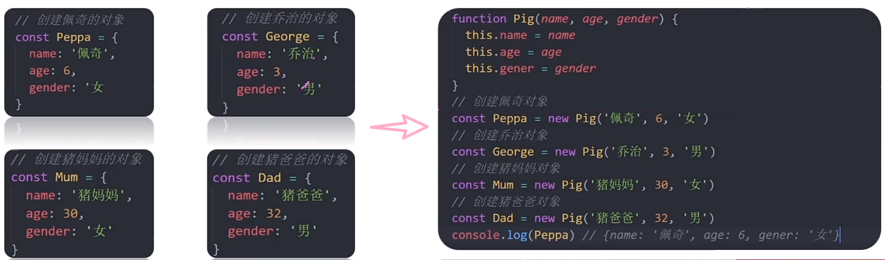

构造函数在技术上是常规函数，不过有几个约定：

+ 构造函数的命名以大写字母开头
+ 构造函数只能由 new 操作来执行（实例化）
+ 实例化构造函数没有参数时可以省略（）
+ 构造函数内部无需写return，返回值即为新创建的对象

构造函数实例化执行过程：

1. 创建新的对象
2. 构造函数this指向新的对象
3. 执行构造函数代码，修改this，添加新的属性
4. 返回新对象

### 实例成员&静态成员
实例成员：通过构造函数创建的对象称为实例对象，实例对象中的属性和方法称为实例成员（实例属性和实例方法)。

```javascript
//构造函数
function Person(){
    //构造函数内部的 this 就是实例对象
    //实例对象动态添加属性
    this.name = '小明'
    //实例对象动态添加方法
    this.sayHi = function(){
        console.log('大家好~')
    }
}
//实例化，p是实例对象
//p实际就是构造函数内部的this
const p = new Person()
console.log(p.name)//访问实例属性
p.sayHi()//调用实例方法
```

静态成员：构造函数的属性和方法被称为静态成员（静态属性和静态方法）。

```javascript
//构造函数
function Person(name,age){
    //省略实例成员
}
//静态属性
Person.eyes = 2
Person.arms =2
//静态方法
Person.walk = function(){
    console.log('人会走路...')
    //this指向Person
    console.log(this.eyes)
}
```

+ 静态成员只能由构造函数来访问，比如 Date.now()、Math.PI、Math.random()
+ 静态方法中this指向构造函数

## 35、内置构造函数
在JavaScript中最主要的数据类型有6种：【基本数据类型】字符串、数值、布尔、undefined、null;【引用类型】对象。

但是，我们会发现有些特殊情况：``'我是字符串'.length`，其实字符串、数值、布尔等基本数据类型也都有专门的构造函数，这些我们称为包装类。

JS中几乎所有的数据都可以基于构造函数创建。

### Object
Object的三个常用静态方法：

+ Object.keys 方法：获取对象中所有属性，返回值是一个数组

```javascript
    const o = {name:'佩奇',age:6}
const arr = Object.keys(o)
console.log(arr)//['name','age']
```

+ Object.values 方法：获取对象中所有属性值，返回值是一个数组


```javascript
const o = {name:'佩奇',age:6}
const arr = Object.values(o)
console.log(arr)//['佩奇',6]
```

+ Object.assign 方法：常用于对象拷贝和给对象添加属性

```javascript
//用于拷贝
const o = {name:'佩奇',age:6}
const obj = {}
Object.assign(obj,o)
console.log(obj)//{name:'佩奇',age:6}
//用于给对象添加属性
Object.assign(o,{gender:'女'})
console.log(o)//{name:'佩奇',age:6,gender:'女'}
```

### Array
Array是内置的构造函数，用于创建数组。

创建数组建议使用字面量创建，不用Array构造函数创建。

```javascript
//构造函数创建数组
const arr = new ArrayJ(3,5)
console.log(arr)//[3,4]
//用字面量创建数组
const arr1 = [3,4]
```

数组常见实例方法：

| 方法 | 作用 | 说明 |
| --- | --- | --- |
| forEach | 遍历数组 | 不返回数组，经常用于查找遍历数组元素 |
| filter | 过滤数组 | 返回新数组，返回的是满足条件的数组元素 |
| map | 迭代数组 | 返回新数组，返回的是处理之后数组元素 |
| reduce | 累计器 | 返回累计处理的结果，经常用于求和等 |
| find | 查找元素 | 返回符合条件的第一个元素，没有则返回undefined |
| every | 检测数组中的元素是否满足指定条件 | 如果所有元素都通过了检测返回true,否则返回false |
| some | 检测数组中的元素是否满足指定条件 | 如果有元素满足体条件返回true,否则返回false |
| concat | 合并两个数组 | 返回生成的新数组 |
| sort | 对原数组单元值排序 |  |
| splice | 删除或替换原数组单元 |  |
| reverse | 反转数组 |  |
| findIndex | 查找元素的索引值 |  |

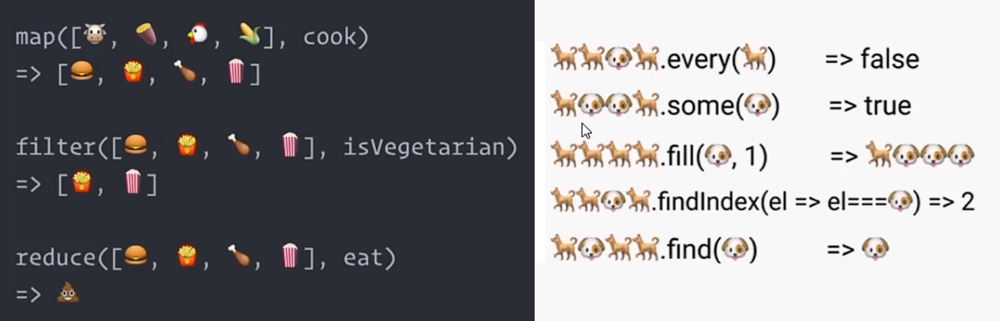

### String
在JavaScript中的字符串、数组、布尔具有对象的使用特征，如 具有属性和方法。

之所以具有对象的特征的原因是字符串、布尔、数值类型数据是JavaScript底层使用Object构造函数“包装”来的，被称为包装类型。

```javascript
//字符串类型
const str = 'hello world'
console.log(str.length)//统计字符串的长度
//数值类型
const price = 12.345
console.log(price.toFixed(2))//保留两位小数
```

String常见实例方法：

| 方法 | 说明 |
| --- | --- |
| length | 用来获取字符串长度 |
| split('分隔符') | 将字符串拆分成数组 |
| substring(要截取的第一个字符的索引，结束的索引) | 用来截取字符串 |
| startWith(要检测的字符串，[,检测位置索引号]) | 检测是否以某字符串开头 |
| endWith(要检测的字符串，[,检测位置索引号]) | 检测是否以某字符串结尾 |
| includes(要检测的字符串，[,检测位置索引号]) | 判断一个字符串是否包含在另一个字符串，根据情况放回true或false |
| toUpperCase | 将字母转换为大写 |
| toLowerCase | 将字母转换为小写 |
| indexOf | 检测是否包含某字符 |
| replace | 用于替换字符串，支持正则匹配 |
| match | 用于查找字符串，支持正则匹配 |


### Number
Number是内置构造函数，用于创建数值。

常用方法：

+ toFixed()四舍五入设置保留小数位的长度

```javascript
const price = 12.345
console.log(price.toFixed())//12
console.log(price.toFixed(2))//12.34
```

## 36、深入面向对象
### 编程思想
面向过程就是分析出解决问题所需要的步骤，然后用函数把这些步骤一步一步实现，使用的时候再一个一个的依次调用就可以了。

面向对象是把事物分解成一个个对象，然后由对象之间分工与合作。

面向对象编程具有灵活性、代码可复用、容易维护和开发的优点，更适合多人合作的大型软件项目。

面向对象的特性：

+ 封装性
+ 继承性
+ 多态性

### 封装
封装是面向对象思想中比较重要的一部分，js面向对象可以通过构造函数实现。

构造函数体现了面向对象的封装特性，构造函数实例创建的对象彼此独立、互不影响。

构造函数虽然很好用，但是存在浪费内存的问题。

```javascript
function Star(uname,age){
    this.uname = uname
    this.age = age
    this.sing = function(){
        console.log('我会唱歌')
    }
}
const ldh = new Star('刘德华',18)
const zxy = new Star('张学友',19)
console.log(ldh.sing === zxy.sing)//结果为false，说明两函数不一样
```

## 37、原型
### 原型对象
JavaScript规定，每一个构造函数都有一个prototype属性，指向另一个对象，所有我们也称之为原型对象。

这个对象可以挂载函数，对象实例化不会多次创建原型上的函数，节约内存。

我们可以把那些不变的方法，直接定义在prototype对象上，这样所有对象的实例就可以共享这些方法。

```javascript
function Star(uname,age){
    this.uname = uname
    this.age = age
}
console.log(Star.prototype)//返回一个对象称为原型对象
Star.prototype.sing = function(){
    console.log('我会唱歌')
}
const ldh = new Star('刘德华',18)
const zxy = new Star('张学友',19)
console.log(ldh.sing === zxy.sing)//结果为true，说明两函数一样,共享
```

构造函数和原型对象中的this都指向实例化的对象。

```javascript
let that
function Person(name){
    this.name = name
    that = this
}
const p = new Person()
console.log(that === p)//true,说明构造函数的this指向实例化的对象

Person.prototype.sing = function(){
    that = this
}
p.sing()
console.log(that === p)//true,说明原型对象中的this指向实例化的对象
```

### constructor属性
每个原型对象里面都有constructor属性（constructor构造函数）。

constructor属性指向改原型对象的构造函数，简单理解，就是指向我的爸爸，我是有爸爸的孩子。

使用场景：如果有多个对象的方法，我们可以给原型对象采取对象形式赋值，但是这样就会覆盖构造函数原型对象原来的内容，这样修改后的原型对象constructor就不再指向当前构造函数了，此时，我们可以在修改后的原型对象中，添加一个constructor指向原来的构造函数。

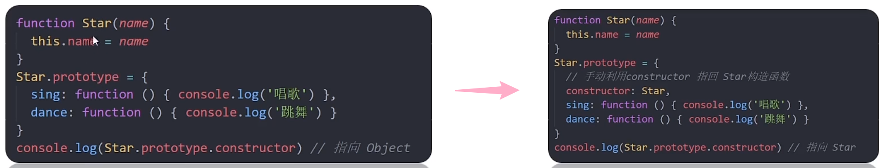

### 对象原型
对象都会有一个属性`__proto__`指向构造函数的prototype原型对象，之所以我们对象可以使用构造函数prototype原型对象的属性和方法，就是因为对象有`__proto__`的存在。

注意：

+ `__proto__`是JS的非标准属性
+ [[prototype]]和`__proto__`意义相同
+ 用来表示当前实例对象指向哪个原型对象prototype
+ `__proto__`对象原型里面也有一个constructor属性，指向创建该实例对象的构造函数

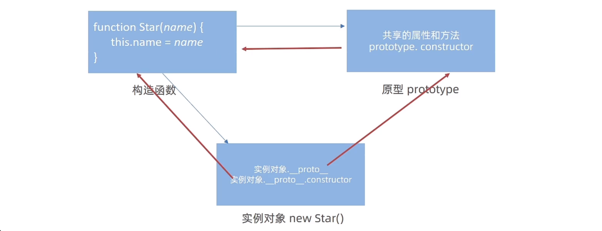

### 原型继承
继承是面向对象的另一个特征，通过继承进一步提升代码封装程度，JavaScript中大多数是借助原型对象实现继承的特性的。

龙生龙、凤生凤、老鼠的儿子会打洞描述的正是继承的含义。

```javascript
//Person父类构造函数
function Person() {
    this.eyes = 2
    this.head = 1
}
//Woman构造函数
function Woman() { }
//Woman通过原型来继承Peron
Woman.prototype = new Person()
//指向原来的构造函数
Woman.prototype.constructor = Woman
//给女人添加一个方法
Woman.prototype.baby = function () {
    console.log('生孩子')
}
console.log(new Woman)//继承了生孩子的方法
//Man构造函数
function Man() { }
//Man通过原型来继承Peron
Man.prototype = new Person()
//指向原来的构造函数
Man.prototype.constructor = Man
console.log(new Man)//没有继承生孩子的方法
```

### 原型链
原型链是基于原型对象的继承使得不同构造函数的原型对象关联在一起，并且这种关联的关系是一种链状结构，我们将原型对象的链状结构关系称为原型链。

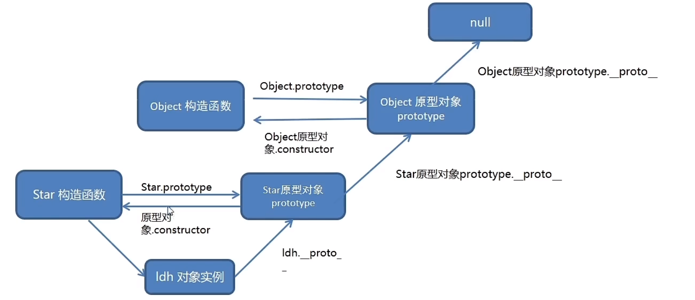

原型链查找规则：

1. 当访问一个对象的属性（包括方法）时，首先查找这个对象自身有没有该属性
2. 如果没有就查找它的原型（也就是`__proto__`指向的prototype原型对象）
3. 如果还没有就查找原型对象的原型（Object的原型对象）
4. 依次类推一直找到Object为止（null)

`__proto__`对象原型的意义就在于对象成员查找机制提供一个方向，或者一条路线

可以使用 instanceof 运算符用于检测构造函数的prototype属性是否出现在某个实例对象的原型链上

## 38、JS高级技巧
### 深浅拷贝
开发中我们经常要复制一个对象。如果直接用赋值会有以下问题：

```javascript
const person = {
    name:'张三',
    age:18
}	
const zs = person
console.log(zs)//{name: '张三', age: 18}
zs.name = '李四'
console.log(zs)//{name: '李四', age: 18}
console.log(person)//{name: '李四', age: 18},person里面的name发生变化
```

深拷贝和浅拷贝只针对引用类型，浅拷贝拷贝的是地址。

常见浅拷贝方法：

+ 拷贝对象：Object.assign() / 展开运算符{...obj}
+ 拷贝数组：Array.prototype.concat() / [...arr]

```javascript
const person = {
  name:'张三',
  age:18
}	
const zs = {}
Object.assign(zs,person)
console.log(zs)//{name: '张三', age: 18}
zs.name = '李四'
console.log(zs)//{name: '李四', age: 18}
console.log(person)//{name: '张三', age: 18}
```

但是还有问题，如果是复杂类型里面有复杂类型如{{}}、{[]}、[{}]，浅拷贝只能拷贝简单类型数据，里面的复杂类型依旧会改变。

深拷贝通常用递归来实现，如果一个函数内部可以调用该函数，这个函数就是递归函数。

+ 简单理解就是函数内部自己调用自己，这个函数就是递归函数
+ 递归函数的作用和循环效果类似
+ 由于递归很容易发生“栈溢出”错误（stack overflow)，所有必须要加退出条件return

深拷贝的三种方法：

1. 用递归实现深度拷贝：

```javascript

//拷贝函数
function deepCopy(newObj,oldObj){
    for(let k in oldObj){
        //处理数组的问题
        if(oldObj[k] instanceof Array){
            newObj[k] = []
            deepCopy(newObj[k],oldObj[k])
        }else if(oldObj[k] instanceof Object){
            newObj[k] = {}
            deepCopy(newObj[k],oldObj[k])
        }else{
            newObj[k] = oldObj[k]
        }
    }
}
deepCopy(o,obj)//调用函数 两个参数 o新对象 obj旧对象
console.log(o)
```

2. 利用JS库lodash里面的cloneDeep实现深拷贝

```html
<!-- 引用lodsh库 -->
<script src="./lodash.min.js"></script>

<script>
    const obj = {
        uname:'哥哥',
        hobby:['唱','跳','rap'],
        family:{
            baby:'baby哦耶'
        }
    }
    //调用深度拷贝语法
    const o = _.cloneDeep(obj)
    console.log(o)
    o.family.baby = '123'
    console.log(obj)
</script>
```

3. 利用JSON字符串实例深拷贝

```javascript
const obj = {
    uname:'哥哥',
    hobby:['唱','跳','rap'],
    family:{
        baby:'baby哦耶'
    }
}
const o = JSON.parse(JSON.stringify(obj))
console.log(o)
o.family.baby = '123'
console.log(obj)
```

### 异常处理
throw抛异常：异常处理指预估代码过程中可以发生的错误，然后最大程度避免错误的发生导致整个程序无法继续运行。

```javascript
function counter(x,y){
    if(!x || !y){
        throw new Error('参数不能为空！')
    }
    return x + y
}
counter()
```

+ throw抛出异常信息，程序也会终止执行
+ throw后面跟的是错误提示信息
+ Error对象配合throw使用，能够设置更加详细的错误信息

try/catch捕获异常：我们可以通过try/catch捕获错误（浏览器提供的错误信息）

```javascript
function foo(){
    try{
        //查找Dom节点
        const p = doucment.queryselector('.p')//错误写法
        p.style.color = 'red'
    }catch(error){
        //try代码段中执行有错误时，会执行catch代码段
        //打印错误信息
        console.log(error.message)
        //终止代码
        return
    }
    finally{
        console.log("无论是否出现异常，finally都会执行")
    }
    console.log("如果出现异常，我的语句不会执行")
}
foo()
```

+ try...catch用于捕获错误信息
+ 将预估可能发生错误的代码写在try代码段中
+ 如果try代码段中出现错误后，会执行catch代码段，并截获到错误信息
+ finally不管是否错误，都会执行

debugger：在代码中写下debugger关键字，浏览器刷新时会自动进入该行代码的调试模式。

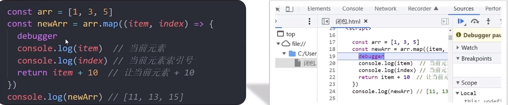

### 处理this
this是JavaScript最具“迷惑”的知识点，不同的应用场合this的取值可能会有意想不到的结果。

普通函数this指向：普通函数的调用方式决定了this的值，即【谁调用this的值指向谁】；普通函数没有明确调用者时this值为window，严格模式下没有调用者时this的值为undefined。

```javascript
//普通函数
function sayHi(){
    console.log(this)
}
//函数表达式
const sayHello = function(){
    console.log(this)
}
//函数的调用方式决定了this的值
sayHi()//window
window.sayHi()//window
//普通对象
const user = {
    name:'小明',
    walk:function(){
        console.log(this)
    }
}
//动态为user添加方法
user.sayHi = sayHi
user.sayHello = sayHello
//函数的调用方式决定了this的值
user.sayHi()//user
user.sayHello()//user
```

箭头函数this指向:箭头函数中的this与普通函数不同，也不受调用方式的影响，事实上箭头函数中并不存在this。

箭头函数适用于需要使用上层this的地方，而不适用于构造函数、原型对象、字面量对象中的函数、dom事件函数等。

```javascript
console.log(this)//window
const sayHi = () => {
    console.log(this)
}
sayHi()//window
const user = {
    name: '小明',
    walk: () => {
        console.log(this)
    }
}
user.walk()//window
```

+ 箭头函数会默认帮我们绑定外层this的值，所以在箭头函数中的this的值和外层的this是一样的
+ 箭头函数中的this引用的就是最近作用域中的this
+ 向外层作用域中，一层一层查找this,直到有this的定义

箭头函数需要注意以下2种情况：

1. 在开发中【使用箭头函数前需要考虑函数中this的值】，事件回调函数使用箭头函数时，this为全局的window,因此DOM事件回调函数如果里面需要DOM对象的this，则不推荐使用箭头函数

```javascript
//DOM节点
const btn = document.querySelector('.btn')
//箭头函数 此时this指向了window
btn.addEventListener('click',() => {
  console.log(this)
})
//普通函数 此时this指向DOM对象
btn.addEventListener('click',function(){
  console.log(this)
})
```

2. 同样由于箭头函数this的原因，基于原型的面向对象也不推荐采用箭头函数

```javascript
function Person(){}
//原型对象上添加箭头函数
Person.prototype.walk = () => {
    console.log(this)
}
const p = new Person()
p.walk()//window
```

JavaScript中还允许指定函数中this的指向，有三种方法可以动态指定普通函数中this的指向。

1. call()：使用call方法调用函数，同时指定被调用函数中this的值

```javascript
const obj = {
    uname:'张三'
}
function fn(x,y){
    console.log(this)
    console.log(x + y)
}
fn.call(obj,1,2)//obj 3
```

+ 第一个参数obj是函数运行时指定的this值
+ 第二第三个参数都是传递的其他参数
+ 返回值就是函数的返回值，因为它就是回调函数
2. apply()：使用apply方法调用函数，同时指定被调用函数中this的值

```javascript
//求和函数
function counter(x,y){
    return x + y
}
//调用counter函数，传入参数
let result = counter.apply(null,[5,10])
console.log(result)
//求数组最大值
const arr = [3,5,2,9]
console.log(Math.max.apply(null,arr))//9 利用apply
console.log(Math.max(...arr))//9 利用展开运算符   
```

+ 第一个参数null是函数运行时指定的this值
+ 第二个参数[5,10]是传递的值，必须是数组
+ apply方法主要跟数组有关系，比如使用Math.max()求数组最大值
3. bind()：bind方法不会调用函数，但是能改变函数内部this指向

```javascript
//普通函数
function sayHi(){
    console.log(this)
}
let user = {
    name:'张三',
    age:18
}
//调用bind指定this的值
let sayHello = sayHi.bind(user)
//调用使用bind创建的新函数
sayHello()
```

call apply bind总结：

+ 相同点：都可以改变函数内部的this指向
+ 区别点：call和apply会调用函数，并且改变函数内部this指向；call和apply传递的参数不一样，call传递参数aru1，aru2...形式，apply必须数组形式[arg],bind不会调用函数，可以改变内部this指向
+ 主要应用场景：call调用函数并且可以传递参数；apply经常跟函数有关系，比如借助数学对象实现数组最大值最小值；bind不调用函数，但是还想改变this指向，比如改变定时器内部this指向

### 性能优化
1. 防抖（debounce)：单位时间内，频繁触发事件，只执行最后一次，比如 王者荣耀里的回城。主要使用在 搜索框、手机号、邮箱输入检测。


防抖主要有两种实现方式：

+ lodash 提供的防抖来处理

```html
<!-- 引用lodash库 -->
<script src="./lodash.min.js"></script>

<script>
//要求：鼠标在盒子上移动，鼠标停止500ms后，里面的数字才会+1
const box = document.querySelector('.box')
let i = 1
function mouseMove(){
    box.innerHTML = i++
}
//利用lodash库实现防抖
box.addEventListener('mousemove',_.debounce(mouseMove,500))
</script>
```

+ 手写一个防抖函数来处理

```javascript
//核心思路：防抖的核心就是利用定时器（setTimeout）来实现
//1.声明一个定时器变量
//2.当鼠标滑动都先判断是否有定时器，如果有定时器先清除以前的定时器
//3.如果没有定时器则开启定时器，记得存到变量里面
//4.在定时器里面调用要执行的函数

//要求：鼠标在盒子上移动，鼠标停止500ms后，里面的数字才会+1
const box = document.querySelector('.box')
let i = 1
function mouseMove(){
    box.innerHTML = i++
}

function debounce(fn,t){
    let timer
    //return 返回一个匿名函数
    return function(){
        if (timer) clearTimeout(timer)
        timer = setTimeout(function(){
           fn() 
        },t)
    }
}
box.addEventListener('mousemove',debounce(mouseMove,500))
```

2. 节流（throttle）：单位时间内，频繁触发事件，只执行一次，比如 98k换子弹期间不能射击；常用于 鼠标移动、页面尺寸缩放、滚动条滚动等事件。

节流主要有两种实现方式：

+ lodash 提供的节流函数来处理

```html
<!-- 引用lodash库 -->
<script src="./lodash.min.js"></script>

<script>
//要求：鼠标在盒子上移动，鼠标停止500ms后，里面的数字才会+1
const box = document.querySelector('.box')
let i = 1
function mouseMove(){
    box.innerHTML = i++
}
//利用lodash库实现节流
box.addEventListener('mousemove',_.debounce(throttle,500))
</script>
```

+ 手写一个节流函数来处理

```javascript
//核心思路：防抖的核心就是利用定时器（setTimeout）来实现
//1.声明一个定时器变量
//2.当鼠标滑动都先判断是否有定时器，如果有定时器则不开启新定时器
//3.如果没有定时器则开启定时器，记得存到变量里面
// - 定时器里面调用执行函数
// - 定时器里面要把定时器清空

//要求：鼠标在盒子上移动，鼠标停止500ms后，里面的数字才会+1
const box = document.querySelector('.box')
let i = 1
function mouseMove(){
    box.innerHTML = i++
}

function throttle(fn,t){
    let timer = null
    //return 返回一个匿名函数
    return function(){
        if (!timer){
            timer = setTimeout(function(){
               fn() 
                //清空定时器
                timeer = null
            },t)
        }
    }
}
box.addEventListener('mousemove',throttle(mouseMove,500))
```


