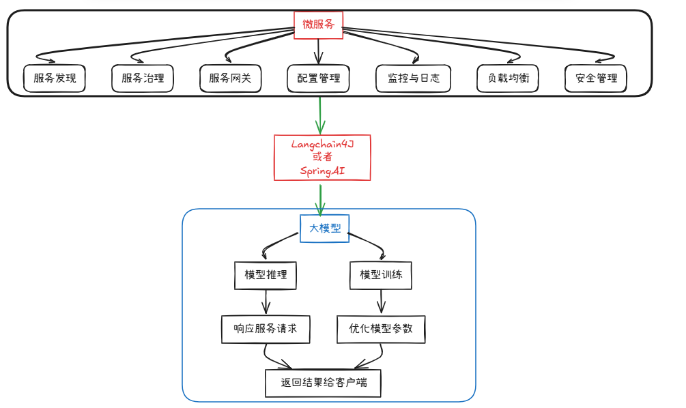
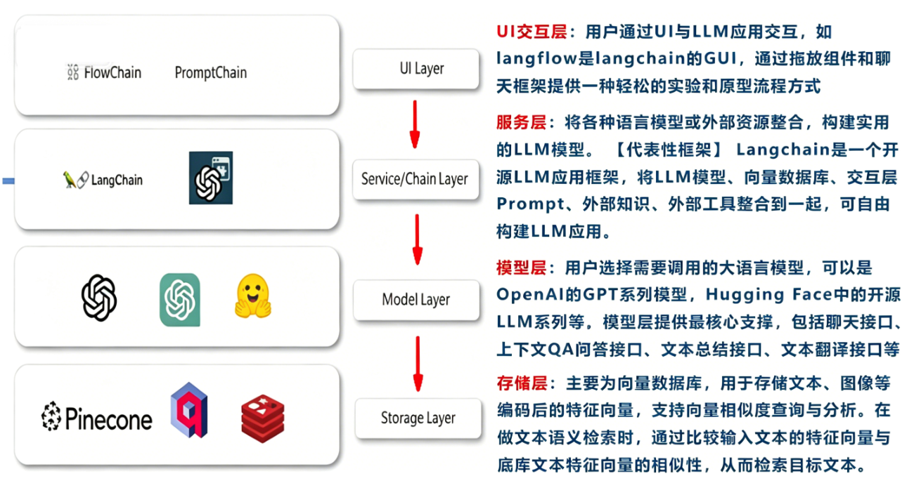
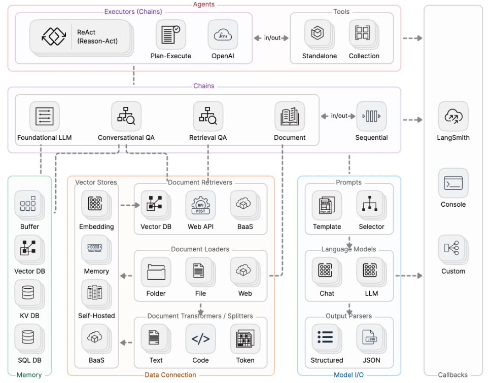
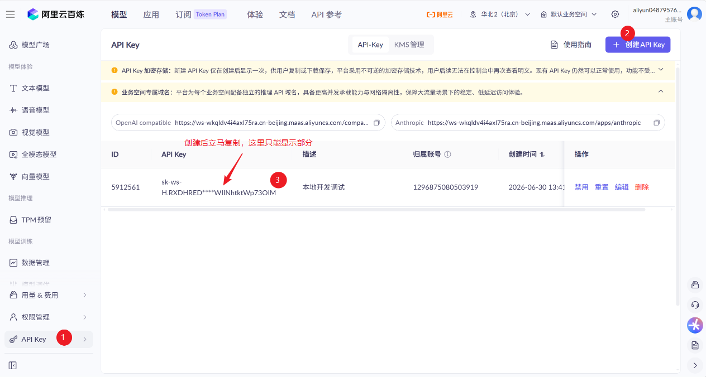
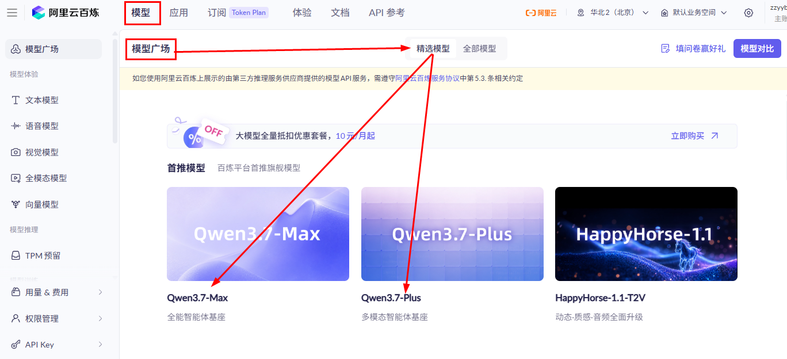
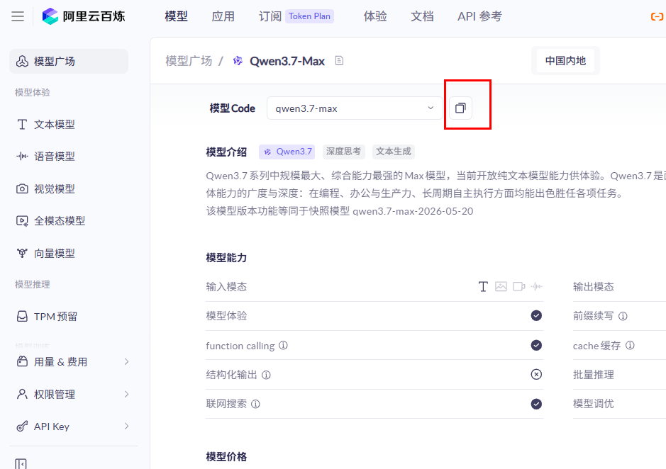
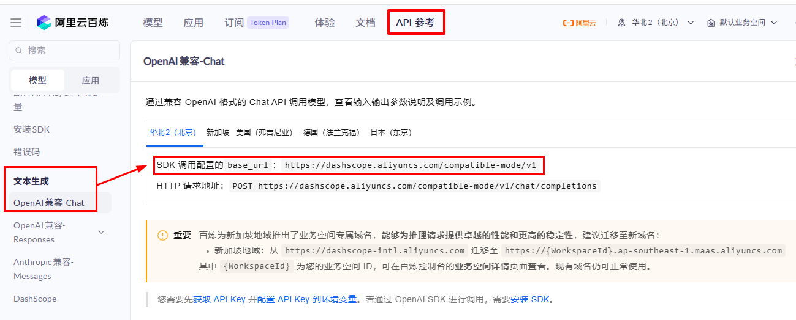
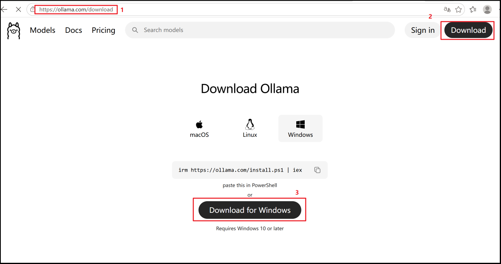

# 1.理论概述

## 1.1.LangChain的介绍

```python
1.概述:一套用于打通大模型与外部数据 / 工具的开发工具库。
    
2.两大版本:
  a.LangChain = LangChain for Python（原版，生态最完善）
  b.LangChain4J = LangChain for Java（Java 生态适配版）
    
3.下载地址:
  a.官网地址:
    英文: https://docs.langchain.com/oss/python/langchain/overview
    中文: https://docs.langchain.org.cn/oss/python/langchain/overview
  b.github地址: https://github.com/langchain-ai
  b.API 文档: 
    https://reference.langchain.com/python/langchain/
    https://reference.langchain.com/python/langchain/langchain/
```



## 1.2.LLM大模型应用技术架构



## 1.3LangChain的总体架构

```python
LangChain的架构主要包括六大核心组件:
1.Models 模型层：统一适配各类线上、本地大模型，一套代码即可切换底层 AI，不用重复编写调用逻辑。
2.Memory 记忆层：存储多轮对话历史，让 AI 记住上下文，实现连贯连续聊天。
3.Retrieval 检索层：读取私有文档构建知识库，提问时自动匹配相关资料，降低 AI 凭空编造内容的概率。
4.Chains 链路层：将检索、调模型、整理结果等多个固定步骤串联，一键自动完整执行整套流程。
5.Agents 智能体：AI 自主判断需求，自动选用搜索、计算等外部工具，无需手动设定执行步骤。
6.Callback 回调：全流程埋点记录日志、耗时与报错，用于开发调试和线上运行监控。
```



# 2.大模型服务平台

```python
LangChain作为一个“工具”，依赖于第三方集成各种大模型。

有许多提供大模型API服务的平台，使用时只需要注册、充值并创建API-Key，之后即可使用API-Key与URL来调用平台提供的相应的模型的服务。
```

| 平台名称   | 官方访问地址                                                 | 核心定位                                                     |
| ---------- | ------------------------------------------------------------ | ------------------------------------------------------------ |
| CloseAI    | https://platform.closeai-asia.com/                           | 海外大模型国内代理平台，提供 GPT、Claude 等海外主流模型的国内直连服务 |
| OpenRouter | [https://openrouter.ai/](https://link.wtturl.cn/?target=https%3A%2F%2Fopenrouter.ai%2F&scene=im&aid=497858&lang=zh) | 全球大模型聚合平台，一站式接入 300 + 全球主流闭源 / 开源大模型 |
| 阿里云百炼 | [https://bailian.console.aliyun.com/](https://link.wtturl.cn/?target=https%3A%2F%2Fbailian.console.aliyun.com%2F&scene=im&aid=497858&lang=zh) | 阿里云旗下国产大模型服务平台，以通义千问系列为核心，提供全链路 AI 开发能力 |
| 百度千帆   | [https://console.bce.baidu.com/qianfan/overview](https://link.wtturl.cn/?target=https%3A%2F%2Fconsole.bce.baidu.com%2Fqianfan%2Foverview&scene=im&aid=497858&lang=zh) | 百度旗下大模型服务平台，以文心一言系列为核心，深度适配百度生态与中文场景 |
| 硅基流动   | [https://www.siliconflow.cn/](https://link.wtturl.cn/?target=https%3A%2F%2Fwww.siliconflow.cn%2F&scene=im&aid=497858&lang=zh) | 国内开源大模型算力服务平台，主打开源大模型一键部署、低成本推理与定制化微调 |

# 3.入门案例

## 3.1.接入阿里百炼平台的通义模型

```python
登录阿里云账号，打开百炼控制台：https://bailian.console.aliyun.com/
```

### 3.1.1.获得Api-key并配置系统环境变量

#### 3.1.1.1.获得Api-key

```
1.进入密钥管理页面
左侧侧边栏找到 API - 密钥管理，点击进入。

2.创建 API Key
页面右上角点击 创建 API Key，弹窗填写密钥备注（如 “本地开发调试”），确认创建。

3.保存密钥
创建完成后页面会显示 sk- 开头的密钥字符串，立刻复制保存到本地 / 配置文件。

sk-ws-H.RXDHRED.O7gA.MEUCIQDiPlhAcIM4MIC1J0eHBBnP_V7dF8RsAqn6LzHr2BkYpvEaGgD5Qmx0SdNp7vXbM5yKtqgZcC28PLS
```



#### 3.1.1.2.配置系统环境变量

```python
1.为什么配置系统环境变量?
  a.保护密钥：API 密钥不写进代码，上传代码不会泄露，避免被盗刷扣费
  b.全局复用：一次配置，电脑所有 Python 项目、终端都能直接读取，不用重复复制密钥
  c.切换环境方便：本地开发一套密钥，线上服务器单独配置，代码无需改动
    
2.如何配置系统环境变量?
  a.快捷键 Win+R，输入 sysdm.cpl 回车
  b.弹出窗口点【高级】→右下角【环境变量】
  c.在下方「系统变量」点击【新建】
    变量名：DASHSCOPE_API_KEY
    变量值：粘贴阿里云百炼 sk 开头密钥
  d.全部弹窗点确定保存
  e.打开终端（PowerShell）验证是否生效
    echo $env:DASHSCOPE_API_KEY
```

> 配置完如果pycharm正在使用，需要重新打开才会生效

### 3.1.2.获得模型名

```
1.顶部导航栏点击【模型】，进入【模型广场】页面
2.在精选模型区域，选择需要使用的通义模型（示例：Qwen3.7-Max / Qwen3.7-Plus），点击模型卡片进入详情页
3.在详情页找到「模型 Code」输入框，点击右侧复制按钮，复制完整模型标识（如 qwen3.7-max）

qwen3.7-plus
```





### 3.1.3.获得baseUrl开发地址

```python
1.顶部导航栏点击【文档】/【API 参考】
2.左侧找到「兼容 OpenAI 接口」栏目
3.页面内会标注兼容模式请求域名，复制上述地址作为 baseUrl

base_url：https://{WorkspaceId}.cn-beijing.maas.aliyuncs.com/compatible-mode/v1
```



## 3.2.安装依赖包

```python
想让当前虚拟环境以后默认走清华源，可先执行：
pip config set global.index-url https://pypi.tuna.tsinghua.edu.cn/simple
 
- 安装langchain
- 安装langchain-openai
- 安装openai
- 安装dotenv
- 安装langchain-core
- 安装langchain-deepseek

# langchain 提供核心框架（Chain, Agent, Memory, Retriever等） 
pip install langchain

# 提供OpenAI专用组件（LLM, Chat, Embeddings等），依赖 openai SDK
pip install langchain-openai
pip install openai

# 通过 python-dotenv 库读取 env 文件中的环境变量，并加载到当前运行的环境中
pip install python-dotenv

# 底层通用基础包，统一所有模型 / 组件标准接口，其他包都依赖它
pip install langchain-core

# 对接深度求索 DeepSeek 大模型，适配 LangChain 标准写法
pip install langchain-deepseek
```

## 3.3.代码实现

```python
# 1.导入依赖
import os
from langchain.chat_models import init_chat_model

# 2.实例化模型
model = init_chat_model(
    model="qwen3.7-plus", #模型名
    model_provider="openai", #用 OpenAI 标准接口协议来对接当前模型
    api_key=os.getenv("DASHSCOPE_API_KEY"), #配置在自己本地环境变量里的Api-key
    base_url="https://dashscope.aliyuncs.com/compatible-mode/v1" #baseUrl开发地址
)

# 3.调用模型
print(model.invoke("你是谁，50字内回复"))
```

# 4.动嘴编程-提示词

```python
1.提示词 = 给 AI 听的、口语化编程需求话术，靠打字说话指挥 AI 生成 / 调试代码。

2.提示词模板：

核心思路：分层结构化提示词（效果最优）
设计逻辑（教学原理）
身份定位：明确我是 Python LangChain 代码生成助手，只输出可运行完整代码；
硬性约束：指定使用init_chat_model、阿里云通义千问兼容 OpenAI 模式、固定参数；
代码规范要求：注释风格、变量命名、注释说明、代码结构分段；
输出格式限制：只给代码，附带极简解释，不冗余；
补充避坑规则：环境变量、接口地址、provider 固定值。


3.入门案例提示词:
    
【角色】你是专业LangChain Python代码生成助手，只输出完整可运行代码，附带少量行内注释与分段注释。
【需求】使用 langchain.chat_models.init_chat_model 实例化阿里云通义千问兼容OpenAI接口模型。
【强制固定参数，不可修改】
1. model名称："qwen3.7-max"
2. model_provider："openai"
3. api_key读取方式：os.getenv("DASHSCOPE_API_KEY")，注释说明密钥存本地环境变量
4. base_url固定地址：https://dashscope.aliyuncs.com/compatible-mode/v1
【代码结构要求】
1. 顶部导入os和init_chat_model
2. 分两段：第一段实例化模型，添加注释解释关键字参数；第二段调用invoke完成对话
3. invoke入参："你是谁，50字内回复"，打印.content
4. 注释清晰、代码整洁、分段换行规范
【输出要求】仅输出完整Python代码，不要多余文字，代码注释完整易懂
```

# 5.进阶案例

```python
1.要求：同时存在多种大模型产品在系统里共存使用

2.和之前接入阿里的模型一样，换别家大模型，必须改三样东西
  a.获得Api-key
  b.获得模型名
  c.获得baseUrl开发地址
    
3.直接改model="xx"就可以用别家大模型,为什么还要再配置多套共存呢？
  a.省钱、不宕机、发挥各模型优势、适配不同业务需求
```

## 5.1.接入DeepSeek大模型

```python
1.官网: https://platform.deepseek.com/usage
        
2.接入DeepSeek大模型和之前的接入阿里百炼平台的通义模型流程是一样的,具体过程这里不再赘述
  a.获得Api-key
  b.获得模型名
  C.获得baseUrl开发地址
```

## 5.2.案例提示词

```python
【角色】你是专业LangChain Python代码生成助手，只输出完整可运行代码，附带少量行内注释与分段注释。
【需求】使用 langchain.chat_models.init_chat_model 实例化阿里云通义千问兼容OpenAI接口模型。
【强制固定参数，不可修改】
1. model名称：一个py文件里定义两个model，一个是"qwen3.7-max"，另一个是deepseek-v4-pro
2. model_provider："openai"
3. 两个api_key读取方式：os.getenv("DASHSCOPE_API_KEY"),api_key=os.getenv("DEEPSEEK_API_KEY"),# 从环境变量配置中读取
4. 两个base_url固定地址：https://dashscope.aliyuncs.com/compatible-mode/v1，base_url="https://api.deepseek.com"
【代码结构要求】
1. 顶部导入os和init_chat_model
2. 分两段：第一段实例化模型，添加注释解释关键字参数；第二段调用invoke完成对话
3. invoke入参："你是谁，50字内回复"，打印.content
4. 注释清晰、代码整洁、分段换行规范
【输出要求】仅输出完整Python代码，不要多余文字，代码注释完整易懂
【其它要求】
同一个py文件里面，分别调用千问和deepseek两个模型
```

## 5.3.代码实现

```python
import os
from langchain.chat_models import init_chat_model

# ══════════════════════════════════════════════════════
# 1. 实例化两个模型（不同供应商）
# ══════════════════════════════════════════════════════

# —— 1a. 阿里云通义千问 qwen3.7-max ——
# 通过 OpenAI 兼容协议访问阿里云 DashScope 接入点
llm_qwen = init_chat_model(
    model="qwen3.7-max",                                # 通义千问最新旗舰模型
    model_provider="openai",                             # 使用 OpenAI 兼容接口
    api_key=os.getenv("DASHSCOPE_API_KEY"),                    # 密钥存本地环境变量
    base_url="https://dashscope.aliyuncs.com/compatible-mode/v1",  # 阿里云接入点
    temperature=0,
)

# —— 1b. DeepSeek V4 Pro ——
# 通过 OpenAI 兼容协议访问 DeepSeek 官方 API
llm_deepseek = init_chat_model(
    model="deepseek-v4-pro",                             # DeepSeek 第四代旗舰
    model_provider="openai",                             # DeepSeek 同样兼容 OpenAI 协议
    api_key=os.getenv("DEEPSEEK_API_KEY"),                   # 从环境变量配置中读取
    base_url="https://api.deepseek.com",                 # DeepSeek 官方 API 地址
    temperature=0,
)

# ══════════════════════════════════════════════════════
# 2. 分别调用两个模型
# ══════════════════════════════════════════════════════

prompt = "你是谁，50字内回复"

print("=" * 60)
print("🤖 通义千问 qwen3.7-max 回复：")
resp_qwen = llm_qwen.invoke(prompt)
print(resp_qwen.content)

print("=" * 60)
print("🤖 DeepSeek V4 Pro 回复：")
resp_deepseek = llm_deepseek.invoke(prompt)
print(resp_deepseek.content)

print("=" * 60)

```

# 6.Model I/O大模型接口

## 6.1.基本介绍

```python
1.介绍：Model = 大模型；I/O = Input 输入 + Output 输出，全称模型输入输出统一交互层，是 LangChain 和所有大模型对话的底层标准接口。

2.作用：屏蔽阿里云、DeepSeek、GPT 等各家 API 差异，一套写法调用所有模型。

3.核心组成(Prompts 管输入、Models 管调用、Parsers 管输出)：
  a.Prompt 输入格式化(Format)
    负责格式化输入给大模型固定角色、对话模板、变量填充统一生成各家模型都能识别的消息结构  
    
  b.Models 统一调用接口(Predict)
    就是你写的 init_chat_model / ChatOpenAI，统一 invoke() / stream() 调用方法，换厂商只改参数，调用代码不变。
    
  c.Output Parser 输出解析(Parse)
    把 AI 返回的纯文本，自动转 JSON、列表、对象，方便程序读取结构化数据。
    
4.核心好处：
  a.多模型无缝切换，不用重写调用逻辑
  b.统一输入输出规范，代码复用性高
  c.自带提示词管理、结构化输出工具
  d.支持同步 invoke、异步 ainvoke、流式 stream 统一写法
```

## 6.2.Model I/O的分类

```
LangChain中将大语言模型分为以下几种，我们主要使用的是聊天对话模型
```
| 模型分类                   | 输入格式                                                     | 输出格式           | 核心特性                                                     | 业务适用场景                                                 |
| -------------------------- | ------------------------------------------------------------ | ------------------ | ------------------------------------------------------------ | ------------------------------------------------------------ |
| LLM 基础文本模型           | 纯文本字符串                                                 | 纯文本字符串       | 1.初代基础生成模型<br>2.无角色区分，不自带上下文记忆<br>3.轻量、响应速度快 | 单轮简短问答、文本摘要、文案扩写、简单指令执行               |
| ChatModel 对话模型（主流） | 结构化消息列表<br>`[SystemMessage, HumanMessage, AIMessage]` | AIMessage 对话对象 | 1.专为多轮对话设计<br>2.支持人设、历史对话上下文<br>3.兼容工具调用、Agent开发 | 智能客服、多轮深度问答、代码推理、LangChain Agent开发（当前代码使用类型） |
| Embeddings 向量模型        | 单个文本 / 文本列表                                          | 浮点数字向量数组   | 1.不生成自然语言文本<br>2.将文字转为语义向量，用于相似度计算 | RAG知识库问答、文档检索、文本聚类、内容推荐系统              |

## 6.3.Model I/O的参数

### 6.3.1.初始化必填参数

| 参数名         | 作用说明                       | 取值示例                                                     |
| -------------- | ------------------------------ | ------------------------------------------------------------ |
| model          | 指定调用的模型名称             | "qwen3.7-max"、"deepseek-v3"                                 |
| model_provider | 声明接口协议标准               | "openai"（兼容 OpenAI 接口统一填这个）                       |
| api_key        | 接口鉴权密钥，读取本地环境变量 | os.getenv("DEEPSEEK_API_KEY")                                |
| base_url       | 厂商兼容接口网关地址           | 阿里云：[https://dashscope.aliyuncs.com/compatible-mode/v1](https://link.wtturl.cn/?target=https%3A%2F%2Fdashscope.aliyuncs.com%2Fcompatible-mode%2Fv1&scene=im&aid=497858&lang=zh) |

### 6.3.2.生成控制可调参数

| 参数名            | 取值范围   | 功能说明                                              | 适用场景推荐值                      |
| ----------------- | ---------- | ----------------------------------------------------- | ----------------------------------- |
| temperature       | 0 ~ 2      | 控制回答随机创造性；值越低越严谨固定，越高越天马行空  | 代码 / 推理：0~0.3文案创作：0.7~1.2 |
| max_tokens        | 正整数     | 限制 AI 单次回复最大 token 长度，防止超长输出         | 日常对话：512 / 长文档：2048        |
| top_p             | 0 ~ 1      | 核采样，只选取概率总和前 top_p 的词汇；越小输出越规整 | 专业问答：0.2~0.4创意写作：0.8~0.9  |
| stop              | 字符串列表 | 自定义停止标记，AI 识别到该词立刻终止输出             | stop=["###","结束回答"]             |
| frequency_penalty | -2 ~ 2     | 抑制重复高频词汇，正数减少重复                        | 长文本写作：0.1~0.5                 |
| presence_penalty  | -2 ~ 2     | 鼓励引入全新词汇，正数拓展内容多样性                  | 扩写、多方案生成：0.2~0.6           |

### 6.3.3.案例演示

```python
import os
from langchain.chat_models import init_chat_model

# ====================== 1. 初始化必填参数（缺一不可） ======================
chat_model = init_chat_model(
    # 必填1：模型名称
    model="deepseek-v4-pro",
    # 必填2：接口协议类型，兼容OpenAI统一填openai
    model_provider="openai",
    # 必填3：密钥，读取系统环境变量
    api_key=os.getenv("DEEPSEEK_API_KEY"),
    # 必填4：厂商接口地址
    base_url="https://api.deepseek.com",

    # ====================== 2. 生成控制可调参数（按需修改） ======================
    temperature=0.1,        # 低随机性，适合写代码、专业问答
    max_tokens=1024,        # 限制最大输出长度
    top_p=0.3,              # 只选用高概率文字，回答严谨
    frequency_penalty=0.2,  # 减少语句重复
    stop=["结束回答"]        # 遇到指定文字立刻停止生成
)

# 调用测试
res = chat_model.invoke("写一段读取环境变量的Python代码")
print(res.content)
```

## 6.4.Model I/O的返回

```python
1.ChatModel 调用model.invoke()返回的是 AIMessage 对象，包含多类信息。

2.返回示例：
content='我是DeepSeek，由深度求索公司创造的AI助手。纯文本模型，支持文件上传和长上下文，免费使用，可通过官网或App体验。' additional_kwargs={'refusal': None} response_metadata={'token_usage': {'completion_tokens': 121, 'prompt_tokens': 10, 'total_tokens': 131, 'completion_tokens_details': {'accepted_prediction_tokens': None, 'audio_tokens': None, 'reasoning_tokens': 86, 'rejected_prediction_tokens': None}, 'prompt_tokens_details': {'audio_tokens': None, 'cached_tokens': 0}, 'prompt_cache_hit_tokens': 0, 'prompt_cache_miss_tokens': 10}, 'model_provider': 'openai', 'model_name': 'deepseek-v4-pro', 'system_fingerprint': 'fp_9954b31ca7_prod0820_fp8_kvcache_20260402', 'id': '584b32a4-3630-4166-b048-2a13e965998c', 'finish_reason': 'stop', 'logprobs': None} id='lc_run--019f1889-75d6-7a60-850e-559d463fd1d8-0' tool_calls=[] invalid_tool_calls=[] usage_metadata={'input_tokens': 10, 'output_tokens': 121, 'total_tokens': 131, 'input_token_details': {'cache_read': 0}, 'output_token_details': {'reasoning': 86}}
```

| 字段               | 含义说明                                         | 业务用途                                           |
| ------------------ | ------------------------------------------------ | -------------------------------------------------- |
| content            | AI 输出的完整文本内容                            | 页面展示、业务回复，最常用                         |
| additional_kwargs  | 厂商额外返回扩展字段，如拒绝回答标记、引用溯源等 | 判断模型是否拒绝回答（refusal 不为空代表违规拦截） |
| response_metadata  | 模型底层请求完整元数据                           | 统计 token 消耗、记录使用模型、判断停止原因        |
| id                 | LangChain 内部消息唯一 ID                        | 日志追踪、区分多轮消息                             |
| tool_calls         | 模型工具调用列表                                 | Agent 场景，模型需要调用函数时存放工具参数         |
| invalid_tool_calls | 格式错误的工具调用                               | 调试 Agent，定位工具调用格式异常                   |
| usage_metadata     | 标准化 token 用量（LangChain 统一封装）          | 统一统计输入 / 输出 / 推理 token，跨厂商兼容       |

## 6.5.接入大模型

### 6.5.1.接入OPENAI

```
1.OPENAI 有 ChatOpenAI 和 init_chat_model 两种接入方式，两者定位、功能场景差异显著，无绝对优劣，需根据业务需求选择

2.ChatOpenAI 是 OpenAI 专属底层封装；init_chat_model 是顶层通用工厂，多模型统一适配入口。
```

| 维度         | ChatOpenAI                                      | init_chat_model                                            |
| ------------ | ----------------------------------------------- | ---------------------------------------------------------- |
| 适配范围     | 仅原生 OpenAI                                   | OpenAI、DeepSeek、阿里云百炼、智谱等全兼容 OpenAI 接口厂商 |
| 代码改动成本 | 切换厂商必须修改导入、类名、参数结构            | 切换厂商仅修改 4 项参数，调用逻辑完全不变                  |
| 适合项目规模 | 小型脚本、单模型 Demo、仅使用 OpenAI 的极简项目 | 中大型工程、多模型共存、容灾切换、模型评测系统             |
| 代码简洁度   | 单 OpenAI 场景代码更短，无需传`model_provider`  | 多厂商场景代码高度复用，配置集中管理                       |
| 底层关系     | 基础实现单元                                    | 内部自动调用 ChatOpenAI 等各类厂商专用类                   |

#### 6.5.1.1.方式1_ChatOpenAI

```python
# 1.导入依赖
import os
from langchain_openai import ChatOpenAI

# 2.实例化模型
model = ChatOpenAI(
    model="qwen3.7-max",
    api_key=os.getenv("DASHSCOPE_API_KEY"),
    base_url="https://dashscope.aliyuncs.com/compatible-mode/v1",
)

# 3.调用模型
print(model.invoke("你是谁").content)
```

#### 6.5.1.2.方式2_init_chat_model

```python
# 1.导入依赖
import os
from langchain.chat_models import init_chat_model

# 2.实例化模型
model = init_chat_model(
    model="qwen3.7-max",
    api_key=os.getenv("DASHSCOPE_API_KEY"),
    base_url="https://dashscope.aliyuncs.com/compatible-mode/v1"
)

# 3.调用模型
print(model.invoke("你是谁").content)
```

### 6.5.2.接入DeepSeek

```python
# 1.导入依赖
import os
from langchain_deepseek import ChatDeepSeek


# 2.实例化模型
model = ChatDeepSeek(
    model="deepseek-v4-pro", 
    api_key=os.getenv("DEEPSEEK_API_KEY"),
    base_url="https://api.deepseek.com", 
)

# 打印结果
print(model.invoke("你是谁").content)
```

> 也可以用 init_chat_model ，市面上所有主流大模型，全部都可以用 `init_chat_model` 接入

# 7.Ollama本地大模型部署

## 7.1.基本介绍

```python
1.介绍：Ollama 是开源、免费的本地大模型管理运行工具，类似 Docker，一键在电脑本地跑各类开源大模型，屏蔽底层复杂编译、环境、显存优化等技术细节。

2.一句话概括：不用租云端、不用付费 API，在自己 Windows/Mac/Linux 电脑离线跑各种 AI 大模型。

3.核心特点：
  a.极简一键部署
    一条命令下载、启动模型，自动做量化、GPU 加速、内存调度，不用手动转换模型文件、配置 CUDA 环境
    
  b.完全本地离线，隐私极强
    所有提问、文档数据只在本机处理，不上传第三方云端，适合企业内部资料、敏感文件分析。
    
  c.跨平台 + 自动硬件加速
    支持 Windows/macOS/Linux；自动识别 N 卡、AMD 显卡、苹果 M 系列芯片，低配电脑也能跑轻量化量化模型。
    
  d.海量开源模型全覆盖
    官方库支持：Llama3、通义 Qwen、DeepSeek、Mistral、Gemma、LLaVA 多模态看图模型等几十种主流开源模型。
    
  e.兼容标准 OpenAI 接口（开发重点）
    本地服务地址：http://localhost:11434/v1，完全复刻 OpenAI 对话 API 协议
            
  f.完整模型生命周期管理
    命令行管理本地模型：下载、查看、删除、监控运行占用资源

4.官方地址：https://ollama.com/
```

## 7.2.安装Ollama

### 7.2.1.下载安装包

```python
前往官网下载安装包：https://ollama.com/download
```



### 7.2.2.自定义安装

```
1.确认安装包 OllamaSetup.exe 的位置（这里我存放在 D 盘 D:\）

2.D 盘新建 2 个文件夹（提前建好，不要中文 / 空格）
  程序目录：D:\Ollama（放软件本体）
  模型目录：D:\ollama_models（存放下载的大模型，重点）

3.Win+R，输入 cmd，右键以管理员身份运行
  a.切换到安装包所在 D 盘目录  ->   cd /d D:\
  b.执行自定义安装命令，指定安装到 D:\Ollama  ->   OllamaSetup.exe /DIR="D:\Ollama"
  
4.弹出安装窗口直接点 Install，等待安装完成

5.配置模型存储到 D 盘
  a.Win+R 输入 sysdm.cpl 回车，打开【系统属性】
  b.顶部切换【高级】→ 右下角【环境变量】
  c.在下方系统变量区域，点击【新建】
    变量名：OLLAMA_MODELS（必须全大写）
	变量值：D:\ollama_models
  d.所有弹窗依次点【确定】保存全部配置

6.重启 Ollama 使配置生效
  a.右下角托盘找到羊驼 Ollama 图标，右键点击 Quit Ollama 完全退出
  b.开始菜单重新打开 Ollama，启动服务

6.验证是否全部生效
  a.新开 CMD 输入  ->   where ollama  ->   输出路径开头为 D:\Ollama 即程序安装成功
  b.拉取一个小模型测试  ->   ollama pull qwen2.5:latest  ->   D:\ollama_models 内有文件即成功
```

## 7.3.Ollama常用指令

### 7.3.1.模型下载与拉取

```shell
# 拉取模型（核心下载命令）
ollama pull qwen2.5:latest

# 国内加速拉取（modelscope镜像）
ollama pull modelscope.cn/Qwen/Qwen2.5-7B-Instruct-GGUF

# 查看模型支持的所有量化版本
ollama list qwen2.5
```

### 7.3.2.本地模型管理

```shell
# 查看本机已下载全部模型
ollama list

# 删除指定模型，释放磁盘空间
ollama rm qwen3:1.7b

# 复制模型（自定义标签）
ollama cp qwen2.5:latest myqwen

# 查看模型详情（大小、参数、量化信息）
ollama show qwen2.5:latest
```

### 7.3.3.本地对话运行

```shell
# 交互式命令行对话
ollama run qwen2.5:latest

# 单次提问直接输出结果（不进入交互）
ollama run qwen2.5:latest "写一段Python冒泡排序代码"

# 退出交互对话界面
>>> /bye
```

### 7.3.4.运行监控与进程

```shell
# 查看当前正在加载/运行的模型（占用内存）
ollama ps

# 停止所有正在运行的模型，释放内存
ollama stop all

# 停止指定模型
ollama stop qwen2.5:latest
```

### 7.3.5.服务与基础信息

```shell
# 查看Ollama版本
ollama --version

# 手动启动后台服务（一般安装后自动常驻）
ollama serve

# 查看帮助文档
ollama help
```

## 7.4.整合Ollama调用本地大模型

```python
# pip install -qU langchain-ollama
# pip install -U ollama

from langchain_ollama import ChatOllama

# 设置本地模型，不使用深度思考
model = ChatOllama(base_url="http://localhost:11434", model="qwen2.5:latest", reasoning=False)
# 打印结果，
print(model.invoke("什么是LangChain，100字以内回答").content)
```

> 如果使用 init_chat_model 的方式接入则不需要安装 ollama 、langchain-ollama
