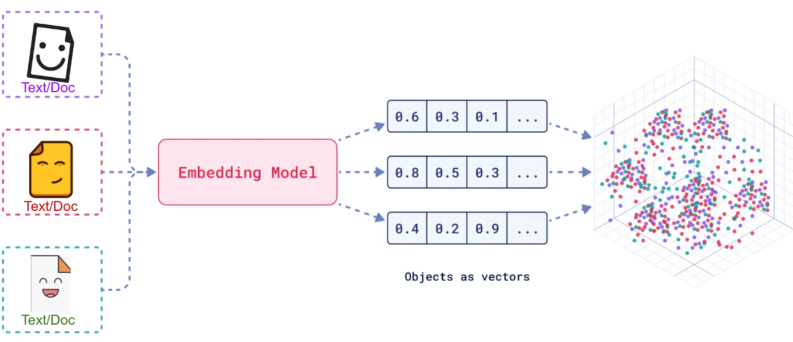
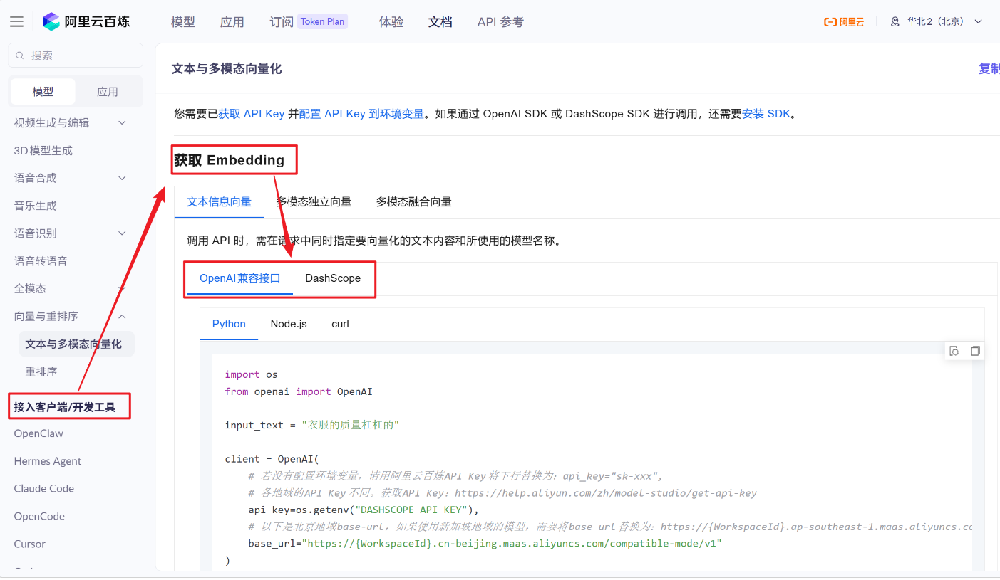
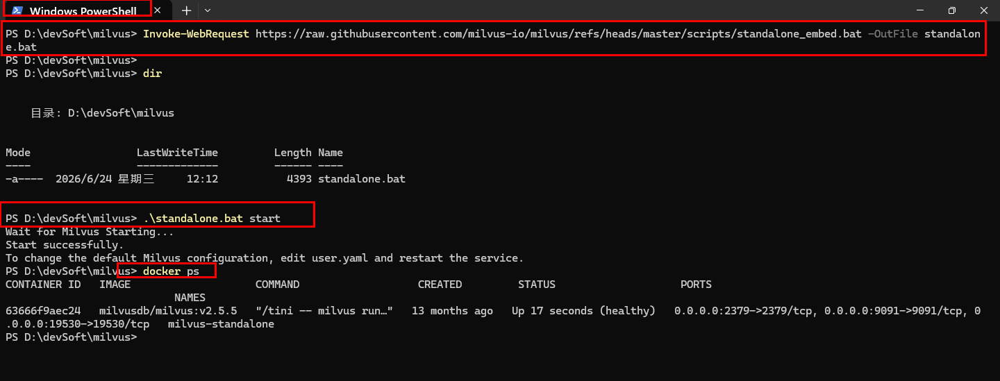
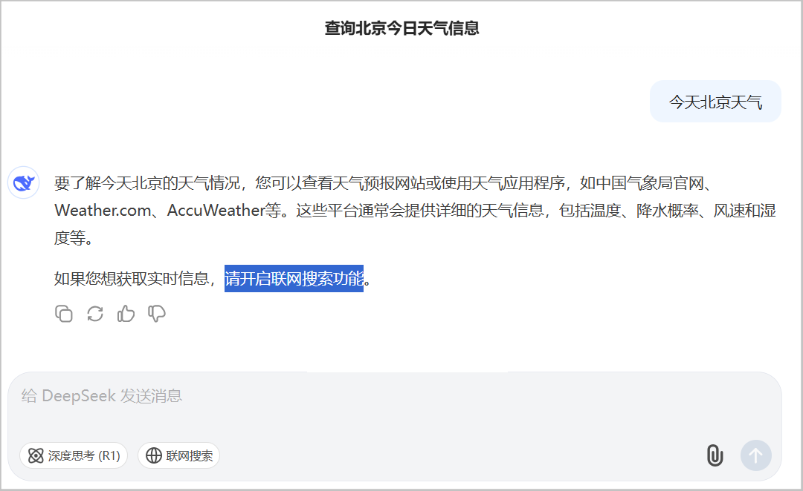
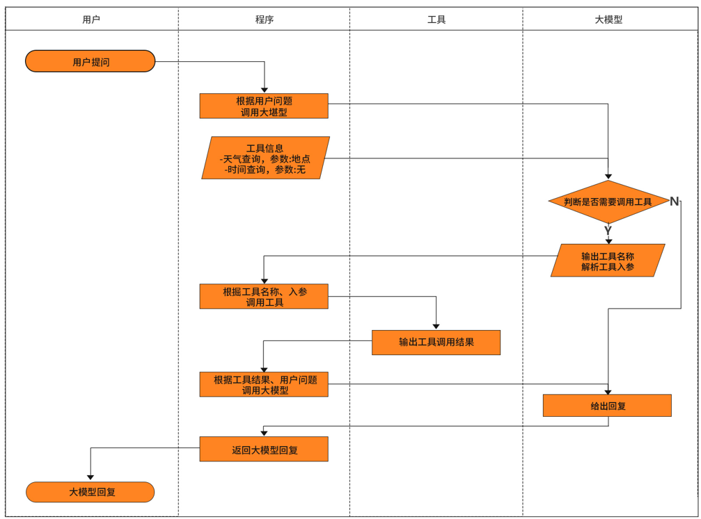
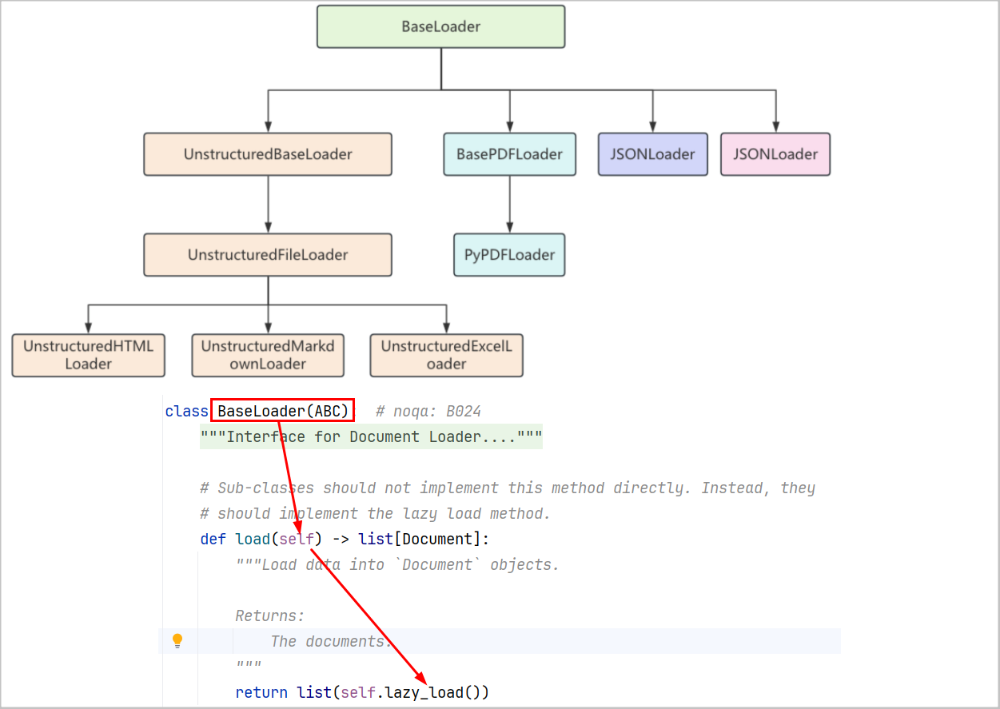

# 1.理论概述

## 1.1.LangChain的介绍

```python
1.概述:一套用于打通大模型与外部数据 / 工具的开发工具库。
    
2.两大版本:
  a.LangChain = LangChain for Python（原版，生态最完善）
  b.LangChain4J = LangChain for Java（Java 生态适配版）
    
3.下载地址:
  a.官网地址:
    英文: https://docs.langchain.com/oss/python/langchain/overview
    中文: https://docs.langchain.org.cn/oss/python/langchain/overview
  b.github地址: https://github.com/langchain-ai
  b.API 文档: 
    https://reference.langchain.com/python/langchain/
    https://reference.langchain.com/python/langchain/langchain/
```


## 1.2.LLM大模型应用技术架构


## 1.3.LangChain的总体架构

```python
LangChain的架构主要包括六大核心组件:
1.Models 模型层：统一适配各类线上、本地大模型，一套代码即可切换底层 AI，不用重复编写调用逻辑。
2.Memory 记忆层：存储多轮对话历史，让 AI 记住上下文，实现连贯连续聊天。
3.Retrieval 检索层：读取私有文档构建知识库，提问时自动匹配相关资料，降低 AI 凭空编造内容的概率。
4.Chains 链路层：将检索、调模型、整理结果等多个固定步骤串联，一键自动完整执行整套流程。
5.Agents 智能体：AI 自主判断需求，自动选用搜索、计算等外部工具，无需手动设定执行步骤。
6.Callback 回调：全流程埋点记录日志、耗时与报错，用于开发调试和线上运行监控。
```


# 2.大模型服务平台

```python
LangChain作为一个“工具”，依赖于第三方集成各种大模型。

有许多提供大模型API服务的平台，使用时只需要注册、充值并创建API-Key，之后即可使用API-Key与URL来调用平台提供的相应的模型的服务。
```

| 平台名称   | 官方访问地址                                                 | 核心定位                                                     |
| ---------- | ------------------------------------------------------------ | ------------------------------------------------------------ |
| CloseAI    | https://platform.closeai-asia.com/                           | 海外大模型国内代理平台，提供 GPT、Claude 等海外主流模型的国内直连服务 |
| OpenRouter | [https://openrouter.ai/](https://link.wtturl.cn/?target=https%3A%2F%2Fopenrouter.ai%2F&scene=im&aid=497858&lang=zh) | 全球大模型聚合平台，一站式接入 300 + 全球主流闭源 / 开源大模型 |
| 阿里云百炼 | [https://bailian.console.aliyun.com/](https://link.wtturl.cn/?target=https%3A%2F%2Fbailian.console.aliyun.com%2F&scene=im&aid=497858&lang=zh) | 阿里云旗下国产大模型服务平台，以通义千问系列为核心，提供全链路 AI 开发能力 |
| 百度千帆   | [https://console.bce.baidu.com/qianfan/overview](https://link.wtturl.cn/?target=https%3A%2F%2Fconsole.bce.baidu.com%2Fqianfan%2Foverview&scene=im&aid=497858&lang=zh) | 百度旗下大模型服务平台，以文心一言系列为核心，深度适配百度生态与中文场景 |
| 硅基流动   | [https://www.siliconflow.cn/](https://link.wtturl.cn/?target=https%3A%2F%2Fwww.siliconflow.cn%2F&scene=im&aid=497858&lang=zh) | 国内开源大模型算力服务平台，主打开源大模型一键部署、低成本推理与定制化微调 |

# 3.入门案例

## 3.1.接入阿里百炼平台的通义模型

```python
登录阿里云账号，打开百炼控制台：https://bailian.console.aliyun.com/
```

### 3.1.1.获得Api-key并配置系统环境变量

#### 3.1.1.1.获得Api-key

```
1.进入密钥管理页面
左侧侧边栏找到 API - 密钥管理，点击进入。

2.创建 API Key
页面右上角点击 创建 API Key，弹窗填写密钥备注（如 “本地开发调试”），确认创建。

3.保存密钥
创建完成后页面会显示 sk- 开头的密钥字符串，立刻复制保存到本地 / 配置文件。

sk-ws-H.RXDHRED.O7gA.MEUCIQDiPlhAcIM4MIC1J0eHBBnP_V7dF8RsAqn6LzHr2BkYpvEaGgD5Qmx0SdNp7vXbM5yKtqgZcC28PLS
```


#### 3.1.1.2.配置系统环境变量

```python
1.为什么配置系统环境变量?
  a.保护密钥：API 密钥不写进代码，上传代码不会泄露，避免被盗刷扣费
  b.全局复用：一次配置，电脑所有 Python 项目、终端都能直接读取，不用重复复制密钥
  c.切换环境方便：本地开发一套密钥，线上服务器单独配置，代码无需改动
    
2.如何配置系统环境变量?
  a.快捷键 Win+R，输入 sysdm.cpl 回车
  b.弹出窗口点【高级】→右下角【环境变量】
  c.在下方「系统变量」点击【新建】
    变量名：DASHSCOPE_API_KEY
    变量值：粘贴阿里云百炼 sk 开头密钥
  d.全部弹窗点确定保存
  e.打开终端（PowerShell）验证是否生效
    echo $env:DASHSCOPE_API_KEY
```

> 配置完如果pycharm正在使用，需要重新打开才会生效

### 3.1.2.获得模型名

```
1.顶部导航栏点击【模型】，进入【模型广场】页面
2.在精选模型区域，选择需要使用的通义模型（示例：Qwen3.7-Max / Qwen3.7-Plus），点击模型卡片进入详情页
3.在详情页找到「模型 Code」输入框，点击右侧复制按钮，复制完整模型标识（如 qwen3.7-max）

qwen3.7-plus
```


### 3.1.3.获得baseUrl开发地址

```python
1.顶部导航栏点击【文档】/【API 参考】
2.左侧找到「兼容 OpenAI 接口」栏目
3.页面内会标注兼容模式请求域名，复制上述地址作为 baseUrl

base_url：https://{WorkspaceId}.cn-beijing.maas.aliyuncs.com/compatible-mode/v1
```


## 3.2.安装依赖包

```python
想让当前虚拟环境以后默认走清华源，可先执行：
pip config set global.index-url https://pypi.tuna.tsinghua.edu.cn/simple
 
- 安装langchain
- 安装langchain-openai
- 安装openai
- 安装dotenv
- 安装langchain-core
- 安装langchain-deepseek

# langchain 提供核心框架（Chain, Agent, Memory, Retriever等） 
pip install langchain

# 提供OpenAI专用组件（LLM, Chat, Embeddings等），依赖 openai SDK
pip install langchain-openai
pip install openai

# 通过 python-dotenv 库读取 env 文件中的环境变量，并加载到当前运行的环境中
pip install python-dotenv

# 底层通用基础包，统一所有模型 / 组件标准接口，其他包都依赖它
pip install langchain-core

# 对接深度求索 DeepSeek 大模型，适配 LangChain 标准写法
pip install langchain-deepseek
```

## 3.3.代码实现

```python
# 1.导入依赖
import os
from langchain.chat_models import init_chat_model

# 2.实例化模型
model = init_chat_model(
    model="qwen3.7-plus", #模型名
    model_provider="openai", #用 OpenAI 标准接口协议来对接当前模型
    api_key=os.getenv("DASHSCOPE_API_KEY"), #配置在自己本地环境变量里的Api-key
    base_url="https://dashscope.aliyuncs.com/compatible-mode/v1" #baseUrl开发地址
)

# 3.调用模型
print(model.invoke("你是谁，50字内回复"))
```

# 4.动嘴编程-提示词

```python
1.提示词 = 给 AI 听的、口语化编程需求话术，靠打字说话指挥 AI 生成 / 调试代码。

2.提示词模板：

核心思路：分层结构化提示词（效果最优）
设计逻辑（教学原理）
身份定位：明确我是 Python LangChain 代码生成助手，只输出可运行完整代码；
硬性约束：指定使用init_chat_model、阿里云通义千问兼容 OpenAI 模式、固定参数；
代码规范要求：注释风格、变量命名、注释说明、代码结构分段；
输出格式限制：只给代码，附带极简解释，不冗余；
补充避坑规则：环境变量、接口地址、provider 固定值。


3.入门案例提示词:
    
【角色】你是专业LangChain Python代码生成助手，只输出完整可运行代码，附带少量行内注释与分段注释。
【需求】使用 langchain.chat_models.init_chat_model 实例化阿里云通义千问兼容OpenAI接口模型。
【强制固定参数，不可修改】
1. model名称："qwen3.7-max"
2. model_provider："openai"
3. api_key读取方式：os.getenv("DASHSCOPE_API_KEY")，注释说明密钥存本地环境变量
4. base_url固定地址：https://dashscope.aliyuncs.com/compatible-mode/v1
【代码结构要求】
1. 顶部导入os和init_chat_model
2. 分两段：第一段实例化模型，添加注释解释关键字参数；第二段调用invoke完成对话
3. invoke入参："你是谁，50字内回复"，打印.content
4. 注释清晰、代码整洁、分段换行规范
【输出要求】仅输出完整Python代码，不要多余文字，代码注释完整易懂
```

# 5.进阶案例

```python
1.要求：同时存在多种大模型产品在系统里共存使用

2.和之前接入阿里的模型一样，换别家大模型，必须改三样东西
  a.获得Api-key
  b.获得模型名
  c.获得baseUrl开发地址
    
3.直接改model="xx"就可以用别家大模型,为什么还要再配置多套共存呢？
  a.省钱、不宕机、发挥各模型优势、适配不同业务需求
```

## 5.1.接入DeepSeek大模型

```python
1.官网: https://platform.deepseek.com/usage
        
2.接入DeepSeek大模型和之前的接入阿里百炼平台的通义模型流程是一样的,具体过程这里不再赘述
  a.获得Api-key
  b.获得模型名
  C.获得baseUrl开发地址
```

## 5.2.案例提示词

```python
【角色】你是专业LangChain Python代码生成助手，只输出完整可运行代码，附带少量行内注释与分段注释。
【需求】使用 langchain.chat_models.init_chat_model 实例化阿里云通义千问兼容OpenAI接口模型。
【强制固定参数，不可修改】
1. model名称：一个py文件里定义两个model，一个是"qwen3.7-max"，另一个是deepseek-v4-pro
2. model_provider："openai"
3. 两个api_key读取方式：os.getenv("DASHSCOPE_API_KEY"),api_key=os.getenv("DEEPSEEK_API_KEY"),# 从环境变量配置中读取
4. 两个base_url固定地址：https://dashscope.aliyuncs.com/compatible-mode/v1，base_url="https://api.deepseek.com"
【代码结构要求】
1. 顶部导入os和init_chat_model
2. 分两段：第一段实例化模型，添加注释解释关键字参数；第二段调用invoke完成对话
3. invoke入参："你是谁，50字内回复"，打印.content
4. 注释清晰、代码整洁、分段换行规范
【输出要求】仅输出完整Python代码，不要多余文字，代码注释完整易懂
【其它要求】
同一个py文件里面，分别调用千问和deepseek两个模型
```

## 5.3.代码实现

```python
import os
from langchain.chat_models import init_chat_model

# ══════════════════════════════════════════════════════
# 1. 实例化两个模型（不同供应商）
# ══════════════════════════════════════════════════════

# —— 1a. 阿里云通义千问 qwen3.7-max ——
# 通过 OpenAI 兼容协议访问阿里云 DashScope 接入点
llm_qwen = init_chat_model(
    model="qwen3.7-max",                                # 通义千问最新旗舰模型
    model_provider="openai",                             # 使用 OpenAI 兼容接口
    api_key=os.getenv("DASHSCOPE_API_KEY"),                    # 密钥存本地环境变量
    base_url="https://dashscope.aliyuncs.com/compatible-mode/v1",  # 阿里云接入点
    temperature=0,
)

# —— 1b. DeepSeek V4 Pro ——
# 通过 OpenAI 兼容协议访问 DeepSeek 官方 API
llm_deepseek = init_chat_model(
    model="deepseek-v4-pro",                             # DeepSeek 第四代旗舰
    model_provider="openai",                             # DeepSeek 同样兼容 OpenAI 协议
    api_key=os.getenv("DEEPSEEK_API_KEY"),                   # 从环境变量配置中读取
    base_url="https://api.deepseek.com",                 # DeepSeek 官方 API 地址
    temperature=0,
)

# ══════════════════════════════════════════════════════
# 2. 分别调用两个模型
# ══════════════════════════════════════════════════════

prompt = "你是谁，50字内回复"

print("=" * 60)
print("🤖 通义千问 qwen3.7-max 回复：")
resp_qwen = llm_qwen.invoke(prompt)
print(resp_qwen.content)

print("=" * 60)
print("🤖 DeepSeek V4 Pro 回复：")
resp_deepseek = llm_deepseek.invoke(prompt)
print(resp_deepseek.content)

print("=" * 60)

```

# 6.Model I/O大模型接口

## 6.1.基本介绍

```python
1.介绍：Model = 大模型；I/O = Input 输入 + Output 输出，全称模型输入输出统一交互层，是 LangChain 和所有大模型对话的底层标准接口。

2.作用：屏蔽阿里云、DeepSeek、GPT 等各家 API 差异，一套写法调用所有模型。

3.核心组成(Prompts 管输入、Models 管调用、Parsers 管输出)：
  a.Prompt 输入格式化(Format)
    负责格式化输入给大模型固定角色、对话模板、变量填充统一生成各家模型都能识别的消息结构  
    
  b.Models 统一调用接口(Predict)
    就是你写的 init_chat_model / ChatOpenAI，统一 invoke() / stream() 调用方法，换厂商只改参数，调用代码不变。
    
  c.Output Parser 输出解析(Parse)
    把 AI 返回的纯文本，自动转 JSON、列表、对象，方便程序读取结构化数据。
    
4.核心好处：
  a.多模型无缝切换，不用重写调用逻辑
  b.统一输入输出规范，代码复用性高
  c.自带提示词管理、结构化输出工具
  d.支持同步 invoke、异步 ainvoke、流式 stream 统一写法
```

## 6.2.Model I/O的分类

```
LangChain中将大语言模型分为以下几种，我们主要使用的是聊天对话模型
```
| 模型分类                   | 输入格式                                                     | 输出格式           | 核心特性                                                     | 业务适用场景                                                 |
| -------------------------- | ------------------------------------------------------------ | ------------------ | ------------------------------------------------------------ | ------------------------------------------------------------ |
| LLM 基础文本模型           | 纯文本字符串                                                 | 纯文本字符串       | 1.初代基础生成模型<br>2.无角色区分，不自带上下文记忆<br>3.轻量、响应速度快 | 单轮简短问答、文本摘要、文案扩写、简单指令执行               |
| ChatModel 对话模型（主流） | 结构化消息列表<br>`[SystemMessage, HumanMessage, AIMessage]` | AIMessage 对话对象 | 1.专为多轮对话设计<br>2.支持人设、历史对话上下文<br>3.兼容工具调用、Agent开发 | 智能客服、多轮深度问答、代码推理、LangChain Agent开发（当前代码使用类型） |
| Embeddings 向量模型        | 单个文本 / 文本列表                                          | 浮点数字向量数组   | 1.不生成自然语言文本<br>2.将文字转为语义向量，用于相似度计算 | RAG知识库问答、文档检索、文本聚类、内容推荐系统              |

## 6.3.Model I/O的参数

### 6.3.1.初始化必填参数

| 参数名         | 作用说明                       | 取值示例                                                     |
| -------------- | ------------------------------ | ------------------------------------------------------------ |
| model          | 指定调用的模型名称             | "qwen3.7-max"、"deepseek-v3"                                 |
| model_provider | 声明接口协议标准               | "openai"（兼容 OpenAI 接口统一填这个）                       |
| api_key        | 接口鉴权密钥，读取本地环境变量 | os.getenv("DEEPSEEK_API_KEY")                                |
| base_url       | 厂商兼容接口网关地址           | 阿里云：[https://dashscope.aliyuncs.com/compatible-mode/v1](https://link.wtturl.cn/?target=https%3A%2F%2Fdashscope.aliyuncs.com%2Fcompatible-mode%2Fv1&scene=im&aid=497858&lang=zh) |

### 6.3.2.生成控制可调参数

| 参数名            | 取值范围   | 功能说明                                              | 适用场景推荐值                      |
| ----------------- | ---------- | ----------------------------------------------------- | ----------------------------------- |
| temperature       | 0 ~ 2      | 控制回答随机创造性；值越低越严谨固定，越高越天马行空  | 代码 / 推理：0~0.3文案创作：0.7~1.2 |
| max_tokens        | 正整数     | 限制 AI 单次回复最大 token 长度，防止超长输出         | 日常对话：512 / 长文档：2048        |
| top_p             | 0 ~ 1      | 核采样，只选取概率总和前 top_p 的词汇；越小输出越规整 | 专业问答：0.2~0.4创意写作：0.8~0.9  |
| stop              | 字符串列表 | 自定义停止标记，AI 识别到该词立刻终止输出             | stop=["###","结束回答"]             |
| frequency_penalty | -2 ~ 2     | 抑制重复高频词汇，正数减少重复                        | 长文本写作：0.1~0.5                 |
| presence_penalty  | -2 ~ 2     | 鼓励引入全新词汇，正数拓展内容多样性                  | 扩写、多方案生成：0.2~0.6           |

### 6.3.3.案例演示

```python
import os
from langchain.chat_models import init_chat_model

# ====================== 1. 初始化必填参数（缺一不可） ======================
chat_model = init_chat_model(
    # 必填1：模型名称
    model="deepseek-v4-pro",
    # 必填2：接口协议类型，兼容OpenAI统一填openai
    model_provider="openai",
    # 必填3：密钥，读取系统环境变量
    api_key=os.getenv("DEEPSEEK_API_KEY"),
    # 必填4：厂商接口地址
    base_url="https://api.deepseek.com",

    # ====================== 2. 生成控制可调参数（按需修改） ======================
    temperature=0.1,        # 低随机性，适合写代码、专业问答
    max_tokens=1024,        # 限制最大输出长度
    top_p=0.3,              # 只选用高概率文字，回答严谨
    frequency_penalty=0.2,  # 减少语句重复
    stop=["结束回答"]        # 遇到指定文字立刻停止生成
)

# 调用测试
res = chat_model.invoke("写一段读取环境变量的Python代码")
print(res.content)
```

## 6.4.Model I/O的返回

```python
1.ChatModel 调用model.invoke()返回的是 AIMessage 对象，包含多类信息。

2.返回示例：
content='我是DeepSeek，由深度求索公司创造的AI助手。纯文本模型，支持文件上传和长上下文，免费使用，可通过官网或App体验。' additional_kwargs={'refusal': None} response_metadata={'token_usage': {'completion_tokens': 121, 'prompt_tokens': 10, 'total_tokens': 131, 'completion_tokens_details': {'accepted_prediction_tokens': None, 'audio_tokens': None, 'reasoning_tokens': 86, 'rejected_prediction_tokens': None}, 'prompt_tokens_details': {'audio_tokens': None, 'cached_tokens': 0}, 'prompt_cache_hit_tokens': 0, 'prompt_cache_miss_tokens': 10}, 'model_provider': 'openai', 'model_name': 'deepseek-v4-pro', 'system_fingerprint': 'fp_9954b31ca7_prod0820_fp8_kvcache_20260402', 'id': '584b32a4-3630-4166-b048-2a13e965998c', 'finish_reason': 'stop', 'logprobs': None} id='lc_run--019f1889-75d6-7a60-850e-559d463fd1d8-0' tool_calls=[] invalid_tool_calls=[] usage_metadata={'input_tokens': 10, 'output_tokens': 121, 'total_tokens': 131, 'input_token_details': {'cache_read': 0}, 'output_token_details': {'reasoning': 86}}
```

| 字段               | 含义说明                                         | 业务用途                                           |
| ------------------ | ------------------------------------------------ | -------------------------------------------------- |
| content            | AI 输出的完整文本内容                            | 页面展示、业务回复，最常用                         |
| additional_kwargs  | 厂商额外返回扩展字段，如拒绝回答标记、引用溯源等 | 判断模型是否拒绝回答（refusal 不为空代表违规拦截） |
| response_metadata  | 模型底层请求完整元数据                           | 统计 token 消耗、记录使用模型、判断停止原因        |
| id                 | LangChain 内部消息唯一 ID                        | 日志追踪、区分多轮消息                             |
| tool_calls         | 模型工具调用列表                                 | Agent 场景，模型需要调用函数时存放工具参数         |
| invalid_tool_calls | 格式错误的工具调用                               | 调试 Agent，定位工具调用格式异常                   |
| usage_metadata     | 标准化 token 用量（LangChain 统一封装）          | 统一统计输入 / 输出 / 推理 token，跨厂商兼容       |

## 6.5.接入大模型

### 6.5.1.接入OPENAI

```
1.OPENAI 有 ChatOpenAI 和 init_chat_model 两种接入方式，两者定位、功能场景差异显著，无绝对优劣，需根据业务需求选择

2.ChatOpenAI 是 OpenAI 专属底层封装；init_chat_model 是顶层通用工厂，多模型统一适配入口。
```

| 维度         | ChatOpenAI                                      | init_chat_model                                            |
| ------------ | ----------------------------------------------- | ---------------------------------------------------------- |
| 适配范围     | 仅原生 OpenAI                                   | OpenAI、DeepSeek、阿里云百炼、智谱等全兼容 OpenAI 接口厂商 |
| 代码改动成本 | 切换厂商必须修改导入、类名、参数结构            | 切换厂商仅修改 4 项参数，调用逻辑完全不变                  |
| 适合项目规模 | 小型脚本、单模型 Demo、仅使用 OpenAI 的极简项目 | 中大型工程、多模型共存、容灾切换、模型评测系统             |
| 代码简洁度   | 单 OpenAI 场景代码更短，无需传`model_provider`  | 多厂商场景代码高度复用，配置集中管理                       |
| 底层关系     | 基础实现单元                                    | 内部自动调用 ChatOpenAI 等各类厂商专用类                   |

#### 6.5.1.1.方式1_ChatOpenAI

```python
# 1.导入依赖
import os
from langchain_openai import ChatOpenAI

# 2.实例化模型
model = ChatOpenAI(
    model="qwen3.7-max",
    api_key=os.getenv("DASHSCOPE_API_KEY"),
    base_url="https://dashscope.aliyuncs.com/compatible-mode/v1",
)

# 3.调用模型
print(model.invoke("你是谁").content)
```

#### 6.5.1.2.方式2_init_chat_model

```python
# 1.导入依赖
import os
from langchain.chat_models import init_chat_model

# 2.实例化模型
model = init_chat_model(
    model="qwen3.7-max",
    api_key=os.getenv("DASHSCOPE_API_KEY"),
    base_url="https://dashscope.aliyuncs.com/compatible-mode/v1"
)

# 3.调用模型
print(model.invoke("你是谁").content)
```

### 6.5.2.接入DeepSeek

```python
# 1.导入依赖
import os
from langchain_deepseek import ChatDeepSeek


# 2.实例化模型
model = ChatDeepSeek(
    model="deepseek-v4-pro", 
    api_key=os.getenv("DEEPSEEK_API_KEY"),
    base_url="https://api.deepseek.com", 
)

# 打印结果
print(model.invoke("你是谁").content)
```

> 也可以用 init_chat_model ，市面上所有主流大模型，全部都可以用 `init_chat_model` 接入

# 7.Ollama本地大模型部署

## 7.1.基本介绍

```python
1.介绍：Ollama 是开源、免费的本地大模型管理运行工具，类似 Docker，一键在电脑本地跑各类开源大模型，屏蔽底层复杂编译、环境、显存优化等技术细节。

2.一句话概括：不用租云端、不用付费 API，在自己 Windows/Mac/Linux 电脑离线跑各种 AI 大模型。

3.核心特点：
  a.极简一键部署
    一条命令下载、启动模型，自动做量化、GPU 加速、内存调度，不用手动转换模型文件、配置 CUDA 环境
    
  b.完全本地离线，隐私极强
    所有提问、文档数据只在本机处理，不上传第三方云端，适合企业内部资料、敏感文件分析。
    
  c.跨平台 + 自动硬件加速
    支持 Windows/macOS/Linux；自动识别 N 卡、AMD 显卡、苹果 M 系列芯片，低配电脑也能跑轻量化量化模型。
    
  d.海量开源模型全覆盖
    官方库支持：Llama3、通义 Qwen、DeepSeek、Mistral、Gemma、LLaVA 多模态看图模型等几十种主流开源模型。
    
  e.兼容标准 OpenAI 接口（开发重点）
    本地服务地址：http://localhost:11434/v1，完全复刻 OpenAI 对话 API 协议
            
  f.完整模型生命周期管理
    命令行管理本地模型：下载、查看、删除、监控运行占用资源

4.官方地址：https://ollama.com/
```

## 7.2.安装Ollama

### 7.2.1.下载安装包

```python
前往官网下载安装包：https://ollama.com/download
```


### 7.2.2.自定义安装

```
1.确认安装包 OllamaSetup.exe 的位置（这里我存放在 D 盘 D:\）

2.D 盘新建 2 个文件夹（提前建好，不要中文 / 空格）
  程序目录：D:\Ollama（放软件本体）
  模型目录：D:\ollama_models（存放下载的大模型，重点）

3.Win+R，输入 cmd，右键以管理员身份运行
  a.切换到安装包所在 D 盘目录  ->   cd /d D:\
  b.执行自定义安装命令，指定安装到 D:\Ollama  ->   OllamaSetup.exe /DIR="D:\Ollama"
  
4.弹出安装窗口直接点 Install，等待安装完成

5.配置模型存储到 D 盘
  a.Win+R 输入 sysdm.cpl 回车，打开【系统属性】
  b.顶部切换【高级】→ 右下角【环境变量】
  c.在下方系统变量区域，点击【新建】
    变量名：OLLAMA_MODELS（必须全大写）
	变量值：D:\ollama_models
  d.所有弹窗依次点【确定】保存全部配置

6.重启 Ollama 使配置生效
  a.右下角托盘找到羊驼 Ollama 图标，右键点击 Quit Ollama 完全退出
  b.开始菜单重新打开 Ollama，启动服务

6.验证是否全部生效
  a.新开 CMD 输入  ->   where ollama  ->   输出路径开头为 D:\Ollama 即程序安装成功
  b.拉取一个小模型测试  ->   ollama pull qwen2.5:latest  ->   D:\ollama_models 内有文件即成功
```

## 7.3.Ollama常用指令

### 7.3.1.模型下载与拉取

```shell
# 拉取模型（核心下载命令）
ollama pull qwen2.5:latest

# 国内加速拉取（modelscope镜像）
ollama pull modelscope.cn/Qwen/Qwen2.5-7B-Instruct-GGUF

# 查看模型支持的所有量化版本
ollama list qwen2.5
```

### 7.3.2.本地模型管理

```shell
# 查看本机已下载全部模型
ollama list

# 删除指定模型，释放磁盘空间
ollama rm qwen3:1.7b

# 复制模型（自定义标签）
ollama cp qwen2.5:latest myqwen

# 查看模型详情（大小、参数、量化信息）
ollama show qwen2.5:latest
```

### 7.3.3.本地对话运行

```shell
# 交互式命令行对话
ollama run qwen2.5:latest

# 单次提问直接输出结果（不进入交互）
ollama run qwen2.5:latest "写一段Python冒泡排序代码"

# 退出交互对话界面
>>> /bye
```

### 7.3.4.运行监控与进程

```shell
# 查看当前正在加载/运行的模型（占用内存）
ollama ps

# 停止所有正在运行的模型，释放内存
ollama stop all

# 停止指定模型
ollama stop qwen2.5:latest
```

### 7.3.5.服务与基础信息

```shell
# 查看Ollama版本
ollama --version

# 手动启动后台服务（一般安装后自动常驻）
ollama serve

# 查看帮助文档
ollama help
```

## 7.4.整合Ollama调用本地大模型

```python
# pip install -qU langchain-ollama
# pip install -U ollama

from langchain_ollama import ChatOllama

# 设置本地模型，不使用深度思考
model = ChatOllama(base_url="http://localhost:11434", model="qwen2.5:latest", reasoning=False)
# 打印结果，
print(model.invoke("什么是LangChain，100字以内回答").content)
```

> 如果使用 init_chat_model 的方式接入则不需要安装 ollama 、langchain-ollama

# 8.Prompt提示词

## 8.1.基本介绍

```python
Prompt 指的是你发给大模型的全部输入内容，是 AI 唯一能看懂的指令 / 对话内容。

不管是一句文字、还是一堆角色消息组合，只要是丢给 model.invoke() 的输入，全都叫 Prompt。
```

## 8.2.Prompt演化历程

```python
1.Prompt 的 3 个进化阶段：纯字符串 Prompt -> 带占位符的 PromptTemplate -> 多角色消息 Prompt

2.第一代：纯字符串 Prompt（最简单）
  直接写一段话发给 AI，没有变量、没有角色。
    
  # 引号里这一整段，就是一个完整 Prompt
  res = model.invoke("用100字讲清楚什么是LangChain")
    
3.第二代：带占位符的 PromptTemplate（模板，半成品）
  模板里写 {变量} 留空，运行时填内容，模板本身不是 Prompt。
  模板半成品：你是{职业}，讲解{知识点}
  填充变量后 → 生成完整 Prompt（成品）：你是编程老师，讲解LangChain
  流程：模板填充变量 → 产出 Prompt → 调用模型

4.第三代：多角色消息 Prompt（聊天专用）
  不再只用一段文字，分成不同身份消息拼在一起，整体组合叫 Prompt。
    
  # 整个列表合在一起，才是完整对话Prompt
  prompt = [
    SystemMessage("你是Python讲师，回答简短"),
    HumanMessage("什么是Prompt？")
  ]
  model.invoke(prompt)
```

> 多角色消息 Prompt 分为 4 种角色消息
>
> 1. `SystemMessage` 系统消息：给 AI 定身份、规矩
> 2. `HumanMessage` 用户消息：我们人的提问
> 3. `AIMessage` AI 消息：上一轮 AI 回答的内容
> 4. `ToolMessage` 工具消息：调用函数后返回的结果

# 9.模型调用方法

```python
模型调用方法是把写好的 Prompt 发给本地大模型，拿到 AI 回答的函数，分为普通调用、流式调用、批处理三大类，每类都有同步、异步两种实现，带前缀 a 代表异步。
```

## 9.1.普通调用

```
一次性出完整答案
```

### 9.1.1.同步普通调用_invoke 

```python
只发 1 个问题，程序停下等 AI 全部写完，一次性把全文给你。

# 1.导入依赖
import os
from langchain.chat_models import init_chat_model
from langchain.messages import HumanMessage, SystemMessage

# 2.实例化模型
model = init_chat_model(
    model="qwen-plus",
    model_provider="openai",
    api_key=os.getenv("DASHSCOPE_API_KEY"),
    base_url="https://dashscope.aliyuncs.com/compatible-mode/v1"
)

# 构建消息列表
messages = [
    SystemMessage(content="你是一个法律助手，只回答法律问题，超出范围的统一回答，非法律问题无可奉告"),
    # HumanMessage(content="简单介绍下广告法，一句话告知50字以内")
    HumanMessage(content="2+3等于几?")
]

# 3.调用模型
response = model.invoke(messages)
print(f"响应类型：{type(response)}")
# 打印结果
print(response.content)
print(response.content_blocks)
```

### 9.1.2.异步普通调用_ainvoke 

```python
发 1 个问题，程序不用等着，可以同时干别的，适合网站接口。

# 1.导入依赖
import os
from langchain.chat_models import init_chat_model
import asyncio

# 2.实例化模型
model = init_chat_model(
    model="qwen3.7-plus",
    model_provider="openai",
    api_key=os.getenv("DASHSCOPE_API_KEY"),
    base_url="https://dashscope.aliyuncs.com/compatible-mode/v1"
)


async def main():
    # 异步调用一条请求
    response = await model.ainvoke("解释一下LangChain是什么，简洁回答100字以内")
    print(f"响应类型：{type(response)}")
    print(response.content_blocks)


# 4.运行异步函数
if __name__ == "__main__":
    asyncio.run(main())
```

## 9.2.流式调用

```
打字机效果，一字一字蹦出来
```

### 9.2.1.同步流式调用_stream 

```python
AI 写一点，立刻返回一点，不用等全部写完，聊天框实时展示。

# 1.导入依赖
import os
from langchain.chat_models import init_chat_model
from langchain.messages import HumanMessage, SystemMessage

# 2.实例化模型
model = init_chat_model(
    model="qwen-plus",
    model_provider="openai",
    api_key=os.getenv("DASHSCOPE_API_KEY"),
    base_url="https://dashscope.aliyuncs.com/compatible-mode/v1"
)

# 构建消息列表
messages = [
    SystemMessage(content="你叫小问，是一个乐于助人的AI人工助手"),
    HumanMessage(content="你是谁")
]

# 3.流式调用大模型
response = model.stream(messages)
print(f"响应类型：{type(response)}")  # 响应类型：<class 'generator'>
# 流式打印结果
for chunk in response:
    # 刷新缓冲区 (无换行符，缓冲区未刷新，内容可能不会立即显示)
    print(chunk.content, end="", flush=True)
print("\n")
```

### 9.2.2.异步流式调用_astream 

```python
一边逐字输出，一边不阻塞程序，做网页聊天后端用。

# 1.导入依赖
import os
import asyncio
from langchain.chat_models import init_chat_model
from langchain.messages import HumanMessage, SystemMessage

# 2.实例化模型
model = init_chat_model(
    model="qwen-plus",
    model_provider="openai",
    api_key=os.getenv("DASHSCOPE_API_KEY"),
    base_url="https://dashscope.aliyuncs.com/compatible-mode/v1"
)

# 构建消息列表
messages = [
    SystemMessage(content="你叫小问，是一个乐于助人的AI人工助手"),
    HumanMessage(content="你是谁")
]


# 3.异步流式调用大模型（定义异步函数）
async def async_stream_call():
    # astream 返回异步生成器，无需 await 修饰，直接赋值
    response = model.astream(messages)
    print(f"响应类型：{type(response)}")  # 响应类型：<class 'async_generator'>

    # 异步遍历异步生成器（必须使用 async for，不可用普通 for）
    async for chunk in response:
        # 刷新缓冲区，实现流式打印（无换行、即时输出）
        print(chunk.content, end="", flush=True)
    print("\n")


# 4.运行异步函数
if __name__ == "__main__":
    asyncio.run(async_stream_call())
```

## 9.3.批处理调用

```
一次性批量问好多个问题
```

### 9.3.1.同步批处理调用_batch 

```python
一次性丢一堆问题给 AI，批量一起算，适合批量文案、批量总结。

# 1.导入依赖
import os
from langchain.chat_models import init_chat_model

# 2.实例化模型
model = init_chat_model(
    model="qwen-plus",
    model_provider="openai",
    api_key=os.getenv("DASHSCOPE_API_KEY"),
    base_url="https://dashscope.aliyuncs.com/compatible-mode/v1"
)

# 问题列表
questions = [
    "什么是redis?简洁回答，字数控制在100以内",
    "Python的生成器是做什么的？简洁回答，字数控制在100以内",
    "解释一下Docker和Kubernetes的关系?简洁回答，字数控制在100以内"
]

# 批量调用大模型 model.batch()
response = model.batch(questions)
print(f"响应类型：{type(response)}")
print()
for q, r in zip(questions, response):
    print(f"问题：{q}\n回答：{r.content}\n")
```

### 9.3.2.异步批处理调用_abatch 

```python
批量提问 + 不阻塞程序，大批量数据处理用。

# 1.导入依赖
import os
import asyncio
from langchain.chat_models import init_chat_model

# 2.实例化模型
model = init_chat_model(
    model="qwen-plus",
    model_provider="openai",
    api_key=os.getenv("DASHSCOPE_API_KEY"),
    base_url="https://dashscope.aliyuncs.com/compatible-mode/v1"
)

questions = [
    "什么是redis?简洁回答，字数控制在100以内",
    "Python的生成器是做什么的？简洁回答，字数控制在100以内",
    "解释一下Docker和Kubernetes的关系?简洁回答，字数控制在100以内"
]


# 3.异步批量调用大模型
async def async_batch_call():
    # 调用 model.abatch() 异步批量处理请求，需用 await 修饰
    response = await model.abatch(questions)
    print(f"响应类型：{type(response)}")

    # 遍历结果并格式化输出（与原来的同步版本格式一致）
    for q, r in zip(questions, response):
        print(f"问题：{q}\n回答：{r.content}\n")


# 4.运行异步函数
if __name__ == "__main__":
    asyncio.run(async_batch_call())
```

# 10.PromptTemplate 提示词模板

## 10.1.基本介绍

```python
1.概述：带 {变量名} 占位符的文本模板，属于半成品提示词，不能直接发给大模型调用

2.作用：一套固定话术重复复用，只替换里面动态内容，不用每次手写完整 Prompt

3.和 Prompt 区别：
  a.PromptTemplate：带{变量}，半成品，不可直接 model.invoke()
  b.填充完变量、无占位符的完整文本，成品，可直接丢给模型
```

## 10.2.文本提示词模板_PromptTemplate

```python
单轮纯文字提示词模板，里面用{变量}占位，是半成品，不能直接丢给模型。
填充变量后生成完整 Prompt（成品），才能调用模型。
```

### 10.2.1.使用构造方法创建

```python
import os

from langchain.chat_models import init_chat_model
from langchain_core.prompts import PromptTemplate

model = init_chat_model(
    model="qwen-plus",
    model_provider="openai",
    api_key=os.getenv("DASHSCOPE_API_KEY"),
    base_url="https://dashscope.aliyuncs.com/compatible-mode/v1"
)

template = PromptTemplate(
    template="你是一个专业的{role}工程师，请回答我的问题给出回答，我的问题是：{question}",
    input_variables=['role', 'question']
)

prompt = template.format(role="python开发", question="冒泡排序怎么写,只要代码其它不要，简洁")
print(prompt) 

result = model.invoke(prompt)
print(result.content)
```

### 10.2.2.使用 from_template 静态方法创建

```python
import os
from langchain.chat_models import init_chat_model
from langchain_core.prompts import PromptTemplate

model = init_chat_model(
    model="qwen-plus",
    model_provider="openai",
    api_key=os.getenv("DASHSCOPE_API_KEY"),
    base_url="https://dashscope.aliyuncs.com/compatible-mode/v1"
)

template = PromptTemplate.from_template("你是一个专业的{role}工程师，请回答我的问题给出回答，"
                                        "我的问题是：{question}")

prompt = template.format(role="python开发", question="快速排序怎么写？")
print(prompt)

result = model.invoke(prompt)
print(result.content)
```

## 10.3.对话提示词模板_ChatPromptTemplate

```python
ChatPromptTemplate 专门做多轮角色对话，可以分开定义系统、用户、AI 消息，对应之前学的 SystemMessage、HumanMessage、AIMessage。
```

### 10.3.1.使用使用构造方法创建

```python
from langchain_core.prompts import ChatPromptTemplate
import os
from langchain.chat_models import init_chat_model

model = init_chat_model(
    model="qwen-plus",
    model_provider="openai",
    api_key=os.getenv("DASHSCOPE_API_KEY"),
    base_url="https://dashscope.aliyuncs.com/compatible-mode/v1"
)

# tuple 构成的列表，格式为[(role, content)]
chatPromptTemplate = ChatPromptTemplate(
    [
        ("system", "你是一个AI开发工程师，你的名字是{name}。"),
        ("human", "你能帮我做什么?"),
        ("ai", "我能开发很多{thing}。"),
        ("human", "{user_input}"),
    ]
)

prompt = chatPromptTemplate.format_messages(
    name="小狸AI", thing="AI", user_input="7 + 5等于多少"
    )
print(prompt)

result = model.invoke(prompt)
print(result.content)
```

### 10.3.2.使用 from_messages 静态方法创建

```python
import os
from langchain.chat_models import init_chat_model
from langchain_core.prompts import ChatPromptTemplate

model = init_chat_model(
    model="qwen-plus",
    model_provider="openai",
    api_key=os.getenv("DASHSCOPE_API_KEY"),
    base_url="https://dashscope.aliyuncs.com/compatible-mode/v1"
)

chat_prompt = ChatPromptTemplate.from_messages(
    [
        ("system", "你是一个{role}，请回答我提出的问题"),
        ("human", "请回答:{question}")
    ]
)

prompt_value = chat_prompt.format_messages(role="老师", question="你的职业和特长")
print(prompt_value)

result = model.invoke(prompt_value)
print(result.content)
```

## 10.4.外部加载Prompt

```python
可以将 prompt 保存为 JSON 或者 YAML 等格式的文件，通过读取指定路径的格式化文件，获取相应的 prompt。这样方便对 prompt 进行管理和维护
```

### 10.4.1.外部加载_JSON

创建 prompt.json 文件

```
{
    "_type": "prompt",
    "input_variables": ["name", "what"],
    "template": "请{name}讲一个{what}的故事"
}
```

创建 PromptLoadByJson.py 文件

```python
import json
from langchain_core.prompts import PromptTemplate

# 读取prompt配置
with open("prompt.json", "r", encoding="utf-8") as f:
    data = json.load(f)

# 手动实例化PromptTemplate，完全规避beta序列化接口
template = PromptTemplate(
    input_variables=data["input_variables"],
    template=data["template"]
)

res = template.format(name="张三", what="搞笑的")
print(res)
```

### 10.4.2.外部加载_YAML

创建 prompt.yaml 文件

```yaml
_type: "prompt"
input_variables: ["name", "what"]
template: "请{name}讲一个{what}的故事"

# 提示词模板类型，团队统一模板文件规范：一律带上 _type，兼容所有加载方式，避免后期切换接口出问题。
#_type: prompt
## 动态变量列表
#input_variables:
#  - name
#  - what
## 提示词正文
#template: "请{name}讲一个{what}的故事"
```

创建 PromptLoadByYaml.py 文件

```python
from langchain_core.prompts import load_prompt

template = load_prompt("prompt.yaml", encoding="utf-8")
print(template.format(name="年轻人", what="滑稽"))
# 请年轻人讲一个滑稽的故事

#
# import yaml
# from langchain_core.prompts import PromptTemplate
#
# # 读取yaml文件，指定utf-8编码
# with open("prompt.yaml", "r", encoding="utf-8") as f:
#     prompt_config = yaml.safe_load(f)
#
# # 手动实例化标准PromptTemplate对象，彻底规避不稳定序列化接口
# prompt_template = PromptTemplate(
#     input_variables=prompt_config["input_variables"],
#     template=prompt_config["template"]
# )
# # 填充变量并打印结果
# result = prompt_template.format(name="年轻人", what="滑稽")
# print(result)
#
```

# 11.Parser输出解析器

## 11.1.基本介绍

```python
1.介绍：输出解析器 Parser 专门处理大模型返回的内容，解决 AI 输出文本杂乱、程序无法直接读取数据的问题的 LangChain 的配套工具

2.输出解析器 = 规定 AI 输出格式 + 将 AI 文本转为程序可直接读取的数据

3.两大核心功能：
  a.约束 AI 输出格式
    通过 get_format_instructions() 生成格式规则，嵌入提示词，告诉模型必须按照指定规范（JSON / 逗号列表等）返回内容
    
  b.文本转结构化数据
    通过 parse() 方法，把 AI 返回的纯文字自动转换成 Python 能直接使用的数据：字符串、字典、列表
    
```

## 11.2.输出解析器分类

| 解析器类型            | 核心作用                 | 输出类型          | 适用场景                       |
| --------------------- | ------------------------ | ----------------- | ------------------------------ |
| StrOutputParser       | 提取模型纯文本回答       | 字符串            | 仅需要自由文字，无结构化需求   |
| JsonOutputParserr     | 解析标准 JSON 文本       | 字典              | 多字段结构化数据，日常开发首选 |
| PydanticOutputParserr | 基于实体模型，带类型校验 | 字典 / 实体对象   | 对字段、数据类型有严格规范要求 |
| ListOutputParser      | 拆分文本为数组列表       | Python 列表       | 获取多条关键词、条目           |
| DatetimeOutputParser  | 解析日期时间文本         | 时间对象          | 需要提取标准时间格式数据       |
| BooleanOutputParser   | 识别真假类回答           | 布尔值 True/False | 是非判断、选择题结果提取       |

## 11.3.输出解析器两大方法

### 11.3.1.parse

```python
# 写法A（手动调用parse）
response = parser.parse(result.content)

# 写法B（invoke自动封装parse，和写法A效果一模一样）
response = parser.invoke(result)
```

### 11.3.2.get_format_instructions

```python
# 方式1：format 动态拼接
prompt = PromptTemplate.from_template("回答问题：{q}\n{format_tip}")
prompt_val = prompt.format(
    q="秦始皇功绩",
    format_tip=parser.get_format_instructions()
)

#===============================================

# 方式2：partial_variables 提前注入模板（推荐）
from langchain_core.prompts import PromptTemplate
from langchain_core.output_parsers import JsonOutputParser
from pydantic import BaseModel, Field

# 1. 定义输出结构
class Info(BaseModel):
    name: str
    desc: str

# 2. 初始化解析器
parser = JsonOutputParser(pydantic_object=Info)

# 3. get_format_instructions() 获取格式规则，partial_variables注入
prompt = PromptTemplate(
    template="回答问题：{q}\n输出要求：{format_tip}",
    input_variables=["q"],
    partial_variables={"format_tip": parser.get_format_instructions()}
)
```

## 11.4.常用输出解析器用法

### 11.4.1.字符串解析器_StrOutputParser

```python
from langchain_core.output_parsers import StrOutputParser
from langchain_core.prompts import ChatPromptTemplate
import os
from langchain.chat_models import init_chat_model
from loguru import logger

# 创建聊天提示模板，包含系统角色设定和用户问题输入
chat_prompt = ChatPromptTemplate.from_messages(
    [
        ("system", "你是一个{role}，请简短回答我提出的问题"),
        ("human", "请回答:{question}")
    ]
)

# 使用指定的角色和问题生成具体的提示内容
prompt = chat_prompt.invoke({"role": "AI助手", "question": "什么是LangChain，简洁回答100字以内"})
logger.info(prompt)

# 初始化聊天模型
model = init_chat_model(
    model="qwen-plus",
    model_provider="openai",
    api_key=os.getenv("DASHSCOPE_API_KEY"),
    base_url="https://dashscope.aliyuncs.com/compatible-mode/v1"
)

# 调用模型获取回答结果
result = model.invoke(prompt)
logger.info(f"模型原始输出:\n{result}")
# 创建字符串输出解析器，用于解析模型返回的结果
parser = StrOutputParser()

# 打印解析后的结构化结果
response = parser.invoke(result)
logger.info(f"解析后的结构化结果:\n{response}")
logger.info("\n")
# 打印类型
logger.info(f"结果类型: {type(response)}")
```

### 11.4.2.Json解析器_JsonOutputParser

#### 11.4.2.1.用法1

```python
from langchain_core.output_parsers import JsonOutputParser
from langchain_core.prompts import ChatPromptTemplate
import os
from langchain.chat_models import init_chat_model
from loguru import logger

# 创建聊天提示模板，包含系统角色设定和用户问题输入
chat_prompt = ChatPromptTemplate.from_messages([
    ("system", "你是一个{role}，请简短回答我提出的问题，结果返回json格式，q字段表示问题，a字段表示答案。"),
    ("human", "请回答:{question}")
])

# 使用指定的角色和问题生成具体的提示内容
prompt = chat_prompt.invoke({"role": "AI助手", "question": "什么是LangChain，简洁回答100字以内"})
logger.info(prompt)

print()

# 初始化模型
model = init_chat_model(
    model="qwen-plus",
    model_provider="openai",
    api_key=os.getenv("DASHSCOPE_API_KEY"),
    base_url="https://dashscope.aliyuncs.com/compatible-mode/v1"
)

# 调用模型获取回答结果
result = model.invoke(prompt)
logger.info(f"大模型原始输出，直接返回的原始素材:\n{result}")
print()
print("*" * 60)

# 创建JSON输出解析器实例
parser = JsonOutputParser()
# 调用解析器处理结果数据，将输入转换为JSON格式的响应
response = parser.invoke(result)

print()
logger.info(f"JsonOutputParser解析后的结构化结果:\n{response}")
logger.info("\n")
# 打印类型
logger.info(f"结果类型: {type(response)}")  # <class 'dict'>
```

#### 11.4.2.2.用法2

```python
from langchain_core.output_parsers import StrOutputParser, JsonOutputParser
from langchain_core.prompts import ChatPromptTemplate
import os
from langchain.chat_models import init_chat_model
from loguru import logger
from pydantic import BaseModel, Field

class Person(BaseModel):
    """
    定义一个新闻结构化的数据模型类
    属性:
        time (str): 新闻发生的时间
        person (str): 新闻涉及的人物
        event (str): 发生的具体事件
    """
    time: str = Field(description="时间") #
    person: str = Field(description="人物")
    event: str = Field(description="事件")

# 创建JSON输出解析器，用于将model输出解析为Person对象
parser = JsonOutputParser(pydantic_object=Person)

# 获取格式化指令，告诉model如何输出符合要求的JSON格式
format_instructions = parser.get_format_instructions()

# 创建聊天提示模板，定义系统角色和用户输入格式
chat_prompt = ChatPromptTemplate.from_messages([
    ("system", "你是一个AI助手，你只能输出结构化JSON数据。"),
    ("human", "请生成一个关于{topic}的新闻。{format_instructions}")
])

# 格式化提示词，填入具体主题和格式化指令
prompt = chat_prompt.format_messages(
    topic="小米su7跑车", format_instructions=format_instructions)

# 记录格式化后的提示词信息
logger.info(prompt)


# 初始化大语言模型实例
model = init_chat_model(
    model="qwen-plus",
    model_provider="openai",
    api_key=os.getenv("aliQwen-api"),
    base_url="https://dashscope.aliyuncs.com/compatible-mode/v1"
)

# # 调用大语言模型获取响应结果
result = model.invoke(prompt)

# 记录模型返回的结果
logger.info(f"模型原始输出:\n{result}")

# 使用解析器将模型输出解析为结构化数据
response = parser.invoke(result)
logger.info(f"解析后的结构化结果:\n{response}")

# 打印类型
logger.info(f"结果类型: {type(response)}")
```

# 12.TypedDict类型注解工具

## 12.1.基本介绍

```python
1.作用:
  a.给字典结构做类型标注，限定字典有哪些 key、每个 key 是什么类型
  b.配合 Annotated 给字段加文字说明，供大模型结构化输出识别
  c.轻量化，只做静态提示，无运行时数据校验（区别 Pydantic BaseModel）

2.导入：from typing import TypedDict, Annotated

3.基础语法:
    
  # 定义字典结构
  class Student1(TypedDict):
    name: str,
    age: int   

  # Annotated[类型, "字段描述"]：替代 Pydantic Field，给模型看注释
  class Student2(TypedDict):
    name: Annotated[str, "学生姓名"]
    age: Annotated[int, "学生年龄"]     
```

## 12.2.TypedDict VS BaseModel

| 对比项   | TypedDict                 | BaseModel                                |
| -------- | ------------------------- | ---------------------------------------- |
| 运行校验 | 无                        | 有（类型、长度、默认值）                 |
| 字段注释 | `Annotated[str, "说明"]`  | `Field(description="说明")`              |
| 返回结果 | 普通 dict                 | Pydantic 对象，需 `.model_dump()` 转字典 |
| 体积     | 轻量，仅类型提示          | 功能完整，较重                           |
| 适用场景 | 简单 JSON、快速结构化输出 | 正式业务、需要严格数据校验               |

## 12.3.使用案例

```python
import os
from typing import TypedDict, Annotated
from langchain.chat_models import init_chat_model

llm = init_chat_model(
    model="qwen-plus",
    model_provider="openai",
    api_key=os.getenv("DASHSCOPE_API_KEY"),
    base_url="https://dashscope.aliyuncs.com/compatible-mode/v1"
)

class Animal(TypedDict):
    animal: Annotated[str, "动物"]
    emoji: Annotated[str, "表情"]

class AnimalList(TypedDict):
    animals: Annotated[list[Animal], "动物与表情列表"] # List<Animal>

messages = [
    {"role": "user",
     "content": "任意生成三种动物，以及他们的 emoji 表情"}
]

llm_with_structured_output = llm.with_structured_output(AnimalList)
resp = llm_with_structured_output.invoke(messages)
print(resp)

```

# 13.LCEL链式调用

## 13.1.Runnable

```python
1.介绍：Runnable 是一套统一标准接口，让提示词、模型、解析器、自定义函数拥有一模一样的调用能力，支撑 LCEL | 管道链式编程。

2.没有 Runnable 之前的痛点（各组件调用方法混乱）
  a.提示模板：.format() / .format_messages() 渲染占位符
  b.大模型：.invoke() 发起请求
  c.输出解析器：.parse() 提取、转换文本
  d.工具：.run() 执行工具逻辑

  # 传统写法（每个步骤写法不一样，参数格式不互通，复杂链路写大量临时变量。）
  # 1. 手动渲染提示词
  prompt_msg = prompt.format_messages({"topic": "AI"})
  # 2. 把渲染后的消息传给模型
  llm_out = model.invoke(prompt_msg)
  # 3. 手动取出content，再丢给parse
  result = parser.parse(llm_out.content)
    
3.Runnable 核心解决方案(标准化统一接口)

  LangChain 给所有组件（模板、模型、解析器、完整链条、自定义函数）强制实现一套完全相同的方法集合：
  invoke / stream / batch / ainvoke / astream / abatch

  # 使用 Runnable （不管你手里是提示词、模型、解析器还是整条链，调用语法完全一致）
  # 提示模板（Runnable）
  prompt.invoke({"topic": "AI"})
  # 大模型（Runnable）
  model.invoke(prompt_value)
  # 解析器（Runnable）
  parser.invoke(ai_message)
  # 拼接后的完整链路（依然是Runnable）
  chain.invoke({"question": "你好"})
```

## 13.2.LCEL

```python
1.LCEL 全称 LangChain Expression Language , LangChain 表达式语言

2.LCEL 就是用 | 管道拼接所有 Runnable，一行代码组装完整大模型业务流程，统一调用、简化代码的表达式。

3.管道 | 运行规则（A | B）
  a.先执行 A.invoke(输入)，拿到 A 的输出
  b.自动把 A 的输出作为入参，传给 B.invoke()
  c.拼接后的整体是 RunnableSequence，依然属于 Runnable，支持无限继续拼接、复用

4.解决什么痛点
  不用分步写一堆临时变量、手动传递中间结果，把多步流程声明式写成一条链

  # 老式分步写法（手动处理中间变量，代码繁琐）
  prompt_out = prompt.invoke({"topic": "编程"})
  model_out = model.invoke(prompt_out)
  result = output_parser.invoke(model_out)

  # LCEL 写法（统一调用、简化代码）
  # 三个全是 Runnable，管道串联
  chain = prompt | model | output_parser
  # 整条链也是 Runnable，统一用 invoke 执行
  result = chain.invoke({"topic": "编程"})
```

## 13.3.链式调用基础用法

```
langchain_core.runnables 下以 RunnableXXX 开头、官方稳定生产可用共 15 个，全部实现 Runnable 接口，支撑 LCEL 链式编程。
```

| 分类           | 类名                  | 核心功能简述                                 |
| -------------- | --------------------- | -------------------------------------------- |
| LCEL 高频核心  | RunnableSequence      | 生成串行链，按顺序执行，前一段输出传给后一段 |
| LCEL 高频核心  | RunnableBranch        | 条件分支，根据输入分流不同子链               |
| LCEL 高频核心  | RunnableParallel      | 并行执行多分支，同时返回多组字典结果         |
| LCEL 高频核心  | RunnableLambda        | 封装普通函数，实现自定义数据处理             |
| LCEL 高频核心  | RunnablePassthrough   | 透传输入，可扩展字典字段、保留上下文         |
| 字典操作工具   | RunnableAssign        | 给字典新增字段                               |
| 字典操作工具   | RunnablePick          | 仅提取字典指定 key，过滤多余字段             |
| 生产稳定性工具 | RunnableRetry         | 链路异常自动重试                             |
| 生产稳定性工具 | RunnableWithFallbacks | 主链路失败，自动切换兜底备用链               |
| 生产稳定性工具 | RunnableBinding       | 为下游绑定固定参数、全局配置                 |
| 生产稳定性工具 | RunnableEach          | 遍历数组，逐个执行子链                       |
| 高级拓展工具   | RunnableRouter        | 多分类复杂路由分发                           |
| 高级拓展工具   | RunnableConfig        | 承载链路全局配置（超时、追踪等）             |
| 高级拓展工具   | RunnableStream        | 统一管理流式分段输出                         |

### 13.3.1.顺序链_RunnableSequence

```python
管道A | B | C自动生成，串行依次执行，上一步输出传给下一步

from langchain_core.runnables import RunnableLambda

# 自定义函数
add1 = RunnableLambda(lambda x: x + 1)
mul2 = RunnableLambda(lambda x: x * 2)

# 顺序链
seq_chain = add1 | mul2
print(seq_chain.invoke(3)) # (3+1)*2 = 8
```

### 13.3.2.分支链_RunnableBranch

```python
条件判断分流，满足不同条件执行不同子链

from langchain_core.runnables import RunnableLambda, RunnableBranch

# 定义分支：条件, 对应执行链
branch_chain = RunnableBranch(
    (lambda x: x > 0, RunnableLambda(lambda x: f"正数：{x}")),
    (lambda x: x < 0, RunnableLambda(lambda x: f"负数：{x}")),
    # 默认分支
    RunnableLambda(lambda x: "数字等于0")
)
print(branch_chain.invoke(10))  # 正数：10
print(branch_chain.invoke(-5))  # 负数：-5
print(branch_chain.invoke(0))   # 数字等于0
```

### 13.3.3.并行链_RunnableParallel

```python
多分支同时执行，输入共享，返回包含所有分支结果的字典

from langchain_core.runnables import RunnableLambda, RunnableParallel

calc = RunnableParallel({
    "加1": RunnableLambda(lambda x: x + 1),
    "乘2": RunnableLambda(lambda x: x * 2)
})
print(calc.invoke(5))
# 输出: {'加1': 6, '乘2': 10}
```

### 13.3.4.函数链_RunnableLambda

```python
将普通 Python 函数 / 匿名函数包装成 Runnable，用于链路内数据处理

from langchain_core.runnables import RunnableLambda

# 包装普通函数
handle_text = RunnableLambda(lambda s: f"处理后的文本：{s}")
print(handle_text.invoke("你好LCEL"))
# 输出：处理后的文本：你好LCEL
```

# 14.向量化和向量数据库

## 14.1.向量化及存储

```python
1.向量(Vector):
  a.数学叫向量，物理叫矢量，是有大小、有方向的有序数字数组
  b.二维：(x,y)；三维：(x,y,z)；AI 文本用几百上千维高维向量
    
2.向量化(Embedding 嵌入): 用嵌入模型，把文字、图片、视频、音频等转换成高维数字向量的过程
  文本 → 嵌入模型 → 多维数字数组（向量）
  例：小狗爱吃骨头 → [0.11, -0.23, 0.45……]

3.为什么要向量化
  a.机器只能处理数字，看不懂文字、图片、视频、音频等
  b.转成向量后，能通过数字距离判断内容语义相似度
  c.实现语义检索，不靠关键词，按含义匹配内容

4.向量化存储: 先将文本、图片等数据向量化，再把原始内容和对应向量持久存入专用向量数据库
```



## 14.2.向量数据库

```python
1.向量数据库是一种专门用于存储、管理和检索向量数据（即高维数值数组）的数据库系统

2.其核心功能是通过高效的索引结构和相似性计算算法，支持大规模向量数据的快速查询与分析，向量数据库维度越高，查询精准度也越高，查询效果也越好

3.向量数据库将文本、图片、视频转为数字向量存储，不同于传统数据库精准匹配，它做相似度搜索，能返回语义、内容相似的结果

4.下面是常用的向量数据库：
```

| 向量数据库    | 描述                                                         |
| ------------- | ------------------------------------------------------------ |
| FAISS         | 用于高效相似性搜索和密集向量聚类的工具库                     |
| Chroma        | 开源轻量级向量数据库，API 简洁易用                           |
| Milvus        | 开源云原生向量专用数据库；性能强、功能全，适配原型开发至十亿级向量生产场景 |
| Pgvector      | PostgreSQL 开源扩展，给关系库新增向量类型与相似度检索能力    |
| Redis         | 开源内存数据库，原生支持向量相似度搜索                       |
| Elasticsearch | 分布式检索引擎，统一管理结构化、非结构化、向量数据           |

## 14.3.文本向量化案例

### 14.3.1.原生 OpenAI SDK 兼容写法

```python
# 官网：https://bailian.console.aliyun.com/cn-beijing/?productCode=p_efm&tab=doc#/doc/?type=model&url=2842587

import os
from openai import OpenAI

input_text = "衣服的质量杠杠的"

client = OpenAI(
    api_key=os.getenv("DASHSCOPE_API_KEY"),
    base_url="https://dashscope.aliyuncs.com/compatible-mode/v1"
)

completion = client.embeddings.create(
    model="text-embedding-v4",
    input=input_text
)

print(completion.model_dump_json())
```

> OpenAI 原生 client 兼容写法（from openai import OpenAI）：通用 API 标准，阿里、智谱、DeepSeek 等多家厂商通用，切换平台仅修改密钥与接口地址，无框架依赖（方法不用记，去官网直接复制粘贴就行）



### 14.3.2.LangChain 通用兼容写法

```python
import os
from langchain_openai import OpenAIEmbeddings

# 阿里云通义向量兼容OpenAI配置
embeddings = OpenAIEmbeddings(
    model="text-embedding-v4",
    api_key=os.getenv("DASHSCOPE_API_KEY"),
    base_url="https://dashscope.aliyuncs.com/compatible-mode/v1",
    # 关闭长度校验，适配阿里云向量接口规则
    check_embedding_ctx_length=False
)

# 单文本向量化
text = "This is a test document."
query_result = embeddings.embed_query(text)
print("文本向量长度：", len(query_result), sep='')

# 批量文档向量化
doc_list = [
    "Hi there!",
    "Oh, hello!",
    "What's your name?",
    "My friends call me World",
    "Hello World!"
]
doc_results = embeddings.embed_documents(doc_list)

print(doc_results)
print("文本向量数量：", len(doc_results), "，文本向量长度：", len(doc_results[0]), sep='')
```

> `OpenAIEmbeddings`：LangChain 框架下的 OpenAI 兼容封装类，同样适配全平台兼容接口，内置embed_query/embed_documents，可直接对接向量库开发 RAG。（方法不用记，可以去官网直接复制）

### 14.3.3.DashScope 原生 SDK 写法

```python
# https://bailian.console.aliyun.com/cn-beijing/?productCode=p_efm&tab=doc#/doc/?type=model&url=2842587
import os

import dashscope
from http import HTTPStatus

input_text = "衣服的质量杠杠的"
dashscope.api_key = os.getenv("DASHSCOPE_API_KEY")  # 从环境变量读取

resp = dashscope.TextEmbedding.call(
    model="text-embedding-v4",
    input=input_text,
)

if resp.status_code == HTTPStatus.OK:
    print(resp)
```

> `dashscope.TextEmbedding.call`：阿里原生 SDK，纯底层接口调用，适合简单测试、精细自定义调参，仅支持阿里百炼模型（方法不用记，去官网直接复制粘贴就行）

### 14.3.4.LangChain 阿里专属封装写法

```python
# https://bailian.console.aliyun.com/cn-beijing/?tab=api#/api/?type=model&url=2587654
# pip install langchain-community dashscope

import os
from langchain_community.embeddings import DashScopeEmbeddings

embeddings = DashScopeEmbeddings(
    model="text-embedding-v4",
    dashscope_api_key=os.getenv("DASHSCOPE_API_KEY")
)

text = "This is a test document."

query_result = embeddings.embed_query(text)
print("文本向量长度：", len(query_result), sep='')

doc_results = embeddings.embed_documents(
    [
        "Hi there!",
        "Oh, hello!",
        "What's your name?",
        "My friends call me World",
        "Hello World!"
    ])
print(doc_results)
print("文本向量数量：", len(doc_results), "，文本向量长度：", len(doc_results[0]), sep='')
```

> `DashScopeEmbeddings`：LangChain 为阿里单独封装的专用嵌入类，AI 知识库、RAG 向量检索开发首选，深度适配阿里模型专属能力。（方法不用记，去官网直接复制粘贴就行）

# 15.RedisStack数据库

## 15.1.基本介绍

```python
1.Redis Stack 是 Redis 官方推出的一个“增强版 Redis”，它不是 Redis 的替代品，而是在原生 Redis 基础上的功能扩展包，专为构建现代实时应用而设计

2.官方地址：https://docs.langchain.com/oss/python/integrations/vectorstores/redis

3.Redis Stack 核心组件:
  a.RediSearch：提供全文搜索能力，支持复杂的文本搜索、聚合和过滤，以及向量数据的存储和检索
  b.RedisJSON：原生支持JSON数据的存储、索引I和查询，可高效存储和操作嵌套的JSON文档
  c.RedisGraph：支持图数据模型，使用Cypher查询语言进行图遍历查询
  d.RedisBloom:支持 Bloom、Cuckoo、Count-Min Sketch等概率数据结构

4.RedisStack = 原生Redis + 搜索 + 图 + 时间序列 + JSON + 概率结构 + 可视化工具 + 开发框架支持

5.原生 Redis vs Redis Stack 对比:
```

| 功能维度     | 原生 Redis                 | Redis Stack 增强功能                                  |
| ------------ | -------------------------- | ----------------------------------------------------- |
| **数据结构** | 字符串、列表、集合、哈希等 | 增加 JSON、图、时间序列、概率结构等高级类型           |
| **查询能力** | 仅限键值查询               | 支持全文搜索、向量搜索、图查询、JSON 查询             |
| **使用场景** | 缓存、消息队列、计数器等   | 实时推荐、时序分析、知识图谱、文档数据库、AI 向量检索 |
| **开发体验** | 命令行操作，需手动拼装逻辑 | 提供 RedisInsight 和对象映射库，开发效率更高          |

## 15.2.RedisStack安装

```shell
1.说明：本次 Redis Stack 是基于 Docker Desktop 安装部署的

2.安装步骤：
  a.打开 Windows PowerShell / CMD 终端
  b.执行指令: docker run -d --name redis-stack-server -p 6379:6379 redis/redis-stack-server
  c.查看是否安装成功: docker ps
```

## 15.3.使用案例

### 15.3.1.连接 RedisStack

```python
# pip install redis==5.3.1

try:
    # 导入 redis 包
    import redis

    print("✅ redis 包导入成功！")
    print(f"✅ redis 包版本：{redis.__version__}")
except ModuleNotFoundError:
    print("❌ 未找到 redis 包，请先安装！")
except Exception as e:
    print(f"❌ redis 包导入异常：{e}")
```

### 15.3.2.向量存入与检索

```python
# pip install langchain-community dashscope redis==5.3.1

import os
# 阿里云通义向量
from langchain_community.embeddings import DashScopeEmbeddings
# Redis向量库
from langchain_community.vectorstores import Redis
from langchain_core.documents import Document

# 1. 初始化阿里千问 Embedding 模型
embeddings = DashScopeEmbeddings(
    model="text-embedding-v3",  # 支持 v1 或 v2
    dashscope_api_key=os.getenv("DASHSCOPE_API_KEY")  # 从环境变量读取
)

# 2. 准备要向量化的文本（Document 列表）
texts = [
    "通义千问是阿里巴巴研发的大语言模型。",
    "Redis 是一个分布式内存数据库，也可以作为一种向量数据库。",
    "LangChain 与其他组件连接成链，可以轻松集成各种大模型借此构建AI工程应用"
]
documents = [Document(page_content=text, metadata={"source": "manual"}) for text in texts]

# 3. 连接到 Redis 并存入向量（自动调用 embeddings 嵌入）
vector_store = Redis.from_documents(
    documents=documents,
    embedding=embeddings,
    redis_url="redis://localhost:6379",  # 替换为你的 Redis 地址
    index_name="my_index11",  # 向量索引名称
)

# 4. 将 Redis 向量库转为通用检索器，每次检索固定返回相似度最高 1 条文档，用于 RAG 检索流程。
retriever = vector_store.as_retriever(search_kwargs={"k": 1})

# 5. 打印
results = retriever.invoke("LangChain是什么？")
for res in results:
    print(res.page_content)
```

### 15.3.3.向量库增删改查与相似度检索

```python
# pip install langchain langchain-openai redis==5.3.1 langchain-core dashscope

import os
from langchain_core.documents import Document
from langchain_community.embeddings import DashScopeEmbeddings
from langchain_community.vectorstores import Redis

# 初始化通义千问向量模型
embeddings = DashScopeEmbeddings(
    model="text-embedding-v3",
    dashscope_api_key=os.getenv("DASHSCOPE_API_KEY")
)

# Redis配置常量
REDIS_URL = "redis://localhost:6379"
INDEX_NAME = "qwen_vector_index"
KEY_PREFIX = "qwen_doc:"

# 测试文档，携带完整元数据
texts = [
    "通义千问是阿里巴巴研发的大语言模型。",
    "Redis 是一个高性能的键值存储系统，支持向量检索。",
    "Milvus	开源的专为向量搜索设计的云原生数据库。性能强悍，功能丰富。覆盖轻量级的原型开发到十亿级向量的大规模生产系统",
    "LangChain 可以轻松集成各种大模型和向量数据库。"
]
documents = [
    Document(page_content=text, metadata={"source": "manual", "type": "tech"})
    for text in texts
]

def create_redis_store() -> Redis:
    vector_store = Redis.from_documents(
        documents=documents,
        embedding=embeddings,
        redis_url=REDIS_URL,
        index_name=INDEX_NAME,
        key_prefix=KEY_PREFIX
    )
    print("✅ 文档向量入库新增完成,共计插入文档记录条数：",len(documents))
    return vector_store

# 基础相似度检索
def simple_search(store: Redis, query: str, top_k=2):
    print(f"\n【基础相似检索】查询：{query}")
    res = store.similarity_search(query, k=top_k)
    for idx, doc in enumerate(res):
        print(f"结果{idx+1}: {doc.page_content} | 元数据:{doc.metadata}")
    return res

# 带相似度分值检索
def search_with_score(store: Redis, query: str, top_k=2):
    print(f"\n【带分值检索】查询：{query}")
    docs_score = store.similarity_search_with_score(query, k=top_k)
    for doc, score in docs_score:
        print(f"相似度:{score:.4f} 文本:{doc.page_content}")
    return docs_score

# 更新文档（先删后新增）
def update_demo(store: Redis):
    print("\n【更新文档演示,先删all后新增】")
    all_ids = store.client.keys(f"{KEY_PREFIX}*")
    if all_ids:
        store.delete(ids=all_ids)
    new_doc = Document(
        page_content="通义千问3 = qwen3.7-plus,是阿里新一代多模态大模型，支持图文、长文本理解",
        metadata={"source": "manual", "type": "llm"}
    )
    store.add_documents([new_doc])
    print("✅ 旧数据清空，写入更新文档，本次新增文档数量：1")
    ret = store.similarity_search("通义千问", k=1)
    print("更新后查询结果：", ret[0].page_content)

# 清空全部向量文档
def del_all(store: Redis):
    all_ids = store.client.keys(f"{KEY_PREFIX}*")
    if all_ids:
        store.delete(ids=all_ids)
        print(f"\n✅ 已删除全部 {len(all_ids)} 条文档")

if __name__ == "__main__":

    redis_vector = create_redis_store()

    simple_search(redis_vector, "什么是大语言模型")

    #search_with_score(redis_vector, "向量数据库有哪些")

    print()
    print("更新后查询=====================")
    update_demo(redis_vector)
    simple_search(redis_vector, "什么是大语言模型")
    print("更新后查询end=====================")

    del_all(redis_vector)

    empty_res = redis_vector.similarity_search("Redis", k=1)
    print("\n清空后检索到文档数量：", len(empty_res))
```

# 16.Milvus数据库

## 16.1.基本介绍

```python
1.介绍：专业向量数据库，专门用来存海量 Embedding 向量，只做向量相似度检索，不做缓存、普通 KV 存储。

2.官网：https://milvus.io/zh

3.数据模型
  a.Database(数据库): Milvus 的数据库，用来隔离不同业务数据
  b.Collection(集合): 等同于 MySQL 数据表，存放同类向量，定义向量维度、字段结构
  c.Partition(分区): 集合的数据子集，用于分片提速；每个集合自带默认分区，非必手动创建
  d.Entity(实体): 单条数据记录，包含向量、文本、主键等完整信息

4.Milvus 和 Redis Stack 的区别
```

| 对比项   | Redis Stack                     | Milvus                          |
| -------- | ------------------------------- | ------------------------------- |
| 核心用途 | 缓存 + 轻量向量库，一套服务两用 | 纯向量检索专用数据库            |
| 数据量级 | 十万级以内向量合适              | 百万 / 千万级海量向量首选       |
| 存储方式 | 内存为主，持久化为辅            | 磁盘 + 内存混合，支持超大向量库 |
| 适用项目 | 小型知识库、已有 Redis 的项目   | 企业大型 RAG、海量文档检索系统  |

## 16.2.Milvus安装

```shell
1.说明：本次 Milvus 是基于 Docker Desktop 安装部署的

2.安装步骤：
  a.在 D 盘创建 Milvus 文件夹
  
  b.进入 Milvus 文件夹以管理员身份打开 PowerShell 终端（不是 CMD ！！！）
  
  c.执行指令下载官方安装脚本: Invoke-WebRequest https://raw.githubusercontent.com/milvus-io/milvus/refs/heads/master/scripts/standalone_embed.bat -OutFile standalone.bat
  
  d.执行指令启动安装脚本：.\standalone.bat start
  
  e.查看是否安装成功：docker ps
```



## 16.3.Attu可视化工具安装

```python
1.Milvus 官方配套可视化工具，完全免费、无兼容问题

2.官网：https://github.com/zilliztech/attu/tags

3.安装步骤：
  a.进入官网选择下载对应系统和版本（attu-Setup-2.5.5.exe）
  b.把 attu-Setup-2.5.5.exe 重命名为 attu-Setup-2.5.5.zip 解压到你想安装的位置
  c.解压完成，进入文件夹找到 attu.exe，双击直接打开就行
```

## 15.4.使用案例

### 15.4.1.DDL 结构管理

```python
负责库、表（集合）的结构创建、查看、切换、删除，属于结构定义操作

#  pip install pymilvus

# 导入客户端、连接 Milvus
from pymilvus import MilvusClient

# 连接本地 Milvus v2.5.5
client = MilvusClient("http://localhost:19530")

# 1. 查看所有数据库
db_list = client.list_databases()
print("所有数据库：", db_list)

# 2. 创建数据库（防重复报错） 
db_name = "rag_study_demo"
if db_name not in db_list:
    client.create_database(db_name)
    print(f"数据库 {db_name} 创建成功")
else:
    print(f"数据库 {db_name} 已存在")

# 3. 切换数据库 
client.use_database(db_name)
print(f"已切换至数据库：{db_name}")

# 4. 创建集合 Collection 
coll_name = "study_info"
client.create_collection(
    collection_name=coll_name,
    dimension=1024,
    metric_type="COSINE"
)
print(f"集合 {coll_name} 创建成功")

# 5. 查看当前库所有集合 
coll_list = client.list_collections()
print("当前库所有集合：", coll_list)

# 6. 删除集合 
client.drop_collection(coll_name)
print(f"集合 {coll_name} 已删除")

# 7. 删除数据库（需先删集合 
client.drop_database(db_name)
print(f"数据库 {db_name} 已删除")

```

### 15.4.2.DML 数据写入

```python
文本向量化、构造结构化数据、批量 upsert 写入、手动落盘、统计数据量，属于数据写入操作

# pip install pymilvus

from pymilvus import MilvusClient
from langchain_community.embeddings import DashScopeEmbeddings
import os
 
# 1. 连接 Milvus
client = MilvusClient("http://localhost:19530")

# 2. 初始化通义千问嵌入模型
embed_model = DashScopeEmbeddings(
    model="text-embedding-v3",
    dashscope_api_key=os.getenv("DASHSCOPE_API_KEY"),
)

# 3. 准备测试文本
texts = [
    "LangChain 是一个用于构建 LLM 应用的开发框架。",
    "Milvus 是一款高性能 AI 向量数据库。",
    "RAG 检索增强生成是大模型落地核心方案。",
    "Docker 可快速部署本地 Milvus 向量服务。"
]

# 4. 文本向量化
vectors = embed_model.embed_documents(texts)
print("向量数量：", len(vectors))
print("向量维度：", len(vectors[0]))

# 5. 封装 Milvus 可插入格式
data = [
    {
        "id": i,
        "vector": vectors[i],
        "text": texts[i],
        "source": "study_demo"
    }
    for i in range(len(texts))
]

# 6. 创建集合并写入数据
coll_name = "t_info"
client.create_collection(
    collection_name=coll_name,
    dimension=1024,
    metric_type="COSINE"
)

# 插入/更新数据
res = client.upsert(collection_name=coll_name, data=data)
print("写入结果：", res)

# 7. 手动 flush 落盘（内存数据刷入磁盘）
client.flush(collection_name=coll_name)

# 8. 查看集合数据统计
stats = client.get_collection_stats(collection_name=coll_name)
print("集合数据总量：", stats["row_count"])
```

### 15.4.3.DQL 数据查询

```python
全量遍历数据、根据 ID 查询、文本向量相似度检索（RAG 核心）

# pip install pymilvus

from pymilvus import MilvusClient
from langchain_community.embeddings import DashScopeEmbeddings
import os

# 1. 连接客户端、加载模型
client = MilvusClient("http://localhost:19530")
embed_model = DashScopeEmbeddings(
    model="text-embedding-v3",
    dashscope_api_key=os.getenv("DASHSCOPE_API_KEY"),
)

# 2. 全量遍历所有数据
print("===== 全量数据遍历 =====")
coll_name = "t_info"
iterator = client.query_iterator(
    collection_name=coll_name,
    filter="",
    output_fields=["*"]
)
idx = 1
while True:
    rows = iterator.next()
    if not rows:
        break
    for row in rows:
        print(f"第{idx}条：id={row['id']}, text={row['text']}")
        idx += 1
iterator.close()

# 3. 根据主键 ID 精准查询
print("\n===== 主键精准查询 =====")
res = client.get(collection_name=coll_name, ids=[0, 1])
for item in res:
    print(item)

# 3. 相似度向量检索（RAG核心）
print("\n===== 向量相似度检索 =====")
query = "什么是向量数据库？"
query_vec = embed_model.embed_query(query)

search_res = client.search(
    collection_name=coll_name,
    data=[query_vec],
    limit=3,
    output_fields=["text", "source"]
)

for item in search_res[0]:
    print(f"相似度分数：{item['distance']:.4f} | 内容：{item['entity']['text']}")
```

# 17.Tools工具调用



## 17.1.基本介绍

```python
1.大模型自身知识有限，无法实时查数据、算数值、调用外部接口

2.工具调用 = 让模型自动判断何时调用自定义函数 / 接口，获取外部信息再回答用户

3.通过 Tool（工具）机制，可以让模型具备“调用外部函数”的能力，使其能够与外部系统、API 或自定义函数交互，从而完成仅靠文本生成无法实现的任务
  a.读取外部数据：实时资讯、实时指标、私有知识库、向量库检索
  b.执行外部操作：发送消息、调用业务接口、文件处理、复杂计算

4.核心三要素
  a.Tool（工具函数）
  自己写的可执行功能：查天气、向量检索、数据库查询、计算器、联网搜索等

  b.Tool Definition（工具描述）
  给模型看的函数说明：函数名、作用、入参类型、参数含义，告诉模型这个工具能干什么

  c.Agent/LLM 调度
  模型自主决策：是否需要调用工具 → 生成合法参数 → 执行函数 → 把结果丢回模型生成最终答案

5.完整执行流程（4 步闭环）
  a.用户提问，LLM 判断：现有知识答不出，需要调用工具
  b.LLM 根据工具定义，输出结构化工具调用参数（JSON）
  c.程序解析 JSON，执行对应工具函数，拿到返回结果
  d.将「用户问题 + 工具返回数据」一并传入大模型，生成带外部信息的最终回答
```



## 17.2.自定义Tool 

### 17.2.1.@tool 装饰器

```python
1.介绍：@tool 是 LangChain 提供的装饰器，可以普通 Python 函数转换成大模型可识别的工具对象，不用手动写复杂的 tools JSON 描述

2.基础使用规则
  a.写在函数上方，格式 @tool
  b.函数内必须写清晰的文档字符串（""""""）
    第一句：工具整体用途
    Args：每个参数含义
  c.函数入参尽量简单，只放字符串、数字等基础类型

  @tool
  def milvus_search(question: str) -> str:
    """
    从本地Milvus向量库检索相关知识库文本
    Args:
        question: 用户的提问文本
    """
    # 内部放向量检索逻辑
    return "检索到的参考文档内容"

3.Tool 常用属性
  a.name("自定义工具名")
  工具名称，默认等于函数名，大模型靠这个标识调用工具
  可手动修改：@tool("自定义工具名")
    
  b.description
  工具功能描述，取自函数三引号文档注释；模型靠它判断什么时候调用本工具
    
  c.args_schema
  参数结构，自动解析函数入参、类型、注释，生成标准入参 JSON
    
  d.return_direct（布尔值）
  False（默认）：工具执行结果传回大模型，由模型整理输出最终回答
  True：工具结果直接返回给用户，不再交给 LLM 二次加工

  # 手动指定是为了让大模型更好识别工具、精准触发调用，并控制工具结果是否交给模型二次整理输出
  @tool(
    name="milvus_rag_search",
    description="向量知识库检索工具，查询AI、Milvus、RAG相关知识",
    return_direct=False
    )
  def milvus_search(question: str):
    pass


4.写好自定义 Tool 的关键点
  a.description 描述必须直白，讲清工具用途；描述模糊会导致模型不会调用或传参错误
  b.参数名、参数含义清晰，必填参数明确标注
  c.工具函数返回内容精简，不要返回超长冗余文本，避免上下文溢出
  d.一个工具只做一件事，功能拆分，不要一个函数混杂多种逻辑
```

### 17.2.2.数据校验_Pydantic

```python
1.介绍：Pydantic 是 Python 数据校验工具，通过定义模型规范数据格式，自动校验类型、约束参数，常用于接口、向量库、工具调用参数标准化

2.核心功能
  a.自动类型校验：传字符串给 int 字段直接报错，拦截脏数据
  b.Field 参数约束：限定长度、最大值最小值、默认值、字段说明
  c.字典互转：model_dump() 对象转字典，适配 Milvus 插入格式
  d.工具参数标准化：搭配 Tool 使用，规范模型调用时传入的参数结构

3.基础示例
  # 定义向量存储实体结构
  class DocEntity(BaseModel):
    id: int = Field(description="主键ID")
    vector: list[float] = Field(description="1024维向量")
    text: str = Field(description="原始文本")
    source: str = Field(default="demo", description="数据来源")

4.说明
  给类加上 pydantic.BaseModel 后，实例化那一刻就会按类型注解做
  - 类型检查（int 必须是 int，str 必须是 str…）
  - 自动转换（"123" → 123，"true" → True …）
  - 字段缺失、超范围、格式不对都会抛清晰的 ValidationError

```

### 17.2.3.使用案例

```python
'''
需求：
定义了一个名为add_number的工具函数，用于执行两个整数相加操作。主要功能包括：

使用Pydantic定义参数模型FieldInfo，指定两个整数参数a和b
通过@tool装饰器将函数注册为LangChain工具，绑定参数schema
打印工具的元信息（名称、参数、描述等）并调用工具执行加法运算并输出结果
'''

from langchain_core.tools import tool
from loguru import logger
from pydantic import BaseModel, Field


# 使用Pydantic定义参数模型FieldInfo，指定两个整数参数a和b
class FieldInfo(BaseModel):
    """
    定义加法运算所需的参数信息
    """
    a: int = Field(description="第1个参数")
    b: int = Field(description="第2个参数")


# 通过args_schema定义参数信息，也可以定义name、description、return_direct参数
@tool(args_schema=FieldInfo)
def add_number(a: int, b: int) -> int:
    return a + b


# 打印工具的基本信息
logger.info(f"name = {add_number.name}")
logger.info(f"args = {add_number.args}")
logger.info(f"description = {add_number.description}")
logger.info(f"return_direct = {add_number.return_direct}")

# 调用工具执行加法运算
res = add_number.invoke({"a": 1, "b": 2})
logger.info(res)
```

## 17.3.天气助手案例

```python
实现一个天气查询功能。通过调用OpenWeather API获取指定城市的实时天气数据，并将结果以自然语言形式输出
 
主要步骤包括构建请求、发送HTTP请求、解析JSON响应并格式化为易读的中文描述
 
登录https://home.openweathermap.org/api_keys，免费获取API Key，并写入.env文件中，方便后续进行天气查询
```

### 17.3.1.获取并配置 API Key

```python
1.官网获取密钥
  打开地址：https://home.openweathermap.org/api_keys
  登录 / 注册账号，进入 API keys 页面
  复制默认生成的密钥（32 位字符串）
    
2.本地配置.env 文件
  项目文件夹新建文件，命名 .env
  文件写入内容： OPENWEATHER_API_KEY=你复制的32位密钥
```

### 17.3.2.定义工具

```python
import random

from langchain_core.tools import tool
import json
import os
import httpx
from dotenv import load_dotenv  # 导入读取.env工具

# 加载同目录下 .env 文件中的所有环境变量
load_dotenv()

@tool
def get_weather(loc):
    """
    查询即时天气函数

    :param loc: 必要参数，字符串类型，用于表示查询天气的具体城市名称。
                注意，中国的城市需要用对应城市的英文名称代替，例如如果需要查询北京市天气，
                则 loc 参数需要输入 'Beijing'/'shanghai'。
    :return: OpenWeather API 查询即时天气的结果。具体 URL 请求地址为：
             https://home.openweathermap.org/users/sign_in。
             返回结果对象类型为解析之后的 JSON 格式对象，并用字符串形式进行表示，
             其中包含了全部重要的天气信息。
    """
    # Step 1. 构建请求 URL
    url = "https://api.openweathermap.org/data/2.5/weather"

    # Step 2. 设置查询参数，包括城市名、API Key、单位和语言
    # 程序没错，但是实际偶尔会有调用不成功的情况
    params = {
        "q": loc,
        "appid": os.getenv("OPENWEATHER_API_KEY"),  # 从环境变量中读取 API Key
        # "appid": "fc19f7b552b4c1ae467e36fe69556668",  # 硬编码写死 API Key
        "units": "metric",  # 使用摄氏度
        "lang": "zh_cn"  # 输出语言为简体中文
    }

    # Step 3. 发送 GET 请求获取天气数据 @GetMapping
    response = httpx.get(url, params=params, timeout=30)

    # Step 4. 解析响应内容为 JSON 并序列化为字符串返回
    data = response.json()
    # print(json.dumps(data))
    return json.dumps(data)


# 测试
cityList = ["beijing", "shanghai", "chengdu", "guangzhou"]
targetCity = random.choice(cityList)
result = get_weather.invoke(targetCity)
print(result)

# 网络报错，多调试几次或者等。。。。。。
# httpx.ConnectTimeout: [WinError 10060] 由于连接方在一段时间后没有正确答复或连接的主机没有反应，连接尝试失败。
```

### 17.3.3.大模型调用 Tool

```python
用户问城市天气 → 模型自动调用天气 API 工具拿原始 JSON → 再交给大模型把 JSON 转通顺中文天气文案输出

import os
from langchain_core.output_parsers import JsonOutputKeyToolsParser, StrOutputParser
from langchain_core.prompts import PromptTemplate
from langchain_openai import ChatOpenAI
from loguru import logger
from QueryWeatherTool import get_weather

# 初始化大语言模型实例，使用 qwen3:14b 模型
llm = ChatOpenAI(
    model="qwen-plus",
    api_key=os.getenv("DASHSCOPE_API_KEY"),
    base_url="https://dashscope.aliyuncs.com/compatible-mode/v1"
)

# 将模型与工具绑定，使其能够调用 get_weather 工具
llm_with_tools = llm.bind_tools([get_weather])

# 创建解析器，用于提取工具调用结果中的 JSON 数据
parser = JsonOutputKeyToolsParser(key_name=get_weather.name, first_tool_only=True)

# 构建工具调用链：模型 -> 解析器 -> 调用天气工具
get_weather_chain = llm_with_tools | parser | get_weather
# print(get_weather_chain.invoke("你好， 请问北京的天气怎么样？"))
# 定义输出提示模板，将 JSON 天气数据转换为自然语言描述
output_prompt = PromptTemplate.from_template(
    """你将收到一段 JSON 格式的天气数据{weather_json}，请用简洁自然的方式将其转述给用户。
    以下是天气 JSON 数据：
    请将其转换为中文天气描述，例如：
    “北京现在天气：多云，气温 28℃，体感有点闷热（约 32℃），湿度 75%，微风（东南风 2 米/秒），
    能见度很好，大约 10 公里。建议穿短袖短裤。适合做户外运动。"
    """
)

# 创建字符串输出解析器
output_parser = StrOutputParser()

# 构建最终输出链：提示模板 -> 模型 -> 输出解析器
output_chain = output_prompt | llm | output_parser

# 构建完整的处理链：天气查询链 ->将天气数据包装为字典格式 -> 输出链
full_chain = get_weather_chain | (lambda x: {"weather_json": x}) | output_chain

# 执行完整链路，查询上海天气并打印结果
result = full_chain.invoke("请问北京今天的天气如何？")
logger.info(result)
```

# 18.RAG检索增强生成

## 18.1.基本介绍

```python
1.RAG (Retrieval Augmented Generation) 检索增强生成，用来解决模型知识过时、凭空编造内容的问题
  大模型本身知识有限、容易瞎编，RAG 给模型加了一个「外置知识库」（类似考试时有不懂的，给你准备了小抄）：
  用户提问 → 先去向量数据库检索相关真实文档片段 → 把原文+问题一起发给大模型 → 模型只靠查到的资料生成答案


2.官网：https://docs.langchain.com/oss/python/integrations/retrievers

3.为什么需要 RAG（大模型三大痛点）
  a.知识截止：模型训练数据有时间上限，不知道最新信息
  b.幻觉问题：已读不回、已读乱回、似是而非
  c.无私有知识：企业内部文档、个人资料不在模型训练数据里，无法回答
    
```

## 18.2.LangChain的RAG组件

```python
LangChain 框架提供了丰富的组件帮助我们搭建 RAG 应用，下面核心组件的介绍：
```

| LangChain 组件   | 作用                               | 常用组件类                                                   |
| ---------------- | ---------------------------------- | ------------------------------------------------------------ |
| 文档加载器       | 对各种格式的文档信息进行加载       | Document（文档组件）、UnstructuredPDFLoader（PDF 文档加载器）、UnstructuredFileLoader（文件文档加载器）、UnstructuredMarkdownLoader（markdown 文档文本加载器） |
| 文档分割器       | 将加载的文档分割成文档片段         | RecursiveCharacterTextSplitter（递归字符文本分割器）         |
| 文本嵌入模型组件 | 将文本信息向量化                   | OpenAIEmbeddings（OpenAI 文本嵌入模型）、HuggingFaceEmbeddings（HuggingFace 文本嵌入模型） |
| 向量数据库组件   | 将向量和元数据信息保存到向量数据库 | VectorStore（向量数据库，不同向量数据库有不同的实现类）      |
| 文本检索器       | 根据用户提问在向量数据库中进行检索 | VectorStoreRetriever（向量数据库检索器）                     |

## 18.3.RAG标准流程

```python
1.在 RAG 准备阶段，LangChain 通过文档加载器对各种格式的文档进行加载，转换为 LangChain 中的文档对象

2.对文档对象进行分割，根据分割规则，分割成文档片段

3.将文档片段通过文本嵌入模型组件，转换为向量，通过向量数据库组件，保存到向量数据库

4.在 RAG 的使用阶段，用户首先提出问题，使用文本嵌入模型组件，将提问文本转换为向量数据，通过向量数据库检索器组件，进行相似性检索，返回关联的文本片段

5.将相关的文档片段内容渲染到提示词模板中，作为提问问题的上下文传递给大模型，在上下文里做 “阅读 - 理解 - 整合 - 生成”，最后把整理好的答案返回给用户

总结：RAG 的核心卖点正是让生成模型利用检索到的外部知识再做一次深加工，从而给出连贯、准确且带引用的回答
```

## 18.4.文档加载器

### 18.4.1.基本介绍

```python
1.文档加载器负责读取各类文件，统一转换成 LangChain 标准文档对象，供后续分割、向量化使用

2.常用的文档加载器
  a.CSVLoader：加载 CSV 表格文件
  b.Unstructured 系列：万能加载器，支持 PDF、Markdown、Word、TXT 等绝大多数文件
  c.JSONLoader：加载 JSON 格式文件
  d.BSHTMLLoader：加载 HTML 网页文件
  e.DoclingLoader：多格式文档解析，文档排版还原效果好
  f.PolarisAIDataInsightLoader：金山在线 Office 文档专用加载器

3.所有文档加载器都继承 BaseLoader 基类，因此具备统一规范
  每个加载器有专属配置参数，适配不同文件格式
  通用统一方法：load()
  load() 返回值：Document 对象列表，是 LangChain 标准文档格式

4.Document类中，主要包含两个重要属性：
  a.page_content：表示文档的内容，类型是字符串
  b.metadata ：与文档本身无关的元数据信息。可以保存文档 ID、文件名等任意信息，类型是字典

  示例：
    [
      Document(metadata={'source': 'assets/sample.txt'}, 
      page_content='LangChain 是一个用于构建基于大语言模型（LLM）应用的开发框架...')
    ]

```



### 18.4.2.CSVLoader

```python
# pip install langchain_community
from langchain_community.document_loaders.csv_loader import CSVLoader

# 加载所有列
docs = CSVLoader(
    file_path="assets/sample.csv",  # 文件路径
).load()  # 返回List[Document]

print(docs)

# 加载部分列
docs = CSVLoader(
    file_path="assets/sample.csv",  # 文件路径
    metadata_columns=["title", "author"],  # 将指定列作为元数据
    content_columns=["content"],  # 将指定列作为内容
).load()  # 返回List[Document]

print(docs)
```

### 18.4.3.DocumentLoader

```python
# pip install langchain_community unstructured[docx]
# pip install -U unstructured
# pip install python-docx
# pip install regex==2026.1.14

from langchain_community.document_loaders import UnstructuredWordDocumentLoader

docs = UnstructuredWordDocumentLoader(
    # 文件路径
    file_path="assets/alibaba-more.docx",
    # 加载模式:
    #   single 返回单个Document对象
    #   elements 按标题等元素切分文档
    mode="single",
).load()

print(docs)
```

### 18.4.4.JSONLoader

```python
# pip install jq

from langchain_community.document_loaders import JSONLoader

# 提取所有字段
docs = JSONLoader(
    file_path="assets/sample.json",  # 文件路径
    jq_schema=".",  # 提取所有字段
    text_content=False,  # 提取内容是否为字符串格式
).load()

print(docs)
```

### 18.4.5.MarkdownLoader

```python
# pip install langchain_community unstructured[md]

from langchain_community.document_loaders import UnstructuredMarkdownLoader

docs = UnstructuredMarkdownLoader(
    # 文件路径
    file_path="assets/sample.md",
    # 加载模式:
    #   single 返回单个Document对象
    #   elements 按标题等元素切分文档
    mode="elements",
).load()

print(docs)
```

### 18.4.6.PDFLoader

```python
# pip install langchain_community

from langchain_community.document_loaders import PyPDFLoader

docs = PyPDFLoader(
    # 文件路径，支持本地文件和在线文件链接，如"https://arxiv.org/pdf/alg-geom/9202012"
    file_path="assets/sample.pdf",
    # 提取模式:
    #   plain 提取文本
    #   layout 按布局提取
    extraction_mode="plain",
).load()

print(docs)
```

### 18.4.7.TextLoader

```python
# pip install langchain_community

from langchain_community.document_loaders import TextLoader

# 返回List[Document]
file_path = "assets/sample.txt"  # 文件路径
encoding = "utf-8"  # 文件编码方式

docs = TextLoader(file_path, encoding).load()

print(docs)
```

## 18.5.文本分割器

### 18.5.1.基本介绍

```python
1.介绍：文本分割器用于把加载完成的长 Document 文档，切分成小块文本片段（Chunk）

2.原因：大模型上下文长度有限；小块文本检索更精准，减少无关内容干扰

3.常用文本分割器
  a.RecursiveCharacterTextSplitter：递归按字符分割文本（最通用）
  b.CharacterTextSplitter：按自定义指定字符分割
  c.MarkdownHeaderTextSplitter：依据 Markdown 标题切分
  d.PythonCodeTextSplitter：专门分割 Python 代码
  e.TokenTextSplitter：按模型 token 数量分割
  f.HTMLHeaderTextSplitter：依据 HTML 标题切分
  
4.所有分割器继承TextSplitter基类，共享 3 个核心方法：
  a.split_text()：拆分纯文本字符串，返回字符串列表
  b.split_documents()：批量切分 Document 对象，返回小段 Document 列表
  c.create_documents()：把文本片段转为标准 Document 对象
```

### 18.5.2.递归字符文本切割器

```python
递归字符文本切割器(RecursiveCharacterTextSplitter)
```

#### 18.5.2.1.核心参数说明

| 参数名             | 核心含义         | 详细说明                                                     |
| ------------------ | ---------------- | ------------------------------------------------------------ |
| chunk_size         | 文本块最大长度   | 单文本块最大字符数，可通过 length_function 自定义计数函数，适配模型上下文窗口（如 GPT-3.5 设 3000 左右）。 |
| chunk_overlap      | 文本块重叠长度   | 相邻块重叠字符数，保留上下文，需小于 chunk_size，建议为其 10%-20%。 |
| separators         | 递归拆分分隔符   | 按优先级拆分，超尺寸则用下一分隔符，最后强制拆分，可自定义领域分隔符。 |
| length_function    | 长度计算函数     | 默认按字符计数，可自定义（如 tiktoken 按 token 计数），适配大模型。 |
| keep_separator     | 是否保留分隔符   | 默认 False 丢弃；True 保留于块末尾，助力保留原格式。         |
| is_separator_regex | 分隔符是否为正则 | 默认 False 按字符串匹配；True 按正则解析，支持复杂规则。     |

#### 18.5.2.2.分割文本

```python
from langchain_text_splitters import RecursiveCharacterTextSplitter

# 待分割长文本
content = "大模型RAG（检索增强生成）是一种结合生成模型与外部知识检索的技术，通过从大规模文档或数据库中检索相关信息，辅助生成模型以提升回答的准确性和相关性。其核心流程包括用户输入查询、系统检索相关知识、生成模型基于检索结果生成内容，并输出最终答案。RAG的优势在于能够弥补生成模型的知识盲区，提供更准确、实时和可解释的输出，广泛应用于问答系统、内容生成、客服、教育和企业领域。然而，其也面临依赖高质量知识库、可能的响应延迟、较高的维护成本以及数据隐私等挑战。"

# 初始化分割器
splitter = RecursiveCharacterTextSplitter(
    chunk_size=100,  # 每段最多100字符
    chunk_overlap=30,  # 相邻两段重叠30字符，防止上下文断裂
    length_function=len  # 按字符数量计算长度
)

# 纯文本切割，得到字符串列表
text_chunks = splitter.split_text(content)

# 把文本片段转为标准Document文档对象
docs = splitter.create_documents(text_chunks)

# 打印结果
print(f"总文档片段数：{len(docs)}")
for doc in docs:
    print(f"片段字符长度：{len(doc.page_content)}")
    print(f"片段内容：{doc.page_content}")
```

#### 18.5.2.2.分割文档对象

```python
# pip install python-magic-bin langchain-unstructured langchain-text-splitters

from langchain_text_splitters import RecursiveCharacterTextSplitter
from langchain_unstructured import UnstructuredLoader

# 加载文件，得到Document列表
loader = UnstructuredLoader("assets/rag.txt")
docs = loader.load()

# 初始化分割器
splitter = RecursiveCharacterTextSplitter(
    chunk_size=100,  # 每段最多100字符
    chunk_overlap=30,  # 相邻两段重叠30字符，防止上下文断裂
    length_function=len  # 按字符数量计算长度
)

# 直接批量分割Document对象（核心方法split_documents）
chunk_docs = splitter.split_documents(docs)

# 打印结果
print(f"分割后片段总数：{len(chunk_docs)}")
for doc in chunk_docs:
    print("-" * 50)
    print("文本内容：", doc.page_content)
    print("片段长度：", len(doc.page_content))
    print("文件元数据：", doc.metadata)
```

## 18.6.AI智能运维助手案例

### 18.6.1.需求说明

```python
1.项目背景文档
  参考资料：alibaba-java.docx（系统运维、错误码、自动化维护相关文档）

2.业务需求
  系统自动化维护场景：根据接口响应错误码，让大模型进入自迭代、自维护模式
  产品定位：AI 智能运维助手
  核心作用：运维人员输入错误编码，模型给出对应异常解释，辅助快速定位故障、维护系统
    
3.技术栈
  LangChain + 阿里百炼嵌入模型text-embedding-v3 + 向量库RedisStack + DeepSeek大模型，
  整套实现 RAG 检索增强生成

4.实现流程 
  读取运维文档 → 文本分割向量化存入 RedisStack 向量库 → 用户输入错误码检索相关运维资料
  → 结合 DeepSeek 大模型输出精准故障解释，实现智能运维辅助

5.预期效果
  改造前：无 RAG 流程，直接向大模型提问；缺点：缺乏本地运维文档支撑，回答易出现歧义、不准确
  改造后：引入 RAG 架构，依托本地运维知识库检索后再生成答案，解决信息歧义问题
```

### 18.6.2.代码实现

```python
# pip install unstructured
# pip install docx2txt
# pip install python-docx
from langchain.chat_models import init_chat_model
import os
from langchain_community.document_loaders import Docx2txtLoader
from langchain_core.prompts import PromptTemplate
from langchain_classic.text_splitter import CharacterTextSplitter
from langchain_core.runnables import RunnablePassthrough
from langchain_community.embeddings import DashScopeEmbeddings
from langchain_community.vectorstores import Redis


# 没有使用RAG，直接查询大模型，出现歧义
# main主入口先执行AIOM_WithOut_Assistant()作为演示
def AIOM_WithOut_Assistant():
    llm = init_chat_model(
        model="qwen-plus",
        model_provider="openai",
        api_key=os.getenv("DASHSCOPE_API_KEY"),
        base_url="https://dashscope.aliyuncs.com/compatible-mode/v1"
    )

    response = llm.invoke("00000是什么意思")

    print(response.content)


def AIOM_Assistant():
    llm = init_chat_model(
        model="qwen-plus",
        model_provider="openai",
        api_key=os.getenv("DASHSCOPE_API_KEY"),
        base_url="https://dashscope.aliyuncs.com/compatible-mode/v1"
    )

    prompt_template = """
    请使用以下提供的文本内容来回答问题。仅使用提供的文本信息，
    如果文本中没有相关信息，请回答"抱歉，提供的文本中没有这个信息"。

    文本内容：
    {context}

    问题：{question}

    回答：
    "
"""

    prompt = PromptTemplate(
        template=prompt_template,
        input_variables=["context", "question"]
    )

    # 1. 初始化阿里千问 Embedding 模型
    embeddings = DashScopeEmbeddings(
        model="text-embedding-v3",  # 支持 v1 或 v2
        dashscope_api_key=os.getenv("DASHSCOPE_API_KEY")  # 从环境变量读取
    )

    # 4. 加载文档
    # LangChain提供了Docx2txtLoader专门用于加载.docx文件，先通过pip install docx2txt
    loader = Docx2txtLoader("assets/alibaba-java.docx")  # 直接传入文件路径即可
    documents = loader.load()

    # 5. 分割文档
    text_splitter = CharacterTextSplitter(chunk_size=1000, chunk_overlap=0, length_function=len)
    texts = text_splitter.split_documents(documents)

    print(f"文档个数:{len(texts)}")

    # 6. 创建向量存储
    # 连接到 Redis 并存入向量（自动调用 embeddings 嵌入）
    vector_store = Redis.from_documents(
        documents=texts,
        embedding=embeddings,
        redis_url="redis://localhost:6379",  # 替换为你的 Redis 地址
        index_name="my_index3",  # 向量索引名称
    )

    retriever = vector_store.as_retriever(search_kwargs={"k": 2})

    # 8. 创建Runnable链
    rag_chain = (
            {
                "context": retriever,
                "question": RunnablePassthrough()
            }
            | prompt
            | llm
    )

    # 9. 提问
    question = "00000和A0001分别是什么意思"
    result = rag_chain.invoke(question)
    print("\n问题:", question)
    print("\n回答:", result.content)


if __name__ == '__main__':
    # AIOM_WithOut_Assistant()

    AIOM_Assistant()
```

# 19.MCP模型上下文协议

## 19.1.基本介绍

```python
1.MCP 全称 Model Context Protocol，模型上下文协议

2.官网：https://modelcontextprotocol.io/introduction
    
3.MCP 是一套标准化通信协议，提供了一种标准化的方式来连接 LLMs 需要的上下文，MCP 就类似于一个 Agent 时代的 Type-C协议，希望能将不同来源的数据、工具、服务统一起来供大模型调用

4.为什么需要 MCP

举个例子，例如我们目前还不能同时通过某个 AI 应用来做到联网搜索、发送邮件、发布自己的博客等等，这些功能单个实现都不是很难，但是如果要全部集成到一个系统里面，就会变得遥不可及。可以想象一下日常开发中，有一个 IDE，我们可以通过 IDE 的 AI 来完成下面这些工作:
    
  询问 AI 来查询本地数据库已有的数据来辅助开发
  询问 AI 搜索 Github Issue 来判断某问题是不是已知的 bug
  通过 AI 将某个 PR 的意见发送给同事的即时通讯软件 (例如 Slack) 来 Code Review
  通过 AI 查询甚至修改当前 AWS、Azure 的配置来完成部署

那有了 MCP 呢？其他服务都遵循 MCP 标准的话，就像万能接口一样，让我们开发更高效了

5.MCP 生态资源汇总平台 mcp.so
  收录了上万套已经封装好、遵循 MCP 标准的通用服务（文件读取、数据库、Git、云服务、搜索等）
  不用自己从零写 MCP 服务端代码，直接复用现成 MCP 服务，快速接入 AI 程序

  网址：https://mcp.so/zh

6.MCP 遵循客户端-服务器架构，包含以下几个核心部分：
  a.MCP 主机（MCP Hosts）：发起请求的 AI 应用程序，比如聊天机器人、AI 驱动的 IDE 等
  b.MCP 客户端（MCP Clients）：在主机程序内部，与 MCP 服务器保持 1:1 的连接
  c.MCP 服务器（MCP Servers）：为 MCP 客户端提供上下文、工具和提示信息
  d.本地资源（Local Resources）：本地计算机中可供 MCP 服务器安全访问的资源，如文件、数据库
  e.远程资源（Remote Resources）：MCP 服务器可以连接到的远程资源，如通过 API 提供的数据

7.在 MCP 通信协议中，一般有两种模式
  a.STDIO (标准输入 / 输出)
  支持标准输入和输出流进行通信，主要用于本地集成、命令行工具等场景

  b.SSE (Server-Sent Events)
  支持使用 HTTP POST 请求进行服务器到客户端流式处理，以实现客户端到服务器的通信
```

| 特性     | SSE                              | STDIO                                |
| -------- | -------------------------------- | ------------------------------------ |
| 传输协议 | HTTP（长连接）                   | 操作系统级文件描述符                 |
| 方向     | 服务器 → 客户端（单向推送）      | 双向流（stdin，stdout）              |
| 保持连接 | 长连接（Connection: keep-alive） | 不保证长时间打开，取决于进程生命周期 |
| 数据格式 | 文本流（EventStream 格式）       | 原始字节流                           |
| 异常处理 | 可通过 HTTP 状态码或重连机制     | 进程退出或管道断裂                   |

## 19.2.搭建MCP服务案例

### 19.2.1.需求说明

```python
1.案例需求
  a.同时接入两类 MCP 服务
    SSE 远程服务：天气查询接口，支持公网 / 跨进程远程调用 
    STDIO 本地工具：网页抓取工具，仅本地进程使用

  b.统一配置文件mcp.json管理所有 MCP 服务，无需硬编码服务地址
  c.基于 LangChain+DeepSeek 搭建 Agent，自动识别、选择对应 MCP 工具执行任务
  d.用户自然语言提问，Agent 自主判断调用天气 / 网页抓取工具，返回整合后的答案
    
2.技术需求
同时兼容 MCP 两种底层通信模式（STDIO、SSE），实现本地 + 远程工具统一调度，验证 MCP “通用万能接口” 的标准化能力。

3.核心技术栈
  LangChain + langchain-mcp-adapters + FastMCP + DeepSeek LLM
  两种传输：STDIO（本地进程）、SSE（HTTP 长连接远程服务）

4.核心流程
  a.开发两个 MCP 服务端（SSE 天气服务、STDIO 网页抓取工具）
  b.通过mcp.json统一注册所有 MCP 服务信息
  c.LangChain 客户端读取配置，一次性连接全部 MCP 服务并加载工具
  d.Agent 结合大模型，根据用户问题自动匹配并调用对应 MCP 服务
  e.整合工具返回的上下文，生成最终回答
```

### 19.2.2.搭建MCP服务端

```python
# pip install langchain-mcp-adapters     

import json
import os
import httpx
from mcp.server.fastmcp import FastMCP
from loguru import logger
from dotenv import load_dotenv

# 加载同目录下 .env 文件中的所有环境变量
load_dotenv()

# 创建FastMCP实例，用于启动天气服务器SSE服务
mcp = FastMCP("WeatherServerSSE", host="0.0.0.0", port=8000)

@mcp.tool()
def get_weather(city: str) -> str:
    """
        查询即时天气函数

        :param loc: 必要参数，字符串类型，用于表示查询天气的具体城市名称。
                    注意，中国的城市需要用对应城市的英文名称代替，例如如果需要查询北京市天气，
                    则 loc 参数需要输入 'Beijing'/'shanghai'。
        :return: OpenWeather API 查询即时天气的结果。具体 URL 请求地址为：
                 https://home.openweathermap.org/users/sign_in。
                 返回结果对象类型为解析之后的 JSON 格式对象，并用字符串形式进行表示，
                 其中包含了全部重要的天气信息。
        """
    # Step 1. 构建请求 URL
    url = "https://api.openweathermap.org/data/2.5/weather"

    # Step 2. 设置查询参数，包括城市名、API Key、单位和语言
    params = {
        "q": city,
         "appid": os.getenv("OPENWEATHER_API_KEY"),  # 从环境变量中读取 API Key
        "units": "metric",  # 使用摄氏度
        "lang": "zh_cn"  # 输出语言为简体中文
    }

    # Step 3. 发送 GET 请求获取天气数据 @GetMapping
    response = httpx.get(url, params=params, timeout=30)

    # Step 4. 解析响应内容为 JSON 并序列化为字符串返回
    data = response.json()
    logger.info(f"查询 {city} 天气结果：{data}")
    return json.dumps(data, ensure_ascii=False)

if __name__ == "__main__":
    logger.info("启动 MCP SSE 天气服务器，监听 http://0.0.0.0:8000/sse")
    # 运行MCP客户端，使用Server-Sent Events(SSE)作为传输协议
    mcp.run(transport="sse")
    #mcp.run(transport="stdio")

```

### 19.2.3.配置 json 注册服务

```json
{
  // 存放所有MCP服务的配置根节点
  "mcpServers": {
    // 第一个服务：天气查询MCP服务（SSE远程网络模式）
    "weather": {
      // SSE服务的访问地址，本地8000端口的sse流式接口
      "url": "http://127.0.0.1:8000/sse",
      // 指定传输协议为SSE，基于HTTP长连接远程通信
      "transport": "sse"
    },
    // 第二个服务：网页抓取MCP工具（STDIO本地进程模式）
    "fetch": {
      // 启动本地MCP程序的主命令
      "command": "uvx",
      // 命令执行参数，启动官方网页抓取MCP服务
      "args": [
        "mcp-server-fetch"
      ],
      // 指定传输协议为STDIO，进程标准输入输出本地通信
      "transport": "stdio"
    }
  }
}
```

> `weather`：远程网络服务，需要先手动运行服务脚本开启 8000 端口，客户端通过 URL 连接；
>
> `fetch`：本地工具，客户端会自动执行`uvx mcp-server-fetch`拉起子进程，靠系统管道通信，无需端口

### 19.2.4.搭建MCP客户端

```python
# pip install uv

import asyncio
import json
import os
from typing import Any, Dict
from langchain.chat_models import init_chat_model
from langchain_mcp_adapters.client import MultiServerMCPClient
from loguru import logger
from langchain.agents import create_agent


# 加载mcp.json配置文件，读取所有MCP服务配置
def load_servers(file_path: str = "mcp.json") -> Dict[str, Any]:
    with open(file_path, "r", encoding="utf-8") as file:
        data = json.load(file)
        # 只返回配置里的mcpServers节点（weather、fetch两个服务）
        return data.get("mcpServers", {})


# 异步主对话循环函数
async def run_chat_loop() -> None:
    # 1. 读取本地MCP服务配置
    servers_cfg = load_servers()
    # 2. 创建多服务MCP客户端，自动连接所有SSE+STDIO服务
    mcp_client = MultiServerMCPClient(servers_cfg)
    # 3. 异步获取所有MCP暴露的工具（天气查询、网页抓取）
    tools = await mcp_client.get_tools()
    # 打印成功加载的工具名称与数量
    logger.info(f"已加载 {len(tools)} 个 MCP 工具： {[t.name for t in tools]}")

    # 初始化DeepSeek大模型
    llm = init_chat_model(
        model="deepseek-v4-pro",
        api_key=os.getenv("DEEPSEEK_API_KEY"),  # 从环境变量读取密钥
        base_url="https://api.deepseek.com",
        # 关闭模型内置思考输出，只返回最终答案
        extra_body={"thinking": {"type": "disabled"}}
    )

    # 构建智能Agent：绑定大模型 + 全部MCP工具 + 系统提示词
    agent = create_agent(
        model=llm,
        tools=tools,
        system_prompt=(
            "你是AI智能运维助手，必须使用工具回答问题。"
            "可以调用天气、网页抓取工具，准确回答用户问题。"
        )
    )

    logger.info("\n🤖AI智能运维助手已启动，输入 'quit' 退出")
    # 循环对话交互
    while True:
        user_input = input("\n你: ").strip()

        # 输入quit结束会话
        if user_input.lower() == "quit":
            break

        try:
            # 异步调用Agent，自动判断是否需要调用MCP工具
            result = await agent.ainvoke({"messages": [("user", user_input)]})
            # 取出最后一条AI回复内容打印
            print(f"\nAI: {result['messages'][-1].content}")
        except Exception as exc:
            # 捕获运行异常并打印日志
            logger.error(f"\n异常出错: {exc}")

    logger.info("======》会话已结束，Bye!")


if __name__ == "__main__":
    print("---------启动中---------\n")
    # 提供两个测试提问示例
    print("测试案例:"
          "① 北京天气如何：正常返回天气数据\n"
          "② MCP文档总结：返回完整文档摘要（警告为依赖提示，不影响）")

    # 启动异步对话主函数
    asyncio.run(run_chat_loop())
```

