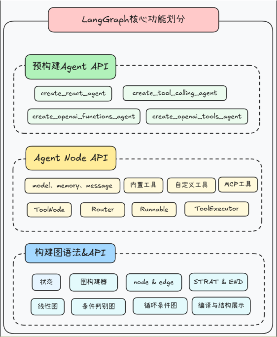
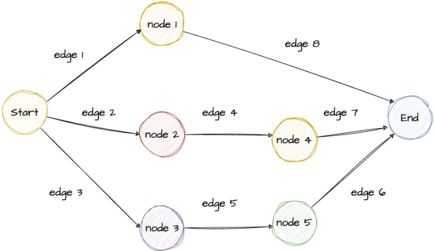
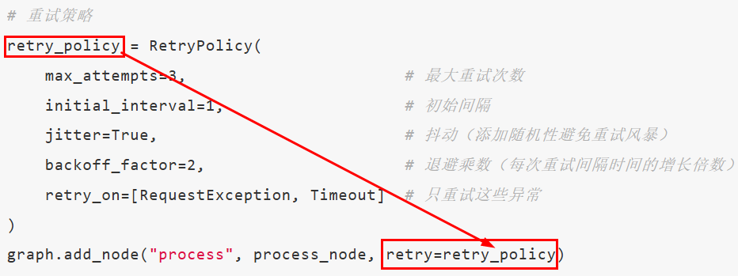
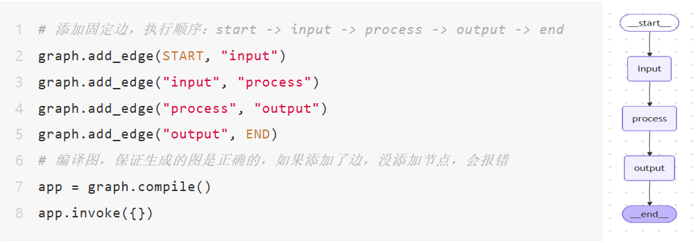

# 1.LangGraph概述

```python
1.LangGraph 是基于 LangChain 构建的、面向智能体多轮交互 / 状态持久化 / 分支并行执行的图结构工作流框架

2.LangGraph = LangChain + 图编排 + 状态机

3.官网：https://docs.langchain.org.cn/oss/python/langgraph/overview

4.LangGraph 基于 LangChain 构建，无论图结构多复杂，单独每个任务执行链路仍然是线性的；它是 LangChain 工作流的高级编排工具，其中“高级”之处就是能按照图结构来编排工作流（区别）
    
5.为什么需要 LangGraph
  原生线性 Chain 太死板，无法优雅地处理循环和条件分支，不适合复杂任务
  纯自由式裸 Agent 太自由，像个黑箱，难以控制、调试和保证稳定性

  LangGraph 就是用来同时解决两个痛点：
  用图结构弥补 Chain 的死板
  用固定节点 + 全局状态 + 路由约束，给 Agent 套上可控的流程枷锁

6.LangGraph 四大核心
  a.State 状态: 全局共享仓库，存所有上下文数据，全程不变、所有节点共用
  b.Node 节点: 具体干活的单元（LLM 推理、调用工具、业务处理）
  c.Edge 边: 控制流程怎么走：固定跳转 / 条件分支 / 循环回流
  d.Graph 图: 把 状态 + 节点 + 边 组装起来，变成可运行的完整工作流

7.使用 LangGraph 标准完整流程：
  a.定义状态类 State
  LangGraph 是状态机，必须先定义存储流转数据的状态（TypedDict /pydantic BaseModel）

  b.初始化 StateGraph 实例（传入状态类），构建状态图 --> StateGraph (State)
    
  c.添加图节点 add_node ()

  d.定义边
  普通直线边 add_edge ()
  条件分支边 add_conditional_edges () —— 复杂图必备
    
  e.指定入口节点 add_edge (START, "节点名") 或者 set_entry_point ()
  START 是图内置起始标记，add_edge (START, "节点名") 等价于 set_entry_point ("节点名")
  用 START/END 全局常量替代 set_entry_point

  f.指定出口节点 add_edge ("xxx 节点", END) 或者 set_finish_point ()
  流程走到末尾节点无下游边时，会自动终止，可选
  END 是图内置终止标记，节点指向 END 代表流程结束，不用额外配置出口

  g.编译图 compile ()

  h.传入初始状态，执行 / 调用工作流
  invoke () 方法只接收状态字典作为核心参数
    
8.LangGraph的技术架构如下： 
```



# 2.入门案例

## 2.1.基础版本

```python
# pip install grandalf

from typing import TypedDict
from langgraph.graph import StateGraph, START, END
import uuid


# 1．定义State对象
class HelloState(TypedDict):
    name: str
    greeting: str


# 2.定义节点Node(就是干活的函数)
def greet(helloState: HelloState) -> dict:
    name = helloState["name"]
    return {"greeting": f"你好,{name}"}
    # return helloState


def add_emoji(helloState: HelloState) -> dict:
    greeting = helloState["greeting"]
    return {"greeting": greeting + "  。。。😄"}


# 3.构建图graph
graph = StateGraph(HelloState)

graph.add_node("greeting", greet)
graph.add_node("add_emoji", add_emoji)

graph.add_edge(START, "greeting")
graph.add_edge("greeting", "add_emoji")
graph.add_edge("add_emoji", END)

# 4.编译图
app = graph.compile()

# 5.运行
# invoke()方法只接收状态字典作为核心参数
result = app.invoke({"name": "z3"})
print(result)
print()
print(result["greeting"])

# 6 打印图的边和节点信息
# 6.1 打印图的ascii可视化结构
print(app.get_graph().print_ascii())
print("=" * 50)

# 6.2 打印图的Mermaid代码可视化结构并通过https://www.processon.com/mermaid编辑器查看
print(app.get_graph().draw_mermaid())
print("=" * 50)

# 6.3 生成 PNG并写入文件 ，一般需要开启科学上网
png_bytes = app.get_graph().draw_mermaid_png(max_retries=2, retry_delay=2.0)
output_path = "langgraph" + str(uuid.uuid4())[:8] + ".png"
with open(output_path, "wb") as f:
    f.write(png_bytes)
print(f"图片已生成：{output_path}")
```

## 2.2.加一点业务

```python
from langgraph.constants import START, END
from langgraph.graph import StateGraph
 
    
def addition(state):
    print(f'加法节点收到的初始值:{state}')
    return {"x": state["x"] + 1}

def subtraction(state):
    print(f'减法节点收到的初始值:{state}')
    return {"x": state["x"] - 2}


graph = StateGraph(dict)
# 向图构建器中添加节点
# 添加加法运算节点和减法运算节点到构建器中
graph.add_node("addition", addition)
graph.add_node("subtraction", subtraction)

# 定义节点之间的执行顺序 edges
# 设置节点间的依赖关系，形成执行流程图
graph.add_edge(START, "addition")
graph.add_edge("addition", "subtraction")
graph.add_edge("subtraction", END)
# 打印图的边和节点信息
#print("打印图的边信息:\n",graph.edges)
print()
#print("打印图的节点信息:\n",graph.nodes)

# 编译图构建器生成计算图
app = graph.compile()
# invoke()方法只接收状态字典作为核心参数，定义一个初始状态字典，包含键值对"x": 5
initial_state={"x": 5}
# 调用graph对象的invoke方法，传入初始状态，执行图计算流程
result= app.invoke(initial_state)
print(f"最后的结果是:{result}")

# 打印图的可视化结构
print(app.get_graph().print_ascii())
print()
# 打印图的可视化结构，生成更加美观的Mermaid 代码，通过processon 编辑器查看
print(app.get_graph().draw_mermaid())
```

## 2.3.加上大模型调用

```python
import uuid
from typing import TypedDict, Annotated, List
from langgraph.graph import StateGraph, START, END
from langgraph.graph.message import add_messages
import os
from langchain.chat_models import init_chat_model
from langchain_core.messages import HumanMessage


# 定义状态（State） 存储对话消息
class AtguiguState(TypedDict):
    # messages 是一个消息列表，Annotated + add_messages 表示支持自动追加消息
    messages: Annotated[List, add_messages]  # string.append


# 定义大模型
llm = init_chat_model(
    model="qwen-plus",
    model_provider="openai",
    api_key=os.getenv("DASHSCOPE_API_KEY"),
    base_url="https://dashscope.aliyuncs.com/compatible-mode/v1"
)


# 定义节点函数，节点：调用大模型，并把回复加入到 state["messages"] 里
def model_node(state: AtguiguState):
    reply = llm.invoke(state["messages"])  # 输入历史消息，调用模型
    return {"messages": [reply]}  # 返回新消息，自动加到 state


# 构建图结构
graph = StateGraph(AtguiguState)  # 初始化图，指定 State 类型

graph.add_node("model", model_node)  # 添加一个节点，名字叫 "model"

graph.add_edge(START, "model")  # 从 START 到 "model"
graph.add_edge("model", END)  # 从 "model" 到 END

# 编译
app = graph.compile()

# 运行
# result = app.invoke({"messages": [HumanMessage(content="请用一句话解释什么是 LangGraph。")]})
result = app.invoke({"messages": "请用一句话解释什么是 LangGraph。"})
print(result)
# 打印模型的最后一条回复
print("模型回答：", result["messages"][-1].content)

print()
# 打印图的ascii可视化结构
print(app.get_graph().print_ascii())
print("=" * 50)

# 打印图的Mermaid代码可视化结构并通过https://www.processon.com/mermaid编辑器查看
print(app.get_graph().draw_mermaid())
print("="*50)

# 生成 PNG并写入文件
png_bytes = app.get_graph().draw_mermaid_png()
output_path = "langgraph" + str(uuid.uuid4())[:8] + ".png"
with open(output_path, "wb") as f:
 f.write(png_bytes)
print(f"图片已生成：{output_path}")
```

# 3.Graph图

## 3.1.基础理论

```python
1.图是一种由节点和边组成的用于描述节点之间关系的数据结构，分为无向图和有向图，有向图是带有方向的图

2.LangGraph 通过有向图定义 AI 工作流中的执行步骤和执行顺序，从而实现复杂、有状态、可循环的应用程序逻辑

3.使用 LangGraph 标准完整流程：
  a.定义状态类 State
  LangGraph 是状态机，必须先定义存储流转数据的状态（TypedDict /pydantic BaseModel）

  b.初始化 StateGraph 实例（传入状态类），构建状态图 --> StateGraph (State)
    
  c.添加图节点 add_node ()

  d.定义边
  普通直线边 add_edge ()
  条件分支边 add_conditional_edges () —— 复杂图必备
    
  e.指定入口节点 add_edge (START, "节点名") 或者 set_entry_point ()
  START 是图内置起始标记，add_edge (START, "节点名") 等价于 set_entry_point ("节点名")
  用 START/END 全局常量替代 set_entry_point

  f.指定出口节点 add_edge ("xxx 节点", END) 或者 set_finish_point ()
  流程走到末尾节点无下游边时，会自动终止，可选
  END 是图内置终止标记，节点指向 END 代表流程结束，不用额外配置出口

  g.编译图 compile ()

  h.传入初始状态，执行 / 调用工作流
  invoke () 方法只接收状态字典作为核心参数
```



## 3.2.代码案例

```python
from typing import TypedDict
from langgraph.constants import START, END
from langgraph.graph import StateGraph
 
class GraphStateObj(TypedDict):
    process_data: dict

# 统一使用 GraphStateObj类对象 做类型注解
def input_node(state: GraphStateObj) -> GraphStateObj:
    print(f"input_node节点执行:  {state.get('process_data')}")
    # 合并原有数据，而非直接覆盖
    new_data = state["process_data"].copy()
    #print(new_data.keys())
    new_data["k1"] = "input_value张三"
    # LangGraph 默认采用「字段级覆盖更新」，不是把整个状态字典替换，只修改你返回的字段，其余字段保留。
    return {"process_data": new_data}

def process_node(state: GraphStateObj) -> GraphStateObj:
    print(f"process_node节点执行:  {state.get('process_data')}")
    new_data = state["process_data"].copy()
    new_data["process"] = "process_value9527"
    return {"process_data": new_data}

def output_node(state: GraphStateObj) -> GraphStateObj:
    print(f"output_node节点执行:  {state.get('process_data')}")
    # 直接透传当前状态
    return state

# 初始化状态图
graph = StateGraph(GraphStateObj)

# 添加节点
graph.add_node("input", input_node)
graph.add_node("process", process_node)
graph.add_node("output", output_node)

# 定义边：执行顺序：START → input → process → output → END，线性执行。
graph.add_edge(START, "input")
graph.add_edge("input", "process")
graph.add_edge("process", "output")
graph.add_edge("output", END)

# 编译图
app = graph.compile()

# 执行工作流
init_data = {"process_data": {"name": "测试数据", "value": 111111}}
result = app.invoke(init_data)
print(f"\n最后的结果是:{result}")

# ASCII 可视化
print("\n===== 图结构 ASCII =====")
print(app.get_graph().print_ascii())

# Mermaid 源码
print("\n===== Mermaid 代码 =====")
print(app.get_graph().draw_mermaid())
```

# 4.State状态

## 4.1.基础理论

```python
1.LangGraph中，State是一个贯穿整个工作流执行过程中的共享数据的结构，代表当前快照，它存储了从工作流开始到结束的所有必要的信息（历史对话、检索到的文档、工具执行结果等），在各个节点中共享，且每个节点都可以修改

2.状态包含两部分：
  图的模式（schema）
  规约函数（reducer functions）,它指明如何把更新应用到状态上
```

## 4.2.Schema图模式

### 4.2.1.理论介绍

```python
1.Schema 图模式就是用来规范、约束 LangGraph 里State状态数据结构的模板 / 数据模式

2.由 state_schema、input_schema、output_schema 构成
  a.state_schema
  这是图的完整内部状态，包含了所有节点可能读写的字段，必须指定，不能为空

  特点：
  是图的 "全局状态空间"
  所有节点都可以访问和写入这个 schema 中的任何字段
    
  b.input_schema
  定义图接受什么输入，是 state_schema 的子集
    
  特点：
  可选参数，如果不指定，默认等于 state_schema
  限制图的输入接口，只能传入这些字段
  是 state_schema 的子集或相等
    
  c.output_schema
  定义图返回什么输出，是 state_schema 的子集
    
  特点：
  可选参数，如果不指定，默认等于 state_schema
  限制图的输出接口，只返回这些字段
  是 state_schema 的子集或相等

3.State 可以是 TypedDict 类型，也可以是 pydantic 中的 BaseModel 类型
```

| 对比项                | TypedDict                 | BaseModel (Pydantic)               |
| --------------------- | ------------------------- | ---------------------------------- |
| **来源**              | Python 标准库（`typing`） | Pydantic 库                        |
| **定位**              | 类型提示（轻量字典类型）  | 强类型数据模型（含验证逻辑）       |
| **运行时检查**        | ❌ 无运行时校验            | ✅ 自动校验字段类型、默认值等       |
| **继承自**            | `dict`                    | `BaseModel`                        |
| **性能**              | ✅ 快（仅静态类型提示）    | ⚠️ 稍慢（需要解析和验证）           |
| **序列化 / 反序列化** | ❌ 手动处理                | ✅ 自动 `.dict()`、`.json()`        |
| **用途场景**          | 简单数据结构定义          | 需要验证、解析、约束的模型         |
| **LangGraph 支持**    | ✅ 官方推荐（State 类型）  | ⚠️ 不推荐（除非你自己控制模型转换） |

### 4.2.2.代码案例

```python
from typing import TypedDict
from langgraph.constants import START, END
from langgraph.graph import StateGraph

# ====================== 1、定义三层状态结构 ======================
# 1. state_schema：整张图运行时完整全局状态，包含所有输入、中间、私有、输出字段
class MyStateFull(TypedDict):
    rag_result:str        # RAG知识库检索中间结果（内部中间值）
    web_search_result:str # 互联网搜索中间结果（内部中间值）
    final_answer:str      # 最终回答（对外输出字段）
    query:str             # 用户提问（唯一允许外部传入的参数）
    # a_new_key:str         # 节点内部生成的私有临时状态，外部不可控、默认不输出
    # phone:str


# 2. input_schema：约束外部调用时，仅能传入的参数集合
# 外部invoke只能传这里定义的key，多传的键会被LangGraph直接过滤扔掉
class InputSchema(TypedDict):
    query:str

# 3. output_schema：约束图执行结束后，对外返回的结果集合
# 内部一堆中间、私有字段都会被隐藏，只返回此处声明的key
class OutputSchema(TypedDict):
    final_answer:str

# ====================== 2、初始化状态图，绑定三层Schema ======================
# state_schema：内部完整容器；input_schema：入参白名单；output_schema：出参白名单
# 不写 input_schema 时：invoke 传什么键，就原样塞进全局 state；输入的校验、筛选规则会默认沿用 state_schema
# 写上 input_schema=InputSchema 后：LangGraph 内置逻辑开启入参筛选。
graph = StateGraph(
    state_schema=MyStateFull,
    input_schema=InputSchema, # 限定外部仅能传入query
    output_schema=OutputSchema
)

# ====================== 3、定义业务节点函数 ======================
# RAG检索节点：读取外部传入query，生成rag结果 + 写入私有状态a_new_key
def rag_search_node(state:MyStateFull):
    # state拿到的是完整MyStateFull全局状态字典
    print("=== rag_search_node 内部完整state ===")
    print(state)
    # 取出用户问题
    query = state["query"]
    # 模拟RAG检索结果
    rag_result = f"关于{query}的rag_result"
    # return字典会自动合并更新到全局state中
    # 同时更新中间结果rag_result 和 私有临时键a_new_key
    # state 里出现 a_new_key 是节点运行后才新增赋值，和 invoke 里写的 a_new_key: xxx 毫无关系。
    return {
        "rag_result": rag_result,
        "a_new_key": "a_new_key_value_66666"
    }

# 联网搜索节点：并行执行，只读取query，写入web检索中间结果
def web_search_node(state:MyStateFull):
    print("\n=== web_search_node 内部完整state ===")
    print(state)
    query = state["query"]
    web_search_result = f"关于{query}的web_search_result"
    # 仅更新自身业务中间值
    return {"web_search_result": web_search_result}

# 汇总回答节点：读取两个检索中间值，拼接生成最终对外答案
def final_answer_node(state:MyStateFull):
    print("\n=== final_answer_node 内部完整state ===")
    print(state)
    # 内部可以读取所有全局状态字段
    rag_result = state["rag_result"]
    web_search_result = state["web_search_result"]
    # 整合两份检索资料生成最终回复
    final_answer = f"LLM基于{rag_result}和{web_search_result}的最终回复"
    # 只更新对外输出字段final_answer
    return {"final_answer": final_answer}

# ====================== 4、挂载节点 & 搭建图执行拓扑 ======================
# 将三个业务函数注册为图中的节点
graph.add_node(rag_search_node)
graph.add_node(web_search_node)
graph.add_node(final_answer_node)

# 拓扑逻辑：
# START起点同时分发任务，并行启动rag和web两个检索节点
graph.add_edge(START, "rag_search_node")
graph.add_edge(START, "web_search_node")
# 两个并行节点全部执行完毕后，才能进入汇总节点
graph.add_edge("rag_search_node", "final_answer_node")
graph.add_edge("web_search_node", "final_answer_node")
# 汇总节点执行完成，流向END结束标识
graph.add_edge("final_answer_node", END)

# 编译图，生成可调用运行的实例
compiled_graph = graph.compile()

# ====================== 5、调用执行 & 验证Schema隔离效果 ======================
# 测试场景：外部故意多传input_schema未定义的a_new_key，验证会被过滤
# invoke() 传入的字典只会提取 InputSchema 中定义的键，其他多余键直接丢弃，不会合并写入全局 State。
#print("【调用invoke，外部额外传入a_new_key，该参数会被自动丢弃】")
res = compiled_graph.invoke({
    "query": "如何使用LangGraph,O(∩_∩)O",
    # "phone": "13811112222",# 所有节点打印 state，自始至终都找不到 phone 这个键，证明直接被 input_schema 过滤拦截。
    # "a_new_key": "a_new_key_value_xxx"  # input_schema无此字段，外部传入无效
})

# 打印最终返回结果：只会包含output_schema里的final_answer
print("\n【图最终对外返回结果（仅OutputSchema字段）】")
print('最终结果为', res)

# 打印ASCII字符流程图，直观查看并行结构
print("\n【图ASCII拓扑结构】")
print(compiled_graph.get_graph().print_ascii())
print()
```

## 4.3.Reducers 规约函数

### 4.3.1.理论介绍

```python
1.Reducer = 多节点同时修改同一个 State 字段时，规定数据该覆盖、追加、累加还是自定义合并的规则函数

2.规约函数作用
  决定节点输出的更新数据如何修改全局 State
  State 里每一个字段都可以单独配置专属规约函数，互不干扰
  字段不手动指定规约函数时，新数据直接覆盖原有旧值

3.Reducer 常用类型
  a.default（默认）
  直接用新值覆盖旧值，不做合并

  b.add_messages
  专门用于对话消息列表，自动追加消息

  c.operator.add
  追加合并，支持三类数据：
  列表：新增元素拼接
  字符串：文本拼接
  数字：数值累加
    
  d.operator.mul
  仅用于数字，新旧数值相乘保存结果
    
  e.自定义 Reducer
  自己编写逻辑，实现任意个性化合并规则

```

### 4.3.2.代码案例

#### 4.3.2.1.默认覆盖_default

```python
from typing import List
from typing_extensions import TypedDict
from langgraph.graph import StateGraph, START, END


# 默认Reducer（覆盖更新）
# 未指定合并策略，默认覆盖，上一个节点的返回是下一个节点的值
class DefaultReducerState(TypedDict):
    foo: int
    bar: List[str]


def node_default_1(state: DefaultReducerState) -> DefaultReducerState:
    print("state[foo] =", state["foo"])
    print("state[bar] =", state["bar"])
    # 为什么叫「默认覆盖型 Reducer」
    # LangGraph 默认采用「字段级覆盖更新」，不是把整个状态字典替换，只修改你返回的字段，其余字段保留。
    # 针对同一个字段：新值直接覆盖旧值，不做拼接或者追加。
    # 节点返回 {键: 新值}，LangGraph 会增量合并：
    # 只更新返回中存在的 key，同 key 直接用新值覆盖旧值，状态里未被返回的 key 保持原值

    # 写法1
    return {"foo": 22}

    # 写法2 返回完整状态字典对象
    # state["foo"] = 22
    # return state  # 返回完整字典


def node_default_2(state: DefaultReducerState) -> dict:
    print()
    print("39line,state[foo] =", state["foo"])
    print("state[bar] =", state["bar"])
    return {"bar": ["bye1", "bye2", "bye3"]}


def main():
    print("-------默认Reducer（覆盖更新）演示:\n")
    builder = StateGraph(DefaultReducerState)

    builder.add_node("node1", node_default_1)
    builder.add_node("node2", node_default_2)

    builder.add_edge(START, "node1")
    builder.add_edge("node1", "node2")
    builder.add_edge("node2", END)

    graph = builder.compile()

    result = graph.invoke(input={"foo": 1, "bar": ["hi"]})

    print(f"执行结果: {result}\n")


if __name__ == "__main__":
    main()

```

#### 4.3.2.2.消息追加_add_messages

```python
from typing import TypedDict, List, Annotated
from langgraph.graph import StateGraph, START, END, add_messages
from langchain_core.messages import HumanMessage, AIMessage


# add_messages Reducer（消息列表专用）
class AddMessagesState(TypedDict):
    """
    引入的 Annotated 类型，它允许给类型添加额外的元数据。
    messages: Annotated[List, add_messages]
    表示:
    - messages 我的状态里只有一个字段叫 messages，类型是是 List列表类型,
    - add_messages  这里的 add_messages 是一个函数，用于修改 messages 列表
                    每当节点返回对 messages 的“局部更新”时，
                    请用 add_messages 规约器把它合并到旧列表上（追加，而不是覆盖）
    总结：
    节点永远只 return 增量字典，不用手动把旧列表读出来再拼接。
    add_messages 在后台帮你完成“追加”动作；如果换成默认规则，旧消息会被整份替换掉
    """
    # 列表消息场景 → 必须 Annotated[List, add_messages] 安全追加
    messages: Annotated[List, add_messages]


def chat_node_1(state: AddMessagesState) -> dict:
    return {"messages": [AIMessage(content="Hello from node 1")]}


def chat_node_2(state: AddMessagesState) -> dict:
    return {"messages": [AIMessage(content="Hello from node 2")]}


def run_demo():
    print("2. add_messages Reducer（消息列表专用）演示:\n")
    # 类似java new一个StateGraph图对象
    builder = StateGraph(AddMessagesState)
    # add(node + edge)
    builder.add_node("chat1", chat_node_1)
    builder.add_node("chat2", chat_node_2)

    builder.add_edge(START, "chat1")
    builder.add_edge(START, "chat2")  # 并行执行
    builder.add_edge("chat1", END)
    builder.add_edge("chat2", END)
    # 编译compile
    graph = builder.compile()

    # 初始消息使用标准消息对象
    init_messages = [HumanMessage(content="Hi there!")]
    result = graph.invoke({"messages": init_messages})

    # 格式化输出，只展示核心内容，隐藏多余元数据
    # print("初始状态: {'messages': [('user', 'Hi there!')]}")
    print("执行结果:")
    for msg in result["messages"]:
        role = "user" if isinstance(msg, HumanMessage) else "assistant"
        print(f"('{role}', '{msg.content}')")
    print()

    print("*" * 60)

    # 打印图的ascii可视化结构
    print(graph.get_graph().print_ascii())


if __name__ == "__main__":
    run_demo()

```

#### 4.3.2.3.追加合并_operator.add

```python
import operator
from typing import Annotated, List
from typing_extensions import TypedDict
from langgraph.graph import StateGraph, START, END


# operator.add Reducer（追加合并,可以是列表、字符串、数字）
class ListAddState(TypedDict):
    # data: Annotated[List[int], None]  #默认覆盖
    data: Annotated[List[int], operator.add]  # （追加合并）


def producer_1(state: ListAddState) -> dict:
    print(f"初始---", state.get("data"))
    return {"data": [1, 2]}


def producer_2(state: ListAddState) -> dict:
    print(f"producer_1---", state.get("data"))
    return {"data": [3, 4]}


def run_demo():
    builder = StateGraph(ListAddState)
    # 注册节点
    builder.add_node("producer1", producer_1)
    builder.add_node("producer2", producer_2)
    # 顺序执行边
    builder.add_edge(START, "producer1")
    builder.add_edge("producer1", "producer2")
    builder.add_edge("producer2", END)

    graph = builder.compile()
    result = graph.invoke({"data": [0]})
    print(f"执行结果: {result}\n")


if __name__ == "__main__":
    run_demo()

```

#### 4.3.2.4.数值相乘_operator.mul

```python
import operator
from typing import Annotated
from typing_extensions import TypedDict
from langgraph.graph import StateGraph, START, END


# operator.mul Reducer（数值相乘）
class MultiplyState(TypedDict):
    factor: Annotated[float, operator.mul]

    # factor = 1.0

    # TypedDict 不支持字段默认值，它只是类型描述工具，不是普通类，不支持赋值默认值。
    # 写 =1.0 在这里无任何作用，LangGraph 完全忽略。LangGraph 对标量字段的内置初始占位值固定为该类型零元
    # factor: Annotated[float, operator.mul] = 1.0

    # factor:float = 1.0


def multiplier(state: MultiplyState) -> dict:
    return {"factor": 2.0}


def run_demo():
    """
这不是bug，是设计决策：LangGraph选择用类型默认值初始化状态字段
对于不同操作，需要不同处理：
加法：恒等元是0.0，所以operator.add可以直接用
乘法：恒等元是1.0，需要特殊处理初始的0.0
自定义reducer是标准做法：复杂的业务逻辑都应该使用自定义reducer

这是LangGraph使用中的一个常见陷阱！
建议在使用乘法、除法等非加法操作时，总是使用自定义reducer来处理初始值问题

    在执行初始阶段（我们定义的第一个node前），会默认调用一次reducer（后面自定义reducer案例中进行了打印验证），
    用默认值与invoke传递的值进行计算：
    此案例中，invoke中传递了一个默认值5.0，由于会默认调用一次reducer，
    执行的计算是： 0.0（float默认值） * 5.0(invoke传递的初始值) = 0.0
    导致后续乘法结果一直都是0

    初始默认值: factor = 0.0
    invoke传入: factor = 5.0
    reducer计算: 0.0 * 5.0 = 0.0
    然后才执行你的multiplier节点...
operator.mul作为 LangGraph 归约器的执行逻辑是：
最终值 = 初始值 * 增量值1 * 增量值2 * ...
归约器会迭代节点返回的增量值并依次相乘，若直接返回单个数值（非可迭代），
会被判定为「无增量」，最终按初始值 * 空处理，而乘法中「空累积」的默认结果是乘法单位元 0.0。

    解决方案： 使用自定义reducer
    """
    print("operator.mul Reducer（数值相乘）演示:")
    builder = StateGraph(MultiplyState)
    builder.add_node("multiplier", multiplier)
    builder.add_edge(START, "multiplier")
    builder.add_edge("multiplier", END)
    graph = builder.compile()

    result = graph.invoke({"factor": 5.0})
    print(f"初始状态: {{'factor': 5.0}}")
    print(f"执行结果: {result}\n")


if __name__ == "__main__":
    run_demo()
```

#### 4.3.2.5.自定义Reducer

```python
from typing import Annotated
from typing_extensions import TypedDict
from langgraph.graph import StateGraph, START, END


# 自定义乘法规约函数
def MyOperatorMul(current: float | None, update: float) -> float:
    """
    current：当前存量值（首次为 0）
    update：节点本次更新传入的值
    返回：新旧相乘结果
    """
    # 第一次更新，无历史值，直接使用update
    if current == 0:
        print(f"首次更新，无历史值，直接赋值：update={update}")
        return update
    # 已有历史值，执行乘法
    print(f"历史值current={current}，本次更新update={update}，相乘结果={current * update}")
    return current * update


class MultiplyState(TypedDict):
    factor: Annotated[float, MyOperatorMul]


# 节点：每次返回乘以2的增量更新
def multiplier(state: MultiplyState) -> dict:
    return {"factor": 2.0}


def run_demo():
    builder = StateGraph(MultiplyState)
    builder.add_node("multiplier", multiplier)
    builder.add_edge(START, "multiplier")
    builder.add_edge("multiplier", END)

    graph = builder.compile()

    # 初始传入5.0，节点会循环两次 *2
    result = graph.invoke({"factor": 5.0})
    print(f"\n初始输入: {{'factor': 5.0}}")
    print(f"最终结果: {result}")
    # 流程：5 → 5*2=10 输出 factor=10


if __name__ == "__main__":
    run_demo()
```

#### 4.3.2.6.多种策略并存

```python
from typing import Annotated, List
from typing_extensions import TypedDict
from langgraph.graph import StateGraph, START, END
from langgraph.graph.message import add_messages
import operator

class ChatState(TypedDict):
    messages: Annotated[list, add_messages]  # 消息历史
    tags: Annotated[List[str], operator.add]  # 标签列表
    score: Annotated[float, operator.add]     # 累计分数

def process_user_message(state: ChatState) -> dict:
    user_message = state["messages"][-1]  # 获取最新消息
    return {
        "messages": [("assistant", f"Echo: {user_message.content}")],
        "tags": ["processed"],
        "score": 1.0
    }

def add_sentiment_tag(state: ChatState) -> dict:
    return {
        "tags": ["positive"],
        "score": 0.5
    }

# 构建图
builder = StateGraph(ChatState)
builder.add_node("process", process_user_message)
builder.add_node("sentiment", add_sentiment_tag)

builder.add_edge(START, "process")
builder.add_edge(START, "sentiment")
builder.add_edge("process", END)
builder.add_edge("sentiment", END)

graph = builder.compile()

# 打印结果
result = graph.invoke({
    "messages": [{"role": "user", "content": "Hello, how are you?"}],
    "tags": ["greeting"],
    "score": 0.0
})
print(result)
```

# 5.Node节点

## 5.1.基础理论

```python
1.Node 是 LangGraph 中的一个基本处理单元，代表工作流中的一个操作步骤，可以是一个Agent、调用大模型、工具或一个函数（说白了就是绑定一个 python 函数，具体逻辑可以干任何事情）

2.Node的设计原则
  a.单一职责原则：每个节点应该只负责一项职责，避免功能过于复杂
  b.无状态设计：节点本身不应该保存状态，所有数据都通过输入状态传递
  c.幂等性：相同的输入应该产生相同的输出，确保可重试性
  d.可测试性：节点逻辑应该易于单元测试

3.特殊的节点
  a.__START__节点：开始节点，确定应该首先调用哪些节点
  也可以通过graph.set_entry_point("node_start") 函数设置起始节点
  等价于graph.add_edge(START, "node_start")
    
  b.__END__节点：终止节点，表示后续没有其他节点可以继续执行了
  也可以通过graph.set_finish_point("node_end") 函数设置结束节点
  等价于graph.add_edge("node_start"， END)
```

## 5.2.节点缓存

### 5.2.1.理论介绍

```python
1.LangGraph 支持基于节点输入缓存执行结果，重复相同输入时跳过节点计算，减少重复开销

2.启用缓存两步配置
  a.编译图 / 定义入口时，全局指定缓存存储
  # 全局开启内存缓存
  builder.compile(cache=InMemoryCache())
    
  b.给对应节点配置独立缓存策略 CachePolicy
  builder.add_node(
    node="expensive_node",
    action=expensive_node,
    # 自定义缓存有效期，key_func不填则使用默认哈希规则
    cache_policy=CachePolicy(ttl=8)
  )

3.缓存策略两个核心参数
  a.key_func
  根据节点输入生成唯一缓存键
  默认：用 pickle 序列化输入后做哈希
  可自定义，过滤无关字段、统一输入格式

  a.ttl（单位：秒）
  缓存存活有效期
  不设置则永久保存，需手动清理

4.缓存执行流程
  a.节点启动，通过 key_func 基于当前输入生成缓存 key
  b.缓存命中：直接读取历史结果，跳过节点执行
  c.缓存未命中：正常运行节点，结果绑定 key 存入缓存

5.TTL 使用场景区分
  实时动态数据（天气、实时行情）：短 TTL（如 60 秒），定时自动失效
  静态 / 极少变动数据（基础资料、固定知识库）：长 TTL 或不配置，永久缓存

```

### 5.2.2.代码案例

```python
import time
from typing_extensions import TypedDict
from langgraph.graph import StateGraph
from langgraph.cache.memory import InMemoryCache
from langgraph.types import CachePolicy


# 定义状态类，也就是你的业务实体entity
class State(TypedDict):
    x: int
    result: int

# 创建图
builder = StateGraph(State)

# 定义节点：模拟耗时计算（sleep3秒）
def expensive_node(state: State) -> dict[str, int]:
    time.sleep(3)
    return {"result": state["x"] * 2}

# 添加节点
builder.add_node(node="expensive_node",action=expensive_node,
    # 不用传key_fn，底层自动用默认逻辑
    cache_policy=CachePolicy(ttl=8)
)

# 设置入口和出口
builder.set_entry_point("expensive_node")
builder.set_finish_point("expensive_node")

# 编译图，指定内存缓存
app = builder.compile(cache=InMemoryCache())

# 第一次执行：耗时3秒（无缓存）
print("第一次执行（无缓存，耗时3秒）：")
print(app.invoke({"x": 5}))
# 第二次执行：瞬间返回（利用缓存，8秒内有效）
print("\n1111111111111111111111111111")
print("第二次运行利用缓存并快速返回：")
print(app.invoke({"x": 5}))

# 第三次执行：测试8秒后缓存过期（取消注释查看）
print("\n等待8秒，缓存过期...")
time.sleep(8)
print("8秒后第三次执行（重新计算，耗时3秒）：")
print(app.invoke({"x": 5}))
```

## 5.3.错误处理和重试机制

### 5.3.1.理论介绍

```python
LangGraph还提供了错误处理和重试机制来指定重试次数、重试间隔、重试异常等，用于保证系统的可靠性
 
为节点添加重试策略，需要在 add_node 中设置 retry_policy 参数
retry_policy 参数接受一个 RetryPolicy 命名元组对象
默认情况下，retry_on 参数使用 default_retry_on 函数，该函数会在遇到任何异常时重试
```



### 5.3.2.代码案例

```python
from typing import Dict, Any
from typing_extensions import TypedDict
from langgraph.graph import StateGraph, START, END
from langgraph.types import RetryPolicy


# 定义状态类型
class BizObjectState(TypedDict):
    result: str


# 全局计数器：记录API尝试次数
attempt_counter = 0


# 工具函数
def build_retry_graph(node_name: str, node_func, retry_policy: RetryPolicy):
    builder = StateGraph(BizObjectState)
    # 为节点添加重试策略，需要在add_node中设置retry_policy参数。
    # retry_policy参数接受一个RetryPolicy命名元组对象。
    # 默认情况下，retry_on参数使用default_retry_on函数，该函数会在遇到任何异常时重试
    builder.add_node(node_name, node_func, retry_policy=retry_policy)
    builder.add_edge(START, node_name)
    builder.add_edge(node_name, END)
    return builder.compile()


# 模拟不稳定的API调用，使用全局变量跟踪尝试次数
def unstable_api_call(state: BizObjectState) -> Dict[str, Any]:
    """模拟不稳定API：前2次失败，第3次成功（全局计数器记录尝试次数）"""
    global attempt_counter
    attempt_counter += 1
    # 纯文本打印尝试次数
    print(f"尝试调用API，这是第 {attempt_counter} 次尝试")

    # 模拟失败/成功逻辑：前2次抛异常，第3次返回结果
    if attempt_counter < 3:
        raise Exception(f"模拟API调用失败abcd (尝试 {attempt_counter})")
    return {"result": f"API调用成功，经过 {attempt_counter} 次尝试"}


# 自定义重试条件判断函数
def custom_retry_on(exception: Exception) -> bool:
    """自定义重试规则：只对包含「模拟API调用失败」的异常重试"""
    print("########################:  " + str(exception))
    err_msg = str(exception)
    if "模拟API调用失败" in err_msg:
        print(f"捕获到可重试异常: {err_msg}")
        return True
    print(f"捕获到不可重试异常: {err_msg}")
    return False


# 模拟抛出 ValueError 的节点
def value_error_call(state: BizObjectState) -> Dict[str, Any]:
    """模拟抛出ValueError：默认重试策略对这类异常不重试"""
    print("调用会抛出 ValueError 的节点")
    raise ValueError("模拟 ValueError 异常")  # throw new RunTimeException("模拟 ValueError 异常");


# 测试方法1：默认重试策略
def test_default_retry():
    global attempt_counter
    print("1. 使用默认重试策略:")
    print("   默认策略会对 除特定异常外的 所有异常进行重试")
    print("   不会重试的异常包括: ValueError, TypeError, ArithmeticError, ImportError,")
    print("                     LookupError, NameError, SyntaxError, RuntimeError,")
    print("                     ReferenceError, StopIteration, StopAsyncIteration, OSError\n")

    print("测试默认重试策略:")
    attempt_counter = 0  # 重置计数器
    default_graph = build_retry_graph(
        node_name="unstable_api",
        node_func=unstable_api_call,
        retry_policy=RetryPolicy(max_attempts=5)  # 最多5次尝试，足够重试成功
    )
    try:
        result = default_graph.invoke({"result": ""})
        print(f"最终结果: {result}\n")
    except Exception as e:
        print(f"最终失败: {type(e).__name__}: {e}\n")


# 测试方法2：自定义重试策略（输出完全匹配要求）
def test_custom_retry():
    global attempt_counter
    print("2. 使用自定义重试策略:")
    print("   自定义策略只对特定错误进行重试\n")
    print("测试自定义重试策略:")
    attempt_counter = 0  # 重置计数器
    custom_graph = build_retry_graph(
        node_name="custom_retry_api",
        node_func=unstable_api_call,
        retry_policy=RetryPolicy(max_attempts=5, retry_on=custom_retry_on)
    )
    try:
        result = custom_graph.invoke({"result": ""})
        print(f"最终结果: {result}\n")
    except Exception as e:
        print(f"最终失败: {type(e).__name__}: {e}\n")


# 测试方法3：不可重试异常演示,测试 ValueError（默认策略不会重试）
def test_no_retry_exception():
    print("3. 测试不会重试的异常类型:")
    print("测试 ValueError（默认策略不会重试）:")
    no_retry_graph = build_retry_graph(
        node_name="value_error_node",
        node_func=value_error_call,
        retry_policy=RetryPolicy(max_attempts=3)
    )
    try:
        result = no_retry_graph.invoke({"result": ""})
        print(f"最终结果: {result}\n")
    except Exception as e:
        print(f"最终失败: {type(e).__name__}: {e}\n")


# 主演示函数
def run_demo():
    print("=== LangGraph 节点重试策略完整演示===")
    print("-" * 80 + "\n")

    # test_default_retry()
    # test_custom_retry()
    test_no_retry_exception()

    print("-" * 80)
    print("=== 演示结束 ===")


# 程序入口
if __name__ == "__main__":
    run_demo()
```

## 5.4.流式传输Streaming

### 5.4.1.理论介绍

```python
1.LangGraph 里的 “流式传输” 功能，核心就是让 AI 应用（比如用大语言模型做的工具、对话机器人）能 “实时输出结果”，不用等整个流程跑完，体验更流畅

2.简单说，这功能就是让 LangGraph 做的 AI 应用 “更透明、更流畅”，用户能实时看到进度，开发者也方便调试，还能灵活适配各种需求

3.能实现啥效果
  a.实时看流程状态
    比如知道 AI 现在在处理哪个步骤、当前的结果是什么（比如 “正在细化主题”“已生成笑话初稿”）
  b.实时看子流程结果
    如果你的 AI 流程里嵌套了小流程（子图），也能同步看到子流程的进度
  c.实时看 LLM 输出的每一个字
    比如 AI 写笑话时，每个词、每句话实时蹦出来，不是最后一次性显示
  d.自定义实时消息
    比如让 AI 干活时，实时发 “进度 30%”“正在调用工具查数据” 这种自定义提示
  e.调试用
    能看到流程里的详细细节，方便找问题

4.通过 graph.stream 使用
  # 编译好图后，循环读取流式分片
  graph = builder.compile()

  # 选择对应模式，遍历实时输出片段
  for chunk in graph.stream(初始state, stream_mode="messages"):
    print(chunk)

5.stream_mode 可以指定 5 种流式输出模式
  a.values
    每步结束后，输出完整的当前状态（比如 “主题：冰淇淋和猫；笑话：xxx”）
  b.updates
    每步结束后，只输出变化的部分（比如只显示 “主题新增了‘和猫’”）
  c.messages
    专门实时输出 LLM 的每一个字 / 词，还带相关信息（比如是哪个步骤调用的 LLM）
  d.custom
    只输出你自定义的消息（比如进度提示）
  e.debug
    输出所有细节，方便调试
```

### 5.4.2.代码案例

#### 5.4.2.1.updates /values 

```python
from typing import TypedDict
from langgraph.graph import StateGraph, START, END


class AtguiguState(TypedDict):
    topic: str
    joke: str


def refine_topic(state: AtguiguState):
    return {"topic": state["topic"] + " and cats"}


def generate_joke(state: AtguiguState):
    return {"joke": f"This is a joke about {state['topic']}"}


def main():
    graph = (
        StateGraph(AtguiguState)
        .add_node(refine_topic)
        .add_node(generate_joke)

        .add_edge(START, "refine_topic")
        .add_edge("refine_topic", "generate_joke")
        .add_edge("generate_joke", END)

        .compile()
    )

    # updates在图的每一步后，将更新流向状态
    for chunk in graph.stream({"topic": "ice cream"}, stream_mode="updates"):
        print(chunk)

    print("*" * 40)

    # values在图的每一步后，流出状态的全部值
    for chunk in graph.stream({"topic": "ice cream"}, stream_mode="values"):
        print(chunk)


if __name__ == "__main__":
    main()
```

#### 5.4.2.2.自定义流式传输

```python
from typing import TypedDict
from langgraph.config import get_stream_writer
from langgraph.graph import StateGraph, START, END


# 定义图全局状态结构
class State(TypedDict):
    query: str  # 用户输入问题
    answer: str  # 模型回答结果


# 自定义业务节点
def node(state: State):
    # 获取流式写入器，用于推送自定义实时消息
    writer = get_stream_writer()
    # 推送一条自定义流式数据，只能被 stream_mode="custom" 捕获
    writer({"custom_key": "基泥苔煤，哦耶 O(∩_∩)O"})
    # 节点最终更新state里的answer字段
    return {"answer": "some data end"}


# 构建、编译流程图
graph = (
    StateGraph(State)
    .add_node("node", node)  # 注册自定义节点
    .add_edge(START, "node")  # 起始点指向业务节点
    .add_edge("node", END)  # 节点执行完直接结束
    .compile()
)

# 仅监听custom自定义流式消息
# 只会打印 writer 推送的自定义内容
for chunk in graph.stream({"query": "example"}, stream_mode=["custom"]):
    print(chunk)

print("*" * 40)

# 同时监听：state更新增量 + 自定义消息
# 输出两部分：字段变更内容、自定义推送文本
for chunk in graph.stream({"query": "example"}, stream_mode=["updates", "custom"]):
    print(chunk)

print("*" * 40)

# 同时监听：完整全局state + 自定义消息
# 输出两部分：每一步完整全部状态、自定义推送文本
for chunk in graph.stream({"query": "example"}, stream_mode=["values", "custom"]):
    print(chunk)
```

#### 5.4.3.3.多模式流式传输

```python
from typing import TypedDict
from langgraph.graph import StateGraph, START, END


# 定义状态类型
class AtguiguState(TypedDict):
    question: str
    answer: str
    confidence: float  # 置信度分数
    steps: list


def think(state: AtguiguState) -> AtguiguState:
    """思考节点"""
    question = state["question"]
    # 模拟思考过程
    steps = [f"分析问题: {question}", "检索相关知识", "形成初步答案"]
    return {"steps": steps}


def respond(state: AtguiguState) -> AtguiguState:
    """回应节点"""
    question = state["question"]
    # 根据问题生成答案
    if "天气" in question:
        answer = "今天天气晴朗"
        confidence = 0.9
    elif "时间" in question:
        answer = "现在是上午10点"
        confidence = 0.8
    else:
        answer = "这是一个很好的问题"
        confidence = 0.7

    return {
        "answer": answer,
        "confidence": confidence
    }


def reflect(state: AtguiguState) -> AtguiguState:
    """反思节点"""
    answer = state["answer"]
    confidence = state["confidence"]
    steps = state.get("steps", [])

    steps.append(f"验证答案: {answer}")
    steps.append(f"置信度评估: {confidence}")

    if confidence > 0.8:
        conclusion = "高置信度答案"
    elif confidence > 0.5:
        conclusion = "中等置信度答案"
    else:
        conclusion = "低置信度答案"

    steps.append(f"结论: {conclusion}")

    return {"steps": steps}


def main():
    # 构建图
    builder = StateGraph(AtguiguState)
    builder.add_node("think", think)
    builder.add_node("respond", respond)
    builder.add_node("reflect", reflect)

    builder.add_edge(START, "think")
    builder.add_edge("think", "respond")
    builder.add_edge("respond", "reflect")
    builder.add_edge("reflect", END)

    graph = builder.compile()

    # 准备输入
    input_state = {
        "question": "今天天气怎么样?",
        "answer": "",
        "confidence": 0.0,
        "steps": []
    }

    print("--- 1. 使用 stream_mode='values' 模式 ---")
    print("显示每一步执行后的完整状态:")
    for chunk in graph.stream(input_state, stream_mode="values"):
        print(f"  {chunk}")

    print("--- 2. 使用 stream_mode='updates' 模式 ---")
    print("只显示每一步的状态更新:")
    for chunk in graph.stream(input_state, stream_mode="updates"):
        print(f"  {chunk}")

    print("--- 3. 同时使用stream_mode=[values,updates]多种流模式 ---")
    print("同时显示完整状态和状态更新:")
    for mode, chunk in graph.stream(input_state, stream_mode=["values", "updates"]):
        print(f"  [{mode}]: {chunk}")

    #
    print("--- 4. 使用 debug 模式 ---")
    print("显示详细的调试信息:")
    try:
        for chunk in graph.stream(input_state, stream_mode="debug"):
            print(f"  {chunk}")
    except Exception as e:
        print(f"  Debug模式可能需要特殊配置: {e}")


if __name__ == "__main__":
    main()
```

# 6.Edge边

## 6.1.基础理论

```python
1.Edge 定义了节点之间的连接和执行顺序，以及不同节点之间是如何通讯的，一个节点可以有多个出边（指向多个节点），多个节点也可以指向同一个节点（Map-Reduce）

2.四种核心边类型
  a.普通边 Normal Edges
    固定单向跳转，A 节点执行完直接走到指定下一个节点
  b.条件边 Conditional Edges
    执行判断函数，根据状态动态选择下一个目标节点，实现分支 / 循环
  c.固定入口点 Entry Point
    用户输入进来后，固定最先执行的节点
  d.条件入口点 Conditional Entry Point
    输入到达时先执行判断函数，动态决定第一个运行的节点
    
```



## 6.2.代码案例

### 6.2.1.普通边

```python

```

