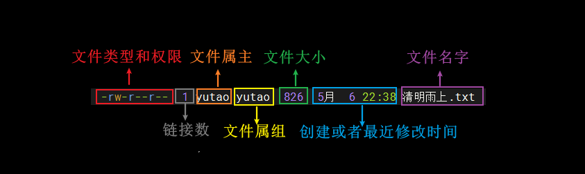
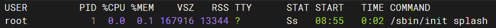
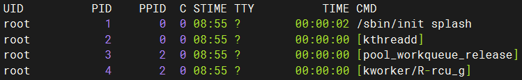

# 一、Linux目录结构

```
1.输入: cd /   ->    进入到最顶级根目录
2.输入: cd  -> 进入家目录(/home/用户名/)    
2.输入: pwd    ->    查看当前目录
3.输入: ll     ->    查看当前都有什么目录
```

| /           | 最顶级根目录                                                 |
| ----------- | ------------------------------------------------------------ |
| /etc(重要)  | 最重要:所有系统,软件配置文件                                 |
| /home(重要) | 普通用户的目录(每个用户都有一个自己的目录，一般该目录名是以用户的账号命名的) cd home进入home目录 ll命令查看,有一个自己的账号名,存放当前用户在操作的时候产生的数据 |
| /root       | 超级管理员目录                                               |
| /bin        | 普通用户常用命令(ls,cd,cp,mv等)                              |
| /usr(重要)  | 安装软件,程序,工具(用户的很多应用程序和文件都放在这个目录下) |
| /var        | 日志,缓存,动态数据                                           |
| /tmp        | 临时文件,自动清理                                            |
| /mnt        | 手动挂载U盘,硬盘,共享文件                                    |

# 二、APT软件包管理器

```
1.概述:APT 是 Debian / Ubuntu 系列 Linux 的 软件包管理器
2.简单讲:window安装软件直接可以双击,但是在linux操作系统中安装软件就需要用APT软件包管理器
```

**apt常用命令**

| 命令                       | 说明                      |
| -------------------------- | ------------------------- |
| sudo apt list 软件包名     | 根据名称列出APT管理的软件 |
| sudo apt update            | 更新可用软件包列表        |
| sudo apt install net-tools | 使用APT安装软件           |
| sudo apt remove net-tools  | 使用APT卸载软件           |
| sudo apt search net-tools  | 使用APT搜索软件           |

> 注意:
>
> 1.net-tools是网络工具
>
> 2.net-tools安装后的作用:使用我们常用的关于网络的命令
>
>  a.ifconfig:查看IP地址
>
>  b.netstat:查看软件占用的端口

# 三、常用命令

## 1.帮助命令

| 命令                     | 说明                       |
| ------------------------ | -------------------------- |
| help                     | 查看所有的命令             |
| help 具体命令 -> help cd | 查看指定命令的说明以及使用 |

## 2.linux常用快捷键

| 常用快捷键        | 功能                                                         |
| ----------------- | ------------------------------------------------------------ |
| Ctrl + L          | 清屏；彻底清屏是：**clear**                                  |
| Ctrl + C 或 Q     | 停止进程 / 退出 ->比如安装某个软件到一半,不想安了,直接按ctrl+c |
| TAB键(一次或二次) | 1.补全文件或者文件夹名字 2.提示(更重要的是可以防止敲错)      |
| 上下键            | 查找执行过的命令                                             |
| Ctrl + U          | 清除当前敲的命令                                             |

## 3.文件目录类命令

### 3.1. pwd 查看当前工作的目录

| 命令 | 说明               |
| ---- | ------------------ |
| pwd  | 查看当前所在的目录 |

```sh
lining@lining:~$ pwd
/home/lining
```

### 3.2. ls 查看当前目录下的文件夹和文件

| 命令           | 说明                                                         |
| -------------- | ------------------------------------------------------------ |
| ls             | 查看当前目录下的文件夹和文件                                 |
| ls -a          | 查看当前目录下的文件夹和文件包括隐藏项(横着展示)             |
| ls -l          | 查看当前目录下的文件夹以及文件的详细信息(包括权限,文件的属性等) |
| ls -al或者ll   | 查看当前目录下的文件夹和文件包括隐藏项(竖着展示)             |
| ls -R 文件夹名 | 递归的方式查看指定文件夹以及子文件夹下的内容                 |

```sh
lining@lining:~$ ls -al
lining@lining:~$ ll
```

> ll是ls -al的缩写,所以以后用ll命令即可

### 3.3. cd 切换目录

| 命令                 | 说明                         |
| -------------------- | ---------------------------- |
| cd 文件夹名          | 进入到指定文件夹             |
| cd 文件夹名/文件夹名 | 进入到多级文件夹             |
| cd /文件夹名         | 进入到根目录下的指定文件夹下 |
| cd …                 | 退到上一级目录               |
| cd /                 | 进入到根目录                 |
| cd ~ 或者 cd         | 回到家目录                   |

```sh
lining@lining:~$ cd aa
lining@lining:~/aa$ cd ..
lining@lining:~$ cd aa/bb
lining@lining:~/aa/bb$ cd /
lining@lining:/$ cd ~
lining@lining:~$ pwd
/home/lining
lining@lining:~$ cd /
lining@lining:/$ pwd
/
lining@lining:/$ cd
lining@lining:~$ cd /etc
lining@lining:/etc$ 
```

### 3.4. mkdir 创建文件夹

| 命令                       | 说明           |
| -------------------------- | -------------- |
| mkdir 文件夹名             | 创建单级文件夹 |
| mkdir -p 文件夹名/文件夹名 | 创建多级文件夹 |

```sh
lining@lining:~$ mkdir aa
lining@lining:~$ mkdir -p aa/bb/cc
```

### 3.5. touch 创建文件

| 命令                           | 说明                     |
| ------------------------------ | ------------------------ |
| touch 文件名                   | 创建文件                 |
| touch 文件夹名/文件夹名/文件名 | 在指定的文件夹中创建文件 |

```sh
lining@lining:~$ touch 1.txt
lining@lining:~$ touch aa/bb/cc/2.txt
```

### 3.6. cp 复制文件或文件夹

| 命令                               | 说明                                                         |
| ---------------------------------- | ------------------------------------------------------------ |
| cp 源文件夹名/文件名 目标文件夹名/ | 将指定源文件夹下的文件复制到指定目标文件夹下                 |
| cp -r 源文件夹 目标文件夹          | 使用递归的方式将指定的文件夹复制到指定目标文件夹里面 -r:代表递归方式复制 |

```sh
lining@lining:~$ cp aa/bb/cc/2.txt haha
lining@lining:~$ cp -r aa haha
```

### 3.7. rm 删除文件或文件夹

| 命令                      | 说明               |
| ------------------------- | ------------------ |
| rm -rf 文件夹名或者文件名 | 删除文件夹或者文件 |

```sh
lining@lining:~$ rm -rf aa
```

### 3.8. mv 移动文件或文件夹

| 命令                     | 说明                                                         |
| ------------------------ | ------------------------------------------------------------ |
| mv 文件名1 文件名2       | 将文件名1重命名为文件名2(两个文件必须在同一个目录中才是重命名) |
| mv 文件夹名1 文件夹名2   | 将文件夹名1重命名为文件夹名2(两个文件夹必须在同一个目录中,而且前提只有文件夹名1,文件夹名2不是提前有的,而是我们自己另外取的名字) |
| mv 原目录/资源 目标目录/ | 将指定原目录的资源移动到目标目录下                           |

```sh
lining@lining:~$ mv aa bb
lining@lining:~$ mv 1.txt haha.txt
lining@lining:~$ mv haha.txt haha/
```

### 3.9. cat 查看文件内容

| 命令          | 说明                                |
| ------------- | ----------------------------------- |
| cat 文件名    | 查看文件中的内容                    |
| cat -n 文件名 | 查看文件中的内容,并显示行号以及空行 |

```sh
lining@lining:~$ cat 清明雨上.txt 
lining@lining:~$ cat -n 清明雨上.txt 
```

### 3.10. echo 控制台输出

| 命令               | 说明                                                         |
| ------------------ | ------------------------------------------------------------ |
| echo “输出内容”    | 在控制台上输出指定的内容 注意:如果"“中有转义字符,默认转义字符不会生效 -> 比如"hello \n world” |
| echo -e “输出内容” | 如果""中有转义字符,转义字符会生效                            |

```sh
lining@lining:~$ echo "helloworld"
helloworld
lining@lining:~$ echo "hello \n world"
hello \n world
lining@lining:~$ echo -e "hello \n world"
hello 
 world
```

### 3.11. > 和 >> 重定向文件或者文件夹

```
1.  >  重定向到指定文件中(会覆盖)
2.  >> 重定向到指定文件中(不会覆盖,会追加)    
```

| 命令                      | 说明                                |
| ------------------------- | ----------------------------------- |
| echo “输出内容”>指定文件  | 重定向到指定文件中(会覆盖)          |
| echo “输出内容”>>指定文件 | 重定向到执行文件中(不会覆盖,会追加) |

```sh
lining@lining:~$ echo "helloword"> haha/2.txt

lining@lining:~$ cat haha/2.txt
helloword

lining@lining:~$ echo "helloword1"> haha/2.txt
lining@lining:~$ cat haha/2.txt
helloword1

lining@lining:~$ echo "helloword3">> haha/2.txt
lining@lining:~$ cat haha/2.txt
helloword1
helloword3
```

### 3.12. tail 输出文件尾部内容

| 命令           | 说明                                       |
| -------------- | ------------------------------------------ |
| tail 文件名    | 查看文件的后10行内容                       |
| tail -n 文件名 | 查看文件的后n行内容                        |
| tail -F 文件名 | 显示文件中最新追加的内容(可以监视文件变化) |

```sh
lining@lining:~/haha$ cd
lining@lining:~$ tail 清明雨上.txt 
远方有琴 愀然空灵 声声催天雨
涓涓心事说给自己听
月影憧憧 烟火几重 烛花红
红尘旧梦 梦断都成空
雨打湿了眼眶 年年倚井盼归堂
最怕不觉泪已拆两行
我在人间彷徨 寻不到你的天堂
东瓶西镜放 恨不能遗忘
又是清明雨上 折菊寄到你身旁
把你最爱的歌来轻轻唱
lining@lining:~$ tail -4 清明雨上.txt 
我在人间彷徨 寻不到你的天堂
东瓶西镜放 恨不能遗忘
又是清明雨上 折菊寄到你身旁
把你最爱的歌来轻轻唱
lining@lining:~$ echo "helloworld"> haha/2.txt
lining@lining:~$ tail -F haha/2.txt
helloworld

lining@lining:~$ echo "helloworld111">> haha/2.txt
lining@lining:~$ tail -F haha/2.txt
helloworld
helloworld111
```

### 3.13. ln 软连接

```
1.概述:说白了就是创建快捷方式->作用跟windows中的快捷方式一样
2.作用:在指定位置创建一个快捷方式,这样想看一个文件夹中的内容,就不用先找到这个文件夹进入查看了,直接操作快捷方式就行了    
```

| 命令                                  | 说明                                   |
| ------------------------------------- | -------------------------------------- |
| ln -s 文件名或者文件夹名 快捷方式名字 | 给指定的文件或者文件夹创建一个快捷方式 |
| rm 软连接名                           | 删除软连接 -> 和下面的unlink作用一样   |
| unlink 软连接名                       | 删除软连接                             |

```sh
lining@lining:~$ ln -s haha haha2
lining@lining:~$ rm haha2

lining@lining:~$ ln -s haha haha2
lining@lining:~$ unlink haha2
```

> 注意：千万不要用rm -rf 软连接名/ ->尤其不要加/ -> 加/会冲进原目录中直接将里面的东西删除

### 3.14. history 查看已经执行过历史命令

| 命令    | 说明                   |
| ------- | ---------------------- |
| history | 查看已经执行过历史命令 |

```
lining@lining:~$ history
```

## 4.vi和vim编辑器

```
windows中有记事本打开文本文档,然后编辑
linux中vi和vim就相当于记事本的作用了,可以打开文本文档,进行编辑
1.vi概述:是Linux中最通用的文本编辑器
2.vim概述:是vi发展出来的更加强大的文本编辑器
```

> 两个的区别可以向模型提问

### 4.1.安装vim编辑器

```
sudo apt install vim
lining@lining:~$ sudo apt install vim
```

### 4.2.使用vim_一般模式操作

| 命令       | 说明                  |
| ---------- | --------------------- |
| vim 文件名 | 打开文件,进入一般模式 |

```
1.注意:我们直接用vim打开一个文件,默认会进入到一般模式,在这个模式中是不能做任何编辑操作的,只能通过一些命令移动光标,删除字符,复制等操作,但是想插入操作是不行的
```

| 命令   | 说明                                                         |
| ------ | ------------------------------------------------------------ |
| yy     | 复制光标所在行,不过记住按完yy,需要按p才能完成复制粘贴        |
| y数字y | 复制一段(从光标所在行到后面的指定n行),需要按p才能完成复制粘贴 |
| p      | 箭头移动到目的行粘贴                                         |
| u      | 撤销上一步                                                   |
| dd     | 删除光标所在行                                               |
| d数字d | 删除光标所在行到后面的指定n行                                |

### 4.3.使用vim_编辑(插入)模式操作

```
1.先使用vim进入到要操作的文件中
2.使用命令来进入编辑(插入)模式进行操作    
```

| 命令 | 说明                                    |
| ---- | --------------------------------------- |
| i    | 进入到插入模式,在光标前插入             |
| a    | 进入到插入模式,在光标后插入             |
| o    | 进入到插入模式,在光标所在行的下一行插入 |
| I    | 进入到插入模式,在光标所在行最前面插入   |
| A    | 进入到插入模式,在光标所在行最后面插入   |
| O    | 进入到插入模式,在光标所在行的上一行插入 |

> 注意:以上操作,只需要记住i即可

### 4.4.使用vim_退出编辑模式

```
按ESC键
```

### 4.5.使用vim_保存并退出

```
1.作用:在我们编辑完之后,我们需要保存并退出vim编辑器模式
```

| 命令 | 说明                                             |
| ---- | ------------------------------------------------ |
| :wq  | 对于有写的权限的文件,编辑后,保存并退出           |
| :wq! | 对于没有写的权限的文件,编辑后,进行强制保存并退出 |

## 5.用户管理命令

### 5.1.root用户介绍

```
1.概述:root用户是超级管理员,拥有最高权限
2.特点:root 用户拥有系统的所有权限，可以对系统进行任何操作,但是由于权限太大,如果做了不当操作,会导致系统出现问题
3.注意:Ubuntu默认情况下,root用户是被锁定的,所以在安装Ubuntu系统的时候没有给root用户设置默认密码
      为了提高系统的安全性,鼓励用普通用户登录,并通过使用sudo命令来临时使用root权限
```

### 5.2.设置root密码&切换用户

| 命令             | 说明                                                     |
| ---------------- | -------------------------------------------------------- |
| sudo passwd root | 为root用户设置密码 ->这里设置成lining123                 |
| su 用户名称      | 切换用户,这个命令只能获取用户的执行权限,不能获取环境变量 |
| su - 用户名称    | 切换用户,这个命令能获取用户的执行权限和环境变量          |
| exit             | 退出root用户                                             |

```sh
lining@lining:~$ sudo passwd root
[sudo] lining 的密码：自己账户用的密码 
新的密码： lining123
重新输入新的密码：lining123
passwd：已成功更新密码
lining@lining:~$ su root
密码：lining123 
root@lining:/home/lining# exit
exit
lining@lining:~$ su - root
密码： 
root@lining:~# exit
注销
```

> 注意:虽然可以用命令直接操作root用户,但是还是推荐用sudo命令来暂时获取root用户权限
>
>  在命令前面加上sudo,比如安装软件
>
> ```
> sudo apt install 软件名称
> ```

### 5.2.锁定和解锁root用户

| 命令                | 说明                                                         |
| ------------------- | ------------------------------------------------------------ |
| sudo passwd -l root | 锁定 root 用户：如果你想再次锁定 root 用户，使其无法登录，可以使用这个命令 |
| sudo passwd -u root | 解锁 root 用户：若要解锁 root 用户，可以使用这个命令         |

```sh
lining@lining:~$ sudo passwd -l root
passwd：密码过期信息已更改。
lining@lining:~$ su
密码：lining123 
su: 认证失败
```

### 5.3.添加&删除&修改用户命令

| 命令                                      | 说明                                     |
| ----------------------------------------- | ---------------------------------------- |
| useradd -m 用户名                         | 创建新用户,并且创建一个新用户的目录      |
| id 用户名                                 | 查看用户是否存在                         |
| passwd 用户名                             | 给用户设置密码                           |
| userdel -r 用户名                         | 删除指定用户,并将用户的目录都删除        |
| usermod -l 新用户名 老用户名              | 修改用户名(但是home下的用户目录不会改变) |
| usermod -d /home/新用户目录名 -m 新用户名 | 修改home下的用户目录名                   |

```sh
lining@lining:~$ sudo useradd -m lining1
==========================================================
lining@lining:~$ ll /home/
总计 16
drwxr-xr-x  4 root     root     4096  5月  7 20:48 ./
drwxr-xr-x 20 root     root     4096  4月 27 08:05 ../
drwxr-x---  2 lining1 lining1 4096  5月  7 20:48 lining1/
drwxr-x--- 15 lining    lining    4096  5月  6 22:38 lining/
==========================================================
lining@lining:~$ id lining1
uid=1001(lining1) gid=1001(lining1) 组=1001(lining1)
==========================================================
lining@lining:~$ sudo userdel -r lining1
userdel：lining1 信件池 (/var/mail/lining1) 未找到
lining@lining:~$ id lining1
id: "lining1": 无此用户
lining@lining:~$ ll /home/
总计 12
drwxr-xr-x  3 root  root  4096  5月  7 20:49 ./
drwxr-xr-x 20 root  root  4096  4月 27 08:05 ../
drwxr-x--- 15 lining lining 4096  5月  6 22:38 lining/
==========================================================
lining@lining:~$ sudo useradd -m lining1
lining@lining:~$ id lining1
uid=1001(lining1) gid=1001(lining1) 组=1001(lining1)
lining@lining:~$ ll /home/
总计 16
drwxr-xr-x  4 root     root     4096  5月  7 20:58 ./
drwxr-xr-x 20 root     root     4096  4月 27 08:05 ../
drwxr-x---  2 lining1 lining1 4096  5月  7 20:58 lining1/
drwxr-x--- 15 lining    lining    4096  5月  6 22:38 lining/
==========================================================
lining@lining:~$ sudo usermod -l lining2 lining1
lining@lining:~$ id lining1
id: "lining1": 无此用户
lining@lining:~$ id lining2
uid=1001(lining2) gid=1001(lining1) 组=1001(lining1)
lining@lining:~$ ll /home/
总计 16
drwxr-xr-x  4 root     root     4096  5月  7 20:58 ./
drwxr-xr-x 20 root     root     4096  4月 27 08:05 ../
drwxr-x---  2 lining2 lining1 4096  5月  7 20:58 lining1/
drwxr-x--- 15 lining    lining    4096  5月  6 22:38 lining/
==========================================================
lining@lining:~$ sudo usermod -d /home/lining2 -m lining2
lining@lining:~$ ll /home/
总计 16
drwxr-xr-x  4 root     root     4096  5月  7 21:00 ./
drwxr-xr-x 20 root     root     4096  4月 27 08:05 ../
drwxr-x---  2 lining2 lining1 4096  5月  7 20:58 lining2/
drwxr-x--- 15 lining    lining    4096  5月  6 22:38 lining/
```

> 附:sudo设置普通用户具有root权限 -> 了解,不演示
>
> **1）******添加testu用户，并对其设置密码。\****
>
> root@ubuntu-1:~#useradd testu
>
> root@ubuntu-1:~#passwd testu
>
> **2）******修改配置文件\****
>
> lining@ubuntu-1:~$vi /etc/sudoers
>
> 修改 /etc/sudoers 文件，在root下面添加一行，如下所示：
>
> \## Allow root to run any commands anywhere
>
> root ALL=(ALL) ALL
>
> testu ALL=(ALL) ALL
>
> 或者配置成采用sudo命令时，不需要输入密码
>
> \## Allow root to run any commands anywhere
>
> root ALL=(ALL) ALL
>
> testu ALL=(ALL) NOPASSWD:ALL
>
> 修改完毕，通过:wq!退出编辑，然后可以用testu帐号登录，用命令 sudo ，即可获得root权限进行操作。不需要多次输入密码。

### 5.4.用户组管理命令

```
1.问题说明:如果一次性创建了多个用户,并需要为多个用户都分配权限,一个一个分配就太麻烦了
2.解决问题:所以我们可以将这些用户放到一个组中,然后针对这个组分配权限  
3.注意:linux系统中在创建用户的时候就已经自动创建好组了,组名和用户名一致    
```

| 命令                      | 说明                           |
| ------------------------- | ------------------------------ |
| groupadd 组名             | 新增组                         |
| groupmod -n 新组名 老组名 | 修改组                         |
| groupdel 组名             | 删除组                         |
| useradd -g 组名 用户名    | 创建新用户并将其添加到指定组中 |
| usermod -g 组名 用户名    | 修改用户组                     |
| cat /etc/group            | 查看创建了哪些组               |

```sh
lining@lining:~$ sudo groupadd qujing
lining@lining:~$ cat /etc/group
lining1:x:1001:
qujing:x:1002:

======================================================
lining@lining:~$ sudo groupmod -n xitianqujing qujing
lining@lining:~$ cat /etc/group
lining1:x:1001:
xitianqujing:x:1002:

======================================================
lining@lining:~$ sudo groupdel xitianqujing
lining@lining:~$ cat /etc/group
lining1:x:1001:

======================================================
lining@lining:~$ sudo groupadd qujing
lining@lining:~$ sudo useradd -g qujing sunwukong
lining@lining:~$ id sunwukong
uid=1002(sunwukong) gid=1002(qujing) 组=1002(qujing)

======================================================


lining@lining:~$ sudo groupadd qujing
[sudo] lining 的密码： 
lining@lining:~$ sudo useradd -m sunwukong
lining@lining:~$ id sunwukong
uid=1001(sunwukong) gid=1003(sunwukong) 组=1003(sunwukong)

lining@lining:~$ sudo usermod -g qujing sunwukong
lining@lining:~$ id sunwukong
uid=1001(sunwukong) gid=1002(qujing) 组=1002(qujing)

======================================================
lining@lining:~$ sudo groupdel qujing
groupdel：不能移除用户“sunwukong”的主组
lining@lining:~$ sudo userdel -r sunwukong
userdel：组“sunwukong”没有移除，因为它不是用户 sunwukong 的主组
userdel：sunwukong 信件池 (/var/mail/sunwukong) 未找到
lining@lining:~$ sudo groupdel qujing
lining@lining:~$ cat /etc/group
lining1:x:1001:
sunwukong:x:1003:     -> 将sunwukong用户删除之后,etc/group中还有刚开始创建sunwukong用户时默认创建的sunwukong组
lining@lining:~$ sudo groupdel sunwukong               -> 将刚开始创建sunwukong用户时自动创建的sunwukong组删除
lining@lining:~$ cat /etc/group
lining1:x:1001:
```

## 6.文件权限类命令

### 6.1.文件属性

```
1.概述:所谓的文件属性就是指文件类型以及操作权限的详情
2.划分:从左到右用10个字符表示
  a.第一个字符:表示文件类型
  b.后九个字符:表示操作权限
```


```
1.[0]表示类型:在linux中第一个字符代表这个文件是目录,还是文件,还是链接等
  - :代表文件
  d :代表目录,文件夹 
  l :代表链接文档
      
2.[1-3]位:代表该文件的所有者(该文件的创建者)拥有的文件权限
   
3.[4-6]位:代表所有者的同组用户对该文件的权限
      
4.[7-9]位:代表其他用户有用该文件的权限
```

### 6.2.rwx ->对于文件和目录的含义

```sh
1.rwx针对于文件:
  a.[r]代表可读:可以读取,查看文件
  b.[w]代表可写入:可以修改
  c.[x]代表可执行:可以被系统作为程序或者脚本执行

2.rwx针对于目录:
  a.[r]代表可读:可以读取,可以使用ls等查看命令查看目录下的内容
  b.[w]代表可写:可以修改,比如目录内创建,删除,重命名目录操作
  c.[x]代表可执行:可以使用cd命令进入该目录
yutao@yutao:~$ ll
-rw-r--r--  1 yutao yutao  826  5月  6 22:38 清明雨上.txt
```



```
-rw-r--r--

-:是一个文件
rw-      → 属主(文件创建者)可以读,写,但不是一个可执行文件
r--      → 所属组可读，不可写、不可执行
r--      → 其他人可读，不可写、不可执行
```

### 6.3.chmod命令_改变权限


> 我们先将属主权限看成是u,属组权限看成是g,其他用户权限看成是o

| 命令                                           | 说明                                                   |
| ---------------------------------------------- | ------------------------------------------------------ |
| chmod u\|g\|o +\|-\|= r\|w\|x 指定目录或者文件 | 给指定目录或者文件的不同用户权限添加或者减去对应的权限 |

```sh
lining@lining:~$ sudo chmod g+w 清明雨上.txt 
[sudo] lining 的密码： 输入你的密码
lining@lining:~$ ll
-rw-rw-r--  1 lining lining  826  5月  6 22:38 清明雨上.txt
===================================================================
lining@lining:~$ sudo chmod g-w 清明雨上.txt 
lining@lining:~$ ll
-rw-r--r--  1 lining lining  826  5月  6 22:38 清明雨上.txt
===================================================================
lining@lining:~$ sudo chmod g+w,o+w 清明雨上.txt 
lining@lining:~$ ll
-rw-rw-rw-  1 lining lining  826  5月  6 22:38 清明雨上.txt
```

### 6.4.chown命令_改变所有者和所属组

| 命令                            | 说明                                         |
| ------------------------------- | -------------------------------------------- |
| chown 用户名 目录名/文件名      | 将指定的目录或者文件改变指定的所有者         |
| chown 用户名:组名 目录名/文件名 | 将指定的目录或者文件改变指定的所有者和所属组 |

```sh
lining@lining:~$ sudo chown root 清明雨上.txt 
lining@lining:~$ ll
=============================================================
-rw-rw-rw-  1 root  lining  826  5月  6 22:38 清明雨上.txt
=============================================================
lining@lining:~$ sudo chown root:root 清明雨上.txt 
lining@lining:~$ ll
-rw-rw-rw-  1 root  root   826  5月  6 22:38 清明雨上.txt
=============================================================
lining@lining:~$ sudo chown lining:lining 清明雨上.txt 
lining@lining:~$ ll
-rw-rw-rw-  1 lining lining  826  5月  6 22:38 清明雨上.txt
```

> 如果想将目录下所有的内容权限都改了, 就在chown后面加一个-R:
>
> ```sh
> sudo chown -R root:root test/
> ll -R test/
> ```

## 7.查找类相关命令

### 7.1.find命令_查找文件或者目录

```
1.作用:find命令将从指定目录向下递归遍历所有的子目录,将满足条件的文件显示在控制台上
```

| 命令                   | 说明                         |
| ---------------------- | ---------------------------- |
| find 搜索范围 搜索选项 | 在指定的范围下搜索指定的内容 |

```sh
1.按照文件名搜索:
  find 搜索范围 -name 指定文件
2.按照拥有者搜索:
  find 搜索范围 -user 指定文件
3.按照文件大小搜索:
  find 搜索范围 -size "+大小"
  比如:find ./ -size "+200c"   -> 查询当前目录下大于200字节的文件
```

> 按照文件大小搜索:+n 大于 -n小于 n等于
>
> 按照文件大小搜索的大小单位:
>
> b —— 块（512字节）
>
> c —— 字节
>
> w —— 字（2字节）
>
> k —— 千字节
>
> M —— 兆字节
>
> G —— 吉字节

```sh
lining@lining:~$ find ./ -name "*.txt"
./清明雨上.txt

=========================================================

lining@lining:~$ find ./ -user lining

=========================================================

lining@lining:~$ find ./ -size "+1000c"
```

### 7.2.grep命令_grep和|管道符的过滤查找

```sh
管道符: | 这个代表将前一个命令的处理输出结果 传递给后面的命令处理
grep : Linux 里用来“按关键字筛选文本”的命令
lining@lining:~$ ll
总计 88
drwxr-x--- 15 lining lining 4096  5月  6 22:38 ./
drwxr-xr-x  3 root  root  4096  5月  7 23:00 ../
drwxr-xr-x  2 lining lining 4096  4月 24 21:20 公共的/
drwxr-xr-x  2 lining lining 4096  4月 24 21:20 模板/
-rw-rw-rw-  1 lining lining  826  5月  6 22:38 清明雨上.txt
drwxr-xr-x  2 lining lining 4096  4月 24 21:20 视频/
drwxr-xr-x  2 lining lining 4096  4月 24 21:20 图片/
drwxr-xr-x  2 lining lining 4096  4月 24 21:20 文档/
drwxr-xr-x  2 lining lining 4096  4月 24 21:20 下载/
drwxr-xr-x  2 lining lining 4096  4月 24 21:20 音乐/
drwxr-xr-x  2 lining lining 4096  4月 26 20:53 桌面/
-rw-------  1 lining lining 4831  5月 11 09:49 .bash_history
-rw-r--r--  1 lining lining  220  4月 24 21:15 .bash_logout
-rw-r--r--  1 lining lining 3771  4月 24 21:15 .bashrc
drwx------ 11 lining lining 4096  4月 25 20:48 .cache/
drwx------ 11 lining lining 4096  4月 24 22:05 .config/
drwxrwxr-x  2 lining lining 4096  4月 29 22:24 haha/
drwx------  3 lining lining 4096  4月 24 21:20 .local/
-rw-r--r--  1 lining lining  807  4月 24 21:15 .profile
drwx------  4 lining lining 4096  4月 24 21:24 snap/
-rw-r--r--  1 lining lining    0  4月 24 21:32 .sudo_as_admin_successful
-rw-------  1 lining lining 2307  5月  6 22:38 .viminfo

===========================================================================

lining@lining:~$ ll | grep .b
-rw-------  1 lining lining 4831  5月 11 09:49 .bash_history
-rw-r--r--  1 lining lining  220  4月 24 21:15 .bash_logout
-rw-r--r--  1 lining lining 3771  4月 24 21:15 .bashrc
```

> `grep` 是 Linux 里用来“按关键字筛选文本”的命令

## 8.压缩和解压类命令

```
在linux中压缩包都是xxx.tar.gz
```

| 命令                                         | 说明                                           |
| -------------------------------------------- | ---------------------------------------------- |
| tar -c 压缩文件名                            | 产生.tar打包文件 (创建一个包,但是不压缩)       |
| tar -v 压缩文件名                            | 显示详细信息                                   |
| tar -f 压缩文件名                            | 指定压缩后的文件名                             |
| tar -z 压缩文件名                            | 压缩(只压缩,不打包)                            |
| tar -x 压缩文件名                            | 解压                                           |
| **tar -zcvf test.tar.gz 文件名或者文件夹名** | 常用压缩方式                                   |
| **tar -zxvf test.tar.gz**                    | 常用解压方式                                   |
| **tar -zxvf test.tar.gz -C 目录路径**        | 常用解压方式 -> 将压缩包中内容解压到指定目录中 |

> 注意:我们打包仅仅是将多个文件或者文件夹放到一起了,而没有压缩变小,所以需要-z打包并压缩

```sh
lining@ubuntu260528:~$ tar -zcvf test.tar.gz 1.txt 2.txt  #将1.txt和2.txt压缩到test.tar.gz中
1.txt
2.txt
lining@ubuntu260528:~$ ll
-rw-r--r--  1 lining lining   54  6月 15 14:39 1.txt
-rw-rw-r--  1 lining lining    0  6月 15 21:20 2.txt
-rw-rw-r--  1 lining lining  170  6月 15 21:20 test.tar.gz

================================================================
lining@ubuntu260528:~$ rm -rf 1.txt  #删除1.txt文件
lining@ubuntu260528:~$ rm -rf 2.txt  #删除2.txt文件
lining@ubuntu260528:~$ ll
总计 96
-rw-rw-r--  1 lining lining  170  6月 15 21:20 test.tar.gz
===============================================================

lining@ubuntu260528:~$ tar -zxvf test.tar.gz -C ./  #将test.tar.gz解压到当前目录下
1.txt
2.txt
lining@ubuntu260528:~$ ll

-rw-r--r--  1 lining lining   54  6月 15 14:39 1.txt
-rw-rw-r--  1 lining lining    0  6月 15 21:20 2.txt
-rw-rw-r--  1 lining lining  170  6月 15 21:20 test.tar.gz
```

## 9.网络类命令

| 命令              | 说明                     |
| ----------------- | ------------------------ |
| ifconfig          | 查看当前网络IP           |
| ping 域名\|IP地址 | 查看和其他的网络是否能通 |

```sh
lining@lining:~$ ifconfig
ens33: flags=4163<UP,BROADCAST,RUNNING,MULTICAST>  mtu 1500
        inet 192.168.100.100  netmask 255.255.255.0  broadcast 192.168.100.255
        inet6 fe80::bbdc:5daa:9dfe:6929  prefixlen 64  scopeid 0x20<link>
        ether 00:0c:29:ec:63:05  txqueuelen 1000  (以太网)
        RX packets 12091  bytes 13225571 (13.2 MB)
        RX errors 0  dropped 0  overruns 0  frame 0
        TX packets 4606  bytes 572366 (572.3 KB)
        TX errors 0  dropped 0 overruns 0  carrier 0  collisions 0

lo: flags=73<UP,LOOPBACK,RUNNING>  mtu 65536
        inet 127.0.0.1  netmask 255.0.0.0
        inet6 ::1  prefixlen 128  scopeid 0x10<host>
        loop  txqueuelen 1000  (本地环回)
        RX packets 149  bytes 13094 (13.0 KB)
        RX errors 0  dropped 0  overruns 0  frame 0
        TX packets 149  bytes 13094 (13.0 KB)
        TX errors 0  dropped 0 overruns 0  carrier 0  collisions 0
        
===========================================================================        

lining@lining:~$ ping 127.0.0.1   #也可以用localhost
PING 127.0.0.1 (127.0.0.1) 56(84) bytes of data.
64 bytes from 127.0.0.1: icmp_seq=1 ttl=64 time=0.019 ms
64 bytes from 127.0.0.1: icmp_seq=2 ttl=64 time=0.026 ms
64 bytes from 127.0.0.1: icmp_seq=3 ttl=64 time=0.024 ms
64 bytes from 127.0.0.1: icmp_seq=4 ttl=64 time=0.055 ms
```

> 如果linux可视化工具连接不上,我们可以测试虚拟机和主机是否能ping通:
>
> a.在linux中:ping 主机IP
>
> b.在主机dos命令窗口中:ping虚拟机

## 10.进程线程类命令

### 10.1.ps命令_查看当前系统进程状态

| 命令                   | 说明         |
| ---------------------- | ------------ |
| ps -aux                | 查看所有进程 |
| ps -aux \| grep 进程名 | 查看指定进程 |



```sh
1.USER：该进程是由哪个用户产生的
2.PID：进程的ID号
3.%CPU：该进程占用CPU资源的百分比，占用越高，进程越耗费资源；
4.%MEM：该进程占用物理内存的百分比，占用越高，进程越耗费资源；
5.VSZ：该进程占用虚拟内存的大小，单位KB；
6.RSS：该进程占用实际物理内存的大小，单位KB；
7.TTY：该进程是在哪个终端中运行的。其中tty1-tty6代表系统的虚拟控制台。pts/0-255代表伪终端,通常用于 SSH 会话、telnet 会        话以及其他远程登录会话。
8.STAT：进程状态。常见的状态有：R：运行、S：睡眠、T：停止状态、s：包含子进程、+：位于后台、I<：几乎没有使用CPU时间
9.START：该进程的启动时间
10.TIME：该进程占用CPU的运算时间，注意不是系统时间
11.COMMAND：产生此进程的命令名
lining@ubuntu260528:~$ ps -aux   #查看所有进程

lining@ubuntu260528:~$ ps -aux | grep net-tools   #查看指定进程
```

| 命令                  | 说明                         |
| --------------------- | ---------------------------- |
| ps -ef                | 查看子父进程之间的关系       |
| ps -ef \| grep 进程名 | 查看执行进程的子父类进程关系 |



```sh
1.UID：用户名
2.PID：进程ID 
3.PPID：父进程ID 
4.C：CPU用于计算执行优先级的因子。数值越大，表明进程是CPU密集型运算，执行优先级会降低；数值越小，表明进程是I/O密集型运算，执      行优先级会提高 
5.STIME：进程启动的时间 
6.TTY：该进程是在哪个终端中运行的。 
7.TIME：CPU时间 
8.CMD：启动进程所用的命令和参数
lining@ubuntu260528:~$ ps -ef

lining@ubuntu260528:~$ ps -ef | grep ssh
```

> 经验说明:
>
> 1.如果想查看进程的CPU占用率和内存占用率,用 ps -aux
>
> 2.如果想查看进程的父进程ID,用 ps -ef

### 10.2.kill命令_终止进程

| 命令             | 说明                                                    |
| ---------------- | ------------------------------------------------------- |
| kill -9 进程号   | 通过进程号强制杀死进程 -> 也可以kill 进程号             |
| killall 进程名字 | 通过进程名杀死进程,这在系统因负载过大而变的很慢时很有用 |

```sh
窗口1: 实时盯着清明雨上.txt，文件一有新内容就立刻显示在屏幕上
===================================
lining@lining:~$ tail -F 清明雨上.txt
窗口2:查看进程,杀死进程  
===================================
lining@lining:~$ ps -ef | grep tail   -> 查找系统里所有正在运行的 tail 进程
lining       3319    3310  0 14:49 pts/1    00:00:00 tail -F 清明雨上.txt
lining       3321    2542  0 14:49 pts/0    00:00:00 grep --color=auto tail
lining@lining:~$ kill -9 3319
```

> 再回头看窗口1,显示"已终止"的字样

### 10.3.netstat命令_显示网络统计信息和端口号占用情况

```
我们开发好的应用程序都是有端口号的,当我们的应用程序部署到服务器上跑起来之后,我们要是访问进行通信,就需要网络通信三要素:IP,端口号,协议

我们如何查看端口号呢?需要用到netstat命令
```

| 命令           | 说明                                                         |
| -------------- | ------------------------------------------------------------ |
| netstat -tunlp | 查看端口号:t代表tcp协议,u代表udp协议 -> 显示 TCP/UDP 的连接和监听端口，并显示对应的进程名和 PID(PID是进程编号) |

```sh
lining@lining:~$ netstat -tunlp
（并非所有进程都能被检测到，所有非本用户的进程信息将不会显示，如果想看到所有信息，则必须切换到 root 用户）
激活Internet连接 (仅服务器)
Proto Recv-Q Send-Q Local Address           Foreign Address         State       PID/Program name    
tcp        0      0 127.0.0.1:631           0.0.0.0:*               LISTEN      -                   
tcp        0      0 127.0.0.53:53           0.0.0.0:*               LISTEN      -                   
tcp        0      0 0.0.0.0:22              0.0.0.0:*               LISTEN      -                   
tcp6       0      0 ::1:631                 :::*                    LISTEN      -                   
tcp6       0      0 :::22                   :::*                    LISTEN      -                   
udp        0      0 127.0.0.53:53           0.0.0.0:*                           -                   
udp        0      0 0.0.0.0:5353            0.0.0.0:*                           -                   
udp        0      0 0.0.0.0:46677           0.0.0.0:*                           -                   
udp6       0      0 :::5353                 :::*                                -                   
udp6       0      0 :::38836                :::*                                -                 
```

> ```
> 通信三要素:
>   1.IP地址:计算机的唯一标识,用于连接计算机的
>   2.端口号:应用程序的唯一标识,用于连接应用
>   3.协议:双方共同遵守的一种网络传输规则,需要双方都遵守同一套协议,才能进行数据传输
>     a.UDP:面向无连接协议  -> 通信的时候不需要对方确认连接就能发数据
>           好:效率高
>           坏:数据传输不安全,很容易丢失数据包
>     b.TCP:面向连接协议  -> 双方通信之前需要反复确认连接,才能进行数据传输
>           连接:三次握手
>           断开:四次挥手
>               
>           好:安全
>           坏:效率低
>               
> IP地址:后面的就是端口号  
>     比如发一个请求:   主机ip:服务器端口号/应用名称/资源?请求参数
>                     localhost:8080/bookstore/资源?username=tom&password=123
> ```

## 11.crontab命令_系统定时任务

```
1.crontab 是用来设置和管理定时任务的命令
2.cron 是 Linux 里的定时任务服务，用来按设定时间自动执行命令或脚本
```

### 11.1.crontab服务管理

```sh
lining@lining:~$ sudo systemctl status cron  # 查看cron服务状态,包括cron 定时任务服务是否在运行、是否开机自启、最近有没有报错
lining@lining:~$ sudo systemctl restart cron # 重启cron服务
```

### 11.2.crontab设置定时任务

| 命令           | 说明                              |
| -------------- | --------------------------------- |
| crontab -l     | 查询crontab定时任务               |
| **crontab -e** | 编辑crontab定时任务               |
| crontab -r     | 删除当前用户所有的crontab定时任务 |

```
进入crontab编辑界面。会打开vim编辑你的工作。首次使用该命令时，系统会提示你选择一个文本编辑器，选择你熟悉的编辑器即可
```

**执行任务中*的含义**

| 项目      | 含义                 | 范围                    |
| --------- | -------------------- | ----------------------- |
| 第一个“*” | 一小时当中的第几分钟 | 0-59                    |
| 第二个“*” | 一天当中的第几小时   | 0-23                    |
| 第三个“*” | 一个月当中的第几天   | 1-31                    |
| 第四个“*” | 一年当中的第几月     | 1-12                    |
| 第五个“*” | 一周当中的星期几     | 0-7（0和7都代表星期日） |

| 特殊符号 | 含义                                                         |
| -------- | ------------------------------------------------------------ |
| *        | 代表任何时间。比如第一个“*”就代表一小时中每分钟都执行一次的意思。 |
| ，       | 代表不连续的时间。比如“0 8,12,16 * * * 命令”，就代表在每天的8点0分，12点0分，16点0分都执行一次命令 |
| -        | 代表连续的时间范围。比如“0 5 * * 1-6命令”，代表在周一到周六的凌晨5点0分执行命令 |
| */n      | 代表每隔多久执行一次。比如“*/10 * * * * 命令”，代表每隔10分钟就执行一遍命令 |

| 特定时间          | 含义                                                         |
| ----------------- | ------------------------------------------------------------ |
| 45 22 * * * 命令  | 在22点45分执行命令                                           |
| 0 17 * * 1 命令   | 每周1 的17点0分执行命令                                      |
| 0 5 1,15 * * 命令 | 每月1号和15号的凌晨5点0分执行命令                            |
| 40 4 * * 1-5 命令 | 每周一到周五的凌晨4点40分执行命令                            |
| */10 4 * * * 命令 | 每天的凌晨4点，每隔10分钟执行一次命令                        |
| 0 0 1,15 * 1 命令 | 每月1号和15号，每周1的0点0分都会执行命令。注意：星期几和几号最好不要同时出现，因为他们定义的都是天。非常容易让管理员混乱。 |

### 11.3.crontab实际操作

```sh
窗口1:
=================================
lining@lining:~$ crontab -e

Select an editor.  To change later, run 'select-editor'.
  1. /bin/nano        <---- easiest
  2. /usr/bin/vim.basic
  3. /usr/bin/vim.tiny
  4. /bin/ed

Choose 1-4 [1]: 2  

==================================

插入:*/1 * * * * /bin/echo ”11” >> /home/lining/清明雨上.txt

退出保存

==================================
lining@lining:~$ crontab -l
窗口2:
=======================================
lining@lining:~$ pwd
/home/lining
lining@lining:~$ tail -f 清明雨上.txt
```

# 四、shell脚本

## 1.shell概述

```sh
1.概述:shell其实有两个作用
  a.作用1:是一个命令行解释器,它接收应用程序或者用户命令,然后调用操作系统内核
         就是当我们输入命令,这个shell会将这个翻译成操作系统能看懂的指令,让操作系统帮我们做事情
      
  b.作用2:shell是一个功能强大的脚本编程语言,易编写,易调试,灵活性强  
      
2.默认shell解释器:  /bin/bash   -> bash就是shell解释器
    
3.查看默认shell解释器命令:echo $SHELL
  lining@lining:~$ echo $SHELL
```

## 2.shell脚本入门

```sh
1.创建一个文本文件
  vim helloworld.sh
    
2.在文本文件的第一行指定解释器  -> 其实也不用指定,因为默认解释器就是bin/bash
  #!/bin/bash
    
3.编写脚本代码
  echo "helloworld"

4.退出保存
  esc
  :wq
      
5.运行脚本:  用这种运行方式其实编辑的时候文本文档中的第一行就没用了,因为我们就是用的默认解释器
  bash helloworld.sh
```

> 其他运行脚本方式:使用脚本的相对路径运行:直接写文件名: 这样写代码的时候第一行#!/bin/bash就生效了
>
> 1.修改helloworld.sh脚本权限:
>
>  chmod u+x [helloworld.sh](http://helloworld.sh/)
>
> 2.执行脚本:
>
>  ./helloworld.sh

## 3.变量

### 3.1.系统预定义变量

```sh
1.常用的系统变量:
  PATH   HOME  PWD  SHELL  USER 等
2.格式: $变量名   -> 不要有空格
```

#### 3.1.1.查看系统变量的值:echo $系统变量名(不用管)

```sh
lining@lining:~$ echo $PATH
/usr/local/sbin:/usr/local/bin:/usr/sbin:/usr/bin:/sbin:/bin:/usr/games:/usr/local/games:/snap/bin
=============================================================================
lining@lining:~$ echo $HOME
/home/lining
```

#### 3.1.2.显示当前shell中所有变量: set(不用管)

```sh
lining@lining:~$ set
```

### 3.2.自定义变量

```
1.格式:
  a.定义变量: 变量名=变量值    -> =前后不要有空格
  b.撤销变量: unset 变量名
  c.声明静态变量: readonly 变量名   -> 不能重新赋值,不能unset撤销
      
2.注意事项:
  a.变量名称可以由字母、数字和下划线组成，但是不能以数字开头，环境变量名建议大写。
  b.等号两侧不能有空格。
  c.在bash中，变量默认类型都是字符串类型，无法直接进行数值运算。
  d.变量的值如果有空格，需要使用双引号或单引号括起来。
  e.最右侧分号可有可无，一般都不写
  f.想使用变量中的值,需要在变量名前加$    
```

#### 3.2.1.定义变量A

```sh
lining@lining:~$ A=5
lining@lining:~$ echo $A
5
```

#### 3.2.2.给变量A重新赋值

```sh
lining@lining:~$ A=10
lining@lining:~$ echo $A
10
```

#### 3.2.3.撤销变量A

```sh
lining@lining:~$ unset A
lining@lining:~$ echo $A
```

#### 3.2.4.声明静态（只读）的变量B=2，不能修改和unset

```sh
lining@lining:~$ readonly B=1
lining@lining:~$ echo $B
1
lining@lining:~$ B=2
-bash: B: 只读变量
lining@lining:~$ unset B
-bash: unset: B: 无法取消设定：只读variable
```

#### 3.2.5.在bash中，变量默认类型都是字符串类型，无法直接进行数值运算

```sh
lining@lining:~$ A=1+2
lining@lining:~$ echo $A
1+2
```

#### 3.2.6.变量的值如果有空格，需要使用双引号或单引号括起来

```sh
lining@lining:~$ A=hello world
找不到命令 “world”，但可以通过以下软件包安装它：
sudo snap install world
lining@lining:~$ A="hello world"
lining@lining:~$ echo $A
hello world
```

#### 3.2.7.可把变量提升为全局环境变量，可供其他Shell程序使用

```sh
语法:export 变量名
lining@lining:~/shellcode$ vim demo01helloworld.sh 
#!/bin/bash

echo "helloworld"
echo $A

==============================================
esc -> :wq保存
==============================================

lining@lining:~/shellcode$ A=100
lining@lining:~/shellcode$ bash demo01helloworld.sh 
helloworld

====================================================
lining@lining:~/shellcode$ export A   #导入变量A,此时文件外面定义的A变成了全局变量,文件中的echo $A才能使用我们外面定义的A
lining@lining:~/shellcode$ bash demo01helloworld.sh 
helloworld
100
```

> 注意：必须在同一个窗口中运行测试（必须得是在同一个进程中)

### 3.3.特殊变量

#### 3.3.1. $n

```sh
1.作用:用于接收命令行上的数据
2.语法:n代表数字
  a.$0:代表脚本名称 -> 文本文档的名称
  b.$1-$9:代表第一个到第九个参数
  c.n为10或者以上数字用括号括起来: ${10}
lining@lining:~/shellcode$ vim demo02var.sh
#!/bin/bash
echo '===============$n================='
echo $0
echo $1
echo $2

lining@lining:~/shellcode$ bash demo02var.sh hello world
===============$n=================
demo02var.sh
hello
world
```

#### 3.3.2. $#

```
1.作用:获取所有输入参数个数
lining@lining:~/shellcode$ vim demo02var.sh
#!/bin/bash
echo '===============$n================='
echo $0
echo $1
echo $2
echo '===============$#================='
echo $#

lining@lining:~/shellcode$ bash demo02var.sh hello world
===============$n=================
demo02var.sh
hello
world
===============$#=================
2
```

#### 3.3.3. ∗和*和∗和@

```sh
1.作用:
  a.$*(功能描述：这个变量代表命令行中所有的参数，$*把所有的参数看成一个整体。)
  b.$@(功能描述：这个变量也代表命令行中所有的参数，不过$@把每个参数区分对待。)
lining@lining:~/shellcode$ vim demo02var.sh
#!/bin/bash
echo '===============$n================='
echo $0
echo $1
echo $2
echo '===============$#================='
echo $#
echo '===============$*================='
echo $*
echo '===============$@================='
echo $@


#此处由于我们在demo02var.sh中只写了$1和$2所以只有a和b能让$1以及$2接收到
lining@lining:~/shellcode$ bash demo02var.sh a b c d 
===============$n=================
demo02var.sh
a
b
===============$#=================
4
===============$*=================
a b c d  #这里$*能接收所有命令行参数
===============$@=================
a b c d  #这里$@能接收所有命令行参数
```

> 注意:∗和*和∗和@的区别需要结合循环说明，下文详述

#### 3.3.4. $?

```sh
1.作用:上一个语句正确,$?返回0;上一个语句有问题,$?随机返回一个数    
lining@lining:~/shellcode$ A=10
lining@lining:~/shellcode$ echo $?
0
lining@lining:~/shellcode$ A = 100
A：未找到命令
lining@lining:~/shellcode$ echo $?
127
```

## 4.算数运算符

```sh
1.格式:
  a.$[运算语句]
  b.$((运算语句))
2.注意:
  以上两个格式用哪个都行
lining@lining:~/shellcode$ A=$[1+2]
lining@lining:~/shellcode$ echo $A
3
=============================================
lining@lining:~/shellcode$ B=$[(1+2)*2]
lining@lining:~/shellcode$ echo $B
6
```

> 扩展:
>
> ```
> 1.问题:如果要是用$((运算语句))做(1+2)*2,不能直接写成B=$((1+2)*2),因为(1+2)中的)会直接结束运算,所以运算结束了再*2就报错了
> 
> 2.解决:
>   B=$(((1+2)*2))  再多套一层()
> ```

## 5.判断条件

### 5.1.基本语法

```
1.格式1: test 条件
2.格式2: [ 条件 ]   -> 条件前后要有空格
3.注意:
  a.条件成立或者数据不为空,结果为0(真);否则为1(假)  -> 和其他语言是相反的
  b.test 加内容,返回0;test后面不加内容,返回1
  c.[ 内容 ] 返回0;[ ]返回1;[ "" ]返回1
```

### 5.2.常用条件判断

#### 5.2.1.整数比较运算符

```
在shell编程中,[]中的比较条件不能直接用= == > < 等符号,如果想要使用比较运算符,就需要用下面字母代替,但是用(())是可以使用== > <这些符号的
```

| 符号 | 说明                     |
| ---- | ------------------------ |
| -eq  | 等于(equals)             |
| -ne  | 不等于(not equals)       |
| -lt  | 小于(less than)          |
| -gt  | 大于(greater than)       |
| -le  | 小于等于(less equals)    |
| -ge  | 大于等于(greater equals) |

```sh
lining@lining:~/shellcode$ test
lining@lining:~/shellcode$ echo $?
1
=======================================
lining@lining:~/shellcode$ test abc
lining@lining:~/shellcode$ echo $?
0
=======================================
lining@lining:~/shellcode$ [ lining ]
lining@lining:~/shellcode$ echo $?
0
=======================================
lining@lining:~/shellcode$ [ ]
lining@lining:~/shellcode$ echo $?
1
lining@lining:~/shellcode$ test 1 -gt 2
lining@lining:~/shellcode$ echo $?
1
=======================================
lining@lining:~/shellcode$ test 1 -lt 2
lining@lining:~/shellcode$ echo $?
0
=======================================
lining@lining:~/shellcode$ [ 1 -gt 2 ]
lining@lining:~/shellcode$ echo $?
1
=======================================
lining@lining:~/shellcode$ ((1>2))
lining@lining:~/shellcode$ echo $?
1
=======================================
lining@lining:~/shellcode$ ((1<2))
lining@lining:~/shellcode$ echo $?
0
```

#### 5.2.2.按照文件权限进行判断

| 符号 | 说明                      |
| ---- | ------------------------- |
| -r   | 是否有读的权限(read)      |
| -w   | 是否有写的权限(write)     |
| -x   | 是否有执行的权限(execute) |

```sh
lining@lining:~/shellcode$ test -w demo02var.sh 
lining@lining:~/shellcode$ echo $?
0
=======================================
lining@lining:~/shellcode$ chmod u-w demo02var.sh 
lining@lining:~/shellcode$ test -w demo02var.sh 
lining@lining:~/shellcode$ echo $?
1
=======================================
lining@lining:~/shellcode$ chmod u+w demo02var.sh 
lining@lining:~/shellcode$ test -w demo02var.sh 
lining@lining:~/shellcode$ echo $?
0
```

#### 5.2.3.按照文件类型进行判断

| 符号 | 说明                       |
| ---- | -------------------------- |
| -e   | 判断文件或者文件夹是否存在 |
| -f   | 判断是否是文件             |
| -d   | 判断是否是文件夹           |

```
lining@lining:~/shellcode$ test -e demo02var.sh 
lining@lining:~/shellcode$ echo $?
0
```

#### 5.2.4.多条件判断

| 符号 | 说明                                                         |
| ---- | ------------------------------------------------------------ |
| &&   | &&前面为true,才执行&&的后面(与有假则假,如果符号前面为false,后面不看了,相反如果符号前面为true,才会看符号后面的) |
| \|\| | \|\|前面为false,才执行\|\|的后面(或有真则真,如果符号前面为true,后面不看了,相反如果符号前面为false,才会看符号后面的) |

```sh
lining@lining:~/shellcode$ test lining && echo  OK
OK
lining@lining:~/shellcode$ test  && echo  OK
#啥也不输出

lining@lining:~/shellcode$ test lining || echo  OK
#啥也不输出

lining@lining:~/shellcode$ test || echo notOk
notOk
======================================================================================
lining@lining:~/shellcode$ test lining && echo  OK || echo notOK
OK
lining@lining:~/shellcode$ test && echo OK || echo notOK
notOK
```

## 6.流程控制

### 6.1.if判断

```sh
1.格式1:单个条件判断
  if [ 判断条件 ]
  then
      结果  
  fi
      
2.格式2:两个条件判断
  if [ 判断条件 ]
  then
     结果1
  else
     结果2
  fi

3.格式3:多条件判断
  if [ 判断条件 ]
  then
      结果1
  elif [ 判断条件 ]
  then
      结果2
  ...    
  else
      结果n
  fi 
      
4.注意:
  a.[ 判断条件 ]:中括号中的判断条件前后都要有空格
  b.if 后面要有空格
```

**练习**

```sh
输入一个年龄数字，如果小于18，则输出“未成年”，如果小于60，则输出“成年人”，否则输出“老年人”，如果没有指定年龄，提示“请携带年龄”
lining@lining:~/shellcode$ vim demo03if.sh
#!/bin/bash

if [ $# -eq 0 ]
then
        echo '请携带年龄'
elif [ $1 -lt 18 ]
then
        echo '未成年'
elif [ $1 -lt 60 ]
then
        echo '成年人'
else
        echo '老年人'
fi

================================================================
lining@lining:~/shellcode$ bash demo03if.sh 
请携带年龄
lining@lining:~/shellcode$ bash demo03if.sh 18
成年人
lining@lining:~/shellcode$ bash demo03if.sh 1
未成年
lining@lining:~/shellcode$ bash demo03if.sh 100
老年人
```

### 6.2.case语句

```sh
1.格式:
  case $变量名 in 
  值1)
      如果变量的值等于值1，则执行程序1 
  ;; 
  值2) 
      如果变量的值等于值2，则执行程序2 
  ;; 
      …省略其他分支… 
  *) 
      如果变量的值都不是以上的值，则执行此程序 
  ;; 
  esac
      
2.注意:
  a. ;;代表结束当前分支,相当于java中的break
  b. *代表如果以上所有都没有匹配上,默认走的分支结果
lining@lining:~/shellcode$ vim demo04case.sh

#!/bin/bash

case $1 in
1)
        echo '床前明月光'
        ;;
2)
        echo '疑是地上霜'
        ;;
3)
        echo '举头望明月'
        ;;
4)
        echo '低头思故乡'
        ;;
*)
        echo '没有下句了,自己编吧'
        ;;
esac

==============================================
lining@lining:~/shellcode$ bash demo04case.sh 1
床前明月光
lining@lining:~/shellcode$ bash demo04case.sh 2
疑是地上霜
lining@lining:~/shellcode$ bash demo04case.sh 3
举头望明月
lining@lining:~/shellcode$ bash demo04case.sh 4
低头思故乡
lining@lining:~/shellcode$ bash demo04case.sh 5
没有下句了,自己编吧
```

### 6.3.for循环

#### 6.3.1.基本格式1

```sh
1.格式:
  for ((初始化变量;循环控制条件;变量变化)) 
  do 
    循环语句 
  done
lining@lining:~/shellcode$ vim demo05for.sh
#!/bin/bash
sum=0
for((i=1;i<=100;i++))
do
        sum=$[$sum+$i]
done
echo $sum

===================================================
lining@lining:~/shellcode$ bash demo05for.sh 
5050
```

> ```sh
> $[$sum+$i]
>     
> 1.最前面的$ 代表的是这是一个算数运算符
> 2.$sum和$i中的$代表的是引用sum和i这两个变量(我们讲变量的时候输出变量A就是用的echo $A)
> ```

#### 6.3.2.基本格式2

```sh
1.格式:
  for 变量名 in 值1 值2 值3...
  do
    循环语句
  done
2.注意:
  变量名就代表in后面的每一个值
lining@lining:~/shellcode$ vim demo06for.sh
#!/bin/bash

for i in a b c
do
  echo $i
done

===========================================================
lining@lining:~/shellcode$ bash demo06for.sh 
a
b
c
```

#### 6.3.3.∗和*和∗和@区别

```sh
1.$*和$@没有被双引号包裹时,没啥区别
2.$*和$@被双引号包裹时,区别就出现了
  a.$*:会将所有的参数作为一个整体,以“$1 $2 …$n”的形式输出所有参数
  b.$@:会将各个参数分开,以“$1” “$2”…“$n”的形式输出所有参数      
lining@lining:~/shellcode$ vim demo07for.sh
#!/bin/bash

for i in "$*"
do
  echo $i
done

echo '=================================='

for j in "$@"
do
  echo $j
done

================================================================

lining@lining:~/shellcode$ bash demo07for.sh a b c
a b c
==================================
a
b
c
```

### 6.4.while循环

```sh
1.格式:
  while [ 条件判断 ]
  do
    循环语句
  done     
lining@lining:~/shellcode$ vim demo08while.sh
#!/bin/bash

sum=0
i=1
while [ $i -le 100 ]
do
  sum=$[$sum+$i]
  i=$[$i+1]
done
echo $sum

==================================================
lining@lining:~/shellcode$ bash demo08while.sh 
5050
比较用小括号也行  -> 扩展
==================================================
sum=0
i=1
while (($i <= 100)) 
do
  sum=$[$sum+$i]
  i=$[$i+1]
done
echo $sum
```

## 7.read命令

```sh
1.作用:读取终端输入的内容,然后将其赋值到指定的变量中
2.格式:
  read -t 等待几秒 -p "提示信息" 变量名
lining@lining:~/shellcode$ vim demo09read.sh
#!/bin/bash
read -t 10 -p '请在10秒内输入:' data
echo $data

===============================================

lining@lining:~/shellcode$ bash demo09read.sh 
请在10秒内输入:lining
lining
```

## 8.方法

```
1.shell中的方法:和其他语言的方法一样,都是将一段代码封装到一个代码块中,提高代码的复用性
```

**自定义方法**

```sh
1.格式:
  方法名(){
    方法体代码
  }
2.注意:
  a.必须在调用函数之前，先声明函数，shell脚本是逐行运行。不会像其它语言一样先编译
  b.shell中的方法可以有返回值,但是只能通过$?系统变量获得，可以显示加：return返回，如果不加，将以最后一条命令运行结果，作为返回值。return后跟数值n（0-255）,所以一般我们不用加return 结果    
lining@lining:~/shellcode$ vim demo10method.sh
#!/bin/bash
sum(){
  add=$[$1+$2]
  echo $add
}

read -t 10 -p '请输入第一个数据:' i
read -t 10 -p '请输入第二个数据:' j

sum $i $j

=================================================================

lining@lining:~/shellcode$ bash demo10method.sh 
请输入第一个数据:10
请输入第二个数据:20
30
```