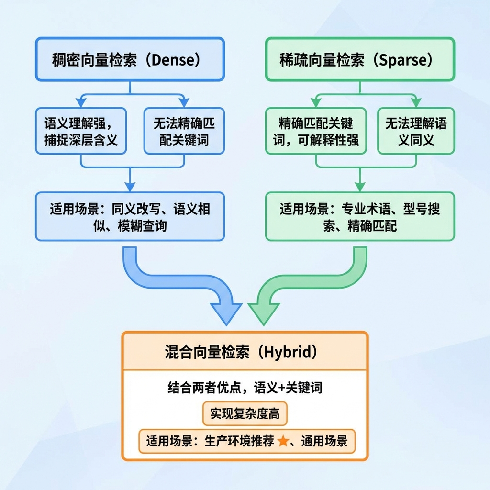
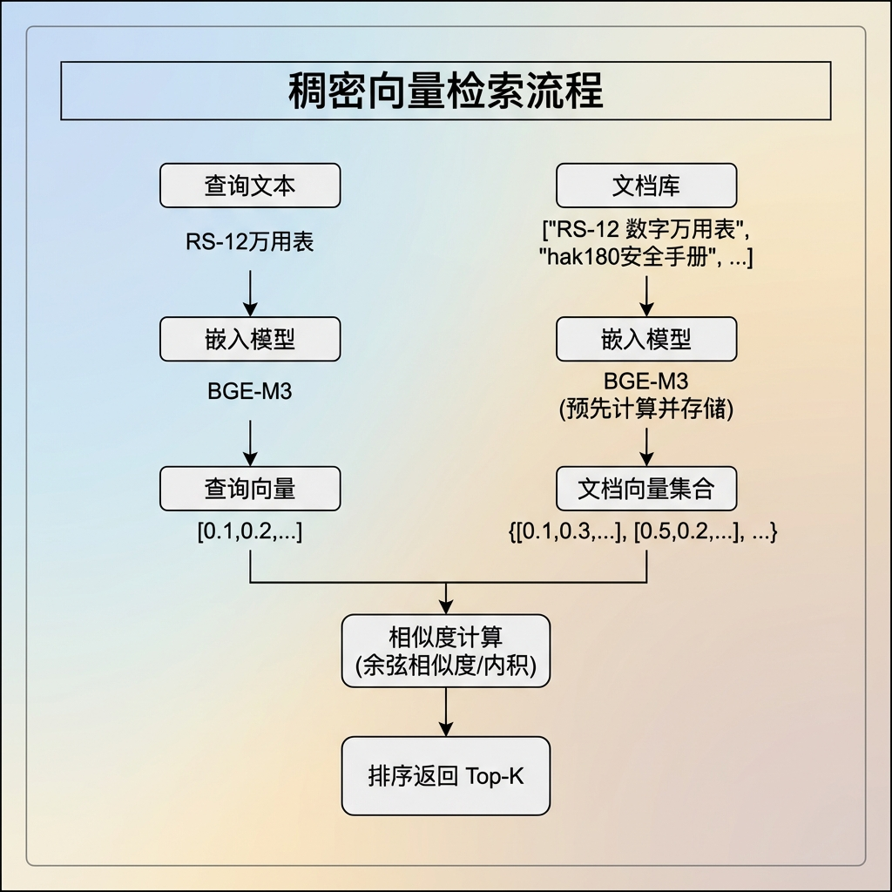
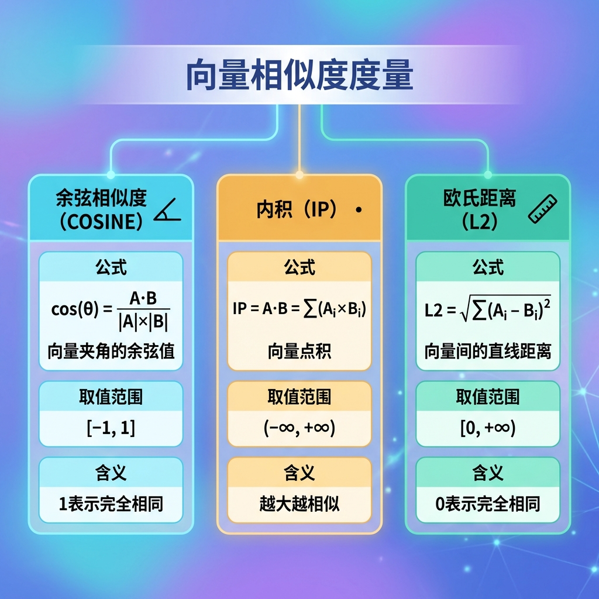
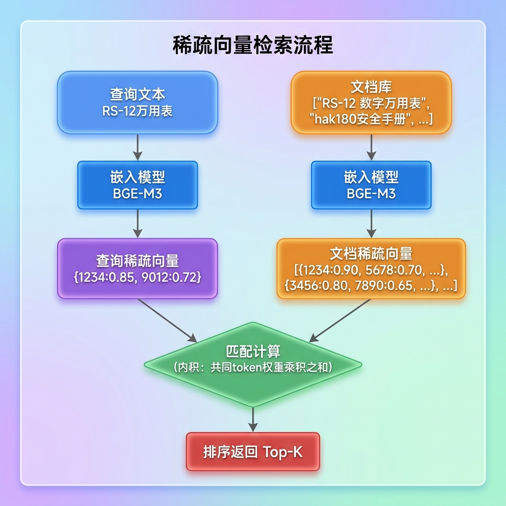
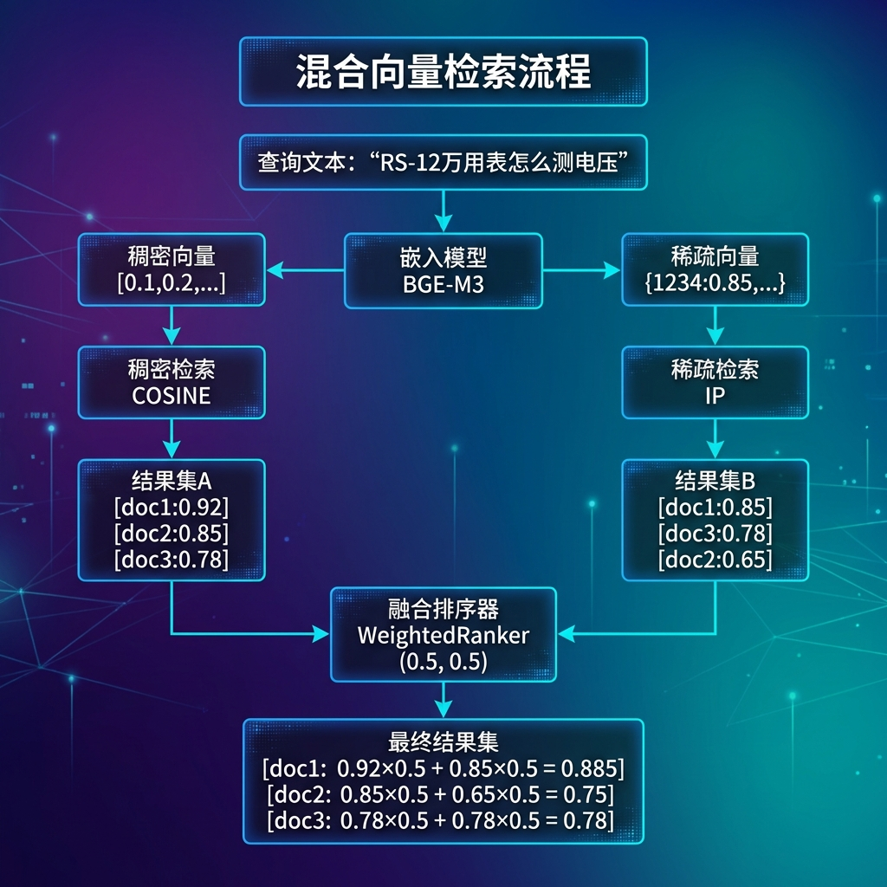

# Milvus 向量检索方式

---

## 1. 概述

### 1.1 向量检索在 RAG 中的位置

在 RAG（检索增强生成）系统中，向量检索是核心环节，决定了"能找到什么内容"：

```
用户问题
    │
    ▼
┌─────────────────┐
│   嵌入模型                   │  ← 将文本转换为向量
│   (BGE-M3)                  │
└────────┬────────┘
               │ 向量
               ▼
┌─────────────────┐
│   向量检索                   │  ← 本课件重点：三种检索方式
│   (Milvus)                  │
└────────┬────────┘
               │ 相似文档
               ▼
┌─────────────────┐
│   LLM 生成                   │  ← 基于检索结果生成答案
└─────────────────┘
```

### 1.2 三种向量检索方式对比



### 1.3 本项目选择

掌柜智库项目使用**混合向量检索**，原因：

- 商品名包含型号（如 RS-12），需要精确匹配
- 用户提问方式多样（如"怎么测电压"、"电压测量方法"），需要语义理解

---

## 2. 稠密向量检索（Dense Vector Search）

### 2.1 基本概念

```
稠密向量：维度固定、每个维度都有值的向量
示例：BGE-M3 模型生成的稠密向量
维度：1024
格式：[0.123, -0.456, 0.789, ..., 0.234]  (共1024个浮点数)
```

### 2.2 工作原理



### 2.3 相似度度量方式



### 2.4 代码示例

```python
from pymilvus import MilvusClient

# 1. 获取 Milvus 客户端
milvus_client = MilvusClient(uri="http://localhost:19530")

# 2. 稠密向量检索
dense_vector = [0.123, -0.456, 0.789, ...]  # 1024维

results = milvus_client.search(
    collection_name="kb_chunks",
    data=[dense_vector],              # 查询向量
    anns_field="dense_vector",        # 稠密向量字段名
    param={"metric_type": "COSINE"},  # 相似度度量
    limit=5,                          # 返回 Top 5
    output_fields=["content", "item_name"]
)

# 3. 解析结果
for hit in results[0]:
    print(f"内容: {hit['entity']['content']}")
    print(f"分数: {hit['distance']}")
```

### 2.5 优缺点分析

```
优点：
├── 语义理解能力强
│   "怎么测电压" 和 "电压测量方法" → 高相似度
├── 泛化能力好
│   "万用表" 和 "多功能电表" → 能识别为相似
└── 维度固定，检索效率高

缺点：
├── 无法精确匹配关键词
│   "RS-12" 和 "RS-13" → 可能高相似度（都是万用表型号）
├── 对专业术语、型号不敏感
└── 黑盒特性，可解释性差
```

---

## 3. 稀疏向量检索（Sparse Vector Search）

### 3.1 基本概念

```
稀疏向量：大多数维度为0，只有少数维度有值的向量

示例：BGE-M3 生成的稀疏向量
格式：{token_id: weight, token_id: weight, ...}

"RS-12数字万用表" → {1234: 0.85, 5678: 0.72, 9012: 0.68}
                      ↑          ↑           ↑
                   "RS-12"      "数字"       "万用表"
```

### 3.2 工作原理




### 3.3 代码示例

```python
from pymilvus import MilvusClient

# 1. 获取 Milvus 客户端
milvus_client = MilvusClient(uri="http://localhost:19530")

# 2. 稀疏向量检索
sparse_vector = {1234: 0.85, 5678: 0.72, 9012: 0.68}  # {token_id: weight}

results = milvus_client.search(
    collection_name="kb_chunks",
    data=[sparse_vector],           # 查询稀疏向量
    anns_field="sparse_vector",     # 稀疏向量字段名
    param={"metric_type": "IP"},    # 内积度量
    limit=5,
    output_fields=["content", "item_name"]
)
```

### 3.4 优缺点分析

```
优点：
├── 精确匹配关键词
│   "RS-12" → 只匹配包含 "RS-12" token 的文档
├── 可解释性强
│   能看到哪些 token 贡献了分数
├── 对专业术语、型号敏感
└── 适合精确查询场景

缺点：
├── 无法理解语义同义
│   "电压测量" 和 "测电压" → 可能低相似度（token不同）
├── 向量维度不固定，索引复杂
└── 需要专门的稀疏向量嵌入模型
```

---

## 4. 混合向量检索（Hybrid Vector Search）

### 4.1 基本概念

```
混合检索 = 稠密向量检索 + 稀疏向量检索 + 融合排序

同时利用两种向量的优势：
├── 稠密向量：语义理解
├── 稀疏向量：关键词精确匹配
└── 融合排序：加权合并两种检索结果
```

### 4.2 工作原理



### 4.3 融合排序算法

#### 4.3.1 WeightedRanker（加权融合）

本项目使用的融合方式：

```python
from pymilvus import WeightedRanker

# 创建加权融合排序器
rerank = WeightedRanker(
    0.5,        # 稠密向量权重
    0.5,        # 稀疏向量权重
    norm_score=True  # 是否归一化分数
)

# 最终分数 = 稠密分数×0.5 + 稀疏分数×0.5
```

**分数归一化（norm_score）的作用**：

```
问题：稠密向量的分数是有界的（通常在 [-1, 1] 之间）不过像 OpenAI 的 API）在底层自动做了一次线性映射 (score + 1) / 2，把负数藏了起来，强行变成了 [0, 1] 以方便业务端展示。
而稀疏向量的分数是无界的（通常在 [0, ∞) 之间且绝对值可能很大）。

不归一化：
  稠密分数 0.8 × 0.5 = 0.4
  稀疏分数 2.5 × 0.5 = 1.25
  稀疏向量主导结果 ❌

归一化后：
  稠密分数 0.8 归一化 → 0.8
  稀疏分数 2.5 归一化 → 0.9 (假设最高分2.8)
  两向量公平参与融合 ✓
```

#### 4.3.2 RRF（倒数排名融合）

另一种常用融合方式：

```python
# RRF 公式
score(doc) = Σ 1 / (k + rank(doc))

# 示例
稠密检索排名: doc1(第1), doc2(第2), doc3(第3)
稀疏检索排名: doc1(第1), doc3(第2), doc4(第3)

RRF(doc1) = 1/(k+1) + 1/(k+1) = 2/(k+1)  # k通常取60
RRF(doc2) = 1/(k+2) + 0
RRF(doc3) = 1/(k+3) + 1/(k+2)
```

### 4.4 实现详解

#### 4.4.2 嵌入生成（bge_m3_embedding_util.py）

```python
from pymilvus.model.hybrid import BGEM3EmbeddingFunction

def get_beg_m3_embedding_model():
    """获取 BGE-M3 嵌入模型实例"""
    bge_m3_ef = BGEM3EmbeddingFunction(
        #model_name='BAAI/bge-m3',  # 模型名称
        model_name=r'D:\ai_models\modelscope_cache\models\BAAI\bge-m3',
        device='cpu',               # 运行设备
        use_fp16=False              # 是否使用半精度
    )
    return bge_m3_ef


def generate_hybrid_embeddings(embedding_model, documents):
    """
    同时生成稠密和稀疏向量

    Args:
        embedding_model: BGE-M3 模型实例
        documents: 文本列表

    Returns:
        {
            "dense": [[0.1, 0.2, ...], ...],    # 稠密向量列表
            "sparse": [{token_id: weight}, ...]  # 稀疏向量列表
        }
    """
    # 1. 调用模型编码
    embedding_result = embedding_model.encode_documents(documents)

    # 2. 处理稀疏向量（从 CSR 矩阵提取）
    processed_sparse = []
    csr_array = embedding_result['sparse']

    for i in range(len(documents)):
        # 获取第 i 个文档的稀疏向量
        start = csr_array.indptr[i]
        end = csr_array.indptr[i + 1]

        token_ids = csr_array.indices[start:end].tolist()
        weights = csr_array.data[start:end].tolist()

        # 构建 {token_id: weight} 字典
        sparse_vector = dict(zip(token_ids, weights))
        processed_sparse.append(sparse_vector)

    # 3. 返回结果
    return {
        "dense": [d.tolist() for d in embedding_result["dense"]],
        "sparse": processed_sparse
    }
```

#### 4.4.3 混合检索请求构建（milvus_util.py）

```python
from pymilvus import MilvusClient, WeightedRanker, AnnSearchRequest

def create_hybrid_search_requests(
    dense_vector,
    sparse_vector,
    dense_params=None,
    sparse_params=None,
    expr=None,
    limit=5
):
    """
    创建混合检索请求

    Args:
        dense_vector: 稠密向量 [0.1, 0.2, ...]
        sparse_vector: 稀疏向量 {token_id: weight}
        limit: 每路检索返回数量

    Returns:
        [dense_req, sparse_req] 检索请求列表
    """
    # 默认参数
    if dense_params is None:
        dense_params = {"metric_type": "COSINE"}  # 稠密用余弦
    if sparse_params is None:
        sparse_params = {"metric_type": "IP"}     # 稀疏用内积

    # 创建稠密向量检索请求
    dense_req = AnnSearchRequest(
        data=[dense_vector],
        anns_field="dense_vector",      # Collection 中的稠密向量字段
        param=dense_params,
        expr=expr,                       # 过滤表达式（可选）
        limit=limit
    )

    # 创建稀疏向量检索请求
    sparse_req = AnnSearchRequest(
        data=[sparse_vector],
        anns_field="sparse_vector",      # Collection 中的稀疏向量字段
        param=sparse_params,
        expr=expr,
        limit=limit
    )

    return [dense_req, sparse_req]
```

#### 4.4.4 混合检索执行

```python
def execute_hybrid_search_query(
    milvus_client,
    collection_name,
    search_requests,
    ranker_weights=(0.5, 0.5),
    norm_score=True,
    limit=5,
    output_fields=None
):
    """
    执行混合检索

    Args:
        collection_name: 集合名称
        search_requests: 检索请求 [dense_req, sparse_req]
        ranker_weights: 融合权重 (稠密权重, 稀疏权重)
        norm_score: 是否归一化分数
        limit: 最终返回数量
        output_fields: 返回字段

    Returns:
        检索结果 [[hit1, hit2, ...], ...]
    """
    # 1. 创建融合排序器
    rerank = WeightedRanker(
        ranker_weights[0],    # 稠密向量权重
        ranker_weights[1],    # 稀疏向量权重
        norm_score=norm_score
    )

    # 2. 执行混合检索
    results = milvus_client.hybrid_search(
        collection_name=collection_name,
        reqs=search_requests,      # 检索请求列表
        ranker=rerank,              # 融合排序器
        limit=limit,
        output_fields=output_fields
    )

    return results
```

#### 4.4.5 业务调用（item_name_confirm_node.py）

```python
class ItemNameAligner:
    """商品名匹配对齐器"""

    def _match_vector(self, item_names: List[str]) -> List[Dict]:
        """
        根据商品名查询向量数据库

        Args:
            item_names: LLM 提取的商品名列表

        Returns:
            检索结果列表
        """
        search_results = []

        # 1. 获取客户端和嵌入模型
        milvus_client = get_milvus_client()
        embedding_model = get_beg_m3_embedding_model()

        # 2. 生成混合向量
        embedding_result = generate_hybrid_embeddings(
            embedding_model,
            item_names
        )

        # 3. 遍历每个商品名进行检索
        for idx, extract_name in enumerate(item_names):
            # 3.1 创建混合检索请求
            search_requests = create_hybrid_search_requests(
                dense_vector=embedding_result['dense'][idx],
                sparse_vector=embedding_result['sparse'][idx],
            )

            # 3.2 执行混合检索
            result = execute_hybrid_search_query(
                milvus_client,
                collection_name="kb_item_names_v2",
                search_requests=search_requests,
                ranker_weights=(0.5, 0.5),   # 权重各占一半
                norm_score=True,              # 归一化分数
                output_fields=["item_name"]
            )

            # 3.3 解析结果
            matches = [
                {
                    "item_name": hit["entity"]["item_name"],
                    "score": hit["distance"]
                }
                for hit in (result[0] if result else [])
            ]

            search_results.append({
                "extracted_name": extract_name,
                "matches": matches
            })

        return search_results
```

### 4.5 权重调优建议


---

## 5. Milvus Collection 设计

### 5.1 支持混合检索的 Collection Schema

```python
from pymilvus import CollectionSchema, FieldSchema, DataType

# 定义字段
fields = [
    FieldSchema(name="id", dtype=DataType.INT64, is_primary=True, auto_id=True),
    FieldSchema(name="item_name", dtype=DataType.VARCHAR, max_length=512),

    # 稠密向量字段
    FieldSchema(
        name="dense_vector",
        dtype=DataType.FLOAT_VECTOR,
        dim=1024  # BGE-M3 默认维度
    ),

    # 稀疏向量字段
    FieldSchema(
        name="sparse_vector",
        dtype=DataType.SPARSE_FLOAT_VECTOR
    )
]

# 创建 Schema
schema = CollectionSchema(
    fields=fields,
    enable_dynamic_field=True
)

# 创建 Collection
collection = MilvusClient.create_collection(
    collection_name="kb_item_names",
    schema=schema
)
```

### 5.2 创建索引

```python
# 稠密向量索引（HNSW 或 IVF_FLAT）
index_params_dense = {
    "index_type": "HNSW",
    "metric_type": "COSINE"
}

milvus_client.create_index(
    collection_name="kb_item_names",
    index_name="dense_index",
    field_name="dense_vector",
    **index_params_dense
)

# 稀疏向量索引
index_params_sparse = {
    "index_type": "SPARSE_INVERTED_INDEX",
    "metric_type": "IP"
}

milvus_client.create_index(
    collection_name="kb_item_names",
    index_name="sparse_index",
    field_name="sparse_vector",
    **index_params_sparse
)
```

---

## 6. 数据集准备（独立演示）

本节提供一个完整可运行的演示示例，展示如何准备支持三种向量检索的数据集。


### 6.1 完整演示代码

```python
"""
Milvus 三种向量检索演示
支持：稠密向量检索、稀疏向量检索、混合向量检索
"""

from pymilvus import MilvusClient, DataType, AnnSearchRequest, WeightedRanker
from pymilvus.model.hybrid import BGEM3EmbeddingFunction
import time


# ──────────────────────────────────────────────
# 1. 演示数据集
# ──────────────────────────────────────────────

DEMO_DOCUMENTS = [
    {"id": 1, "title": "Python异步编程指南", "content": "介绍async/await语法、asyncio库的使用...", "category": "Python"},
    {"id": 2, "title": "JavaScript异步编程详解", "content": "Promise和async函数、事件循环...", "category": "JavaScript"},
    {"id": 3, "title": "深入理解Python装饰器", "content": "装饰器原理与实战应用...", "category": "Python"},
    {"id": 4, "title": "React Hooks入门教程", "content": "useState和useEffect详解...", "category": "React"},
    {"id": 5, "title": "Vue3组合式API详解", "content": "setup函数和响应式系统...", "category": "Vue"},
]

COLLECTION_NAME = "demo_tech_articles"


# ──────────────────────────────────────────────
# 2. 创建 Collection
# ──────────────────────────────────────────────

def create_collection(client: MilvusClient):
    """创建支持混合检索的 Collection"""
    if client.has_collection(COLLECTION_NAME):
        client.drop_collection(COLLECTION_NAME)

    schema = client.create_schema(enable_dynamic_field=True)

    schema.add_field(field_name="id", datatype=DataType.INT64, is_primary=True, auto_id=False)
    schema.add_field(field_name="title", datatype=DataType.VARCHAR, max_length=512)
    schema.add_field(field_name="content", datatype=DataType.VARCHAR, max_length=2000)
    schema.add_field(field_name="category", datatype=DataType.VARCHAR, max_length=64)
    schema.add_field(field_name="dense_vector", datatype=DataType.FLOAT_VECTOR, dim=1024)
    schema.add_field(field_name="sparse_vector", datatype=DataType.SPARSE_FLOAT_VECTOR)

    index_params = client.prepare_index_params()
    index_params.add_index(field_name="dense_vector", index_type="AUTOINDEX", metric_type="COSINE")
    index_params.add_index(field_name="sparse_vector", index_type="SPARSE_INVERTED_INDEX", metric_type="IP")

    client.create_collection(collection_name=COLLECTION_NAME, schema=schema, index_params=index_params)
    print(f"Collection '{COLLECTION_NAME}' 创建成功")


# ──────────────────────────────────────────────
# 3. 生成向量并插入数据
# ──────────────────────────────────────────────

def generate_and_insert_data(client, embedding_model):
    """生成混合向量并插入数据"""
    texts = [f"{doc['title']}\n{doc['content']}" for doc in DEMO_DOCUMENTS]
    embedding_result = embedding_model.encode_documents(texts)

    # 提取稠密向量
    dense_vectors = [vec.tolist() for vec in embedding_result['dense']]

    # 提取稀疏向量
    sparse_vectors = []
    csr_array = embedding_result['sparse']
    for i in range(len(texts)):
        start, end = csr_array.indptr[i], csr_array.indptr[i + 1]
        token_ids = csr_array.indices[start:end].tolist()
        weights = csr_array.data[start:end].tolist()
        sparse_vectors.append(dict(zip(token_ids, weights)))

    # 构建插入数据
    data = []
    for i, doc in enumerate(DEMO_DOCUMENTS):
        data.append({
            "id": doc["id"],
            "title": doc["title"],
            "content": doc["content"],
            "category": doc["category"],
            "dense_vector": dense_vectors[i],
            "sparse_vector": sparse_vectors[i]
        })

    result = client.insert(collection_name=COLLECTION_NAME, data=data)
    print(f"插入 {result['insert_count']} 条数据")
    return dense_vectors, sparse_vectors


# ──────────────────────────────────────────────
# 4. 三种检索方式
# ──────────────────────────────────────────────
#注意：search_params
def dense_search(client, query_dense, limit=3):
    """稠密向量检索：语义理解强"""
    return client.search(
        collection_name=COLLECTION_NAME, data=[query_dense],
        anns_field="dense_vector", search_params={"metric_type": "COSINE"},
        limit=limit, output_fields=["title", "category"]
    )[0]

#注意：search_params
def sparse_search(client, query_sparse, limit=3):
    """稀疏向量检索：关键词精确匹配"""
    return client.search(
        collection_name=COLLECTION_NAME, data=[query_sparse],
        anns_field="sparse_vector", search_params={"metric_type": "IP"},
        limit=limit, output_fields=["title", "category"]
    )[0]

#注意：param
def hybrid_search(client, query_dense, query_sparse, limit=3):
    """混合向量检索：语义+关键词"""
    dense_req = AnnSearchRequest(data=[query_dense], anns_field="dense_vector",
                                param={"metric_type": "COSINE"}, limit=limit)
    sparse_req = AnnSearchRequest(data=[query_sparse], anns_field="sparse_vector",
                                 param={"metric_type": "IP"}, limit=limit)
    reranker = WeightedRanker(0.5, 0.5, norm_score=True)
    return client.hybrid_search(
        collection_name=COLLECTION_NAME, reqs=[dense_req, sparse_req],
        ranker=reranker, limit=limit, output_fields=["title", "category"]
    )[0]


# ──────────────────────────────────────────────
# 5. 主程序
# ──────────────────────────────────────────────

def main():
    print("=" * 50)
    print("Milvus 三种向量检索演示")
    print("=" * 50)

    client = MilvusClient(uri="http://localhost:19530")
    #embedding_model = BGEM3EmbeddingFunction(model_name="BAAI/bge-m3", device="cpu")
	embedding_model = AIClients.get_bge_m3_client()
    create_collection(client)
    generate_and_insert_data(client, embedding_model)

    time.sleep(2)  # 等待索引生效

    # 测试查询
    query_text = "Python异步编程怎么用"
    print(f"\n查询: '{query_text}'")

    query_emb = embedding_model.encode_documents([query_text])
    query_dense = query_emb['dense'][0].tolist()
    csr = query_emb['sparse']
    query_sparse = dict(zip(csr.indices[csr.indptr[0]:csr.indptr[1]].tolist(),
                            csr.data[csr.indptr[0]:csr.indptr[1]].tolist()))

    # 执行检索
    print("\n【稠密向量检索】")
    for hit in dense_search(client, query_dense):
        print(f"  {hit['entity']['title']} - {hit['distance']:.4f}")

    print("\n【稀疏向量检索】")
    for hit in sparse_search(client, query_sparse):
        print(f"  {hit['entity']['title']} - {hit['distance']:.4f}")

    print("\n【混合向量检索】")
    for hit in hybrid_search(client, query_dense, query_sparse):
        print(f"  {hit['entity']['title']} - {hit['distance']:.4f}")


if __name__ == "__main__":
    main()
```

### 6.2 运行步骤

```bash
# 1. 启动 Milvus
docker run -d --name milvus -p 19530:19530 milvusdb/milvus:latest standalone

# 2. 保存代码为 demo.py，然后运行
pip install pymilvus modellogy
python demo.py
```

### 6.3 预期输出

```
【稠密向量检索】
  JavaScript异步编程详解 - 0.8234
  Python异步编程指南 - 0.8156
  Go语言并发编程 - 0.7012

【稀疏向量检索】
  Python异步编程指南 - 45.2300
  深入理解Python装饰器 - 32.1500
  Python机器学习基础 - 28.6700

【混合向量检索】
  Python异步编程指南 - 0.8912
  JavaScript异步编程详解 - 0.7623
  深入理解Python装饰器 - 0.6845
```

---

## 7. 最佳实践总结

### 7.1 选择建议

```
┌─────────────────┬─────────────────────┐
│  业务场景                    │  推荐检索方式                        │
├───────────────────────────────────────┤
│  电商商品搜索                │  混合检索 (0.4, 0.6)                 │
│  型号精确匹配 + 语义理解      │  稀疏权重稍高                         │
├───────────────────────────────────────┤
│  知识库问答                  │  混合检索 (0.5, 0.5)                 │
│  用户提问多样                │  均衡权重                            │
├───────────────────────────────────────┤
│  文档语义搜索                │  稠密向量检索                         │
│  纯语义相似度匹配             │  不需要关键词匹配                     │
├───────────────────────────────────────┤
│  专业术语搜索                │  稀疏向量检索                         │
│  医疗、法律等领域             │  术语精确匹配更重要                   │
└─────────────────┴─────────────────────┘
```

### 7.2 性能优化

```
1. 索引选择
   ├── 小数据量 (<100万): HNSW (高召回，低延迟)
   ├── 大数据量 (>100万): IVF_FLAT 或 IVF_PQ (内存效率高)
   └── 稀疏向量: SPARSE_INVERTED_INDEX

2. 检索参数
   ├── limit: 控制每路检索返回数量
   │   太大: 性能下降
   │   太小: 可能漏掉相关结果
   └── 推荐: limit=10~20, 最终取 Top 5

3. 批量检索
   └── 多个查询合并为一次请求，减少网络开销
```

### 7.3 常见问题

```
Q1: 混合检索比单路检索慢多少？
A1: 约 1.5~2 倍，但准确率提升更显著，值得投入。

Q2: 权重如何确定？
A2: 建议用测试集做网格搜索，找到最优权重组合。

Q3: BGE-M3 生成两种向量有额外开销吗？
A3: 没有，BGE-M3 天然支持混合向量，一次推理同时输出。

Q4: 是否有其他混合检索模型？
A4: 有，如 Cohere、Jina Embeddings 等，但 BGE-M3 开源免费。
```

---

## 8. 参考资源

┌────────────────────────────────────────────┐
│  资源名称                         │  链接                                                                     │
├───────────────┼────────────────────────────┤
│  Milvus 官方文档             │  https://milvus.io/docs                                      │
│  Milvus 混合检索             │  https://milvus.io/docs/hybridsearch.md        │
│  BGE-M3 模型                   │  https://huggingface.co/BAAI/bge-m3              │
│  PyMilvus SDK                   │  https://github.com/milvus-io/pymilvus         │
└───────────────┴────────────────────────────┘