# 1.数据库介绍

## 1.1.数据库介绍

```mysql
1.概述:存储数据的仓库,可以永久性存储数据
2.为啥使用数据库存储数据:
  a.咱们之前在python的时候学了变量,但是变量一次性只能存一个数据,后来我们就学了容器,容器可以一次性存多个数据,但是容器存数据是临时性的,代码运行完毕之后,容器中的数据就没了,所以我们就又学了文件操作,可以将数据永久性保存到文件中,但是数据存到文件中没有格式,不好操作
      
  b.所以就需要数据库了,数据库有自己独特的sql语句,可以根据条件快速定位到指定的单元格中,原地修改,而且数据量如果超大,数据库能承受,而且操作也很方便 
      
3.数据库的作用:
  a.格式清晰
  b.操作数据方便
  c.永久存储
  d.能抗大量数据的压力
```

> 常见的关系型数据库:所谓的关系型数据库,需要有库,库中建表,数据存到表中
>
> mysql oracle

## 1.2.数据库管理系统

```mysql
1.概述:我们程序员操作数据库中的数据时,不是我们直接就去操作数据的,在程序员和数据库之间有一个"库管",这个"库管"就是数据库管理系统,这个数据库管理系统在安装数据库的时候就已经存在了,我们只不过感受不到
2.作用:
  保证数据库中的数据的安全性和稳定性
```

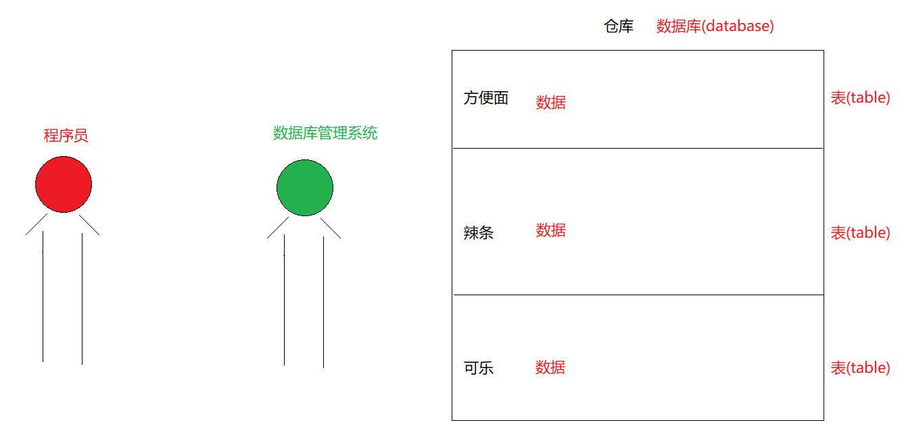

## 1.3.数据库表

```mysql
1.概述:数据真正存储的位置,叫做表  -> table
2.表的组成部分:
  a.表名
  b.列名
  c.单元格:真正存储数据的地方
  d.每一列都有对应的数据类型
```

## 1.4.数据库表和python类的对应关系

```mysql
数据库的表和python类的对应关系:
  1.表名  ->  类名
  2.列名  ->  属性名
  3.一行数据   -> 对象
  4.单元格的数据  -> 属性值
```

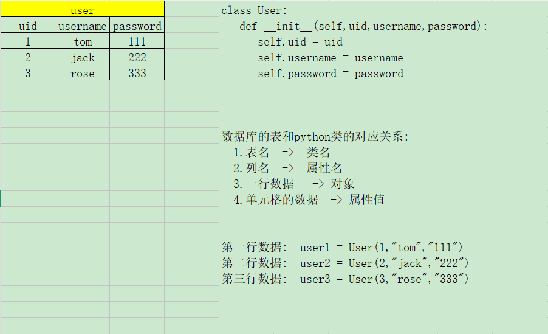

## 1.5.python类结合表的实际运用

```mysql
1.针对于添加:
  a.前端上填写了很多数据
  b.数据会发送给服务端
  c.服务端就要接收数据
  d.服务端有可能会接收到很多前端发送过来的数据
  e.我们服务端如何传递这些数据,最终将数据放到数据库中保存呢?
  f.我们可以将前端发送过来的数据,封装成python类对象,进行服务端的各个部分传递,最终将封装的数据添加到数据库中
      
      
2.针对于查询:
  可以将从数据库中查询出来的多条数据,封装成一个一个的python类对象,将这些对象返回给页面进行展示   
```

# 2.sql语言

## 2.1.sql语言介绍

```mysql
1.什么叫做sql语言:是所有关系型数据库语法的一个标准,规范
2.作用:规范了关系型数据库的语法以及一些关键字的使用: create drop insert select update等
3.注意:不同的关系型数据库在都遵守sql语言规范的基础上,会有一些差异,这些差异叫做sql方言
```

## 2.2.sql语言分类

```mysql
- 数据定义语言：简称DDL(Data Definition Language)，用来定义数据库对象：数据库，表，列等。关键字：create，alter，drop等

- 数据操作语言：简称DML(Data Manipulation Language)，用来对数据库中表的记录进行操作。关键字：insert，delete，update等

- 数据控制语言：简称DCL(Data Control Language)，用来定义数据库的访问权限和安全级别，及创建用户。

- 数据查询语言：简称DQL(Data Query Language)，用来查询数据库中表的记录。关键字：select，from，where等
```

## 2.3.sql语句的通用语法

```mysql
1.- SQL语句可以单行或多行书写，以分号结尾
2.- 可使用空格和缩进来增强语句的可读性:基本上一个单词就一个空格
3.- MySQL数据库的SQL语句不区分大小写，关键字建议使用大写
    
  - 例如：SELECT * FROM user。
4.- 同样可以使用/**/的方式完成注释 
    /*
     我是一个注释
    */
    #我也是一个注释
   -- 我也是一个注释
```

## 2.4.sql中的数据类型

| **类型名称**          | 说明                                                         |
| --------------------- | ------------------------------------------------------------ |
| int                   | 整数类型                                                     |
| double                | 小数类型                                                     |
| decimal（m,d）        | 指定整数位与小数位长度的小数类型                             |
| date                  | 日期类型，格式为yyyy-MM-dd，包含年月日，不包含时分秒 2020-01-01 |
| datetime              | 日期类型，格式为 YYYY-MM-DD HH:mm:ss，包含年月日时分秒 到9999年 |
| timestamp             | 日期类型，时间戳 从1970年到2038年                            |
| varchar（字符串长度） | 文本类型， M为0~65535之间的整数                              |

```mysql
我们先学  mysql
```

# 3.mysql中语句

## 3.1.DDL之数据库操作：database

### 3.1.1 创建数据库

```mysql
语法:create database 库名
CREATE DATABASE `bj260528_1`;
```

> 强调:
>
> 我们写库名,表名,列名的时候,最好用``包裹

### 3.1.2 查看数据库(了解)

```mysql
语法: show databases
SHOW DATABASES;
```

### 3.1.3 删除数据库

```mysql
语法: drop database 库名
DROP DATABASE `bj260528_1`;
```

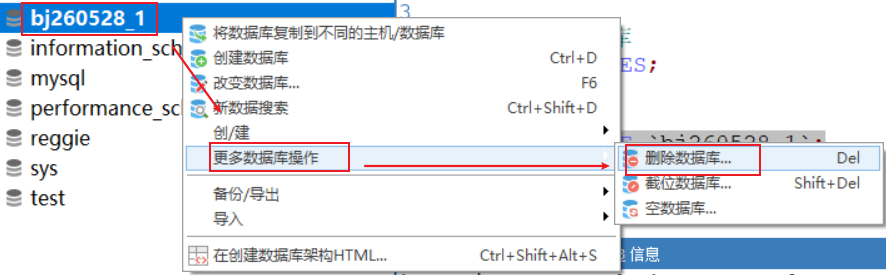

### 3.1.4 使用数据库(切换数据库)

```mysql
语法:use 库名
注意:只有切换库之后,才能够在指定库下面去操作
USE `bj260528_1`;
```

## 3.2.DDL之表操作->table

### 3.2.1 创建表

```mysql
1.格式:
  create table 表名(
    列名 数据类型 (长度) [约束],
    列名 数据类型 (长度) [约束],  
    列名 数据类型 (长度) [约束]
  );

2.注意:
  如果在创建表的时候定义到最后一列了,后面没有其他的语句了,就不要加,
-- 创建表
CREATE TABLE products (
  pid INT,
  pname VARCHAR(10),
  price INT
)
```

### 3.2.3 查看表(了解)

```mysql
#查看所有表
show tables;

#查看表结构
desc 表名;
#查看所有表
SHOW TABLES

#查看表结构
DESC products
```

### 3.2.4 删除表

```mysql
1.语法:
  drop table 表名
DROP TABLE `products`;
```

### 3.2.5修改表结构(了解)

```mysql
alter table 表名 add 列名 类型(长度) [约束];
作用：添加列. 
ALTER TABLE products ADD pdesc VARCHAR(20);
alter table 表名 modify 列名 类型(长度) [约束];
  作用：修改列的类型,长度及约束.
ALTER TABLE products MODIFY pdesc INT;
ALTER TABLE products MODIFY pdesc VARCHAR(20);
  alter table 表名 change 旧列名 新列名 类型(长度) [约束]; 
  作用：修改列名.
ALTER TABLE products CHANGE pdesc miaoshu VARCHAR(20);
ALTER TABLE products CHANGE miaoshu pdesc VARCHAR(20);
  alter table 表名 drop 列名; 
  作用：删除列.
ALTER TABLE products DROP pdesc;
 rename table 表名 to 新表名; 
 作用：修改表名
RENAME TABLE products TO product;
```

## 3.3.DML之数据操作语言

### 3.3.1 插入数据

```mysql
1.关键字:insert into values
2.语法:
  a.insert into 表名 (列名1,列名2) values (值1,值2)
  b.insert into 表名 (列名1,列名2) values (值1,值2),(值1,值2),(值1,值2)...  ->一次性添加多条数据
  c.insert into 表名 values (值1,值2) -> 如果不写列名,后面的值必须要覆盖所有列
3.注意:
  varchar类型数据可以用双引号,也可以用单引号,但是建议用单引号
/*
  varchar类型数据可以用双引号,也可以用单引号,但是建议用单引号
  
  比如,将这个sql语句放到java代码中
  String sql = "INSERT INTO product (pid,pname,price) VALUES (1,"裤衩",50)"
  
  放python中也一样
*/
INSERT INTO product (pid,pname,price) VALUES (1,'裤衩',50);

INSERT INTO product (pid,pname,price) VALUES (2,'背心',100),(3,'袜子',10),(4,'拖鞋',10)

INSERT INTO product VALUES (5,'丝袜',50)
```

> 1.表名,库名,列名用``
>
> 2.varchar类型的数据用’’

### 3.3.2 删除数据

```mysql
1.关键字:delete from where
2.语法:
  a.delete from 表名  -> 一次性将所有数据都删除
  b.delete from 表名 where 条件  -> 根据条件删除数据
```

| python | mysql      |
| ------ | ---------- |
| ==     | =          |
| >      | >          |
| <      | <          |
| >=     | >=         |
| <=     | <=         |
| !=     | != 或者 <> |

```mysql
-- 删除pid为1的记录
-- 删除pid>=5的记录
-- 删除pid不等于3的记录
DELETE FROM product;
-- 删除pid为1的记录
DELETE FROM product WHERE pid = 1;
-- 删除pid>=5的记录
DELETE FROM product WHERE pid>=5;
-- 删除pid不等于3的记录
DELETE FROM product WHERE pid!=3;
DELETE FROM product WHERE pid<>3;
DELETE FROM product WHERE NOT(pid=3);
```

### 3.3.3 修改数据

```mysql
1.关键字:update set where
2.语法:
  a.update 表名 set 列名 = 新值  -> 将指定列中所有的数据都改成新值
  b.update 表名 set 列名 = 新值 where 条件
-- 将表中的裤衩改成内裤

-- 将pid为5的price改成25

-- 将pid不等于1的pname都改成睡衣
-- 将表中的裤衩改成内裤
UPDATE product SET pname = '内裤' WHERE pname = '裤衩';
-- 将pid为5的price改成25
UPDATE product SET price = 25 WHERE pid = 5;

-- 将pid不等于1的pname都改成睡衣
UPDATE product SET pname = '睡衣' WHERE pid!=1;
```

# 4.约束

```mysql
约束是对指定列的数据进行约束
```

## 4.1.主键约束

```mysql
1.关键字:primary key
2.特点:
  a.主键列中的数据是唯一的,不能重复
  b.主键列中的数据不能是NULL
  c.主键列中的数据可以代表一条数据 -> 相当于人的身份证号
  d.每张表都应该有一个主键列
```

### 4.1.1.添加方式1:在创建表时,在字段后面直接指定(重点)

```mysql
create table 表名(
  列名 数据类型(长度) primary key,
  列名 数据类型(长度),
  列名 数据类型(长度)  
);
-- 在创建表的时候直接指定约束
CREATE TABLE category(
  cid INT PRIMARY KEY,
  cname VARCHAR(10)
);

INSERT INTO category (cid,cname) VALUES (1,'蔬菜');
-- INSERT INTO category (cid,cname) VALUES (1,'水果');
-- INSERT INTO category (cid,cname) VALUES (null,'服装');
```

### 4.1.2.添加方式2:在constraint约束区域,去指定主键约束

```mysql
1.什么叫做constraint域
  创建表的时候,最后一列和右半个小括号之间的区域
2.语法:
  [constraint 名字] primary key (字段名)
3.注意:[constraint 名字]:可写可不写
CREATE TABLE category(
  cid INT,
  cname VARCHAR(10),
  PRIMARY KEY(cid)
);
```

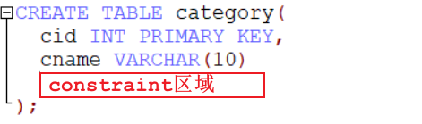

### 4.1.3.添加方式3:通过修改表结构的方式

```mysql
1.格式:ALTER TABLE 表名 ADD [CONSTRAINT 名称] PRIMARY KEY (字段列表)
2.注意:[CONSTRAINT 名称]可以省略不写
CREATE TABLE category(
  cid INT,
  cname VARCHAR(10)
);
ALTER TABLE category ADD PRIMARY KEY (cid);
```

### 4.1.4.联合主键

```mysql
1.概述:多个列合称为一个主键
2.使用场景:如果多个列中的数据不能完全重复,就可以设置成联合主键
3.特点:
  主键的多个列中的数据不能完全一样,不能为NULL
/*
  联合主键
*/
CREATE TABLE person(
  xing VARCHAR(10),
  ming VARCHAR(10),
  city VARCHAR(10),
  
  PRIMARY KEY(xing,ming)
);

INSERT INTO person (xing,ming,city) VALUES ('潘','金莲','山东');
INSERT INTO person (xing,ming,city) VALUES ('潘','仁美','河北')

-- INSERT INTO person (xing,ming,city) VALUES ('潘','金莲','河南');
```

### 4.1.5.删除主键约束

```mysql
ALTER TABLE 表名 DROP PRIMARY KEY->删除主键约束
ALTER TABLE person DROP PRIMARY KEY;
```

## 4.2.自增长约束

### 4.2.1.基本操作

```mysql
1.关键字:auto_increment
2.特点:
  a.都是配合主键约束使用
  b.主键自增长的列中的数据不用我们自己维护,mysql会自动维护
  c.如果删除最后一条数据,我们重新添加,不会重新生成最后那一条数据的编号,会继续往下编
CREATE TABLE category(
  cid INT PRIMARY KEY AUTO_INCREMENT,
  cname VARCHAR(10)
);

INSERT INTO category (cname) VALUES ('蔬菜');

INSERT INTO category (cname) VALUES ('水果');

INSERT INTO category VALUES (NULL,'服装');

DELETE FROM category WHERE cid = 3;

INSERT INTO category VALUES (NULL,'箱包');

-- 摧毁表结构
TRUNCATE TABLE category;
```

> ```mysql
> /*
> 自增长是一个约束,操作起来和其他约束不太一样
> 
> 如果自增长约束和主键约束合起来使用想删除
> 
> 先删除自增长约束
> 再删除主键约束
> 
> */
> 
> drop table category;
> create table category(
> cid int primary key auto_increment,
> cname varchar(100)
> );
> 
> alter table category modify cid int;
> 
> alter table category drop primary key;
> ```

### 4.2.2.truncate和delete区别

```mysql
1.delete:如果是主键自增长,删除之后,再次添加,编号不会重新编号,会接着被删除的那个编号往下继续编
2.truncate:摧毁表结构,主键自增长列,会重新编号
```

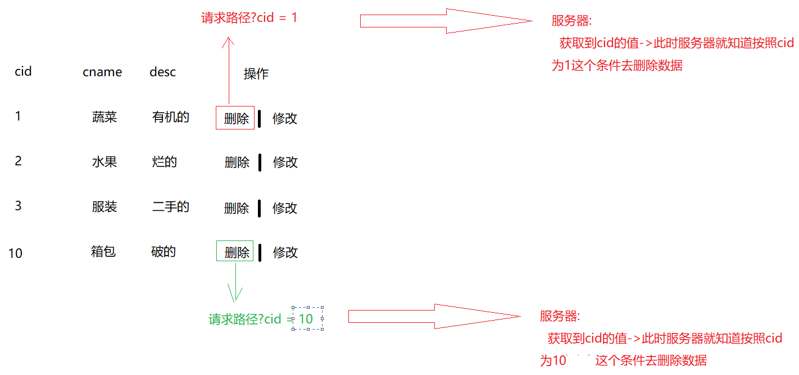

## 4.3.非空约束

```mysql
1.关键字:NOT NULL
2.特点:
  非空约束的列中的数据不能为NULL
CREATE TABLE category(
  cid INT PRIMARY KEY AUTO_INCREMENT,
  cname VARCHAR(10) NOT NULL
);

INSERT INTO category (cname) VALUES ('蔬菜');

-- INSERT INTO category (cname) VALUES (null);

INSERT INTO category (cname) VALUES ('');

INSERT INTO category (cname) VALUES ('null');
```

## 4.4.唯一约束

```mysql
1.关键字:UNIQUE
2.特点:
  被唯一约束修饰的列中的数据不能重复
3.主键约束和唯一约束区别:
  a.相同点:都是唯一的
  b.不同点:
    一个表中能有多个唯一约束,而且可以存null
    一个表中只能有一个主键约束,而且主键约束代表一条数据,不能存null
DROP TABLE category;
CREATE TABLE category(
  cid INT PRIMARY KEY AUTO_INCREMENT,
  cname VARCHAR(10) UNIQUE
);

INSERT INTO category (cname) VALUES ('蔬菜');
-- INSERT INTO category (cname) VALUES ('蔬菜');

INSERT INTO category (cname) VALUES (NULL);
-- INSERT INTO category (cname) VALUES (NULL);
删除唯一约束:
 ALTER TABLE 表名 DROP INDEX 名称   [名称是CONSTRAINT后面的名称]
```

# 5.单表查询

```mysql
#创建商品表：
create table product(
	pid int primary key,
	pname varchar(20),
	price double
);

INSERT INTO product(pid,pname,price) VALUES(1,'联想',5000);
INSERT INTO product(pid,pname,price) VALUES(2,'海尔',3000);
INSERT INTO product(pid,pname,price) VALUES(3,'雷神',5000);
INSERT INTO product(pid,pname,price) VALUES(4,'JACK JONES',800);
INSERT INTO product(pid,pname,price) VALUES(5,'真维斯',200);
INSERT INTO product(pid,pname,price) VALUES(6,'花花公子',440);
INSERT INTO product(pid,pname,price) VALUES(7,'劲霸',2000);
INSERT INTO product(pid,pname,price) VALUES(8,'香奈儿',800);
INSERT INTO product(pid,pname,price) VALUES(9,'相宜本草',200);
INSERT INTO product(pid,pname,price) VALUES(10,'面霸',5);
INSERT INTO product(pid,pname,price) VALUES(11,'好想你枣',56);
INSERT INTO product(pid,pname,price) VALUES(12,'香飘飘奶茶',1);
INSERT INTO product(pid,pname,price) VALUES(13,'果9',1);
```

## 5.1.简单查询

```mysql
1.关键字: select from
2.语法:
  a.select * from 表名   -> 查询表中的所有数据,展示所有列
  b.select 列名1,列名2 from 表名 -> 查询表中的所有数据,展示指定列
3.注意:
  查询出来的结果也是以表的形式展示,但是这张表是一张"伪表"  
  
-- 查询product所有数据
SELECT * FROM product;

-- 查询product 所有数据,展示pname和pid
SELECT pid,pname FROM product;

/*
  去重复值
  
  关键字: distinct(列名)
*/
SELECT DISTINCT(price) FROM product;

/*
  给列中的数据做计算
*/
-- 查询所有数据,给price列中所有的数据+100
SELECT pname,price+100 FROM product;

/*
  给列和表取别名
  
  as 别名
  
  as可以省略
*/
-- SELECT pname,price+100 newprice FROM product;
-- SELECT pname,price+100 'newprice' FROM product;
SELECT pname,price+100 `newprice` FROM product;

-- 也可以给表取别名,但是不涉及到多表查询,给表取别名看不出效果来
SELECT * FROM product p;
```

> 格外注意:
>
> 库名,表名,列名 要是加引号就加``
>
> ''单引号只作用于varchar类型的数据

## 5.2.条件查询

```mysql
1.语法:
  a.select * from 表名 where 条件   -> 查询表中的所有数据,展示所有列
  b.select 列名1,列名2 from 表名 where 条件  -> 查询表中的所有数据,展示指定列
```

| **比较运算符** | > < <= >= = <>        | 大于、小于、大于(小于)等于、不等于                           |
| -------------- | --------------------- | ------------------------------------------------------------ |
|                | BETWEEN …AND…         | 显示在某一区间的值(含头含尾)                                 |
|                | 字段 IN(set)          | 显示在in列表中的值，例：price in(100,200) 查询id为1,3,7的商品: id in(1,3,7) |
|                | 列名 LIKE ‘张pattern’ | 模糊查询，Like语句中，% 代表零个或多个任意字符，_ 代表一个字符， 例如：`first_name like '_a%';` 比如:查询姓张的人:name like ‘张%’ 查询商品名中带香的商品: pname like ‘%香%’ 查询第二个字为想的商品: like ‘*想%' 查询商品名为四个字的商品:pname like '*___’ |
|                | IS NULL               | 判断是否为空 不为空的就是 IS NOT NULL                        |
| **逻辑运行符** | and (与)              | 多个条件同时成立 全为true,整体才为true                       |
|                | or(或)                | 多个条件任一成立 有真则真                                    |
|                | not(非)               | 不成立，例：`where not(salary>100);`                         |

```mysql
-- 查询商品名为'花花公子'的商品所有信息
SELECT * FROM product WHERE pname = '花花公子';

-- 查询价格为800的商品
SELECT * FROM product WHERE price = 800;

-- 查询商品价格大于60元的所有商品信息
SELECT * FROM product WHERE price > 60;

-- 查询商品价格在200-1000之间的所有商品信息
SELECT * FROM product WHERE price BETWEEN 200 AND 1000;

-- 查询商品价格是200或者800的商品
SELECT * FROM product WHERE price IN (200,800);
SELECT * FROM product WHERE price = 200 OR price = 800;

-- 查询以'香'开头的商品
SELECT * FROM product WHERE pname LIKE '香%';

-- 查询含有'霸'的商品
SELECT * FROM product WHERE pname LIKE '%霸%';

-- 查询商品名为NULL的
SELECT * FROM product WHERE pname IS NULL;

-- 查询商品名不为NULL的
SELECT * FROM product WHERE pname IS NOT NULL;
```

## 5.3.排序查询

```mysql
1.关键字:  order by
2.语法:
  select 列名 from 表名 order by 排序字段  排序规则
3.排序规则:
  a.升序: ASC (默认)
  b.降序: DESC
4.问题:先查询还是先排序
  先查询最后排序
书写sql语句关键字的顺序
select 
from 
where 
group by 
having 
order by

执行顺序:
from 
where 
group by 
having 
select 
order by

先定位到要查询哪个表,然后根据什么条件去查,表确定好了,条件也确定好了,开始利用select查询
查询得出一个结果,在针对这个结果进行一个排序

-- 使用价格排序(降序)
SELECT * FROM product ORDER BY price DESC;

-- 使用价格排序(升序)
SELECT * FROM product ORDER BY price;

-- 显示商品的价格(去重复),并排序(降序)
SELECT DISTINCT(price) FROM product ORDER BY price DESC
```

## 5.4.聚合查询

```mysql
1.需要用到聚合函数 -> 函数都是纵行操作
2.语法: select 聚合函数(列名) from 表名 where 条件
3.常用聚合函数:
  sum(列名)  对指定列求和
  avg(列名)  对指定列求平均值
  count(*)   统计总记录数
  max(列名)  求指定列的最大值
  min(列名)  求指定列的最小值

-- 统计product的总记录数
SELECT COUNT(*) FROM product;
SELECT COUNT(pid) FROM product;

-- 查询所有商品的价格总和
SELECT SUM(price) FROM product;

-- 查询pid为1,3,7 商品的价格平均值
SELECT AVG(price) FROM product WHERE pid IN (1,3,7);

-- 查询商品的最高价格以及最低价格
SELECT MAX(price),MIN(price) FROM product;

CREATE TABLE `user`(
  uid INT,
  uname VARCHAR(10)
);
SELECT COUNT(*) FROM `user`;
-- 如果按照列名统计总记录数,如果这个列中有NULL,会被排除在外
SELECT COUNT(uid) FROM `user`;
```

## 5.5.分组查询

```mysql
1.关键字: group by
2.语法:
  select 聚合函数(列名) from 表名 group by 分组列 having 条件
3.注意:
  分组查询一般和聚合查询一起使用更有意义
4.分析按照哪一列分组:->看看按照哪个字段合并 
  相同的字段数据合并为一组
  不同的字段数据单独为一组
5.where和having区别
  where在分组查询之前执行
  having在分组查询之后执行    
书写sql语句关键字的顺序:偏向的是关键字
select 
from 
where 
group by 
having 
order by

执行顺序:偏向的是逻辑
from 
where 
group by 
having 
select 
order by

先定位到要查询哪个表,然后根据什么条件去查,表确定好了,条件也确定好了,开始利用select查询
查询得出一个结果,在针对这个结果进行一个排序

-- 查询相同商品的价格总和
SELECT pname,SUM(price) FROM product GROUP BY pname;

-- 查询相同商品的价格总和并排序
/*
  先查询,最后排序
  查询之后的价格列是SUM(price),我们用price排序不行
  所以我们应该用查询出的结果的字段排序
*/
SELECT pname,SUM(price) FROM product GROUP BY pname ORDER BY price;

/*
  虽然下面的sql可以完成我们的需求
  但是order by后面用一个SUM聚合函数
  不合适,语义不好
  所以我们可以给伪表取别名
*/
SELECT pname,SUM(price) FROM product GROUP BY pname ORDER BY SUM(price);

SELECT pname,SUM(price) `newprice` FROM product GROUP BY pname ORDER BY newprice;


-- 查询相同商品的价格总和,再展示出价格总和大于等于2000的商品

/*
  从书写顺序来看,where应该在group by前面
  但是现在写到后面了
*/
SELECT pname,SUM(price) `newprice` FROM product GROUP BY pname WHERE newprice>=2000;

/*
  从执行顺序来看,走where的时候newprice字段还没有出现
  所以下面的sql语句出现了不知道newprice列的错误
*/
SELECT pname,SUM(price) `newprice` FROM product WHERE newprice>=2000 GROUP BY pname;


/*
  先走了where,此时还没进行分组查询,所以果9没出来
*/
SELECT pname,SUM(price) `newprice` FROM product WHERE price>=2000 GROUP BY pname;

/*
  应该找一个关键字
  1.可以做条件筛选
  2.在分组查询之后执行
  
  这个关键字就是having
*/
SELECT pname,SUM(price) `newprice` FROM product GROUP BY pname HAVING newprice>=2000;
```

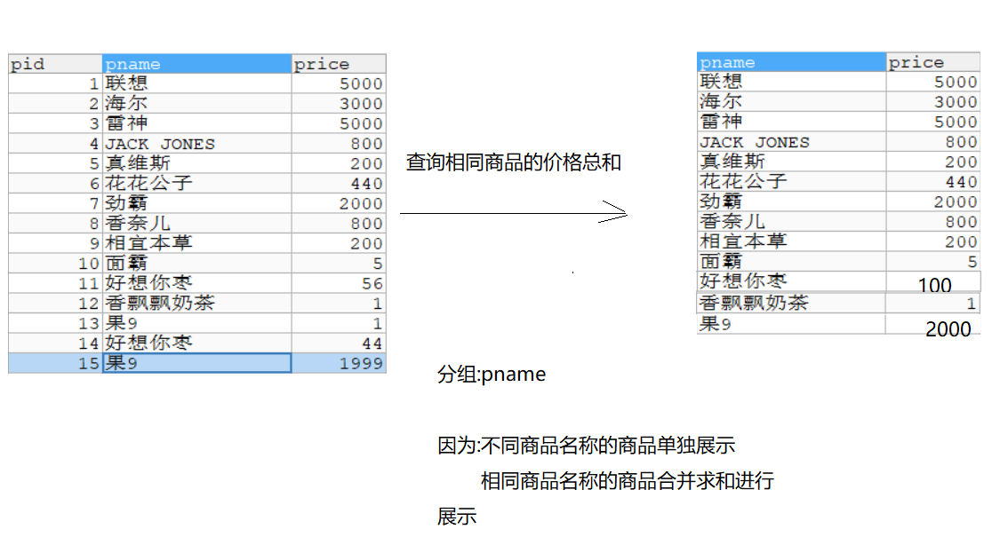

## 5.6.分页查询

```mysql
1.语法:
  select * from 表名 limit m,n
  
2.字母代表啥:
  m:每页的起始位置
  n:每页显示条数
3.小技巧:
  我们将整个表的每一条数据进行编号,从0开始
  
4.每页的起始位置快速算法:
  (当前页-1)*每页显示条数
  
  当前页 -> 第几页
  
5.其他分页参数:
  a.每页的起始位置:
    (当前页-1)*每页显示条数
  b.int curPage = 2; -- 当前页数
  c.int pageSize = 5; -- 每页显示数量
  d.int startRow = (curPage - 1) * pageSize; -- 当前页, 记录开始的位置(行数)计算
  e.int totalSize = select count(*) from products; -- 记录总数量
  f.int totalPage = (totalSize * 1.0 / pageSize),将计算结果向上取整; -- 总页数
                总页数 = (总记录数/每页显示条数)向上取整
-- 第一页
SELECT * FROM product LIMIT 0,5;

-- 第二页
SELECT * FROM product LIMIT 5,5;

-- 第三页
SELECT * FROM product LIMIT 10,5;

-- 第四页
SELECT * FROM product LIMIT 15,5;
```

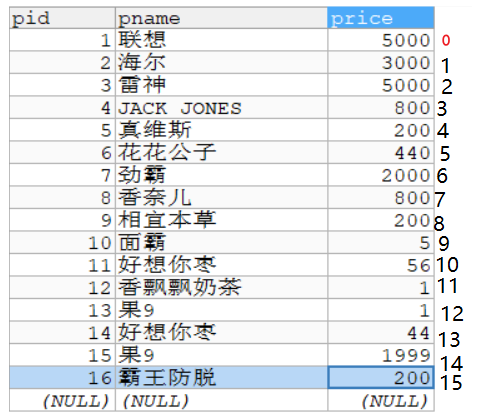

# 6.数据库的备份与还原

## 6.1.用命令去操作数据库的备份与还原

### 6.1.1.命令操作备份

```mysql
mysqldump  -u用户名 -p密码 数据库名>生成的脚本文件路径

生成的脚本文件路径:指定备份的路径,写路径时最后要指明备份的sql文件名,命令后不要加;
```

### 6.1.2.命令操作还原

```mysql
mysql  -uroot  -p密码 数据库名 < 文件路径

注意:我们利用命令备份出来的sql文件中没有单独创建数据库的语句,所以如果利用命令去还原的话,需要我们自己手动先创建对应的库
    命令后不要加;
```

## 6.2.利用点击去操作数据库的备份与还原

### 6.2.1.利用点击去备份

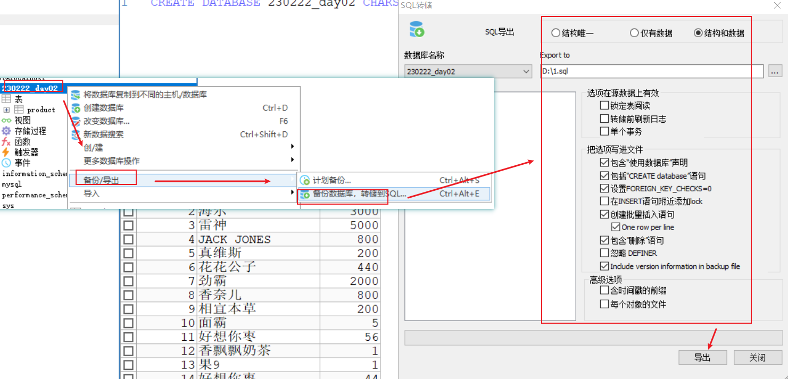

### 6.2.2.利用点击去还原

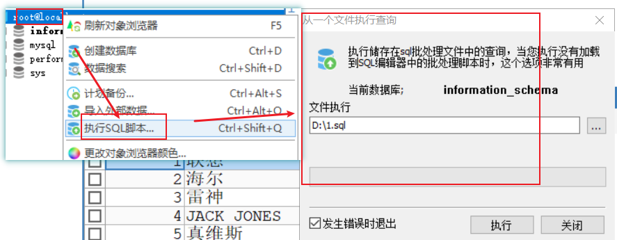

# 7.数据库三范式

```mysql
好的数据库设计对数据的存储性能和后期的程序开发，都会产生重要的影响。建立科学的，规范的数据库就需要满足一些规则来优化数据的设计和存储，这些规则就称为范式。
```

## 7.1.第一范式: **确保每列保持原子性**

第一范（1NF）式是最基本的范式。如果数据库表中的所有字段值都是不可分解的原子值，就说明该数据库表满足了第一范式。

第一范式的合理遵循需要根据系统的实际需求来定。比如某些数据库系统中需要用到“地址”这个属性，本来直接将“地址”属性设计成一个数据库表的字段就行。但是如果系统经常会访问“地址”属性中的“城市”部分，那么就非要将“地址”这个属性重新拆分为省份、城市、详细地址等多个部分进行存储，这样在对地址中某一部分操作的时候将非常方便。这样设计才算满足了数据库的第一范式，如下表所示。

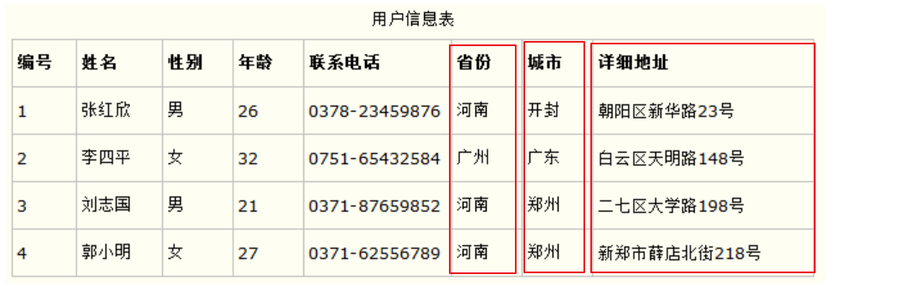

如果不遵守第一范式，查询出数据还需要进一步处理（查询不方便）。遵守第一范式，需要什么字段的数据就查询什么数据（方便查询）

```mysql
列名:详细地址手机号
     
    北京市昌平区北七家镇宏福苑小区19号楼1501087xxxx -> 不行,因为数据可以拆分,不符合第一范式原子性
```

## 7.2.第二范式: **确保表中的每行都能唯一区分**

第二范式（2NF)第二范式（2NF）是在第一范式（1NF）的基础上建立起来的，即满足第二范式（2NF）必须先满足第一范式（1NF）。第二范式（2NF）要求数据库表中的每个实例或行必须可以被惟一的区分。为实现区分通常需要为表加上一个列，以存储各个实例的惟一标识。

## 7.3 .第三范式: **3NF:非主键字段不能相互依赖**

假设有一个员工表，其中包含员工ID（主键）、员工姓名、部门名称和部门负责人。在这里，“部门负责人”依赖于“部门名称”，而“部门名称”又依赖于“员工ID”，因此“部门负责人”传递依赖于“员工ID”。这不符合3NF。需要将部门相关信息拆分到另一个表中，例如一个独立的部门表。

通过逐步满足这三个范式，可以设计出更加规范化、减少冗余和依赖关系的数据库结构，从而提高数据的完整性和查询效率。

```mysql
总结:
  1.一列的数据不能再拆分
  2.每张表要有主键
  3.一张表不要记录多张表的信息
```

# 8.多表之间的关系

在关系数据库管理系统中，很多表之间是有关系的，表之间的关系分为一对一关系、一对多关系和多对多关系。

## 8.1.一对一

该关系中第一个表中的一个行只可以与第二个表中的一个行相关，且第二个表中的一个行也只可以与第一个表中的一个行相关。

例如，“人员信息表”,“身份证表”,一个人只能有一个身份证号,反过来一个身份证号只能对应一个人

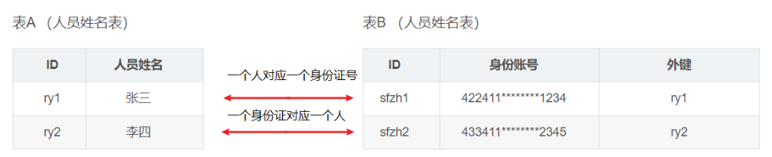

## 8.2.一对多

第一个表中的一个行可以与第二个表中的一个或多个行相关，但第二个表中的一个行只可以与第一个表中的一个行相关。

例如，“商品分类表”和“商品信息表”。一个商品分类对应多个商品,反过来一个商品只属于一个分类,形成了一对多

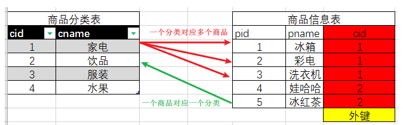

## 8.3.多对多

该关系中第一个表中的一个行可以与第二个表中的一个或多个行相关。第二个表中的一个行也可以与第一个表中的一个或多个行相关。通常两个表的多对多关系会借助第三张表，转换为两个一对多的关系。

例如，选课系统的“学生信息表”和“课程信息表”是多对多关系。一个学生可以选择多门课，一门课程可以被多个学生选择，即“学生信息表”中一条记录可以与“课程信息表”多条记录对应，反过来“课程信息表”的一条记录也可以与“学生信息表”中多条记录对应。它们之间借助第三张“选课信息表”实现关联关系，而“学生信息表”与“选课信息表”是一对多关系，“课程信息表”与“选课信息表”也是一对多关系。“选课信息表”中“学号”字段与“学生信息表”中“学号”字段意义相同。“课程信息表”中“课程编号”字段与“课程信息表”中“课程编号”字段意义相同。

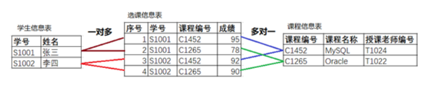

> 1.一对一:
>
>  正着看,反着看都是一对一
>
> 2.一对多:
>
> 正着看一对多,反着看一对一
>
> 3.多对多:
>
> 正着看,反着看都是一对多

# 9.创建外键约束

```mysql
1.为什么在多表之间创建外键约束:
  为了让多表之间的数据有限制,联系起来
2.比如:
  商品分类表和商品信息表
      
  这两张表就需要联系起来,同时里面的数据要限制一下 -> 分类表中没有的分类,你商品表中就不能有额外的商品
      
  如果没有外键约束,这两张表中的数据就随便填了
格式:alter table 从表 add [constraint 外键名称(自定义)] foreign key 从表(外键列名) references 主表(主键列名)
```

## 9.1.一对多的表创建外键约束

```mysql
1.商品分类表和商品信息表啥关系?
  a.一个分类包含了多个商品 -> 一对多
  b.一个商品属于一个分类 -> 一对一
  c.结论:一对多

2.分清主表和从表:看哪张表中的数据限制哪张表
   分类表中的数据限制商品表的数据,不能出现没有的分类对应的商品
   主表:分类表
   从表:商品表

3.默认情况下两张表谁也不会限制谁,如何让主表数据限制从表数据呢?
  建立外键约束

  在从表中添加一列数据,这一列的数据保存的是主表的主键
```

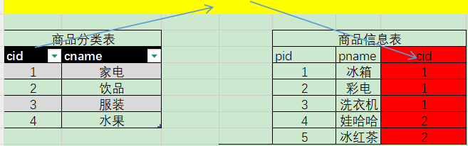

```mysql
    #商品分类表->主表    
    CREATE TABLE category (
      cid VARCHAR(32) PRIMARY KEY ,
      cname VARCHAR(50)
    );

    #商品表->从表
    CREATE TABLE products(
      pid VARCHAR(32) PRIMARY KEY ,
      pname VARCHAR(50),
      price DOUBLE,
      category_id VARCHAR(32)-- 外键  存储的是主表的主键内容
    );              
    
    /*
      格式:alter table 从表 add [constraint 外键名称(自定义)] foreign key 从表(外键列名) references 主表(主键列名)    
    */
    ALTER TABLE products ADD CONSTRAINT cp1 FOREIGN KEY products(category_id) REFERENCES category(cid);
```

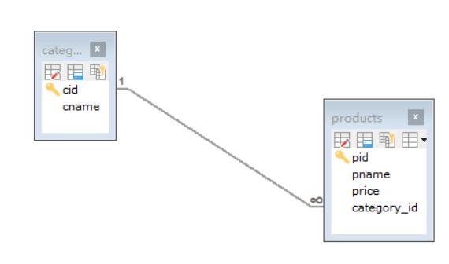

## 9.2.多对多的表创建外键约束

```mysql
1.商品表和订单表啥关系?
   a.一个商品可以对应多个订单
   b.一个订单包含了多少商品
   c.结论:多对多

2.谁是主表,谁是从表?
  都是主表

3.多对多的表之间想要建立外键约束,我们都会创建一个中间表,中间表中存的都是外键数据
   中间表:从表
```

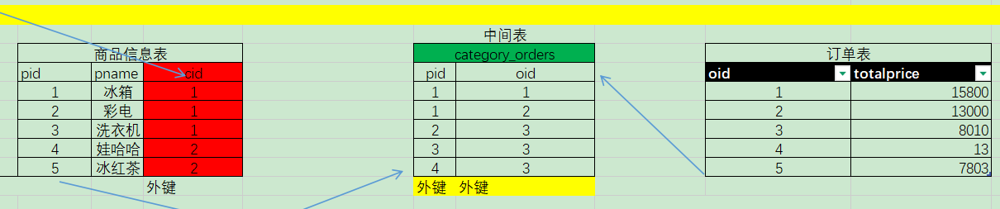

```mysql
# 订单表 -> 主表
 CREATE TABLE `orders`(
  `oid` VARCHAR(32) PRIMARY KEY ,
  `totalprice` DOUBLE 	#总计
  );
   
#订单项表->中间表->从表
CREATE TABLE orderitem(
  pid VARCHAR(50),-- 商品id->外键
  oid VARCHAR(50)-- 订单id ->外键
);

/*
  alter table 从表 add [constraint 外键名称(自定义)] foreign key 从表(外键列名) references 主表(主键列名)
*/
-- 先给products 和 orderitem建立外键约束
ALTER TABLE orderitem ADD CONSTRAINT po1 FOREIGN KEY orderitem(pid) REFERENCES products(pid);

-- 在给orders 和 orderitem建立外键约束
ALTER TABLE orderitem ADD CONSTRAINT oo1 FOREIGN KEY orderitem(oid) REFERENCES orders(oid);
```

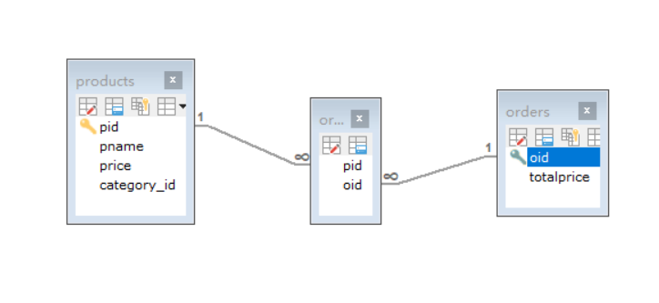

> 在开发的时候,我们不用先建立外键约束,我们该怎么查就怎么查 ,原因是:
>
> 我们写完需求之后,我们需要自己测一遍,我们都会随便找点数据去测代码,如果提前就建立了外键约束了,我们就不能随便找数据去测试了
>
> 所以我们都是开发好之后,再建立外键约束

# 10.多表查询

```mysql
    # 分类表
    CREATE TABLE category (
      cid VARCHAR(32) PRIMARY KEY ,
      cname VARCHAR(50)
    );

    #商品表
    CREATE TABLE products(
      pid VARCHAR(32) PRIMARY KEY ,
      pname VARCHAR(50),
      price DOUBLE,
      flag VARCHAR(2), #是否上架标记为：1表示上架、0表示下架
      category_id VARCHAR(32), -- 外键
      CONSTRAINT products_fk FOREIGN KEY (category_id) REFERENCES category (cid)
    );
    #分类
INSERT INTO category(cid,cname) VALUES('c001','家电');
INSERT INTO category(cid,cname) VALUES('c002','服饰');
INSERT INTO category(cid,cname) VALUES('c003','化妆品');
#商品
INSERT INTO products(pid, pname,price,flag,category_id) VALUES('p001','联想',5000,'1','c001');
INSERT INTO products(pid, pname,price,flag,category_id) VALUES('p002','海尔',3000,'1','c001');
INSERT INTO products(pid, pname,price,flag,category_id) VALUES('p003','雷神',5000,'1','c001');

INSERT INTO products (pid, pname,price,flag,category_id) VALUES('p004','JACK JONES',800,'1','c002');
INSERT INTO products (pid, pname,price,flag,category_id) VALUES('p005','真维斯',200,'1','c002');
INSERT INTO products (pid, pname,price,flag,category_id) VALUES('p006','花花公子',440,'1','c002');
INSERT INTO products (pid, pname,price,flag,category_id) VALUES('p007','劲霸',2000,'1','c002');

INSERT INTO products (pid, pname,price,flag,category_id) VALUES('p008','香奈儿',800,'1','c003');
INSERT INTO products (pid, pname,price,flag,category_id) VALUES('p009','相宜本草',200,'1','c003');
```

## 10.1.交叉查询

```mysql
1.语法:
  select 列名 from 表A,表B
2.注意:
  交叉查询容易出现笛卡尔乘积
-- 查询所有商品信息 -> 交叉查询
SELECT * FROM category,products;


-- 下面的查询方式属于内连接查询
SELECT * FROM category,products WHERE category.cid = products.category_id;

SELECT * FROM category c,products p WHERE c.cid = p.category_id;
```

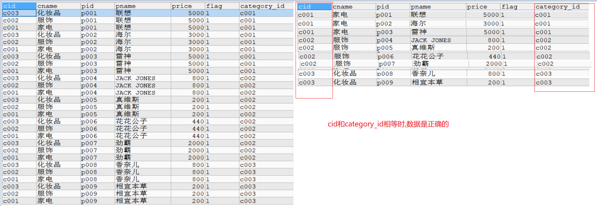

## 10.2.内连接查询

```mysql
1.关键字: inner join on  -> inner可以省略

2.分类:
  a.显式内连接:select 列名 from 表A join 表B on 条件 
  b.隐式内连接:select 列名 from 表A,表B where 条件 

-- 查询具体的商品信息->隐式内连接
SELECT * FROM category c,products p WHERE c.cid = p.category_id;

-- 查询具体的商品信息->显示内连接
SELECT * FROM category c JOIN products p ON c.`cid` = p.`category_id`;

-- 用显示内连接的方式查询"化妆品"的商品信息
-- on是一个小条件  where是一个小条件
SELECT * FROM category c JOIN products p ON c.`cid` = p.`category_id` WHERE cname = '化妆品';

--  on 条件1 and 条件2  条件1和条件2是组成了一个大的条件
SELECT * FROM category c JOIN products p ON c.`cid` = p.`category_id` AND cname = '化妆品';
```

## 10.3.外连接

```mysql
1.关键字:outer join on -> outer可以省略
2.分类:
  a.左外连接: select 列名 from 表A left join 表B on 条件
  b.右外连接: select 列名 from 表A right join 表B on 条件
3.如何区分左表和右表:
  写在join左边的就是左表
  写在join右边的就是右表
  
4.左外连接,有外连接以及内连接的区别:
  a.左外连接:查询的是和右表的交集以及左表其他数据(未交集部分)
  b.右外连接:查询的是和左表的交集以及右表其他数据(未交集部分)
  c.内连接:只查询交集    

-- 查询所有的商品信息 左外连接
SELECT * FROM category c LEFT JOIN products p ON c.`cid` = p.`category_id`;

-- 查询所有的商品信息 右外连接
SELECT * FROM category c RIGHT JOIN products p ON c.`cid` = p.`category_id`;

-- 查询所有的商品信息内连接
SELECT * FROM category c JOIN products p ON c.`cid` = p.`category_id`;
```

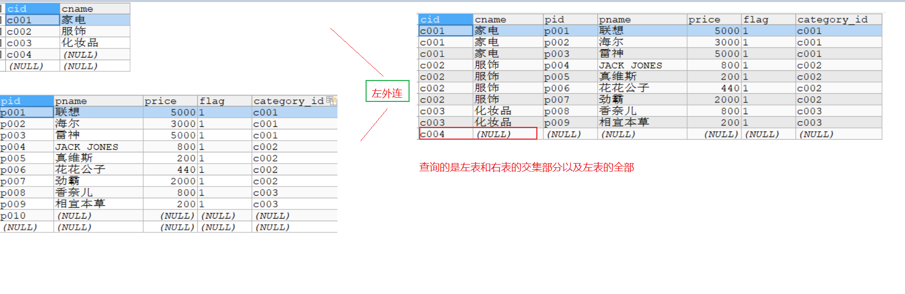 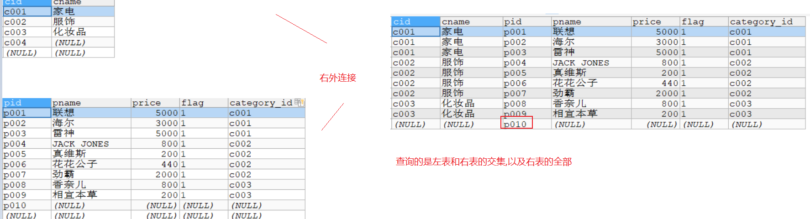 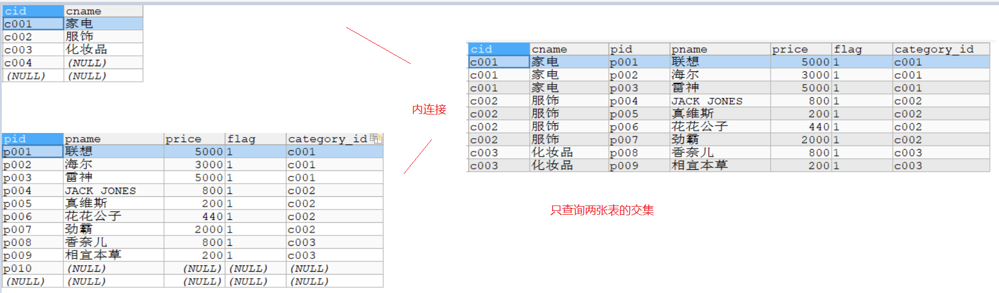

## 10.4.union联合查询实现全外连接查询（了解）

```mysql
首先要明确，联合查询不是多表连接查询的一种方式。联合查询是将多条查询语句的查询结果合并成一个结果并去掉重复数据。
全外连接查询的意思就是将左表和右表的数据都查询出来，然后按照连接条件连接
    
只要将两个结果一连接,左表和右表没有交叉的部分也就都查出来了
1.union的语法:
  查询语句1 union 查询语句2 union 查询语句3 ...
SELECT * FROM category c LEFT JOIN products p ON c.`cid` = p.`category_id`

UNION

SELECT * FROM category c RIGHT JOIN products p ON c.`cid` = p.`category_id`;
```

## 10.5.子查询

```mysql
一条select语句作为另外一条select语句的条件使用

-- 查询products表中'化妆品'的商品信息
SELECT * FROM products WHERE category_id = 'c003';
/*
  我们单纯看products表,我们其实不确定c003就一定是化妆品
  但是后来我们一分析:
     c003是从category表中来的,而且虽然c003我们不确定是不是化妆品
     但是'化妆品'这三个字是确定的
     
  所以,我们可以先通过'化妆品'这三个字查询对应的cid
  然后作为条件使用
*/
SELECT cid FROM category WHERE cname = '化妆品';
SELECT * FROM products WHERE category_id = (SELECT cid FROM category WHERE cname = '化妆品');

-- 查询products表中化妆品和家电的商品信息
select * from products where category_id in ('c001','c003');
SELECT cid FROM category WHERE cname IN ('家电','化妆品');
SELECT * FROM products WHERE category_id IN (SELECT cid FROM category WHERE cname IN ('家电','化妆品'));
```

## 10.6.子查询作为伪表使用

```mysql
1.注意:我们执行完select语句后,会产生一张伪表
       这张伪表也可以和其他表做联查

-- 查询化妆品的所有商品信息
SELECT * FROM category c,products p WHERE c.`cid` = p.`category_id` AND cname = '化妆品';
-- 先查询化妆品
SELECT * FROM category WHERE cname = '化妆品';
SELECT * FROM (SELECT * FROM category WHERE cname = '化妆品') c,products p WHERE c.`cid` = p.`category_id`;

-- 查询所有化妆品和家电的商品信息
SELECT * FROM category WHERE cname IN ('家电','化妆品');
SELECT * FROM (SELECT * FROM category WHERE cname IN ('家电','化妆品')) c,products p WHERE c.`cid` = p.`category_id`
```

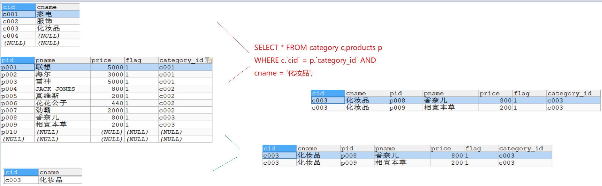

# 11.sql练习

## 11.1.创建数据库

```mysql
CREATE DATABASE mytest01;
USE mytest01;
```

## 11.2.创建表以及添加数据

```mysql
# 创建部门表dept  部门表中包含 部门id 部门名称  
CREATE TABLE dept(
  id INT PRIMARY KEY AUTO_INCREMENT,
  NAME VARCHAR(20)
)

INSERT INTO dept (NAME) VALUES ('开发部'),('市场部'),('财务部');  
# 创建员工表
CREATE TABLE emp (
  id INT PRIMARY KEY AUTO_INCREMENT,
  NAME VARCHAR(10),
  gender CHAR(1),   -- 性别
  salary DOUBLE,   -- 工资
  join_date DATE,  -- 入职日期
  dept_id INT,
  FOREIGN KEY (dept_id) REFERENCES dept(id) -- 外键，关联部门表(部门表的主键)
)  

INSERT INTO emp(NAME,gender,salary,join_date,dept_id) VALUES('小松松','男',7200,'2013-02-24',1);
INSERT INTO emp(NAME,gender,salary,join_date,dept_id) VALUES('鱼小鱼','女',3600,'2015-12-02',2);
INSERT INTO emp(NAME,gender,salary,join_date,dept_id) VALUES('小霈霈','男',8000,'2013-12-02',3);
INSERT INTO emp(NAME,gender,salary,join_date,dept_id) VALUES('亮仔','男',5000,'2017-11-11',2);
INSERT INTO emp(NAME,gender,salary,join_date,dept_id) VALUES('坤仔','男',8000,'2012-02-02',1);
INSERT INTO emp(NAME,gender,salary,join_date,dept_id) VALUES('福姐','女',6500,'2011-09-12',3);
INSERT INTO emp(NAME,gender,salary,join_date,dept_id) VALUES('熊姐','女',10500,'2018-12-02',3);
INSERT INTO emp(NAME,gender,salary,join_date,dept_id) VALUES('猛哥','男',9500,'2016-07-08',2);
INSERT INTO emp(NAME,gender,salary,join_date,dept_id) VALUES('栋栋','男',8500,'2018-06-28',2);
```

## 11.3.练习

```mysql
-- 1.查询员工和部门的名字
SELECT emp.`name`, dept.`name` FROM emp,dept WHERE emp.`dept_id` = dept.`id`;
-- 2.查询鱼小鱼的信息，显示员工id，姓名，性别，工资和所在的部门名称(使用显式内连接)
SELECT * FROM emp e INNER JOIN dept d ON e.`dept_id` = d.`id` WHERE e.`name`='鱼小鱼';
-- 3.将上面查到的内容 表头使用别名的形式展示 比如显示id为员工id  name为姓名 等
SELECT e.id 编号,e.name 姓名,e.gender 性别,e.salary 工资,d.name 部门名字 FROM emp e INNER JOIN dept d ON e.dept_id = d.id WHERE e.name='鱼小鱼';
-- 4.在部门表中增加一个销售部 
INSERT INTO dept (NAME) VALUES ('销售部');
SELECT * FROM dept;
-- 5.查询所有的部门信息关联查询出该部门中的所有员工信息 
SELECT * FROM dept d LEFT JOIN emp e ON d.`id` = e.`dept_id`;
-- 6.查询所有的部门信息关联查询出该部门中的所有员工的名字  部门 以及 工资 
SELECT e.name 姓名,d.name 部门, e.salary 工资 FROM dept d LEFT JOIN emp e ON d.id = e.dept_id;
-- 7.统计出 每个部门的员工人数   查询显示 部门名称 人数 
SELECT d.name 部门,COUNT(e.name) 人数 FROM dept d LEFT JOIN emp e ON d.id = e.dept_id GROUP BY d.name;
-- 8.统计出 每个部门员工 平均薪资 按照 薪资排序 查询显示 部门名称 平均薪资 
SELECT d.name 部门,AVG(e.salary) `平均薪资` FROM dept d LEFT JOIN emp e ON d.id = e.dept_id GROUP BY d.name ORDER BY salary;
-- 9.统计出，每个部门的平均薪资 按照薪资排序 并且筛选出平均薪资>7000的部门
SELECT d.name 部门,AVG(e.salary) 人数 FROM dept d LEFT JOIN emp e ON d.id = e.dept_id 
GROUP BY d.name HAVING AVG(e.salary)>7000 ORDER BY salary;
-- 10.查询最高工资是多少
SELECT MAX(salary) FROM emp;
-- 11.根据最高工资到员工表查询到对应的员工信息
SELECT * FROM emp WHERE salary=(SELECT MAX(salary) FROM emp)
-- 12.查询工资小于平均工资的员工有哪些
SELECT * FROM emp WHERE salary < (SELECT AVG(salary) FROM emp);
-- 13.查询工资大于5000的员工，来自于哪些部门的名字  
 SELECT dept.name FROM dept WHERE dept.id IN (SELECT dept_id FROM emp WHERE salary > 5000
-- 14.查询开发部与财务部所有的员工信息
SELECT * FROM emp WHERE dept_id IN (SELECT id FROM dept WHERE NAME IN('开发部','财务部'));
-- 15.查询出2011年以后入职的员工信息，包括部门名称
SELECT * FROM dept d, (SELECT * FROM emp WHERE join_date > '2011-1-1') e WHERE e.dept_id = d.id;
```

# 12.MySQL的常用函数

```mysql
函数都是纵向查询,用在select后面
```

## 12.1.字符串函数

### 12.1.1 字符串函数列表概览

| 函数                             | 用法                                          |
| -------------------------------- | --------------------------------------------- |
| CONCAT(S1,S2,…,Sn)               | 连接S1,S2,…,Sn为一个字符串                    |
| CONCAT_WS(separator, S1,S2,…,Sn) | 连接S1一直到Sn，并且中间以separator作为分隔符 |
| UPPER(s) 或 UCASE(s)             | 将字符串s的所有字母转成大写字母               |
| LOWER(s) 或LCASE(s)              | 将字符串s的所有字母转成小写字母               |
| TRIM(s)                          | 去掉字符串s开始与结尾的空格                   |
| SUBSTRING(s,index,len)           | 返回从字符串s的index位置其len个字符           |

### 12.1.2 环境准备

```mysql
-- 用户表
CREATE TABLE t_user (
  id int(11) NOT NULL AUTO_INCREMENT,
  uname varchar(40) DEFAULT NULL,
  age int(11) DEFAULT NULL,
  sex int(11) DEFAULT NULL,
  PRIMARY KEY (id)
);
insert  into t_user values (null,'zs',18,1);
insert  into t_user values (null,'ls',20,0);
insert  into t_user values (null,'ww',23,1);
insert  into t_user values (null,'zl',24,1);
insert  into t_user values (null,'lq',15,0);
insert  into t_user values (null,'hh',12,0);
insert  into t_user values (null,'wzx',60,null);
insert  into t_user values (null,'lb',null,null);
```

### 12.1.3 字符串连接函数

字符串连接函数主要有2个：

| 函数或操作符                        | 描述                                     |
| ----------------------------------- | ---------------------------------------- |
| concat(str1, str2, …)               | 字符串连接函数，可以将多个字符串进行连接 |
| concat_ws(separator, str1, str2, …) | 可以指定间隔符将多个字符串进行连接；     |

练习1：使用concat函数显示出 你好uname 的结果

```mysql
/*
  concat(str1, str2, ...)
  字符串连接函数，可以将多个字符串进行连接
  
  concat_ws(separator, str1, str2, ...)->可以指定间隔符将多个字符串进行连接
*/
-- 拼接字符串练习 练习1：使用concat函数显示出 你好uname 的结果
SELECT CONCAT('你好',uname),age,sex FROM t_user;
```

练习2：使用concat_ws函数显示出 你好,uname 的结果

```mysql
-- 练习2：使用concat_ws函数显示出 你好,uname 的结果
SELECT CONCAT_WS(',','你好',uname) uname,age,sex FROM t_user;
```

### 12.1.4 字符串大小写处理函数

字符串大小写处理函数主要有2个：

| 函数或操作符 | 描述              |
| ------------ | ----------------- |
| upper(str)   | 得到str的大写形式 |
| lower(str)   | 得到str的小写形式 |

练习1： 将字符串 uname 转换为大写显示

```mysql
-- 将hello转成大写
SELECT UPPER('hello');

-- 查询t_user,uname变成大写
SELECT UPPER(uname) uname,age,sex FROM t_user;
```

练习2：将uname 转换为小写显示

```mysql
-- 查询t_user,uname变成小写
SELECT LOWER(uname) uname,age,sex FROM t_user;
```

### 12.1.5 移除空格函数

可以对字符串进行按长度填充满、也可以移除空格符

| 函数或操作符 | 描述                  |
| ------------ | --------------------- |
| trim(str)    | 将str两边的空白符移除 |

练习1： 将用户id为9的用户的姓名的两边空白符移除

```mysql
-- 将用户id为9的用户的姓名的两边空白符移除
SELECT TRIM(uname) uname,age ,sex FROM t_user WHERE id = 9;
```

### 12.1.6 子串函数

字符串也可以按条件进行截取，主要有以下可以截取子串的函数;

| 函数或操作符          | 描述                                                         |
| --------------------- | ------------------------------------------------------------ |
| substr()、substring() | 获取子串： 1：substr(str, pos) 、substring(str, pos)； 2：substr(str, pos, len)、substring(str, pos, len) |

```mysql
/*
  substring(str, pos)
            str:被截取的字符串
            pos:从第几个字符开始截取
  substring(str, pos, len)
            str:被截取的字符串
            pos:从第几个字符开始截取
            len:截取多少个
*/
SELECT SUBSTRING('abcdefg',2);

SELECT SUBSTRING('abcdefg',2,2);
```

练习1：获取 hello,world 从第二个字符开始的完整子串

```mysql
SELECT SUBSTRING('hello,world',2);
```

练习2：获取 hello,world 从第二个字符开始但是长度为4的子串

```mysql
SELECT SUBSTRING('hello,world',2,4);
```

## 12.2.数值函数

### 12.2.1. 数值函数列表

| 函数     | 用法                           |
| -------- | ------------------------------ |
| ABS(x)   | 返回x的绝对值                  |
| CEIL(x)  | 返回大于x的最小整数值 向上取整 |
| FLOOR(x) | 返回小于x的最大整数值 向下取整 |
| RAND()   | 返回0~1的随机值                |
| POW(x,y) | 返回x的y次方                   |

### 12.2.2. 常用数值函数练习

```mysql
-- 练习1： 获取 -12 的绝对值
SELECT ABS(-12);

-- 练习2： 将 -11.2 向上取整
SELECT CEIL(-11.2);

-- 练习3： 将 1.6 向下取整
SELECT FLOOR(1.6);

-- 练习4： 获得2的2次幂的值
SELECT POW(2,2);

-- 练习5： 获得一个在0-100之间的随机数
SELECT RAND()*100;
```

## 12.3.日期函数

### 12.3.1 日期函数列表

| 函数                                                         | 用法                                                      |
| ------------------------------------------------------------ | --------------------------------------------------------- |
| **CURDATE()** 或 CURRENT_DATE()                              | 返回当前日期 年月日                                       |
| **CURTIME()** 或 CURRENT_TIME()                              | 返回当前时间 时分秒                                       |
| **NOW()** / SYSDATE() / CURRENT_TIMESTAMP() / LOCALTIME() / LOCALTIMESTAMP() | 返回当前系统日期时间                                      |
| DATEDIFF(date1,date2) / TIMEDIFF(time1, time2)               | 返回date1 - date2的日期间隔 / 返回time1 - time2的时间间隔 |

### 12.3.2 常用日期函数的练习

```mysql
-- 练习1：获取当前的日期(仅仅需要年月日)
SELECT CURDATE();

-- 练习2： 获取当前的时间（仅仅需要时分秒）
SELECT CURTIME();

-- 练习3： 获取当前日期时间（包含年月日时分秒）
SELECT NOW();

-- 练习4: 获取到10月1日还有多少天
SELECT DATEDIFF('2026-10-1',NOW());
```

## 12.4.流程函数_判断

| 函数                                                         | 用法                                                       |
| ------------------------------------------------------------ | ---------------------------------------------------------- |
| IF(比较,t ,f) 里面的t和f是两个结果                           | 如果比较是真，返回t，否则返回f                             |
| IFNULL(value1, value2)                                       | 如果value1不为空，返回value1，否则返回value2               |
| CASE WHEN 条件1 THEN result1 WHEN 条件2 THEN result2 … [ELSE resultn] END | 相当于Java的if…else if…else… 相当于python中的if…elif…else… |

练习1：获取用户的姓名、性别，如果性别为1则显示’男’，否则显示’女’；要求使用if函数查询：

```mysql
SELECT uname,age,IF(sex=1,'男','女') sex FROM t_user;
```

练习2：获取用户的姓名、性别，如果性别为null则显示为0；要求使用ifnull函数查询：

```mysql
SELECT uname,age,IFNULL(sex,0) sex FROM t_user;
```

练习3：如果age<=12,显示儿童,如果age<=18,显示少年,如果age<=40,显示中年,否则显示老年

```mysql
SELECT 
  uname,
  CASE
    WHEN age <= 12 
    THEN '儿童' 
    WHEN age <= 18 
    THEN '少年' 
    WHEN age <= 40 
    THEN '中年' 
    ELSE '老年' 
  END age 
FROM
  t_user ;
```

# 13.DCL语句

我们现在默认使用的都是root用户，超级管理员，拥有全部的权限。但是，一个公司里面的数据库服务器上面可能同时运行着很多个项目的数据库。所以，我们应该根据不同的项目建立不同的用户，分配不同的权限来管理和维护数据库。

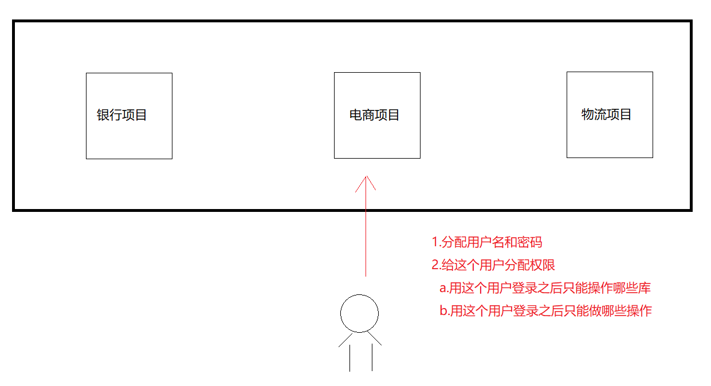

## 13.1 创建用户

```mysql
CREATE USER '用户名'@'主机名' IDENTIFIED BY '密码';
```

**关键字说明：**

```mysql
1.用户名:创建的用户名
2.主机名:指定该用户在哪个主机上可以登录,如果是本地用户,可以用'localhost',如果想让该用户可以任意远程主机登录,可以使用通配符%
3.密码:该用户登录的密码,密码可以为空,如果为空,该用户可以不输入密码就可以登录mysql
```

**具体操作：**

```mysql
-- user1用户只能在localhost这个IP登录mysql服务器
CREATE USER 'user1'@'localhost' IDENTIFIED BY '123';
-- user2用户可以在任何电脑上登录mysql服务器
CREATE USER 'user2'@'%' IDENTIFIED BY '123';
```

## 13.2 授权用户

用户创建之后，基本没什么权限！需要给用户授权

**授权格式**：

```mysql
GRANT 权限1, 权限2... ON 数据库名.表名 TO '用户名'@'主机名';
```

**关键字说明**：

```mysql
a.GRANT:授权关键字
b.授予用户的权限,比如  'select' 'insert' 'update'等,如果要授予所有的权限,使用 'ALL'
c.数据库名.表名:该用户操作哪个数据库的哪些表,如果要授予该用户对所有数据库和表的相关操作权限,就可以用*表示: *.*
d.'用户名'@'主机名':给哪个用户分配权限
```

**具体操作：**

给user1用户分配对test这个数据库操作的权限

```mysql
GRANT CREATE,ALTER,DROP,INSERT,UPDATE,DELETE,SELECT ON test.* TO 'user1'@'localhost';
```

给user2用户分配对所有数据库操作的权限

```mysql
GRANT ALL ON *.* TO 'user2'@'%';
```

## 13.3 撤销授权

```mysql
REVOKE  权限1, 权限2... ON 数据库.表名 FROM '用户名'@'主机名';
```

**具体操作：**

撤销user1用户对test操作的权限

```mysql
REVOKE ALL ON test.* FROM 'user1'@'localhost';
```

## 13.4 查看权限

```mysql
SHOW GRANTS FOR '用户名'@'主机名';
```

**具体操作：**

查看user1用户的权限

```mysql
SHOW GRANTS FOR 'user1'@'localhost';
```

## 13.5 删除用户

```mysql
DROP USER '用户名'@'主机名';
```

**具体操作：**

删除user2

```mysql
 DROP USER 'user2'@'%';
```

```mysql
/*
  分配用户:
    create:创建
    user:用户
    'user1'@'localhost' : 用户名以及可以访问的主机地址
    IDENTIFIED BY '123' : 分配密码
    
    %:可以在任意远程主机上登录
*/
-- user1用户只能在localhost这个IP登录mysql服务器
CREATE USER 'user1'@'localhost' IDENTIFIED BY '123';
-- user2用户可以在任何电脑上登录mysql服务器
CREATE USER 'user2'@'%' IDENTIFIED BY '123';


/*
   grant:分配权限关键字
   grant后面跟的就是具体的操作权限:select insert update等,如果分配所有权限就写ALL
   
   on:后面跟的是数据库名字 -> 指定啥数据库那么用此用户登录就只能看到哪个数据库名字
   
   `220706_mysql03`.* -> 指定库中所有的表 * 代表所有,如果想要看到所有的库以及所有的表我们就写*.*
   
   to:指明此权限要给的用户
*/
-- 给用户1分配权限
GRANT SELECT ON `230222_day02_2`.* TO 'user1'@'localhost';

-- 给用户2分配权限
GRANT ALL ON *.* TO 'user2'@'%';

/*
  drop:删除用户关键字
*/
DROP USER 'user2'@'%';
DROP USER 'user1'@'localhost';
```

## 13.6 修改用户密码

### 13.6.1 修改管理员密码

```mysql
mysqladmin -uroot -p password 新密码  -- 新密码不需要加上引号
```

> 注意：需要在未登陆MySQL的情况下操作。

**具体操作：**

```mysql
mysqladmin -uroot -p password root
输入老密码
```

### 13.6.2 修改普通用户密码

```mysql
set password for '用户名'@'主机名' = password('新密码');
```

> 注意：需要在登陆MySQL的情况下操作。

**具体操作：**

```mysql
set password for 'user1'@'localhost' = password('666666');
```

# 14.事务

## 14.1.事务

### 14.1.1.事务_转账分析图

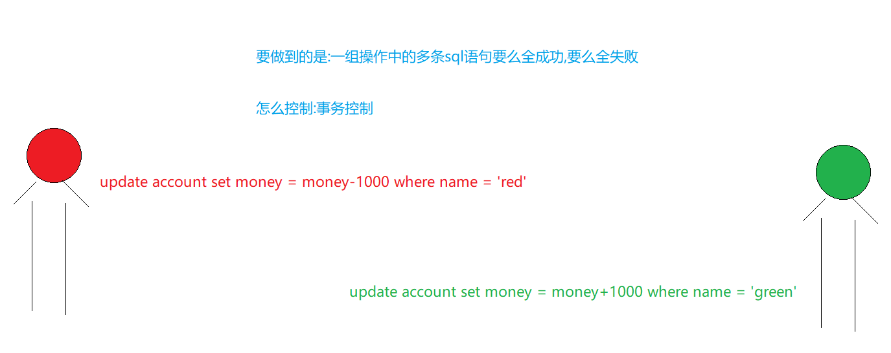

```mysql
CREATE TABLE account(
  `name` VARCHAR(10),
  money INT
);
```

### 14.1.2.事务的介绍

```mysql
1.概述:事务用来管理一组操作的(多条sql语句),使其要么全执行成功,要么全执行失败,但是mysql是自带事务的,mysql自带的事务一次只能管理一条sql语句,所以我们如果想让事务管理多条sql语句,我们需要关闭mysql自带事务,开启手动事务
     
2.具体操作:
  a.开启事务:begin
  b.提交事务:commit   -> 事务一旦提交,数据永久保存,不能退回,也回滚不了
  c.回滚事务:rollback -> 将数据还原到上一次的状态
```

### 14.1.3.mysql中操作事务_了解

```mysql
a.开启事务:begin
b.提交事务:commit   -> 事务一旦提交,数据永久保存,不能退回,也回滚不了
c.回滚事务:rollback -> 将数据还原到上一次的状态
-- 开启事务
BEGIN;

UPDATE account SET money = money-1000 WHERE `name` = 'rose';

UPDATE account SET money = money+1000 WHERE `name` = 'jack';

-- 提交事务
COMMIT;

-- 回滚事务
ROLLBACK;
```

## 14.2.事务的特性以及隔离级别

### 14.2.1.事务特性：ACID

- 原子性（Atomicity）原子性是指事务是一个不可分割的工作单位，事务中的操作要么都发生，要么都不发生。
- 一致性（Consistency）事务前后数据的完整性必须保持一致。
- 隔离性（Isolation）事务的隔离性是指多个用户并发访问数据库时，一个用户的事务不能被其它用户的事务所干扰，多个并发事务之间数据要相互隔离,正常情况下数据库是做不到这一点的,可以设置隔离级别,但是效率会非常低。
- 持久性（Durability）持久性是指一个事务一旦被提交，它对数据库中数据的改变就是永久性的，接下来即使数据库发生故障也不应该对其有任何影响。

### 14.2.2 并发访问问题

如果不考虑隔离性，事务存在3种并发访问问题。

1. 脏读：读到了别人「没提交、还能撤回」的脏数据

   ```mysql
   事务 A：给你转 100，先扣了自己的钱，还没点确认
   事务 B：这时候查账，看到钱到账了
   结果事务 A 反悔了，撤回操作
   → 事务 B 白高兴一场，读到了假数据
   ```

2. 不可重复读：一个事务读到了另一个事务已经提交(update)的数据。引发另一个事务，在事务中的多次查询结果不一致。

   ```mysql
   你查余额：1000（事务没结束）
   别人立刻转走 500 并提交
   你再查一遍：500
   → 同一个事务里，数据变了，业务逻辑会出错
   ```

3. 虚读 /幻读：一个事务读到了另一个事务已经提交(insert)的数据。导致另一个事务，在事务中多次查询的结果不一致。

   ```mysql
   你统计：总共有 10 个订单
   别人立刻新增 1 个订单并提交
   你再统计：11 个订单
   → 莫名其妙多了数据
   ```

### 14.2.3 隔离级别：解决问题

- 数据库规范规定了4种隔离级别，分别用于描述两个事务并发的所有情况。

1. **read uncommitted** 读未提交，一个事务读到另一个事务没有提交的数据。

   a)存在：3个问题（脏读、不可重复读、虚读）。

   b)解决：0个问题

2. **read committed** 读已提交，一个事务读到另一个事务已经提交的数据。

   a)存在：2个问题（不可重复读、虚读）。

   b)解决：1个问题（脏读）

3. **repeatable read**:可重复读，在一个事务中读到的数据始终保持一致，无论另一个事务是否提交。

   a)存在：1个问题（虚读）。

   b)解决：2个问题（脏读、不可重复读）

   4.**serializable 串行化**，同时只能执行一个事务，相当于事务中的单线程。

a)存在：0个问题。

b)解决：3个问题（脏读、不可重复读、虚读）

- 安全和性能对比
  - 安全性：`serializable > repeatable read > read committed > read uncommitted`
  - 性能 ： `serializable < repeatable read < read committed < read uncommitted`
- 常见数据库的默认隔离级别：
  - MySql：`repeatable read`
  - Oracle：`read committed`

### 14.2.4 演示

- 隔离级别演示参考：资料/隔离级别操作过程.doc【增强内容,了解】
- 查询数据库的隔离级别

```mysql
show variables like '%isolation%';
或
select @@tx_isolation;
```

- 设置数据库的隔离级别
  - `set session transactionisolation level` 级别字符串
  - 级别字符串：`readuncommitted`、`read committed`、`repeatable read`、`serializable`
  - 例如：`set session transaction isolation level read uncommitted;`
- 读未提交：readuncommitted
  - A窗口设置隔离级别
    - AB同时开始事务
    - A 查询
    - B 更新，但不提交
    - A 再查询？-- 查询到了未提交的数据
    - B 回滚
    - A 再查询？-- 查询到事务开始前数据
- 读已提交：read committed
  - A窗口设置隔离级别
    - AB同时开启事务
    - A查询
    - B更新、但不提交
    - A再查询？–数据不变，解决问题【脏读】
    - B提交
    - A再查询？–数据改变，存在问题【不可重复读】
- 可重复读：repeatable read
  - A窗口设置隔离级别
    - AB 同时开启事务
    - A查询
    - B更新， 但不提交
    - A再查询？–数据不变，解决问题【脏读】
    - B提交
    - A再查询？–数据不变，解决问题【不可重复读】
    - A提交或回滚
    - A再查询？–数据改变，另一个事务
- 串行化：serializable
  - A窗口设置隔离级别
  - AB同时开启事务
  - A查询
    - B更新？–等待(如果A没有进一步操作，B将等待超时)
    - A回滚
    - B 窗口？–等待结束，可以进行操作

```mysql
- 原子性（Atomicity）原子性是指事务是一个不可分割的工作单位，事务中的操作要么都发生，要么都不发生。 
- 一致性（Consistency）事务前后数据的完整性必须保持一致。
- 隔离性（Isolation）事务的隔离性是指多个用户并发访问数据库时，一个用户的事务不能被其它用户的事务所干扰，多个并发事务之间数据要相互隔离,正常情况下数据库是做不到这一点的,可以设置隔离级别,但是隔离级别越高,效率会非常低。
- 持久性（Durability）持久性是指一个事务一旦被提交，它对数据库中数据的改变就是永久性的，接下来即使数据库发生故障也不应该对其有任何影响。
如果不考虑隔离性，事务存在3中并发访问问题。(如果隔离级别低,事务跟事务之间有可能互相影响)

1. 脏读：一个事务读到了另一个事务未提交的数据.
2. 不可重复读：一个事务读到了另一个事务已经提交(update)的数据。引发另一个事务，在事务中的多次查询结果不一致。
3. 虚读 /幻读：一个事务读到了另一个事务已经提交(insert)的数据。导致另一个事务，在事务中多次查询的结果不一致。
总结:
  我们最理想的状态是:一个事务和其他事务互不影响
  
  但是如果不考虑隔离级别的话,就会出现多个事务之间互相影响
  
  而事务互相影响的表现方式为:
    脏读
    不可重复读
    虚读/幻读
```

# 15.python操作mysql

## 15.1.安装依赖包

```mysql
pip install pymysql
```

## 15.2.创建表

```mysql
CREATE TABLE `user`(
  uid INT PRIMARY KEY AUTO_INCREMENT,
  username VARCHAR(10),
  `password` VARCHAR(20) 
);
```

## 15.3.实现

```mysql
1.创建连接,连接数据库
2.创建游标,用于执行sql语句
3.准备sql
4.执行sql    
5.获取结果
6.关闭资源
```

### 15.3.1.添加功能

```python
def insert_data():
    #1.创建连接,连接数据库
    conn = pymysql.connect(
        host="localhost", # 主机地址
        port=3306, #mysql的端口号
        user="root", #mysql用户名
        password="root", #mysql密码
        database="bj260528_3", #数据库名称
        charset="utf8", #字符集
        cursorclass=pymysql.cursors.DictCursor #将查询的结果转化为字典
    )
    #2.创建游标(用于执行sql)
    cursor = conn.cursor()

    #3.准备sql语句
    sql = "insert into user (username,password) values (%s,%s)"

    #4.执行sql语句
    cursor.execute(sql,("tom","111"))

    #提交事务
    conn.commit()

    #5.关闭资源
    cursor.close()
    conn.close()


if __name__ == '__main__':
    insert_data()
```

### 15.3.2.修改功能

```python
def update_data():
    #1.创建连接,连接数据库
    conn = pymysql.connect(
        host="localhost", # 主机地址
        port=3306, #mysql的端口号
        user="root", #mysql用户名
        password="root", #mysql密码
        database="bj260528_3", #数据库名称
        charset="utf8", #字符集
        cursorclass=pymysql.cursors.DictCursor #将查询的结果转化为字典
    )
    #2.创建游标(用于执行sql)
    cursor = conn.cursor()

    #3.准备sql语句
    sql = "update user set password = %s where uid = %s"

    #4.执行sql语句
    cursor.execute(sql,("123",1))

    #提交事务
    conn.commit()

    #5.关闭资源
    cursor.close()
    conn.close()


if __name__ == '__main__':
    update_data()
```

### 15.3.3.删除功能

```python
def delete_data():
    #1.创建连接,连接数据库
    conn = pymysql.connect(
        host="localhost", # 主机地址
        port=3306, #mysql的端口号
        user="root", #mysql用户名
        password="root", #mysql密码
        database="bj260528_3", #数据库名称
        charset="utf8", #字符集
        cursorclass=pymysql.cursors.DictCursor #将查询的结果转化为字典
    )
    #2.创建游标(用于执行sql)
    cursor = conn.cursor()

    #3.准备sql语句
    sql = "delete from user where uid = %s"

    #4.执行sql语句
    cursor.execute(sql,(1,))

    #提交事务
    conn.commit()

    #5.关闭资源
    cursor.close()
    conn.close()


if __name__ == '__main__':
    delete_data()
```

### 15.3.4.查询功能

```python
import pymysql
def select_data():
    #1.创建连接,连接数据库
    conn = pymysql.connect(
        host="localhost", # 主机地址
        port=3306, #mysql的端口号
        user="root", #mysql用户名
        password="root", #mysql密码
        database="bj260528_3", #数据库名称
        charset="utf8", #字符集
        cursorclass=pymysql.cursors.DictCursor #将查询的结果转化为字典
    )
    #2.创建游标(用于执行sql)
    cursor = conn.cursor()

    #3.准备sql语句
    sql = "select * from user"

    #4.执行sql语句
    cursor.execute(sql)

    result = cursor.fetchall()
    for item in result:
        print(item.get("uid"),item.get("username"),item.get("password"))

    #提交事务
    conn.commit()

    #5.关闭资源
    cursor.close()
    conn.close()

if __name__ == '__main__':
    select_data()
```

# 16.ubuntu安装mysql

## 16.1.卸载mysql(之前没装过,可以跳过)

```shell
1.停止mysql服务
sudo systemctl stop mysql

2.卸载 MySQL 服务器软件包
sudo apt-get remove --purge mysql-server mysql-client mysql-common mysql-server-core-* mysql-client-core-*

3.删除mysql相关配置文件
sudo rm -rf /etc/mysql /var/lib/mysql
sudo rm -rf /var/log/mysql
sudo rm -rf /var/log/mysql.*
sudo rm -rf /var/run/mysqld

4.清理残留文件和目录
  在卸载 MySQL 服务器后，可能仍然存在一些残留的文件和目录。使用以下命令来清理这些残留文件和目录。autoremove 命令将自动删除不再需要的依赖项，autoclean 命令将清理下载的软件包缓存
  
sudo apt autoremove
sudo apt autoclean
```

## 16.2.安装mysql

### 16.2.1.下载mysql

```shell
下载官网:https://www.mysql.com/downloads/

下载mysql的安装配置文件->在安装mysql之前可以通过它做一些配置
```

 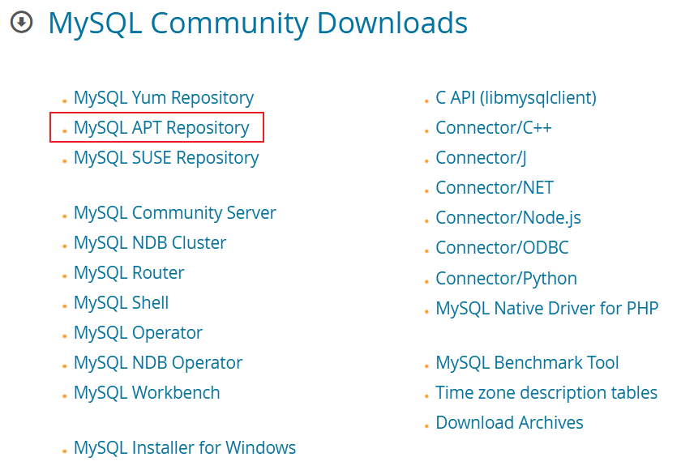 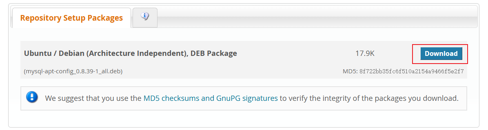 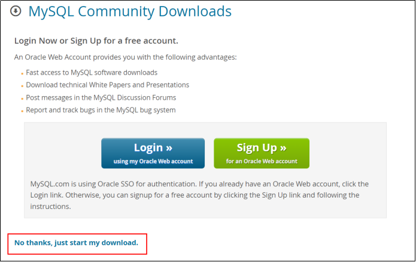

### 16.2.2.查看系统版本(可以跳过)

```shell
lining@ubuntu-1:~$ lsb_release -a
```

### 16.2.3.安装rz上传工具(可以跳过)

```shell
sudo apt install lrzsz
```

### 16.2.4.将安装文件上传到/opt/software目录下

```shell
cd /opt

sudo mkdir software  #安装软件的路径
sudo chown -R lining:lining software/

cd software

将mysql的apt文件上传到software下
```

### 16.2.5.执行安装命令

```shell
sudo dpkg -i mysql-apt-config_0.8.36-1_all.deb

================================================
如果出现 ->
dpkg: 错误: dpkg 前端锁 已被另一个 pid 为 6216 的进程加锁
注意：删除锁文件的操作是错误的，这样操作会损坏上锁的部分甚至损坏
个系统。

直接执行: sudo kill -9 6216
```

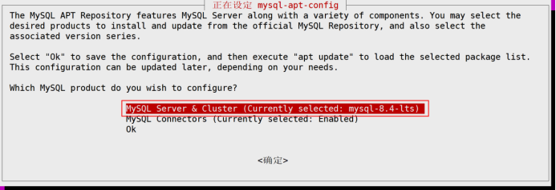 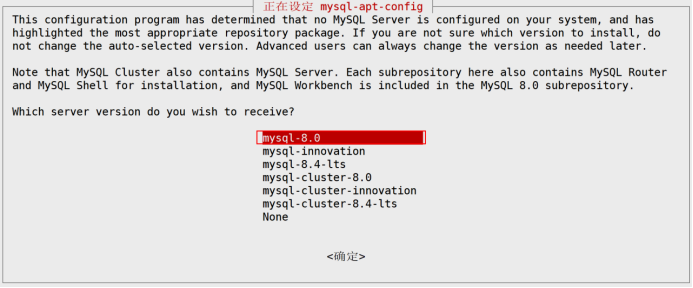 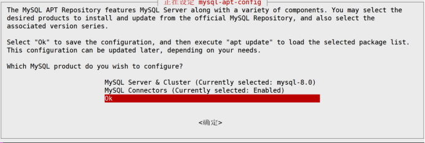

### 16.2.6.从mysql apt源更新包信息

```
sudo apt update
```

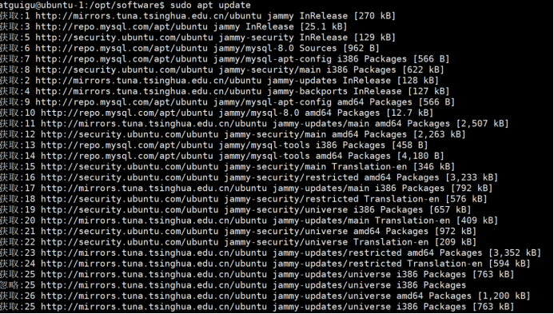

### 16.2.7.执行安装命令

```shell
sudo apt install mysql-server
```

### 16.2.8.中途设置root用户密码


### 16.2.9.安装成功提示

```shell
1.出现Use Strong Password Encryption (RECOMMENDED)直接选ok就行  -> 强密码
2.最后出现done表示自己安装成功
```

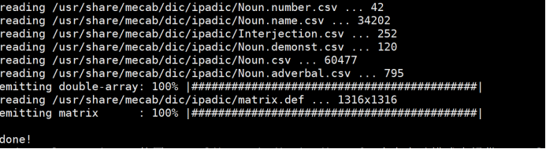

### 16.2.10.查看mysql状态

> 安装完成后MySQL服务会⾃动启动

```shell
查看状态:sudo systemctl status mysql
设置开机自启：sudo systemctl enable mysql
```

### 16.2.11.授权其他用户客户端服务器的权限

> 我们需要利用windows下安装的客户端连接linux中的mysql
>
> 所以我们需要给windows下的客户端授权

```shell
mysql -uroot -proot   #登录mysql

select host,user from mysql.user;

update mysql.user set host='%' where user='root';

flush privileges;#刷新,让以上操作生效
```

## 16.3.客户端连接linux中的mysql

### 16.3.1.连接linux中的mysql

```shell
如果在安装的时候选择了"强密码":
  Use Strong Password Encryption (RECOMMENDED)
  
第一次连接就会出现一下问题  
```

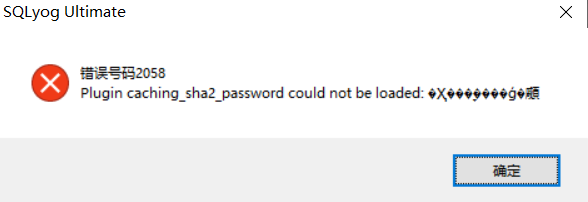

```shell
1.在linux中登录mysql
2.执行:
  ALTER USER 'root'@'%' IDENTIFIED WITH mysql_native_password BY '你的密码';
```

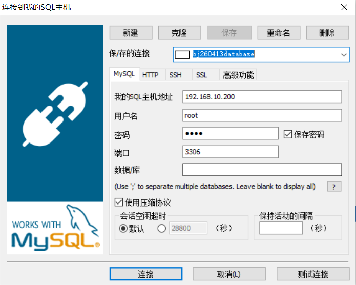

### 16.3.2.python代码测试linux中的mysql

```python
import pymysql
def select_data():
    #1.创建连接,连接数据库
    conn = pymysql.connect(
        host="192.168.10.100", # 主机地址
        port=3306, #mysql的端口号
        user="root", #mysql用户名
        password="root", #mysql密码
        database="bj260528", #数据库名称
        charset="utf8", #字符集
        cursorclass=pymysql.cursors.DictCursor #将查询的结果转化为字典
    )
    #2.创建游标(用于执行sql)
    cursor = conn.cursor()

    #3.准备sql语句
    sql = "select * from user"

    #4.执行sql语句
    cursor.execute(sql)

    result = cursor.fetchall()
    for item in result:
        print(item.get("uid"),item.get("username"),item.get("password"))

    #提交事务  -> 查询操作不需要操作事务
    conn.commit()

    #5.关闭资源
    cursor.close()
    conn.close()


if __name__ == '__main__':
    select_data()
```