## 1、NodeJs入门
### 1.1 为什么要学NodeJs
+ 可以让其他人访问我们编写的网页
+ 为后续的 Vue、React、Angular框架学习打基础

### 1.2 NodeJs是什么
Node.js 是一个开源的，跨平台的 JavaScript 运行环境。

通俗来讲：Node.js 是一款应用程序，是一款软件，它可以运行 Javascript。

### 1.3 NodeJs的作用


### 1.4 NodeJs的安装
+ node.js 官方网址：[https://nodejs.org/en/](https://nodejs.org/en/)
+ node.js 中文网：[https://nodejs.cn/download/](https://nodejs.cn/download/)

node.js 的安装十分简单，傻瓜式安装，一直点next就行

最后安装完成后，打开命令提示符，输入`node -v`检测是否安装成功


### 1.5 NodeJs初体验
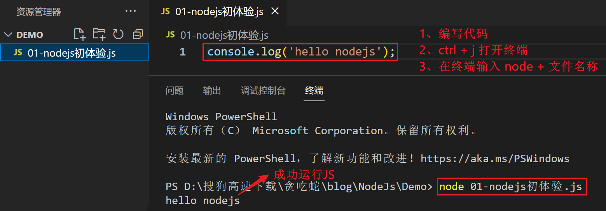

注意：

+ node.js 中不能使用 BOM 和 DOM 的 API，可以使用 console 和 定时器 API
+ node.js 中的顶级对象为 global，也可以用 globalThis 访问顶级对象

### 1.6 nodejs自动补全
打开文件夹，找到项目根目录，在空白在按 `shift + 鼠标右键` 打开Powershell终端窗口

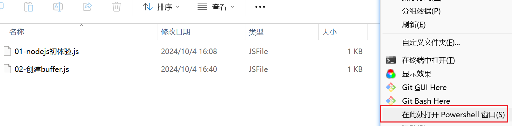

先输入一个空格，再输入如下代码

```shell
npm install --save @types/node
```

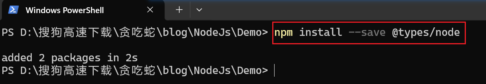

多出文件如图

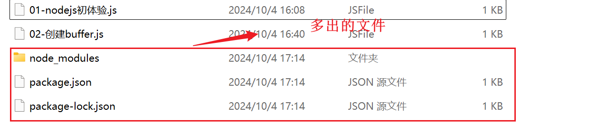

重启vscode，你会发现有自动补全了

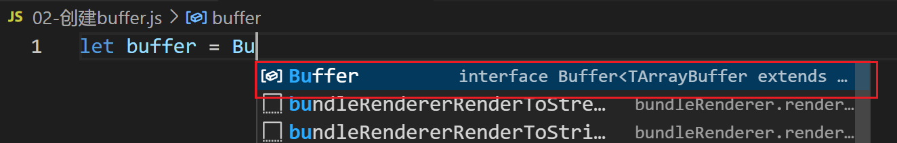

## 2、Buffer（缓冲器）
### 2.1 Buffer是什么
Buffer 是一个类似于数组的 `对象` ，用于表示固定长度的字节序列。

Buffer 本质是一段内存空间，专门用来处理 `二进制数据` 。


### 2.2 Buffer的特点
1. Buffer 大小固定且无法调整
2. Buffer 性能较好，可以直接对计算机内存进行操作
3. 每个元素的大小为 1 字节（byte）


### 2.3 Buffer的使用
#### 1）创建Buffer
Node.js 中创建 Buffer 的方式主要如下几种：

1. `Buffer.alloc`

```javascript
// 创建了一个长度为 10 字节的 Buffer，相当于申请了 10 字节的内存空间，每个字节的值为 0
let buf_1 = Buffer.alloc(10) //=>结果为<Buffer 00 00 00 00 00 00 00 00 00 00>
```

2. `Buffer.allocUnsafe`

```javascript
// 创建了一个长度为 10 字节的 Buffer，buffer 中可能存在旧数据，可能会影响执行结果，所以叫 unsafe ，但是效率比 alloc 高
let buf_2 = Buffer.allocUnsafe(10)
```

3. `Buffer.from`

```javascript
// 通过字符串创建 Buffer
let buf_3 = Buffer.from('hello')
// 通过数组创建 Buffer
let buf_4 = Buffer.from([105, 108, 111, 118, 101, 121, 111, 117])
```

#### 2）Buffer与字符串的转化
我们可以借助 `toString` 方法将 Buffer 转为字符串

```javascript
let buf_4 = Buffer.from([105, 108, 111, 118, 101, 121, 111, 117])
console.log(buf_4.toString()) //=>iloveyou
```

注意: `toString` 默认是按照 `utf-8` 编码方式进行转换的

#### 3）Buffer的读写
Buffer 可以直接通过 `[]` 的方式对数据进行处理。

```javascript
let buf_3 = Buffer.from('hello')
// 读取
console.log(buf_3[1]) //=>101
// 修改
buf_3[1] = 97
//查看字符串结果
console.log(buf_3.toString()) //=>hallo
```

注意:

+ 如果修改的数值超过 `255` ，则<font style="color:red;">超过</font> `8` 位数据会被舍弃
+ 一个 `utf-8` 的字符 <font style="color:red;">一般</font> 占3个字节

## 3、fs 模块
fs 全称为 `file system` ，称之为 `文件系统` ，是 Node.js 中的 `内置模块` ，可以对计算机中的磁盘进行操作。

### 3.1 文件写入
文件写入就是将 <font style="color:red;">数据</font> 保存到 <font style="color:red;">文件</font> 中，我们可以使用如下几个方法来实现该效果

| 方法 | 说明 |
| --- | --- |
| `writeFile` | 异步写入 |
| `writeFileSync` | 同步写入 |
| `appendFile` /` appendFileSync` | 追加写入 |
| `createWriteStream` | 流式写入 |


#### 1）writeFile 异步写入
语法： `fs.writeFile(file, data[, options], callback)`

参数说明：

+ file 文件名
+ data 待写入的数据
+ options 选项配置
+ callback 写入回调

返回值： `undefined`

代码示例：

```javascript
// require 是 Node.js 环境中的 '全局' 变量，用来导入模块
const fs = require('fs')

// 将 [三人行，必有我师焉。] 写入到当前文件夹下的 [座右铭.txt] 文件中
fs.writeFile('./座右铭.txt', '三人行，必有我师焉。', err =>{
    // 如果写入失败，则回调函数调用时，会传入错误对象，如写入成功，会传入 null
    if(err){
        console.log(err)
        return
    }
    console.log('写入成功')  
})
```

#### 2）writeFileSync 同步写入
语法: `fs.writeFileSync(file, data[, options])`

参数与 `fs.writeFile` 大体一致，只是没有 callback 参数

返回值：`undefined`

代码示例：

```javascript
try{
    fs.writeFileSync('./座右铭.txt', '三人行，必有我师焉。')
}catch(e){
    console.log(e)
}
```

node.js 中的磁盘操作是由其他 `线程` 完成的，结果的处理有两种模式:

+ 同步处理 JavaScript 主线程 `会等待` 其线程的执行结果，然后再继续执行主线程的代码，`效率较低`
+ 异步处理 JavaScript 主线程 `不会等待` 其线程的执行结果，直接执行后续的主线程代码，`效率较好`

#### 3）appendFile / appendFileSync 追加写入
`appendFile` 作用是在文件尾部追加内容，`appendFile` 语法与 `writeFile` 语法完全相同

语法: 

`fs.appendFile(file, data[, options], callback)`

`fs.appendFileSync(file, data[, options])`

返回值：二者都为 `undefined`

实例代码：

```javascript
fs.append('./座右铭.txt', '则其善者而从之，其不善者而改之。', err =>{
    if(err) throw err
    console.log('追加成功')
})

fs.appendFileSync('./座右铭.txt','\r\n温故而知新，可以为师矣')
```

#### 4）createWriteStream 流式写入
语法：`fs.createWriteStream(path[, options])`

参数说明：

+ `path` 文件路径
+ options 选项配置

返回值: `Object`

代码示例：

```javascript
let ws = fs.createWriteStream('./观书有感.txt')

//写入数据到流
ws.write('半亩方塘一鉴开\r\n')
ws.write('天光云影共徘徊\r\n')
ws.write('问渠那得清如许\r\n')
ws.write('为有源头活水来\r\n')

//关闭写入流，表明已没有数据要被写入可写流
ws.end()
```

<font style="color:red;">程序打开一个文件是需要消耗资源的</font>，流式写入可以减少打开关闭文件的次数。

流式写入方式适用于 <font style="color:red;">大文件写入或者频繁写入</font>的场景，`writeFile`适合于 <font style="color:red;">写入频率较低的场景</font>。

#### 5）写入文件的场景
`文件写入` 在计算机中是一个非常常见的操作，下面的场景都用到了文件写入

+ 下载文件
+ 安装软件
+ 保存程序日志，如 Git
+ 编辑器保存文件
+ 视频录制

当 <font style="color:red;">需要持久化保存数据</font> 的时候，应该想到 `文件写入`

### 3.2 文件读取
文件读取顾名思义，就是通过程序从文件中取出其中的数据，我们可以使用如下几种方式：

| 方法 | 说明 |
| --- | --- |
| `readFile` | 异步读取 |
| `readFileSync` | 同步读取 |
| `createReadStream` | 流式读取 |


#### 1）readFile 异步读取
语法: `fs.readFile(path[, options], callback)`

参数说明：

+ path 文件路径
+ options 选项配置
+ callback 回调函数

返 回 值 ： `undefined`

代码示例：

```javascript
// 导入 fs 模块

fs.readFile('./座右铭.txt', (error,data) =>{
    if(err) throw err
    console.log(data)
})

fs.readFile('./座右铭.txt', 'uft-8', (error,data) =>{
    if(err) throw err
    console.log(data)
})
```

#### 2）readFileSync 同步读取
语法：`fs.readFileSync(path[, options])`

参数说明：

+ path 文件路径
+ options 选项配置

返 回 值 ：`string | Buffer` 

代码示例：

```javascript
let data = fs.readFileSync('./座右铭.txt')
let data = fs.readFileSync('./座右铭.txt', 'utf-8')
```

#### 3）createReadStream 流式读取
语法：fs.createReadStream(path[, options])`

参数说明：

+ path 文件路径
+ options 选项配置（ `可选` ）

返回值：`Object`

代码示例：

```javascript
// 创建读取流对象
let rs = fs.createReadStream('./观书有感.txt')

// 每次取出 64k 数据后执行一次 data 回调
// 绑定一个 data 事件  chunk 块儿  大块儿
re.on('data', chunk =>{
    console.log(chunk)
    console.log(chunk.length)
})

// 读取完毕后，执行 end 回调 (可选事件)
re.on('end', () =>{
    console.log('读取完毕')
})
```

#### 4）读取文件应用场景
+ 电脑开机
+ 程序运行
+ 编辑器打开文件
+ 查看图片
+ 播放视频
+ 播放音乐
+ Git 查看日志
+ 上传文件
+ 查看聊天记录

### 3.3 文件移动与重命名
在 Node.js 中，我们可以使用 `rename` 或 `renameSync` 来移动或重命名 `文件或文件夹`

语法：

`fs.rename(oldPath, newPath, callback)`

`fs.renameSync(oldPath, newPath)`

参数说明：

+ oldPath 文件当前的路径
+ newPath 文件新的路径
+ callback 操作后的回调

代码示例：

```javascript
fs.rename('./观书有感.txt', './论语/观书有感.txt', err =>{
    if(err) throw err
    console.log('移动完成')
})

fs.renameSync('./座右铭.txt', './论语/.我的座右铭.txt')
```

注: 如果还是移动到当前路径，但是修改了名字，就是重命名了

### 3.4 文件删除
在 Node.js 中，我们可以使用 `unlink` 或 `unlinkSync` 来删除文件

语法:

`fs.unlink(path, callback)`

`fs.unlinkSync(path)`

参数说明：

+ path 文件路径
+ callback 操作后的回调

代码示例：

```javascript
const fs = require('fs')

fs.unlink('./test.txt', err =>{
    if(err) throw err
    console.log('删除成功')
})

fs.unlinkSync('./test2.txt')

// 调用 rm 方法  14.4   同步 rmSync
fs.rm('./论语.txt', err => {
  if (err) {
    console.log('删除失败')
    return
  }
  console.log('删除成功')
})
```

### 3.5 文件夹操作
借助 Node.js 的能力，我们可以对文件夹进行 `创建` 、`读取` 、`删除` 等操作

| 方法 | 说明 |
| --- | --- |
| `mkdir `/` mkdirSync` | 创建文件夹 |
| `readdir` /` readdirSync` | 读取文件夹 |
| `rmdir `/` rmdirSync` | 删除文件夹 |


#### 1）mkdir 创建文件夹
在 Node.js 中，我们可以使用 `mkdir` 或 `mkdirSync` 来创建文件夹

语法:

`fs.mkdir(path[, options], callback)`

`fs.mkdirSync(path[, options])`

参数说明：

+ path 文件夹路径
+ options 选项配置（ `可选` ）
+ callback 操作后的回调

示例代码：

```javascript
// 异步创建文件夹  mk  make  制作   dir  directory  文件夹
fs.mkdir('./page', err =>{
    if(err) throw err
    console.log('创建成功')
})

// 递归异步创建
fs.mkdir('./1/2/3', {recursive: true}, err =>{
    if(err) throw err
    console.log('递归创建成功')
})

// 递归同步创建文件夹
fs.mkdirSync('./x/y/z', {recursive: true})
```

#### 2）readdir 读取文件夹
在 Node.js 中，我们可以使用 `readdir` 或 `readdirSync` 来读取文件夹

语法：

`fs.readdir(path[, options], callback)`

`fs.readdirSync(path[, options])`

参数说明：

+ path 文件夹路径
+ options 选项配置（ `可选` ）
+ callback 操作后的回调

示例代码：

```javascript
// 异步读取
fs.readdir('./论语', (err, data) => {
    if(err) throw err
    console.log(data)
})

// 同步读取 
let data = fs.readdirSync('./论语')
console.log(data)
```

#### 3）rmdir 删除文件夹
在 Node.js 中，我们可以使用 `rmdir` 或 `rmdirSync` 来删除文件夹

语法：

`fs.rmdir(path[, options], callback)`

`fs.redirSync(path[, options])`

参数说明：

+ path 文件夹路径
+ options 选项配置（ 可选 ）
+ callback 操作后的回调

示例代码：

```javascript
// 异步删除文件夹  rm  remove 移除
fs.rmdir('./page', err => {
    if(err) throw err
    console.log('删除成功')
})

//同步递归删除文件夹
fs.rmdirSync('./x', {recursive: true})

//异步递归删除文件夹  不推荐
//=>DeprecationWarning: In future versions of Node.js, fs.rmdir(path, { recursive: true }) will be removed. Use fs.rm(path, { recursive: true }) instead
fs.rmdirSync('./1', {recursive: true}, err => {
    if(err){ 
        console.log(err)
        return
    }
    console.log('递归删除')
})

// 异步递归删除文件夹 建议使用
fs.rm('./a', { recursive: true }, err => {
  if (err) {
    console.log(err)
    return
  }
  console.log('删除成功')
})
```

#### 4）查看资源状态
在 Node.js 中，我们可以使用 `stat` 或 `statSync` 来查看资源的详细信息

语法：

`fs.stat(path[, options], callback)`

`fs.statSync(path[, options])`

参数说明：

+ path 文件夹路径
+ options 选项配置（ 可选 ）
+ callback 操作后的回调

示例代码：

```javascript
// 异步获取状态
// stat  方法  status 缩写 状态
fs.stat('/data.txt', (err, data) =>{
    if(err) throw err
    console.log(data)
})

// 同步获取状态
let data = fs.statSync('./data.txt')
```

结果值对象结构：

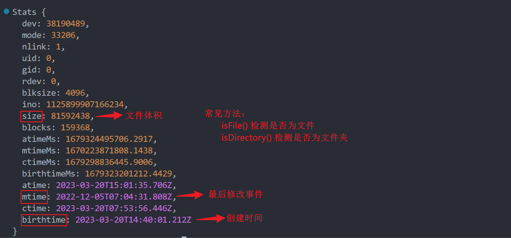

### 3.6 相对路径问题
fs 模块对资源进行操作时，路径的写法有两种： 

+ 相对路径
    - `./座右铭.txt` 当前目录下的 座右铭.txt
    - `座右铭.txt` 等效于上面的写法
    - `../座右铭.txt` 当前目录的上一级目录中的 座右铭.txt
+ 绝对路径
    - `D:/Program Files` windows 系统下的绝对路径
    - `/user/bin` Linux 系统下的绝对路径

相对路径中所谓的 `当前目录` ，指的是 `命名行的工作目录` ，而并非是文件的所在目录

所以当命名行的工作目录与文件所在目录不一致时，会出现一些 Bug

### 3.7 __dirname
`__dirname` 与 `require` 类似，都是 Node.js 环境中的 '全局' 变量

`__dirname` 保存着 <font style="color:red;">当前文件夹所在目录的绝对路径</font>，可以使用 `__dirname` 与文件名拼接成绝对路径

代码示例:

```javascript
//=>__dirname + '/data.txt'  === 'D:\\Desktop\\Node\\code\\03-fs模块/data.txt'
let data = fs.readFileSync(__dirname + '/data.txt')
console.log(data) 
```

使用 fs 模块的时候，尽量使用 `__dirname` 路径转换为绝对路径，这样可以避免相对路径产生的 Bug

### 3.8 练习
#### 1）文件复制
```javascript
/* 
 *  需求:
 *    复制  资料文件夹下的  [笑看风云.mp4]
 */
// 导入 fs 模块
const fs = require('fs')
// 方式一  readFile
// 读取文件内容
let data = fs.readFileSync('./资料/笑看风云.mp4')
// 写入文件
fs.writeFileSync('./资料/笑看风云2.mp4', data)

// 方式二 流式操作
// 创建读取流对象
const rs = fs.createReadStream('./资料/笑看风云.mp4')
// 创建一个写入流对象
const ws = fs.createWriteStream('./资料/笑看风云3.mp4')

// 绑定data事件
// 理想状态下，读取 64k 就写入 64 k，这样消耗的内存最少，实际上读取的速度大于写入的速度
rs.on('data', chunk => {
   ws.write(chunk)
})
// rs.pipe(ws)
```

#### 2）文件重命名
```javascript
/* 
 *  需求:
 *    批量将文件名 1.xxx 2.xxx ... 变成 01.xxx 02.xxx 
 */
// 1. 导入 fs 模块
const fs = require('fs')

// 读取 03-fs模块 文件夹
const files = fs.readdirSync('../03-fs模块')

// 遍历数组
files.forEach(item => {
  // 判断
  let [num, name] = item.split('-')
  if (num < 10) {
    num = '0' + num
  }
  // 创建新的文件名
  let newName = num + '-' + name
  // 重命名
  fs.renameSync(`../03-fs模块/${item}`, `../03-fs模块/${newName}`)
})
```

## 4、path模块
`path` 模块提供了 `操作路径` 的功能，我们将介绍如下几个较为常用的几个 API：

| **API** | **说明** |
| --- | --- |
| `path.resolve` | 拼接规范的绝对路径 `常用` |
| `path.sep` | 获取操作系统的路径分隔符 |
| `path.parse` | 解析路径并返回对象 |
| `path.basename` | 获取路径的基础名称 |
| `path.dirname` | 获取路径的目录名 |
| `path.extname` | 获得路径的扩展名 |


代码示例：

```javascript
// 导入 fs 模块
const fs = require('fs')
// 导入 path 模块
const path = require('path')

// 写入文件
// fs.writeFileSync(__dirname + '/index.html', 'love')
console.log(__dirname + '/index.html') //=>D:\Desktop\Node\code\04-path/index.html

// resolve 解决问题  拼接绝对路径
console.log(path.resolve(__dirname, './index.html')) //=>D:\Desktop\Node\code\04-path\index.html
console.log(path.resolve(__dirname, 'index.html')) //=>D:\Desktop\Node\code\04-path\index.html
console.log(path.resolve(__dirname, '/index.html', './test')) //=>D:\index.html\test

// sep 获取路径分隔符
console.log(path.sep) //=> window \  linux /

// parse 方法  __filename  '全局变量'
console.log(__filename) //=>文件的绝对路径 //=>D:\Desktop\Node\code\04-path\01-path.js
// 解析路径
let str = 'D:\\Desktop\\Node\\code\\04-path\\01-path.js'
console.log(path.parse(str))

// 获取路径基础名称
console.log(path.basename(pathname))

// 获取路径的目录名
console.log(path.dirname(pathname))

// 获取路径的拓展名
console.log(path.extname(pathname))
```

## 5、HTTP 协议
### 5.1 什么是 HTTP 协议
HTTP（hypertext transport protocol）协议「 <font style="color:red;">超文本传输议</font>」，协议详细规定了`浏览器`和万维网`服务器`之间互相通信的规则。

协议中主要规定了两个方面的内容:

+ 客户端：用来向服务器发送数据，可以被称之为 <font style="color:red;">请求报文</font>
+ 服务端：向客户端返回数据，可以被称之为 <font style="color:red;">响应报文</font>

报文：可以简单理解为就是一堆字符串。


### 5.2 请求报文的组成
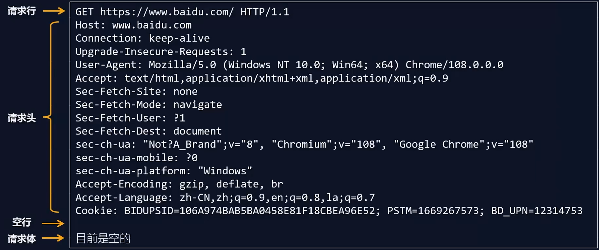

#### 1）请求行
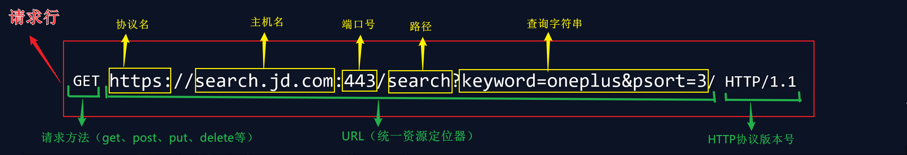

#### 2）请求头
格式：『头名：头值』

常见的请求头有：

| 请求头 | 解释 |
| --- | --- |
| `Host` | 主机名 |
| `Connection` | 连接的设置 keep-alive（保持连接）；close（关闭连接） |
| `Cache-Control` | 缓存控制 max-age = 0 （没有缓存） |
| `Upgrade-Insecure-Requests` | 将网页中的http请求转化为 https 请求（很少用）老网站升级 |
| `User-Agent` | 用户代理，客户端字符串标识，服务器可以通过这个标识来识别这个请求来自哪个客户端 ，一般在PC端和手机端的区分 |
| `Accept` | 设置浏览器接收的数据类型 |
| `Accept-Encoding` | 设置接收的压缩方式 |
| `Accept-Language` | 设置接收的语言 q=0.7 为喜好系数，满分为1 |
| `Cookie` | 后面单独讲 |


#### 3）请求体
请求体内容的格式是非常灵活的

（可以是空）==> GET请求，

（也可以是字符串，还可以是JSON）===> POST请求

例如：

+ 字符串：keywords=手机&price=2000
+ JSON：{"keywords":"手机","price":2000}

### 5.3 响应报文的组成
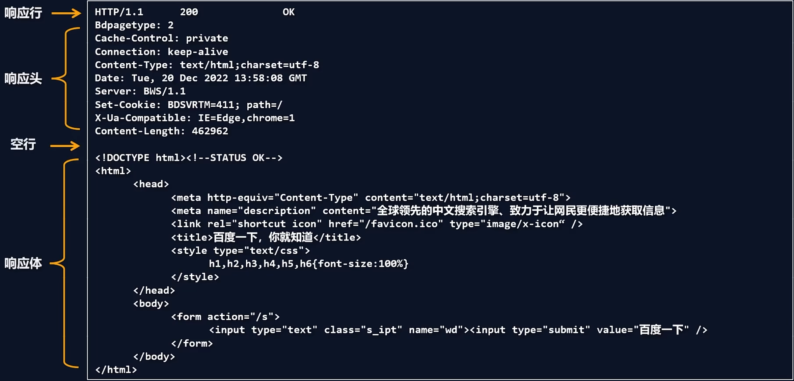

#### 1）响应行
响应行:  `HTTP/1.1 200 OK`

+ HTTP/1.1：HTTP协议版本号
+ 200：响应状态码 404 Not Found 500 Internal Server Error还有一些状态码，参考：[https://developer.mozilla.org/zh-CN/docs/Web/HTTP/Status](https://developer.mozilla.org/zh-CN/docs/Web/HTTP/Status)OK：响应状态描述

响应状态码 和 响应字符串 关系是 一一对应 的。

#### 2）响应头
+ `Cache-Control`: 缓存控制 private 私有的，只允许客户端缓存数据
+ `Connection`: 链接设置
+ `Content-Type:text/html;charset=utf-8`: 设置响应体的数据类型以及字符集,响应体为html，字符集utf-8
+ `Content-Length`: 响应体的长度，单位为字节

#### 3）响应体
响应体内容的类型是非常灵活的，常见的类型有 HTML、CSS、JS、图片、JSON

### 5.4 创建 HTTP 服务
使用 nodejs 创建 HTTP 服务，并启动

```javascript
//1. 导入 http 模块
const http = require('http');

//2. 创建服务对象 create 创建 server 服务
// request 意为请求. 是对请求报文的封装对象, 通过 request 对象可以获得请求报文的数据
// response 意为响应. 是对响应报文的封装对象, 通过 response 对象可以设置响应报文
const server = http.createServer((request, response) => { 		
    // 设置响应体
    response.end('Hello HTTP server');
});  //=>返回结果是一个对象

//3. 监听端口, 启动服务
server.listen(9000, () => {
    console.log('服务已经启动, 端口 9000 监听中...');
});
```

> `http.createServer` 里的回调函数的执行时机： <font style="color:red;">当接收到 HTTP 请求的时候，就会执行</font>
>

浏览器发送请求：`http://127.0.0.1:9000`

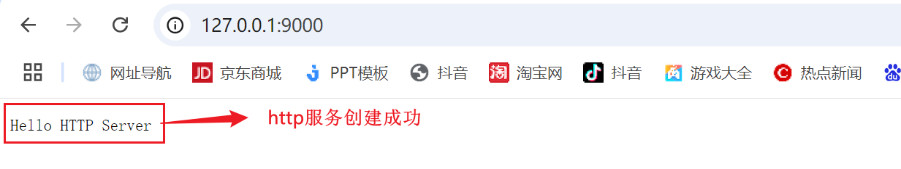

**注意事项**

1. 命令行 `ctrl + c` 停止服务
2. 当服务启动后，更新代码 <font style="color:red;">必须重启服务才能生效</font>
3. 响应内容中文乱码的解决办法

```javascript
// 设置响应头
response.setHeader('content-type','text/html;charset=utf-8');
```

4. 端口号被占用`Error: listen EADDRINUSE: address already in use :::9000`1）关闭当前正在运行监听端口的服务 （ <font style="color:red;">使用较多</font> ）2）修改其他端口号
5. `HTTP` 协议<font style="color:red;">默认端口</font>是 `80` 。`HTTPS` 协议的<font style="color:red;">默认端口</font>是 `443`, HTTP 服务开发常用端口有 `3000`，`8080`，`8090`，`9000` 等
6. 如果端口被其他程序占用，可以使用 <font style="color:red;">资源监视器</font> 找到占用端口的程序，然后使用 <font style="color:red;">任务管理器</font> 关闭对应的程序

### 5.5 浏览器查看 HTTP 报文
点击步骤

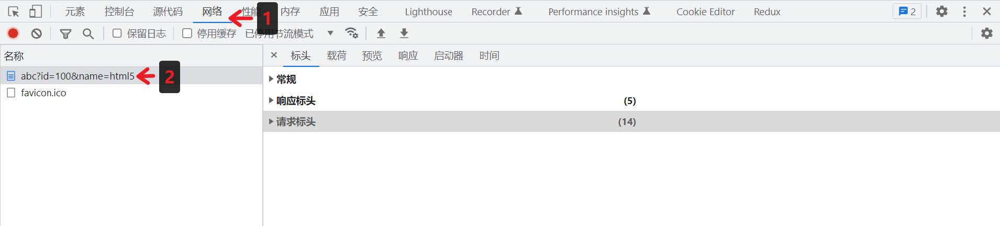

#### 1）查看请求行与请求头
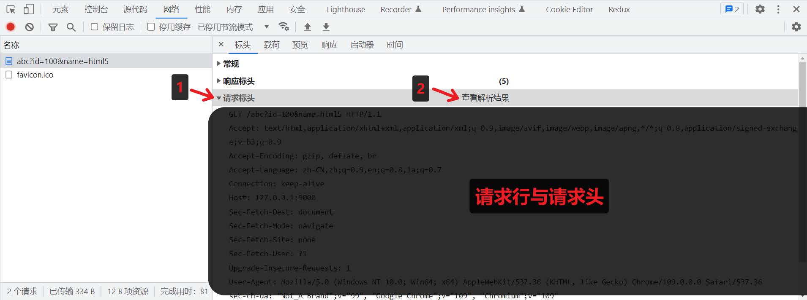

#### 2）查看请求体
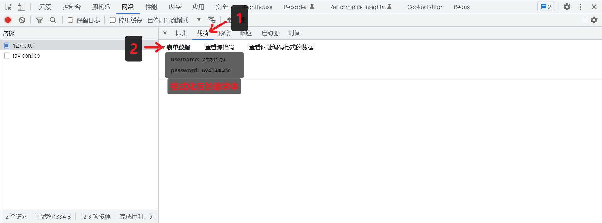

#### 3）查看 URL 查询字符串


#### 4）查看响应行与响应头
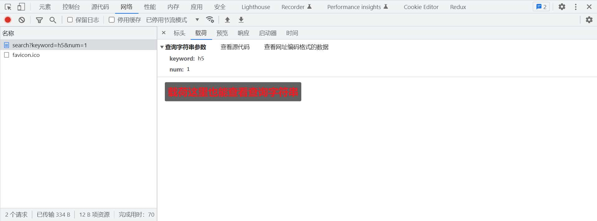

#### 5）查看响应体
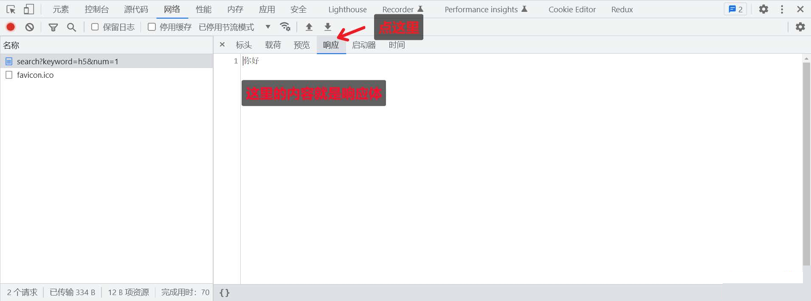

### 5.6 获取 HTTP 请求报文
| 含义 | 语法 | 重点掌握 |
| :--- | :--- | :--- |
| 请求方法 | `request.method` | ***** |
| 请求版本 | `request.httpVersion` |  |
| 请求路径 | `request.url` | ***** |
| URL 路径 | `require('url').parse(request.url).pathname` | ***** |
| URL 查询字符串 | `require('url').parse(request.url,  true).query` | ***** |
| 请求头 | `request.headers` | ***** |
| 请求体 | `request.on('data', function(chunk){})`   `request.on('end', function(){})` |  |


#### 1）提取报文的常用内容
```javascript
// 1. 导入 http 模块
const http = require('http')

// 2. 创建服务对象
const server = http.createServer((request, response) => {
  // 获取请求的方法
  console.log(request.method)  //=>GET
  // 获取请求的 url
  console.log(request.url)  // 只包含 url 中的 路径 与查询字符串
  // 获取 http 协议的版本号
  console.log(request.httpVersion)  //=> 1.1
  // 获取 http 的请求头
  console.log(request.headers) //=>结果是一个对象
  response.end('http') //=>设置响应体
})

// 3. 监听端口，启动服务
server.listen(9000, () => {
  console.log('服务已经启动...')
})
```

注意事项：

1. `request.url` 只能获取路径以及查询字符串，无法获取 URL 中的域名以及协议的内容
2. `request.headers` 将请求信息转化成一个对象，并将属性名都转化成了『小写』
3. 关于路径：如果访问网站的时候，只填写了 IP 地址或者是域名信息，此时请求的路径为『 `/` 』
4. 关于 `favicon.ico`：这个请求是属于浏览器自动发送的请求

#### 2）提取报文的请求体
```javascript
// 1. 导入 http 模块
const http = require('http')

// 2. 创建服务对象
const server = http.createServer((request, response) => {
  // 1. 声明一个变量
  let body = ''
  // 2. 绑定 data 事件
  request.on('data', chunk => {
    body += chunk
  })
  // 3. 绑定 end 事件
  request.on('end', () => {
    console.log(body)  //=>'username=111&password=111'
    // 响应
    response.end('Hello Http') //=>设置响应体 
  })
})

// 3. 监听端口，启动服务
server.listen(9000, () => {
  console.log('服务已经启动...')
})
```

#### 3）提取url的路径与查询字符串
方式一：

```javascript
// 导入 http 模块
const http = require('http')
// 1. 导入 url 模块
const url = require('url')

// 创建服务对象
const server = http.createServer((request, response) => {
  // 2. 解析 request.url
  console.log(request.url)   //=>/search?keyword=h5
  // 使用 parse 解析 request.url 的内容
  // true 将 query 属性将会设置为一个 对象
  let res = url.parse(request.url, true)
  console.log(res)  // 如下图所示，为一个对象
  // 路径
  let pathname = res.pathname
  // 查询字符串
  let keyword = res.query.keyword
  console.log(keyword)   //=>h5
  response.end('url')
})

// 监听端口，启动服务
server.listen(9000, () => {
  console.log('服务已经启动...')
})
```

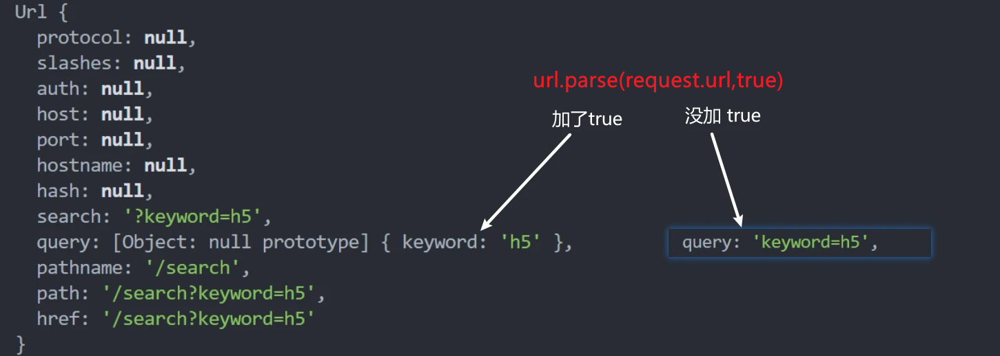

方式二：

```javascript
// 导入 http 模块
const http = require('http')

// 创建服务对象 
const server = http.createServer((request, response) => {
  // 实例化 url 对象
  // let url = new URL('/search?a=100&b=200','http://127.0.0.1:9000')
  let url = new URL(request.url, 'http://127.0.0.1')
  console.log(url)  //=>如图所示，为一个对象
  // 输出路径
  console.log(url.pathname)  //=>/search
  // 输出 keyword 查询字符串
  console.log(url.searchParams.get('a'))  //=> 100
  response.end('url new')
})

// 监听端口，启动服务
server.listen(9000, () => {
  console.log('服务已经启动...')
})
```

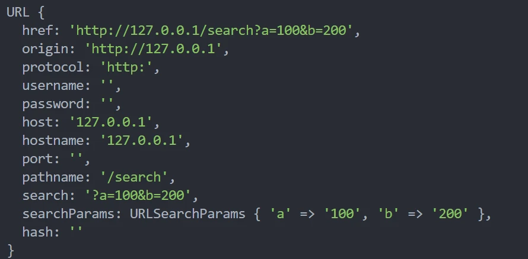

#### 4）HTTP 请求练习
按照以下要求搭建 HTTP 服务

| 请求类型(方法) | 请求地址 | 响应体结果 |
| --- | --- | --- |
| get | /login | 登录页面 |
| get | /reg | 注册页面 |


```javascript
// 1.引入 http 模块
const http = require('http')

// 2.创建服务对象
const server = http.createServer((require, response) => {
    // 获取请求方法和请求的url
    const { method } = require
    const { pathname } = new URL(require.url, 'http://127.0.0.1')
    //设置响应头信息,解决中文乱码
    response.setHeader("Content-Type", "text/html;charset=utf-8")
    // 判断
    if (method === 'GET' && pathname === '/login') {
        response.end('登入页面')
    } else if (method === 'GET' && pathname === '/reg') {
        response.end('注册页面')
    } else {
        response.end('NOT FOUND')
    }

})

// 3.监听端口，开启服务
server.listen(9000, () => {
    console.log('9000端口监听中，服务启动...')
})
```

### 5.7 设置 HTTP 响应报文
| 作用 | 语法 |
| --- | --- |
| 设置响应状态码 | `response.statusCode` |
| 设置响应状态描述 | `response.statusMessage `（ 用的非常少 ） |
| 设置响应头信息 | `response.setHeader('头名', '头值')  `(可以自定义) |
| 设置响应体 | `response.write('xx')`   `response.end('xxx')` |


#### 1）设置响应报文常用内容
```javascript
// 1. 设置响应状态码
response.statusCode = 203
// 2. 响应状态的描述
response.statusMessage = 'i love you'
// 3. 响应头
response.setHeader('content-type', 'text/html;charset=utf-8')
// 自定义响应头
response.setHeader('myHeader', 'test test')
// 设置多个同名的响应头
response.setHeader('test', ['a', 'b', 'c'])
// 4.设置响应体
// write 和 end 的两种使用情况：
//  1）write 和 end 的结合使用 响应体相对分散
response.write('xx');
response.write('xx');
response.write('xx');
response.end(); //每一个请求，在处理的时候必须要执行 end 方法的
// 2）单独使用 end 方法 响应体相对集中
response.end('xxx');
```

#### 2）响应报文练习
搭建 HTTP 服务，响应一个 4 行 3 列的表格，并且要求表格有 `隔行换色效果` ，且 `点击` 单元格能 `高亮显示`

方法一

```javascript
// 导入 http 模块
const http = require('http')
const fs = require('fs')

// 创建服务对象
const server = http.createServer((request, response) => {
  response.setHeader('content-type', 'text/html;charset=utf-8')
  response.end(`
    <!DOCTYPE html>
    <html lang="en">

    <head>
      <meta charset="UTF-8">
      <meta http-equiv="X-UA-Compatible" content="IE=edge">
      <meta name="viewport" content="width=device-width, initial-scale=1.0">
      <title>Document</title>

      <style>
        td {
          padding: 20px 40px;
        }

        table tr:nth-child(odd) {
          background-color: #aef;
        }

        table tr:nth-child(even) {
          background-color: #fcb;
        }

        table,
        td {
          border-collapse: collapse;
        }
      </style>

    </head>

    <body>
      <table border="1">
        <tr>
          <td></td>

          <td></td>

          <td></td>

        </tr>

        <tr>
          <td></td>

          <td></td>

          <td></td>

        </tr>

        <tr>
          <td></td>

          <td></td>

          <td></td>

        </tr>

        <tr>
          <td></td>

          <td></td>

          <td></td>

        </tr>

      </table>

      <script>
        const tds = document.querySelectorAll('td')
        tds.forEach(item => {
          item.addEventListener('click', function () {
            this.style.backgroundColor = '#000'
          })
        })
      </script>

    </body>

    </html>

  `)
})

// 监听端口，启动服务器
server.listen(9000, () => {
  console.log('服务器已经启动...')
})
```

方法二

```javascript
// 导入 http 模块
const http = require('http')
const fs = require('fs')

// 创建服务对象
const server = http.createServer((request, response) => {
  response.setHeader('content-type', 'text/html;charset=utf-8')
  // 读取文件内容
  let html = fs.readFileSync(__dirname + '/table.html')
  // end 方法的参数可以是字符串也可以是Buffer
  response.end(html)
})

// 监听端口，启动服务器
server.listen(9000, () => {
  console.log('服务器已经启动...')
})
```

table.html

```html
<!DOCTYPE html>
<html lang="en">

<head>
  <meta charset="UTF-8">
  <meta http-equiv="X-UA-Compatible" content="IE=edge">
  <meta name="viewport" content="width=device-width, initial-scale=1.0">
  <title>Document</title>

  <style>
    td {
      padding: 20px 40px;
    }

    table tr:nth-child(odd) {
      background-color: #aef;
    }

    table tr:nth-child(even) {
      background-color: #fcb;
    }

    table,
    td {
      border-collapse: collapse;
    }
  </style>

</head>

<body>
  <table border="1">
    <tr>
      <td></td>

      <td></td>

      <td></td>

    </tr>

    <tr>
      <td></td>

      <td></td>

      <td></td>

    </tr>

    <tr>
      <td></td>

      <td></td>

      <td></td>

    </tr>

    <tr>
      <td></td>

      <td></td>

      <td></td>

    </tr>

  </table>

  <script>
    const tds = document.querySelectorAll('td')
    tds.forEach(item => {
      item.addEventListener('click', function () {
        this.style.backgroundColor = '#000'
      })
    })
  </script>

</body>

</html>

```

### 5.8 网页资源的基本加载过程
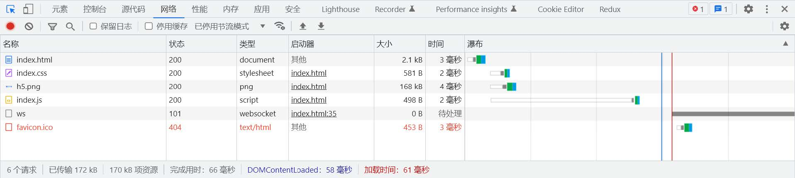

网页资源的加载都是循序渐进的，首先获取 HTML 的内容， 然后解析 HTML 在发送其他资源的请求，如 CSS，Javascript，图片等。理解了这个内容对于后续的学习与成长有非常大的帮助。

### 5.9 静态资源服务
`静态资源` 是指 <font style="color:red;">内容长时间不发生改变的资源</font> ，例如图片，视频，CSS 文件，JS文件，HTML文件，字体文件等

`动态资源` 是指 <font style="color:red;">内容经常更新的资源</font> ，例如百度首页，网易首页，京东搜索列表页面等

#### 1）网站根目录或静态资源目录
HTTP 服务在哪个文件夹中寻找静态资源，那个文件夹就是 <font style="color:red;">静态资源目录</font> ，也称之为 <font style="color:red;">网站根目录</font>

> 思考：vscode 中使用 live-server 访问 HTML 时， 它启动的服务中网站根目录是谁？
>
> + 改文件的所处的文件夹
>

#### 2）网页中的 URL
网页中的 URL 主要分为两大类：`相对路径` 与 `绝对路径`

**绝对路径**

绝对路径可靠性强，而且相对容易理解，在项目中运用较多

| 形式 | 特点 |
| --- | --- |
| [http://www.baidu.com](http://www.baidu.com) | 直接向目标资源发送请求，容易理解。网站的外链会用到此形式 |
| //atguigu.com/web | 与页面 URL 的协议拼接形成完整 URL 再发送请求。大型网站用的比较多 |
| /web | 与页面 URL 的协议、主机名、端口拼接形成完整 URL 再发送请求。中小型网站 |


**相对路径**

相对路径在发送请求时，需要与当前页面 URL 路径进行 `计算` ，得到完整 URL 后，再发送请求，学习阶段用的较多

例如当前网页 url 为 [http://www.atguigu.com/course/h5.html](http://www.atguigu.com/course/h5.html)

| 形式 | 最终的 URL |
| --- | --- |
| ./css/app.css | [http://www.atguigu.com/course/css/app.css](http://www.atguigu.com/course/css/app.css) |
| js/app.js | [http://www.atguigu.com/course/js/app.js](http://www.atguigu.com/course/js/app.js) |
| ../img/logo.png | [http://www.atguigu.com/img/logo.png](http://www.atguigu.com/img/logo.png) |
| ../../mp4/show.mp4 | [http://www.atguigu.com/mp4/show.mp4](http://www.atguigu.com/mp4/show.mp4) |


**网页中使用 URL 的场景小结**

包括但不限于如下场景：

+ a 标签 href
+ link 标签 href
+ script 标签 src 
+ img 标签 src
+ video audio 标签 src
+ form 中的 action
+ AJAX 请求中的 URL

#### 3）设置资源类型（mime类型）
`媒体类型`（通常称为 Multipurpose Internet Mail Extensions 或 MIME 类型 ）是一种标准，用来表示文档、文件或字节流的性质和格式。

```plain
mime 类型结构： [type]/[subType]

例如： text/html text/css image/jpeg image/png application/json
```

HTTP 服务可以设置响应头 Content-Type 来表明响应体的 MIME 类型，浏览器会根据该类型决定如何处理资源

下面是常见文件对应的 mime 类型

```javascript
html: 'text/html',
css: 'text/css',
js: 'text/javascript',
png: 'image/png',
jpg: 'image/jpeg', 
gif: 'image/gif',
mp4: 'video/mp4',
mp3: 'audio/mpeg',
json: 'application/json'
```

> 对于未知的资源类型，可以选择 `application/octet-stream` 类型，浏览器在遇到该类型的响应时，会对响应体内容进行独立存储，也就是我们常见的 `下载` 效果
>

```javascript
require('http').createServer((request,response)=>{
    //获取请求的方法已经路径
    let {url,method} = request;
    //判断请求方式以及请求路径
    if(method == "GET" && url == "/index.html"){
        //需要响应文件中的内容
        let data = require('fs').readFileSync( dirname + '/index.html');
         response.end(data);
    }else if(method == "GET" && url == "/css/app.css"){
        //需要响应文件中的内容
        let data = require('fs').readFileSync( dirname + '/public/css/app.css');
        response.end(data);
    }else if(method == "GET" && url == "/js/app.js"){
        //需要响应文件中的内容
        let data = require('fs').readFileSync( dirname + '/public/js/app.js');
         response.end(data);
    }else{
        //404响应
         response.statusCode = 404;
        response.end("<h1>404 Not Found</h1>");
    }
}).listen(80,()=>{

console.log('80端口正在启动中....');

})
```

很明显上面的代码，当只要有一个请求路径就需要进行判断，显然这种方式不够完美，那么我们需要封装

```javascript
require('http').createServer((request,response)=>{
    //获取请求的方法已经路径
    let {url,method} = request;
    //文件夹路径  根路径
    let rootDir = dirname + '/public';
    //拼接文件路径
    let filePath = rootDir + url;
    //读取文件内容
    fs.readFile(filePath,(err,data)=>{
        //判断
        if(err){
            //如果出现错误，响应404状态码
            response.statusCode = 404; 
            response.end('<h1>404 Not Found</h1>');
        }else{
            //响应文件内容
            response.end(data);
        }
    })
}).listen(80,()=>{
    console.log('80端口正在启动中....');
})
```

### 5.10 GET 和 POST 请求
#### 1）GET 和 POST 请求场景
GET 请求的情况：

+ 在地址栏直接输入 url 访问
+ 点击 a 链接
+ link 标签引入 css
+ script 标签引入 js
+ img 标签引入图片
+ form 标签中的 method 为 get （不区分大小写）
+ ajax 中的 get 请求

POST 请求的情况：

+ form 标签中的 method 为 post（不区分大小写）
+ AJAX 的 post 请求

#### 2）GET和POST请求的区别
`GET` 和 `POST` 是 HTTP 协议请求的两种方式。

+ `GET` 主要用来获取数据，`POST` 主要用来提交数据
+ `GET` 带参数请求是将参数缀到 URL 之后，在地址栏中输入 url 访问网站就是 GET 请求，`POST` 带参数请求是将参数放到请求体中
+ `POST` 请求相对 `GET` 安全一些，因为在浏览器中参数会暴露在地址栏
+ `GET` 请求大小有限制，一般为 2K，而 POST 请求则没有

## 6、模块化
### 6.1 模块化介绍
#### 1）模块与模块化
将一个复杂的程序文件依据一定规则（规范）拆分成多个文件的过程称之为 `模块化`。

其中拆分出的 <font style="color:red;">每个文件就是一个模块</font>，模块的内部数据是私有的，不过模块可以暴露内部数据以便其他模块使用。

#### 2）模块化项目
编码时是按照模块一个一个编码的， 整个项目就是一个模块化的项目。

#### 3）模块化好处
1. 防止命名冲突
2. 高复用性
3. 高维护性

### 6.2 模块暴露数据
#### 1）模块初体验
可以通过下面的操作步骤，快速体验模块化

1. 创建 me.js

```javascript
//声明函数
function tiemo(){
    console.log('贴膜....');
}
//暴露数据
module.exports = tiemo;
```

2. 创建 index.js

```javascript
//导入模块
const tiemo = require('./me.js');
//调用函数
tiemo(); //=> 贴膜....
```


#### 2）暴露数据
模块暴露数据的方式有两种：

1. `module.exports` = value
2. `exports.name` = value

> 使用时有几点注意：
>
> + `module.exports` 可以暴露 <font style="color:red;">任意</font> 数据
> + 不能使用 `exports = value` 的形式暴露数据，模块内部 module 与 exports 的隐式关系，  
`exports = module.exports = {}` ，require 返回的是目标模块中 `module.exports` 的值
>

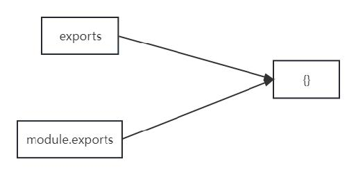

#### 3）导入（引入）模块
在模块中使用 require 传入文件路径即可引入文件

```javascript
const test = require('./me.js')
```

require 使用的一些注意事项：

1. 对于自己创建的模块，导入时路径建议写 <font style="color:red;">相对路径</font>，且不能省略 `./` 和 `../`
2. `js` 和 `json` 文件导入时可以不用写后缀，c/c++编写的 `node` 扩展文件也可以不写后缀，但是一般用不到，直接使用 `node` 的 `require()` 方法即可将 JSON 文件转换成 JS 对象
3. 如果导入其他类型的文件，会以 `js` 文件进行处理
4. 如果导入的路径是个文件夹，则会 <font style="color:red;">首先</font> 检测该文件夹下 `package.json` 文件中 `main` 属性对应的文件，如果存在则导入，反之如果文件不存在会报错。如果 main 属性不存在，或者 package.json 不存在，则会尝试导入文件夹下的 `index.js` 和  
`index.json`，如果还是没找到，就会报错
5. 导入 node.js 内置模块时，直接 require 模块的名字即可，无需加 `./` 和 `../`


#### 4）导入模块的基本流程
这里我们介绍一下 `require` 导入 <font style="color:red;">自定义模块</font> 的基本流程

1. 将相对路径转为绝对路径，定位目标文件
2. 缓存检测
3. 读取目标文件代码
4. 包裹为一个函数并执行（自执行函数）。通过 `arguments.callee.toString()` 查看自执行函数
5. 缓存模块的值
6. 返回 `module.exports` 的值

```javascript
/**
 * 伪代码
 */

function require(file){
  //1. 将相对路径转为绝对路径，定位目标文件
  let absolutePath = path.resolve(__dirname, file);
  //2. 缓存检测
  if(caches[absolutePath]){
    return caches[absolutePath];
  }
  //3. 读取文件的代码
  let code = fs.readFileSync(absolutePath).toString();
  //4. 包裹为一个函数 然后执行
  let module = {};
  let exports = module.exports = {};
  (function (exports, require, module, __filename, __dirname) {
    const test = {
      name: '尚硅谷'
    }
  
    module.exports = test;
  
    //输出
    console.log(arguments.callee.toString());
  })(exports, require, module, __filename, __dirname)
  //5. 缓存结果
  caches[absolutePath] = module.exports;
  //6. 返回 module.exports 的值
  return module.exports;
}
```

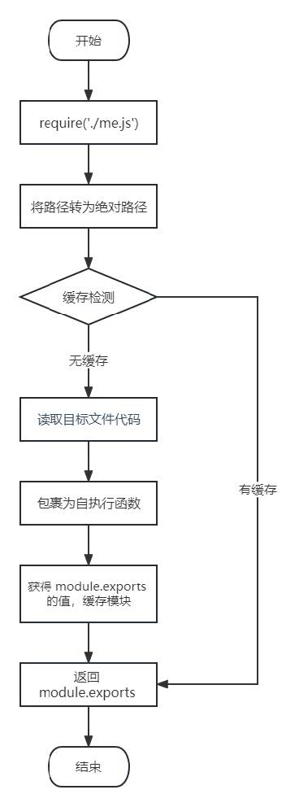

#### 5）CommonJS 规范
`module.exports` 、`exports` 以及 `require` 这些都是 `CommonJS` 模块化规范中的内容。

而 Node.js 是实现了 CommonJS 模块化规范，二者关系有点像 JavaScript 与 ECMAScript。

## 7、包管理工具
### 7.1 概念介绍
#### 1）什么是包
『包』英文单词是 `package` ，代表了一组特定功能的源码集合。

#### 2）包管理工具
管理『包』的应用软件，可以对「包」进行 `下载安装` ， `更新` ， `删除`， `上传`等操作。

借助包管理工具，可以快速开发项目，提升开发效率。

包管理工具是一个通用的概念，很多编程语言都有包管理工具，所以 <font style="color:red;">掌握好包管理工具非常重要</font>。

#### 3）常用的包管理工具
下面列举了前端常用的包管理工具

+ `npm`
+ yarn
+ cnpm

### 7.2 npm
npm 全称 `Node Package Manager` ，翻译为中文意思是『Node 的包管理工具』。

npm 是 node.js 官方内置的包管理工具，是 <font style="color:red;">必须要掌握住的工具</font>。

#### 1）npm 的安装
node.js 在安装时会 `自动安装 npm` ，所以如果你已经安装了 node.js，可以直接使用 npm

可以通过 `npm -v` 查看版本号测试，如果显示版本号说明安装成功，反之安装失败

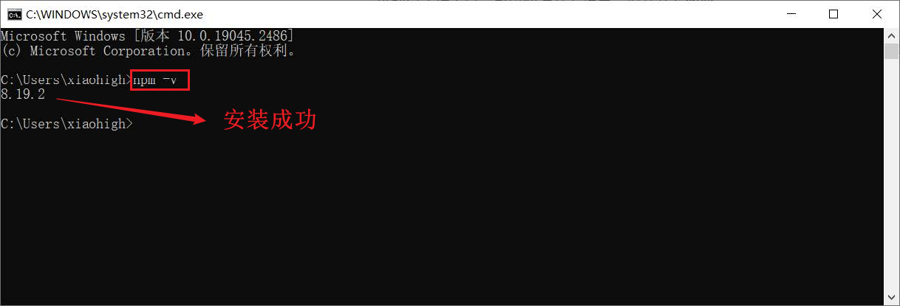

> 查看版本时可能与上图版本号不一样，不过不影响正常使用
>

#### 2）npm 基本使用
##### ① 初始化
创建一个空目录，然后以此目录作为工作目录 <font style="color:red;">启动命令行工具</font>，执行 `npm init`

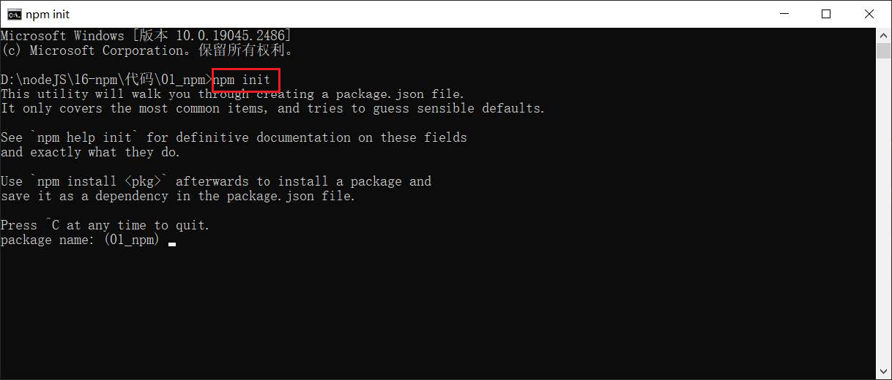

`npm init` 命令的作用是将文件夹初始化为一个『包』， `交互式创建 package.json 文件`。

`package.json` 是包的配置文件，每个包都必须要有 `package.json`。

`package.json` 内容示例：

```json
{
    "name": "1-npm", 		#包的名字
    "version": "1.0.0", 	#包的版本
    "description": "", 		#包的描述
    "main": "index.js", 	#包的入口文件
    "scripts": { 		    #脚本配置
        "test": "echo \"Error: no test specified\" && exit 1"
    },
    "author": "", 			#作者
    "license": "ISC" 		#开源证书
}
```

初始化的过程中还有一些注意事项：

+ package name (`包名`) 不能使用中文、大写，默认值是`文件夹的名称`，所以文件夹名称也不能使用中文和大写
+ version (`版本号`)要求 `x.x.x` 的形式定义，`x` 必须是数字，默认值是 `1.0.0`
+ ISC 证书与 MIT 证书功能上是相同的，关于开源证书扩展阅读 [http://www.ruanyifeng.com/blog/2011/05/how_to_choose_free_software_licenses.html](http://www.ruanyifeng.com/blog/2011/05/how_to_choose_free_software_licenses.html)
+ `package.json` 可以手动创建与修改
+ 使用 `npm init -y` 或者 `npm init --yes` 极速创建 `package.json`

##### ② 搜索包
搜索包的方式有两种

1. 命令行 『npm s/search 关键字』
2. `网站搜索` 网址是 `https://www.npmjs.com/`

> 经常有同学问，『我怎样才能精准找到我需要的包？』  
这个事儿需要大家在实践中不断的积累，通过看文章，看项目去学习去积累
>

##### ③ 下载安装包
我们可以通过 `npm install` 和 `npm i` 命令安装包

```shell
# 格式
npm install <包名>
npm i <包名>

# 示例
npm install uniq
npm i uniq
```

运行之后文件夹下会增加两个资源

+ `node_modules 文件夹` 存放下载的包
+ `package-lock.json 包的锁文件`，用来锁定包的版本

> 安装 uniq 之后， uniq 就是当前这个包的一个 `依赖包` ，有时会简称为 `依赖`
>
> 比如我们创建一个包名字为 A，A 中安装了包名字是 B，我们就说 <font style="color:red;">B 是 A 的一个依赖包</font>，也会说 <font style="color:red;">A 依赖 B</font>
>

##### ④ require 导入 npm 包基本流程
1. 在当前文件夹下 node_modules 中寻找同名的文件夹
2. 在上级目录中下的 node_modules 中寻找同名的文件夹，直至找到磁盘根目录

#### 3）生产环境与开发环境
`开发环境` 是程序员 <font style="color:red;">专门用来写代码</font> 的环境，一般是指程序员的电脑，开发环境的项目一般 <font style="color:red;">只能程序员自己访问</font>

`生产环境` 是项目 <font style="color:red;">代码正式运行</font> 的环境，一般是指正式的服务器电脑，生产环境的项目一般 <font style="color:red;">每个客户都可以访问</font>

#### 4）生产依赖与开发依赖
我们可以在安装时设置选项来区分 `依赖的类型`，目前分为两类：

| 类型 | 命令 | 补充 |
| --- | --- | --- |
| 生产依赖 | npm i -S uniq    npm i --save uniq | -S 等效于 --save，`-S 是默认选项`   包信息保存在 package.json 中 `dependencies` 属性 |
| 开发依赖 | npm i -D less   npm i --save-dev less | -D 等效于 --save-dev   包信息保存在 package.json 中 `devDependencies` 属性 |


> 举个例子方便大家理解，比如说做蛋炒饭需要`大米`，`油`，`葱`，`鸡蛋`，`锅`，`煤气`，`铲子`等
>
> 其中`锅`， `煤气`， `铲子`属于开发依赖，只在制作阶段使用
>
> 而 `大米`， `油`， `葱`， `鸡蛋`属于生产依赖，在制作与最终食用都会用到
>
> 所以 `开发依赖` 是只在开发阶段使用的依赖包，而 `生产依赖` 是开发阶段和最终上线运行阶段都用到的依赖包
>

#### 5）全局安装
我们可以执行安装选项 -g 进行全局安装。

```shell
npm i -g nodemon
```

全局安装完成之后就可以在命令行的任何位置运行 `nodemon` 命令。

该命令的作用是 `自动重启 node 应用程序`。

> 说明：
>
> + 全局安装的命令不受工作目录位置影响
> + 可以通过 `npm root -g` 可以查看全局安装包的位置
> + <font style="color:red;">不是所有的包都适合全局安装</font>，只有全局类的工具才适合，可以通过<font style="color:red;">查看包的官方文档来确定安装方式</font>，这里先不必太纠结
>

##### ① 修改 windows 执行策略
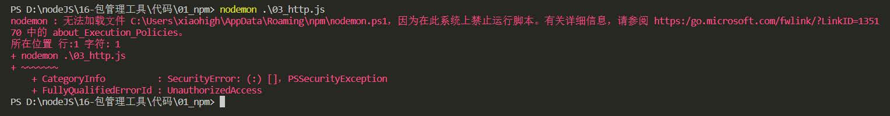

windows 默认不允许 npm 全局命令执行脚本文件，所以需要修改执行策略

1. 以`管理员身份`打开 `powershell` 命令行

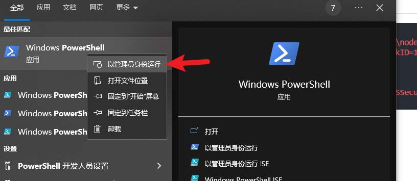

2. 键入命令 `set-ExecutionPolicy remoteSigned`

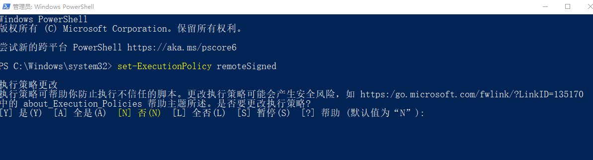

3. 键入 A 然后敲回车 👌
4. 如果不生效，可以尝试重启 vscode

##### ② 环境变量 Path
Path 是操作系统的一个环境变量，可以设置一些文件夹的路径，在当前工作目录下找不到可执行文件时，就会在环境变量 Path 的目录中挨个的查找，如果找到则执行，如果没有找到就会报错。

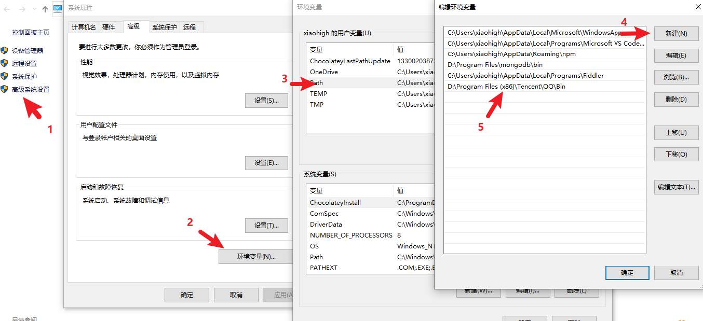

> 补充说明：
>
> + 如果希望某个程序在任何工作目录下都能正常运行，就应该将该程序的所在目录配置到环境变量 Path 中
> + windows 下查找命令的所在位置
>     - `cmd 命令行` 中执行 `where nodemon`
>     - `powershell命令行` 执行 `get-command nodemon`
>

#### 6）安装包的所有依赖
在项目协作中有一个常用的命令就是 `npm i`，通过该命令可以依据 `package.json` 和 `package-lock.json` 的依赖声明安装项目依赖。

```shell
npm i
npm install
```

> node_modules 文件夹大多数情况都不会存入版本库
>

#### 7）安装指定版本的包
项目中可能会遇到版本不匹配的情况，有时就需要安装指定版本的包，可以使用下面的命令

```shell
## 格式
npm i <包名@版本号>

## 示例
npm i jquery@1.11.2
```

#### 8）删除依赖
项目中可能需要删除某些不需要的包，可以使用下面的命令

```shell
## 局部删除
npm remove uniq
npm r uniq

## 全局删除
npm remove -g nodemon
```

#### 9）配置命令别名
通过配置命令别名可以更简单的执行命令

配置 package.json 中的 `scripts` 属性

```json
{
    .
    .
    .
    "scripts": {
        "server": "node server.js",
        "start": "node index.js",
    },
    .
    .
}
```

配置完成之后，可以使用别名执行命令

```shell
npm run server
npm run start
```

不过 `start` 别名比较特别，使用时可以省略 `run`

```shell
npm start
```

> 补充说明：
>
> + `npm start` 是项目中常用的一个命令，一般用来启动项目
> + `npm run` 有自动向上级目录查找的特性，跟 `require` 函数也一样
> + 对于陌生的项目，我们可以通过查看 `scripts` 属性来参考项目的一些操作
>

### 7.3 cnpm
#### 1）介绍
网址：[https://npmmirror.com/](https://npmmirror.com/)

cnpm 是一个淘宝构建的`npmjs.com`的完整镜像，也称为『淘宝镜像』。  
cnpm 服务部署在国内 <font style="color:red;">阿里云服务器上</font>，可以提高包的下载速度。

官方也提供了一个全局工具包 `cnpm` ，操作命令与 npm 大体相同。

#### 2）安装
我们可以通过 npm 来安装 cnpm 工具

```shell
npm install -g cnpm --registry=https://registry.npmmirror.com
```

#### 3）操作命令
| 功能 | 命令 |
| --- | --- |
| 初始化 | cnpm init / cnpm init |
| 安装包 | cnpm i uniq   cnpm i -S uniq   cnpm i -D uniq   cnpm i -g nodemon |
| 安装项目依赖 | cnpm i |
| 删除 | cnpm r uniq |


#### 4）npm 配置淘宝镜像
用 npm 也可以使用淘宝镜像，配置的方式有两种

+ 直接配置
+ 工具配置

##### ① 直接配置
执行如下命令即可完成配置

```shell
npm config set registry https://registry.npmmirror.com/
```

##### ② 工具配置
使用 `nrm` 配置 npm 的镜像地址 `npm registry manager`

1. 安装 nrm

```shell
npm i -g nrm
```

2. 修改镜像

```shell
nrm use taobao
```

3. 检查是否配置成功（选做）

```shell
npm config list
```

检查 registry 地址是否为 [https://registry.npmmirror.com/](https://registry.npmmirror.com/) , 如果 `是` 则表明成功

> 补充说明：
>
> 1. <font style="color:red;">建议使用第二种方式</font>进行镜像配置，因为后续修改起来会比较方便
> 2. 虽然 cnpm 可以提高速度，但是 npm 也可以通过淘宝镜像进行加速，所以 <font style="color:red;">npm 的使用率还是高于 cnpm</font>
>

### 7.4 yarn
#### 1）yarn 介绍
官方网址：[https://yarnpkg.com/](https://yarnpkg.com/)

yarn 是由 Facebook 在 2016 年推出的新的 Javascript 包管理工具。

#### 2）yarn 特点
yarn 官方宣称的一些特点

+ 速度超快：yarn 缓存了每个下载过的包，所以再次使用时无需重复下载。 同时利用并行下载以最大化资源利用率，因此安装速度更快
+ 超级安全：在执行代码之前，yarn 会通过算法校验每个安装包的完整性
+ 超级可靠：使用详细、简洁的锁文件格式和明确的安装算法，yarn 能够保证在不同系统上无差异的工作

#### 3）yarn 安装
我们可以使用 npm 安装 yarn

```shell
npm i -g yarn
```

#### 4）yarn 常用命令
| 功能 | 命令 |
| --- | --- |
| 初始化 | yarn init / yarn init -y |
| 安装包 | yarn add uniq 生产依赖   yarn add less --dev 开发依赖   yarn global add nodemon 全局安装 |
| 删除包 | yarn remove uniq 删除项目依赖包   yarn global remove nodemon 全局删除包 |
| 安装项目依赖 | yarn |
| 运行命令别名 | yarn <别名> # 不需要添加 `run` |


> 思考题：
>
> 这里有个小问题就是 <font style="color:red;">全局安装的包不可用</font>，yarn 全局安装包的位置可以通过 `yarn global bin`来查看，
>
> 那你有没有办法使 yarn 全局安装的包能够正常运行？
>
> + 配置 path 环境
>

#### 5）yarn 配置淘宝镜像
可以通过如下命令配置淘宝镜像

```shell
yarn config set registry https://registry.npmmirror.com/
```

可以通过 `yarn config list` 查看 yarn 的配置项

#### 6）npm 和 yarn 选择
大家可以根据不同的场景进行选择

1. 个人项目如果是个人项目，<font style="color:red;">哪个工具都可以</font>，可以根据自己的喜好来选择
2. 公司项目  
   如果是公司要根据项目代码来选择，可以 <font style="color:red;">通过锁文件判断</font> 项目的包管理工具
    - npm 的锁文件为 `package-lock.json`
    - yarn 的锁文件为 `yarn.lock`

> 包管理工具 <font style="color:red;">不要混着用，切记，切记，切记</font>
>

### 7.5 管理发布包
#### 1）创建与发布
我们可以将自己开发的工具包发布到 npm 服务上，方便自己和其他开发者使用，操作步骤如下：

1. 创建文件夹，并创建文件 index.js， 在文件中声明函数，使用 module.exports 暴露
2. npm 初始化工具包，package.json 填写包的信息 (包的名字是唯一的)
3. 注册账号 [https://www.npmjs.com/signup](https://www.npmjs.com/signup)
4. 激活账号 （ <font style="color:red;">一定要激活账号</font> ）
5. 修改为官方的官方镜像 (命令行中运行 `nrm use npm` )
6. 命令行下 `npm login` 填写相关用户信息
7. 命令行下 `npm publish` 提交包 👌

#### 2）更新包
后续可以对自己发布的包进行更新，操作步骤如下

1. 更新包中的代码
2. 测试代码是否可用
3. 修改 `package.json` 中的版本号
4. 发布更新

```shell
npm publish
```

#### 3）删除包
执行如下命令删除包

```shell
npm unpublish --force
```

> 删除包需要满足一定的条件， [https://docs.npmjs.com/policies/unpublish](https://docs.npmjs.com/policies/unpublish)
>
> + 你是包的作者
> + 发布小于 24 小时
> + 大于 24 小时后，没有其他包依赖，并且每周小于 300 下载量，并且只有一个维护者
>

### 7.6 扩展内容
在很多语言中都有包管理工具，比如：

| 语言 | 包管理工具 |
| --- | --- |
| PHP | composer |
| Python | pip |
| Java | maven |
| Go | go mod |
| JavaScript | npm/yarn/cnpm/other |
| Ruby | rubyGems |


除了编程语言领域有包管理工具之外，操作系统层面也存在包管理工具，不过这个包指的是『`软件包`』

| 操作系统 | 包管理工具 | 网址 |
| --- | --- | --- |
| Centos | yum | [https://packages.debian.org/stable/](https://packages.debian.org/stable/) |
| Ubuntu | apt | [https://packages.ubuntu.com/](https://packages.ubuntu.com/) |
| MacOS | homebrew | [https://brew.sh/](https://brew.sh/) |
| Windows | chocolatey | [https://chocolatey.org/](https://chocolatey.org/) |


## 8、nvm
nvm 全称 `Node Version Manager` 顾名思义它是用来管理 node 版本的工具，方便切换不同版本的Node.js。

nvm 的使用非常的简单，跟 npm 的使用方法类似。

### 8.1 下载安装
首先先下载 nvm，下载地址 [https://github.com/coreybutler/nvm-windows/releases](https://github.com/coreybutler/nvm-windows/releases) ，

选择 `nvm-setup.exe` 下载即可

### 8.2 常用命令
| 命令 | 说明 |
| --- | --- |
| nvm list available | 显示所有可以下载的 Node.js 版本 |
| nvm list | 显示已安装的版本 |
| nvm install 18.12.1 | 安装 18.12.1 版本的 Node.js |
| nvm install latest | 安装最新版的 Node.js |
| nvm uninstall 18.12.1 | 删除某个版本的 Node.js |
| nvm use 18.12.1 | 切换 18.12.1 的 Node.js |


## 9、express 框架
### 9.1 express 介绍
官方网址： [https://www.expressjs.com.cn/](https://www.expressjs.com.cn/)

express 是一个基于 Node.js 平台的极简、灵活的 WEB 应用开发框架。

简单来说，express 是一个封装好的工具包，封装了很多功能，便于我们开发 WEB 应用(HTTP 服务)。

### 9.2 express 使用
#### 1）express 下载
express 本身是一个 npm 包，所以可以通过 npm 安装

```shell
npm init
npm i express
```

#### 2）express 初体验
大家可以按照这个步骤进行操作：

1. 创建 JS 文件，键入如下代码

```javascript
//1. 导入 express
const express = require('express');
//2. 创建应用对象
const app = express();
//3. 创建路由规则
app.get('/home', (req, res) => {
    res.end('hello express server');
});
//4. 监听端口 启动服务
app.listen(3000, () =>{
    console.log('服务已经启动, 端口监听为 3000...');
});
```

2. 命令行下执行该脚本

```shell
1. node <文件名>
# 或者
nodemon <文件名>
```

3. 然后在浏览器就可以访问 [http://127.0.0.1:3000/home](http://127.0.0.1:3000/home) 👌

### 9.3 express 路由
#### 1）什么是路由
官方定义： <font style="color:red;">路由确定了应用程序如何响应客户端对特定端点的请求</font>（店小二）。

#### 2）路由的使用
一个路由的组成有 `请求方法`， `路径` 和 `回调函数` 组成。

express 中提供了一系列方法，可以很方便的使用路由，使用格式如下：

```javascript
app.<method>(path，callback)
```

代码示例：

```javascript
//导入 express
const express = require('express');

//创建应用对象
const app = express();

//创建 get 路由
app.get('/home', (req, res) => {
    res.send('网站首页');
});

//首页路由
app.get('/', (req,res) => {
    res.send('我才是真正的首页');
});

//创建 post 路由
app.post('/login', (req, res) => {
    res.send('登录成功');
});

//匹配所有的请求方法
app.all('/search', (req, res) => {
    res.send('1 秒钟为您找到相关结果约 100,000,000 个');
});

//自定义 404 路由
app.all("*", (req, res) => {
    res.send('<h1>404 Not Found</h1>')
});

//监听端口 启动服务
app.listen(3000, () =>{
    console.log('服务已经启动, 端口监听为 3000');
});
```

#### 3）获取请求参数
express 框架封装了一些 API 来方便获取请求报文中的数据，并且兼容原生 HTTP 模块的获取方式

```javascript
//导入 express
const express = require('express');

//创建应用对象
const app = express();

//获取请求的路由规则
app.get('/request', (req, res) => {
    // 1. 获取报文的方式与原生 HTTP 获取方式是兼容的
    console.log(req.method);
    console.log(req.url);
    console.log(req.httpVersion);
    console.log(req.headers);
    
    // 2. express 独有的获取报文的方式
    // 获取路径
    console.log(req.path)
    //获取查询字符串
    console.log(req.query); // 『相对重要』对象形式返回所有的查询字符串
    // 获取指定的请求头
    console.log(req.get('host'));
    res.send('请求报文的获取');
});
//启动服务
app.listen(3000, () => {
    console.log('启动成功....')
})
```

#### 4）获取路由参数
路由参数指的是 <font style="color:red;">URL 路径中的参数（数据）</font>

```javascript
app.get('/:id.html', (req, res) => {
    res.send('商品详情, 商品 id 为' + req.params.id);
});
```

### 9.4 express 响应设置
express 框架封装了一些 API 来方便给客户端响应数据，并且兼容原生 HTTP 模块的获取方式。

```javascript
//获取请求的路由规则
app.get("/response", (req, res) => {
      //1. express 中设置响应的方式兼容 HTTP 模块的方式
      res.statusCode = 404;
      res.statusMessage = 'xxx';
      res.setHeader('abc','xyz');
      res.write('响应体');
      res.end('xxx');
  
    //2. express 的响应方法
      res.status(500); //设置响应状态码
      res.set('xxx','yyy');//设置响应头
      res.send('中文响应不乱码');//设置响应体
      //连贯操作
      res.status(404).set('xxx','yyy').send('你好朋友')
      
    //3. 其他响应
      res.redirect('http://baidu.com')//重定向
      res.download('./package.json');//下载响应
      res.json();//响应 JSON
      res.sendFile(__dirname + '/home.html') //响应文件内容
});
```

### 9.5 express 中间件
#### 1）什么是中间件
`中间件（Middleware）本质是一个回调函数`。

`中间件函数` 可以像路由回调一样访问 `请求对象（request）` ， `响应对象（response）`。

#### 2）中间件的作用
`中间件的作用` 就是 `使用函数封装公共操作，简化代码`。

#### 3）中间件的类型
+ 全局中间件
+ 路由中间件

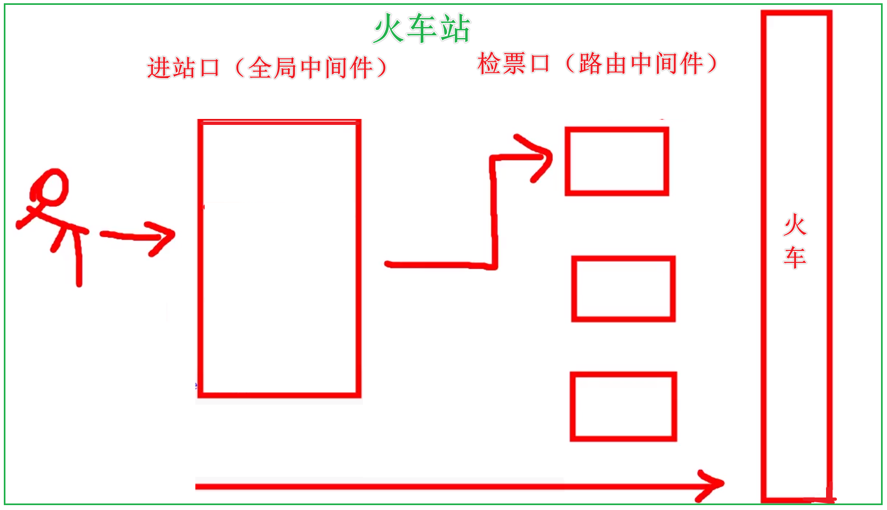

##### ① 定义全局中间件
`每一个请求` 到达服务端之后 `都会执行全局中间件函数`。

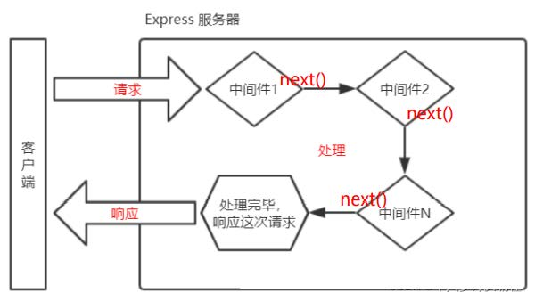

声明中间件函数

```javascript
let recordMiddleware = function(request,response,next){
  //实现功能代码
  //.....
  //执行next函数(当如果希望执行完中间件函数之后，仍然继续执行路由中的回调函数，必须调用next)
  next();
}
```

应用中间件

```javascript
app.use(recordMiddleware)
```

声明时可以直接将匿名函数传递给 `use`

```javascript
app.use(function (request, response, next) {
      console.log('定义第一个中间件');
    next();
})
```

##### ② 多个全局中间件
express 允许使用 app.use() 定义多个全局中间件

```javascript
app.use(function (request, response, next) {
      console.log('定义第一个中间件');
    next();
})
app.use(function (request, response, next) {
      console.log('定义第二个中间件');
    next();
})
```

##### ③ 定义路由中间件
如果<font style="color:red;">只需要对某一些路由进行功能封装</font>，则就需要路由中间件

调用格式如下：

```javascript
app.get('/路径',`中间件函数`,(request,response)=>{

});

app.get('/路径',`中间件函数1`,`中间件函数2`,(request,response)=>{

});
```

#### 4）静态资源中间件
express 内置处理静态资源的中间件

```javascript
//引入express框架
const express = require('express');
//创建服务对象
const app = express();
//静态资源中间件的设置，将当前文件夹下的public目录作为网站的根目录
app.use(express.static('./public')); //当然这个目录中都是一些静态资源
//如果访问的内容经常变化，还是需要设置路由
//但是，在这里有一个问题，如果public目录下有index.html文件，单独也有index.html的路由
//则谁书写在前，优先执行谁
app.get('/index.html',(request,response)=>{
    respsonse.send('首页');
});
//监听端口
app.listen(3000,()=>{
    console.log('3000 端口启动....');
});
```

> 注意事项:
>
> 1. index.html 文件为默认打开的资源
> 2. 如果静态资源与路由规则同时匹配，谁先匹配谁就响应
> 3. 路由响应动态资源，静态资源中间件响应静态资源
>

#### 5）获取请求体数据 body-parser
express 可以使用 `body-parser` 包处理请求体

第一步：安装

```shell
npm i body-parser
```

第二步：导入 body-parser 包

```javascript
const bodyParser = require('body-parser');
```

第三步：获取中间件函数

```javascript
//处理 querystring 格式的请求体
let urlParser = bodyParser.urlencoded({extended:false}));
//处理 JSON 格式的请求体
let jsonParser = bodyParser.json();
```

第四步：设置路由中间件，然后使用 `request.body` 来获取请求体数据

```javascript
app.post('/login', urlParser, (request,response)=>{
    //获取请求体数据
    console.log(request.body);
    //用户名
    console.log(request.body.username);
     //密码
      console.log(request.body.userpass);
      response.send('获取请求体数据');
});
```

获取到的请求体数据：

```javascript
[Object: null prototype] { username: 'admin', userpass: '123456' }
```

**注意:** 现在你已经可以抛弃 body-parser 模块，因为 Express 自从 4.16.0 版本开始，内置了 body 解析

**使用方法:**

```javascript
const express = require('express');

const app = express();
// 解析 JSON 格式的请求体的中间件
app.use(express.json())
// 解析 querystring 格式请求体的中间件
app.use(express.urlencoded({ extended: false }))
```


### 9.6 Router
#### 1）什么是 Router
express 中的 Router 是一个完整的中间件和路由系统，可以看做是一个小型的 app 对象。

#### 2）Router 作用
对路由进行模块化，更好的管理路由。

#### 3）Router 使用
创建独立的 JS 文件（homeRouter.js）

```javascript
//1. 导入 express
const express = require('express');

//2. 创建路由器对象
const router = express.Router();

//3. 在 router 对象身上添加路由
router.get('/', (req, res) => {
    res.send('首页');
})

router.get('/cart', (req, res) => {
    res.send('购物车');
});

//4. 暴露
module.exports = router;
```

主文件

```javascript
const express = require('express');

const app = express();
//5.引入子路由文件
const homeRouter = require('./routes/homeRouter');
//6.设置和使用中间件
app.use(homeRouter);

app.listen(3000,()=>{
    console.log('3000 端口启动....');
})
```

### 9.7 EJS 模板引擎
#### 1）什么是模板引擎
模板引擎是分离 <font style="color:red;">用户界面和业务数据</font> 的一种技术。

#### 2）什么是 EJS
官网: [https://ejs.co/](https://ejs.co/)  
中文站： [https://ejs.bootcss.com/](https://ejs.bootcss.com/)

EJS 是一个高效的 Javascript 的模板引擎。

#### 3）EJS 初体验
下载安装EJS

```shell
npm i ejs --save
```

代码示例

```javascript
//1.引入ejs
const ejs = require('ejs');
//2.定义数据
let person = ['张三','李四','王二麻子'];
//3.ejs解析模板返回结构
//<%= %> 是ejs解析内容的标记，作用是输出当前表达式的执行结构
//"<%= %>"可以直接输出变量或表达式的值，变量或表达式的值将作为一个字符串在浏览器中输出。
let html = ejs.render(‘<%= person.join(",") %>’, {person:person});
//4.输出结果
console.log(html);
```

命令行下运行

#### 4）EJS 常用语法
执行JS代码

```javascript
<% code %>
```

输出转义的数据到模板上

```javascript
<%= code %>
```

输出非转义的数据到模板上

```javascript
<%- code %>
```

#### 5）在express中使用ejs
```javascript
// 导入 express
const express = require('express')
const path = require('path')

// 创建应用对象
const app = express()
// 1. 设置模板引擎
app.set('view engine', 'ejs')  // pug  twing
// 2. 设置模板文件的存放位置
// 模板文件: 具有模板语法内容的文件
app.set('views', path.resolve(__dirname, './views'))

// 创建路由
app.get('/home', (req, res) => {
  // 3. render 响应
  // res.render('模板的文件名','数据')
  let title = '尚硅谷 - 让天下没有难学的技术'
  res.render('home', { title })
  // 4. 创建模板文件
  // 如下面文件 views/home.ejs
})

// 监听端口，启动服务
app.listen(3000, () => {
  console.log('服务器已启动~~~~')
})
```

`views/home.ejs`

```javascript
<!DOCTYPE html>
  <html lang="en">

  <head>
  <meta charset="UTF-8">
  <meta http-equiv="X-UA-Compatible" content="IE=edge">
  <meta name="viewport" content="width=device-width, initial-scale=1.0">
  <title>Document</title>

  </head>

  <body>
  <h2>
  <%=title %>
  </h2>

  </body>

  </html>

```

### 9.8 express-generator
通过应用生成器工具 `express-generator` 可以快速创建一个应用的骨架。

你可以通过 npm 将 Express 应用程序生成器安装到全局环境中并使用：

```shell
npm install -g express-generator
express
```

`express -h` 参数可以列出所有可用的命令行参数：

```shell
Usage: express [options] [dir]

  Options:

    -h, --help          输出使用方法
        --version       输出版本号
    -e, --ejs           添加对 ejs 模板引擎的支持
        --hbs           添加对 handlebars 模板引擎的支持
        --pug           添加对 pug 模板引擎的支持
    -H, --hogan         添加对 hogan.js 模板引擎的支持
        --no-view       创建不带视图引擎的项目
    -v, --view <engine> 添加对视图引擎（view） <engine> 的支持 (ejs|hbs|hjs|jade|pug|twig|vash) （默认是 jade 模板引擎）
    -c, --css <engine>  添加样式表引擎 <engine> 的支持 (less|stylus|compass|sass) （默认是普通的 css 文件）
        --git           添加 .gitignore
    -f, --force         强制在非空目录下创建
```

例如，如下命令创建了一个名称为 _myapp_ 的 Express 应用。此应用将在当前目录下的 _myapp_ 目录中创建，并且设置为使用 [Pug](https://pugjs.org/) 模板引擎（view engine）：

```shell
express --view=pug myapp

   create : myapp
   create : myapp/package.json
   create : myapp/app.js
   create : myapp/public
   create : myapp/public/javascripts
   create : myapp/public/images
   create : myapp/routes
   create : myapp/routes/index.js
   create : myapp/routes/users.js
   create : myapp/public/stylesheets
   create : myapp/public/stylesheets/style.css
   create : myapp/views
   create : myapp/views/index.pug
   create : myapp/views/layout.pug
   create : myapp/views/error.pug
   create : myapp/bin
   create : myapp/bin/www
```

然后安装所有依赖包：

```shell
$ cd myapp
$ npm install
```

在 Windows 命令行中，使用如下命令：

```shell
set DEBUG=myapp:* & npm start
```

然后在浏览器中打开 `http://localhost:3000/` 网址就可以看到这个应用了。

通过生成器创建的应用一般都有如下目录结构

```shell
.
├── app.js
├── bin
│   └── www
├── package.json
├── public
│   ├── images
│   ├── javascripts
│   └── stylesheets
│       └── style.css
├── routes
│   ├── index.js
│   └── users.js
└── views
    ├── error.pug
    ├── index.pug
    └── layout.pug

7 directories, 9 files
```

## 10、MongoDB
### 10.1 简介
#### 1）Mongodb 是什么
官方地址 [https://www.mongodb.com/](https://www.mongodb.com/)

MongoDB 是一个基于分布式文件存储的数据库。

#### 2）数据库是什么
数据库（DataBase）是按照数据结构来组织、存储和管理数据的 `应用程序`。

#### 3）数据库的作用
数据库的主要作用就是 `管理数据`，对数据进行 `增（c）、删（d）、改（u）、查（r）`。

#### 4）数据库管理数据的特点
相比于纯文件管理数据，数据库管理数据有如下特点：

1. 速度更快
2. 扩展性更强
3. 安全性更强

#### 5）为什么选择 Mongodb
操作语法与 JavaScript 类似，容易上手，学习成本低。

### 10.2 核心概念
Mongodb 中有三个重要概念需要掌握

+ 数据库（database） 数据库是一个数据仓库，数据库服务下可以创建很多数据库，数据库中可以存放很多集合
+ 集合（collection） 集合类似于 JS 中的数组，在集合中可以存放很多文档
+ 文档（document）   文档是数据库中的最小单位，类似于 JS 中的对象

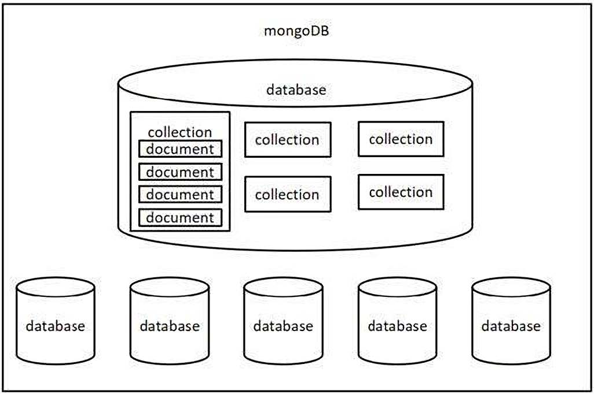

JSON 文件示例：

```json
{
    "accounts": [
      {
        "id": "3-YLju5f3",
          "title": "买电脑",
          "time": "2023-02-08",
          "type": "-1",
          "account": "5500",
          "remarks": "为了上网课"
      },
      {
          "id": "3-YLju5f4",
          "title": "请女朋友吃饭",
          "time": "2023-02-08",
          "type": "-1",
          "account": "214",
          "remarks": "情人节聚餐"
    },
    {
          "id": "mRQiD4s3K",
          "title": "发工资",
          "time": "2023-02-19",
          "type": "1",
          "account": "4396",
          "remarks": "终于发工资啦!~~"
     }
  ],
    "users":[
      {
          "id": 1,
          "name": "zhangsan",
        "age": 18
      },
      {
          "id": 2,
          "name": "lisi",
          "age": 20
      },
      {
          "id": 3,
          "name": "wangwu",
          "age": 22
      }
  ]
}
```

大家可以通过 JSON 文件来理解 Mongodb 中的概念

+ 一个 `JSON 文件` 好比是一个 `数据库`，一个 Mongodb 服务下可以有 N 个数据库
+ JSON 文件中的 `一级属性的数组值` 好比是 `集合`
+ 数组中的对象好比是 `文档`
+ 对象中的属性有时也称之为 `字段`

> 一般情况下
>
> + 一个项目使用一个数据库
> + 一个集合会存储同一种类型的数据
>

### 10.3 下载安装与启动
下载地址： [https://www.mongodb.com/try/download/community](https://www.mongodb.com/try/download/community)

#### 1）zip 格式安装
建议选择 `zip` 类型， 通用性更强

配置步骤如下:

	1> 将压缩包移动到 `C:\Program Files` 下，然后解压
	
	2> 创建 `C:\data\db` 目录，mongodb 会将数据默认保存在这个文件夹
	
	3> 以 mongodb 中 bin 目录作为工作目录，启动命令行
	
	4> 运行命令 `mongod`

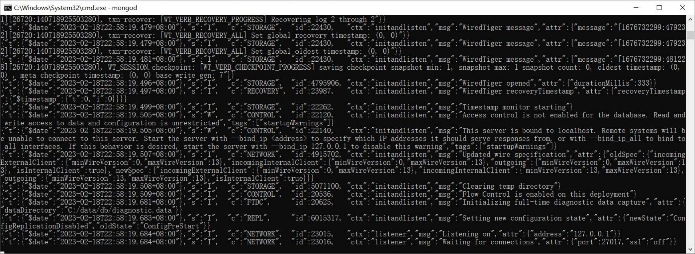

看到最后的 `waiting for connections` 则表明服务 `已经启动成功`

然后可以使用 `mongo` 命令连接本机的 mongodb 服务（MongoDB6.0版本后再无mongo.exe，需要额外下载，另 命令：`mongosh`）

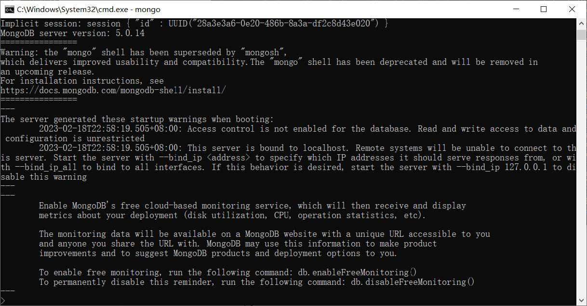

> 注意：
>
> + 为了方便后续方便使用 mongod 命令，可以将 bin 目录配置到环境变量 Path 中
> + `千万不要选中服务端窗口的内容`，选中会停止服务，可以 `敲回车` 取消选中
>

配置windows服务: [https://www.shuzhiduo.com/A/E35pAE6Ydv/](https://www.shuzhiduo.com/A/E35pAE6Ydv/)

修改`mongodb`数据库位置

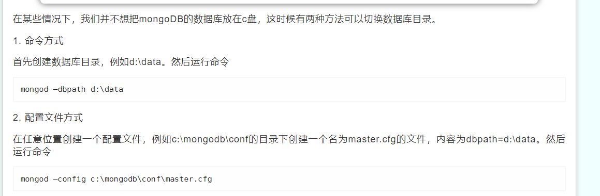

#### 2）msi格式安装
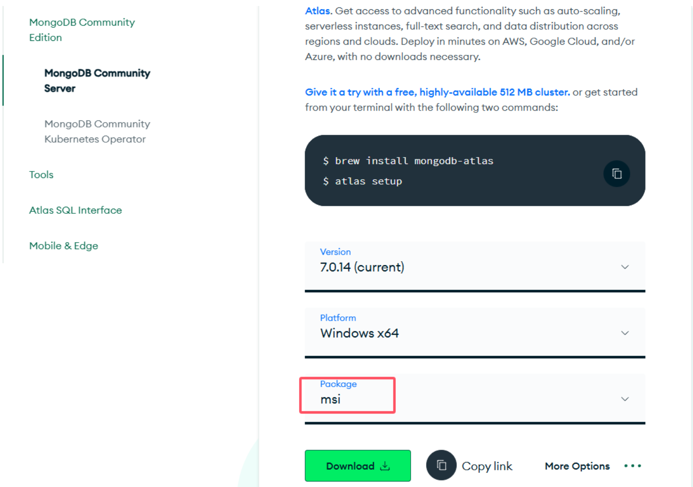

下载完成之后，找到下载好的文件双击  安装：

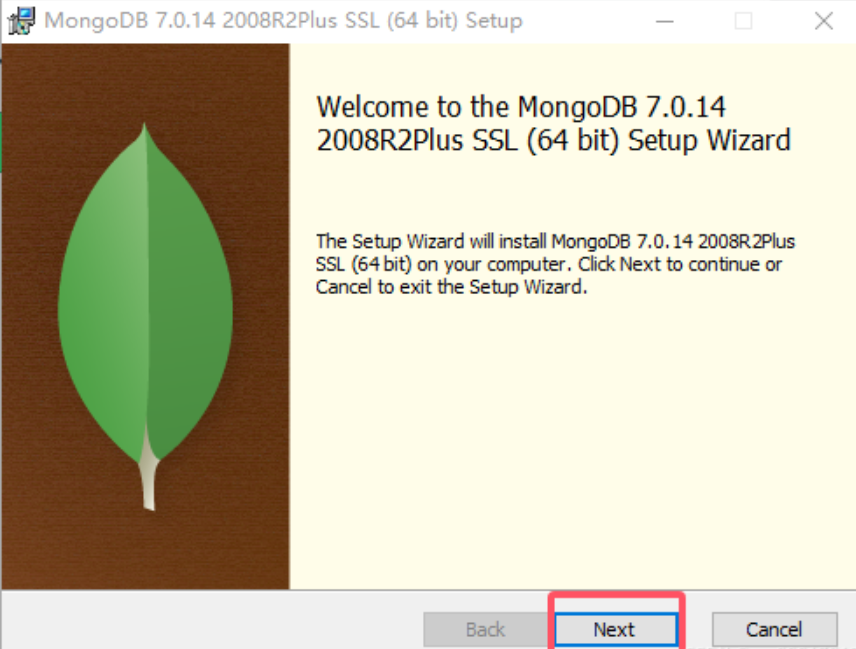


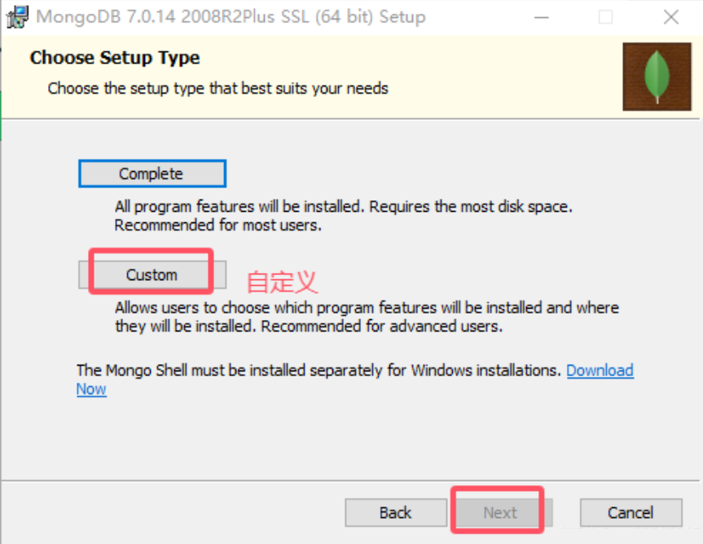

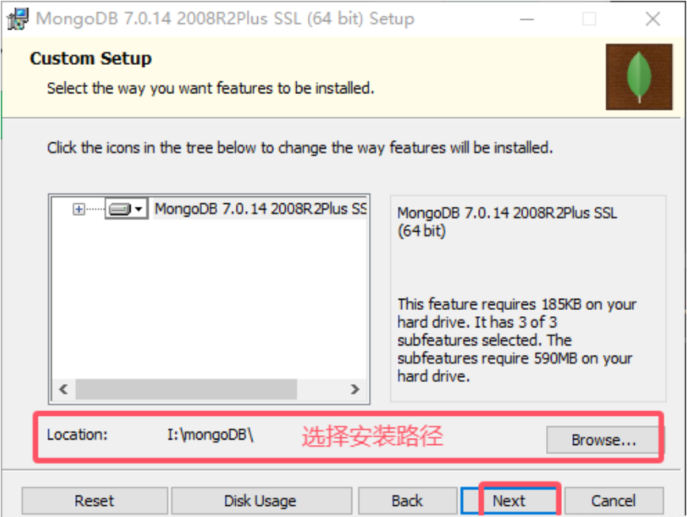


之后在桌面上会出现可是化窗口的图标，打开选择连接即可


### 10.4 命令行交互
命令行交互一般是学习数据库的第一步，不过这些命令在后续用的比较少，所以大家了解即可

#### 1）数据库命令
1. 显示所有的数据库

```sql
show dbs
```

2. 切换到指定的数据库，如果数据库不存在会自动创建数据库

```sql
use 数据库名
```

3. 显示当前所在的数据库

```sql
db
```

4. 删除当前数据库

```sql
use 库名
db.dropDatabase()
```

#### 2）集合命令
1. 创建集合

```sql
db.createCollection('集合名称')
```

2. 显示当前数据库中的所有集合

```sql
show collections
```

3. 删除某个集合

```sql
db.集合名.drop()
```

4. 重命名集合

```sql
db.集合名.renameCollection('newName')
```

#### 3）文档命令
1. 插入文档

```sql
db.集合名.insert(文档对象);
```

2. 查询文档

```javascript
db.集合名.find(查询条件)
```

<font style="color:red;">_id 是 mongodb 自动生成的唯一编号，用来唯一标识文档</font>

3. 更新文档

```sql
db.集合名.update(查询条件,新的文档)
db.集合名.update({name:'张三'},{$set:{age:19}})
```

4. 删除文档

```sql
db.集合名.remove(查询条件)
```

#### 4）应用场景
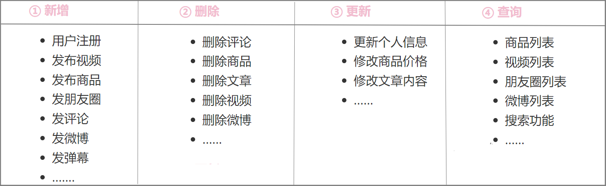

### 10.5 Mongoose
#### 1）介绍
官网： [http://www.mongoosejs.net/](http://www.mongoosejs.net/)

 Mongoose 是一个对象文档模型库。

#### 2）作用
方便使用代码操作 mongodb 数据库。


#### 3）使用流程
```javascript
 //1. 安装 mongoose  npm i mongoose@6.8.0
 //2. 导入 mongoose
 const mongoose = require('mongoose');

 //3. 连接数据库                              数据库名称
 mongoose.connect('mongodb://127.0.0.1:27017/bilibili');

 //4. 设置连接回调
 //连接成功   once 一次   事件回调函数只执行一次
mongoose.connection.on('open', () => {
    console.log('连接成功');
     //5. 创建文档结构对象
    // 设置集合中 文档的属性以及属性值得类型
     let BookSchema = new mongoose.Schema({
         title: String,
         author: String,
         price: Number
     });
     
     //6. 创建文档模型对象  对文档操作的封装对象  mongoose会使用集合名称的复数，创建集合
     let BookModel = mongoose.model('book', BookSchema);
    
     //7. 插入文档
     BookModel.create({
         title: '西游记',
         author: '吴承恩',
        price: 19.9
     }, (err, data) => {
        // 判断是否有错误
         if (err) throw err;
        //输出 data 对象  如果没有出错，则输出插入后的文档对象
         console.log(data);
         //8. 断开连接  关闭数据链接 (项目运行过程中，不会添加该代码)
         mongoose.disconnect();
     });
});

//连接出错
mongoose.connection.on('error', () => {
    console.log('连接出错~~');
})

//连接关闭
mongoose.connection.on('close', () => {
    console.log('连接关闭');
})
```

#### 4）字段类型
文档结构可选的常用字段类型列表

| 类型 | 描述 |
| --- | --- |
| `String` | 字符串 |
| `Number` | 数字 |
| `Boolean` | 布尔值 |
| `Array` | 数组，也可以使用 `[]` 来标识 |
| `Date` | 日期 |
| `Buffer` | Buffer 对象 |
| `Mixed` | 任意类型，需要使用 `mongoose.Schema.Types.Mixed` 指定 |
| `ObjectId` | 对象 ID，需要使用 `mongoose.Schema.Types.ObjectId` 指定 |
| `Decimal128` | 高精度数字，需要使用 `mongoose.Schema.Types.Decimal128` 指定 |


#### 5）字段值验证
Mongoose 有一些内建验证器，可以对字段值进行验证

##### ① 必填项
```javascript
title: {
    type: String,
     required: true // 设置必填项
},
```

##### ② 默认值
```javascript
author: {
     type: String,
     default: '匿名' //默认值
},
```

##### ③ 枚举值
```javascript
gender: {
    type: String,
    enum: ['男','女'] //设置的值必须是数组中的
},
```

##### ④ 唯一值
```javascript
username: {
    type: String,
     unique: true
},
```

> unique 需要 `重建集合` 才能有效果
>
> 永远不要相信用户的输入
>

#### 6）CURD
数据库的基本操作包括四个，增加（create），删除（delete），修改（update），查（read）

##### ① 增加
插入一条

```javascript
SongModel.create({
    title:'给我一首歌的时间',
     author: 'Jay'
}, function(err, data){
    //错误
    console.log(err);
    //插入后的数据对象
    console.log(data);
});
```

批量插入

```javascript
//1.引入mongoose
const mongoose = require('mongoose');

//2.链接mongodb数据库 connect 连接
mongoose.connect('mongodb://127.0.0.1:27017/project');

//3.设置连接的回调
mongoose.connection.on('open',()=>{
    //4.声明文档结构
    const PhoneSchema = new mongoose.Schema({
        brand:String,
        color:String,
        price:Number,
         tags:Array
    })
     //6.创建模型对象
     const PhoneModel = mongoose.model('phone',PhoneSchema);
     PhoneModel.insertMany([
         {
             brand:'华为',
             color:'灰色',
             price:2399,
             tags:['电量大','屏幕大','信号好']
         },
         {
             brand:'小米',
             color:'白色',
             price:2099,
             tags:['电量大','屏幕大','信号好']
         }
    ],(err,data)=>{
        if(err) throw err;
         console.log('写入成功');
         mongoose.connection.close();
    })
})
```

##### ② 删除
删除一条数据

```javascript
SongModel.deleteOne({_id:'5dd65f32be6401035cb5b1ed'}, function(err){
     if(err) throw err;
     console.log('删除成功');
    mongoose.connection.close();
});
```

批量删除

```javascript
SongModel.deleteMany({author:'Jay'}, function(err){
     if(err) throw err;
     console.log('删除成功');
    mongoose.connection.close();
});
```

##### ③ 更新
更新一条数据

```javascript
SongModel.updateOne({author: 'JJ Lin'}, {author: '林俊杰'}, function (err) {
    if(err) throw err;
    mongoose.connection.close();
});
```

批量更新数据

```javascript
SongModel.updateMany({author: 'Leehom Wang'}, {author: '王力宏'}, function (err) {
    if(err) throw err;
    mongoose.connection.close();
});
```

##### ④ 查询
查询一条数据

```javascript
SongModel.findOne({author: '王力宏'}, function(err, data){
    if(err) throw err;
    console.log(data);
    mongoose.connection.close();
});
//根据 id 查询数据
SongModel.findById('5dd662b5381fc316b44ce167',function(err, data){
    if(err) throw err;
    console.log(data);
    mongoose.connection.close();
});
```

批量查询数据

```javascript
//不加条件查询
SongModel.find(function(err, data){
    if(err) throw err;
    console.log(data);
    mongoose.connection.close();
});
//加条件查询
SongModel.find({author: '王力宏'}, function(err, data){
    if(err) throw err;
    console.log(data);
    mongoose.connection.close();
});
```

#### 7）条件控制
##### ① 运算符
在 mongodb 不能 > < >= <= !== 等运算符，需要使用替代符号

+ `>`使用 `$gt`
+ `<` 使用 `$lt`
+ `=` 使用 `$gte`
+ `<=` 使用 `$lte`
+ `!==` 使用 `$ne`

```javascript
db.students.find({id:{$gt:3}}); id号比3大的所有的记录

// 价格小于 20 的图书
BookModel.find({ price: { $lt: 20 } }, (err, data) => {
    if (err) {
        console.log('读取失败~~~')
        return
    }
    console.log(data)
})
```

##### ② 逻辑运算
`$or` 逻辑或的情况

```javascript
db.students.find({$or:[{age:18},{age:24}]});

// 曹雪芹 或者 余华的书
BookModel.find({ $or: [{ author: '曹雪芹' }, { author: '余华' }] }, (err, data)=>{
    if (err) {
      console.log('读取失败~~~')
      return
    }
    console.log(data)
})
```

`$and` 逻辑与的情况

```javascript
db.students.find({$and: [{age: {$lt:20}}, {age: {$gt: 15}}]});

// 价格大于 30 且 小于 70
BookModel.find({ $and: [{ price: { $gt: 30 } }, { price: { $lt: 70 } }] }, (err, data) => {
    if (err) {
      console.log('读取失败~~~')
      return
    }
    console.log(data)
})
```

##### ③ 正则匹配
条件中可以直接使用 JS 的正则语法，通过正则可以进行模糊查询

```javascript
db.students.find({name:/imissyou/});

正则表达式，搜索书籍名称中带有 '三' 的图书
BookModel.find({ name: /三/ }, (err, data) => {
    if (err) {
        console.log('读取失败~~~')
          return
    }
   console.log(data)
})

BookModel.find({ name: new RegExp('三') }, (err, data) => {
     if (err) {
          console.log('读取失败~~~')
          return
    }
    console.log(data)
})
```

#### 8）个性化读取
##### ① 字段筛选
```javascript
//0:不要的字段
//1:要的字段
SongModel.find().select({_id:0,title:1}).exec(function(err,data){
    if(err) throw err;
    console.log(data);
    mongoose.connection.close();
});
```

##### ② 数据排序
```javascript
// sort 排序
// 1:升序
// -1:倒序
SongModel.find().sort({hot:1}).exec(function(err,data){
    if(err) throw err;
    console.log(data);
    mongoose.connection.close();
});
```

##### ③ 数据截取
```javascript
//skip 跳过   limit 限定
SongModel.find().skip(10).limit(10).exec(function(err,data){
    if(err) throw err;
    console.log(data);
    mongoose.connection.close();
});
```


### 10.6 图形化管理工具
我们可以使用图形化的管理工具来对 Mongodb 进行交互，这里演示两个图形化工具

+ Robo 3T 免费 [https://github.com/Studio3T/robomongo/releases](https://github.com/Studio3T/robomongo/releases)
+ Navicat 收费 [https://www.navicat.com.cn/](https://www.navicat.com.cn/)


## 11、接口
### 11.1 简介
#### 1）接口是什么
接口是 <font style="color:red;">前后端通信的桥梁</font>，简单理解：一个接口就是 <font style="color:red;">服务中的一个路由规则</font> ，根据请求响应结果。

接口的英文单词是 API (Application Program Interface)，所以有时也称之为 `API 接口`。

这里的接口指的是『数据接口』， <font style="color:red;">与编程语言（Java，Go 等）中的接口语法不同</font>。

#### 2）接口的作用
实现 <font style="color:red;">前后端通信</font>。

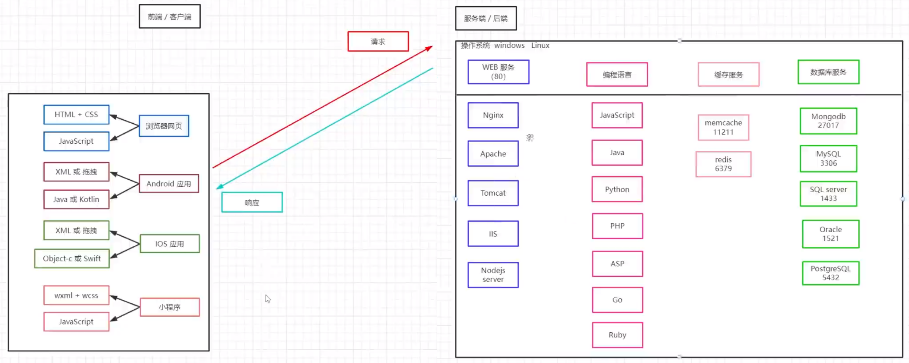

#### 3）接口的开发与调用
大多数接口都是由 <font style="color:red;">后端工程师</font> 开发的， <font style="color:red;">开发语言不限</font>。

一般情况下接口都是由 <font style="color:red;">前端工程师</font> 调用的，但有时 <font style="color:red;">后端工程师也会调用接口</font> ，比如短信接口，支付接口等。

#### 4）接口的组成
一个接口一般由如下几个部分组成

+ 请求方法
+ 接口地址（URL）
+ 请求参数
+ 响应结果

一个接口示例： [https://www.free-api.com/doc/325](https://www.free-api.com/doc/325)

体验一下： [https://api.asilu.com/idcard/?id=371522199111299668](https://api.asilu.com/idcard/?id=371522199111299668)

### 11.2 RESTful API
RESTful API 是一种特殊风格的接口，主要特点有如下几个：

+ URL 中的路径表示 <font style="color:red;">资源</font>，路径中不能有 `动词`，例如`create` , `delete` , `update` 等这些都不能有
+ 操作资源要与 `HTTP 请求方法` 对应
+ 操作结果要与 `HTTP 响应状态码` 对应

规则示例：

| 操作 | 请求类型 | URL | 返回 |
| --- | --- | --- | --- |
| 新增歌曲 | POST | /song | 返回新生成的歌曲信息 |
| 删除歌曲 | DELETE | /song/10 | 返回一个空文档 |
| 修改歌曲 | PUT | /song/10 | 返回更新后的歌曲信息 |
| 修改歌曲 | PATCH | /song/10 | 返回更新后的歌曲信息 |
| 获取所有歌曲 | GET | /song | 返回歌曲列表数组 |
| 获取单个歌曲 | GET | /song/10 | 返回单个歌曲信息 |


> 扩展阅读： [https://www.ruanyifeng.com/blog/2014/05/restful_api.html](https://www.ruanyifeng.com/blog/2014/05/restful_api.html)
>

#### 1） json-server
json-server 本身是一个 JS 编写的工具包，可以快速搭建 RESTful API 服务

官方地址: [https://github.com/typicode/json-server](https://github.com/typicode/json-server)

操作步骤：

1. 全局安装 `json-server`

```shell
npm i -g json-server
```

2. 创建 JSON 文件（db.json），编写基本结构

```json
{
    "song": [
        { "id": 1, "name": "干杯", "singer": "五月天" },
        { "id": 2, "name": "当", "singer": "动力火车" },
        { "id": 3, "name": "不能说的秘密", "singer": "周杰伦" }
    ]
}
```

3. `以 JSON 文件所在文件夹作为工作目录`，执行如下命令

```shell
json-server --watch db.json
```

默认监听端口为 `3000`

### 11.3 接口测试工具
  介绍几个接口测试工具  
  apipost [https://www.apipost.cn/](https://www.apipost.cn/) (中文)  
  apifox [https://www.apifox.cn/](https://www.apifox.cn/) (中文)  
  postman [https://www.postman.com/](https://www.postman.com/) (英文)


## 12、会话控制
### 12.1 介绍
所谓会话控制就是 <font style="color:red;">对会话进行控制</font>。

HTTP 是一种无状态的协议，它没有办法区分多次的请求是否来自于同一个客户端，<font style="color:red;">无法区分用户</font>。

而产品中又大量存在的这样的需求，所以我们需要通过 <font style="color:red;">会话控制</font> 来解决该问题。

常见的会话控制技术有三种：

+ cookie
+ session
+ token

### 12.2 cookie
#### 1）cookie 是什么
cookie 是 HTTP 服务器发送到用户浏览器并保存在本地的一小块数据。

<font style="color:red;">cookie 是保存在浏览器端的一小块数据</font>。

<font style="color:red;">cookie 是按照域名划分保存的</font>。

简单示例：

| 域名 | cookie |
| --- | --- |
| [www.baidu.com](http://www.baidu.com) | a=100; b=200 |
| [www.bilibili.com](http://www.bilibili.com) | xid=1020abce121; hm=112411213 |
| jd.com | x=100; ocw=12414cce |


#### 2）cookie 的特点
浏览器向服务器发送请求时，会自动将 `当前域名下` 可用的 cookie 设置在请求头中，然后传递给服务器。

这个请求头的名字也叫 `cookie` ，所以将 <font style="color:red;">cookie 理解为一个 HTTP 的请求头也是可以的</font>。

#### 3）cookie 的运行流程
填写账号和密码校验身份，校验通过后下发 cookie

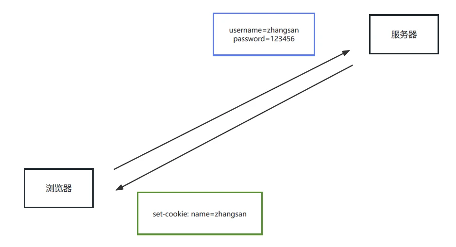  
有了 cookie 之后，后续向服务器发送请求时，就会自动携带 cookie

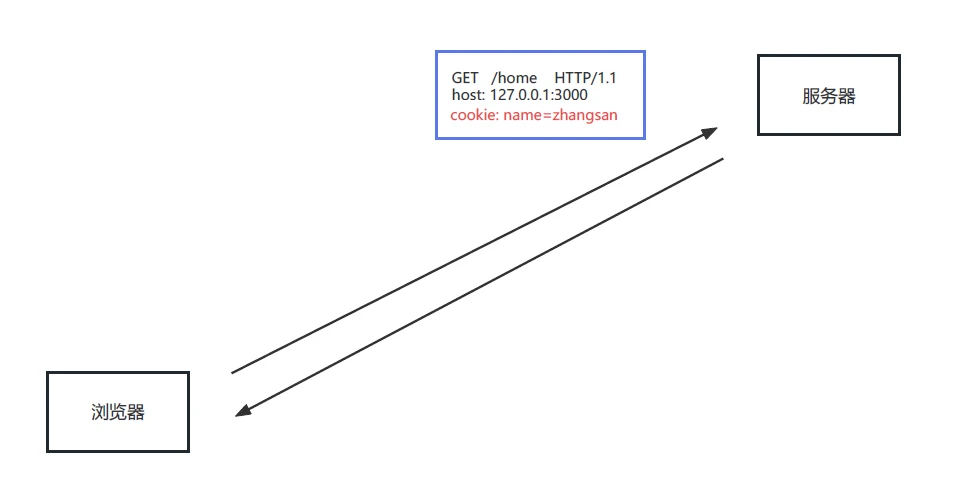

#### 4）浏览器操作 cookie
浏览器操作 cookie 的操作，使用相对较少，大家了解即可

1. 禁用所有 cookie
2. 删除 cookie
3. 查看 cookie

#### 5）cookie 的代码操作
express 中可以使用 `cookie-parser` 进行处理

```javascript
const express =require('express');
//1. 安装 cookie-parser	 npm i cookie-parser
//2. 引入 cookieParser 包
const cookieParser = require('cookie-parser');
  
const app = express();

//3. 设置 cookieParser 中间件
app.use(cookieParser());
  
//4-1 设置 cookie
app.get('/set-cookie', (request, response) => {
    // 不带时效性    会在浏览器关闭的时候，销毁
    response.cookie('username','wangwu');
      // 带时效性
      response.cookie('email','23123456@qq.com', {maxAge: 5*60*1000 });
      //响应
      response.send('Cookie的设置');
});

//4-2 读取 cookie
app.get('/get-cookie', (request, response) => {
    //读取 cookie
    console.log(request.cookies);
      //响应体
      response.send('Cookie的读取');
});

//4-3 删除cookie
app.get('/delete-cookie', (request, response) => {
    //删除
    response.clearCookie('username');
    //响应
    response.send('cookie 的清除');
});

//4. 启动服务
app.listen(3000, () => {
    console.log('服务已经启动....');
});
```

> 不同浏览器中的 cookie 是相互独立的，不共享
>

### 12.3 session
#### 1）session 是什么
session 是保存在 <font style="color:red;">服务器端的一块儿数据</font>，保存当前访问用户的相关信息。

#### 2）session 的作用
实现会话控制，可以识别用户的身份，快速获取当前用户的相关信息。

#### 3）session 运行流程
填写账号和密码校验身份，校验通过后创建 `session 信息`，然后将 `session_id` 的值通过响应头返回给浏览器

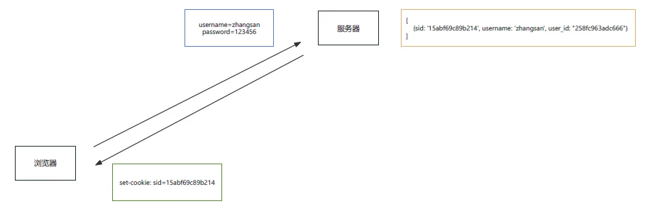

有了cookie，下次发送请求时会自动携带cookie，服务器通过 `cookie` 中的 `session_id` 的值确定用户的身份

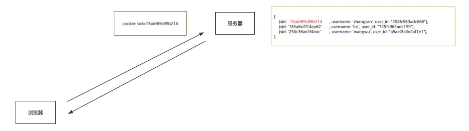

#### 4）session 的代码操作
express 中可以使用 `express-session` 对 session 进行操作

```javascript
const express = require('express');
//1. 安装包 npm i express-session connect-mongo
//2. 引入 express-session connect-mongo
const session = require("express-session");
const MongoStore = require('connect-mongo');

const app = express();

//3. 设置 session 的中间件
app.use(session({
    name: 'sid', //设置cookie的name，默认值是：connect.sid
    secret: 'atguigu', //参与加密的字符串（又称签名）  加盐
    saveUninitialized: false, //是否为每次请求都设置一个cookie用来存储session的id
    resave: true, //是否在每次请求时重新保存session
    store: MongoStore.create({
        mongoUrl: 'mongodb://127.0.0.1:27017/project' //数据库的连接配置
    }),
    cookie: {
        httpOnly: true, // 开启后前端无法通过 JS 操作
        maxAge: 1000 * 300 // 这一条 是控制 sessionID 的过期时间的！！！
    },
}))

//创建 session  session的设置
app.get('/login', (req, res) => {
    //设置session
    req.session.username = 'zhangsan';
    req.session.email = 'zhangsan@qq.com'
    res.send('登录成功');
})

//获取 session
app.get('/home', (req, res) => {
    console.log('session的信息');
    console.log(req.session.username);
    // 检测 session 是否存在用户数据
    if (req.session.username) {
        res.send(`你好 ${req.session.username}`);
    }else{
        res.send('登录 注册');
    }
})

//销毁 session
app.get('/logout', (req, res) => {
    //销毁session
    // res.send('设置session');
    req.session.destroy(() => {
        res.send('成功退出');
    });
});
app.listen(3000, () => {
    console.log('服务已经启动, 端口 ' + 3000 + ' 监听中...');
});
```


### 12.4 session 和 cookie 的区别
cookie 和 session 的区别主要有如下几点：

1. 存在的位置
    - cookie：浏览器端
    - session：服务端
2. 安全性
    - cookie 是以明文的方式存放在客户端的，安全性相对较低
    - session 存放于服务器中，所以安全性 `相对` 较好
3. 网络传输量
    - cookie 设置内容过多会增大报文体积， 会影响传输效率
    - session 数据存储在服务器，只是通过 cookie 传递 id，所以不影响传输效率
4. 存储限制
    - 浏览器限制单个 cookie 保存的数据不能超过 `4K` ，且单个域名下的存储数量也有限制
    - session 数据存储在服务器中，所以没有这些限制

### 12.5 token
#### 1）token 是什么
`token` 是服务端生成并返回给 HTTP 客户端的一串加密字符串， `token` 中保存着`用户信息`。

token 不属于 http 标准，完全由前后端协商而定，但 cookie 属于 http 标准。

#### 2）token 的作用
实现会话控制，可以识别用户的身份，主要用于移动端 APP。

#### 3）token 的工作流程
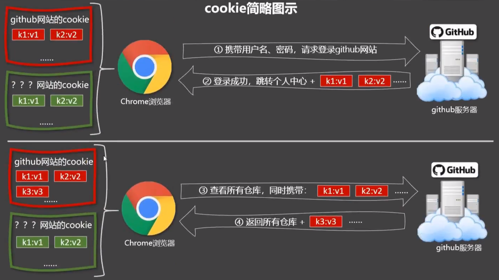

填写账号和密码校验身份，校验通过后响应 token，token 一般是在响应体中返回给客户端的

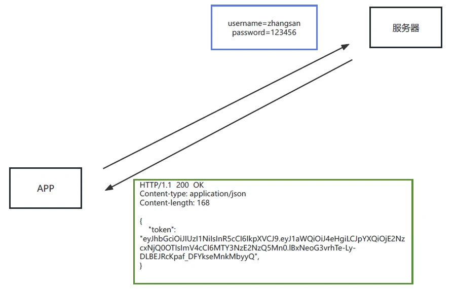  
后续发送请求时，需要`手动`将 token 添加在请求报文中(<font style="color:red;">cookie是自动携带的</font>)，一般是放在请求头中  
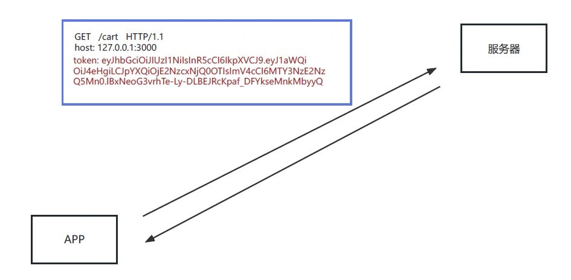

#### 4）token 的特点
+ 服务端压力更小
    - 数据存储在客户端
+ 相对更安全
    - 数据加密
    - 可以避免 CSRF（跨站请求伪造）
+ 扩展性更强
    - 服务间可以共享
    - 增加服务节点更简单

#### 5）JWT
JWT（JSON Web Token ）是目前最流行的跨域认证解决方案，可用于基于 `token` 的身份验证

JWT 使 token 的生成与校验更规范

我们可以使用 `jsonwebtoken 包` 来操作 token

```javascript
//导入 jsonwebtokan
const jwt = require('jsonwebtoken');

//创建 token
// jwt.sign(数据, 加密字符串, 配置对象)
let token = jwt.sign({
    username: 'zhangsan'
}, 'atguigu', {
    expiresIn: 60 //单位是 秒
})

//解析 token
// jwt.verify(token,加密字符串，回调函数)
jwt.verify(token, 'atguigu', (err, data) => {
    if(err){
        console.log('校验失败~~');
        return
    }
    console.log(data);// { username: '张三', iat: (创建时间), exp:(过期时间)}
})
```

> 扩展阅读： [https://www.ruanyifeng.com/blog/2018/07/json_web_token-tutorial.html](https://www.ruanyifeng.com/blog/2018/07/json_web_token-tutorial.html)
>

### 12.6 本地域名
所谓本地域名就是 <font style="color:red;">只能在本机使用的域名</font>，一般在开发阶段使用。

#### 1）操作流程
编辑文件 `C:\Windows\System32\drivers\etc\hosts`

```plain
127.0.0.1   www.baidu.com
```

如果修改失败，<font style="color:red;">可以修改该文件的权限</font>

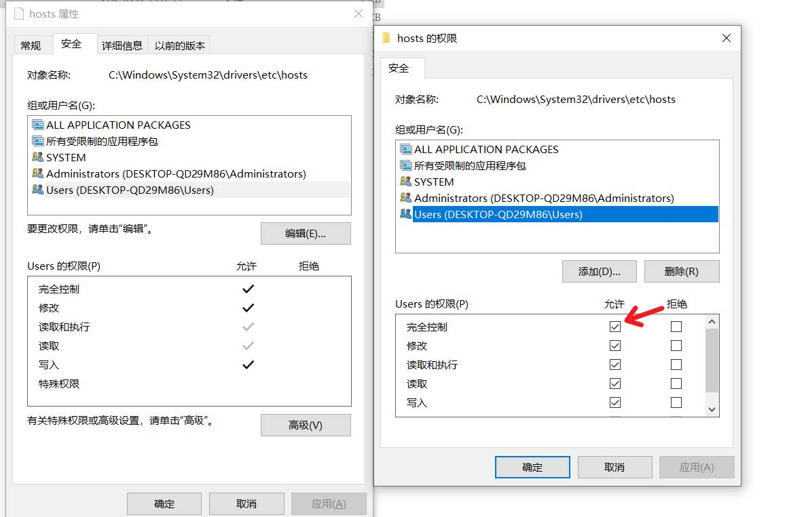

#### 2）原理
在地址栏输入 `域名` 之后，浏览器会先进行 DNS（Domain Name System）查询，获取该域名对应的 IP   
地址请求会发送到 DNS 服务器，可以 `根据域名返回 IP 地址`

可以通过 `ipconfig /all` 查看本机的 DNS 服务器

`hosts` 文件也可以设置域名与 IP 的映射关系，在发送请求前，可以通过该文件获取域名的 IP 地址
