## 1、Promise 介绍与基本使用
### 1.1 Promise 是什么
1. 抽象表达:
+ Promise 是一门新的技术(ES6 规范) 
+ Promise 是 JS 中`进行异步编程`的新解决方案 备注：旧方案是单纯使用回调函数
2. 具体表达:
+ 从语法上来说: Promise 是一个`构造函数`
+ 从功能上来说: promise 对象用来封装一个异步操作并可以获取其成功/ 失败的结果值

### 1.2 为什么要用Promise
1. 指定回调函数的方式更加灵活

> 旧的: 必须在启动异步任务前指定 
>
> promise: 启动异步任务 => 返回promie对象 => 给promise对象绑定回调函 数(甚至可以在异步任务结束后指定/多个)
>

2. 支持链式调用, 可以解决回调地狱问题

> 1）什么是回调地狱?
>
> ---回调函数嵌套调用, 外部回调函数异步执行的结果是嵌套的回调执行的条件
>
> 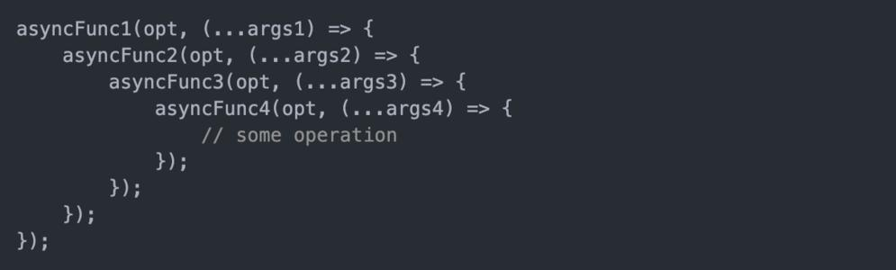
>
> 2）回调地狱的缺点?
>
> ---不便于阅读 不便于异常处理
>
> 3）解决方案?
>
> ---promise `链式调用`,用来解决回调地狱问题，但是`只是简单的改变格式`，并没有彻底解决上面的问题真正要解决上述问题，一定要利用promise再加上await和async关键字实现异步传同步
>
> 4）终极解决方案?
>
> ---promise +async/await
>

### 1.3 promise 的状态
#### 1）promise 的状态
promise 的状态指的是实例对象中的一个属性 『`PromiseState`』。

promise 的状态有三种:

+ pending  未决定的
+ resolved / fullfilled  成功
+ rejected  失败

#### 2）promise 的状态改变
1. pending 变为 resolved 
2. pending 变为 rejected

> 说明: 
>
> + `只有这 2 种`, 且一个 promise 对象`只能改变一次` 
> + 无论变为成功还是失败, 都会有一个结果数据
> + 成功的结果数据一般称为 value, 失败的结果数据一般称为 reason
>

### 1.4 promise 对象的值
promise 对象的值是该实例对象的另一个属性【`PromiseResult`】。

PromiseResult 保存着对象【成功/失败】的结果。

通过 `resolve` 或 `reject` 方法改变其结果值。

### 1.5 promise 的基本流程
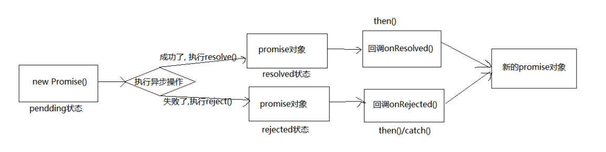

### 1.6 promise 的基本使用
#### 1）基于定时器封装
```javascript
/**
 * 案例需求：
 *  点击按钮，1s后显示是否中奖（30%概率）
 *      如果中奖 弹出 “恭喜恭喜，奖品为 10万 RMB 劳斯莱斯优惠劵”
 *      如果未中奖 弹出 “再接再厉”
*/

// 生成随机数
function rand(m, n) {
    return Math.ceil(Math.random() * (n - m + 1) + m - 1)
}

// 创建 Promise 对象
// resolve 解决 函数类型的数据
// reject  拒绝 函数类型的数据
const p = new Promise((resolve, reject) => {
    const btn = document.querySelector('button')
    btn.addEventListener('click', function () {
        setTimeout(() => {
            // 30% 100 取 30
            let num = rand(1, 100)
            // 定时器
            if (num <= 30) {
                resolve(num) // 将 promise 对象的状态设置为【成功】 
            } else {
                reject(num) // 将 promise 对象的状态设置为【失败】 
            }
        }, 1000);
    })
})

// 调用 then 方法 
// value 值 
// reason 理由
p.then(value => {
    alert('恭喜恭喜，奖品为 10万 RMB 劳斯莱斯优惠劵,您的中将数字为 ' + value)
}, (reason => {
    alert('再接再厉,您的号码为 ' + reason)
})
```

#### 2）基于 fs 模块封装
```javascript
/**
 * 需求：封装一个函数 mineReaddFile 读取文件内容
 *      参数：path 文件路径
 *      返回：promise 对象
 */
function minReadFile(path) {
    return new Promise((resolve, reject) => {
        // 读取文件
        require('fs').readFile(path, (err, data) => {
            // 判断
            if (err) reject(err)
            // 成功
            resolve(data)
        })
    })
}

minReadFile('./02-content.txt').
    then(value => {
        // 输出文件内容
        console.log(value.toString())
    }, reason => {
        console.log(reason)
    })
```

#### 3）基于 ajax 封装
```javascript
/**
 * 需求：封装一个函数 sendAjAX 发送 AJAX请求
 *      参数：URL
 *      返回结果：Promise 对象
 */
function sendAjAX(url) {
    return new Promise((resolve, reject) => {
        // 创建对象
        const xhr = new XMLHttpRequest()
        // 初始化
        xhr.open('GET', url)
        // 发送请求
        xhr.send()
        // 处理响应结果
        xhr.onreadystatechange = function () {
            if (xhr.readyState === 4) {
                // 判断响应状态
                if (xhr.status >= 200 && xhr.status < 300) {
                    resolve(xhr.response)
                } else {
                    reject(xhr.status)
                }
            }
        }
    })
}

sendAjAX('https://v2.alapi.cn/api/joke')
    .then(value => {
        console.log(value.toString())
    }, reason => {
        console.log(reason)
    })
```

#### 4）util.promisify方法
`util.promisify` 方法可以将函数直接变成promise的封装方式,不用再去手动封装。

```javascript
//引入 util 模块
const util = require('util');
//引入 fs 模块
const fs = require('fs');
//返回一个新的函数
let mineReadFile = util.promisify(fs.readFile);

mineReadFile('./resource/content.txt').then(value => {
  console.log(value.toString());
});
```

#### 5）异常穿透
可以在每个then()的第二个回调函数中进行err处理,也可以利用异常穿透特性,到最后用`catch`去承接统一处理,两者一起用时,前者会生效(因为err已经将其处理,就不会再往下穿透)而走不到后面的catch。

在每个.then()中我可以将数据再次传出给下一个then()。

```javascript
let p = new Promise((resolve, reject) => {
    setTimeout(() => {
        resolve('ok')
    }, 1000);
})

p.then(value => {
    console.log(111)
    throw '失败了'
}).then(value => {
    console.log(222)
}).then(value => {
    console.log(333)
}).catch(reason => {
    console.warn(reason)
})
```

## 2、Promise中的常用 API
### 3.1 Promise 构造函数
语法：`Promise (excutor) {}`

参数说明：

+ executor 函数: 执行器 (resolve, reject) => {}
+ resolve 函数: 内部定义成功时我们调用的函数 value => {} 
+ reject 函数: 内部定义失败时我们调用的函数 reason => {}

返回值：`promise 对象`

代码示例：

```javascript
let p = new Promise((resolve, reject) => {
    // 同步调用
    console.log(111)
})
console.log(2222)
```

> 说明: executor 会在 Promise 内部立即`同步调用`,异步操作在执行器中执行,换话说Promise支持同步也支持异步操作
>

### 3.2 then 方法
语法：`Promise.prototype.then(onResolved, onRejected) => {}`

参数说明：

+ onResolved 函数: 成功的回调函数 (value) => {} 
+ onRejected 函数: 失败的回调函数 (reason) => {}

返回值：`promise 对象`

代码示例：

```javascript
con
const p = new Promise((resolve, reject) => {
    if (num <= 30) {
        resolve(num) // 将 promise 对象的状态设置为【成功】 
    } else {
        reject(num) // 将 promise 对象的状态设置为【失败】 
    }
})

// 调用 then 方法   value 值 reason 理由
p.then(value => {
    alert('恭喜恭喜，奖品为 10万 RMB 劳斯莱斯优惠劵,您的中将数字为 ' + value)
}, (reason => {
    alert('再接再厉,您的号码为 ' + reason)
})
```

> 说明: 指定用于得到成功 value 的成功回调和用于得到失败 reason 的失败回调 返回一个新的 promise 对象
>

### 3.3 catch 方法
语法：`Promise.prototype.catch(onRejected) => {}`

参数说明：

+ onRejected 函数: 失败的回调函数 (reason) => {}

返回值：`promise 对象`

代码示例：

```javascript
let p = new Promise((resolve, reject) => {
    // 修改 promise 对象的状态
    reject('err')
})

// 执行 catch 方法
p.catch(reason => {
    console.log(reason)
})
```

> 说明: then()的语法糖, 相当于: then(undefined, onRejected)
>
> 异常穿透使用:当运行到最后,没被处理的所有异常错误都会进入这个方法的回调函数中
>

### 3.4 resolve 方法
语法：`Promise.resolve(value) => {}`

参数说明：

+ value: 成功的数据或 promise 对象

返回值：`promise 对象`

代码示例：

```javascript
//如果传入的参数为 非promise 类型的对象，则返回的结果为成功的 promise 对象
let p1 = Promise.resolve(521)
console.log(p1)
// 如果传入的参数为 promise 类型的对象，则参数的结果决定了 promise 的结果
let p2 = Promise.resolve(new Promise((resolve, reject) => {
    reject('Error')
}))
console.log(p2)

// 执行 catch 方法
p2.catch(reason => {
    console.log(reason)
})
```

> 说明: 返回一个成功/失败的 promise 对象,直接改变promise状态
>

### 3.5 reject 方法
语法：`promise.reject(reason) => {}`

参数说明：

+ reason: 失败的原因

返回值：`promise 对象`

代码示例：

```javascript
let p1 = Promise.reject(521)
let p2 = Promise.reject('iloveyou')
let p3 = Promise.reject(new Promise((reject, resolve) => {
    resolve('OK')
}))
console.log(p1)
console.log(p2)
console.log(p3)
```

> 说明: 说明: 返回一个失败的 promise 对象,直接改变promise状态
>

### 3.6 all 方法
语法：`Promise.all(promises) => {}`

参数说明：

+ promises: 包含 n 个 promise 的数组

返回值：`promise 对象`

代码示例：

```javascript
let p = new Promise((resolve, reject) => {
    resolve('OK')
})
// let p2 = Promise.resolve(521)
let p2 = Promise.reject('Error')
let p3 = Promise.resolve('iloveyou')
const result = Promise.all([p, p2, p3])
console.log(result)
```

> 说明: 返回一个新的 promise, 只有所有的 promise `都成功才成功`, 只要有一 个失败了就直接失败
>

### 3.7 race 方法
语法：`Promise.race(promises) => {}`

参数说明：

+ promises: 包含 n 个 promise 的数组

返回值：`promise 对象`

代码示例：

```javascript
let p1 = new Promise((resolve, reject) => {
    setTimeout(() => {
        resolve('OK')
    }, 1000);
})
let p2 = Promise.resolve('Success')
let p3 = Promise.resolve('Oh Yeah')
const result = Promise.race([p1, p2, p3])
console.log(result)
```

> 说明: 返回一个新的 promise, `第一个完成`的 promise 的结果状态就是最终的结果状态,
>
> 如p1延时,开启了异步,内部正常是同步进行,所以`p2>p3>p1`,结果是`P2`
>

## 3、Promise的几个关键问题
### 3.1 如何改变状态
如何改变 promise 的状态?

+ resolve(value): 如果当前是 pending 就会变为 resolved 
+ reject(reason): 如果当前是 pending 就会变为 rejected 
+ 抛出异常: 如果当前是 pending 就会变为 rejected

代码示例：

```javascript
let p = new Promise((resolve,reject)=>{
    // 1.resolve 函数
    // resolve('ok')
    // 2.reject 函数
    // reject('error')
    // 3.抛出异常
    throw '出错了'
})
console.log(p)
```

### 3.2 能否执行多个回调
一个 promise 指定多个成功/失败回调函数, 都会调用吗?

+ 当 promise `改变为对应状态时`都会调用,改变状态后,多个回调函数都会调用,并不会自动停止

代码示例：

```javascript
let p = new Promise((resolve,reject)=>{
    resolve('ok')
})
// 指定回调1
p.then(value=>{
    console.log(value)
})
// 指定回调2
p.then(value=>{
    alert(value)
})
```

### 3.3 指定回调的顺序问题
(1) 改变 promise 状态和指定回调函数谁先谁后?

+ 都有可能, 正常情况下是先指定回调再改变状态, 但也可以先改状态再指定回调 
+ 先指定回调再改变状态(`异步`):先指定回调--> 再改变状态 -->改变状态后才进入异步队列执行回调函数
+ 先改状态再指定回调(`同步`):改变状态 -->指定回调 `并马上执行`回调

（2）如何先改状态再`指定`回调?   -->注意:指定并不是执行

+ 在执行器中直接调用 resolve()/reject() -->即,不使用定时器等方法,执行器内直接同步操作 
+ 延迟更长时间才调用 then() 	-->即,在`.then()`这个方法外再包一层例如延时器这种方法


（3）什么时候才能得到数据? 

+ 如果先指定的回调, 那当状态发生改变时, 回调函数就会调用, 得到数据 
+ 如果先改变的状态, 那当指定回调时, 回调函数就会调用, 得到数据


```javascript
// 这是同步写法,这样写会先改变状态,再指定回调
let p1 = new Promise((resolve, rejecct) => {
    resolve('ok')
})
p1.then(value => {
    console.log(value)
})
// 异步写法,这样写会先指定回调,再改变状态
let p2 = new Promise((resolve, rejecct) => {
    setTimeout(() => {
        resolve('ok')
    }, 1000);
})
p2.then(value => {
    console.log(value)
})
```

### 3.4 then 方法返回的结果
promise.then()返回的新 promise 的结果状态由什么决定?

+ 由 then()指定的回调函数执行的结果决定 
+ 如果抛出异常, 新 promise 变为 rejected, reason 为抛出的异常 
+ 如果返回的是非 promise 的任意值, 新 promise 变为 resolved, value 为返回的值 
+ 如果返回的是另一个新 promise, 此 promise 的结果就会成为新 promise 的结果

代码示例：

```javascript
let p = new Promise((resolve, reject) => {
    resolve('ok')
})

let result = p.then(value => {
    // 2.抛出异常
    // throw '出问题了' // 新 promise 变为 rejected, reason 为抛出的异常
    // 3.返回结果是非 promise 对象
    // return '521' // 新 promise 变为 resolve, value 是返回值
    // 4.返回值是 promise 对象
    return new Promise((resolve, reject) => {
        resolve('success') // 新 promise 对象的结果由返回的 promise 对象决定
    })
}, reason => {
    console.warn(reason)
})
// 1.promise.then()返回的结果是 promise 对象
console.log(result)
```

### 3.5 串连多个操作任务
promise 如何串连多个操作任务?

+ promise 的 then()返回一个新的 promise, 可以开成 then()的链式调用 
+ 通过 then 的链式调用串连多个同步/异步任务,这样就能用`then()`将多个同步或异步操作串联成一个同步队列

代码示例：

```javascript
let p = new Promise((resolve,reject)=>{
    setTimeout(() => {
        resolve('ok')
    }, 1000);
})

p.then(value=>{
    return new Promise((resolve,reject)=>{
        resolve('success')
    }) 
}).then(value=>{
    console.log(value) // seccess
}).then(value=>{
    console.log(value) // undefined 因为前面没返回值
})
```

### 3.6 promise 异常传透
promise 异常传透是什么？

+ 当使用 promise 的 then 链式调用时, 可以在最后指定失败的回调
+ 前面任何操作出了异常, 都会传到最后失败的回调中处理

代码示例：

```javascript
let p=new Promise((resolve,reject)=>{
    setTimeout(() => {
        resolve('ok')
    }, 1000);
})

p.then(value=>{
    console.log(111)
    throw '失败了'
}).then(value=>{
    console.log(222)
}).then(value=>{
    console.log(333)
}).catch(reason=>{
    console.warn(reason)
})
```

### 3.7 中断 promise 链
如何中断 promise 链？

+ 在回调函数中返回一个 `pendding` 状态的`promise 对象`


```javascript
let p = new Promise((resolve, reject) => {
    resolve('ok')
})

p.then(value => {
    console.log(111)
    // 仅由一种中断方式
    return new Promise(() => { })
}).then(value => {
    console.log(222)
}).then(value => {
    console.log(333)
})
```

## 4、手写 Promise
### 4.1 初始结构搭建
目录结构：


index.html，首先我们先看看 promse 的基本用法

```html
<!DOCTYPE html>
<html lang="en">
<head>
    <meta charset="UTF-8">
    <meta http-equiv="X-UA-Compatible" content="IE=edge">
    <meta name="viewport" content="width=device-width, initial-scale=1.0">
    <title>Document</title>

    <!-- 引入我们自己封装的 Promise -->
    <script src="./promise.js"></script>

</head>

<body>
    <script>
        let p = new Promise((resolve, reject) => {
            resolve('ok')
        })
        p.then(value => {
            console.log(value)
        }, reason => {
            console.log(reason)
        })
    </script>

</body>

</html>
```

promise.js，用我们自己封装的 promise 覆盖掉原来的 promise

```javascript
// 声明构造函数
function Promise(executor){}
//添加 then 方法
Promise.prototype.then = function(onResolved, onRejected){}
```

### 4.2 resolve 与 reject 实现
我们先实现 promise 中的执行器函数 `executor`


promise.js，先把结构搭起来

```javascript
...
// 声明构造函数
function Promise(executor) {
    // resolve 函数
    function resolve(data){

    }
    // reject 函数
    function reject(data){

    }
    // 同步调用【执行器函数】
    executor(resolve,reject)
}
...
```

> 思考一下 resolve 和 reject 执行后有什么效果？  
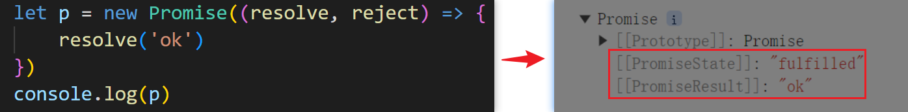
>
> + promise 的 状态 发送改变
> + promise 的 结果值 发送改变
>

promise.js，下面我们来实现 resolve 和 reject 的功能

```javascript
...
function Promise(executor) {
    // 添加属性
    this.PromiseState = 'pending'
    this.PromiseResult = null
    // 保存实例对象的 this 值
    const self = this

    // resolve 函数
    function resolve(data) {
        // 1.修改对象的状态(PromiseState)
        self.PromiseState = 'fulfilled'
        // 2.设置对象的结果值
        self.PromiseResult = data
    }
    // reject 函数
    function reject(data) {
        // 1.修改对象的状态(PromiseState)
        self.PromiseState = 'rejected'
        // 2.设置对象的结果值
        self.PromiseResult = data
    }
    // 同步调用【执行器函数】
    executor(resolve, reject)
}
...
```

### 4.3 throw 抛出异常改变状态
> 思考：抛出异常，promise 会发生什么变化？
>
> 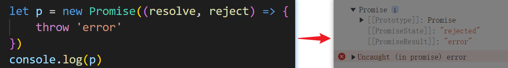
>
> + promise 的状态发送变化
> + 抛出的结果为 promise 的结果值
>

promise.js，实现throw 抛出异常改变状态并改变结果值

```javascript
...
// 1.throw 抛出异常改变状态 
try {
    // 同步调用【执行器函数】
    executor(resolve, reject)
} catch (e) {
    // 2.修改 promise 状态为失败
    reject(e)
}
...
```

### 4.4 状态只能修改一次
> 到目前为止，我们发现程序似乎有一点问题
>
> 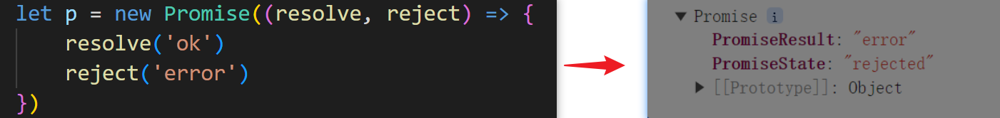
>
> resolve 和 reject 都执行了一次，这显然是不行的
>

promise.js，以下我们来解决这个问题，让状态只能修改一次

```javascript
...
// resolve 函数
function resolve(data) {
    // 1.判断状态
    if (self.PromiseState !== 'pending') return
    // 修改对象的状态(PromiseState)
    self.PromiseState = 'fulfilled'
    // 设置对象的结果值
    self.PromiseResult = data
}
// reject 函数
function reject(data) {
    // 1.判断状态
    if (self.PromiseState !== 'pending') return
    // 修改对象的状态(PromiseState)
    self.PromiseState = 'rejected'
    // 设置对象的结果值
    self.PromiseResult = data
}
...
```

### 4.5 then 方法实现
> 让我们看一下内置 then 执行后的表现
>
> 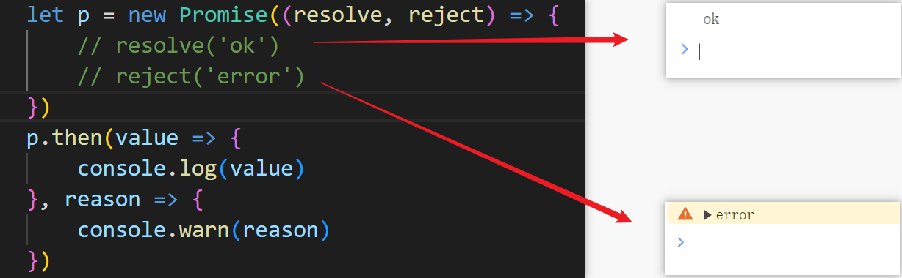
>

promise.js，以下让我们来实现 then 方法

```javascript
...
    // 调用回调函数
    // 1.成功时的回调
    if (this.PromiseState === 'fulfilled') {
        onReslove(this.PromiseResult)
    }
    // 2.失败时的回调
    if (this.PromiseState === 'rejected') {
        onReject(this.PromiseResult)
    }
...
```

### 4.6 异步任务 then 方法实现
> 现在 then 方法似乎已经实现了，但是当我们执行以下代码时就会出现问题（then 方法不执行）
>
> 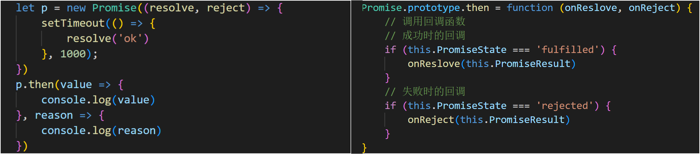
>
> 这是因为程序异步进行，先走了 then 方法，此时 promise 的状态不发生改变，仍为 pending
>

promise.js，以下我们来实现 then 方法异步任务

```javascript
function Promise(executor) {
    ...
    // 1.then 的回调函数
    this.callback = {}
    ...
    // resolve 函数
    function resolve(data) {
        ...
        self.PromiseResult = data
        // 4.调用成功的回调函数
        if (self.callback.onReslove) {
            self.callback.onReslove(data)
        }
    }
    // reject 函数
    function reject(data) {
        ...
        self.PromiseResult = data
        // 5.调用失败的回调函数
        if (self.callback.onReject) {
            self.callback.onReject(data)
        }
    }

// 添加 then 方法
Promise.prototype.then = function (onReslove, onReject) {
    ...
    // 2.判断 pending 状态
    if (this.PromiseState === 'pending') {
        // 3.保存回调函数
        this.callback = {
            onReject,
            onReslove
        }
    }
}
```

### 4.7 指定多个回调
> 当我们执行多个回调，会发现 then 方法又出问题了
>
> 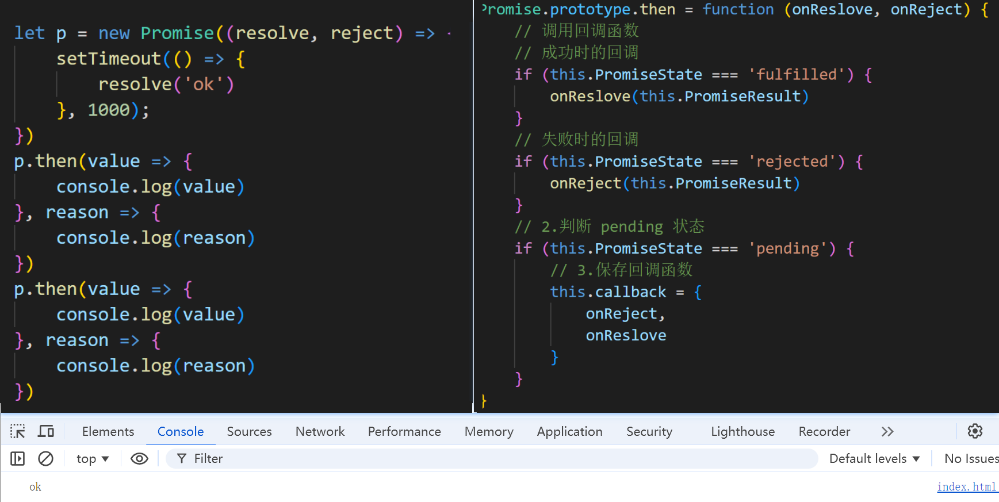
>
> 这是因为执行第一个 then 方法时改变了 pending 的值，所以后面的 then 方法不会执行
>

promise.js，以下我们来实现 then 方法指定多个回调

```javascript
// 声明构造函数
function Promise(executor) {
    ...
    // 1.then 的回调函数
    // this.callback = {}
     this.callback = []
    ...
    
    // resolve 函数
    function resolve(data) {
        ...
        self.PromiseResult = data
        // 3.调用成功的回调函数
        // if (self.callback.onReslove) {
        //     self.callback.onReslove(data)
        // }
        self.callbacks.forEach(item => {
            item.onReslove(data)
        })
    }
    // reject 函数
    function reject(data) {
        ...
        self.PromiseResult = data
        // 4.调用失败的回调函数
        // if (self.callback.onReject) {
        //     self.callback.onReject(data)
        // }
        self.callbacks.forEach(item => {
            item.onReject(data)
        })
    }
    ...
}

// 添加 then 方法
Promise.prototype.then = function (onReslove, onReject) {
    ...
    // 判断 pending 状态
    if (this.PromiseState === 'pending') {
        // 2.保存回调函数
        // this.callback = function(){
        //    onReject,
        //    onReslove
        // }
        this.callbacks.push({
            onReject,
            onReslove
        })
    }
}
```

### 4.8 同步任务 then 返回结果
> 让我们回顾一下 then 方法返回结果有什么特点
>
> 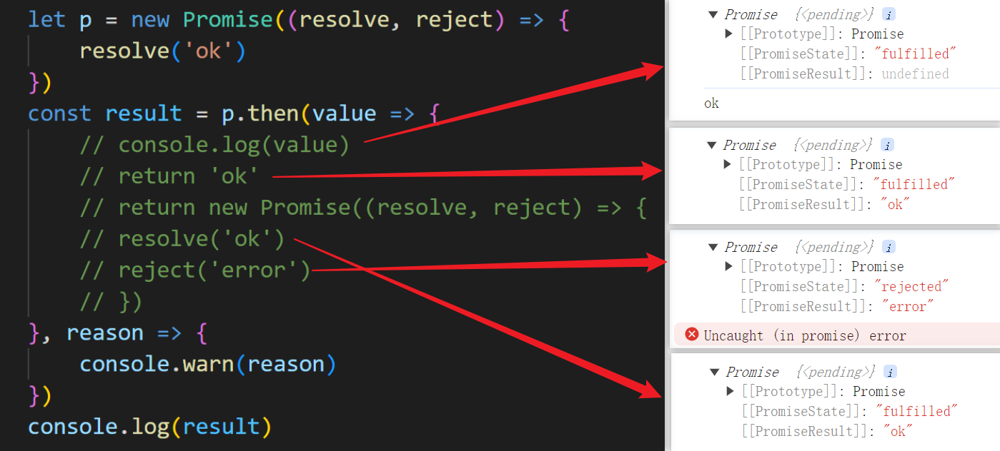
>
> + then 的返回值是一个 promise 对象，该对象的状态由 then()指定的回调函数执行的结果决定
> + 如果抛出异常, 新 promise 变为 rejected, reason 为抛出的异常 
> + 如果返回的是非 promise 的任意值, 新 promise 变为 resolved, value 为返回的值 
> + 如果返回的是另一个新 promise, 此 promise 的结果就会成为新 promise 的结果
>

promise.js，以下让我们来实现同步任务 then 返回结果

```javascript
...
// 添加 then 方法
Promise.prototype.then = function (onReslove, onReject) {
    // 1.返回一个 promise 对象  
    return new Promise((resolve, reject) => {
        // 调用回调函数
        // 成功时的回调
        if (this.PromiseState === 'fulfilled') {
            try {
                // 2.获取回调函数执行结果
                // onReslove(this.PromiseResult)
                let result = onReslove(this.PromiseResult)
                // 3.判断
                if (result instanceof Promise) {
                    // 4.如果是 promise 类型的对象
                    result.then(v => {
                        resolve(v)
                    }, r => {
                        reject(r)
                    })
                } else {
                    // 5.结果对象状态为【成功】
                    resolve(result)
                }
            } catch (e) {
                // 6.抛出异常更新 promise 状态
                reject(e)
            }
        }
     ...
    })
}
```

### 4.9 异步任务 then 返回结果
> 当我们用定时器去执行代码，会发现 then 方法返回的结果脱离了我们的预期
>
> 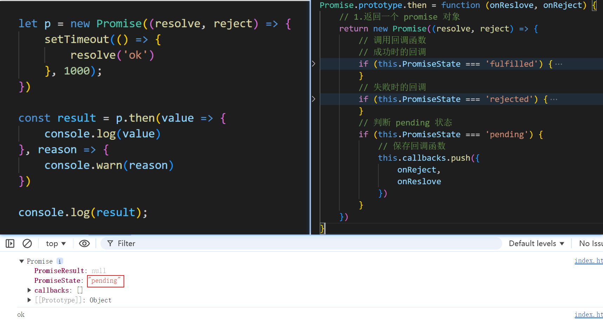
>
> 这是因为 p 还未调用 resolve 就执行了 then 回调，此时的状态为 pending
>

promise.js，以下让我们实现异步任务 then 返回结果

```javascript
...
// 添加 then 方法
Promise.prototype.then = function (onReslove, onReject) {
    // 2.保存 this
    const self = this
    // 返回一个 promise 对象  
    return new Promise((resolve, reject) => {
        ...
        // 判断 pending 状态
        if (this.PromiseState === 'pending') {
            // 1.保存回调函数
            this.callbacks.push({
                // onReject,
                // onReslove
                onReslove: function () {
                    try {
                        // 3.执行成功的回调
                        let result = onReslove(self.PromiseResult)
                        // 4.判断
                        if (result instanceof Promise) {
                            result.then(v => {
                                resolve(v)
                            }, r => {
                                reject(r)
                            })
                        } else {
                            resolve(result)
                        }
                    } catch (e) {
                        // 5.抛出异常时改变状态
                        reject(e)
                    }
                },
                onReject: function () {
                    try {
                        // 3.执行成功的回调
                        let result = onReject(self.PromiseResult)
                        // 4.判断
                        if (result instanceof Promise) {
                            result.then(v => {
                                resolve(v)
                            }, r => {
                                reject(r)
                            })
                        } else {
                            resolve(result)
                        }
                    } catch (e) {
                        // 5.抛出异常时改变状态
                        reject(e)
                    }
                }
            })
        }
    })
}
```

### 4.10 then方法完善与优化
> 经一番测试，我们发现 reject 回调有点问题
>
> 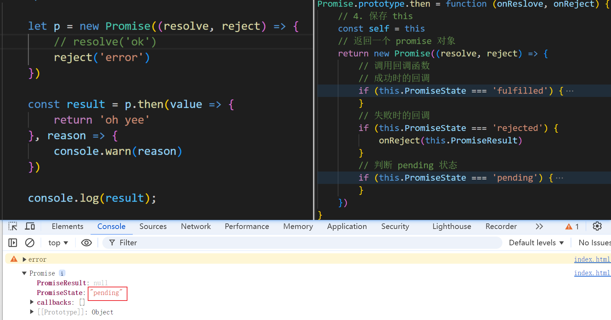
>
> 原因：在 4.8 时 我们忘记给 reject 回调做处理了
>

promise.js，下面我们来完善一下代码

```javascript
// 添加 then 方法
Promise.prototype.then = function (onReslove, onReject) {
    // 保存 this
    const self = this
    // 返回一个 promise 对象  
    return new Promise((resolve, reject) => {
        ...
        // 失败时的回调
        if (this.PromiseState === 'rejected') {
            try {
                // 1.获取回调函数执行结果
                // onReject(this.PromiseResult)
                let result = onReject(this.PromiseResult)
                // 2.判断
                if (result instanceof Promise) {
                    // 3.如果是 promise 类型的对象
                    result.then(v => {
                        resolve(v)
                    }, r => {
                        reject(r)
                    })
                } else {
                    // 4.结果对象状态为【成功】
                    resolve(result)
                }
            } catch (e) {
                // 5.抛出异常更新 promise 状态
                reject(e)
            }
        }
        ...
    }
}
```

> 现在我们看一下代码，会发现很多代码是重复的
>
> 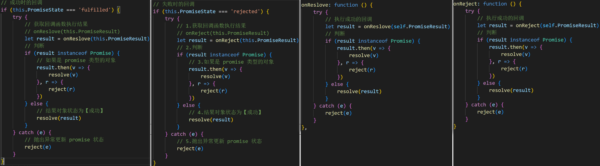

promise.js，下面我们将代码抽取出来

```javascript
...
// 添加 then 方法
Promise.prototype.then = function (onReslove, onReject) {
    // 保存 this
    const self = this
    // 返回一个 promise 对象  
    return new Promise((resolve, reject) => {
        // 1.封装函数
        function callback(type) {
            try {
                // 获取回调函数执行结果
                let result = type(self.PromiseResult)
                // 判断
                if (result instanceof Promise) {
                    // 如果是 promise 类型的对象
                    result.then(v => {
                        resolve(v)
                    }, r => {
                        reject(r)
                    })
                } else {
                    // 结果对象状态为【成功】
                    resolve(result)
                }
            } catch (e) {
                // 抛出异常更新 promise 状态
                reject(e)
            }
        }
        // 调用回调函数
        // 2.成功时的回调
        if (this.PromiseState === 'fulfilled') {
            callback(onReslove)
        }
        // 3.失败时的回调
        if (this.PromiseState === 'rejected') {
            callback(onReject)
        }
        // 判断 pending 状态
        if (this.PromiseState === 'pending') {
            // 4.保存回调函数
            this.callbacks.push({
                onReslove: function () {
                    callback(onReslove)
                },
                onReject: function () {
                    callback(onReject)
                }
            })
        }
    })
}
```

### 4.11 catch 方法实现
> 让我们看看内置 catch 方法的表现
>
> 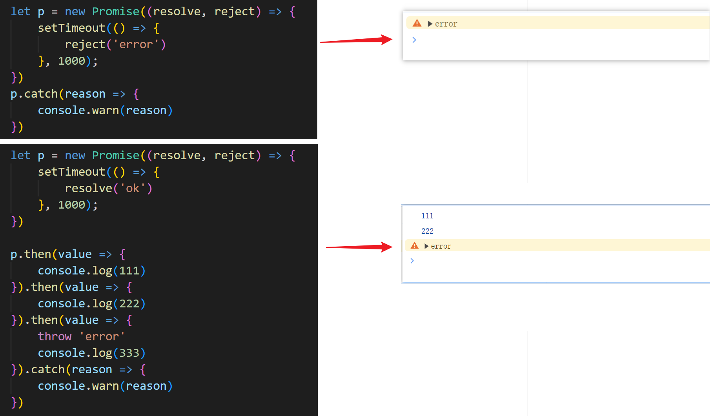

promise.js，下面让我们来实现 catch 方法

```javascript
...
// 添加 then 方法
Promise.prototype.then = function (onReslove, onReject) {
    // 保存 this
    const self = this
    // 2.判断回调函数参数
    if (typeof onReject !== 'function') {
        onReject = reason => {
            throw reason
        }
    }
    if (typeof onReslove !== 'function') {
        onReslove = value => value
    }
    ...
}

// 1.添加 catch 方法
Promise.prototype.catch = function (onReject) {
    return this.then(undefined, onReject)
}
```

### 4.12 resolve 方法封装
> 让我们看看内置 resolve 方法的表现
>
> 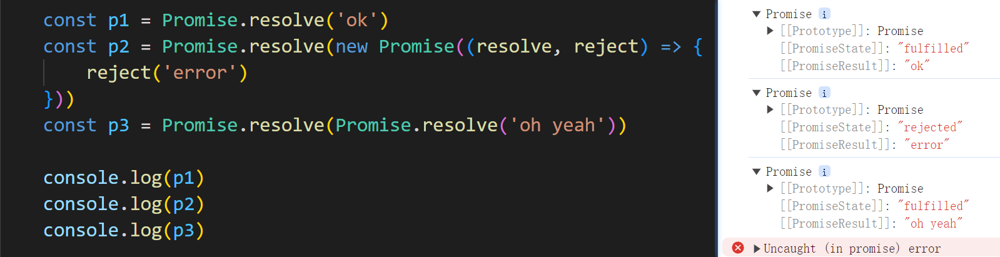

promise.js，下面让我们来实现 resolve 方法封装

```javascript
...
// 1.添加 resolve 方法
Promise.resolve = function (value) {
    // 2.返回 promise 对象
    return new Promise((resolve, reject) => {
        if (value instanceof Promise) {
            value.then(v => {
                resolve(v)
            }, r => {
                reject(r)
            })
        } else {
            // 3.状态设置为成功
            resolve(value)
        }
    })
}
```

### 4.13 reject 方法封装
> 让我们看看内置 reject 方法的表现
>
> 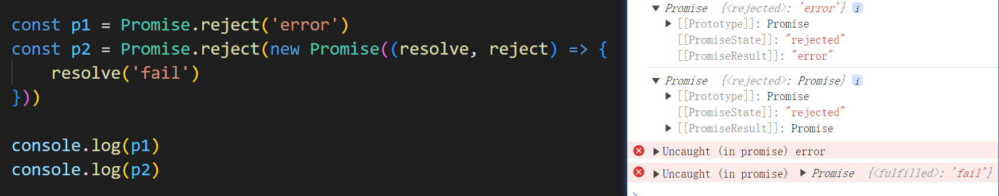

promise.js，下面让我们来实现 reject方法封装

```javascript
...
// 添加 reject 方法
Promise.reject = function (reason) {
    return new Promise((resolve, reject) => {
        reject(reason)
    })
}
```

### 4.14 all 方法封装
> 让我们看看内置 all 方法的表现
>
> 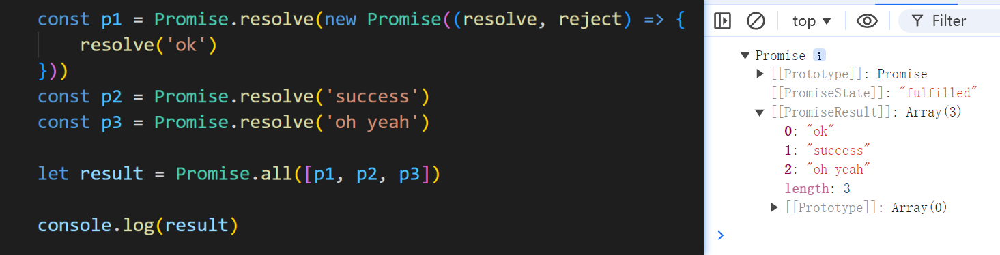

promise.js，下面让我们来实现 all 方法封装

```javascript
...
// 添加 all 方法
Promise.all = function (promises) {
    // 返回结果为 promise 对象
    return new Promise((resolve, reject) => {
        // 声明变量
        let count = 0
        let arr = []
        // 遍历
        for (let i = 0; i < promises.length; i++) {
            promises[i].then(v => {
                // 得知对象的状态是成功
                // 每个 promise 对象都成功
                count++
                // 将当前 promise 对象成功的结果存入数组
                arr[i] = v
                // 判断
                if (count === promises.length) {
                    // 修改状态
                    resolve(arr)
                }
            }, r => {
                reject(r)
            })

        }
    })
}
```

### 4.15 race 方法封装
> 让我们看看内置 race 方法的表现
>
> 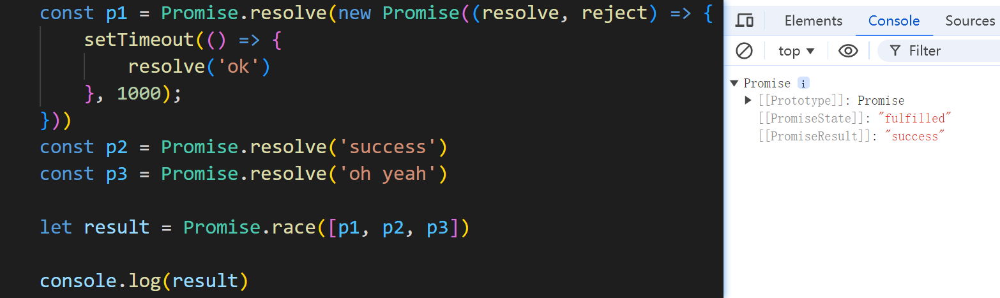

promise.js，下面让我们来实现 race 方法封装

```javascript
...
// 添加 race 方法
Promise.race = function (promises) {
    return new Promise((resolve, reject) => {
        for (let i = 0; i < promises.length; i++) {
            promises[i].then(v => {
                // 修改返回对象状态为【成功】
                resolve(v)
            }, r => {
                // 修改返回对象状态为【失败】
                reject(r)
            })
        }
    })
}
```

### 4.16 一个被遗漏的细节
> 异步调用 then 方法时，我们发现我们写的 promise 与内置 promise 结果不同
>
> 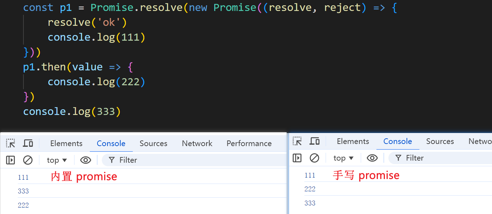
>

promise.js，下面让我们来实现一下

```javascript
// 声明构造函数
function Promise(executor) {
    ...
    // resolve 函数
    function resolve(data) {
        ...
        self.callbacks.forEach(item => {
            // 1.设置定时器
            setTimeout(() => {
                item.onReslove(data)
            })
        })
    }
    // reject 函数
    function reject(data) {
        ...
        // 调用失败的回调函数
        self.callbacks.forEach(item => {
            //  2.设置定时器
            setTimeout(() => {
                item.onReject(data)
            },);
        })
    }
    ...
}

// 添加 then 方法
Promise.prototype.then = function (onReslove, onReject) {
    ...
    // 返回一个 promise 对象  
    return new Promise((resolve, reject) => {
        // 封装函数
        function callback(type) {
            ...
        }
        // 调用回调函数
        // 成功时的回调
        if (this.PromiseState === 'fulfilled') {
            // 3.设置定时器
            setTimeout(() => {
                callback(onReslove)
            })
        }
        // 失败时的回调
        if (this.PromiseState === 'rejected') {
            // 4.设置定时器
            setTimeout(() => {
                callback(onReject)
            })
        }
        ...
    })
}
```

### 4.17 class 版本的实现
> 代码太多，放在demo文件里了
>

## 5、Promise+ async + await
csdn网址：

async：[https://developer.mozilla.org/zh-CN/docs/Web/JavaScript/Reference/Statements/async_function](https://developer.mozilla.org/zh-CN/docs/Web/JavaScript/Reference/Statements/async_function)

await：[https://developer.mozilla.org/zh-CN/docs/Web/JavaScript/Reference/Operators/await](https://developer.mozilla.org/zh-CN/docs/Web/JavaScript/Reference/Operators/await)

### 5.1 async函数
+ 函数的返回值为 promise 对象
+ promise 对象的结果由 async 函数执行的返回值决定

```javascript
async function main() {
    // 1.函数的返回值为 promise 对象 
    // return 521
    // 2.promise 对象的结果由 async 函数执行的返回值决定
    return new Promise((resolve, reject) => {
        // resolve('ok')
        // reject('error')
        // 3.抛出异常
        throw 'Oh No'
    })
}
let result = main()
console.log(result)
```

### 5.2 await表达式
+ await 右侧的表达式一般为 promise 对象, 但也可以是其它的值 
+ 如果表达式是 promise 对象, await 返回的是 promise 成功的值 
+ 如果表达式是其它值, 直接将此值作为 await 的返回值

```javascript
async function main() {
    let p = new Promise((resolve, reject) => {
        // resolve('ok')
        reject('err')
    })
    // 1.右侧为promise的情况
    let res1 = await p
    console.log(res1)
    // 2.右侧是其他类型
    let res2 = await 20
    console.log(res2);
    // 3.promise 是失败的状态
    try {
        let res3 = await p
        } catch (e) {
            console.log(e)
        }
}
main()
```

> 1. await 必须写在 async 函数中, 但 async 函数中可以没有 await 
> 2. 如果 await 的 promise 失败了, 就会抛出异常, 需要通过 try...catch 捕获处理
>

### 5.3 案例实践
需求：读取 1.html、2.html、3.html的内容，在控制台中显示。

用回调函数实现：

```javascript
// 引入 fs 模块
const fs = require('fs')

fs.readFile('./1.txt', (err, data1) => {
    if (err) throw err
    fs.readFile('./2.txt', (err, data2) => {
        if (err) throw err
        fs.readFile('./3.txt', (err, data3) => {
            if (err) throw err
            console.log(data1 + data2 + data3);
        })
    })
})
```

用 Promise+ async + await 实现：

```javascript
const fs = require('fs')
const util = require('util')
const mineReadFile = util.promisify(fs.readFile)

async function main() {
    try {
        let data1 = await mineReadFile('./03-1.txt')
        let data2 = await mineReadFile('./03-2.txt')
        let data3 = await mineReadFile('./03-3.txt')
        console.log(data1 + data2 + data3);
    } catch (e) {
        console.log(e.code)
    }
}

main()
```
