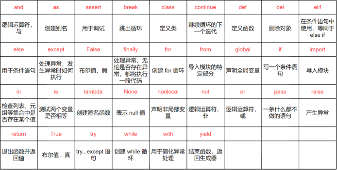
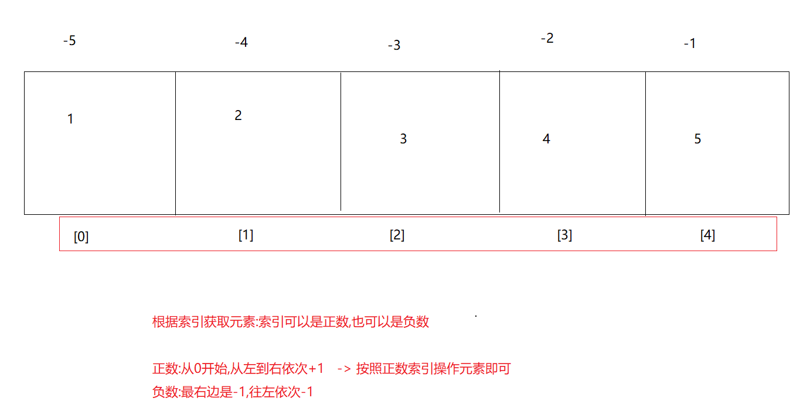
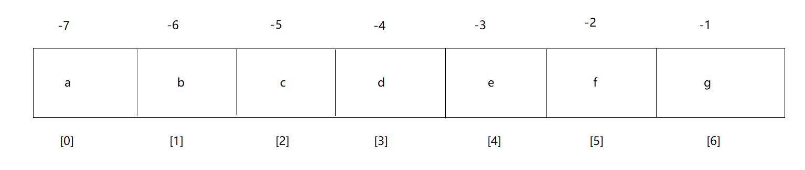
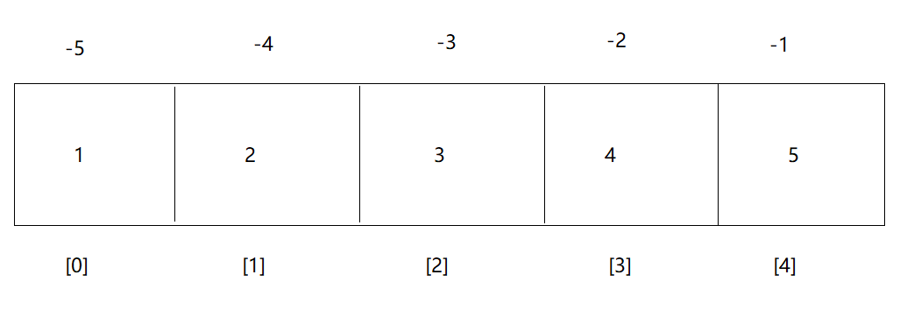
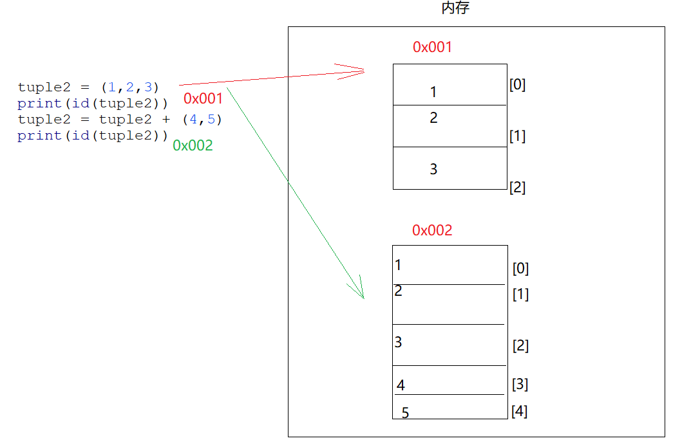
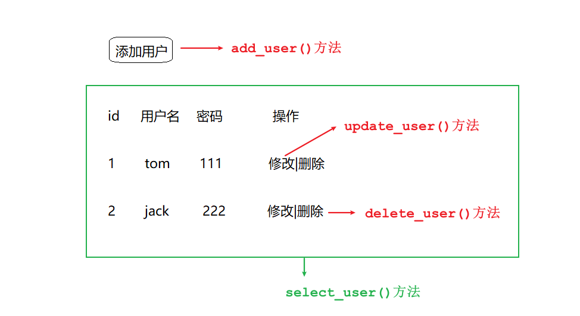
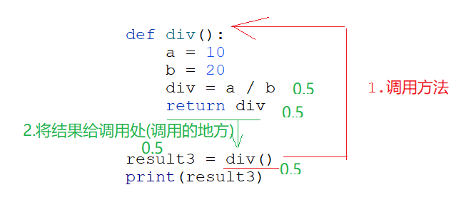
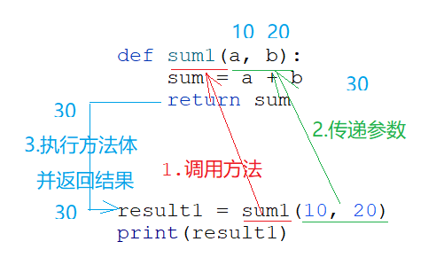
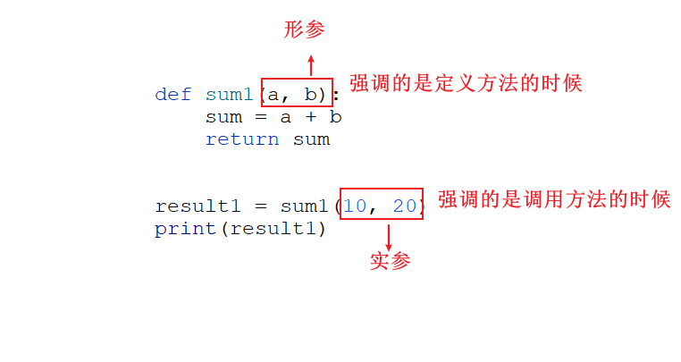
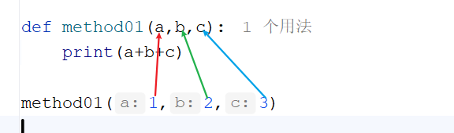

# 1.注释

```python
1.概述:对代码的解释说明,在代码的执行过程中不起任何作用,仅仅是为了提高代码的可读性
2.作用:
  a.提高代码的可读性
  b.可以暂时不让某段代码执行
3.分类:
  a.单行注释:
    # 注释内容
        
  b.多行注释:可以是单引号,可以是双引号 -> 实际上是一个多行的字符串-> 字符串要是在输出语句中双引号不能直接换行,三引号可以
    '''
      注释内容
    '''
    
    """
      注释内容
    """
#单行注释
print("Hello World")
"""
  多行注释
  如果用三引号可以做注释内容,还能做多行的字符串内容
  如果想表示字符串用双引号,双引号中的内容不能直接换行,三引号是可以的
"""

# print("Hello
#       World")

print("""
  多行注释1
  多行注释2
  多行注释3
""")
```

# 2.变量

## 2.1.变量的介绍和基本使用

```python
1.概述:在代码的运行过程中,其值可以随着不同的情况随时发生改变的数据
2.作用:临时保存一个值
3.定义格式:
  a.直接创建:  变量名 = 值   -> 将等号右边的值赋值给等号左边的变量
  b.创建多个相同值的变量: 变量名1 = 变量名2 = 值
  c.创建多个不同值的变量: 变量名1,变量名2 = 值1,值2  
#基本定义格式
var1 = 10
var2 = 3
print(var1)
print(var2)
#两个变量做运算
result1 = var1 + var2
print(result1)
result2 = var1 - var2
print(result2)
result3 = var1 * var2
print(result3)
result4 = var1 / var2 #正常小数
print(result4)

# 定义两个相同值的变量
var3 = var4 = 10
print(var3)
print(var4)

# 定义多个不同值的变量
var5,var6 = 50,100
print(var5)
print(var6)
```

## 2.2.练习

```python
定义两个变量var1和var2,分别赋值为10和20,然后将a和b的值互换
var1 = 10
var2 = 20
temp = var1
var1 = var2
var2 = temp
print(var1)
print(var2)
print("===================")
var3 = 10
var4 = 20
var3, var4 = var4, var3
print(var3)
print(var4)
```

## 2.3.标识符

```python
1.概述:在代码中自己取的名字
2.命名规范:
  a.只能包含字母,数字和下划线,且不能是数字开头(只要是代码,取的名字都不要以数字开头)
  b.区分大小写,比如:Name和name就是两个不同的名字
  c.不要和关键字重复(关键字是py提前定义好的具有特殊含义的单词)
  d.见名知意
3.标识符命名方法:
  a.大驼峰命名:给类取名字   -> 每个单词首字母大写
  b.蛇形命名:给变量,模块(py文件),方法取名字 -> 每个单词用_连接
  c.包名:全小写
  d.常量:全大写
```

> 关键字:python提前定义好的,具有特殊含义的单词 -> 不用背,学到哪里记到哪里
>
> 
>
> ```python
> import keyword #导入python中的关键字模块
> print(keyword.kwlist) #输出所有关键字
> ```

# 3.常量

```python
1.概述:
  在代码的运行过程中值不会随着不同的情况而发生改变的数据叫做常量(字面值)
2.注意:Python中没有内置的常量类型。一般约定使用全大写变量名来表示常量
PI = 3.14
print(PI)
```

# 4.数据类型

```python
1.概述:Python不像java语言一样,定义变量之前需要声明这个变量的数据类型,而python在定义变量的时候没有指定具体的数据类型
      所以,python中的数据类型其实指的是等号右边那个值的类型
2.分类:
  基本类型->Number类型
      a.整型:int
      b.浮点型:float
      c.复数:complex -> 很少用到,不用管
      d.布尔型:bool   -> True False
  字符串: 用引号括起来,可以单引号,双引号,三引号
      str
  容器类型:
      a.列表  list
      b.元组  tuple
      c.集合  set
      d.字典  dict
  特殊类型:
      None(表示空值或缺失值，只有一个值 None。常用于方法没有返回值时，或者表示变量没有被赋值)
          
3.注意:
  a.其中Number类型,str类型,Tuple(元组)   -> 不可变数据 -> 只要重新赋值,会开辟新的空间
  b.list,dict,set -> 可变数据  -> 可以在数据原来的基础上改变
      
4.检测类型:
  a.type(值或者变量) 直接获取数据的类型   
num1 = 10;
num2 = True
print(type(num1))#<class 'int'>
print(type(num2))#<class 'bool'>
```

## 4.1.int整型

```python
1.概述:python中的int型可以处理任意大小的整数,包括负数
2.注意:如果书写很大的数时,python3.6以及以上版本支持三位写一个_,增强可读性
num1 = 10000000000
print(num1)

num2 = 10_000_000_000
print(num2)
```

> 1.小整数池
>
> 我们每创建一个变量,都会在内存中开辟新的空间,但是python对此做了优化,值只要是在-5到256之间的,都会维护在小整数池中,所以在这个范围内的数都会共享同一个对象.地址值是一样的
>
> 2.大整数池
>
> 如果超出了-5到256这范围,就会直接往大整数池中保存,但是有的时候相同的大整数也会指向同一个对象,这是因为python的优化,但是这个优化不是绝对的,不同的解释器可能不太一样
>
> ```python
> id(变量名)函数  -> 获取到这个变量的地址值
> num3 = 30
> num4 = 40
> num5 = 30
> print(id(num3))#140726036262232
> print(id(num4))#140726036262552
> print(id(num5))#140726036262232
> 
> num6 = 300
> num7 = 300
> print(id(num6))#2545593008592
> print(id(num7))#2545593008592
> 在pycharm中超出范围的数据对应的地址值是否一样效果不明显,需要进入到dos命令窗口中输入python,在命令窗口中写py代码会有效果
> ```

## 4.2.float浮点型

```python
1.概述:所有带小数点的都属于浮点型的数据->统一都用float表示
2.注意:使用浮点型的数据做计算的时候会出现误差
3.解决误差问题:
  使用Decimal对象解决
from decimal import Decimal

num1 = 0.1
num2 = 0.2
print(num1+num2)#0.30000000000000004

num3 = Decimal("0.1")
num4 = Decimal("0.2")
print(num3+num4)
```

## 4.3.bool布尔型

```python
1.概述:用于接收True和False,首字母大写,主要用于判断
2.注意:
  a.在python3中,bool是int的子类
  b.True和False可以和数字相加
  c.True相当于1,False相当于0    
bool1 = True
bool2 = False
print(bool1, bool2)

# True就是1  False就是0
print(True==1) #True
print(False==0)#True
```

## 4.4.string字符串型

### 4.4.1.字符串基本使用

```python
1.概述:在python中,字符串就是一系列的字符,凡是带引号的都是字符串
2.使用:
  a.普通字符串:
    '字符串内容'
    "字符串内容"
        
  b.多行字符串:  如果想要表示具有特殊格式的字符串,就要用三引号,不用带转义字符了,比如:html
    """
     多行字符串内容
    """    
str1 = "lining"
str2 = 'lining'
print(str1)
print(str2)

#引号之间可以嵌套
str3 = "i am 'lining'"
str4 = 'i am "lining"'
print(str3)
print(str4)
print("===============================")

#多行字符串
str5 = """
    helloworld
"""
print(str5)
print("===============================")

str6 = """
<!DOCTYPE html>
<html lang="en">
<head>
    <meta charset="UTF-8">
    <title>Title</title>
</head>
<body>
   i am helloworld
</body>
</html>
"""
print(str6)
```

### 4.4.2.转义字符

```python
1.概述:\就代表转义字符
2.作用:
  a.将普通字符转义成具体特殊含义的字符
  b.将具有特殊含义的字符转成普通字符    
```

| 转义字符 | 说明             |
| -------- | ---------------- |
| \\       | 反斜杠符号(重点) |
| \n       | 换行(重点)       |
| \t       | 横向制表符(重点) |

```python
str1 = "hello\nworld"
print(str1)
str2 = "hello\tworld"
print(str2)
str3 = "F:\\a\\b"
print(str3)
```

### 4.4.3.intern机制说明_了解

```python
每个字符串,如果不夹杂空格或者特殊字符(比如空格),默认就会开启intern机制,就是内存共享,说白了相同的字符串会共享,内容一样,出来的地址值是一样的
str15 = "helloworld"
str16 = "helloworld"
print(id(str15))#2417621901232
print(id(str16))#2417621901232
在dos命令窗口中输入python命令,在dos命令窗口中写python代码
====================================================
str6 = "hello world"
str7 = "hello world"
print(id(str6))
print(id(str7))    
```

### 4.4.4.编码和解码

```python
1.概述:数据传输和接收的过程中存在编码和解码的过程,发送数据就是编码,接收数据就是解码,那么编码和解码在计算机上都是有规则的
       如果编码和解码的规则不一致就会出现问题
2.常见的两个编码规则:
  UTF-8:一个汉字占三个字节
  GBK:一个汉字占两个字节
3.编码和解码的函数:
  a.编码:encode("编码规则")
  b.解码:decode("编码规则")
str = "中"
print(str.encode("utf8"))
print(str.encode("utf8").decode("utf8"))

str2 = "国"
print(str2.encode("gbk"))
print(str2.encode("gbk").decode("gbk"))
```

# 5.类型转换

## 5.1.自动类型转换

```python
1.什么时候发生:
  a.两个不同类型的数据进行运算,比如int和float型做运算,int就会提升为float型
  b.两个int型的数据做除法,结果也会变成float型(python不能整除)
2.注意:
  python中不支持int型以及float型和string型做拼接
num1 = 2
num2 = 3.0
sum = num1 + num2
print(sum,type(sum))#5.0 <class 'float'>
print("=====================================")
num3 = 5
num4 = 1;
div = num3 / num4
print(div,type(div))#5.0 <class 'float'>
print("=====================================")
var5 = 10
var6 = 2.5
# print(var5+"")
# print(var6+"")
```

## 5.2.强制类型转换

```python
1.概述:其实说白了就是利用python中的方法对数据的类型进行转换
2.注意:不用完全记住,混个脸熟就行
```

| 函数                 | 说明                                                         |
| -------------------- | ------------------------------------------------------------ |
| int(x [,base])       | 将x转换为一个整数，x若为字符串可用base指定进制 -> 记住       |
| float(x)             | 将x转换为一个浮点数 -> 记住                                  |
| complex(real[,imag]) | 创建一个实部为real，虚部为imag的复数->做web开发,数据分析,办公自动化用比不上,如果做科学计算,游戏引擎,通信信号处理,机器学习有可能会用到复数->目前先混个脸熟 |
| str(x)               | 将对象x转换为一个字符串 -> 记住                              |
| repr(x)              | 将对象x转换为一个字符串，可以转义字符串中的特殊字符          |
| eval(x)              | 执行x字符串表达式，并返回表达式的值                          |
| bin(x)               | 将一个整数转换为一个二进制字符串                             |
| oct(x)               | 将一个整数转换为一个八进制字符串                             |
| hex(x)               | 将一个整数转换为一个十六进制字符串                           |
| ord(x)               | 将一个字符转换为它的ASCII整数值                              |
| chr(x)               | 将一个整数转换为一个Unicode字符                              |
| tuple(s)             | 将序列s转换为一个元组                                        |
| list(s)              | 将序列s转换为一个列表                                        |
| set(s)               | 转换s为可变集合                                              |

```python
a = 1
b = "11"
c = "11.1"
# print(a+b)
print(a+int(b))
print(a+float(c))
print(str(a)+b)
```

# 6.运算符

## 6.1.算数运算符

| 运算符 | 说明               | 实例                              |
| ------ | ------------------ | --------------------------------- |
| +      | 加                 | a + b                             |
| -      | 减、或取负         | a - b                             |
| *      | 乘                 | a * b                             |
| /      | 除                 | a / b ->正常小数,不会只取整数部分 |
| //     | 整除，除后向下取整 | a // b                            |
| %      | 模，返回除法的余数 | a % b                             |
| **     | 幂                 | a ** b ->a的b次方                 |

```python
var1 = 10
var2 =3
#加法
result1 = var1 + var2
print(result1)

#减法
result2 = var1 - var2
print(result2)

#乘法
result3 = var1 * var2
print(result3)

#除法
result4 = var1 / var2
print(result4)

#整除,如果不能整除向下取整
result5 = var1 // var2
print(result5)

#取模
result6 = var1 % var2
print(result6)

#幂运算
result7 = var1 ** var2
print(result7)
```

## 6.2.赋值运算符

| 运算符 | 说明                                                         | 实例                                               |
| ------ | ------------------------------------------------------------ | -------------------------------------------------- |
| =      | 赋值                                                         | a = 1                                              |
| +=     | 加法赋值                                                     | a += 2，等同于a = a + 2                            |
| -=     | 减法赋值                                                     | a -= 2，等同于a = a - 2                            |
| *=     | 乘法赋值                                                     | a *= 2，等同于a = a * 2                            |
| /=     | 除法赋值                                                     | a /= 2，等同于a = a / 2                            |
| //=    | 整除赋值                                                     | a //= 2，等同于a = a // 2                          |
| %=     | 模赋值                                                       | a %= 2，等同于a = a % 2                            |
| **=    | 幂赋值                                                       | a **= 2，等同于a = a ** 2                          |
| :=     | 海象运算符，在表达式中同时进行赋值和返回赋值的值。Python3.8 版本新增 | num1 = 20 print((num2 := 3**2) > num1) print(num2) |

```python
data1 = 10
data1+=10
print(data1)

data2 = 10
data2//=3
print(data2)

print("===================")
data3 = 10
print(data3)
# print(data3 = 10)
print(data3:=10)
```

## 6.3.比较运算符

| 运算符 | 说明               | 实例   |
| ------ | ------------------ | ------ |
| ==     | 相等，比较两者的值 | a == b |
| !=     | 不相等             | a != b |
| >      | 大于               | a > b  |
| <      | 小于               | a < b  |
| >=     | 大于等于           | a >= b |
| <=     | 小于等于           | a <= b |

```python
#比较运算符
var7 = 10
var8 = 20
var9 = 10
print(var7 == var9)
print(var7 != var8)
print(var7 > var8)
print(var7 < var8)
print(var7 >= var9)
print(var7 <= var9)
```

## 6.4.逻辑运算符

```python
作用:连接多个判断条件
```

| 运算符 | 说明                                                         |
| ------ | ------------------------------------------------------------ |
| and    | 与，有假则假,如果and前面的条件为false,后面不看了(有短路效果) |
| or     | 或，有真则真,如果or前面的条件为true,后面的不看了(有短路效果) |
| not    | 非，取反                                                     |

```python
#逻辑运算符
var1 = 10
var2 = 20
var3 = 10

result01 = (var1 > var2) and (var1==var3)
print(result01)# False
result02 = (var1 > var2) or (var1==var3)
print(result02)# True
result03 = not (var1 > var2)
print(result03)# True
```

## 6.5.成员运算符

| 运算符 | 说明                                                        | 实例                     |
| ------ | ----------------------------------------------------------- | ------------------------ |
| in     | 判断在序列中是否有指定的值,如果有返回True,否则返回False     | a in [‘a’, ‘b’, ‘c’]     |
| not in | 判断在序列中是否没有指定的值,如果没有返回True,否则返回False | a not in [‘a’, ‘b’, ‘c’] |

```python
"""
  成员运算符
"""
var12 = [1,2,3,4,5]
print(1 in var12)
print(6 not in var12)
```

## 6.6.身份运算符

| 运算符 | 说明                               | 实例                                                         |
| ------ | ---------------------------------- | ------------------------------------------------------------ |
| is     | 判断两个标识符是不是引用自相同对象 | a is b，类似id(a) == id(b)。如果引用的是同一个对象则返回True，否则返回False |
| not is | 判断两个标识符是不是引用自不同对象 | a is not b，类似id(a) != id(b)。如果引用的不是同一个对象则返回True，否则返回False |

```python
var13 = [1,2,3,4,5]
var14 = [1,2,3,4,5]
print(var13 is var14) #False
print(var13 is not var14)# True
```

## 6.7.三元运算符

```python
1.语法:
  结果1 if 判断条件 else 结果2
2.执行流程:
  先走判断条件,如果是True就走if前面的结果1,否则饿就走else后面的结果2
var1 = 1
result01 = "及格" if var1>=60 else "不及格"
print(result01)
```

# 7.输入输出

## 7.1.输入

```python
1.概述:说白了就是键盘录入
2.作用:通过键盘录入的形式将数据放到代码中参与运行
3.使用:需要用到python中的内置方法:
      input("输入的提示信息")
4.注意:
  input方法,输入的是一个字符串
data1 = input("请输入数据：")
print(data1,type(data1))#10 <class 'str'>

print("===================================")

#由于input键盘录入,输入的是字符串,所以想要做运算就需要强转
data2 = int(input("请您输入第一个数据:"))
data3 = int(input("请您输入第二个数据:"))
print(data2+data3)
```

## 7.2.输出

### 7.2.1.普通输出

```python
1.概述:说白了就是输出语句
2.普通输出:
  a.print("内容") -> 直接输出内容
  b.print(变量名) -> 输出一个变量
  c.print(变量名1,变量名2) ->输出多个变量  
  d.print("内容",变量名)
  e.print(内容,end = "\n")   -> 和print中不写效果一样,都是换行
                               如果写了end = ""就不换行
  f.print(变量名1,变量名2,sep = "分隔符") -> 在输出结果的时候,在多个结果之间加指定的分隔符
#a.print("内容") -> 直接输出内容
print("hello world")
print("======================")
#b.print(变量名) -> 输出一个变量
a = 10
print(a)
print("======================")
#c.print(变量名1, 变量名2) ->输出多个变量
b = 20
c = 30
print(b, c)
print("======================")
#d.print("内容", 变量名)
sum = a+b
print("a加b的和:",sum)
print("======================")
#e.print(内容, end="\n")   -> 和print中不写效果一样, 都是换行
print("hello")
print("world")
#如果写了end = ""
#就不换行
print("hello1", end="")
print("world1")
print("======================")
#f.print(变量名1, 变量名2, sep="分隔符") -> 在输出结果的时候, 在多个结果之间加指定的分隔符
print(a, b, c, sep="-")
```

### 7.2.2.格式化输出

#### 7.2.2.1.字符串中使用%占位_了解

```python
1.概述:说白了就是在字符串中使用%作为占位符,后面填写的实际的变量名会自动给这些占位符赋值
```

| 格式符号 | 说明                                                        |
| -------- | ----------------------------------------------------------- |
| %s       | 接收字符串                                                  |
| %d       | 接收整数                                                    |
| %f       | 接收小数,直接用会有精度损失问题                             |
| %.nf     | 接收小数,可以指定保留几位小数,n就代表我们指定的保留小数位数 |

```python
name = "金莲"
age = 18
height = 165.5
#%s 接收字符串
#%d 接收整数
#%f 接收小数
print("姓名为%s,年龄为%d,身高为%f"%(name,age,height))
#%.nf 接收小数,可以指定保留几位小数,n就代表我们指定的保留小数位数
print("姓名为%s,年龄为%d,身高为%.2f"%(name,age,height))
```

#### 7.2.2.2.f-字符串_掌握

```python
1.概述: 在输出的时候先写一个f,后面的字符串中可以直接写变量,不用占位符了
2.格式:
  print(f"内容{变量名}")
name = "金莲"
age = 18
height = 165.5
print(f"姓名为{name},年龄为{age},身高为{height}")
```

# 8.流程控制语句

```python
注意:在python中流程控制中不用{},我们都是用缩进来表示某个代码是否属于某个流程控制语句中的一部分
```

## 8.1.分支语句

### 8.1.1.单分支_if

```python
1.格式:
  if 判断条件:
    执行语句
2.执行流程:
  先走if后面的判断条件,如果条件为True,就走if里面的执行语句,否则就不走
a = int(input("请输入数字:"))
b = int(input("请输入数字:"))

if a==b:
    print("a等于b")
```

### 8.1.2.双分支_ifelse

```python
1.格式:
  if 判断条件:
     执行语句1
  else:
     执行语句2
2.执行流程:
  现在if后面的判断条件,如果是True,就走if里面的执行语句1,否则就走else里面的执行语句2
a = int(input("请输入数字:"))
b = int(input("请输入数字:"))

if a==b:
    print("a等于b")
else:
    print("a不等于b")
练习:键盘录入一个整数,代表分数,判断这个分数是否及格
score = int(input("请输入一个分数:"))
if score >= 60:
    print("及格")
else:
    print("不及格")
```

### 8.1.3.多分支_elseif

```python
 1.格式:
    if 判断条件:
     执行语句1
    elif 判断条件:
     执行语句2
    elif 判断条件:
     执行语句3
    elif 判断条件:
     执行语句4
    ...
    else:
     执行语句n
2.执行流程:
  从上到下挨个判断,哪个条件为True,就执行哪个if对应的执行语句,如果以上所有的if都不走,就走else对应的执行语句n
a = int(input("请输入a的数据:"))
b = int(input("请输入b的数据:"))
if a > b:
    print("a比b大")
elif a < b:
    print("a比b小")
else:
    print("a和b相等")
```

### 8.1.4.练习

```python
- 需求: 小明快要期末考试了，小明爸爸对他说，会根据他不同的考试成绩，送他不同的礼物，假如你可以控制小明的得分，请用程序实现小明到底该获得什么样的礼物，并在控制台输出。
- 奖励规则:
95~100		山地自行车一辆
90~94		游乐场玩一次
80~89		变形金刚玩具一个
80以下	   胖揍一顿
score = int(input("请输入一个分数:"))
if score>=95 and score<=100:
    print("山地自行车一辆")
elif score>=90 and score<=94:
    print("游乐场玩一次")
elif score>=80 and score<=89:
    print("变形金刚玩具一个")
elif score>=0 and score<80:
    print("胖揍一顿")
else:
    print("输入的分数有误")
```

## 8.2.选择语句

### 8.2.1.基本使用

```python
1.格式:
  match 变量:
     case 目标值1:
       执行语句1
     case 目标值2:
       执行语句2
     case 目标值3:
       执行语句3
     case _:
       执行语句n
2.执行流程:
  用变量接收的值挨个和下面case后面的目标值做匹配,哪个case匹配上了,就走哪个case对应的执行语句,否则就走case _对应的执行语句n
data = 5
match data:
    case 1:
        print("床前明月光")
    case 2:
        print("疑是地上霜")
    case 3:
        print("举头望明月")
    case 4:
        print("低头思故乡")
    case _:
        print("输入的数字有误")
```

### 8.2.2.新匹配模式 |

```python
month = int(input("请输入月份:"))
match month:
    case 12|1|2:
        print("冬季")

    case 3|4|5:
        print("春季")

    case 6|7|8:
        print("夏季")

    case 9|10|11:
        print("秋季")

    case _:
        print("输入的月份有误")
练习:输入星期,输出对应的是周几
```

## 8.3.循环语句

```python
1.概述:所谓的循环语句,其实就是反复执行同一段代码,就可以使用循环语句
2.注意:
  在python中,for循环的主要作用为了遍历,不侧重循环多少次
```

### 8.3.1.for循环

#### 8.3.1.1.指定循环次数

```python
1.使用:借助的是python中的range方法,生成一个数列,这个数列是一个可迭代(可遍历)的容器
2.格式:
  for 变量名 in range(开始位置,结束位置,步长):
      变量名代表的是range返回的数列中的数据
        
3.注意:
  a.如果range中只写了开始位置,结束位置,没有写步长,默认步长就是1
  b.如果range中写了步长了,那么每次就会从开始位置加或者减这个步长
  c.结束值写几到不了几,最大到(结束值-1) 
"""
  其实也是相当于利用for循环
  遍历range生成的数列
"""
for i in range(1, 10):
    print(i)

print("======================")

for i in range(1, 10, 2):
    print(i)
练习1:求出1到100的和   --> 1+2+3+4+5

步骤:
   1.定义一个变量sum,用于接收两个的和
   2.利用range方法生成一个1-100的数列,然后利用for循环遍历
   3.在遍历的过程中,进行两两相加,将结果赋值给sum
   4.输出sum
# 1.定义一个变量sum, 用于接收两个的和
sum = 0
# 2.利用range方法生成一个1 - 100的数列, 然后利用for循环遍历
for i in range(1, 101):
# 3.在遍历的过程中, 进行两两相加, 将结果赋值给sum
    sum += i
# 4.输出sum
print(sum)
练习2.求1-100的偶数和
# 1.定义一个变量sum, 用于接收两个的和
sum = 0
# 2.利用range方法生成一个1 - 100的数列, 然后利用for循环遍历
for i in range(1, 101):
    # 3.先判断,如果i是偶数, 那么才进行两两相加, 将结果赋值给sum
    if i % 2 == 0:
        sum += i
# 4.输出sum
print(sum)
练习3:求1-100的奇数个数
# 练习2:打印1-100的奇数和
# 1.定义一个变量sum, 用于接收两个的和
sum = 0
# 2.利用range方法生成一个1 - 100的数列, 然后利用for循环遍历
for i in range(1, 101):
    # 3.先判断,如果i是奇数, 那么才进行两两相加, 将结果赋值给sum
    if i % 2 == 1:
        sum += i
# 4.输出sum
print(sum)
```

#### 8.3.1.2.遍历列表或者字符串

```python
1.格式:
  for 变量名 in 列表名或者字符串 :
      变量名就接受的是每一个元素
list1 = [1,2,3,4,5]
for i in list1:
    print(i)

print("===================")
str1 = "helloworld"
for i in str1:
    print(i)
```

### 8.3.2.while循环

```python
1.格式:
  初始化变量
  while 比较:
        循环语句
        步进表达式
        
2.执行流程:
  a.初始化变量
  b.比较,如果是True,走循环语句,走步进表达式(步进表达式指的是初始化的变量的值发生改变)
  c.再比较,如果还是True,继续走循环语句,走步进表达式
  d.再比较,直到比较为False,循环结束
i = 0
while i<10:
    print("涛哥的出场费是5毛")
    # i = i+1
    i+=1
练习:将上面for循环的练习改成while循环
# 求1-100的和
i = 1
sum = 0
while i<=100:
    sum+=i
    i+=1  # i = i+1
print(sum)

print("===========================")

# 求1-100的偶数和
i = 1
sum = 0
while i<=100:
    if i%2==0:
        sum+=i
    i+=1

print(sum)

print("===========================")
# 求1-100的奇数和

i = 1
sum = 0
while i<=100:
    if i%2==1:
        sum+=i
    i+=1

print(sum)
```

> while下面还可以写else,但是和直接写在while外面效果一样
>
> ```python
> count = 0
> var4 = 1
> while var4 <= 100:
>     if var4 % 2 == 0:
>         count += 1
>     var4 += 1
> else :
>  print(count)
> ```

### 8.3.3.循环控制关键字

```python
1.break:结束循环
2.continue:结束本次循环,进入下一次循环
# range(1,6)  -> [1,2,3,4,5]
for i in range(1,6):
    if i == 3:
        # break
        continue
    print(f"helloworld{i}")
```

### 8.3.4.死循环

```python
1.概述:一直循环,结束不了
2.什么时候发生:比较永远是True
i = 0
while True:
    print(f"涛哥的出场费是{i}美刀")
    i+=1
```

### 8.3.5.嵌套循环

```python
1.概述:循环体中还有循环
2.执行流程:先走外层循环,再走内层循环,内层循环就一直循环,直到内层循环结束,外层循环进入到下一次循环,直到外层循环都结束了,整体结束
for fen in range(0, 60):
    for miao in range(0, 60):
        print(f"{fen}分:{miao}秒")
```

# 9.列表

## 9.1.序列的介绍

```python
1.概述:所谓的序列就是容器
2.作用:
  一次性存储多个元素
3.特点:
  a.序列可以包含不同类型的元素
  b.有序(按照什么顺序存的,就按照什么顺序取)
  c.可以通过索引来操作元素

4.常见的序列有:
  列表 List
  元组 Tuple
  字符串 Str
```

## 9.2.列表 List

### 9.2.1.介绍和定义

```python
1.概述:就是一个容器
2.作用:一次性存储多个元素
3.特点:
  a.有序  -> 按照什么顺序存的,就按照什么顺序取
  b.元素可变,长度可变
  c.有索引(所谓的索引指的是元素在列表中存储的位置) -> 可以通过索引去操作元素  
  d.元素类型可以不一致
4.定义:
  列表名 = [元素1,元素2,元素3...]
list1 = [1,2,3,4,5]
print(list1)

list2 = [1,True,"涛哥",2.5]
print(list2)
```

> 将来开发容器中的数据肯定不是我们自己手动往里面存的,而是通过一些查询操作,产生了多个元素,然后底层自动会返回一个容器,存放我们查询出来的数据

### 9.2.2.获取列表长度

```python
1.格式:用到的是python中的方法
  len(列表名)
list1 = ["喜洋洋","葫芦娃","七龙珠","灌篮高手","网球王子","火影忍者","海贼王"]
print(len(list1))
```

### 9.2.3.索引

```python
1.概述:元素在列表中的索引位置(编号,下标)
2.特点:
  a.唯一
  b.索引都是从0开始,最大索引是 容器的长度-1(len(列表名)-1)
3.注意:
  如果倒着获取列表中的元素,最后一个索引也可以用-1表示
```



### 9.2.4.列表操作

#### 9.2.4.1.获取元素

```python
1.基本格式:
  列表名[索引值]

2.列表切片方式获取元素:
  a.列表名[开始索引:结束索引]-> 从开始索引获取元素到[结束索引-1]
  b.列表名[开始索引:] -> 从开始索引获取到最后
  c.列表名[:结束索引] -> 从0索引开始到[结束索引-1]
  d.列表名[::-1] -> 倒着获取元素
  e.列表名[开始索引:结束索引:步长]-> 从开始索引到[结束索引-1]跳着获取元素,指定的结束索引是到不了的  
    如果正着获取,步长就写正数,起始索引必须在结束索引左边
    如果倒着获取,步长就写负数,起始索引必须在结束索引右边
list1 = ["萧炎","药老","萧战","萧薰儿","紫妍"]
# 基本获取方式: 列表名[索引值]
print(list1[0])

#列表切片方式获取元素
# a.列表名[开始索引:结束索引]-> 从开始索引获取元素到[结束索引 - 1]
print(list1[0:3])
# b.列表名[开始索引:] -> 从开始索引获取到最后
print(list1[0:])
# c.列表名[:结束索引] -> 从0索引开始到[结束索引 - 1]
print(list1[:3])
# d.列表名[::-1] -> 倒着获取元素
print(list1[::-1])
# e.列表名[开始索引:结束索引:步长]-> 从开始索引到[结束索引 - 1]跳着获取元素, 指定的结束索引是到不了的
print(list1[0:5:2])
print(list1[5:0:-2])
```

#### 9.2.4.2.添加元素

```python
1.用到的是两个函数:
  a.列表名.append(元素)  在列表末尾追加元素
  b.列表名.insert(指定索引,添加的元素) 在列表中指定的索引位置添加元素
list1 = ["越前龙马","手冢国光","不二周助","迹部景吾","柳莲二"]
#a.列表名.append(元素)在列表末尾追加元素
list1.append("海棠薰")
print(list1)
#b.列表名.insert(指定索引, 添加的元素)在列表中指定的索引位置添加元素
list1.insert(0,"桃城武")
print(list1)
```

#### 9.2.4.3.列表合并

```python
1.概述:两个列表中的元素合并到另外一个列表中
2.格式:
  列表1+列表2
list1 = ["杨过","小龙女","尹志平"]
list2 = ["乔峰","虚竹","段誉"]

list3 = list1 + list2

print(list3)
```

#### 9.2.4.4.列表复制

```python
1.概述:将一个列表中的元素复制指定多少份儿
2.格式:
  列表名*份儿数
list1 = ["杨过","小龙女","尹志平"]
list2 = list1*3

print(list2)
```

#### 9.2.4.5.修改元素

```python
1.格式1:直接修改
  列表名[索引值] = 新值
  
2.格式2:通过切片修改
  列表名[开始索引:结束索引] = [元素1,元素2,元素3...]
    
  指定的结束索引是到不了的,最多就到指定的结束索引-1  
list1 = ["张三","李四","王五","赵六","田七","朱八"]
#1.普通的修改方式
list1[0] = "秦始皇"
print(list1)

#2.切片修改方式
list1[0:3] = ["涛哥","金莲","曼姐"]
print(list1)
```

#### 9.2.4.6.检查成员是否在指定列表中

```python
1.格式
  元素 in 列表名
list1 = ["张三","李四","王五","赵六","田七","朱八"]
print("张三" in list1)
print("张三" not in list1)
```

#### 9.2.4.7.求列表中最大值,最小值,求和

```python
1.概述:用到的是python中的函数
  max(列表名)  求列表中的最大值
  min(列表名)  求列表中的最小值
  sum(列表名)  求和
list1 = [1,2,3,4,5]
print(max(list1))
print(min(list1))
print(sum(list1))

print("=======================")

# 如果元素为字符串,就按字母顺序(ASCII码表)进行排序
list2 = ["b","a","d","c","z"]
print(max(list2))
print(min(list2))
```

#### 9.2.4.8.列表遍历

```python
1.概述:所谓的遍历,就是将元素从列表中挨个获取出来
2.如何遍历:
  a.方式1:直接获取元素    ->  最最重要的方式,最需要记的方式
    for 变量名 in 列表名:
      变量名接收的就是每一个元素
   
  b.方式2:通过索引获取元素
    for 变量名 in range(0,列表长度):
      变量名代表的是每一个元素
        
  c.方式3:使用enumerate()同时获取列表的索引和元素 -> 此函数返回的是一个可迭代的枚举对象  
    for 索引变量,元素变量 in enumerate(列表):
      获取索引变量,元素变量
list1 = ["张三","李四","王五","赵六","田七","朱八"]
# a.方式1: 直接获取元素
# for 变量名 in 列表名:
#     变量名接收的就是每一个元素
for element in list1:
    print(element)


print("===============================")

# b.方式2: 通过索引获取元素
# for 变量名 in range(0, 列表长度):
#     变量名代表的是每一个元素
for index in range(0, len(list1)):
    print(list1[index])

    
print("===============================")
# c.方式3: 使用enumerate()函数
# 同时获取列表的索引和元素 -> 此函数返回的是一个可迭代的枚举对象
# for 索引变量, 元素变量 in enumerate(列表):
#     获取索引变量, 元素变量
for index, element in enumerate(list1):
    print(index, element)
```

#### 9.2.4.9.删除元素

```python
1.方式1:利用del语句删除
  del 列表名[索引]
2.方式2:利用方法删除
  a.列表名.remove(指定元素)->删除指定元素,没有返回值
  b.列表名.pop(索引)->根据索引删除元素->返回的是被删除的元素
list1 = ["越前龙马","手冢国光","不二周助","迹部景吾","柳莲二"]
# 方式1:使用del关键字删除
del list1[0]
print(list1)

# 方式2:使用列表名.remove(元素)删除元素,没有返回值
list1.remove("柳莲二")
print(list1)

# 列表名.pop(索引)->根据索引删除元素->返回的是被删除的元素
print(list1.pop(0))
print(list1)
```

#### 9.2.4.10.嵌套列表

```python
1.概述:列表中套列表
list1 = [["张三","李四"],["王五","赵六"],["田七","朱八"]]
# 遍历  -> 先遍历最外层的列表,将每一个小列表取出来,然后再遍历每一个小列表
for little_list in list1:
    for element in little_list:
        print(element)
```

#### 9.2.4.11.列表推导式

```python
1.概述:所谓的列表推导式,就是通过一种简洁,简单的方式将一个可遍历的容器中的元素进行某种计算或者判断,产生新的元素并放到新的列表中
1.比如:定义一个列表,存储元素为0 1 2 3 4,然后将元素分别乘以2,形成新的列表
      
  普通的做法:遍历老列表,将每一个元素获取出来,将每一个元素都乘以2,然后将产生的新元素,挨个放到新的列表中

  这种做法:比较麻烦
1.方式1:基础推导式
2.需求:循环生成0-4的数列,然后将元素分别乘以2,形成新的列表
list1 = [i*2 for i in range(0,5)]
print(list1)
1.方式2:条件推导式
2.需求:生成1-10的元素,然后让偶数都乘以2,放到列表中
list2 = [i*2 for i in range(1,11) if i % 2 == 0]
print(list2)
1.方式3:使用现有列表的列表推导式
2.需求:定义一个列表,元素为1,2,3,4,5 将每个元素*2,存到新列表中
list3 = [1,2,3,4,5]
list4 = [i*2 for i in list3]
print(list4)
```

> 不管是用range生成一个数列也好,还是对现有的某个列表进行推导式也好,那么都是先有好几个数据,然后在这堆数据的基础上进行判断,计算生成新的列表

```python
1.方式4:包含多个循环的列表推导式
2.需求:定义两个列表,然后将两个列表中每一种组合方式都组合一遍,放到新的列表中
list5 = [1,2,3]
list6 = ["张三","李四","王五"]
list7 = [(i,j) for i in list5 for j in list6]
print(list7)
```

#### 9.2.4.11.拉链函数

```python
1.概述:拉链函数需要用到zip函数
2.作用:将多个可迭代对象中对应的元素打包成一个一个的元组->多个容器中的元素一一对应,进行组合
3.注意:
  既然是拉链操作,那么拉链左右的牙儿就要一一咬上,多出来的就咬不上(元素要一一对应,多出来的是组合不了的,就不会出现在新列表中)
list1 = [1,2,3]
list2 = ["张三","李四","王五"]
zip1 = zip(list1,list2)
# 利用list函数将zip1转为列表
print(list(zip1))
```

### 9.2.5.其他函数

| 函数                               | 说明                                              |
| ---------------------------------- | ------------------------------------------------- |
| list.insert(index,x)               | 在指定位置插入x                                   |
| list.append(x)                     | 在列表末尾追加x                                   |
| list1.extend(list2)(演示)          | 在列表1的末尾追加列表2的数据                      |
| del list[index]                    | 删除指定位置的数据或切片                          |
| list.remove(x)                     | 删除第一次出现的x                                 |
| list.pop([index])                  | 删除指定位置的数据，默认为末尾数据                |
| list.clear()(演示)                 | 清空列表中元素                                    |
| list[index] = x                    | 修改指定位置的数据                                |
| list1[start:end] = list2           | 修改列表切片的数据                                |
| sorted(list[,reverse=True])(演示)  | 返回排序后的新列表，可选降序                      |
| list.sort([reverse=True])(演示)    | 对列表就地排序，可选降序                          |
| list.reverse()(演示)               | 反转列表中的元素                                  |
| list.index(x[,start,[,end]])(演示) | 返回x在列表中首次出现的位置，可指定起始和结束范围 |
| list.count(x)(演示)                | 返回x的数量                                       |
| len(list)                          | 返回列表元素个数                                  |
| max(list)                          | 返回列表中最大值                                  |
| min(list)                          | 返回列表中最小值                                  |
| sum(list)                          | 返回列表中所有元素和                              |
| list.copy()(演示)                  | 拷贝列表                                          |
| list(x)(演示)                      | 将序列转换为列表                                  |

> list1.extend(list2) 在列表1的末尾追加列表2的数据
>
> list.clear() 清空列表中元素
>
> sorted(list[,reverse=True]) 返回排序后的新列表，可选降序
>
> list.sort([reverse=True]) 对列表就地排序，可选降序
>
> list.reverse() 反转列表中的元素
>
> list.index(x[,start,[,end]]) 返回x在列表中首次出现的位置，可指定起始和结束范围
>
> list.count(x) 返回指定元素在列表中的数量
>
> list.copy() 拷贝列表
>
> list(x) 将序列转换为列表

```python
# list1.extend(list2) 在列表1的末尾追加列表2的数据
list1 = [1,2,3]
list2 = [4,5,6]
list1.extend(list2)
print(list1)
print("=======================")
# list.clear() 清空列表中元素
list2.clear()
print(list2)
print("=======================")
# sorted(list[,reverse=True]) 返回排序后的新列表，可选降序
list3 = [2,3,2,3,5,1]
# list4 = sorted(list3)
list4 = sorted(list3,reverse=True)
print(list4)
print("=======================")
# list.sort([reverse=True]) 对列表就地排序，可选降序
list5 = [4,3,4,6,3,5,7]
# list5.sort()
list5.sort(reverse=True)
print(list5)
print("=======================")

# list.reverse() 反转列表中的元素
list6 = [1,2,3,4,5,6]
list6.reverse()
print(list6)
print("=======================")

# list.index(x[,start,[,end]]) 返回x在列表中首次出现的位置，可指定起始和结束范围
list7 = [1,2,3,4,5,5,6,7,8,9]
print(list7.index(5))
print(list7.index(5,0,7))
print("=======================")

# list.count(x)  返回指定元素在列表中的数量
list8 = [1,2,3,4,5,5,6,7,8,9,5]
print(list8.count(5))
print("=======================")

# list.copy() 拷贝列表
list9 = [1,2,3,4,5]
list10 = list9.copy()
print(list10)
print("=======================")

# list(x) 将序列转换为列表
print(list("helloworld"))
```

# 10.字符串_string

```python
1.概述:字符串是一个不可变的字符序列,用于表示文本数据
2.特点:
  a.字符串定义之后不可变,操作字符串,会产生新的字符串
  b.字符串中的字符也是有索引的,可以通过索引去操作字符串
3.定义:
  a.利用单引号定义 : 'helloworld'
  b.利用双引号定义 : "helloworld"
  c.利用三引号定义: 
    """
      helloworld
    """  
    
4.注意:
  a.三引号如果单独使用就是注释 
  b.三引号如果和其他语句混合使用就是字符串
    
5.双引号和三引号的区别:
  a.双引号表示字符串的时候,不能换行
  b.三引号表示字符串的时候,可以换行-> 三引号可以用于表示一些含有特殊格式的内容
```

## 10.1.字符串的创建

```python
str1 = 'helloworld'
print(str1)

str2 = "helloworld"
print(str2)

str3 = """helloworld"""
print(str3)

print("===========================")
# 双引号表示字符串内容不能换行
# str4 = "hello
#         world"

str5 = """
       hello
       world
"""
print(str5)

print("==========================")
str6 = """
<!DOCTYPE html>
<html lang="en">
<head>
    <meta charset="UTF-8">
    <title>首页</title>
</head>
<body>
   性感涛哥,在线发牌
</body>
</html>
"""
print(str6)
```

## 10.2.字符串简单操作

### 10.2.1.获取字符串中的字符



```python
# 获取字符串中的字符
print(str1[0])
print(str1[-1])
print(str1[2:5])
```

### 10.2.2.字符串拼接

```python
str2 = "hello"
print(str2 + "world")
```

### 10.2.3.字符串复制

```python
# 字符串复制
print(str2*3)
```

### 10.2.4.判断是否包含指定字符

```python
# 判断是否包含指定字符
print("l" in str2)
```

### 10.2.5.取消字符串中的转义字符

```python
1.作用:如果字符串中有转义字符,我们想将这个具有特殊含义的字符转成普通字符,就在字符串的外面带上一个r
print(r"abcde\ig")
```

## 10.3.字符串常用函数

| 函数                            | 说明                                                         |
| ------------------------------- | ------------------------------------------------------------ |
| str.replace(old,new[,max])      | 把将字符串中的old替换成new,如果指定max，则替换不超过max次    |
| str.split([x][,n])              | 按x分隔字符串，默认按任何空白字符串分隔并在结果中丢弃空字符串。可指定最大分隔次数 |
| str.rsplit([x][,n])             | 与split()类似，从右边开始分隔                                |
| x.join(seq)                     | 以x作为分隔符，将序列中所有的字符串合并为一个新的字符串      |
| str.strip([x])                  | 截掉字符串两边的空格或指定字符                               |
| str.lstrip([x])                 | 截掉字符串左边的空格或指定字符                               |
| str.rstrip([x])                 | 截掉字符串右边的空格或指定字符                               |
| str.removeprefix()              | 截掉字符串指定前缀                                           |
| str.removesuffix()              | 截掉字符串指定后缀                                           |
| str.upper()                     | 将所有字符转为大写                                           |
| str.lower()                     | 将所有字符转为小写                                           |
| str.swapcase()                  | 反转字符串中字母大小写                                       |
| str.capitalize()                | 将字符串第一个字母变为大写，其他字母变为小写                 |
| str.title()                     | 将字符串每个单词首字母大写                                   |
| str.casefold()                  | 返回适合无大小写比较的字符串版本                             |
| len(str)                        | 返回字符串长度                                               |
| max(str)                        | 返回字符串中最大值                                           |
| min(str)                        | 返回字符串中最小值                                           |
| str.find(x[,start][,end])       | 返回字符串中第一个x的索引值，不存在则返回-1，可指定字符串开始结束范围 |
| str.rfind(x[,start][,end])      | 与find()类似，从右边开始查找                                 |
| str.index(x[,start][,end])      | 返回字符串中第一个x的索引值，不存在则报错，可指定字符串开始结束范围 |
| str.rindex(x[,start][,end])     | 与index()类似，从右边开始查找                                |
| str.count(x[,start][,end])      | 返回字符串中x的个数，可指定字符串开始结束范围                |
| str.startswith(x[,start][,end]) | 检查字符串是否以x开头，可指定字符串开始结束范围              |
| str.endswith(x[,start][,end])   | 检查字符串是否以x结尾，可指定字符串开始结束范围              |
| str.isspace()                   | 检查字符串是否非空且只包含空白                               |

> ```python
> str.replace(old,new[,max])  把将字符串中的old替换成new,如果指定max，则替换不超过max次
> str.split([x][,n])  按x分隔字符串，默认按任何空白字符串分隔并在结果中丢弃空字符串。可指定最大分隔次数
> x.join(seq) 以x作为分隔符，将序列中所有的字符串合并为一个新的字符串
> str.find(x[,start][,end])   返回字符串中第一个x的索引值，不存在则返回-1，可指定字符串开始结束范围
> str.index(x[,start][,end])  返回字符串中第一个x的索引值，不存在则报错，可指定字符串开始结束范围
> str.startswith(x[,start][,end]) 检查字符串是否以x开头，可指定字符串开始结束范围
> str.endswith(x[,start][,end])   检查字符串是否以x结尾，可指定字符串开始结束范围
> ```

```python
# str.replace(old,new[,max])  把将字符串中的old替换成new,如果指定max，则替换不超过max次
print("ababcdeaa".replace("a","z"))
print("ababcdeaa".replace("a","z",2))
# str.split([x][,n])  按x分隔字符串，默认按任何空白字符串分隔并在结果中丢弃空字符串。可指定最大分隔次数
print("a b c d".split(" "))
print("a b c d".split(" ",2))
# x.join(seq) 以x作为分隔符，将序列中所有的字符串合并为一个新的字符串
print("-".join("abcd"))
# str.find(x[,start][,end])   返回字符串中第一个x的索引值，不存在则返回-1，可指定字符串开始结束范围
print("abcdb".find("b"))
print("abcdefg".find("b",0,4))
# str.index(x[,start][,end])  返回字符串中第一个x的索引值，不存在则报错，可指定字符串开始结束范围
# print("abcdb".index("e"))
print("abcdefg".index("b",0,4))
# str.startswith(x[,start][,end]) 检查字符串是否以x开头，可指定字符串开始结束范围
print("abcdefg".startswith("a"))
print("abcdefg".startswith("a",0,4))
# str.endswith(x[,start][,end])   检查字符串是否以x结尾，可指定字符串开始结束范围
print("abcdefg".endswith("g"))
print("abcdefg".endswith("g",0,4))
```

## 10.4.其他函数(看看就行)

| 函数                                         | 说明                                                         |
| -------------------------------------------- | ------------------------------------------------------------ |
| str.center(width[,x])                        | 返回长度为width且居中的字符串，空白使用x填充，默认为空格     |
| str.ljust(width[,x])                         | 返回长度为width且左对齐的字符串，空白使用x填充，默认为空格   |
| str.rjust(width[,x])                         | 返回长度为width且右对齐的字符串，空白使用x填充，默认为空格   |
| str.zfill(width)                             | 返回长度为width且右对齐的字符串，空白使用0填充               |
| str.splitlines([keepends])                   | 按行分隔字符串，返回每行字符串组成的列表，可选是否保留换行符 |
| str.partition(x)                             | 使用x将字符串分隔为3部分，如果分隔后不足3部分或字符串中没有x则以空白填充 |
| str.rpartition(x)                            | 与partition()类似，从右边开始分隔                            |
| str.encode(encoding=‘UTF-8’,errors=‘strict’) | 对字符串使用指定格式编码，并指定错误处理方案                 |
| str.expandtabs([tabsize])                    | 将字符串中\t转化为空格，可指定每个\t空格数                   |
| str.format_map(dict)                         | 使用字典等映射关系数据来格式化字符串                         |
| str.isalnum()                                | 检查字符串是否非空且只包含字母(英文字母+汉字)和数字          |
| str.isalpha()                                | 检查字符串是否非空且只包含字母(英文字母+汉字)                |
| str.isascii()                                | 检查字符串是否只包含ASCII字符，空字符串也是ASCII             |
| str.isdecimal()                              | 检查字符串是否非空且只包含十进制字符                         |
| str.isdigit()                                | 检查字符串是否非空且只包含数字                               |
| str.isidentifier()                           | 检查字符串是否是有效的标识符                                 |
| str.isupper()                                | 检查字符串中是否包含至少一个区分大小写的字符，且所有这些(区分大小写的)字符都是大写 |
| str.islower()                                | 检查字符串中是否包含至少一个区分大小写的字符，且所有这些(区分大小写的)字符都是小写 |
| str.isnumeric()                              | 检查字符串是否非空且只包含数值字符                           |
| str.isprintable()                            | 检查字符串是否可打印                                         |
| str.istitle()                                | 检查字符串是否非空且符合title格式                            |
| str.maketrans(str1,str2[,str3])              | 生成翻译表供translate()使用。如果只传一个参数，它必须是将Unicode序号（整数）或字符映射到Unicode序号、字符串或None的字典。然后，字符键将转换为序数。如果传两个参数，需要str1和str2为等长的字符串，并且在生成的字典中，str1中的每个字符都将映射到str2中相同位置的字符。如果有第三个参数，它必须是一个字符串，其字符将在结果中映射到None |
| str.translate()                              | 使用给定的翻译表替换字符串中的每个字符                       |

# 11.元组_tuple

```python
1.概述:元组也是一个容器
2.作用:存储多个数据
3.特点:
  a.不可变的,元素都不能修改
  b.元素有序
  c.有索引
  d.元素可重复
  e.元组中可以存储不同类型的元素
```

## 11.1.元组的创建

```python
1.定义格式1:
  元组名 = (元素1,元素2...)
2.定义格式2:如果元组中只有一个元素,我们需要在这个元素后面加上,否则就不是元组,而是一个普通的数据类型
  元组名 = (元素1,)
3.定义格式3:利用推导式创建
  a.元组名 = (i for i in range(范围)) 这个不是最终的元素类型,返回的是generator类型(后面再说)
  b.将generator转成tuple类型
    tuple(元组名)
"""
 1.定义格式1:
  元组名 = (元素1,元素2...)
"""
tuple1 = ("张三","李四","王五")
print(tuple1)

print("===============================")

"""
  2.定义格式2:如果元组中只有一个元素,我们需要在这个元素后面加上,否则就不是元组,而是一个普通的数据类型
  元组名 = (元素1,)
"""
tuple2 = ("张三",)
# tuple2 = ("张三")
print(tuple2,type(tuple2))

print("===============================")

"""
  3.定义格式3:利用推导式创建
    a.元组名 = (i for i in range(范围)) 这个不是最终的元素类型,返回的是generator类型(后面再说)
    b.将generator转成tuple类型
      tuple(元组名)
"""
# tuple3 = (i for i in range(10))
# print(tuple3,type(tuple3))
# tuple4 = tuple(tuple3)
# print(tuple4,type(tuple4))

tuple3 = tuple((i for i in range(10)))
print(tuple3,type(tuple3))
```

## 11.2.元组操作

### 11.2.1.访问元组

```python
1.格式1:
  元组名[索引值]
  元组名[切片规则]    
tuple1 = ("张三", "李四", "王五", "赵六", "田七", "朱八")
print(tuple1[0])
print(tuple1[-1])
print(tuple1[1:3])
```



### 11.2.2.元组合并,元组复制

```python
tuple1 = ("张三", "李四", "王五")
tuple2 = ("赵六","田七","朱八")
# 元组合并
tuple3 = tuple1 + tuple2
print(tuple3)

# 元组复制指定多少份
tuple4 = tuple1*2
print(tuple4)
```

### 11.2.3.判断是否包含指定元素

```python
tuple1 = ("张三", "李四", "王五")
print("张三" in tuple1)
```

### 11.2.4.获取元组长度

```python
tuple1 = ("张三", "李四", "王五")
print(len(tuple1))
```

### 11.2.5.获取元组中最大值,最小值,元素和

```python
tuple1 = (1,2,3,4,5)
print(max(tuple1))
print(min(tuple1))
print(sum(tuple1))
```

### 11.2.6.遍历元组

```python
tuple1 = ("刘备","关羽","张飞","赵云")
for element in tuple1:
    print(element)

print("=================================")
for index in range(len(tuple1)):
    print(tuple1[index])

print("=================================")
for index,element in enumerate(tuple1):
    print(index,element)
```

### 11.2.7.元组不可变

```python
1.元组不可变,指的是元组内的元素是不可变的,但是元组的地址值是可以改变的
2.如果元组中的元素有一个可变的序列(比如列表),那么这个可变的序列中的元素是可以改变的
tuple1 = (1,2,3,4,5)
# tuple1[0] = 100
# print(tuple1)

print("========================")
tuple2 = (1,2,3)
print(id(tuple2))
tuple2 = tuple2 + (4,5)
print(id(tuple2))
print("========================")

tuple3 = (1,2,3,[4,5])
tuple3[3][0] = 400
tuple3[3].append(500)
print(tuple3)
```



# 12.集合_set

```python
1.概述:是一个容器
2.特点:
  a.元素可变
  b.元素无序
  c.无索引
  d.元素不能重复
```

## 12.1.集合的创建

```python
1.方式1:集合名 = {元素1,元素2...}
2.方式2:利用set()函数,创建集合
3.方式3:利用推导式创建
4.注意:
  a.如果要是想声明一个空的set集合,不能直接使用{},如果用了{},创建的就不是set集合了,而是一个字典(dict)
  b.如果想要创建一个空的set集合,可以使用set()函数
# 1.方式1:集合名 = {元素1,元素2...}
set1 = {"张三","李四","王五"}
print(set1)
# 2.方式2:利用set()函数,创建集合
set2 = set(["张三","李四","王五"])
print(set2)
# 3.方式3:利用推导式创建
set3 = {i for i in range(1,11)}
print(set3)

print("==============")
"""
  a.如果要是想声明一个空的set集合,不能直接使用{},如果用了{},创建的就不是set集合了,而是一个字典(dict)
  b.如果想要创建一个空的set集合,可以使用set()函数
"""
set4 = {}
print(set4,type(set4))# <class 'dict'>

set5 = set()
print(type(set5)) # <class 'set'>
```

## 12.2.集合的操作

### 12.2.1.添加元素

```python
1.格式:
  add(元素)
set1 = set()
set1.add("张三")
set1.add("李四")
set1.add("王五")
set1.add("王五")
print(set1)
```

### 12.2.2.删除元素

```python
函数:remove(元素)
set1.remove("王五")
print(set1)
```

### 12.2.3.判断是否包含指定元素

```python
print("张三" in set1)
```

### 12.2.4.获取集合长度

```python
# 获取集合长度
print(len(set1))
```

### 12.2.5.获取集合元素最大值,最小值,元素和

```python
# 求元素最大值,最小值,求和
set2 = {1,2,3,4,5}
print(max(set2))
print(min(set2))
print(sum(set2))
```

### 12.2.6.遍历集合

```python
set3 = {"张三", "李四", "王五", "赵六"}
for e in set3:
    print(e)

print("=================")
for index,element in enumerate(set3):
    print(index,element)
```

> 1.集合没有索引的,所以不能根据索引操作元素
>
> 2.以上两种遍历集合的方式,推荐使用第一种

## 12.3.集合常用函数

| 函数                                   | 说明                                                         |
| -------------------------------------- | ------------------------------------------------------------ |
| set.add(x)                             | 添加元素                                                     |
| set.update(x)                          | 添加元素，x可以为列表、元组、字符串、字典等可迭代对象        |
| set.union(x)                           | 添加元素后返回一个新的集合，x可以为列表、元组、字符串、字典等可迭代对象 |
| set.remove(x)                          | 从集合中移除x，x不存在则报错                                 |
| set.discard(x)                         | 从集合中移除x，x不存在也不报错                               |
| set.pop()                              | 随机取出集合中的一个元素，如果集合为空则报错                 |
| set.clear()                            | 清空集合                                                     |
| set.difference(x1,…)                   | 求set1和x1的差集，返回一个新的集合                           |
| set.difference_update(x1,…)            | 求set1和x1的差集                                             |
| set.intersection(x1,…)                 | 求set1和x1的交集，返回一个新的集合                           |
| set.intersection_update(x1,…)          | 求set1和x1的交集                                             |
| set1 & set2                            | 两集合求交集                                                 |
| set1 \| set2                           | 两集合求并集                                                 |
| set1 - set2                            | 两集合求差集                                                 |
| set1.isdisjoint(set2)                  | 判断两集合是否没有交集                                       |
| set1.issubset(set2)                    | 判断set1是否为set2的子集                                     |
| set1.issuperset(set2)                  | 判断set2是否为set1的子集                                     |
| set1.symmetric_difference(set2)        | 求两集合中不重复的元素，返回一个新的集合                     |
| set1.symmetric_difference_update(set2) | 求两集合中不重复的元素                                       |
| set.copy()                             | 拷贝集合                                                     |
| len(set)                               | 返回集合元素个数                                             |
| max(set)                               | 求集合中元素的最大值                                         |
| min(set)                               | 求集合中元素的最小值                                         |
| sum(set)                               | 求集合中元素的加和                                           |

> ```python
> set.add(x)    添加元素
> set.update(x) 添加元素，x可以为列表、元组、字符串、字典等可迭代对象
> set.union(x)  添加元素后返回一个新的集合，x可以为列表、元组、字符串、字典等可迭代对象
> set.remove(x) 从集合中移除x，x不存在则报错
> set.discard(x)    从集合中移除x，x不存在也不报错
> set.clear()   清空集合
> set.difference(x1,...)    求set1和x1的差集，返回一个新的集合->所谓差集就是A集合有,但B集合没有的
> set.difference_update(x1,...) 求set1和x1的差集
> set.intersection(x1,...)  求set1和x1的交集，返回一个新的集合
> set.intersection_update(x1,...)   求set1和x1的交集
> set1 & set2   两集合求交集
> set1 | set2   两集合求并集
> set1 - set2   两集合求差集
> set1.isdisjoint(set2) 判断两集合是否没有交集
> set1.issubset(set2)   判断set1是否为set2的子集
> set1.issuperset(set2) 判断set2是否为set1的子集
> set1.symmetric_difference(set2)   求两集合中不重复的元素，返回一个新的集合
> set1.symmetric_difference_update(set2)    求两集合中不重复的元素
> set.copy()    拷贝集合
> ```

```python
# set.add(x)    添加元素
set1 = set()
set1.add("张三")
print(set1)
print("=================")
# set.update(x) 添加元素，x可以为列表、元组、字符串、字典等可迭代对象
set2 = set()
set2.update(["张三","李四","王五"])
print(set2)
print("=================")
# set.union(x)  添加元素后返回一个新的集合，x可以为列表、元组、字符串、字典等可迭代对象
set3 = set()
set4 = set3.union(["张三","李四","王五"])
print(set4)
print("=================")
# set.remove(x) 从集合中移除x，x不存在则报错
set5 = {"张三","李四","王五","赵六"}
set5.remove("张三")
print(set5)
print("=================")
# set.discard(x)    从集合中移除x，x不存在也不报错
set6 = {"张三","李四","王五","赵六"}
set6.discard("张三")
print(set6)
print("=================")
# set.clear()   清空集合
set7 = {"张三","李四","王五","赵六"}
print(set7)
set7.clear()
print(set7)
print("=================")
# set.difference(x1,...)    求set1和x1的差集，返回一个新的集合->所谓差集就是A集合有,但B集合没有的
set8 = {"张三","李四","王五","赵六"}
set9 = {"张三","李四"}
print(set8.difference(set9))
print("=================")
# set.difference_update(x1,...) 求set1和x1的差集
set10 = {"张三","李四","王五","赵六"}
set11 = {"张三","李四"}
set10.difference_update(set11)
print(set10)
print("=================")
# set.intersection(x1,...)  求set1和x1的交集，返回一个新的集合
set12 = {"张三","李四","王五","赵六"}
set13 = {"张三","王五"}
print(set12.intersection(set13))
print("=================")
# set.intersection_update(x1,...)   求set1和x1的交集
set14 = {"张三","李四","王五","赵六"}
set15 = {"张三","王五"}
set14.intersection_update(set15)
print(set14)
print("=================")
# set1 & set2   两集合求交集
set16 = {"张三","李四","王五","赵六"}
set17 = {"张三","王五"}
print(set16 & set17)
print("=================")
# set1 | set2   两集合求并集
set18 = {"张三","李四","王五","赵六"}
set19 = {"张三","王五"}
print(set18 | set19)
print("=================")
# set1 - set2   两集合求差集
set20 = {"张三","李四","王五","赵六"}
set21 = {"张三","王五"}
print(set20 - set21)
print("=================")
# set1.isdisjoint(set2) 判断两集合是否没有交集
print(set20.isdisjoint(set21))
print("=================")
# set1.issubset(set2)   判断set1是否为set2的子集
print(set20.issubset(set21))
print(set21.issubset(set20))
print("=================")
# set1.issuperset(set2) 判断set2是否为set1的子集
print(set20.issuperset(set21))
print("=================")
# set1.symmetric_difference(set2)   求两集合中不重复的元素，返回一个新的集合
set22 = {"张三","李四","王五","赵六"}
set23 = {"张三","王五"}
print(set22.symmetric_difference(set23))
print("=================")
# set1.symmetric_difference_update(set2)    求两集合中不重复的元素
set24 = {"张三","李四","王五","赵六"}
set25 = {"张三","王五"}
set24.symmetric_difference_update(set25)
print(set24)
print("=================")
# set.copy()    拷贝集合
set26 = {"张三","李四","王五","赵六"}
set27 = set26.copy()
print(set27)
```

# 13.字典_dictionary

```python
1.概述:存储键值对的集合 -> key:value形式
2.特点:
  a.有序
  b.无索引
  c.key唯一,value可重复
  d.使用{}或者dict()定义,里面都是键值对形式,每一个键值对之间用,分割
  e.key是可不变的,value可以是任意数据类型的数据
```

## 13.1.字典的创建

```python
1.方式1:
  字典名 = {}
2.方式2:
  字典名 = dict()
3.方式3:
  字典名 = {"key":value,"key":value}
4.方式4:
  字典名 = dict(key = value,key = value)
# 1.方式1:字典名 = {}
dict1 = {}
print(dict1)
# 2.方式2:字典名 = dict()
dict2 = dict()
print(dict2)
# 3.方式3:字典名 = {"key":value,"key":value}
dict3 = {"name":"良子","age":30,"weight":400,"hobby":"板面和焖子"}
print(dict3)
# 4.方式4:
#   字典名 = dict(key = value,key = value)
dict4 = dict(name="良子",age=30,weight=400,hobby="板面和焖子")
print(dict4)
```

## 13.2.字典的基本操作

### 13.2.1.获取元素

```python
1.方式1:
  字典名["key"]
2.方式2:
  字典名.get("key")
dict1 = {"name":"良子","age":30,"weight":400,"hobby":"板面和焖子"}
print(dict1)

print("==========================")

# 方式1: 字典名[key]
print(dict1["name"])

# 方式2: 字典名.get(key)
print(dict1.get("hobby"))
```

### 13.2.2.添加元素

```python
1.格式:
  字典名["key"] = value
dict1["height"] = 167
print(dict1)
```

### 13.2.3.修改元素

```python
1.格式:
  字典名["key"] = value
dict1["name"] = "涛哥"
print(dict1)
```

### 13.2.4.删除元素

```python
1.方式1:利用的del语句 ->del 字典名["key"]  -> 根据key删除键值对
2.方式2:清空字典 -> 字典名.clear()
3.方式3:del 字典名 -> 删除字典对象
dict1 = {"name":"金莲","age":24,"weight":100,"hobby":"涛哥"}
# 1.方式1:利用的del语句 ->del 字典名["key"]  -> 根据key删除键值对
del dict1["age"]
print(dict1)
# 2.方式2:清空字典 -> 字典名.clear()
dict1.clear()
print(dict1)
# 3.方式3:del 字典名 -> 删除字典对象
del dict1
print(dict1)
```

### 13.2.5.判断是否包含指定的key

```python
dict3 = {"name":"金莲","age":24,"weight":100,"hobby":"涛哥"}
print("name" in dict3)
```

### 13.2.6.获取字典长度

```python
len(字典名)
dict4 = {"name":"金莲","age":24,"weight":100,"hobby":"涛哥"}
print(len(dict4))
```

### 13.2.7.遍历字典

```python
1.方式1:获取所有的key  -> 字典名.keys()
2.方式2:获取所有的value -> 字典名.values()
3.方式3:获取键值对  -> 字典名.items()
dict1 = {"name":"良子","age":30,"weight":400,"hobby":"板面和焖子"}
# 1.方式1:获取所有的key  -> 字典名.keys()
keys = dict1.keys()
for key in keys:
    print(key,dict1.get(key))

print("==========================")
# 2.方式2:获取所有的value -> 字典名.values()
values = dict1.values()
for value in values:
    print(value)

print("==========================")

# 3.方式3:获取键值对  -> 字典名.items()
items = dict1.items()
for item in items:
    # print(item,type(item))
    print(item[0],item[1])
```

## 13.3.字典常用函数

| 函数                           | 说明                                                         |
| ------------------------------ | ------------------------------------------------------------ |
| del dict[key]                  | 根据key删除键值对                                            |
| dict.pop(key[,default])        | 获取key所对应的value，同时删除该键值对，可设置默认值->如果key不存在在字典中,就可以设置默认值,否则会报错 |
| dict.popitem()                 | 取出字典中的最后插入的键值对(然后删除键值对)，字典为空则报错 |
| dict.clear()                   | 清空字典                                                     |
| dict1.update(dict2)            | 将dict2中的键值对更新到dict1中                               |
| dict.get(key[,default])        | 获取字典中key对应value，可设置默认值                         |
| dict.setdefault(key[,default]) | 获取字典中key对应value，可设置默认值。若key不存在于字典中，将会添加key并将value设为默认值 |
| dict.keys()                    | 获取字典所有的key，返回一个视图对象。字典改变，视图也会跟着变化 |
| dict.values()                  | 获取字典所有的value，返回一个视图对象                        |
| dict.items()                   | 获取字典所有的(key,value)，返回一个视图对象                  |
| dict.copy()                    | 拷贝字典                                                     |
| dict.fromkeys(seq[,default])   | 以序列seq中元素做字典的key创建一个新字典，可设置value的默认值 |

> dict.pop(key[,default])获取key所对应的value，同时删除该键值对，可设置默认值->如果key不存在在字典中,就可以设置默认值,否则会报错
>
> dict.popitem() 取出字典中的最后插入的键值对，字典为空则报错
>
> dict1.update(dict2) 将dict2中的键值对更新到dict1中
>
> dict.setdefault(key[,default])获取字典中key对应value，可设置默认值。若key不存在于字典中，将会添加key并将value设为默认值
>
> dict.copy() 拷贝字典

```python
dict1 = {"name":"良子","age":30,"weight":400,"hobby":"板面和焖子"}
# # dict.pop(key[,default])获取key所对应的value，同时删除该键值对，可设置默认值->如果key不存在在字典中,就可以设置默认值,否则会报错
# print(dict1.pop("name"))
# print(dict1)
print("======================")
# dict.popitem()	取出字典中的最后插入的键值对，字典为空则报错
# print(dict1.popitem())
# dict1.update(dict2)	将dict2中的键值对更新到dict1中
dict1.update({"sex":"男"})
print(dict1)
print("======================")
# dict.setdefault(key[,default])获取字典中key对应value，可设置默认值。若key不存在于字典中，将会添加key并将value设为默认值
print(dict1.setdefault("name"))
print("======================")
# dict.copy()	拷贝字典
dict2 = dict1.copy()
print(dict2)
```

# 14.列表,元组,字典和集合的区别

| 数据结构           | 是否可变 | 是否重复         | 是否有序                                                     | 定义符号    |
| ------------------ | -------- | ---------------- | ------------------------------------------------------------ | ----------- |
| 列表（List）       | 可变     | 允许             | 有序                                                         | []或list()  |
| 元组（Tuple）      | 不可变   | 允许             | 有序                                                         | ()或tuple() |
| 字典（Dictionary） | 可变     | 键不允许，值允许 | 键无序（Python 3.7+版本中保持插入顺序,底层是双向链表记录key,所以有序了） | {}或dict()  |
| 集合（Set）        | 可变     | 不允许           | 无序                                                         | {}或set()   |

# 15.方法的使用

```python
1.问题描述:
  将来我们不可能将所有功能的代码都耦合在一起,我们应该将每一个功能都独立放到一个方法中,到时候想执行哪个功能,就单独调用哪个方法
2.方法的概述:
  拥有功能性代码的代码块 -> 页面上的一个按钮就应该对应一个功能,那么一个功能就应该定义一个方法
```



## 15.1.方法的定义

```python
1.定义格式:
  def 方法名(参数列表):
      方法体
      return 结果

2.定义格式的各部分解释:
  a.def :定义方法的关键字
  b.方法名: 给方法取个名字 -> 见名知意 -> 蛇形命名法
  c.参数列表:用于接收外部的数据,将接收到的数据传入到方法体内部进行操作
           在python中,参数名直接写一个变量名即可
  d.方法体:用于实现这个方法(功能)的具体代码
  e.return 结果:方法运行完毕之后,会产生一个结果,将这个结果返回出去

3.分类:
  a.无参无返回值方法
  b.有参无返回值方法
  c.无参有返回值方法
  d.有参有返回值方法
```

## 15.2.无参无返回值方法定义和调用

```python
1.定义格式:
  def 方法名():
    方法体
2.调用:方法不调用不执行的
  直接调用:方法名()
需求:定义一个方法,实现两个整数相加
def sum1():
    a = 10
    b = 20
    sum = a+b
    print(sum)


def sub():
    a = 10
    b = 20
    sub = a-b
    print(sub)

def mul():
    a = 10
    b = 20
    mul = a*b
    print(mul)

def div():
    a = 10
    b = 20
    div = a/b
    print(div)

sum1()
sub()
mul()
div()
```

## 15.3.有参无返回值方法定义和调用

```python
1.格式:
  def 方法名(参数1,参数2...):
    方法体
2.直接调用:
  方法名(具体的值)
定义四个方法,实现两个整数的加减乘除
def sum1(a, b):
    sum = a + b
    print(sum)


def sub(a, b):
    sub = a - b
    print(sub)


def mul(a, b):
    mul = a * b
    print(mul)


def div(a, b):
    div = a / b
    print(div)


sum1(10, 20)
sub(10, 20)
mul(10, 20)
div(10, 20)
```

## 15.4.无参有返回值方法定义和调用

```python
1.格式:
  def 方法名():
    方法体
    return 结果

2.调用:哪里调用方法,方法的返回值就给哪里
  a.打印调用:print(方法名())
  b.赋值调用:变量名 = 方法名()   -> 推荐使用
定义四个方法,实现两个整数的加减乘除,将结果返回
def sum1():
    a = 10
    b = 20
    sum = a+b
    return sum

def sub():
    a = 10
    b = 20
    sub = a - b
    return sub

def mul():
    a = 10
    b = 20
    mul = a * b
    return mul

def div():
    a = 10
    b = 20
    div = a / b
    return div

# 打印调用
print(sum1())
# 赋值调用
result1 = sub()
print(result1)
result2 = mul()
print(result2)
result3 = div()
print(result3)
```



## 15.5.有参有返回值方法定义和调用

```python
1.格式:
  def 方法名(参数):
    方法体
    return 结果
2.调用:
  a.打印调用:print(方法名(具体的值))
  b.赋值调用:变量名 = 方法名(具体的值)
定义四个方法,实现两个整数的加减乘除,将结果返回
def sum1(a, b):
    sum = a + b
    return sum

def sub(a, b):
    sub = a - b
    return sub

def mul(a, b):
    mul = a * b
    return mul

def div(a, b):
    div = a / b
    return div

result1 = sum1(10, 20)
print(result1)
result2 = sub(10, 20)
print(result2)
result3 = mul(10, 20)
print(result3)
result4 = div(10, 20)
print(result4)
```



## 15.6.形参和实参

```python
1.形参(形式参数):在定义方法的时候,仅仅是形式上定义了一下参数,没有给具体的值
2.实参(实际参数):在调用方法的时候,给形参赋的具体的值
```



## 15.7.参数和返回值的使用时机

```python
1.总的来说:看需求  -> 看实际需求来决定啥时候定义带参数的方法,啥时候定义带返回值的方法
    
2.细分:
  a.什么时候定义带参数的方法:
    在某个位置,需要将数据传递给方法A,此时方法A就需要定义带参数的,等着别人调用方法A的时候,方法A的参数能接受到别人传递过来的数据
        
  b.什么时候定义带返回值的方法:
    在某个位置,调用完方法A之后,需要方法A的结果,拿到方法A的结果之后,我需要去做其他的操作,此时方法A就需要将自己的结果返回出去
def method01(x,y):
    print(x+y)

a = 10
b = 20
method01(a,b)

print("==============================")

def method02(x,y):
    sum = x + y
    return sum

result = method02(80,20)

if result==100:
    print("结果为100")
else:
    print("结果不为100")
```

## 15.8.方法嵌套调用

```python
1.说白了就是不同方法之间调用
def method01(x, y):
    return x + y

def method02():
    a = 10
    b = 20
    result01 = method01(a, b)
    print(result01)

method02()
```

## 15.9.练习

### 15.9.1.练习1

```python
需求:
   键盘录入一个整数,将整数传递到另外一个方法中,在此方法中判断这个整数的奇偶性
   如果是偶数,方法返回"偶数"  否则返回"奇数"
       
方法三要素:
  1.方法名-> 要
  2.参数 -> 要
  3.返回值 -> 要
def method01(data):
    if data%2==0:
       return "偶数"
    else:
       return "奇数"


data = int(input("请输入数据："))
result01 = method01(data)
print(result01)
```

### 15.9.2.练习2

```python
需求:
   定义一个方法,给这个方法传几,就让这个方法循环打印几次"我是一个有经验的ai智能体开发工程师"
       
方法三要素:
   a.方法名:要
   b.参数:要
   c.返回值:不要
def method01(n):
    for i in range(n):
        print("我是一个有经验的ai智能体开发工程师",i)


method01(10)
```

### 15.9.3.练习3

```python
需求:
  定义一个方法,参数为列表,实现求列表中的元素最大值
def get_max(list1):
    return max(list1)

print(get_max([1,2,3,41,5]))
```

### 15.9.4.练习4

```python
列表作为返回值返回
def method01():
    a = 10
    b = 20
    sum = a+b
    sub = a-b

    # 将sum和sub放列表中,将其返回
    list1 = [sum,sub]
    return list1
    # return sum,sub


list1 = method01()
print(list1)
# print(result01)
# print(result02)
```

# 16.方法中的参数

## 16.1.规定参数类型

```python
1.格式:
  def 方法名(变量名:类型,变量名:类型):
      方法体
      return 结果
def sum1(a:int,b:int):
    sum = a+b
    return sum

print(sum1(10,20))
# print(sum1(10,"20"))
```

## 16.2.位置参数

```python
1.概述:
 调用方法的时候,将实参的值[依次]传递给方法中对应的形参  -> 其实位置参数主要指的就是传递实参的方式
2.注意:
  默认情况下,调用方法的时候,实参要和形参是一一对应的
```



```python
def method01(a,b,c):
    print(a+b+c)

method01(1,2,3)

print("===========================")

def speak(name,age,sex):
    print(f"我叫{name},今年{age}岁,性别为{sex}")

speak("金莲",18,"女")
# speak("小王",20)报错,因为缺少参数 sex
# speak("小王","男",18) 不报错,因为参数顺序可以任意,但是数据会错乱
```

## 16.3.关键字参数

```python
1.概述:调用方法的时候,通过形参名 = 值 的形式传递实参
2.注意:
  a.使用关键字参数的时候,参数顺序可以不一致
  b.使用关键字参数的时候,可以和位置参数混合使用,但是位置参数必须要在关键字参数的前面
  c.形参名=值,等号之间不要有空格->官方要求
  d.使用关键字参数的时候,不要写重复的参数名或者形参中不存在的参数名
def speak(name,age,sex):
    print(f"我叫{name},今年{age}岁,性别为{sex}")

speak(name="tom",age=18,sex="男")
print("=========================")
speak(name="tom",sex="男",age=18)
print("=========================")
# speak(name="tom",age=18)
# speak(name="tom",age=18,sex="男",hobby="烫头")
speak("张三",18,sex="男")
print("=========================")
# speak(name="tom",sex="男",age=18,name="jerry")
```

## 16.4.限制传参方式

```python
1.概述:说白了就是限制传递实参的时候只能用位置参数或者只能用关键字参数
2.规则:
  a.  /前面只能用位置参数
  b.  *后面只能用关键字参数
3.注意:如果/和*同时出现时,/必须在*的前面    
def speak(name,/,age,*,sex):
    print(f"我叫{name},今年{age}岁,性别为{sex}")

speak("tom",18,sex="男")
speak("tom",age=18,sex="男")
# speak("tom",18,"男")报错,sex应该是关键字参数
# speak(name="tom",18,"男")报错,name应该是位置参数传递

print("=========================")
def speak1(name,age,*,/,sex):
    print(f"我叫{name},今年{age}岁,性别为{sex}")
# speak1("tom",18,sex="男")传参冲突了
```

## 16.5.默认值参数

```python
1.概述:定义方法的时候,通过形参名 = 值的形式,为参数指定一个默认值
2.注意:
  a.默认值参数在调用方法,传递实参的时候可以不用单独赋值,如果需要改值,可以直接给默认值参数重新赋值
  b.默认值参数要放到参数列表的最后面
  c.如果默认值参数后面还有参数,那么后面也必须是默认值参数形式  
def speak(name,age,sex,hobby="抽烟,喝酒,烫头"):
    print(f"我叫{name},今年{age}岁,性别为{sex},爱好为{hobby}")

speak(name="涛哥",age=16,sex="男")
speak(name="涛哥",age=16,sex="男",hobby="音乐")
```

## 16.6.可变参数

```python
1.分类:
  a.可变位置参数: 在定义方法的时候,在形参名前面加 * ,就可以接收任意数量的位置参数了,并打包成一个元组
  b.可变关键字参数:在定义方法的时候,在形参名前面加 **,就可以接收任意数量的关键字参数了,并打包成一个字典
    
2.注意:
  a.可变位置参数,可变关键字参数,也能与其他类型的普通参数一起使用
  b.但是可变位置参数要在普通位置参数后面;可变关键字参数要在普通关键字参数后面
"""
  a.可变位置参数,可变关键字参数,也能与其他类型的普通参数一起使用
    但是可变位置参数要在普通位置参数后面
"""
def method03(name,*args):
    print(name, args)
    
method03("tom",10,20,30)    

print("==================")

"""
  b.可变位置参数,可变关键字参数,也能与其他类型的普通参数一起使用
    但是可变关键字参数要在普通关键字参数后面
"""
def method04(name,**kwargs):
    print(name, kwargs)
    
method04(name="tom",age=18,hobby="抽烟")    
```

## 16.7.解包传参

```python
1.概述:如果方法的形参是定长参数,可以通过*和**对列表,元组,字典等解包传参
2.注意:
 *解的是元组,列表
 **解的是字典 -> 字典中key的名称和参数名称一致
def method(a,b,c):
    print(a,b,c)

# method("张三","李四","王五")

tuple1 = ("张三","李四","王五")
method(*tuple1)

print("========================")
list1 = ["赵六","田七","朱八"]
method(*list1)

print("========================")
dict1 = {"a":"张三1","b":"李四1","c":"王五1"}
method(**dict1)
```