# 1.注释

```python
1.概述:对代码的解释说明,在代码的执行过程中不起任何作用,仅仅是为了提高代码的可读性
2.作用:
  a.提高代码的可读性
  b.可以暂时不让某段代码执行
3.分类:
  a.单行注释:
    # 注释内容
        
  b.多行注释:可以是单引号,可以是双引号 -> 实际上是一个多行的字符串-> 字符串要是在输出语句中双引号不能直接换行,三引号可以
    '''
      注释内容
    '''
    
    """
      注释内容
    """
#单行注释
print("Hello World")
"""
  多行注释
  如果用三引号可以做注释内容,还能做多行的字符串内容
  如果想表示字符串用双引号,双引号中的内容不能直接换行,三引号是可以的
"""

# print("Hello
#       World")

print("""
  多行注释1
  多行注释2
  多行注释3
""")
```

# 2.变量

## 2.1.变量的介绍和基本使用

```python
1.概述:在代码的运行过程中,其值可以随着不同的情况随时发生改变的数据
2.作用:临时保存一个值
3.定义格式:
  a.直接创建:  变量名 = 值   -> 将等号右边的值赋值给等号左边的变量
  b.创建多个相同值的变量: 变量名1 = 变量名2 = 值
  c.创建多个不同值的变量: 变量名1,变量名2 = 值1,值2  
#基本定义格式
var1 = 10
var2 = 3
print(var1)
print(var2)
#两个变量做运算
result1 = var1 + var2
print(result1)
result2 = var1 - var2
print(result2)
result3 = var1 * var2
print(result3)
result4 = var1 / var2 #正常小数
print(result4)

# 定义两个相同值的变量
var3 = var4 = 10
print(var3)
print(var4)

# 定义多个不同值的变量
var5,var6 = 50,100
print(var5)
print(var6)
```

## 2.2.练习

```python
定义两个变量var1和var2,分别赋值为10和20,然后将a和b的值互换
var1 = 10
var2 = 20
temp = var1
var1 = var2
var2 = temp
print(var1)
print(var2)
print("===================")
var3 = 10
var4 = 20
var3, var4 = var4, var3
print(var3)
print(var4)
```

## 2.3.标识符

```python
1.概述:在代码中自己取的名字
2.命名规范:
  a.只能包含字母,数字和下划线,且不能是数字开头(只要是代码,取的名字都不要以数字开头)
  b.区分大小写,比如:Name和name就是两个不同的名字
  c.不要和关键字重复(关键字是py提前定义好的具有特殊含义的单词)
  d.见名知意
3.标识符命名方法:
  a.大驼峰命名:给类取名字   -> 每个单词首字母大写
  b.蛇形命名:给变量,模块(py文件),方法取名字 -> 每个单词用_连接
  c.包名:全小写
  d.常量:全大写
```

> 关键字:python提前定义好的,具有特殊含义的单词 -> 不用背,学到哪里记到哪里
>
> 
>
> ```python
> import keyword #导入python中的关键字模块
> print(keyword.kwlist) #输出所有关键字
> ```

# 3.常量

```python
1.概述:
  在代码的运行过程中值不会随着不同的情况而发生改变的数据叫做常量(字面值)
2.注意:Python中没有内置的常量类型。一般约定使用全大写变量名来表示常量
PI = 3.14
print(PI)
```

# 4.数据类型

```python
1.概述:Python不像java语言一样,定义变量之前需要声明这个变量的数据类型,而python在定义变量的时候没有指定具体的数据类型
      所以,python中的数据类型其实指的是等号右边那个值的类型
2.分类:
  基本类型->Number类型
      a.整型:int
      b.浮点型:float
      c.复数:complex -> 很少用到,不用管
      d.布尔型:bool   -> True False
  字符串: 用引号括起来,可以单引号,双引号,三引号
      str
  容器类型:
      a.列表  list
      b.元组  tuple
      c.集合  set
      d.字典  dict
  特殊类型:
      None(表示空值或缺失值，只有一个值 None。常用于方法没有返回值时，或者表示变量没有被赋值)
          
3.注意:
  a.其中Number类型,str类型,Tuple(元组)   -> 不可变数据 -> 只要重新赋值,会开辟新的空间
  b.list,dict,set -> 可变数据  -> 可以在数据原来的基础上改变
      
4.检测类型:
  a.type(值或者变量) 直接获取数据的类型   
num1 = 10;
num2 = True
print(type(num1))#<class 'int'>
print(type(num2))#<class 'bool'>
```

## 4.1.int整型

```python
1.概述:python中的int型可以处理任意大小的整数,包括负数
2.注意:如果书写很大的数时,python3.6以及以上版本支持三位写一个_,增强可读性
num1 = 10000000000
print(num1)

num2 = 10_000_000_000
print(num2)
```

> 1.小整数池
>
> 我们每创建一个变量,都会在内存中开辟新的空间,但是python对此做了优化,值只要是在-5到256之间的,都会维护在小整数池中,所以在这个范围内的数都会共享同一个对象.地址值是一样的
>
> 2.大整数池
>
> 如果超出了-5到256这范围,就会直接往大整数池中保存,但是有的时候相同的大整数也会指向同一个对象,这是因为python的优化,但是这个优化不是绝对的,不同的解释器可能不太一样
>
> ```python
> id(变量名)函数  -> 获取到这个变量的地址值
> num3 = 30
> num4 = 40
> num5 = 30
> print(id(num3))#140726036262232
> print(id(num4))#140726036262552
> print(id(num5))#140726036262232
> 
> num6 = 300
> num7 = 300
> print(id(num6))#2545593008592
> print(id(num7))#2545593008592
> 在pycharm中超出范围的数据对应的地址值是否一样效果不明显,需要进入到dos命令窗口中输入python,在命令窗口中写py代码会有效果
> ```

## 4.2.float浮点型

```python
1.概述:所有带小数点的都属于浮点型的数据->统一都用float表示
2.注意:使用浮点型的数据做计算的时候会出现误差
3.解决误差问题:
  使用Decimal对象解决
from decimal import Decimal

num1 = 0.1
num2 = 0.2
print(num1+num2)#0.30000000000000004

num3 = Decimal("0.1")
num4 = Decimal("0.2")
print(num3+num4)
```

## 4.3.bool布尔型

```python
1.概述:用于接收True和False,首字母大写,主要用于判断
2.注意:
  a.在python3中,bool是int的子类
  b.True和False可以和数字相加
  c.True相当于1,False相当于0    
bool1 = True
bool2 = False
print(bool1, bool2)

# True就是1  False就是0
print(True==1) #True
print(False==0)#True
```

## 4.4.string字符串型

### 4.4.1.字符串基本使用

```python
1.概述:在python中,字符串就是一系列的字符,凡是带引号的都是字符串
2.使用:
  a.普通字符串:
    '字符串内容'
    "字符串内容"
        
  b.多行字符串:  如果想要表示具有特殊格式的字符串,就要用三引号,不用带转义字符了,比如:html
    """
     多行字符串内容
    """    
str1 = "lining"
str2 = 'lining'
print(str1)
print(str2)

#引号之间可以嵌套
str3 = "i am 'lining'"
str4 = 'i am "lining"'
print(str3)
print(str4)
print("===============================")

#多行字符串
str5 = """
    helloworld
"""
print(str5)
print("===============================")

str6 = """
<!DOCTYPE html>
<html lang="en">
<head>
    <meta charset="UTF-8">
    <title>Title</title>
</head>
<body>
   i am helloworld
</body>
</html>
"""
print(str6)
```

### 4.4.2.转义字符

```python
1.概述:\就代表转义字符
2.作用:
  a.将普通字符转义成具体特殊含义的字符
  b.将具有特殊含义的字符转成普通字符    
```

| 转义字符 | 说明             |
| -------- | ---------------- |
| \\       | 反斜杠符号(重点) |
| \n       | 换行(重点)       |
| \t       | 横向制表符(重点) |

```python
str1 = "hello\nworld"
print(str1)
str2 = "hello\tworld"
print(str2)
str3 = "F:\\a\\b"
print(str3)
```

### 4.4.3.intern机制说明_了解

```python
每个字符串,如果不夹杂空格或者特殊字符(比如空格),默认就会开启intern机制,就是内存共享,说白了相同的字符串会共享,内容一样,出来的地址值是一样的
str15 = "helloworld"
str16 = "helloworld"
print(id(str15))#2417621901232
print(id(str16))#2417621901232
在dos命令窗口中输入python命令,在dos命令窗口中写python代码
====================================================
str6 = "hello world"
str7 = "hello world"
print(id(str6))
print(id(str7))    
```

### 4.4.4.编码和解码

```python
1.概述:数据传输和接收的过程中存在编码和解码的过程,发送数据就是编码,接收数据就是解码,那么编码和解码在计算机上都是有规则的
       如果编码和解码的规则不一致就会出现问题
2.常见的两个编码规则:
  UTF-8:一个汉字占三个字节
  GBK:一个汉字占两个字节
3.编码和解码的函数:
  a.编码:encode("编码规则")
  b.解码:decode("编码规则")
str = "中"
print(str.encode("utf8"))
print(str.encode("utf8").decode("utf8"))

str2 = "国"
print(str2.encode("gbk"))
print(str2.encode("gbk").decode("gbk"))
```

# 5.类型转换

## 5.1.自动类型转换

```python
1.什么时候发生:
  a.两个不同类型的数据进行运算,比如int和float型做运算,int就会提升为float型
  b.两个int型的数据做除法,结果也会变成float型(python不能整除)
2.注意:
  python中不支持int型以及float型和string型做拼接
num1 = 2
num2 = 3.0
sum = num1 + num2
print(sum,type(sum))#5.0 <class 'float'>
print("=====================================")
num3 = 5
num4 = 1;
div = num3 / num4
print(div,type(div))#5.0 <class 'float'>
print("=====================================")
var5 = 10
var6 = 2.5
# print(var5+"")
# print(var6+"")
```

## 5.2.强制类型转换

```python
1.概述:其实说白了就是利用python中的方法对数据的类型进行转换
2.注意:不用完全记住,混个脸熟就行
```

| 函数                 | 说明                                                         |
| -------------------- | ------------------------------------------------------------ |
| int(x [,base])       | 将x转换为一个整数，x若为字符串可用base指定进制 -> 记住       |
| float(x)             | 将x转换为一个浮点数 -> 记住                                  |
| complex(real[,imag]) | 创建一个实部为real，虚部为imag的复数->做web开发,数据分析,办公自动化用比不上,如果做科学计算,游戏引擎,通信信号处理,机器学习有可能会用到复数->目前先混个脸熟 |
| str(x)               | 将对象x转换为一个字符串 -> 记住                              |
| repr(x)              | 将对象x转换为一个字符串，可以转义字符串中的特殊字符          |
| eval(x)              | 执行x字符串表达式，并返回表达式的值                          |
| bin(x)               | 将一个整数转换为一个二进制字符串                             |
| oct(x)               | 将一个整数转换为一个八进制字符串                             |
| hex(x)               | 将一个整数转换为一个十六进制字符串                           |
| ord(x)               | 将一个字符转换为它的ASCII整数值                              |
| chr(x)               | 将一个整数转换为一个Unicode字符                              |
| tuple(s)             | 将序列s转换为一个元组                                        |
| list(s)              | 将序列s转换为一个列表                                        |
| set(s)               | 转换s为可变集合                                              |

```python
a = 1
b = "11"
c = "11.1"
# print(a+b)
print(a+int(b))
print(a+float(c))
print(str(a)+b)
```

# 6.运算符

## 6.1.算数运算符

| 运算符 | 说明               | 实例                              |
| ------ | ------------------ | --------------------------------- |
| +      | 加                 | a + b                             |
| -      | 减、或取负         | a - b                             |
| *      | 乘                 | a * b                             |
| /      | 除                 | a / b ->正常小数,不会只取整数部分 |
| //     | 整除，除后向下取整 | a // b                            |
| %      | 模，返回除法的余数 | a % b                             |
| **     | 幂                 | a ** b ->a的b次方                 |

```python
var1 = 10
var2 =3
#加法
result1 = var1 + var2
print(result1)

#减法
result2 = var1 - var2
print(result2)

#乘法
result3 = var1 * var2
print(result3)

#除法
result4 = var1 / var2
print(result4)

#整除,如果不能整除向下取整
result5 = var1 // var2
print(result5)

#取模
result6 = var1 % var2
print(result6)

#幂运算
result7 = var1 ** var2
print(result7)
```

## 6.2.赋值运算符

| 运算符 | 说明                                                         | 实例                                               |
| ------ | ------------------------------------------------------------ | -------------------------------------------------- |
| =      | 赋值                                                         | a = 1                                              |
| +=     | 加法赋值                                                     | a += 2，等同于a = a + 2                            |
| -=     | 减法赋值                                                     | a -= 2，等同于a = a - 2                            |
| *=     | 乘法赋值                                                     | a *= 2，等同于a = a * 2                            |
| /=     | 除法赋值                                                     | a /= 2，等同于a = a / 2                            |
| //=    | 整除赋值                                                     | a //= 2，等同于a = a // 2                          |
| %=     | 模赋值                                                       | a %= 2，等同于a = a % 2                            |
| **=    | 幂赋值                                                       | a **= 2，等同于a = a ** 2                          |
| :=     | 海象运算符，在表达式中同时进行赋值和返回赋值的值。Python3.8 版本新增 | num1 = 20 print((num2 := 3**2) > num1) print(num2) |

```python
data1 = 10
data1+=10
print(data1)

data2 = 10
data2//=3
print(data2)

print("===================")
data3 = 10
print(data3)
# print(data3 = 10)
print(data3:=10)
```

## 6.3.比较运算符

| 运算符 | 说明               | 实例   |
| ------ | ------------------ | ------ |
| ==     | 相等，比较两者的值 | a == b |
| !=     | 不相等             | a != b |
| >      | 大于               | a > b  |
| <      | 小于               | a < b  |
| >=     | 大于等于           | a >= b |
| <=     | 小于等于           | a <= b |

```python
#比较运算符
var7 = 10
var8 = 20
var9 = 10
print(var7 == var9)
print(var7 != var8)
print(var7 > var8)
print(var7 < var8)
print(var7 >= var9)
print(var7 <= var9)
```

## 6.4.逻辑运算符

```python
作用:连接多个判断条件
```

| 运算符 | 说明                                                         |
| ------ | ------------------------------------------------------------ |
| and    | 与，有假则假,如果and前面的条件为false,后面不看了(有短路效果) |
| or     | 或，有真则真,如果or前面的条件为true,后面的不看了(有短路效果) |
| not    | 非，取反                                                     |

```python
#逻辑运算符
var1 = 10
var2 = 20
var3 = 10

result01 = (var1 > var2) and (var1==var3)
print(result01)# False
result02 = (var1 > var2) or (var1==var3)
print(result02)# True
result03 = not (var1 > var2)
print(result03)# True
```

## 6.5.成员运算符

| 运算符 | 说明                                                        | 实例                     |
| ------ | ----------------------------------------------------------- | ------------------------ |
| in     | 判断在序列中是否有指定的值,如果有返回True,否则返回False     | a in [‘a’, ‘b’, ‘c’]     |
| not in | 判断在序列中是否没有指定的值,如果没有返回True,否则返回False | a not in [‘a’, ‘b’, ‘c’] |

```python
"""
  成员运算符
"""
var12 = [1,2,3,4,5]
print(1 in var12)
print(6 not in var12)
```

## 6.6.身份运算符

| 运算符 | 说明                               | 实例                                                         |
| ------ | ---------------------------------- | ------------------------------------------------------------ |
| is     | 判断两个标识符是不是引用自相同对象 | a is b，类似id(a) == id(b)。如果引用的是同一个对象则返回True，否则返回False |
| not is | 判断两个标识符是不是引用自不同对象 | a is not b，类似id(a) != id(b)。如果引用的不是同一个对象则返回True，否则返回False |

```python
var13 = [1,2,3,4,5]
var14 = [1,2,3,4,5]
print(var13 is var14) #False
print(var13 is not var14)# True
```

## 6.7.三元运算符

```python
1.语法:
  结果1 if 判断条件 else 结果2
2.执行流程:
  先走判断条件,如果是True就走if前面的结果1,否则饿就走else后面的结果2
var1 = 1
result01 = "及格" if var1>=60 else "不及格"
print(result01)
```

# 7.输入输出

## 7.1.输入

```python
1.概述:说白了就是键盘录入
2.作用:通过键盘录入的形式将数据放到代码中参与运行
3.使用:需要用到python中的内置方法:
      input("输入的提示信息")
4.注意:
  input方法,输入的是一个字符串
data1 = input("请输入数据：")
print(data1,type(data1))#10 <class 'str'>

print("===================================")

#由于input键盘录入,输入的是字符串,所以想要做运算就需要强转
data2 = int(input("请您输入第一个数据:"))
data3 = int(input("请您输入第二个数据:"))
print(data2+data3)
```

## 7.2.输出

### 7.2.1.普通输出

```python
1.概述:说白了就是输出语句
2.普通输出:
  a.print("内容") -> 直接输出内容
  b.print(变量名) -> 输出一个变量
  c.print(变量名1,变量名2) ->输出多个变量  
  d.print("内容",变量名)
  e.print(内容,end = "\n")   -> 和print中不写效果一样,都是换行
                               如果写了end = ""就不换行
  f.print(变量名1,变量名2,sep = "分隔符") -> 在输出结果的时候,在多个结果之间加指定的分隔符
#a.print("内容") -> 直接输出内容
print("hello world")
print("======================")
#b.print(变量名) -> 输出一个变量
a = 10
print(a)
print("======================")
#c.print(变量名1, 变量名2) ->输出多个变量
b = 20
c = 30
print(b, c)
print("======================")
#d.print("内容", 变量名)
sum = a+b
print("a加b的和:",sum)
print("======================")
#e.print(内容, end="\n")   -> 和print中不写效果一样, 都是换行
print("hello")
print("world")
#如果写了end = ""
#就不换行
print("hello1", end="")
print("world1")
print("======================")
#f.print(变量名1, 变量名2, sep="分隔符") -> 在输出结果的时候, 在多个结果之间加指定的分隔符
print(a, b, c, sep="-")
```

### 7.2.2.格式化输出

#### 7.2.2.1.字符串中使用%占位_了解

```python
1.概述:说白了就是在字符串中使用%作为占位符,后面填写的实际的变量名会自动给这些占位符赋值
```

| 格式符号 | 说明                                                        |
| -------- | ----------------------------------------------------------- |
| %s       | 接收字符串                                                  |
| %d       | 接收整数                                                    |
| %f       | 接收小数,直接用会有精度损失问题                             |
| %.nf     | 接收小数,可以指定保留几位小数,n就代表我们指定的保留小数位数 |

```python
name = "金莲"
age = 18
height = 165.5
#%s 接收字符串
#%d 接收整数
#%f 接收小数
print("姓名为%s,年龄为%d,身高为%f"%(name,age,height))
#%.nf 接收小数,可以指定保留几位小数,n就代表我们指定的保留小数位数
print("姓名为%s,年龄为%d,身高为%.2f"%(name,age,height))
```

#### 7.2.2.2.f-字符串_掌握

```python
1.概述: 在输出的时候先写一个f,后面的字符串中可以直接写变量,不用占位符了
2.格式:
  print(f"内容{变量名}")
name = "金莲"
age = 18
height = 165.5
print(f"姓名为{name},年龄为{age},身高为{height}")
```

# 8.流程控制语句

```python
注意:在python中流程控制中不用{},我们都是用缩进来表示某个代码是否属于某个流程控制语句中的一部分
```

## 8.1.分支语句

### 8.1.1.单分支_if

```python
1.格式:
  if 判断条件:
    执行语句
2.执行流程:
  先走if后面的判断条件,如果条件为True,就走if里面的执行语句,否则就不走
a = int(input("请输入数字:"))
b = int(input("请输入数字:"))

if a==b:
    print("a等于b")
```

### 8.1.2.双分支_ifelse

```python
1.格式:
  if 判断条件:
     执行语句1
  else:
     执行语句2
2.执行流程:
  现在if后面的判断条件,如果是True,就走if里面的执行语句1,否则就走else里面的执行语句2
a = int(input("请输入数字:"))
b = int(input("请输入数字:"))

if a==b:
    print("a等于b")
else:
    print("a不等于b")
练习:键盘录入一个整数,代表分数,判断这个分数是否及格
score = int(input("请输入一个分数:"))
if score >= 60:
    print("及格")
else:
    print("不及格")
```

### 8.1.3.多分支_elseif

```python
 1.格式:
    if 判断条件:
     执行语句1
    elif 判断条件:
     执行语句2
    elif 判断条件:
     执行语句3
    elif 判断条件:
     执行语句4
    ...
    else:
     执行语句n
2.执行流程:
  从上到下挨个判断,哪个条件为True,就执行哪个if对应的执行语句,如果以上所有的if都不走,就走else对应的执行语句n
a = int(input("请输入a的数据:"))
b = int(input("请输入b的数据:"))
if a > b:
    print("a比b大")
elif a < b:
    print("a比b小")
else:
    print("a和b相等")
```

### 8.1.4.练习

```python
- 需求: 小明快要期末考试了，小明爸爸对他说，会根据他不同的考试成绩，送他不同的礼物，假如你可以控制小明的得分，请用程序实现小明到底该获得什么样的礼物，并在控制台输出。
- 奖励规则:
95~100		山地自行车一辆
90~94		游乐场玩一次
80~89		变形金刚玩具一个
80以下	   胖揍一顿
score = int(input("请输入一个分数:"))
if score>=95 and score<=100:
    print("山地自行车一辆")
elif score>=90 and score<=94:
    print("游乐场玩一次")
elif score>=80 and score<=89:
    print("变形金刚玩具一个")
elif score>=0 and score<80:
    print("胖揍一顿")
else:
    print("输入的分数有误")
```

## 8.2.选择语句

### 8.2.1.基本使用

```python
1.格式:
  match 变量:
     case 目标值1:
       执行语句1
     case 目标值2:
       执行语句2
     case 目标值3:
       执行语句3
     case _:
       执行语句n
2.执行流程:
  用变量接收的值挨个和下面case后面的目标值做匹配,哪个case匹配上了,就走哪个case对应的执行语句,否则就走case _对应的执行语句n
data = 5
match data:
    case 1:
        print("床前明月光")
    case 2:
        print("疑是地上霜")
    case 3:
        print("举头望明月")
    case 4:
        print("低头思故乡")
    case _:
        print("输入的数字有误")
```

### 8.2.2.新匹配模式 |

```python
month = int(input("请输入月份:"))
match month:
    case 12|1|2:
        print("冬季")

    case 3|4|5:
        print("春季")

    case 6|7|8:
        print("夏季")

    case 9|10|11:
        print("秋季")

    case _:
        print("输入的月份有误")
练习:输入星期,输出对应的是周几
```

## 8.3.循环语句

```python
1.概述:所谓的循环语句,其实就是反复执行同一段代码,就可以使用循环语句
2.注意:
  在python中,for循环的主要作用为了遍历,不侧重循环多少次
```

### 8.3.1.for循环

#### 8.3.1.1.指定循环次数

```python
1.使用:借助的是python中的range方法,生成一个数列,这个数列是一个可迭代(可遍历)的容器
2.格式:
  for 变量名 in range(开始位置,结束位置,步长):
      变量名代表的是range返回的数列中的数据
        
3.注意:
  a.如果range中只写了开始位置,结束位置,没有写步长,默认步长就是1
  b.如果range中写了步长了,那么每次就会从开始位置加或者减这个步长
  c.结束值写几到不了几,最大到(结束值-1) 
"""
  其实也是相当于利用for循环
  遍历range生成的数列
"""
for i in range(1, 10):
    print(i)

print("======================")

for i in range(1, 10, 2):
    print(i)
练习1:求出1到100的和   --> 1+2+3+4+5

步骤:
   1.定义一个变量sum,用于接收两个的和
   2.利用range方法生成一个1-100的数列,然后利用for循环遍历
   3.在遍历的过程中,进行两两相加,将结果赋值给sum
   4.输出sum
# 1.定义一个变量sum, 用于接收两个的和
sum = 0
# 2.利用range方法生成一个1 - 100的数列, 然后利用for循环遍历
for i in range(1, 101):
# 3.在遍历的过程中, 进行两两相加, 将结果赋值给sum
    sum += i
# 4.输出sum
print(sum)
练习2.求1-100的偶数和
# 1.定义一个变量sum, 用于接收两个的和
sum = 0
# 2.利用range方法生成一个1 - 100的数列, 然后利用for循环遍历
for i in range(1, 101):
    # 3.先判断,如果i是偶数, 那么才进行两两相加, 将结果赋值给sum
    if i % 2 == 0:
        sum += i
# 4.输出sum
print(sum)
练习3:求1-100的奇数个数
# 练习2:打印1-100的奇数和
# 1.定义一个变量sum, 用于接收两个的和
sum = 0
# 2.利用range方法生成一个1 - 100的数列, 然后利用for循环遍历
for i in range(1, 101):
    # 3.先判断,如果i是奇数, 那么才进行两两相加, 将结果赋值给sum
    if i % 2 == 1:
        sum += i
# 4.输出sum
print(sum)
```

#### 8.3.1.2.遍历列表或者字符串

```python
1.格式:
  for 变量名 in 列表名或者字符串 :
      变量名就接受的是每一个元素
list1 = [1,2,3,4,5]
for i in list1:
    print(i)

print("===================")
str1 = "helloworld"
for i in str1:
    print(i)
```

### 8.3.2.while循环

```python
1.格式:
  初始化变量
  while 比较:
        循环语句
        步进表达式
        
2.执行流程:
  a.初始化变量
  b.比较,如果是True,走循环语句,走步进表达式(步进表达式指的是初始化的变量的值发生改变)
  c.再比较,如果还是True,继续走循环语句,走步进表达式
  d.再比较,直到比较为False,循环结束
i = 0
while i<10:
    print("涛哥的出场费是5毛")
    # i = i+1
    i+=1
练习:将上面for循环的练习改成while循环
# 求1-100的和
i = 1
sum = 0
while i<=100:
    sum+=i
    i+=1  # i = i+1
print(sum)

print("===========================")

# 求1-100的偶数和
i = 1
sum = 0
while i<=100:
    if i%2==0:
        sum+=i
    i+=1

print(sum)

print("===========================")
# 求1-100的奇数和

i = 1
sum = 0
while i<=100:
    if i%2==1:
        sum+=i
    i+=1

print(sum)
```

> while下面还可以写else,但是和直接写在while外面效果一样
>
> ```python
> count = 0
> var4 = 1
> while var4 <= 100:
>     if var4 % 2 == 0:
>         count += 1
>     var4 += 1
> else :
>  print(count)
> ```

### 8.3.3.循环控制关键字

```python
1.break:结束循环
2.continue:结束本次循环,进入下一次循环
# range(1,6)  -> [1,2,3,4,5]
for i in range(1,6):
    if i == 3:
        # break
        continue
    print(f"helloworld{i}")
```

### 8.3.4.死循环

```python
1.概述:一直循环,结束不了
2.什么时候发生:比较永远是True
i = 0
while True:
    print(f"涛哥的出场费是{i}美刀")
    i+=1
```

### 8.3.5.嵌套循环

```python
1.概述:循环体中还有循环
2.执行流程:先走外层循环,再走内层循环,内层循环就一直循环,直到内层循环结束,外层循环进入到下一次循环,直到外层循环都结束了,整体结束
for fen in range(0, 60):
    for miao in range(0, 60):
        print(f"{fen}分:{miao}秒")
```

# 9.列表

## 9.1.序列的介绍

```python
1.概述:所谓的序列就是容器
2.作用:
  一次性存储多个元素
3.特点:
  a.序列可以包含不同类型的元素
  b.有序(按照什么顺序存的,就按照什么顺序取)
  c.可以通过索引来操作元素

4.常见的序列有:
  列表 List
  元组 Tuple
  字符串 Str
```

## 9.2.列表 List

### 9.2.1.介绍和定义

```python
1.概述:就是一个容器
2.作用:一次性存储多个元素
3.特点:
  a.有序  -> 按照什么顺序存的,就按照什么顺序取
  b.元素可变,长度可变
  c.有索引(所谓的索引指的是元素在列表中存储的位置) -> 可以通过索引去操作元素  
  d.元素类型可以不一致
4.定义:
  列表名 = [元素1,元素2,元素3...]
list1 = [1,2,3,4,5]
print(list1)

list2 = [1,True,"涛哥",2.5]
print(list2)
```

> 将来开发容器中的数据肯定不是我们自己手动往里面存的,而是通过一些查询操作,产生了多个元素,然后底层自动会返回一个容器,存放我们查询出来的数据

### 9.2.2.获取列表长度

```python
1.格式:用到的是python中的方法
  len(列表名)
list1 = ["喜洋洋","葫芦娃","七龙珠","灌篮高手","网球王子","火影忍者","海贼王"]
print(len(list1))
```

### 9.2.3.索引

```python
1.概述:元素在列表中的索引位置(编号,下标)
2.特点:
  a.唯一
  b.索引都是从0开始,最大索引是 容器的长度-1(len(列表名)-1)
3.注意:
  如果倒着获取列表中的元素,最后一个索引也可以用-1表示
```


### 9.2.4.列表操作

#### 9.2.4.1.获取元素

```python
1.基本格式:
  列表名[索引值]

2.列表切片方式获取元素:
  a.列表名[开始索引:结束索引]-> 从开始索引获取元素到[结束索引-1]
  b.列表名[开始索引:] -> 从开始索引获取到最后
  c.列表名[:结束索引] -> 从0索引开始到[结束索引-1]
  d.列表名[::-1] -> 倒着获取元素
  e.列表名[开始索引:结束索引:步长]-> 从开始索引到[结束索引-1]跳着获取元素,指定的结束索引是到不了的  
    如果正着获取,步长就写正数,起始索引必须在结束索引左边
    如果倒着获取,步长就写负数,起始索引必须在结束索引右边
list1 = ["萧炎","药老","萧战","萧薰儿","紫妍"]
# 基本获取方式: 列表名[索引值]
print(list1[0])

#列表切片方式获取元素
# a.列表名[开始索引:结束索引]-> 从开始索引获取元素到[结束索引 - 1]
print(list1[0:3])
# b.列表名[开始索引:] -> 从开始索引获取到最后
print(list1[0:])
# c.列表名[:结束索引] -> 从0索引开始到[结束索引 - 1]
print(list1[:3])
# d.列表名[::-1] -> 倒着获取元素
print(list1[::-1])
# e.列表名[开始索引:结束索引:步长]-> 从开始索引到[结束索引 - 1]跳着获取元素, 指定的结束索引是到不了的
print(list1[0:5:2])
print(list1[5:0:-2])
```

#### 9.2.4.2.添加元素

```python
1.用到的是两个函数:
  a.列表名.append(元素)  在列表末尾追加元素
  b.列表名.insert(指定索引,添加的元素) 在列表中指定的索引位置添加元素
list1 = ["越前龙马","手冢国光","不二周助","迹部景吾","柳莲二"]
#a.列表名.append(元素)在列表末尾追加元素
list1.append("海棠薰")
print(list1)
#b.列表名.insert(指定索引, 添加的元素)在列表中指定的索引位置添加元素
list1.insert(0,"桃城武")
print(list1)
```

#### 9.2.4.3.列表合并

```python
1.概述:两个列表中的元素合并到另外一个列表中
2.格式:
  列表1+列表2
list1 = ["杨过","小龙女","尹志平"]
list2 = ["乔峰","虚竹","段誉"]

list3 = list1 + list2

print(list3)
```

#### 9.2.4.4.列表复制

```python
1.概述:将一个列表中的元素复制指定多少份儿
2.格式:
  列表名*份儿数
list1 = ["杨过","小龙女","尹志平"]
list2 = list1*3

print(list2)
```

#### 9.2.4.5.修改元素

```python
1.格式1:直接修改
  列表名[索引值] = 新值
  
2.格式2:通过切片修改
  列表名[开始索引:结束索引] = [元素1,元素2,元素3...]
    
  指定的结束索引是到不了的,最多就到指定的结束索引-1  
list1 = ["张三","李四","王五","赵六","田七","朱八"]
#1.普通的修改方式
list1[0] = "秦始皇"
print(list1)

#2.切片修改方式
list1[0:3] = ["涛哥","金莲","曼姐"]
print(list1)
```

#### 9.2.4.6.检查成员是否在指定列表中

```python
1.格式
  元素 in 列表名
list1 = ["张三","李四","王五","赵六","田七","朱八"]
print("张三" in list1)
print("张三" not in list1)
```

#### 9.2.4.7.求列表中最大值,最小值,求和

```python
1.概述:用到的是python中的函数
  max(列表名)  求列表中的最大值
  min(列表名)  求列表中的最小值
  sum(列表名)  求和
list1 = [1,2,3,4,5]
print(max(list1))
print(min(list1))
print(sum(list1))

print("=======================")

# 如果元素为字符串,就按字母顺序(ASCII码表)进行排序
list2 = ["b","a","d","c","z"]
print(max(list2))
print(min(list2))
```

#### 9.2.4.8.列表遍历

```python
1.概述:所谓的遍历,就是将元素从列表中挨个获取出来
2.如何遍历:
  a.方式1:直接获取元素    ->  最最重要的方式,最需要记的方式
    for 变量名 in 列表名:
      变量名接收的就是每一个元素
   
  b.方式2:通过索引获取元素
    for 变量名 in range(0,列表长度):
      变量名代表的是每一个元素
        
  c.方式3:使用enumerate()同时获取列表的索引和元素 -> 此函数返回的是一个可迭代的枚举对象  
    for 索引变量,元素变量 in enumerate(列表):
      获取索引变量,元素变量
list1 = ["张三","李四","王五","赵六","田七","朱八"]
# a.方式1: 直接获取元素
# for 变量名 in 列表名:
#     变量名接收的就是每一个元素
for element in list1:
    print(element)


print("===============================")

# b.方式2: 通过索引获取元素
# for 变量名 in range(0, 列表长度):
#     变量名代表的是每一个元素
for index in range(0, len(list1)):
    print(list1[index])

    
print("===============================")
# c.方式3: 使用enumerate()函数
# 同时获取列表的索引和元素 -> 此函数返回的是一个可迭代的枚举对象
# for 索引变量, 元素变量 in enumerate(列表):
#     获取索引变量, 元素变量
for index, element in enumerate(list1):
    print(index, element)
```

#### 9.2.4.9.删除元素

```python
1.方式1:利用del语句删除
  del 列表名[索引]
2.方式2:利用方法删除
  a.列表名.remove(指定元素)->删除指定元素,没有返回值
  b.列表名.pop(索引)->根据索引删除元素->返回的是被删除的元素
list1 = ["越前龙马","手冢国光","不二周助","迹部景吾","柳莲二"]
# 方式1:使用del关键字删除
del list1[0]
print(list1)

# 方式2:使用列表名.remove(元素)删除元素,没有返回值
list1.remove("柳莲二")
print(list1)

# 列表名.pop(索引)->根据索引删除元素->返回的是被删除的元素
print(list1.pop(0))
print(list1)
```

#### 9.2.4.10.嵌套列表

```python
1.概述:列表中套列表
list1 = [["张三","李四"],["王五","赵六"],["田七","朱八"]]
# 遍历  -> 先遍历最外层的列表,将每一个小列表取出来,然后再遍历每一个小列表
for little_list in list1:
    for element in little_list:
        print(element)
```

#### 9.2.4.11.列表推导式

```python
1.概述:所谓的列表推导式,就是通过一种简洁,简单的方式将一个可遍历的容器中的元素进行某种计算或者判断,产生新的元素并放到新的列表中
1.比如:定义一个列表,存储元素为0 1 2 3 4,然后将元素分别乘以2,形成新的列表
      
  普通的做法:遍历老列表,将每一个元素获取出来,将每一个元素都乘以2,然后将产生的新元素,挨个放到新的列表中

  这种做法:比较麻烦
1.方式1:基础推导式
2.需求:循环生成0-4的数列,然后将元素分别乘以2,形成新的列表
list1 = [i*2 for i in range(0,5)]
print(list1)
1.方式2:条件推导式
2.需求:生成1-10的元素,然后让偶数都乘以2,放到列表中
list2 = [i*2 for i in range(1,11) if i % 2 == 0]
print(list2)
1.方式3:使用现有列表的列表推导式
2.需求:定义一个列表,元素为1,2,3,4,5 将每个元素*2,存到新列表中
list3 = [1,2,3,4,5]
list4 = [i*2 for i in list3]
print(list4)
```

> 不管是用range生成一个数列也好,还是对现有的某个列表进行推导式也好,那么都是先有好几个数据,然后在这堆数据的基础上进行判断,计算生成新的列表

```python
1.方式4:包含多个循环的列表推导式
2.需求:定义两个列表,然后将两个列表中每一种组合方式都组合一遍,放到新的列表中
list5 = [1,2,3]
list6 = ["张三","李四","王五"]
list7 = [(i,j) for i in list5 for j in list6]
print(list7)
```

#### 9.2.4.11.拉链函数

```python
1.概述:拉链函数需要用到zip函数
2.作用:将多个可迭代对象中对应的元素打包成一个一个的元组->多个容器中的元素一一对应,进行组合
3.注意:
  既然是拉链操作,那么拉链左右的牙儿就要一一咬上,多出来的就咬不上(元素要一一对应,多出来的是组合不了的,就不会出现在新列表中)
list1 = [1,2,3]
list2 = ["张三","李四","王五"]
zip1 = zip(list1,list2)
# 利用list函数将zip1转为列表
print(list(zip1))
```

### 9.2.5.其他函数

| 函数                               | 说明                                              |
| ---------------------------------- | ------------------------------------------------- |
| list.insert(index,x)               | 在指定位置插入x                                   |
| list.append(x)                     | 在列表末尾追加x                                   |
| list1.extend(list2)(演示)          | 在列表1的末尾追加列表2的数据                      |
| del list[index]                    | 删除指定位置的数据或切片                          |
| list.remove(x)                     | 删除第一次出现的x                                 |
| list.pop([index])                  | 删除指定位置的数据，默认为末尾数据                |
| list.clear()(演示)                 | 清空列表中元素                                    |
| list[index] = x                    | 修改指定位置的数据                                |
| list1[start:end] = list2           | 修改列表切片的数据                                |
| sorted(list[,reverse=True])(演示)  | 返回排序后的新列表，可选降序                      |
| list.sort([reverse=True])(演示)    | 对列表就地排序，可选降序                          |
| list.reverse()(演示)               | 反转列表中的元素                                  |
| list.index(x[,start,[,end]])(演示) | 返回x在列表中首次出现的位置，可指定起始和结束范围 |
| list.count(x)(演示)                | 返回x的数量                                       |
| len(list)                          | 返回列表元素个数                                  |
| max(list)                          | 返回列表中最大值                                  |
| min(list)                          | 返回列表中最小值                                  |
| sum(list)                          | 返回列表中所有元素和                              |
| list.copy()(演示)                  | 拷贝列表                                          |
| list(x)(演示)                      | 将序列转换为列表                                  |

> list1.extend(list2) 在列表1的末尾追加列表2的数据
>
> list.clear() 清空列表中元素
>
> sorted(list[,reverse=True]) 返回排序后的新列表，可选降序
>
> list.sort([reverse=True]) 对列表就地排序，可选降序
>
> list.reverse() 反转列表中的元素
>
> list.index(x[,start,[,end]]) 返回x在列表中首次出现的位置，可指定起始和结束范围
>
> list.count(x) 返回指定元素在列表中的数量
>
> list.copy() 拷贝列表
>
> list(x) 将序列转换为列表

```python
# list1.extend(list2) 在列表1的末尾追加列表2的数据
list1 = [1,2,3]
list2 = [4,5,6]
list1.extend(list2)
print(list1)
print("=======================")
# list.clear() 清空列表中元素
list2.clear()
print(list2)
print("=======================")
# sorted(list[,reverse=True]) 返回排序后的新列表，可选降序
list3 = [2,3,2,3,5,1]
# list4 = sorted(list3)
list4 = sorted(list3,reverse=True)
print(list4)
print("=======================")
# list.sort([reverse=True]) 对列表就地排序，可选降序
list5 = [4,3,4,6,3,5,7]
# list5.sort()
list5.sort(reverse=True)
print(list5)
print("=======================")

# list.reverse() 反转列表中的元素
list6 = [1,2,3,4,5,6]
list6.reverse()
print(list6)
print("=======================")

# list.index(x[,start,[,end]]) 返回x在列表中首次出现的位置，可指定起始和结束范围
list7 = [1,2,3,4,5,5,6,7,8,9]
print(list7.index(5))
print(list7.index(5,0,7))
print("=======================")

# list.count(x)  返回指定元素在列表中的数量
list8 = [1,2,3,4,5,5,6,7,8,9,5]
print(list8.count(5))
print("=======================")

# list.copy() 拷贝列表
list9 = [1,2,3,4,5]
list10 = list9.copy()
print(list10)
print("=======================")

# list(x) 将序列转换为列表
print(list("helloworld"))
```

# 10.字符串_string

```python
1.概述:字符串是一个不可变的字符序列,用于表示文本数据
2.特点:
  a.字符串定义之后不可变,操作字符串,会产生新的字符串
  b.字符串中的字符也是有索引的,可以通过索引去操作字符串
3.定义:
  a.利用单引号定义 : 'helloworld'
  b.利用双引号定义 : "helloworld"
  c.利用三引号定义: 
    """
      helloworld
    """  
    
4.注意:
  a.三引号如果单独使用就是注释 
  b.三引号如果和其他语句混合使用就是字符串
    
5.双引号和三引号的区别:
  a.双引号表示字符串的时候,不能换行
  b.三引号表示字符串的时候,可以换行-> 三引号可以用于表示一些含有特殊格式的内容
```

## 10.1.字符串的创建

```python
str1 = 'helloworld'
print(str1)

str2 = "helloworld"
print(str2)

str3 = """helloworld"""
print(str3)

print("===========================")
# 双引号表示字符串内容不能换行
# str4 = "hello
#         world"

str5 = """
       hello
       world
"""
print(str5)

print("==========================")
str6 = """
<!DOCTYPE html>
<html lang="en">
<head>
    <meta charset="UTF-8">
    <title>首页</title>
</head>
<body>
   性感涛哥,在线发牌
</body>
</html>
"""
print(str6)
```

## 10.2.字符串简单操作

### 10.2.1.获取字符串中的字符


```python
# 获取字符串中的字符
print(str1[0])
print(str1[-1])
print(str1[2:5])
```

### 10.2.2.字符串拼接

```python
str2 = "hello"
print(str2 + "world")
```

### 10.2.3.字符串复制

```python
# 字符串复制
print(str2*3)
```

### 10.2.4.判断是否包含指定字符

```python
# 判断是否包含指定字符
print("l" in str2)
```

### 10.2.5.取消字符串中的转义字符

```python
1.作用:如果字符串中有转义字符,我们想将这个具有特殊含义的字符转成普通字符,就在字符串的外面带上一个r
print(r"abcde\ig")
```

## 10.3.字符串常用函数

| 函数                            | 说明                                                         |
| ------------------------------- | ------------------------------------------------------------ |
| str.replace(old,new[,max])      | 把将字符串中的old替换成new,如果指定max，则替换不超过max次    |
| str.split([x][,n])              | 按x分隔字符串，默认按任何空白字符串分隔并在结果中丢弃空字符串。可指定最大分隔次数 |
| str.rsplit([x][,n])             | 与split()类似，从右边开始分隔                                |
| x.join(seq)                     | 以x作为分隔符，将序列中所有的字符串合并为一个新的字符串      |
| str.strip([x])                  | 截掉字符串两边的空格或指定字符                               |
| str.lstrip([x])                 | 截掉字符串左边的空格或指定字符                               |
| str.rstrip([x])                 | 截掉字符串右边的空格或指定字符                               |
| str.removeprefix()              | 截掉字符串指定前缀                                           |
| str.removesuffix()              | 截掉字符串指定后缀                                           |
| str.upper()                     | 将所有字符转为大写                                           |
| str.lower()                     | 将所有字符转为小写                                           |
| str.swapcase()                  | 反转字符串中字母大小写                                       |
| str.capitalize()                | 将字符串第一个字母变为大写，其他字母变为小写                 |
| str.title()                     | 将字符串每个单词首字母大写                                   |
| str.casefold()                  | 返回适合无大小写比较的字符串版本                             |
| len(str)                        | 返回字符串长度                                               |
| max(str)                        | 返回字符串中最大值                                           |
| min(str)                        | 返回字符串中最小值                                           |
| str.find(x[,start][,end])       | 返回字符串中第一个x的索引值，不存在则返回-1，可指定字符串开始结束范围 |
| str.rfind(x[,start][,end])      | 与find()类似，从右边开始查找                                 |
| str.index(x[,start][,end])      | 返回字符串中第一个x的索引值，不存在则报错，可指定字符串开始结束范围 |
| str.rindex(x[,start][,end])     | 与index()类似，从右边开始查找                                |
| str.count(x[,start][,end])      | 返回字符串中x的个数，可指定字符串开始结束范围                |
| str.startswith(x[,start][,end]) | 检查字符串是否以x开头，可指定字符串开始结束范围              |
| str.endswith(x[,start][,end])   | 检查字符串是否以x结尾，可指定字符串开始结束范围              |
| str.isspace()                   | 检查字符串是否非空且只包含空白                               |

> ```python
> str.replace(old,new[,max])  把将字符串中的old替换成new,如果指定max，则替换不超过max次
> str.split([x][,n])  按x分隔字符串，默认按任何空白字符串分隔并在结果中丢弃空字符串。可指定最大分隔次数
> x.join(seq) 以x作为分隔符，将序列中所有的字符串合并为一个新的字符串
> str.find(x[,start][,end])   返回字符串中第一个x的索引值，不存在则返回-1，可指定字符串开始结束范围
> str.index(x[,start][,end])  返回字符串中第一个x的索引值，不存在则报错，可指定字符串开始结束范围
> str.startswith(x[,start][,end]) 检查字符串是否以x开头，可指定字符串开始结束范围
> str.endswith(x[,start][,end])   检查字符串是否以x结尾，可指定字符串开始结束范围
> ```

```python
# str.replace(old,new[,max])  把将字符串中的old替换成new,如果指定max，则替换不超过max次
print("ababcdeaa".replace("a","z"))
print("ababcdeaa".replace("a","z",2))
# str.split([x][,n])  按x分隔字符串，默认按任何空白字符串分隔并在结果中丢弃空字符串。可指定最大分隔次数
print("a b c d".split(" "))
print("a b c d".split(" ",2))
# x.join(seq) 以x作为分隔符，将序列中所有的字符串合并为一个新的字符串
print("-".join("abcd"))
# str.find(x[,start][,end])   返回字符串中第一个x的索引值，不存在则返回-1，可指定字符串开始结束范围
print("abcdb".find("b"))
print("abcdefg".find("b",0,4))
# str.index(x[,start][,end])  返回字符串中第一个x的索引值，不存在则报错，可指定字符串开始结束范围
# print("abcdb".index("e"))
print("abcdefg".index("b",0,4))
# str.startswith(x[,start][,end]) 检查字符串是否以x开头，可指定字符串开始结束范围
print("abcdefg".startswith("a"))
print("abcdefg".startswith("a",0,4))
# str.endswith(x[,start][,end])   检查字符串是否以x结尾，可指定字符串开始结束范围
print("abcdefg".endswith("g"))
print("abcdefg".endswith("g",0,4))
```

## 10.4.其他函数(看看就行)

| 函数                                         | 说明                                                         |
| -------------------------------------------- | ------------------------------------------------------------ |
| str.center(width[,x])                        | 返回长度为width且居中的字符串，空白使用x填充，默认为空格     |
| str.ljust(width[,x])                         | 返回长度为width且左对齐的字符串，空白使用x填充，默认为空格   |
| str.rjust(width[,x])                         | 返回长度为width且右对齐的字符串，空白使用x填充，默认为空格   |
| str.zfill(width)                             | 返回长度为width且右对齐的字符串，空白使用0填充               |
| str.splitlines([keepends])                   | 按行分隔字符串，返回每行字符串组成的列表，可选是否保留换行符 |
| str.partition(x)                             | 使用x将字符串分隔为3部分，如果分隔后不足3部分或字符串中没有x则以空白填充 |
| str.rpartition(x)                            | 与partition()类似，从右边开始分隔                            |
| str.encode(encoding=‘UTF-8’,errors=‘strict’) | 对字符串使用指定格式编码，并指定错误处理方案                 |
| str.expandtabs([tabsize])                    | 将字符串中\t转化为空格，可指定每个\t空格数                   |
| str.format_map(dict)                         | 使用字典等映射关系数据来格式化字符串                         |
| str.isalnum()                                | 检查字符串是否非空且只包含字母(英文字母+汉字)和数字          |
| str.isalpha()                                | 检查字符串是否非空且只包含字母(英文字母+汉字)                |
| str.isascii()                                | 检查字符串是否只包含ASCII字符，空字符串也是ASCII             |
| str.isdecimal()                              | 检查字符串是否非空且只包含十进制字符                         |
| str.isdigit()                                | 检查字符串是否非空且只包含数字                               |
| str.isidentifier()                           | 检查字符串是否是有效的标识符                                 |
| str.isupper()                                | 检查字符串中是否包含至少一个区分大小写的字符，且所有这些(区分大小写的)字符都是大写 |
| str.islower()                                | 检查字符串中是否包含至少一个区分大小写的字符，且所有这些(区分大小写的)字符都是小写 |
| str.isnumeric()                              | 检查字符串是否非空且只包含数值字符                           |
| str.isprintable()                            | 检查字符串是否可打印                                         |
| str.istitle()                                | 检查字符串是否非空且符合title格式                            |
| str.maketrans(str1,str2[,str3])              | 生成翻译表供translate()使用。如果只传一个参数，它必须是将Unicode序号（整数）或字符映射到Unicode序号、字符串或None的字典。然后，字符键将转换为序数。如果传两个参数，需要str1和str2为等长的字符串，并且在生成的字典中，str1中的每个字符都将映射到str2中相同位置的字符。如果有第三个参数，它必须是一个字符串，其字符将在结果中映射到None |
| str.translate()                              | 使用给定的翻译表替换字符串中的每个字符                       |

# 11.元组_tuple

```python
1.概述:元组也是一个容器
2.作用:存储多个数据
3.特点:
  a.不可变的,元素都不能修改
  b.元素有序
  c.有索引
  d.元素可重复
  e.元组中可以存储不同类型的元素
```

## 11.1.元组的创建

```python
1.定义格式1:
  元组名 = (元素1,元素2...)
2.定义格式2:如果元组中只有一个元素,我们需要在这个元素后面加上,否则就不是元组,而是一个普通的数据类型
  元组名 = (元素1,)
3.定义格式3:利用推导式创建
  a.元组名 = (i for i in range(范围)) 这个不是最终的元素类型,返回的是generator类型(后面再说)
  b.将generator转成tuple类型
    tuple(元组名)
"""
 1.定义格式1:
  元组名 = (元素1,元素2...)
"""
tuple1 = ("张三","李四","王五")
print(tuple1)

print("===============================")

"""
  2.定义格式2:如果元组中只有一个元素,我们需要在这个元素后面加上,否则就不是元组,而是一个普通的数据类型
  元组名 = (元素1,)
"""
tuple2 = ("张三",)
# tuple2 = ("张三")
print(tuple2,type(tuple2))

print("===============================")

"""
  3.定义格式3:利用推导式创建
    a.元组名 = (i for i in range(范围)) 这个不是最终的元素类型,返回的是generator类型(后面再说)
    b.将generator转成tuple类型
      tuple(元组名)
"""
# tuple3 = (i for i in range(10))
# print(tuple3,type(tuple3))
# tuple4 = tuple(tuple3)
# print(tuple4,type(tuple4))

tuple3 = tuple((i for i in range(10)))
print(tuple3,type(tuple3))
```

## 11.2.元组操作

### 11.2.1.访问元组

```python
1.格式1:
  元组名[索引值]
  元组名[切片规则]    
tuple1 = ("张三", "李四", "王五", "赵六", "田七", "朱八")
print(tuple1[0])
print(tuple1[-1])
print(tuple1[1:3])
```


### 11.2.2.元组合并,元组复制

```python
tuple1 = ("张三", "李四", "王五")
tuple2 = ("赵六","田七","朱八")
# 元组合并
tuple3 = tuple1 + tuple2
print(tuple3)

# 元组复制指定多少份
tuple4 = tuple1*2
print(tuple4)
```

### 11.2.3.判断是否包含指定元素

```python
tuple1 = ("张三", "李四", "王五")
print("张三" in tuple1)
```

### 11.2.4.获取元组长度

```python
tuple1 = ("张三", "李四", "王五")
print(len(tuple1))
```

### 11.2.5.获取元组中最大值,最小值,元素和

```python
tuple1 = (1,2,3,4,5)
print(max(tuple1))
print(min(tuple1))
print(sum(tuple1))
```

### 11.2.6.遍历元组

```python
tuple1 = ("刘备","关羽","张飞","赵云")
for element in tuple1:
    print(element)

print("=================================")
for index in range(len(tuple1)):
    print(tuple1[index])

print("=================================")
for index,element in enumerate(tuple1):
    print(index,element)
```

### 11.2.7.元组不可变

```python
1.元组不可变,指的是元组内的元素是不可变的,但是元组的地址值是可以改变的
2.如果元组中的元素有一个可变的序列(比如列表),那么这个可变的序列中的元素是可以改变的
tuple1 = (1,2,3,4,5)
# tuple1[0] = 100
# print(tuple1)

print("========================")
tuple2 = (1,2,3)
print(id(tuple2))
tuple2 = tuple2 + (4,5)
print(id(tuple2))
print("========================")

tuple3 = (1,2,3,[4,5])
tuple3[3][0] = 400
tuple3[3].append(500)
print(tuple3)
```


# 12.集合_set

```python
1.概述:是一个容器
2.特点:
  a.元素可变
  b.元素无序
  c.无索引
  d.元素不能重复
```

## 12.1.集合的创建

```python
1.方式1:集合名 = {元素1,元素2...}
2.方式2:利用set()函数,创建集合
3.方式3:利用推导式创建
4.注意:
  a.如果要是想声明一个空的set集合,不能直接使用{},如果用了{},创建的就不是set集合了,而是一个字典(dict)
  b.如果想要创建一个空的set集合,可以使用set()函数
# 1.方式1:集合名 = {元素1,元素2...}
set1 = {"张三","李四","王五"}
print(set1)
# 2.方式2:利用set()函数,创建集合
set2 = set(["张三","李四","王五"])
print(set2)
# 3.方式3:利用推导式创建
set3 = {i for i in range(1,11)}
print(set3)

print("==============")
"""
  a.如果要是想声明一个空的set集合,不能直接使用{},如果用了{},创建的就不是set集合了,而是一个字典(dict)
  b.如果想要创建一个空的set集合,可以使用set()函数
"""
set4 = {}
print(set4,type(set4))# <class 'dict'>

set5 = set()
print(type(set5)) # <class 'set'>
```

## 12.2.集合的操作

### 12.2.1.添加元素

```python
1.格式:
  add(元素)
set1 = set()
set1.add("张三")
set1.add("李四")
set1.add("王五")
set1.add("王五")
print(set1)
```

### 12.2.2.删除元素

```python
函数:remove(元素)
set1.remove("王五")
print(set1)
```

### 12.2.3.判断是否包含指定元素

```python
print("张三" in set1)
```

### 12.2.4.获取集合长度

```python
# 获取集合长度
print(len(set1))
```

### 12.2.5.获取集合元素最大值,最小值,元素和

```python
# 求元素最大值,最小值,求和
set2 = {1,2,3,4,5}
print(max(set2))
print(min(set2))
print(sum(set2))
```

### 12.2.6.遍历集合

```python
set3 = {"张三", "李四", "王五", "赵六"}
for e in set3:
    print(e)

print("=================")
for index,element in enumerate(set3):
    print(index,element)
```

> 1.集合没有索引的,所以不能根据索引操作元素
>
> 2.以上两种遍历集合的方式,推荐使用第一种

## 12.3.集合常用函数

| 函数                                   | 说明                                                         |
| -------------------------------------- | ------------------------------------------------------------ |
| set.add(x)                             | 添加元素                                                     |
| set.update(x)                          | 添加元素，x可以为列表、元组、字符串、字典等可迭代对象        |
| set.union(x)                           | 添加元素后返回一个新的集合，x可以为列表、元组、字符串、字典等可迭代对象 |
| set.remove(x)                          | 从集合中移除x，x不存在则报错                                 |
| set.discard(x)                         | 从集合中移除x，x不存在也不报错                               |
| set.pop()                              | 随机取出集合中的一个元素，如果集合为空则报错                 |
| set.clear()                            | 清空集合                                                     |
| set.difference(x1,…)                   | 求set1和x1的差集，返回一个新的集合                           |
| set.difference_update(x1,…)            | 求set1和x1的差集                                             |
| set.intersection(x1,…)                 | 求set1和x1的交集，返回一个新的集合                           |
| set.intersection_update(x1,…)          | 求set1和x1的交集                                             |
| set1 & set2                            | 两集合求交集                                                 |
| set1 \| set2                           | 两集合求并集                                                 |
| set1 - set2                            | 两集合求差集                                                 |
| set1.isdisjoint(set2)                  | 判断两集合是否没有交集                                       |
| set1.issubset(set2)                    | 判断set1是否为set2的子集                                     |
| set1.issuperset(set2)                  | 判断set2是否为set1的子集                                     |
| set1.symmetric_difference(set2)        | 求两集合中不重复的元素，返回一个新的集合                     |
| set1.symmetric_difference_update(set2) | 求两集合中不重复的元素                                       |
| set.copy()                             | 拷贝集合                                                     |
| len(set)                               | 返回集合元素个数                                             |
| max(set)                               | 求集合中元素的最大值                                         |
| min(set)                               | 求集合中元素的最小值                                         |
| sum(set)                               | 求集合中元素的加和                                           |

> ```python
> set.add(x)    添加元素
> set.update(x) 添加元素，x可以为列表、元组、字符串、字典等可迭代对象
> set.union(x)  添加元素后返回一个新的集合，x可以为列表、元组、字符串、字典等可迭代对象
> set.remove(x) 从集合中移除x，x不存在则报错
> set.discard(x)    从集合中移除x，x不存在也不报错
> set.clear()   清空集合
> set.difference(x1,...)    求set1和x1的差集，返回一个新的集合->所谓差集就是A集合有,但B集合没有的
> set.difference_update(x1,...) 求set1和x1的差集
> set.intersection(x1,...)  求set1和x1的交集，返回一个新的集合
> set.intersection_update(x1,...)   求set1和x1的交集
> set1 & set2   两集合求交集
> set1 | set2   两集合求并集
> set1 - set2   两集合求差集
> set1.isdisjoint(set2) 判断两集合是否没有交集
> set1.issubset(set2)   判断set1是否为set2的子集
> set1.issuperset(set2) 判断set2是否为set1的子集
> set1.symmetric_difference(set2)   求两集合中不重复的元素，返回一个新的集合
> set1.symmetric_difference_update(set2)    求两集合中不重复的元素
> set.copy()    拷贝集合
> ```

```python
# set.add(x)    添加元素
set1 = set()
set1.add("张三")
print(set1)
print("=================")
# set.update(x) 添加元素，x可以为列表、元组、字符串、字典等可迭代对象
set2 = set()
set2.update(["张三","李四","王五"])
print(set2)
print("=================")
# set.union(x)  添加元素后返回一个新的集合，x可以为列表、元组、字符串、字典等可迭代对象
set3 = set()
set4 = set3.union(["张三","李四","王五"])
print(set4)
print("=================")
# set.remove(x) 从集合中移除x，x不存在则报错
set5 = {"张三","李四","王五","赵六"}
set5.remove("张三")
print(set5)
print("=================")
# set.discard(x)    从集合中移除x，x不存在也不报错
set6 = {"张三","李四","王五","赵六"}
set6.discard("张三")
print(set6)
print("=================")
# set.clear()   清空集合
set7 = {"张三","李四","王五","赵六"}
print(set7)
set7.clear()
print(set7)
print("=================")
# set.difference(x1,...)    求set1和x1的差集，返回一个新的集合->所谓差集就是A集合有,但B集合没有的
set8 = {"张三","李四","王五","赵六"}
set9 = {"张三","李四"}
print(set8.difference(set9))
print("=================")
# set.difference_update(x1,...) 求set1和x1的差集
set10 = {"张三","李四","王五","赵六"}
set11 = {"张三","李四"}
set10.difference_update(set11)
print(set10)
print("=================")
# set.intersection(x1,...)  求set1和x1的交集，返回一个新的集合
set12 = {"张三","李四","王五","赵六"}
set13 = {"张三","王五"}
print(set12.intersection(set13))
print("=================")
# set.intersection_update(x1,...)   求set1和x1的交集
set14 = {"张三","李四","王五","赵六"}
set15 = {"张三","王五"}
set14.intersection_update(set15)
print(set14)
print("=================")
# set1 & set2   两集合求交集
set16 = {"张三","李四","王五","赵六"}
set17 = {"张三","王五"}
print(set16 & set17)
print("=================")
# set1 | set2   两集合求并集
set18 = {"张三","李四","王五","赵六"}
set19 = {"张三","王五"}
print(set18 | set19)
print("=================")
# set1 - set2   两集合求差集
set20 = {"张三","李四","王五","赵六"}
set21 = {"张三","王五"}
print(set20 - set21)
print("=================")
# set1.isdisjoint(set2) 判断两集合是否没有交集
print(set20.isdisjoint(set21))
print("=================")
# set1.issubset(set2)   判断set1是否为set2的子集
print(set20.issubset(set21))
print(set21.issubset(set20))
print("=================")
# set1.issuperset(set2) 判断set2是否为set1的子集
print(set20.issuperset(set21))
print("=================")
# set1.symmetric_difference(set2)   求两集合中不重复的元素，返回一个新的集合
set22 = {"张三","李四","王五","赵六"}
set23 = {"张三","王五"}
print(set22.symmetric_difference(set23))
print("=================")
# set1.symmetric_difference_update(set2)    求两集合中不重复的元素
set24 = {"张三","李四","王五","赵六"}
set25 = {"张三","王五"}
set24.symmetric_difference_update(set25)
print(set24)
print("=================")
# set.copy()    拷贝集合
set26 = {"张三","李四","王五","赵六"}
set27 = set26.copy()
print(set27)
```

# 13.字典_dictionary

```python
1.概述:存储键值对的集合 -> key:value形式
2.特点:
  a.有序
  b.无索引
  c.key唯一,value可重复
  d.使用{}或者dict()定义,里面都是键值对形式,每一个键值对之间用,分割
  e.key是可不变的,value可以是任意数据类型的数据
```

## 13.1.字典的创建

```python
1.方式1:
  字典名 = {}
2.方式2:
  字典名 = dict()
3.方式3:
  字典名 = {"key":value,"key":value}
4.方式4:
  字典名 = dict(key = value,key = value)
# 1.方式1:字典名 = {}
dict1 = {}
print(dict1)
# 2.方式2:字典名 = dict()
dict2 = dict()
print(dict2)
# 3.方式3:字典名 = {"key":value,"key":value}
dict3 = {"name":"良子","age":30,"weight":400,"hobby":"板面和焖子"}
print(dict3)
# 4.方式4:
#   字典名 = dict(key = value,key = value)
dict4 = dict(name="良子",age=30,weight=400,hobby="板面和焖子")
print(dict4)
```

## 13.2.字典的基本操作

### 13.2.1.获取元素

```python
1.方式1:
  字典名["key"]
2.方式2:
  字典名.get("key")
dict1 = {"name":"良子","age":30,"weight":400,"hobby":"板面和焖子"}
print(dict1)

print("==========================")

# 方式1: 字典名[key]
print(dict1["name"])

# 方式2: 字典名.get(key)
print(dict1.get("hobby"))
```

### 13.2.2.添加元素

```python
1.格式:
  字典名["key"] = value
dict1["height"] = 167
print(dict1)
```

### 13.2.3.修改元素

```python
1.格式:
  字典名["key"] = value
dict1["name"] = "涛哥"
print(dict1)
```

### 13.2.4.删除元素

```python
1.方式1:利用的del语句 ->del 字典名["key"]  -> 根据key删除键值对
2.方式2:清空字典 -> 字典名.clear()
3.方式3:del 字典名 -> 删除字典对象
dict1 = {"name":"金莲","age":24,"weight":100,"hobby":"涛哥"}
# 1.方式1:利用的del语句 ->del 字典名["key"]  -> 根据key删除键值对
del dict1["age"]
print(dict1)
# 2.方式2:清空字典 -> 字典名.clear()
dict1.clear()
print(dict1)
# 3.方式3:del 字典名 -> 删除字典对象
del dict1
print(dict1)
```

### 13.2.5.判断是否包含指定的key

```python
dict3 = {"name":"金莲","age":24,"weight":100,"hobby":"涛哥"}
print("name" in dict3)
```

### 13.2.6.获取字典长度

```python
len(字典名)
dict4 = {"name":"金莲","age":24,"weight":100,"hobby":"涛哥"}
print(len(dict4))
```

### 13.2.7.遍历字典

```python
1.方式1:获取所有的key  -> 字典名.keys()
2.方式2:获取所有的value -> 字典名.values()
3.方式3:获取键值对  -> 字典名.items()
dict1 = {"name":"良子","age":30,"weight":400,"hobby":"板面和焖子"}
# 1.方式1:获取所有的key  -> 字典名.keys()
keys = dict1.keys()
for key in keys:
    print(key,dict1.get(key))

print("==========================")
# 2.方式2:获取所有的value -> 字典名.values()
values = dict1.values()
for value in values:
    print(value)

print("==========================")

# 3.方式3:获取键值对  -> 字典名.items()
items = dict1.items()
for item in items:
    # print(item,type(item))
    print(item[0],item[1])
```

## 13.3.字典常用函数

| 函数                           | 说明                                                         |
| ------------------------------ | ------------------------------------------------------------ |
| del dict[key]                  | 根据key删除键值对                                            |
| dict.pop(key[,default])        | 获取key所对应的value，同时删除该键值对，可设置默认值->如果key不存在在字典中,就可以设置默认值,否则会报错 |
| dict.popitem()                 | 取出字典中的最后插入的键值对(然后删除键值对)，字典为空则报错 |
| dict.clear()                   | 清空字典                                                     |
| dict1.update(dict2)            | 将dict2中的键值对更新到dict1中                               |
| dict.get(key[,default])        | 获取字典中key对应value，可设置默认值                         |
| dict.setdefault(key[,default]) | 获取字典中key对应value，可设置默认值。若key不存在于字典中，将会添加key并将value设为默认值 |
| dict.keys()                    | 获取字典所有的key，返回一个视图对象。字典改变，视图也会跟着变化 |
| dict.values()                  | 获取字典所有的value，返回一个视图对象                        |
| dict.items()                   | 获取字典所有的(key,value)，返回一个视图对象                  |
| dict.copy()                    | 拷贝字典                                                     |
| dict.fromkeys(seq[,default])   | 以序列seq中元素做字典的key创建一个新字典，可设置value的默认值 |

> dict.pop(key[,default])获取key所对应的value，同时删除该键值对，可设置默认值->如果key不存在在字典中,就可以设置默认值,否则会报错
>
> dict.popitem() 取出字典中的最后插入的键值对，字典为空则报错
>
> dict1.update(dict2) 将dict2中的键值对更新到dict1中
>
> dict.setdefault(key[,default])获取字典中key对应value，可设置默认值。若key不存在于字典中，将会添加key并将value设为默认值
>
> dict.copy() 拷贝字典

```python
dict1 = {"name":"良子","age":30,"weight":400,"hobby":"板面和焖子"}
# # dict.pop(key[,default])获取key所对应的value，同时删除该键值对，可设置默认值->如果key不存在在字典中,就可以设置默认值,否则会报错
# print(dict1.pop("name"))
# print(dict1)
print("======================")
# dict.popitem()	取出字典中的最后插入的键值对，字典为空则报错
# print(dict1.popitem())
# dict1.update(dict2)	将dict2中的键值对更新到dict1中
dict1.update({"sex":"男"})
print(dict1)
print("======================")
# dict.setdefault(key[,default])获取字典中key对应value，可设置默认值。若key不存在于字典中，将会添加key并将value设为默认值
print(dict1.setdefault("name"))
print("======================")
# dict.copy()	拷贝字典
dict2 = dict1.copy()
print(dict2)
```

# 14.列表,元组,字典和集合的区别

| 数据结构           | 是否可变 | 是否重复         | 是否有序                                                     | 定义符号    |
| ------------------ | -------- | ---------------- | ------------------------------------------------------------ | ----------- |
| 列表（List）       | 可变     | 允许             | 有序                                                         | []或list()  |
| 元组（Tuple）      | 不可变   | 允许             | 有序                                                         | ()或tuple() |
| 字典（Dictionary） | 可变     | 键不允许，值允许 | 键无序（Python 3.7+版本中保持插入顺序,底层是双向链表记录key,所以有序了） | {}或dict()  |
| 集合（Set）        | 可变     | 不允许           | 无序                                                         | {}或set()   |

# 15.方法的使用

```python
1.问题描述:
  将来我们不可能将所有功能的代码都耦合在一起,我们应该将每一个功能都独立放到一个方法中,到时候想执行哪个功能,就单独调用哪个方法
2.方法的概述:
  拥有功能性代码的代码块 -> 页面上的一个按钮就应该对应一个功能,那么一个功能就应该定义一个方法
```


## 15.1.方法的定义

```python
1.定义格式:
  def 方法名(参数列表):
      方法体
      return 结果

2.定义格式的各部分解释:
  a.def :定义方法的关键字
  b.方法名: 给方法取个名字 -> 见名知意 -> 蛇形命名法
  c.参数列表:用于接收外部的数据,将接收到的数据传入到方法体内部进行操作
           在python中,参数名直接写一个变量名即可
  d.方法体:用于实现这个方法(功能)的具体代码
  e.return 结果:方法运行完毕之后,会产生一个结果,将这个结果返回出去

3.分类:
  a.无参无返回值方法
  b.有参无返回值方法
  c.无参有返回值方法
  d.有参有返回值方法
```

## 15.2.无参无返回值方法定义和调用

```python
1.定义格式:
  def 方法名():
    方法体
2.调用:方法不调用不执行的
  直接调用:方法名()
需求:定义一个方法,实现两个整数相加
def sum1():
    a = 10
    b = 20
    sum = a+b
    print(sum)


def sub():
    a = 10
    b = 20
    sub = a-b
    print(sub)

def mul():
    a = 10
    b = 20
    mul = a*b
    print(mul)

def div():
    a = 10
    b = 20
    div = a/b
    print(div)

sum1()
sub()
mul()
div()
```

## 15.3.有参无返回值方法定义和调用

```python
1.格式:
  def 方法名(参数1,参数2...):
    方法体
2.直接调用:
  方法名(具体的值)
定义四个方法,实现两个整数的加减乘除
def sum1(a, b):
    sum = a + b
    print(sum)


def sub(a, b):
    sub = a - b
    print(sub)


def mul(a, b):
    mul = a * b
    print(mul)


def div(a, b):
    div = a / b
    print(div)


sum1(10, 20)
sub(10, 20)
mul(10, 20)
div(10, 20)
```

## 15.4.无参有返回值方法定义和调用

```python
1.格式:
  def 方法名():
    方法体
    return 结果

2.调用:哪里调用方法,方法的返回值就给哪里
  a.打印调用:print(方法名())
  b.赋值调用:变量名 = 方法名()   -> 推荐使用
定义四个方法,实现两个整数的加减乘除,将结果返回
def sum1():
    a = 10
    b = 20
    sum = a+b
    return sum

def sub():
    a = 10
    b = 20
    sub = a - b
    return sub

def mul():
    a = 10
    b = 20
    mul = a * b
    return mul

def div():
    a = 10
    b = 20
    div = a / b
    return div

# 打印调用
print(sum1())
# 赋值调用
result1 = sub()
print(result1)
result2 = mul()
print(result2)
result3 = div()
print(result3)
```


## 15.5.有参有返回值方法定义和调用

```python
1.格式:
  def 方法名(参数):
    方法体
    return 结果
2.调用:
  a.打印调用:print(方法名(具体的值))
  b.赋值调用:变量名 = 方法名(具体的值)
定义四个方法,实现两个整数的加减乘除,将结果返回
def sum1(a, b):
    sum = a + b
    return sum

def sub(a, b):
    sub = a - b
    return sub

def mul(a, b):
    mul = a * b
    return mul

def div(a, b):
    div = a / b
    return div

result1 = sum1(10, 20)
print(result1)
result2 = sub(10, 20)
print(result2)
result3 = mul(10, 20)
print(result3)
result4 = div(10, 20)
print(result4)
```


## 15.6.形参和实参

```python
1.形参(形式参数):在定义方法的时候,仅仅是形式上定义了一下参数,没有给具体的值
2.实参(实际参数):在调用方法的时候,给形参赋的具体的值
```


## 15.7.参数和返回值的使用时机

```python
1.总的来说:看需求  -> 看实际需求来决定啥时候定义带参数的方法,啥时候定义带返回值的方法
    
2.细分:
  a.什么时候定义带参数的方法:
    在某个位置,需要将数据传递给方法A,此时方法A就需要定义带参数的,等着别人调用方法A的时候,方法A的参数能接受到别人传递过来的数据
        
  b.什么时候定义带返回值的方法:
    在某个位置,调用完方法A之后,需要方法A的结果,拿到方法A的结果之后,我需要去做其他的操作,此时方法A就需要将自己的结果返回出去
def method01(x,y):
    print(x+y)

a = 10
b = 20
method01(a,b)

print("==============================")

def method02(x,y):
    sum = x + y
    return sum

result = method02(80,20)

if result==100:
    print("结果为100")
else:
    print("结果不为100")
```

## 15.8.方法嵌套调用

```python
1.说白了就是不同方法之间调用
def method01(x, y):
    return x + y

def method02():
    a = 10
    b = 20
    result01 = method01(a, b)
    print(result01)

method02()
```

## 15.9.方法注意事项

```python
1.方法不调用不执行
2.方法的执行顺序只和调用顺序有关系
3.方法中有没有返回值,取决于写没写return 结果
  a.return 结果:证明这个方法有返回值,会先将结果返回,然后结束方法
  b.return:仅仅代表结束方法
4.调用方法的时候,实参和形参一致
5.方法之间可以嵌套,但是直接写没有太大意义
6.一个方法中不要连续写多个return,除非有if...else
```

## 15.10.练习

### 15.10.1.练习1

```python
需求:
   键盘录入一个整数,将整数传递到另外一个方法中,在此方法中判断这个整数的奇偶性
   如果是偶数,方法返回"偶数"  否则返回"奇数"
       
方法三要素:
  1.方法名-> 要
  2.参数 -> 要
  3.返回值 -> 要
def method01(data):
    if data%2==0:
       return "偶数"
    else:
       return "奇数"


data = int(input("请输入数据："))
result01 = method01(data)
print(result01)
```

### 15.10.2.练习2

```python
需求:
   定义一个方法,给这个方法传几,就让这个方法循环打印几次"我是一个有经验的ai智能体开发工程师"
       
方法三要素:
   a.方法名:要
   b.参数:要
   c.返回值:不要
def method01(n):
    for i in range(n):
        print("我是一个有经验的ai智能体开发工程师",i)


method01(10)
```

### 15.10.3.练习3

```python
需求:
  定义一个方法,参数为列表,实现求列表中的元素最大值
def get_max(list1):
    return max(list1)

print(get_max([1,2,3,41,5]))
```

### 15.10.4.练习4

```python
列表作为返回值返回
def method01():
    a = 10
    b = 20
    sum = a+b
    sub = a-b

    # 将sum和sub放列表中,将其返回
    list1 = [sum,sub]
    return list1
    # return sum,sub


list1 = method01()
print(list1)
# print(result01)
# print(result02)
```

# 16.方法中的参数

## 16.1.规定参数类型

```python
1.格式:
  def 方法名(变量名:类型,变量名:类型):
      方法体
      return 结果
def sum1(a:int,b:int):
    sum = a+b
    return sum

print(sum1(10,20))
# print(sum1(10,"20"))
```

## 16.2.位置参数

```python
1.概述:
 调用方法的时候,将实参的值[依次]传递给方法中对应的形参  -> 其实位置参数主要指的就是传递实参的方式
2.注意:
  默认情况下,调用方法的时候,实参要和形参是一一对应的
```


```python
def method01(a,b,c):
    print(a+b+c)

method01(1,2,3)

print("===========================")

def speak(name,age,sex):
    print(f"我叫{name},今年{age}岁,性别为{sex}")

speak("金莲",18,"女")
# speak("小王",20)报错,因为缺少参数 sex
# speak("小王","男",18) 不报错,因为参数顺序可以任意,但是数据会错乱
```

## 16.3.关键字参数

```python
1.概述:调用方法的时候,通过形参名 = 值 的形式传递实参
2.注意:
  a.使用关键字参数的时候,参数顺序可以不一致
  b.使用关键字参数的时候,可以和位置参数混合使用,但是位置参数必须要在关键字参数的前面
  c.形参名=值,等号之间不要有空格->官方要求
  d.使用关键字参数的时候,不要写重复的参数名或者形参中不存在的参数名
def speak(name,age,sex):
    print(f"我叫{name},今年{age}岁,性别为{sex}")

speak(name="tom",age=18,sex="男")
print("=========================")
speak(name="tom",sex="男",age=18)
print("=========================")
# speak(name="tom",age=18)
# speak(name="tom",age=18,sex="男",hobby="烫头")
speak("张三",18,sex="男")
print("=========================")
# speak(name="tom",sex="男",age=18,name="jerry")
```

## 16.4.限制传参方式

```python
1.概述:说白了就是限制传递实参的时候只能用位置参数或者只能用关键字参数
2.规则:
  a.  /前面只能用位置参数
  b.  *后面只能用关键字参数
3.注意:如果/和*同时出现时,/必须在*的前面    
def speak(name,/,age,*,sex):
    print(f"我叫{name},今年{age}岁,性别为{sex}")

speak("tom",18,sex="男")
speak("tom",age=18,sex="男")
# speak("tom",18,"男")报错,sex应该是关键字参数
# speak(name="tom",18,"男")报错,name应该是位置参数传递

print("=========================")
def speak1(name,age,*,/,sex):
    print(f"我叫{name},今年{age}岁,性别为{sex}")
# speak1("tom",18,sex="男")传参冲突了
```

## 16.5.默认值参数

```python
1.概述:定义方法的时候,通过形参名 = 值的形式,为参数指定一个默认值
2.注意:
  a.默认值参数在调用方法,传递实参的时候可以不用单独赋值,如果需要改值,可以直接给默认值参数重新赋值
  b.默认值参数要放到参数列表的最后面
  c.如果默认值参数后面还有参数,那么后面也必须是默认值参数形式  
def speak(name,age,sex,hobby="抽烟,喝酒,烫头"):
    print(f"我叫{name},今年{age}岁,性别为{sex},爱好为{hobby}")

speak(name="涛哥",age=16,sex="男")
speak(name="涛哥",age=16,sex="男",hobby="音乐")
```

## 16.6.可变参数

```python
1.分类:
  a.可变位置参数: 在定义方法的时候,在形参名前面加 * ,就可以接收任意数量的位置参数了,并打包成一个元组
  b.可变关键字参数:在定义方法的时候,在形参名前面加 **,就可以接收任意数量的关键字参数了,并打包成一个字典
    
2.注意:
  a.可变位置参数,可变关键字参数,也能与其他类型的普通参数一起使用
  b.但是可变位置参数要在普通位置参数后面;可变关键字参数要在普通关键字参数后面
"""
  a.可变位置参数,可变关键字参数,也能与其他类型的普通参数一起使用
    但是可变位置参数要在普通位置参数后面
"""
def method03(name,*args):
    print(name, args)
    
method03("tom",10,20,30)    

print("==================")

"""
  b.可变位置参数,可变关键字参数,也能与其他类型的普通参数一起使用
    但是可变关键字参数要在普通关键字参数后面
"""
def method04(name,**kwargs):
    print(name, kwargs)
    
method04(name="tom",age=18,hobby="抽烟")    
```

## 16.7.解包传参

```python
1.概述:如果方法的形参是定长参数,可以通过*和**对列表,元组,字典等解包传参
2.注意:
 *解的是元组,列表
 **解的是字典 -> 字典中key的名称和参数名称一致
def method(a,b,c):
    print(a,b,c)

# method("张三","李四","王五")

tuple1 = ("张三","李四","王五")
method(*tuple1)

print("========================")
list1 = ["赵六","田七","朱八"]
method(*list1)

print("========================")
dict1 = {"a":"张三1","b":"李四1","c":"王五1"}
method(**dict1)
```

# 17.变量作用域

## 17.1.全局和局部变量

```python
1.什么叫做作用域:变量能起作用的范围(说白了就是变量能在哪里用,不能在哪里用)
2.分类:
  a.全局作用域:整个xxx.py文件最外面的范围  -> 在全局作用域中定义的变量叫做全局变量
  b.局部作用域:方法的内部范围  -> 在局部作用域中定义的变量叫做局部变量
    
3.注意:
  a.全局变量:作用域当前整个py文件内部
  b.局部变量:只作用于自己方法内部
#定义一个全局变量
var1 = 10
def method01():
    # 局部变量
    var2 = 20
    print(var1)#10
    print(var2)#20
def method02():
    var3 = 30
    print(var1) #10
    print(var3) #30
    # print(var2)

method01()
method02()

print("=============================")

# 如果全局变量和局部变量重名，则局部变量优先级高,遵循"就近原则",先访问局部的
var4 = 400
def method03():
    var4 = 4000
    print(var4)

method03()
```

## 17.2.global关键字

```python
1.问题描述:如果局部变量和全局变量重名了,我们肯定是遵循就近原则,在局部作用域中先访问局部变量
          如果我们想在局部作用域中对全局作用域中的全局变量进行操作,怎么办呢?
2.问题解决:
  在局部变量前面加上global关键字
# global的一个简单使用
def method01():
    global name
    name = "张三==="
method01()
print(name)

print("====================")

var1 = 10
def method02():
    # 将var1定义成global的(全局的)
    global var1
    # 直接在局部作用域中使用var1,python认为var1是局部变量,但是var1没有定义,所以不能直接使用
    var1 = var1+1
    print(var1)

method02()
print(var1)
```

# 18.方法的递归调用

```python
从前有座山,山上有座庙,庙里有个老和尚,在给小和尚讲故事,讲的啥呢?
    从前有座山,山上有座庙,庙里有个老和尚,在给小和尚讲故事,讲的啥呢?
        从前有座山,山上有座庙,庙里有个老和尚,在给小和尚讲故事,讲的啥呢?
    
这个故事需要出口    
```

## 18.1.递归的介绍和基本使用

```python
1.概述:方法内部自己调用自己
2.注意:
  递归需要有出口,否则会报错
def method01():
    print("方法的递归")
    method01()
    
method01()
需求:输出3 2 1   -> 要求用递归
def method(n):
    if n==1:
        print(1)
        return

    print(n)
    n-=1
    method(n)

method(3)
```

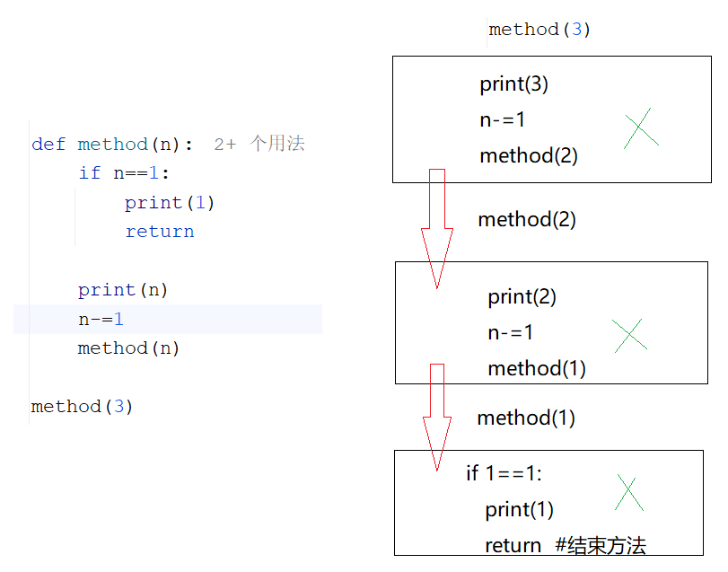

## 18.2.递归练习

### 18.2.1.阶乘

```python
需求:利用递归实现1-3的阶乘
     3*2*1   -> 相当于3乘以2的阶乘
分析:假如我们定义一个方法method,参数代表的是几的阶乘  -> method(n) -> n接收几就是几的阶乘
    method(1)   ->  1
    method(2)   -> 2*method(1)
    method(3)   -> 3*method(2)
    
    ...
    method(n)  -> n*method(n-1)
def method(n):
    if n==1:
        return 1
    return n*method(n-1)

result = method(3)
print(result)
```

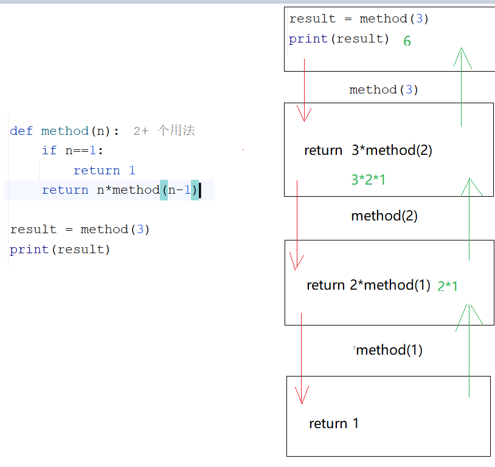

### 18.2.2.斐波那契数列_不死神兔

```python
故事得从西元1202年说起，话说有一位意大利青年，名叫斐波那契。
在他的一部著作中提出了一个有趣的问题：假设一对刚出生的小兔一个月后就能长成大兔，再过一个月就能生下一对小兔，并且此后每个月都生一对小兔，一年内没有发生死亡
问：一对刚出生的兔子，一年内繁殖成多少对兔子? 144
```

> 规律：一个数等于前两个数之和，比如: 1 1 2 3 5 8 13 21 34 55…

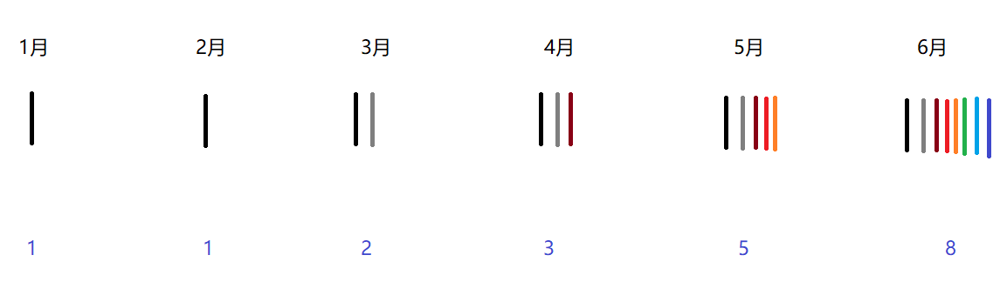

```python
分析:假设定义一个method方法,代表繁殖兔子,参数为month,代表月份

method(1)  1
method(2)  1
method(3)  2    -> method(1)+method(2)
method(4)  3    -> method(2)+method(3)
method(5)  5    -> method(3)+method(4)
method(6)  8    -> method(4)+method(5)

结论:
  method(n)   -> method(n-1)+method(n-2)
def method(month):
    if month==1 or month==2:
        return 1
    return method(month-1)+method(month-2)
print(method(12))
```

# 19.冒泡排序和二分查找

## 19.1.冒泡排序

```
1.我们默认都是升序
2.要求:
  列表中的前面的元素和后面的元素比较,大的往后走,小的往前走
```

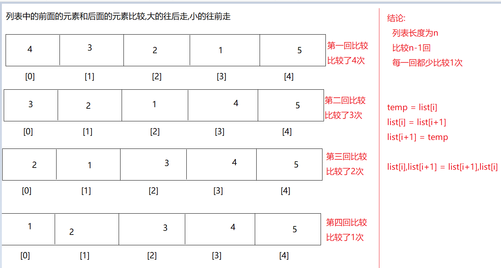

```python
def method(list1):
    # 第一回比较,比较了4次
    for i in range(0,len(list1)-1-0):
        if list1[i]>list1[i+1]:
            list1[i],list1[i+1] = list1[i+1],list1[i]

    # 第二回比较,比较了3次
    for i in range(0,len(list1)-1-1):
        if list1[i]>list1[i+1]:
            list1[i],list1[i+1] = list1[i+1],list1[i]


    # 第三回比较,比较了2次
    for i in range(0,len(list1)-1-2):
        if list1[i]>list1[i+1]:
            list1[i],list1[i+1] = list1[i+1],list1[i]

    # 第四回比较,比较了1次
    for i in range(0,len(list1)-1-3):
        if list1[i]>list1[i+1]:
            list1[i],list1[i+1] = list1[i+1],list1[i]

    return list1

list1 = [5,4,3,2,1]
result_list = method(list1)
print(result_list)
def method(list1):
    # 外面的循环控制比较多少回
    for i in range(0, len(list1) - 1):
        # 内层循环控制比较的次数以及换位,但是要保证没一回都少比较一次
        for j in range(0, len(list1) - 1 - i):
            if list1[j] > list1[j + 1]:
                list1[j], list1[j + 1] = list1[j + 1], list1[j]
    return list1


list1 = [5, 4, 3, 2, 1]
result_list = method(list1)
print(result_list)
```

## 19.2.二分查找

```python
1.前提:元素是升序的
2.中心思想:
  每次要和列表的中间索引比较,每次干掉一半
```

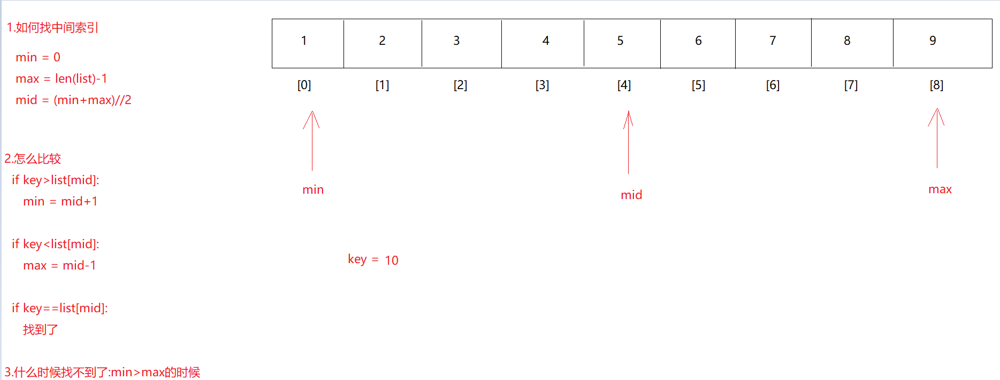

```python
def binary_search(list1, key):
    #定义最大索引和最小索引
    min = 0
    max = len(list1) - 1
    #循环查找
    while min <= max:
        #算中间索引
        mid = (min + max) // 2
        if key>list1[mid]:
            min = mid + 1
        elif key<list1[mid]:
            max = mid - 1
        else:
            return mid
    return -1


list1 = [1, 2, 3, 4, 5, 6, 7, 8, 9, 10]
result = binary_search(list1,90)
print(result)
```

# 20.匿名方法

## 20.1.匿名方法介绍

```python
1.概述:没有名字的方法,也不需要def关键字来定义,只留下参数和方法体
2.定义格式:
  lambda 参数 : 表达式

  匿名方法会将将最终的结果自动返回,不要手动写return 结果
3.使用场景:
  如果一个方法只用一次,实现非常简单,可以考虑使用匿名方法

4.注意:
  a.匿名方法只能写一行,不能写多行代码
  b.不能写代码块(if,for,while)
  c.冒号后面不能写多个表达式
  d.匿名方法中的结果自动作为返回值返回,不要写return
# 定义一个方法,实现两个整数相加
def add(a,b):
    return a+b

# 定义一个方法,实现两个整数相减
def sub(a,b):
    return a-b

#定义一个方法,实现计算
def calculate(a,b,method):
    print(f"计算的结果为:{method(a,b)}")

#调用
calculate(10,20,add)
calculate(10,20,sub)

print("========================================")
def calculate02(a,b,method):
    print(f"计算的结果为:{method(a,b)}")

calculate02(10,20,lambda a,b:a+b)
calculate02(10,20,lambda a,b:a-b)
```

## 20.2.匿名方法作为内置方法的参数使用

```python
可以将匿名方法与python中常用的内置方法结合使用
```

### 20.2.1.内置方法1:sorted()

```python
1.方法:sorted(iterable, /, *, key=None, reverse=False)
      iterable:可迭代的对象
      key:排序前对每个元素调用的方法,用返回值比较
      reverse:是否降序,True的话就是降序
    
2.作用:对序列中的元素进行排序
3.需求:定义三名学生的姓名年龄,并按照年龄进行排序
def method(dict):
    return dict["age"]

# 定义一个列表，保存多个学生信息
stu_list = [
    {"name": "张三", "age": 18},
    {"name": "李四", "age": 20},
    {"name": "王五", "age": 19},
]
# 调用sorted方法,传递stu_list,会遍历这个列表中的元素
# 在调用method的时候会自动将元素作为参数传递给method
print(sorted(stu_list,key=method))
print("===============================")
print(sorted(stu_list,key=lambda x:x["age"]))
print(sorted(stu_list,key=lambda x:x["age"],reverse=True))
```

### 20.2.2.内置方法2:map()

```python
1.方法:map(function, iterable1)
          function:方法,这个方法是对每个元素进行处理,操作
          iterator1:可迭代的对象,function传递的参数就是对这个可迭代对象中的元素进行操作
        
2.作用:对序列中的元素逐一处理->遍历
3.需求:定义一个列表,保存一些整数,让这些整数都自己乘以自己
def method(e):
    return e*e

list1 = [1,2,3,4,5]
# result = map(method,list1)
# print(list(map(method,list1)))
print(list(map(lambda e:e*e,list1)))
```

### 20.2.3.内置方法3:filter()

```python
1.方法:filter(function,iterable1)
      function:方法,此方法接收filter遍历可迭代对象中的元素,然后在这个方法中做条件判断,进行过滤
      iterable1:可迭代的对象
2.作用:对序列中的元素过滤
3.需求:定义一个列表,保存一些整数,取出大于0的元素
def method(e):
    return e>0

list1 = [1,-2,-3,-4,5]

# print(list(filter(method,list1)))
print(list(filter(lambda e:e>0,list1)))
```

### 20.2.4.内置方法4:reduce()

```python
1.方法:reduce(function,iterable1)
      function:方法,接收reduce对可迭代对象中的元素,然后进行计算
      iterable1:可迭代的对象
        
      返回是一个int值
    
2.作用:方法对序列中元素进行累积 -> 比如累加(两两相加,然后用结果和后面的数再加),累乘法(两两相乘,然后用结果和后面的数再乘)
3.需求:定义一个列表,保存一些整数,将这些整数相加
    累加,累乘等操作
from functools import reduce


def method(x,y):
    return x+y

list1 = [1,2,3,4,5]

# print(reduce(method,list1))
print(reduce(lambda x,y:x*y,list1))
```

# 21.方法的说明文档

```python
1.概述:写在方法里的文字说明
2.作用:描述这个方法的功能,需要哪些参数,返回什么结果等
def method(x,y):
    """
    :param x: 第一个参数,用于接收元素和元素之间的运算结果
    :param y: 第二个参数,代表的是后一个元素,和x做运算
    :return:  返回的是累加和
    """
    return x+y

list1 = [1,2,3,4,5]

# print(reduce(method,list1))
print(reduce(lambda x,y:x*y,list1))
```

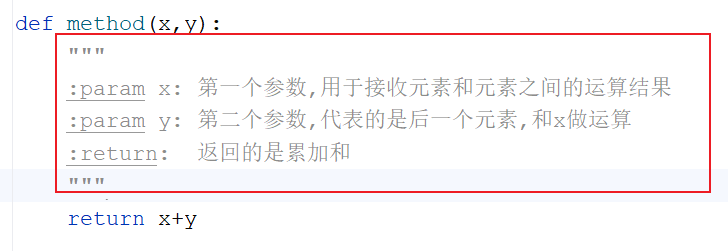

# 22.文件操作

## 22.1.操作文件

```python
1.主要作用:
  a.往文件中写数据
  b.将数据从文件中读出来
2.为啥要往文件中写数据:就是为了存数据
  之前学的列表,集合,字典,元组作为容器来说都可以存储数据,那为啥还要往文件中存呢?
  原因:列表,集合,字典,元组都是临时存储,代码运行的时候,里面的数据还在,运行完毕,里面的数据就消失了,所以我们就想着能不能将数据永久保存,我们就想将数据存到本地硬盘的文件中
  到时候想用这些数据,就可以直接从硬盘上读回来使用即可
```

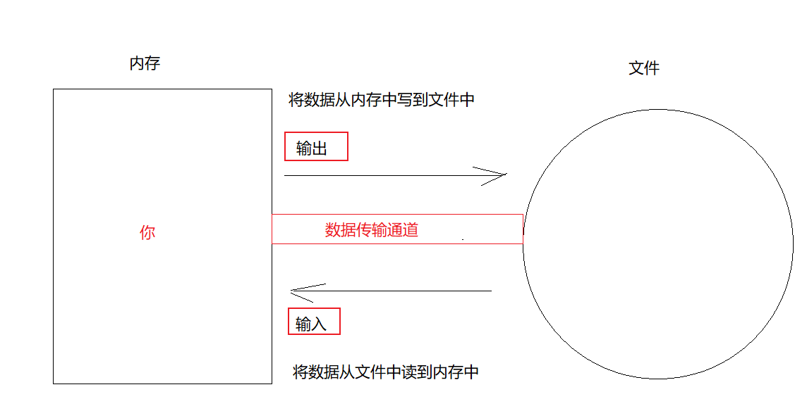

### 22.1.1.创建文件对象

```python
1.方法:
  open(文件路径,模式):打开文件通道,返回一个file对象,如果不指定模式,默认就是r[只读]
  file1 = open("文件路径",mode="读写模式",encoding="编码规则")
    
2.注意:
  a.读写模式可以组合,比如:"w+"
  b.r w a x 不能组合的,他们只能和b t +组合
```

| 模式 | 说明                                                       |
| ---- | ---------------------------------------------------------- |
| r    | 读写方式：只读，文件若不存在会报错。默认此模式             |
| w    | 读写方式：写入，写入前清空原有数据。文件不存在会创建文件   |
| a    | 读写方式：追加写入，在原有数据后追加，文件不存在会创建文件 |
| x    | 读写方式：创建新文件并写入，文件若已存在会报错             |
| b    | 编码方式：以二进制打开。一般用于非文本文件,如图片等        |
| t    | 编码方式：以文本模式打开，默认此模式                       |
| +    | 能读能写                                                   |

> 完整形式:
>
> ```python
> open(
> 
> file,  # 文件路径     [重点]
> 
> mode="r",  # 文件打开模式     [重点]
> 
> buffering=-1,  # 缓冲
> 
> encoding=None,  # 文本编码方式，一般用utf8          [重点]
> 
> errors=None,  # 报错级别
> 
> newline=None,  # 区分换行符
> 
> closefd=True,  # 传入的file参数类型
> 
> opener=None,  # 设置自定义开启器，开启器的返回值必须是一个打开的文件描述符
> 
> )
> ```

### 22.1.2.文件读写

```python
1.常用方法
  a.open("文件路径",mode="读写模式",encoding="编码规则") 打开文件,建立程序和文件之间的通道
  b.write("内容")往文件中写入内容

  c.read():读数据,方法参数可以指定读取多少个字节,如果不写,就默认都读,返回的是str
    如果读取的时候指定了文本模式(t模式),read方法返回的是字符串,读到末尾时会返回"",这个t模式是默认的
    如果读取的时候指定了二进制模式(b模式),read方法返回的是bytes字节对象,读到末尾时会返回b""(空字节串)
    
  d.close():关闭文件 ->关闭程序和文件之间的通道  
  e.readLine():一次读取一行,返回的是str,返回的内容自动包含\n,也可以传递读取指定字节数,但是我们一般不会这么干
```

#### 22.1.2.1.写数据

```python
# 调用open方法,建立内存和文件之间的通道
file1 = open("1.txt","w",encoding="utf-8")
file1.write("我爱我的祖国\n")
file1.write("一刻也不能分割\n")
file1.close()
```

#### 22.1.2.2.读数据_读取指定字节或者字符的数据

```python
# 调用open方法,建立内存和文件之间的通道
file1 = open("1.txt","rt",encoding="utf-8")
# data1 = file1.read()
# data1 = file1.read(3)
# print(data1)
#
# data2 = file1.read(3)
# print(data2)
#
# data3 = file1.read(3)
# print(data3)
# print("===========================")
# data4 = file1.read(3)
# print(data4)
while True:
    data = file1.read(5)
    if data=="":
        break
    print(data)
file1.close()
```

#### 22.4.2.3.读数据_一次读一行

```python
file1 = open("1.txt","rt",encoding="utf-8")
# data1 = file1.readline()
# print(data1)
#
# data2 = file1.readline()
# print(data2)
while True:
    data = file1.readline()
    if data=="":
        break
    print(data)
file1.close()
```

## 22.2.文件复制

```python
复制一张图片
```

### 22.2.1.思路分析

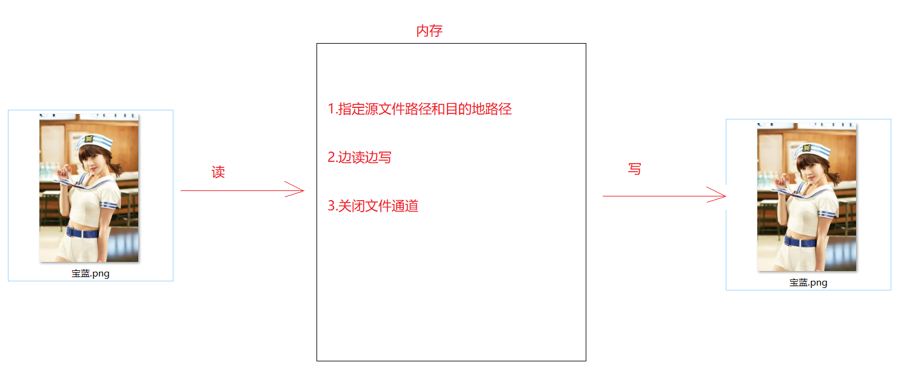

### 22.2.2.代码实现

```python
def copy_file(src_path,dst_path):
    #1.创建源文件对象
    src_file = open(src_path,"rb")
    #2.创建目标文件对象
    dst_file = open(dst_path,"wb")
    #3.边读边写
    while True:
        data = src_file.read(1024)
        if data==b"":
            break
        else:
            dst_file.write(data)
    #4.关闭文件
    dst_file.close()
    src_file.close()


copy_file("D:\\图片\\宝蓝.png","E:\\图片\\宝蓝1.png")
```

# 23.文件操作扩展

## 23.1.python中的False值

```python
python中的False值:
  False
  None
  0          # 整数 0
  0.0        # 浮点 0
  0j         # 复数 0
  ""         # 空字符串
  []         # 空列表
  ()         # 空元组
  {}         # 空字典
  set()      # 空集合
  range(0)   # 空 range
print(bool(False))    # False
print(bool(None))     # False
print(bool(0))        # False
print(bool(0.0))      # False
print(bool(0j))       # False
print(bool(""))       # False
print(bool([]))       # False
print(bool(()))       # False
print(bool({}))       # False
print(bool(set()))    # False
print(bool(range(0))) # False
if "abc":
    print("哈哈")
else:
    print("呵呵")
set1 = set()
set1.add("abc")
if set1:
    print("嘿嘿")
else:
    print("嘻嘻")
```

## 23.2.改造文件操作中的读文件操作

```python
file1 = open("1.txt","rt",encoding="utf-8")
# data1 = file1.readline()
# print(data1)
#
# data2 = file1.readline()
# print(data2)
while True:
    data = file1.readline()
    if not data:
        break
    print(data)
file1.close()
```

## 23.3.改造文件操作中的文件复制

```python
def copy_file(src_path,dst_path):
    #1.创建源文件对象
    src_file = open(src_path,"rb")
    #2.创建目标文件对象
    dst_file = open(dst_path,"wb")
    #3.边读边写
    while True:
        data = src_file.read(1024)
        if not data:
            break
        else:
            dst_file.write(data)
    #4.关闭文件
    dst_file.close()
    src_file.close()


copy_file("E:\\图片\\宝蓝.png","E:\\图片\\宝蓝1.png")
```

# 24.浅拷贝和深拷贝

```python
两个变量指向同一个对象,修改其中一个,会互相影响
arr1 = [10,20,30]
arr2 = arr1
arr2[2] = 300
print(arr1)#[10,20,300]
print(arr2)#[10,20,300]
```

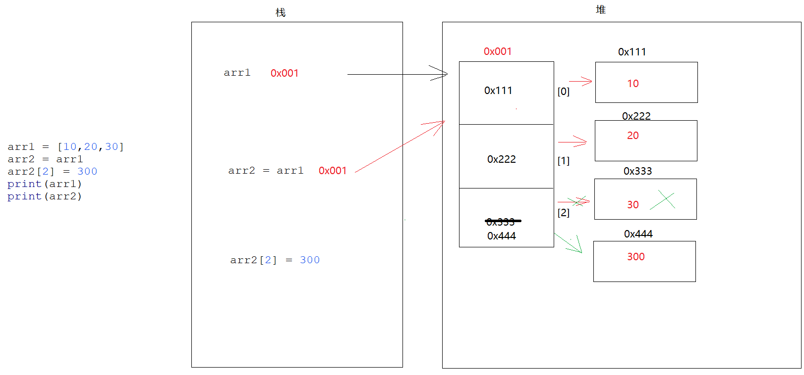

> 通过上面的代码发现,修改一个列表中的元素会影响另外一个列表,那么怎么解决呢?
>
> 拷贝

## 24.1.浅拷贝

```python
调用copy对象中的copy方法进行列表拷贝,生成一个新的列表对象,产生了新的空间
import copy

arr1 = [10,20,30]
arr2 = copy.copy(arr1)
arr2[2] = 300
print(arr1)#[10,20,30]
print(arr2)#[10,20,300]
```

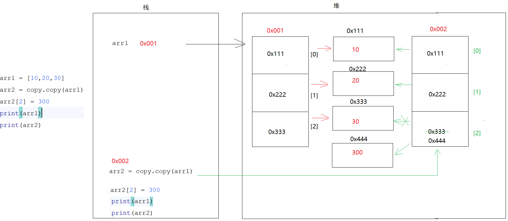

> 浅拷贝存在的问题:
>
> 如果arr1中嵌套了列表,修改浅拷贝生成的新列表arr2中的列表数据,会影响arr1

## 24.2.深拷贝

```python
创建一个外层容器,并对其内部所有的可变对象进行递归复制
import copy

arr1 = [10,20,[30,40]]#嵌套列表
print(arr1)#[10, 20, [30, 40]]
arr2 = copy.deepcopy(arr1)
arr2[2][0] = 300
print(arr1[2][0])#30
print(arr2[2][0])#300
```

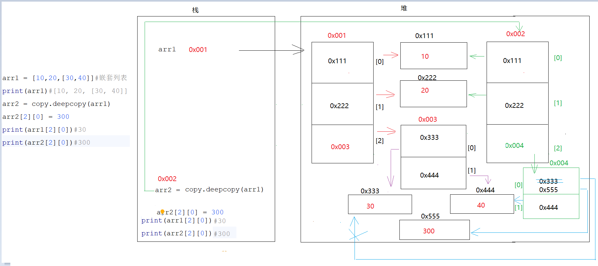

> 深拷贝:即使列表中嵌套列表,修改一个列表中的数据,也不会影响另外一个列表中的数据->因为深拷贝会将嵌套的列表都重新拷贝一份儿

# 25.面向对象介绍

```python
1.什么叫做面向对象:是一种编程方式,是一种编程思想
  a.python是一个支持面向对象思想编程的语言(python是一个支持多种编程范式的语言->面向过程+面向对象+函数式编程)
  b.java的代码都是写在类中的,所以java是纯面向对象的
    python不是说所有的代码必须写在类中,所以python不是纯面向对象的
2.为啥要使用面向对象思想编程:
  为了少写代码,有很多功能别人都准备好了,我们直接调用就行了,不用我们自己一步一步实现了
3.什么时候使用面向对象思想编程:
  当想用别人准备好的功能时,就要使用面向对象思想编程了
4.怎么使用面向对象思想编程:
  找对象,去用对象名点成员
list1 = [1,2,3,4,5]
# 面向对象思想编程
"""
  list1就相当于一个对象
  reverse就相当于这个对象提前定义好的功能
  我们直接用list1这个对象实现好的reverse功能就直接实现了元素翻转
  
  代码写起来就简单了,少了
"""
list1.reverse()
print(list1)
```

# 26.类和对象

## 26.1.类_class

```python
1.概述:一类事物的抽象表示形式  -> 包含了这一类事物中共同的属性(这些对象有啥)和行为(这些对象能干啥)
2.组成部分:
  a.类的初始化方法(在这个初始化方法里面定义实例属性):初始化对象属性的方法,在创建对象之后会自动调用,主要用于定义实例属性以及为属性赋值
    __init__(self,属性1,属性2...):
        self.属性名 = 属性值
        
  b.实例(对象)方法:这类事物能干啥      
class Person:
    """
      __init__:初始化方法,在创建对象的之后会自动代用,作用就是为属性初始化
      self:代表的是当前对象,哪个对象调用的self所在的方法,self就代表哪个对象
      name和age就是我们定义的实例属性

      在init中为属性赋值
    """
    def __init__(self,name,age):
        self.name = name
        self.age = age

    #实例方法
    def eat(self):
        print(f"{self.name}正在吃东西...")

    def drink(self):
        print(f"{self.name}正在喝东西...")

    def la(self):
        print(f"{self.name}正在拉屎...")

    def sa(self):
        print(f"{self.name}正在撒尿...") 
```

## 26.2.对象_object

```python
1.概述:一类事物的具体体现
2.格式:
  对象名 = 类名(为属性赋的具体的值)
3.调用实例属性和实例方法
  对象名.属性名 = 值
  对象名.方法名(实参)  
class Person:
    """
      __init__:初始化方法,在创建对象的之后会自动代用,作用就是为属性初始化
      self:代表的是当前对象,哪个对象调用的self所在的方法,self就代表哪个对象
      name和age就是我们定义的实例属性

      在init中为属性赋值
    """
    def __init__(self,name,age):
        self.name = name
        self.age = age

    #实例方法
    def eat(self):
        print(f"{self.name}正在吃东西...")

    def drink(self):
        print(f"{self.name}正在喝东西...")

    def la(self):
        print(f"{self.name}正在拉屎...")

    def sa(self):
        print(f"{self.name}正在撒尿...")


# 创建对象
p1 = Person("张三",18)
print(p1.name,p1.age)
p1.eat()
p1.drink()

print("===========================")
p2 = Person("王五",20)
print(p2.name,p2.age)
p2.eat()
p2.drink()
```

> 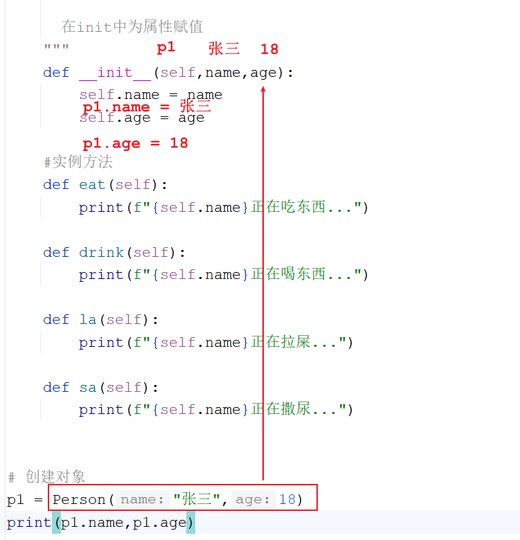

## 26.3.对象_对象的内存图说明

```python
class Person:

    def __init__(self,name,age):
        self.name = name
        self.age = age

    #实例方法
    def eat(self):
        print(f"{self.name}正在吃东西...")

# 创建对象
p1 = Person("张三",18)
print(p1.name,p1.age)
p1.eat()


print("===========================")
p2 = Person("王五",20)
print(p2.name,p2.age)
p2.eat()
```

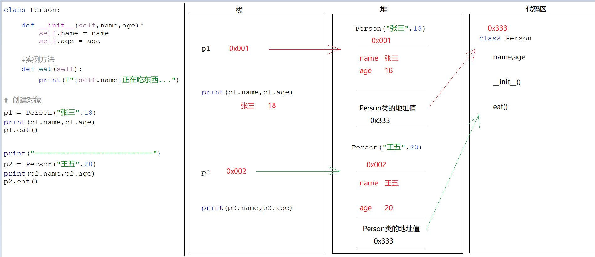

# 27.类中成员的说明

## 27.1.init方法

```python
1.概述:__init__叫做初始化方法
2.作用:在创建对象的时候对对象的属性进行初始化
3.特点:当我们创建对象之后,python会自动调用__init__方法,并将新创建的对象作为第一个参数(第一个参数名通常叫做self)传给self
4.注意:
  a.__init__方法不是必须提供的,如果没有显式写出,python底层会提供一个默认的__init__,只不过方法体没有赋值而已
  b.利用只有一个self参数的init创建对象,此时在init中需要直接为属性赋值 
  c.如果同时写了两个init,后面的会把前面的覆盖掉,但是无参的没有意义
class Person:

    def __init__(self,name,age):
        self.name = name
        self.age = age

    def __init__(self):
        self.name = "张三"

p1 = Person("张三")
print(p1.name)
print(p1.age)
```

## 27.2.init方法中的self参数说明

```python
1.概述:self接收的是当前对象  -> 哪个对象调用的self所在的方法,self就代表哪个对象
2.作用:用于接收调用方法的那个对象
3.使用:调用方法的时候python会自动给self传递对象
4.注意:在类中,不能在一个实例方法中调用另外一个实例方法,只能用self去调用
class Person:
    def __init__(self,name,age):
        self.name = name
        self.age = age

    def eat(self):
        print(id(self),"**************")
        print(f"{self.name}正在吃东西...")


p1 = Person("张三",18)
print(p1.name,p1.age)
p1.eat()
print(id(p1))

print("===========================")

p2 = Person("王五",20)
print(p2.name,p2.age)
p2.eat()
print(id(p2))
```

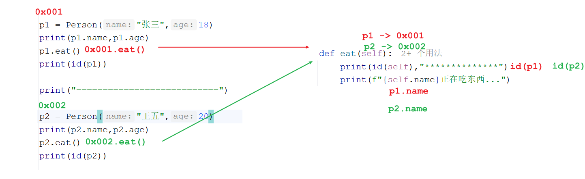

## 27.3.实例属性

```python
1.概述:实例属性也叫实例变量,所谓的实例就是对象,在类的init方法中定义的属性就是实例属性,通过在init中使用self.属性名定义
2.访问:
  对象名.属性名
3.特点:
  不同的对象为自己的属性赋值,互不影响
class Person:
    def __init__(self, name, age):
        """
           self.后面的就是实例属性
           self.属性名  -> 在定义实例属性
        :param name:
        :param age:
        """
        self.name = name
        self.age = age
        
p1 = Person("张三", 18)
print(p1.name, p1.age)
print("======================")
p2 = Person("王五",20)
print(p2.name, p2.age)
```

## 27.4.类属性

```python
1.概述:也叫做类变量,在类中方法外定义
2.作用:给根据该类创建出来的对象进行数据共享
3.使用:
  a.类名直接调用(推荐)
  b.对象名调用(不推荐)
4.注意:
  a.类属性和实例属性尽量不要重名
    如果重名的话->对象名.变量名 就是实例变量,不是类变量
  b.类属性和实例属性如果重名,调用实例变量就用对象名调用,调用类变量就用类名调用
class Person:
    # 类属性
    classroom = "教研室11"

    def __init__(self, name, age):
        self.name = name
        self.age = age

Person.classroom = "教研室12"

p1 = Person("张三", 18)
print(p1.name, p1.age)
print(p1.classroom)
# print(Person.classroom)
print("======================")
p2 = Person("王五",20)
print(p2.name, p2.age)
print(p2.classroom)
# print(Person.classroom)
```

## 27.5.实例方法

```python
1.概述:在类中定义的方法,一个参数为self,代表当前对象
2.作用:代表的是为此类提供一些行为,功能
3.特点:
  a.实例方法只能被对象调用
  b.可以访问实例属性,类属性,类方法
  c.实例方法的第一个参数是self,用于接收python自动传递过来的对象,self为变量名,可以叫别的,但是尽量不要改名字(习惯,规范)
4.使用:
  对象名去调用
class Person:
    def __init__(self, name, age):
        self.name = name
        self.age = age

    #实例方法
    def eat(self):
        print(f"{self.name}正在吃东西...")

p1 = Person("张三", 18)
p1.eat()
```

## 27.6.类方法

```python
1.概述:在类中定义的方法(定义位置和实例方法一样),通过@classmethod定义,类方法的第一个参数为cls,代表的是这个类本身
2.使用:
  类名直接调用(推荐)
3.使用场景:
  适合一些和类整体相关的操作 -> 比如:可以获取类的一些相关信息
class Person:

    """
    这是一个人类
    """
    def __init__(self, name, age):
        self.name = name
        self.age = age
#     类方法
    @classmethod
    def method(cls):
        print(cls.__dict__)#获取类中的具体信息
        print("=====================")
        print(cls.__doc__)#获取类中的说明文档

Person.method()
```

## 27.7.静态方法

```python
1.概述:也是定义在类中,通过@staticmethod定义
2.使用:
  类名直接调用
3.注意:
  它不访问类或者实例的内部信息,一般都当做工具方法使用,提高代码的复用性
4.使用场景:
  定义工具类使用
5.工具类:
  首先是个类,里面会抽取很多需要反复实现的功能
class ArrayUtils:
    @staticmethod
    def sum(*arr):
        sum = 0
        for e in arr:
            sum+=e

        return sum


print(ArrayUtils.sum(1,2,3,4,5))
print(ArrayUtils.sum(11,22,33,44,55))
```

## 27.8.类方法和静态方法的区别

|                | 类方法 `@classmethod` | 静态方法 `@staticmethod` |
| -------------- | --------------------- | ------------------------ |
| 第一个参数     | `cls`（类本身）       | 没有 `self` / `cls`      |
| 能访问类属性   | ✅ 能                  | ❌ 不能直接访问           |
| 能访问实例属性 | ❌ 不能                | ❌ 不能                   |
| 本质           | 和“类”绑定的方法      | 只是“放在类里的普通方法” |

## 27.9.动态添加属性与方法

### 27.9.1.动态给对象添加属性_添加[实例属性]

```python
直接创建对象,用对象名点想要添加的属性名,然后赋值,这个实例属性只绑定在当前对象上,不会给其他对象共享
class Person:
    def __init__(self, name):
        self.name = name

p1 = Person("张三")
print(p1.name)
# print(p1.age)Person中没有定义age属性,所以报错
# 添加age属性
p1.age = 18
print(p1.age)
```

### 27.9.2.动态给类添加属性_添加[类属性]

```python
直接类名点属性名,这样根据这个类创建出来的对象都能使用这个属性(共享)
class Person:
    def __init__(self, name):
        self.name = name

# 给类添加类属性
Person.age = 18

p1 = Person("张三")
print(p1.name,Person.age)
```

### 27.9.3.动态给类添加类外面的[普通方法]

```python
在类外面定义一个普通的方法,然后将这个方法加到类中
class Person:
    def __init__(self, name):
        self.name = name

#定义普通方法
def eat():
    print("吃饭")

#外部的普通方法不会自动接收self参数,需要调用方法的时候手动传入对象
def drink(self):
    print(f"{self.name}正在喝东西...")

p1 = Person("张三")
p1.eat = eat
p1.eat()

print("======================")

p1.drink = drink
p1.drink(p1)
```

### 27.9.4.动态给类添加[实例方法]

```python
1.概述:将类外面的方法给对象添加成实例方法,这个实例方法只能绑定在当前对象上,不会共享给其他对象
2.使用:
  types.MethodType(方法名,实例对象)
import types


class Person:
    def __init__(self, name):
        self.name = name

def eat(self):
    print(f"{self.name}正在吃东西...")

p1 = Person("张三")
p1.eat = types.MethodType(eat,p1)
p1.eat()
```

### 27.9.5.动态给类添加[类方法]和[静态方法]

```python
1.概述:将外面的方法给类添加成类中的类方法和静态方法
2.注意:添加的方法对它的所有对象都生效，添加类方法需要传入 cls 参数，添加静态方法则不需要传 cls 参数
class Person:
    def __init__(self, name):
        self.name = name

#添加类方法
@classmethod
def class_method(cls):
    print("类方法")

#添加静态方法
@staticmethod
def static_method():
    print("静态方法")

Person.class_method = class_method
Person.static_method = static_method
Person.class_method()
Person.static_method()
```

# 28.封装

```python
面向对象三大特征:封装   继承   多态
```

## 28.1.介绍和基本使用

```python
1.概述:将细节隐藏起来(不让外界直接或者随意使用),同时对外提供一套公共的接口(让调用者通过这个公共的接口间接使用封装起来的细节)
2.表现形式:
  a.将代码放到一个方法中
  b.将代码放到一个类中
  c.将方法和属性前面加上__,代表的是这个成员被私有化了(被私有化的成员只能在当前类中使用,出了这个类不能直接使用了)
3.使用场景:
  a.不让外界直接调用
  b.类中的成员不想被继承
class Person:
    def __init__(self, name, age):
        self.name = name
        self.__age = age

    #私有化方法
    def __eat(self):
        print(f"{self.name}正在吃东西...")

    def drink(self):
        self.__eat()
        print(f"{self.name}正在喝东西...")

p1 = Person("张三", -18)
# print(p1.name, p1.age)  age被私有化了,外界不能直接调用
# p1.eat()  eat被私有化了,外界不能直接调用
p1.drink()
```

## 28.2.为私有属性提供公共的接口

```python
1.概述:
  为私有属性提供的公共接口
2.作用:
  取值  
  赋值,修改值
3.用到的注解:
  @property:取值
     a.要求:将属性名前的__去掉当成方法名
     b.作用:将方法名变成属性来取值    
    
  @属性名.setter:赋值
     a.要求:将属性名前的__去掉当成方法名
     b.作用:将方法名变成属性来赋值
4.注意:
  先写@property,再写@属性名.setter
  因为需要先用@property将对应的方法名变成属性
  才能使用@属性名.setter,也就是说setter前面的@属性名其实是@property修饰的方法名
class Person:
    def __init__(self, name):
        self.__name = name

    @ property
    def name(self):
        return self.__name

    @ name.setter
    def name(self, name):
        self.__name = name

p1 = Person("张三")
print(p1.name)#调用的是@property修饰的方法名
p1.name = "赵四"#调用的是@name.setter修饰的方法名
print(p1.name)
```

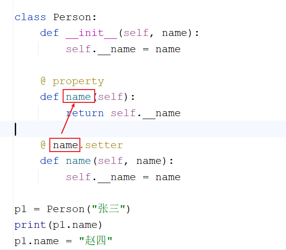

> ```python
> 1.问题:
>   如果我们不定义私有属性,那么能用@property和@属性名.setter嘛?
> 
> 2.回答:
>   a.如果只在@property修饰的方法中取值,在@属性名.setter修饰的方法中赋值,就没意义
> 
>   b.但是如果想为属性做一个赋值的限制,就有意义了,我们可以在@property修饰的方法中和在@属性名.setter修饰的方法中做对属性赋值的判断或者对属性值的操作
> ```

## 28.3.封装的说明

```python
1.注意:其实python中将成员封装之后,并不是外界完全使用不了私有的成员了,其实是有办法的
2.访问私有成员:
  对象._类名__私有成员名
3.原因:
  python底层会将__成员名改成_类名__成员名 -> 类似于java中的反射
class Person:
    def __init__(self, name):
        self.__name = name

p1 = Person("张三")
# print(p1.__name)
# print(p1.name)
# 对象._类名__私有成员名
print(p1._Person__name)
```

# 29.继承

```python
1.概述:python中代码的一种设计思想
2.作用:
  子类继承父类之后,可以直接使用父类中非私有成员,提高代码的复用性,减少了重复性代码
3.好处:
  继承之后,提高了代码的复用性,同时附带灵活性,因为子类继承父类之后,可以直接使用父类中非私有成员,同时还可以在子类中定义子类特有的成员  
```

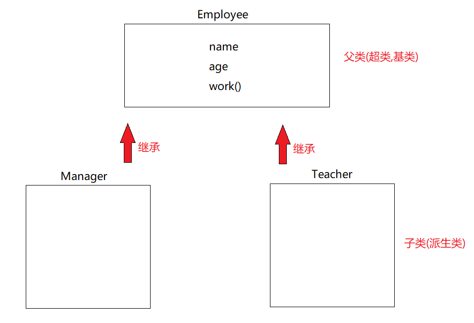

## 29.1.单继承

```python
1.格式:
  class 子类(父类):
class Employee:
    def __init__(self, name):
        self.name = name

    def work(self):
        print(f"{self.name}正在工作...")


class Teacher(Employee):
    #定义子类特有功能
    def prepare_lesson(self):
        print(f"{self.name}正在准备课程...")

t1 = Teacher("张三")
print(t1.name)
t1.work()
t1.prepare_lesson()
```

## 29.2.多继承

```python
1.概述:多继承指的是一个子类可以同时继承多个父类
2.格式:
  class 子类(父类1,父类2):
3.注意:
  在多继承的前提下调用方法,如果多个父类中有一样的方法,那么会从左到右的顺序依次查找调用
  当然,子类中有这个方法,肯定是先调用子类中的
class Employee:
    def __init__(self, name):
        self.name = name

    def work(self):
        print(f"{self.name}正在工作...")


class Teacher():
    def __init__(self, name):
        self.name = name

    def prepare_lesson(self):
        print(f"{self.name}正在准备课程...")
    

class AITeacher(Employee, Teacher):
    # 子类特有功能
    def teach_python(self):
        print(f"{self.name}正在教python...")

ai1 = AITeacher("张三")
ai1.teach_python()
ai1.work()
ai1.prepare_lesson()
class Employee:
    def __init__(self, name):
        self.name = name

    def work(self):
        print(f"{self.name}正在工作...")


class Teacher():
    def __init__(self, name):
        self.name = name

    def work(self):
        print(f"{self.name}正在讲课...")

class AITeacher(Employee, Teacher):
    # 子类特有功能
    def teach_python(self):
        print(f"{self.name}正在教python...")

    # def work(self):
    #     print(f"{self.name}正在瞎教,胡教,正在台上叭叭...")

ai1 = AITeacher("张三")
ai1.work()
```

## 29.3.复用父类方法的使用_super()

```python
1.概述:super()是python中的一个内置方法
2.作用:可以调用父类中的成员
3.格式:
  super().父类方法名()
class Employee:
    def __init__(self, name):
        self.name = name

    def work(self):
        print(f"{self.name}正在工作...")


class Teacher(Employee):
    #定义子类特有功能
    def prepare_lesson(self):

        #调用父类中的work方法
        super().work()

        print(f"{self.name}正在准备课程...")

t1 = Teacher("张三")
t1.prepare_lesson()
```

## 29.4.super()调用方法的解析顺序

```python
1.注意:super()其实不代表父类对象
      也不是严格按照直接调用父类中的方法来执行的
      而是按照mro继承链中的顺序调用方法的
    
2.什么是mro继承链:
  说白了就是一个子类的继承顺序(体系)
      
3.查看mro继承链(继承顺序)
  类名.__mro__     
class A:
    def __init__(self,name):
        self.name = name

    def method(self):
        print("A类中的method方法")

class B(A):

    def method(self):
        print("B类中的method方法")

class C(A):
    def method(self):
        """
          按常理来说:
            C类的父类是A,但是没有走A中的method,却走的是B的
            所以,super()不是直接找父类,而是按照mro继承链中的
            顺序调用的
        """
        super().method()#走的是B类的,而不是A类的
        print("C类中的method方法")

class D(C,B):
    pass


print(D.__mro__)#获取类D的继承链
d1 = D("张三")
d1.method()
```

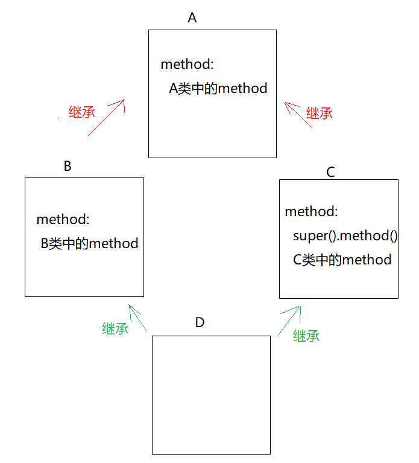

## 29.5.方法的重写

```python
1.概述:在子类中有一个和父类一样的方法
2.使用:创建子类对象,调用重写的方法
class Employee:
    def __init__(self, name):
        self.name = name

    def work(self):
        print(f"{self.name}正在工作...")


class Teacher(Employee):
    def work(self):
        print(f"{self.name}正在吹牛x...")

t1 = Teacher("张三")
t1.work()
```

**方法重写的使用场景**

```python
在子类中对父类中的某个功能进行升级改造
```

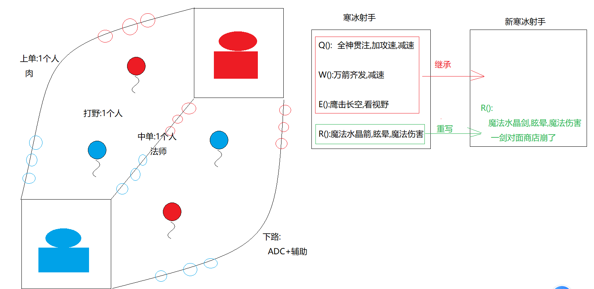

```python
class HanBing:
    def __init__(self, name):
        self.name = name

    def q(self):
        print(f"{self.name}正在使用(全神贯注)技能...")

    def w(self):
        print(f"{self.name}正在使用(万箭齐发)技能...")

    def e(self):
        print(f"{self.name}正在使用(鹰击长空)技能...")

    def r(self):
        print(f"{self.name}正在使用(魔法水晶箭)技能...")


class NewHanBing(HanBing):
    def r(self):
        super().r()
        print("一剑摧毁对方商店")


hb1 = NewHanBing("艾希")
hb1.q()
hb1.w()
hb1.e()
hb1.r()
```

# 30.多态

## 30.1.基本使用

```python
1.概述:一个对象有不同的形态
2.常见的多态前提:
  a.继承
  b.方法的重写
  c.父类引用指向子类对象
3.好处:
  一个变量可以动态接收不同的对象,接收哪个对象就用那个对象的方法

4.注意:python中的多态主要还是强调不同类中有相同的方法
class Animal:
    def eat(self):
        print("吃吃吃")

class Dog(Animal):
    def eat(self):
        print("🐶喜欢吃💩")

class Cat(Animal):
    def eat(self):
        print("🐱喜欢吃🐟")

# 定义一个方法,这个方法统一调用传递过来不同对象的eat
def method(animal):
    animal.eat()

dog = Dog()
method(dog)
cat = Cat()
method(cat)
```

> 其实在python中的多态不强调是否真的继承了,在不同的类中只要有相同的方法,就可以完成python中多态的写法

## 30.2.多态的弊端_扩展

```python
弊端:如果子类中有特有方法,调用的时候可能会出现一些问题
class Animal:
    def eat(self):
        print("吃吃吃")

class Dog(Animal):
    def eat(self):
        print("狗吃屎")

    #特有方法
    def look_home(self):
        print("狗会看家")

class Cat(Animal):
    def eat(self):
        print("猫吃鱼")

    #特有方法
    def catch_mouse(self):
        print("猫会抓老鼠")

# 定义一个方法,这个方法统一调用传递过来不同对象的eat
def method(animal):
    animal.eat()
    #如果animal接收的是cat,cat中没有定义look_home方法,就会报错
    animal.look_home()
    #如果animal接收的是dog,dog中没有定义catch_mouse方法,就会报错
    animal.catch_mouse()

dog = Dog()
method(dog)
cat = Cat()
method(cat)
```

## 30.3.判断对象类型_扩展

```python
1.如何判断对象的类型
  isinstance(变量名,类型)   -> 判断这个变量是否属于指定的类型
class Animal:
    def eat(self):
        print("吃吃吃")

class Dog(Animal):
    def eat(self):
        print("狗吃屎")

    #特有方法
    def look_home(self):
        print("狗会看家")

class Cat(Animal):
    def eat(self):
        print("猫吃鱼")

    #特有方法
    def catch_mouse(self):
        print("猫会抓老鼠")

# 定义一个方法,这个方法统一调用传递过来不同对象的eat
def method(animal):
    animal.eat()
    #如果animal接收的是cat,cat中没有定义look_home方法,就会报错
    #animal.look_home()
    #如果animal接收的是dog,dog中没有定义catch_mouse方法,就会报错
    #animal.catch_mouse()
    if isinstance(animal,Dog):
        animal.look_home()
    elif isinstance(animal,Cat):
        animal.catch_mouse()
    else:
        print("不许瞎传")

dog = Dog()
method(dog)
cat = Cat()
method(cat)
```

## 30.4.鸭子类型_扩展

```python
1.概述:python在多态中的一种设计思想
2.特点
  a.不需要继承
  b.不同类中拥有同名的方法 -> 只要有相同方法，就能当同一类来用
3.好处:
  一个变量可以动态接收不同的对象,接收哪个对象就用那个对象的方法
class Animal:
    def eat(self,obj):
        obj.eat()

class Dog:
    def eat(self):
        print("狗吃屎")


class Cat:
    def eat(self):
        print("猫吃鱼")

animal = Animal()
animal.eat(Dog())
animal.eat(Cat())
```

# 31.异常的介绍

```python
1.说明:python是一门解释型语言,只有在程序运行的时候才会进行语法检查,所以,只有在运行代码的时候才能真正知道程序能不能正常运行
2.分类:
  a.语法错误
  b.异常:
    普通异常常用父类 : Exception
```

## 31.1.语法错误

```python
程序在解析代码的时候遇到的错误
def method():
    print("方法开始执行")
    while True
        print("语法错误")
method()
```

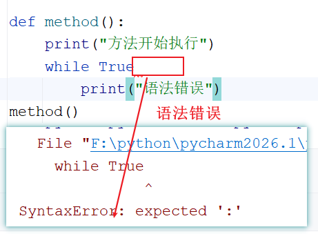

```python
上面的代码出现了语法错误,python在运行的时候先要保证语法没有问题,现在语法有问题了,所以语法错误上面的代码都不会执行
```

> 语法错误,不需要异常处理,因为语法错误不属于异常,直接改代码即可

## 31.2.异常

```python
1.概述:程序的语法没有问题,但是在运行的时候,就会出现问题,这种叫做异常
2.异常的出现过程:
  从出现异常的这一行开始,python解释器判断此处的异常有没有处理,如果没有处理,会自动调用raise将异常抛给调用处,再看调用处有没有处理异常,如果还没处理,最终会用raise将异常抛给python解释器,python解释器先将异常打印到控制台上,然后终止程序
def method():
    print("方法开始执行")
    arr1 = (1,2,3,4,5)
    print(arr1[10])#IndexError: tuple index out of range
    print("嘿嘿嘿嘿")

method()
print("哈哈哈哈")
```

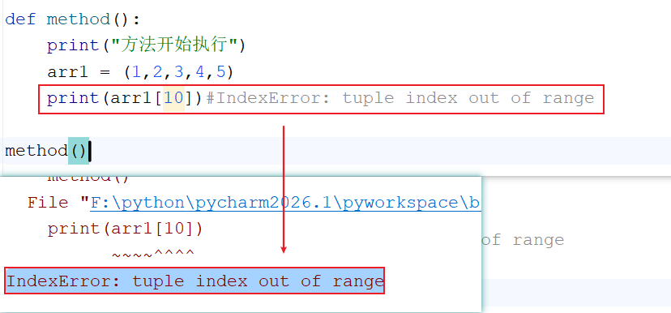 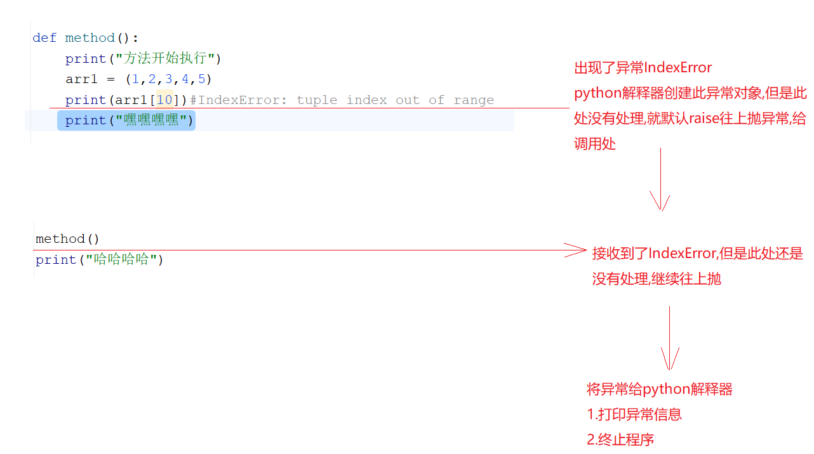

> 异常需要处理

# 32.异常处理

```python
1.注意:异常处理不是说将异常规避了,而是在程序运行的过程中,出现异常的时候给一个解决方案,异常处理之后,下面的代码不影响执行
```

## 32.1.try…except

```python
1.语法:
  try:
    可能出现异常的代码
  except 异常类型 as 变量名: 
    异常处理的代码  -> 一般情况下直接输出异常信息,开发中一般会将异常信息保存到日志文件中
    
2.执行流程:    
  a.如果try中的代码没有发生异常,程序不走 except ,下面的代码会继续往下走
  b.如果try中的代码发生了异常,会直接执行except进行捕获,捕获到了就执行except里面的代码,如果没有捕获到,相当于没有处理
    
3.注意:
  a.except必须要捕获到异常,如果捕获不到,证明没处理,那么异常就会自动往外抛出最终给python解释器,python解释器直接将异常信息打印到控制台上并结束程序,后面的代码也就不会走了

  b.except后面不写具体异常类型,就证明啥异常都能捕获
    
4.快速处理异常快捷键:
  a.选中要处理的代码
  b.ctrl+alt+t
def add():
    print(1/0)
    print("添加功能")

try:
    add()
except Exception as e:
    print(e,"程序异常了")

print("删除功能")
print("修改功能")
print("查询功能")
```

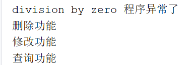

## 32.2.处理不同类型的异常

```python
1.格式:
  try:
    可能出现异常的代码
  except 异常类型 as 变量名: 
    异常处理的代码
  except 异常类型 as 变量名: 
    异常处理的代码
  except 异常类型 as 变量名: 
    异常处理的代码
  except (异常类型,异常类型,异常类型)as 变量名: 
    异常处理的代码  
2.执行特点:
  哪个except捕获到异常了,就走哪个except
try:
    tuple1 = (1, 2, 3)
    print(tuple1[5])
    print(1 / 0)
    print("修改功能")
except ZeroDivisionError as e:
    print(e, "0不能做除数")
except IndexError as e:
    print(e, "索引越界")
except (TypeError, NameError) as e:
    print(e, "类型错误或者未定义")
except:
    print("Unexpected error")
```

> 注意:
>
> 如果用except捕获异常,但是没有捕获到,相当于没有捕获,那么try…except后面的代码是不会走的
>
> ```python
> try:
> result = 3 / 0
> # print(result1)
> except NameError as e:
> print(e)
> print("我要执行了")
> ```

## 32.3.else关键字_了解

```python
1.概述:将else放到所有except后面
2.格式:
  try:
    可能发生异常的代码
  except 异常类型1 as 变量名1:
    异常处理的代码
  except 异常类型2 as 变量名2:
    异常处理的代码
  except(异常类型3) as 变量名3:
    异常处理的代码
  except:
    异常处理的代码
  else:
    没有异常时执行的代码
3.注意:
  else中的代码其实跟放到try里面效果是一样的,都是try里面的代码有异常了就不走try下面的代码了;没有出异常才会走
  仅仅是为了结构清晰一点,走了else中的代码能够清晰的说明没有异常发生
try:
 # result = 3 / 1
 result = 3 / 0
 # print("没有异常执行的代码")
except ZeroDivisionError as e:
 print(e)
else:
 print("没有异常执行的代码...")
```

## 32.4.finally关键字

```python
1.格式:
  try:
    可能出现的异常代码
  except 异常 as 变量名:
    异常处理的代码
  finally:
    不管有没有异常,不管是否捕获到了异常,都一会定执行的代码
2.含义:
  不管有没有异常,不管是否捕获到了异常,都一会定执行的代码
3.finally的意义:
  关闭资源,释放资源
try:
 result = 3 / 0
 print(result)
 # print("没有异常执行的代码")
except ZeroDivisionError as e:
 print(e)
finally:
 print("不管是会否有异常或者是否能捕获到异常,我必须走")
```

## 32.5.raise抛出异常

```python
1.问题描述:当我们调用别人提供给咱们的方法时,人家在底层实现的时候,有可能会判断,如果出现什么情况,就会抛出什么异常,此时这个异常就会抛给我们调用者,然后我们自己try处理一下

2.格式: 抛出异常
  raise 异常(异常信息)
def int_add(x, y):
    if isinstance(x, int) and isinstance(y, int):
        return x + y
    else:
        # 抛出异常
        raise TypeError("参数类型错误")


try:
    result = int_add(1, "2")
    print(result)
except:
    print("程序异常了")
```

## 32.6.assert断言_了解

```python
1.作用:
  用于判断一个条件表达式,如果这个条件表达式的结果为false,触发异常
2.格式:
  assert 条件表达式,异常信息

  等价于:
  if not 条件表达式:
    raise 异常(异常信息)
    
3.使用场景:
  一般用于调试程序,调试之后需要将assert干掉 -> 了解
def int_add(x, y):
    assert isinstance(x, int) and isinstance(y, int),"参数类型错误"
    return x + y

try:
    result = int_add(1, 2)
    print(result)
except:
    print("程序异常了")
```

# 33.自定义异常

```python
1.问题描述:
  将来如果我们抛出的异常不是python自带的,这个时候就需要我们自己自定义异常
2.格式:
  class 自定义类名(Exception):
"""
  自定义异常类
"""
class MyTypeError(Exception):
    def __init__(self, message):
        self.message = message

def int_add(x, y):
    if isinstance(x, int) and isinstance(y, int):
        return x + y
    else:
        # 抛出异常
        raise MyTypeError("自定义异常-参数类型错误")


try:
    result = int_add(1, "2")
    print(result)
except MyTypeError as e:
    print(e)
```

# 34.异常的传递

```python
1.问题描述:
  当存在 try 嵌套或函数嵌套时，若内层出现了异常且在内层无法处理，会将异常一层一层向外传递，直到异常被处理或程序报错
try:
 try:
  try:
   print(1 / 0)
  except NameError as e:
   print("第三层", e)
 except TypeError as e:
  print("第二层", e)
except Exception as e:
 print("第一层",  e)
```

# 35.with关键字

```python
1.问题描述:
  如果要是写文件流对文件进行读写的代码,用try except finally做异常处理,会比较麻烦
2.解决:
  Python中的with语句用于异常处理，但是它简化了try except finally的异常处理操作,让异常处理的代码更加清晰明了
3.格式:
  with 表达式 as 对象名:
    代码
try:
 file1 = open("1.txt","wt",encoding="utf-8")
 file1.write("helloworld")
 # file1.close()
except Exception as e:
    print(e)
finally:
 #判断文件对象是否关闭
 print(file1.closed)
try:
 with open("1.txt","wt",encoding="utf-8") as file1:
  file1.write("helloworld11")
except Exception as e:
    print(e)
finally:
 #判断文件对象是否关闭
 print(file1.closed) #True
使用with表达式简化了文件操作的异常处理:
==========================================
try:
 with open("1.txt","wt",encoding="utf-8") as file1:
  file1.write("helloworld11")
except Exception as e:
    print(e)
```

# 36.常见的异常

## 36.1.异常父类

| 异常            | 说明                                                         |
| --------------- | ------------------------------------------------------------ |
| BaseException   | 所有内置异常的基类。它不应该被用户自定义类直接继承（这种情况请使用[Exception](../markdown?picdocpreview=https%3A%2F%2Fpcsdata.baidu.com%2Frest%2F2.0%2Fdocview%2Ftext%3Fobject%3Df8bfcde6ai50f4b96d4d9fab4d8b1e45%26expires%3D24h%26dp_logid%3D8680432554876331136%26rt%3Dpr%26sign%3DFOTRE-DCb740ccc5511e5e8fedcff06b081203-9hubF%252FdGX6Ok1GQl9eaoWfTlcrM%253D%26file_size%3D24989%26timestamp%3D1782354062%26method%3Dinfo%26fid%3D1103660497041-250528-399304926474168%26client_type%3Dpcygj%26file_type%3Dmd&server_filename=day09_错误_异常_包.md&path=%2F我的资源%2Flining-loAI全能开发260528线上同步%2F01-lining-loAI全能开发技术之Python基础%2F03-视频%2Fday09_错误_异常_导包%2F资料%2Fday09_错误_异常_包%2Fday09_错误_异常_包.md&fs_id=399304926474168&size=24989&uk=1103660497041&from=yuanguanjia&fsid=399304926474168&clienttype=8&scence=mac_main#Exception)）。 |
| Exception       | 所有内置的非系统退出类异常都派生自此类。所有用户自定义异常也应当派生自此类。 |
| ArithmeticError | 此基类用于派生针对各种算术类错误而引发的内置异常：[OverflowError](../markdown?picdocpreview=https%3A%2F%2Fpcsdata.baidu.com%2Frest%2F2.0%2Fdocview%2Ftext%3Fobject%3Df8bfcde6ai50f4b96d4d9fab4d8b1e45%26expires%3D24h%26dp_logid%3D8680432554876331136%26rt%3Dpr%26sign%3DFOTRE-DCb740ccc5511e5e8fedcff06b081203-9hubF%252FdGX6Ok1GQl9eaoWfTlcrM%253D%26file_size%3D24989%26timestamp%3D1782354062%26method%3Dinfo%26fid%3D1103660497041-250528-399304926474168%26client_type%3Dpcygj%26file_type%3Dmd&server_filename=day09_错误_异常_包.md&path=%2F我的资源%2Flining-loAI全能开发260528线上同步%2F01-lining-loAI全能开发技术之Python基础%2F03-视频%2Fday09_错误_异常_导包%2F资料%2Fday09_错误_异常_包%2Fday09_错误_异常_包.md&fs_id=399304926474168&size=24989&uk=1103660497041&from=yuanguanjia&fsid=399304926474168&clienttype=8&scence=mac_main#OverflowError), [ZeroDivisionError](../markdown?picdocpreview=https%3A%2F%2Fpcsdata.baidu.com%2Frest%2F2.0%2Fdocview%2Ftext%3Fobject%3Df8bfcde6ai50f4b96d4d9fab4d8b1e45%26expires%3D24h%26dp_logid%3D8680432554876331136%26rt%3Dpr%26sign%3DFOTRE-DCb740ccc5511e5e8fedcff06b081203-9hubF%252FdGX6Ok1GQl9eaoWfTlcrM%253D%26file_size%3D24989%26timestamp%3D1782354062%26method%3Dinfo%26fid%3D1103660497041-250528-399304926474168%26client_type%3Dpcygj%26file_type%3Dmd&server_filename=day09_错误_异常_包.md&path=%2F我的资源%2Flining-loAI全能开发260528线上同步%2F01-lining-loAI全能开发技术之Python基础%2F03-视频%2Fday09_错误_异常_导包%2F资料%2Fday09_错误_异常_包%2Fday09_错误_异常_包.md&fs_id=399304926474168&size=24989&uk=1103660497041&from=yuanguanjia&fsid=399304926474168&clienttype=8&scence=mac_main#ZeroDivisionError), [FloatingPointError](../markdown?picdocpreview=https%3A%2F%2Fpcsdata.baidu.com%2Frest%2F2.0%2Fdocview%2Ftext%3Fobject%3Df8bfcde6ai50f4b96d4d9fab4d8b1e45%26expires%3D24h%26dp_logid%3D8680432554876331136%26rt%3Dpr%26sign%3DFOTRE-DCb740ccc5511e5e8fedcff06b081203-9hubF%252FdGX6Ok1GQl9eaoWfTlcrM%253D%26file_size%3D24989%26timestamp%3D1782354062%26method%3Dinfo%26fid%3D1103660497041-250528-399304926474168%26client_type%3Dpcygj%26file_type%3Dmd&server_filename=day09_错误_异常_包.md&path=%2F我的资源%2Flining-loAI全能开发260528线上同步%2F01-lining-loAI全能开发技术之Python基础%2F03-视频%2Fday09_错误_异常_导包%2F资料%2Fday09_错误_异常_包%2Fday09_错误_异常_包.md&fs_id=399304926474168&size=24989&uk=1103660497041&from=yuanguanjia&fsid=399304926474168&clienttype=8&scence=mac_main#FloatingPointError)。 |
| BufferError     | 当与[缓冲区](../markdown?picdocpreview=https%3A%2F%2Fpcsdata.baidu.com%2Frest%2F2.0%2Fdocview%2Ftext%3Fobject%3Df8bfcde6ai50f4b96d4d9fab4d8b1e45%26expires%3D24h%26dp_logid%3D8680432554876331136%26rt%3Dpr%26sign%3DFOTRE-DCb740ccc5511e5e8fedcff06b081203-9hubF%252FdGX6Ok1GQl9eaoWfTlcrM%253D%26file_size%3D24989%26timestamp%3D1782354062%26method%3Dinfo%26fid%3D1103660497041-250528-399304926474168%26client_type%3Dpcygj%26file_type%3Dmd&server_filename=day09_错误_异常_包.md&path=%2F我的资源%2Flining-loAI全能开发260528线上同步%2F01-lining-loAI全能开发技术之Python基础%2F03-视频%2Fday09_错误_异常_导包%2F资料%2Fday09_错误_异常_包%2Fday09_错误_异常_包.md&fs_id=399304926474168&size=24989&uk=1103660497041&from=yuanguanjia&fsid=399304926474168&clienttype=8&scence=mac_main#bufferobjects)相关的操作无法执行时将被引发。 |
| LookupError     | 此基类用于派生当映射或序列所使用的键或索引无效时引发的异常：[IndexError](../markdown?picdocpreview=https%3A%2F%2Fpcsdata.baidu.com%2Frest%2F2.0%2Fdocview%2Ftext%3Fobject%3Df8bfcde6ai50f4b96d4d9fab4d8b1e45%26expires%3D24h%26dp_logid%3D8680432554876331136%26rt%3Dpr%26sign%3DFOTRE-DCb740ccc5511e5e8fedcff06b081203-9hubF%252FdGX6Ok1GQl9eaoWfTlcrM%253D%26file_size%3D24989%26timestamp%3D1782354062%26method%3Dinfo%26fid%3D1103660497041-250528-399304926474168%26client_type%3Dpcygj%26file_type%3Dmd&server_filename=day09_错误_异常_包.md&path=%2F我的资源%2Flining-loAI全能开发260528线上同步%2F01-lining-loAI全能开发技术之Python基础%2F03-视频%2Fday09_错误_异常_导包%2F资料%2Fday09_错误_异常_包%2Fday09_错误_异常_包.md&fs_id=399304926474168&size=24989&uk=1103660497041&from=yuanguanjia&fsid=399304926474168&clienttype=8&scence=mac_main#IndexError), [KeyError](../markdown?picdocpreview=https%3A%2F%2Fpcsdata.baidu.com%2Frest%2F2.0%2Fdocview%2Ftext%3Fobject%3Df8bfcde6ai50f4b96d4d9fab4d8b1e45%26expires%3D24h%26dp_logid%3D8680432554876331136%26rt%3Dpr%26sign%3DFOTRE-DCb740ccc5511e5e8fedcff06b081203-9hubF%252FdGX6Ok1GQl9eaoWfTlcrM%253D%26file_size%3D24989%26timestamp%3D1782354062%26method%3Dinfo%26fid%3D1103660497041-250528-399304926474168%26client_type%3Dpcygj%26file_type%3Dmd&server_filename=day09_错误_异常_包.md&path=%2F我的资源%2Flining-loAI全能开发260528线上同步%2F01-lining-loAI全能开发技术之Python基础%2F03-视频%2Fday09_错误_异常_导包%2F资料%2Fday09_错误_异常_包%2Fday09_错误_异常_包.md&fs_id=399304926474168&size=24989&uk=1103660497041&from=yuanguanjia&fsid=399304926474168&clienttype=8&scence=mac_main#KeyError)。这可以通过 [codecs.lookup()](../markdown?picdocpreview=https%3A%2F%2Fpcsdata.baidu.com%2Frest%2F2.0%2Fdocview%2Ftext%3Fobject%3Df8bfcde6ai50f4b96d4d9fab4d8b1e45%26expires%3D24h%26dp_logid%3D8680432554876331136%26rt%3Dpr%26sign%3DFOTRE-DCb740ccc5511e5e8fedcff06b081203-9hubF%252FdGX6Ok1GQl9eaoWfTlcrM%253D%26file_size%3D24989%26timestamp%3D1782354062%26method%3Dinfo%26fid%3D1103660497041-250528-399304926474168%26client_type%3Dpcygj%26file_type%3Dmd&server_filename=day09_错误_异常_包.md&path=%2F我的资源%2Flining-loAI全能开发260528线上同步%2F01-lining-loAI全能开发技术之Python基础%2F03-视频%2Fday09_错误_异常_导包%2F资料%2Fday09_错误_异常_包%2Fday09_错误_异常_包.md&fs_id=399304926474168&size=24989&uk=1103660497041&from=yuanguanjia&fsid=399304926474168&clienttype=8&scence=mac_main#codecs.lookup) 来直接引发。 |

## 36.2.常见子类异常

| 异常              | 说明                                                         |
| ----------------- | ------------------------------------------------------------ |
| AssertionError    | 当 [assert](../markdown?picdocpreview=https%3A%2F%2Fpcsdata.baidu.com%2Frest%2F2.0%2Fdocview%2Ftext%3Fobject%3Df8bfcde6ai50f4b96d4d9fab4d8b1e45%26expires%3D24h%26dp_logid%3D8680432554876331136%26rt%3Dpr%26sign%3DFOTRE-DCb740ccc5511e5e8fedcff06b081203-9hubF%252FdGX6Ok1GQl9eaoWfTlcrM%253D%26file_size%3D24989%26timestamp%3D1782354062%26method%3Dinfo%26fid%3D1103660497041-250528-399304926474168%26client_type%3Dpcygj%26file_type%3Dmd&server_filename=day09_错误_异常_包.md&path=%2F我的资源%2Flining-loAI全能开发260528线上同步%2F01-lining-loAI全能开发技术之Python基础%2F03-视频%2Fday09_错误_异常_导包%2F资料%2Fday09_错误_异常_包%2Fday09_错误_异常_包.md&fs_id=399304926474168&size=24989&uk=1103660497041&from=yuanguanjia&fsid=399304926474168&clienttype=8&scence=mac_main#assert) 语句失败时将被引发。 |
| AttributeError    | 当属性引用或赋值失败时将被引发。                             |
| IndexError        | 当序列抽取超出范围时将被引发。                               |
| KeyError          | 当在现有键集合中找不到指定的映射（字典）键时将被引发。       |
| KeyboardInterrupt | 当用户按下中断键 (通常为 Control-C 或 Delete) 时将被引发。   |
| MemoryError       | 当一个操作耗尽内存但情况仍可（通过删除一些对象）进行挽救时将被引发。 |
| NameError         | 当某个局部或全局名称未找到时将被引发。                       |
| OSError           | 此异常在一个系统函数返回系统相关的错误时将被引发，此类错误包括 I/O 操作失败例如 文件未找到 或 磁盘已满 等。 |
| SyntaxError       | 当解析器遇到语法错误时引发。                                 |
| TypeError         | 当一个操作或函数被应用于类型不适当的对象时将被引发。         |

# 37.模块

## 37.1.模块介绍

```python
1.概述:python中以.py结尾的源文件就是一个模块,其中包含了python的代码
      我们将实现某个特定功能的代码放到一个.py文件中作为一个模块
2.作用:
  a.将实现功能的代码放到模块中起到了封装的作用,提高代码的可维护性,复用性
  b.通过模块把同名的变量名分开,解决成员命名的冲突问题
```

## 37.2.创建模块

```python
1.概述:说白了就是创建一个.py文件,但是命名不要和py自带模块名冲突
```

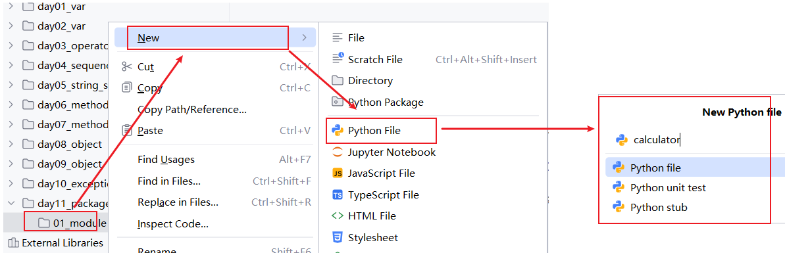

## 37.3.模块的导入

### 37.3.1.全局导入

```python
1.导入位置:所有类之外
2.格式:
  import 模块名 [as 别名]  -> as 别名可写可不写
3.如何调用模块中的成员:
  a.没有取别名: 模块名.成员名
  b.取了别名: 别名.成员名 -> 此时就不能用模块名调用了,只能用别名
需求:在同一个目录下创建一个main.py文件,在其中导入my_add.py模块中的添加函数并使用
my_add.py
==================================
def add(x,y):
    return x+y
main.py
==================================
# import my_add
import my_add as myadd
# print(my_add.add(1, 2))
print(myadd.add(1, 2))
```

### 37.3.2.局部导入

#### 37.3.2.1.情况1

```python
1.使用场景:如果我们不想将模块中所有的成员都导入进来,想导入指定的成员,就可以使用局部导入
2.格式:
  a.from 模块名 import 成员名1,成员名2...
  b.from 模块名 import 成员名1 as 别名1,成员名2 as 别名2...
3.使用:
  a.如果不取别名:直接通过成员名调用访问
  b.如果取了别名:直接写成员名即可
4.注意:
  如果多个模块中存在重名的成员,后一次导入的会覆盖前一次导入的
需求:在同一个目录下创建一个main.py文件,在其中导入my_calculator.py模块中的函数并使用
my_calculator.py
===================================
def add(x,y):
    return x+y

def sub(x,y):
    return x-y

def mul(x,y):
    return x*y

def div(x,y):
    return x/y
my_add.py
==================================
def add(x,y):
    return x+y
main.py
====================================
# from my_calculator import add,sub
# print(add(1,2))
# print(sub(1,2))

from my_calculator import add as a,sub as s
from my_add import add as a1
print(a(1,2))
print(s(1,2))
print(a1(1,20))
```

#### 37.3.2.2.情况2

```python
1.格式:from 模块名 import *
2.注意:
  导入模块中所有不以一个_开头的成员,直接通过成员名访问
my_calculator.py
===================================
def add(x,y):
    return x+y

def sub(x,y):
    return x-y

def _mul(x,y):
    return x*y

def div(x,y):
    return x/y
main.py
====================================
from my_calculator import *
print(add(1,2))
print(sub(1,2))
# print(_mul(1,2))
print(div(1,2))
```

### 37.3.3. _*all*_

```python
1.作用:
  使用from import *导入模块时，可以在被导入的模块中使用 __all__设置哪些内容可以被导入
2.注意:__all__ 的设置只针对使用 from import * 导入模块时有效
my_import.py
====================================
# 规定外界只能调用哪些成员
__all__ = ["add","str1"]
str1 = "hello"
def add(x,y):
    return x+y
def sub(x,y):
    return x-y
my_main.py
====================================
from my_import import *
print(add(1,2))
# print(sub(1,2))
print(str1)
```

### 37.3.4._*name*_

```python
1.问题描述:
  当我们在my_add.py中定义了add的函数,然后在[本模块中打印调用],那么在main.py模块中直接导入模块之后发现my_add中的所有代码就能直接执行
  但是我们不想导入这个模块之后执行这个[打印调用]代码,怎么办呢
2.问题解决: 
  a.python中有一个内置变量: __name__  -> 当直接执行这个Python文件时，该文件的__name__属性值为"__main__",在别的模块中导入__name__所在的模块之后执行,就不是__main__了,__name__代表的就是__name__所在的模块名了

  b.我们在被导入的模块中做一个判断: 这样,在导入别的模块的模块中直接执行,就不会执行我们if里面的代码了
    if __name__ == "__main__":
        要执行的代码
def add(x,y):
    return x+y

# print(__name__)#直接执行此模块,会打印__main__
if __name__ == "__main__":
 print(add(1,2))
# from my_add import add
# import my_add
from my_add import *
# 在这里直接运行__name__输出的是被导入模块的模块名
```

> ```python
> 使用场景:如果模块A会被其他模块导入使用,但是模块A中有一些"测试代码",不想让别的模块导入模块A的时候执行这些"测试代码",那么就可以将这些测试代码放到if __name__ == "__main__"的判断中
> ```

# 38.包

```python
1.概述:
  包是管理python模块的位置,但是这里的包不是我们自己创建的文件夹
2.包和普通的文件夹的一个小区别:
  包下面有一个__init__.py的python文件
3.作用:
  可以将实现相同业务的多个模块分类管理,代码结构清晰明了,好维护
假设要为统一处理声音文件与声音数据设计一个模块集（包）。声音文件的格式很多（通常以扩展名来识别，例如：.wav，.aiff,.au），因此，为了不同文件格式之间的转换，需要创建和维护一个不断增长的模块集合。为了实现对声音数据的不同处理（例如：混声、添加回声、均衡器功能、创造人工立体声效果），还要编写无穷无尽的模块流。下面这个分级文件树展示了这个包的架构：

sound/                          最高层级的包
      __init__.py               初始化 sound 包
      formats/                  用于文件格式转换的子包
              __init__.py
              wavread.py
              wavwrite.py
              aiffread.py
              aiffwrite.py
              auread.py
              auwrite.py
              ...
      effects/                  用于音效的子包
              __init__.py
              echo.py
              surround.py
              reverse.py
              ...
      filters/                  用于过滤器的子包
              __init__.py
              equalizer.py
              vocoder.py
              karaoke.py
              ...
```

## 38.1.创建包

```python
右键 -> new -> package -> 取包名
```

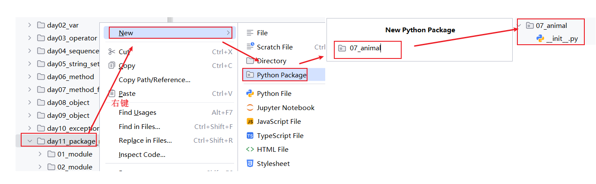

## 38.2.导入包

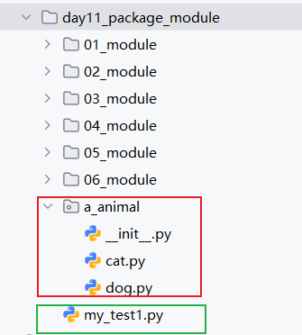

```python
dog.py
==================================
def eat(str):
    print(f"狗在啃{str}")
cat.py
==================================
def eat(str):
    print(f"猫在吃{str}")
```

### 38.2.1.全局导入_import

```python
1.语法:
  a.import 包名.模块名
  b.import 包名.模块名 as 别名
2.调用方式:
  a.没有取别名:包名.模块名.成员名
  b.取了别名:别名.成员名
3.注意:  
  不要具体到成员名
# import a_animal.dog
# import a_animal.cat
# a_animal.dog.eat("骨头")
import a_animal.dog as d
d.eat("骨头")
```

### 38.2.2.局部导入_from import

#### 38.2.2.1.局部导入包下的模块

```python
1.语法:
  a.from 包名 import 模块名
  b.from 包名 import 模块名 as 别名
2.调用:
  a.没有取别名: 模块名.成员名
  b.取别名:别名.成员名
# 局部导入  从包中导入模块
# from a_animal import dog
# dog.eat("骨头")
from a_animal import dog as d
d.eat("骨头")
```

#### 38.2.2.2.局部导入包下模块的成员

```python
1.语法:
  a.from 包名.模块名 import 成员名
  b.from 包名.模块名 import 成员名 as 别名
2.调用:
  a.没有取别名: 直接写成员名
  b.取别名: 直接写别名即可
# 局部导入  从包中导入模块中的成员
# from a_animal.dog import eat
# eat("骨头")
from a_animal.dog import eat as e
e("骨头")
```

> 快速将一段代码抽取到方法中:
>
> 1.选中这段代码
>
> 2.按:ctrl+alt+m

# 39.安装第三方库

## 39.1.标准库介绍

```python
1.标准库概念:安装python环境的时候就被安装的库,说白了就是python提前给咱们准备好的库,可以直接拿过来用
```

| 名称            | 说明                                                         |
| --------------- | ------------------------------------------------------------ |
| os              | 多种操作系统接口。                                           |
| sys             | 系统相关的形参和函数。                                       |
| time            | 时间的访问和转换。                                           |
| datetime        | 提供了用于操作日期和时间的类。                               |
| math            | 数学函数。                                                   |
| random          | 生成伪随机数。                                               |
| re              | 正则表达式匹配操作。                                         |
| json            | JSON 编码器和解码器。                                        |
| collections     | 实现了一些专门化的容器，提供了对 Python 的通用内建容器 dict、list、set 和 tuple 的补充。 |
| functools       | 高阶函数，以及可调用对象上的操作                             |
| hashlib         | 安全哈希与消息摘要。                                         |
| urllib          | URL 处理模块。                                               |
| smtplib         | SMTP 协议客户端，邮件处理。                                  |
| zlib            | 与 gzip 兼容的压缩。                                         |
| gzip            | 对 gzip 文件的支持。                                         |
| bz2             | 对 bzip2 压缩算法的支持。                                    |
| multiprocessing | 基于进程的并行。                                             |
| threading       | 基于线程的并行。                                             |
| copy            | 浅层及深层拷贝操作。                                         |
| socket          | 低层级的网络接口。                                           |
| shutil          | 提供了一系列对文件和文件集合的高阶操作，特别是提供了一些支持文件拷贝和删除的函数。 |
| glob            | Unix 风格的路径名模式扩展。                                  |

> 更多标准库可参考https://docs.python.org/zh-cn/3/library/index.html。

## 39.2.引入第三方库

```python
1.概述:python没有内置的库,就是第三方库
2.注意:第三方库需要下载,那么下载就需要一个包管理工具,就是pip
```

### 39.2.1.pip命令方式引入第三方库

```python
1.概述:pip是Python包管理工具，该工具提供了对 Python 包的查找、下载、安装、卸载的功能。pip 默认的源是 Python Package Index（PyPI），其地址为 https://pypi.org/simple/，如果下载比较慢，还可以指定其它的源: 
            
 a.阿里云：https://mirrors.aliyun.com/pypi/simple/
 b.豆瓣：https://pypi.douban.com/simple/
 c.清华大学：https://pypi.tuna.tsinghua.edu.cn/simple/
    
2.pip常用命令
 a.查看已经安装的软件包
  pip list
 b.安装软件包->具体包名是什么可以到PyPI上找  -> 要是安装中央仓库的源会比较慢
  pip install 包名
 c.卸载软件包
  pip uninstall 包名
 d.临时使用其他源
  pip install -i https://mirrors.aliyun.com/pypi/simple/ 包名
 e.永久修改源
  pip config set global.index-url https://mirrors.aliyun.com/pypi/simple/
```

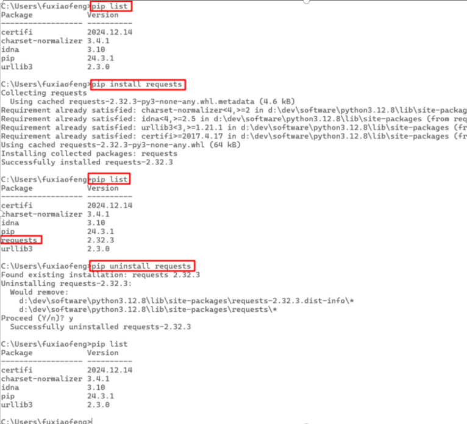

> 命令的方式会将第三方库自动放到:F:\python\python-3.12.8\Lib\site-packages下面

### 39.2.2.使用pycharm中引入第三方库

```python
1.注意:我们直接在dos命令窗口中使用pip安装的库属于python的基础环境,不属于当前项目的.venv虚拟环境
2.我们还可以在当前项目的虚拟环境下安装第三方库
  打开pycharm,在pycharm中的终端输入:pip list
  发现在全局环境中安装的库在当前项目的虚拟环境下没有,所以说明全局环境和当前项目的虚拟环境是两套环境
3.在全局环境下安装的库在python解释器安装路径下的Lib\site-packages\
```

#### 39.2.2.1.在pycharm终端安装和卸载库

```python
安装库
===========================================================================
(.venv) PS F:\python\pycharm2026.1\pyworkspace\mybase> pip install requests 
```

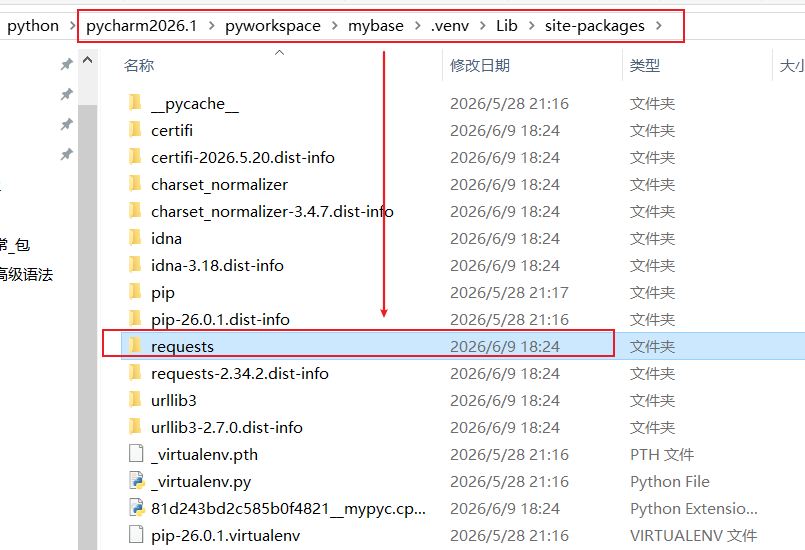

```python
卸载库:
===========================================================================
(.venv) PS F:\python\pycharm2026.1\pyworkspace\mybase> pip uninstall requests
```

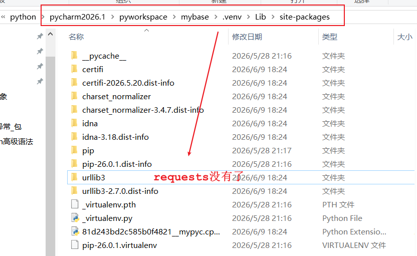

```python
1.问题说明:我们在dos命令窗口中能不能操作项目中的.venv虚拟环境呢?
          可以,只需要在dos命令窗口中激活项目的虚拟环境即可
2.激活当前虚拟环境命令位置,如下图
```

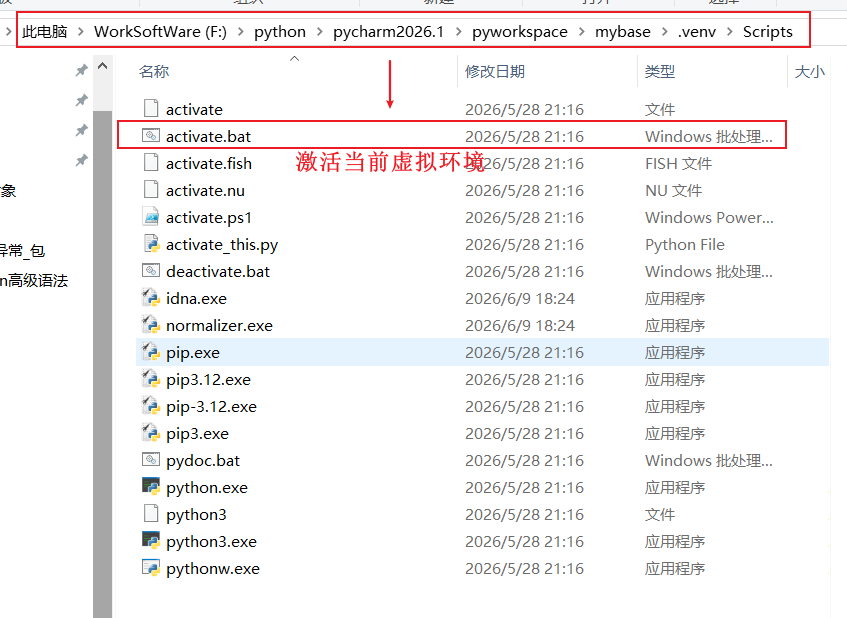

```python
进入对应的位置,输入 activate 命令进行激活:
F:\python\pycharm2026.1\pyworkspace\mybase\.venv\Scripts>activate
  
    
(.venv) F:\python\pycharm2026.1\pyworkspace\mybase\.venv\Scripts>    
```

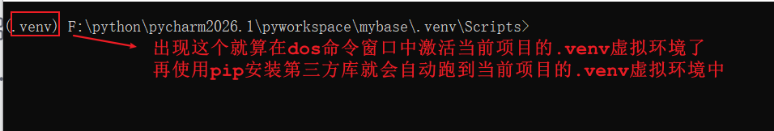

#### 39.2.2.2.在pycharm中通过点击的方式安装和卸载第三方库(了解)

```python
点击+号
```

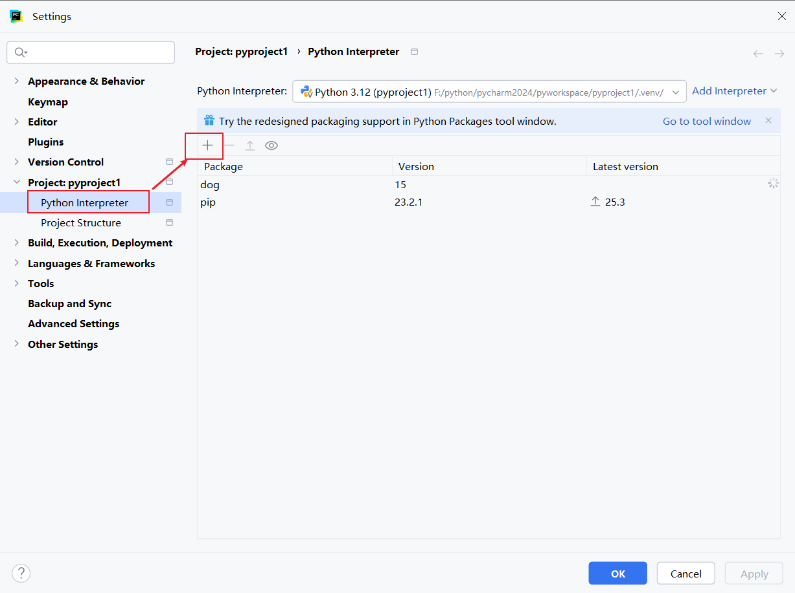

```python
3.搜索要添加的包
```

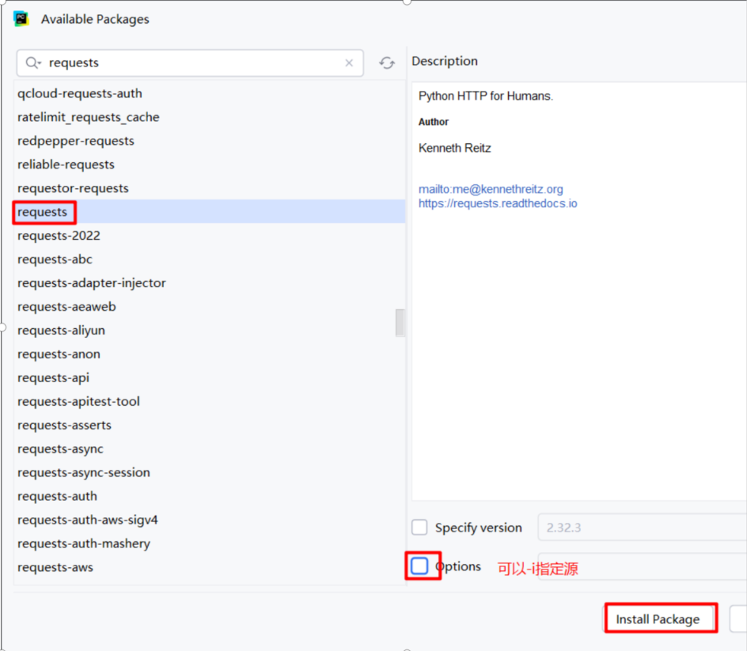

### 39.2.3.打包自己写的库并安装

```python
1.问题描述:
  假如我开发好了几个模块,但是你们需要我开发好的模块的功能,怎么办?我就需要将我开发好的模块打包成库给你们
  然后你们在本机上安装我打包好的包即可
2.先安装setuptools库
  ->如果不安装setuptools库，后续打包时可能会遇到报错 ModuleNotFoundError: No module named 'distutils'，所以可以提前安装 setuptools 库
    
  pip install setuptools  
```

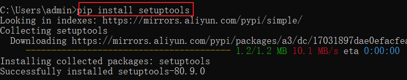

```python
2.在包外创建一个setup.py文件
```

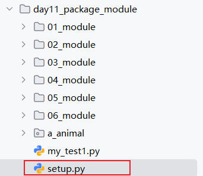

```python
3.在setup.py中添加以下代码
==========================================
from distutils.core import setup
setup(
    name="模块所在包名", # 需要打包的名字
    version="1.0", # 版本
    py_modules=["模块所在包名.circle", "模块所在包名.rectangle"], # 需要打包的模块
)
```

> 以上代码需要在pycharm中安装 setuptools 库才能使用,然后build构建

```python
4.在cmd中打包 -> 在setup.py同级目录下进行构建
  a.进入到setup.py文件所在的本地目录
  b.然后构建
    python setup.py build 
```

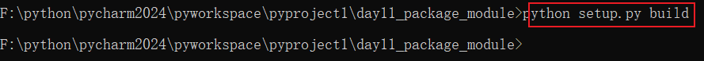 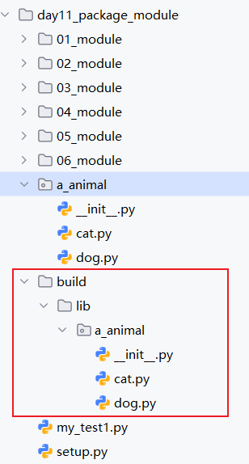

```python
5.还可以将其压缩,变成压缩包给别人:
  python setup.py sdist
```

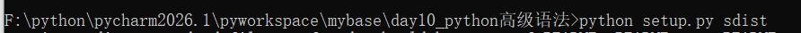 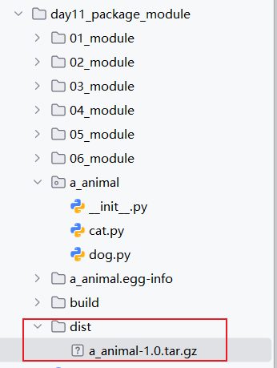

```python
6.给别人,让别人安装我们自己提供的库
  pip install F:\python\pycharm2024\pyworkspace\pyproject1\day11_package_module\dist\a_animal-1.0.tar.gz
```

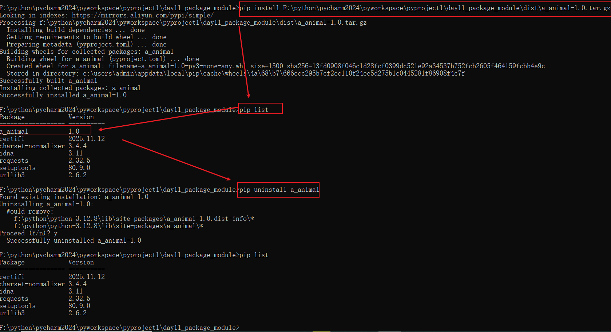

### 39.2.4.pycharm中安装自己打包的库

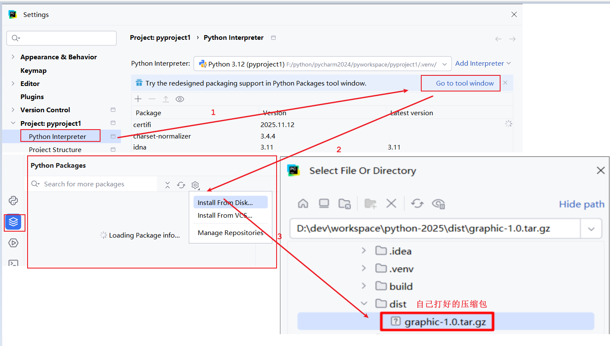

```python
测试:
   在pycharm中导包使用
=====================================   
   from 包名 import 模块名
   调成员
from a_animal import dog
dog.eat("骨头")
```

# 40.迭代器

```python
1.概述:其实就是一个对象  -> Iterator
      凡是可以使用for循环遍历的容器都是可迭代的对象,所以就都可以使用迭代器去遍历操作
      包括:list,tuple,dict,set,str,文件,generator
2.主要作用:
  遍历容器
3.使用:
  a.方法1:iter(容器名)  -> 创建一个迭代器对象
    底层会自动调用__iter__()魔法方法,获取当前对象的迭代器对象
  b.方法2:next()  -> 获取下一个元素
    底层会自动调用__next__()魔法方法,来获取下一个元素
list1 = ["张三","李四","王五","赵六"]
# iter1 = iter(list1)
# print(next(iter1))
# print(next(iter1))
# print(next(iter1))
# print(next(iter1))
# print(next(iter1))StopIteration
for i in list1:
    print(i)
print("========================")
list2 = [1,2,3,4,5]
iter2 = iter(list2)
for e in iter2:
    print(e)
```

> 使用迭代器去遍历容器的时候,起始位置是在第一个元素的前面,然后依次调用next()获取下一个元素,当获取完毕再获取就会出现异常

# 41.生成器

```python
1.问题说明:
  直接我们定义一个容器,往里面添加了元素,那么这些元素就会一股脑进入到内存中,如果数据量过大,就会占内存,所以我们就想按需生成数据,这样就省内存了
      
  可以用生成器:用的时候生成数据给咱们用,不用不生成
      
2.生成器概述:生成器(generator),是一种按需生成数据的特殊迭代器,用yield实现返回,不会一次性把所有结果都放到内存中
           生成器也是可以使用for循环遍历的
3.特点:
  a.生成器中的每一个元素不是直接全部创建出来,而是 用一个 创建一个出来
    然后用yield将这个数据返回
  b.调用生成器中的next()方法,获取yield返回的值,然后暂停,等到下一次调用next()方法才会继续往下执行获取下一个yield返回的结果
      
4.yield的特点:
  a.将生成器生成的数据返回
  b.暂停执行
  c.需要等到再次调用next方法,才会从暂停的位置继续执行
```

## 41.1.使用元组推导式获取生成器

```python
gen = (x for x in range(1,10))
# print(tuple1)
for element in gen:
    print(element)
```

## 41.2.通过自定义函数来获取一个生成器

```python
def get_gen():
    print("哈哈哈哈哈哈")
    for i in range(1,6):
        yield i

gen = get_gen()
print(next(gen))
print(next(gen))
print(next(gen))
print(next(gen))
print(next(gen))
gen = get_gen()
        ↓
   [生成器创建，未执行get_gen()方法]
next(gen) → i=1 → yield 1 → 暂停 → 输出 1
next(gen) → i=2 → yield 2 → 暂停 → 输出 2
next(gen) → i=3 → yield 3 → 暂停 → 输出 3
next(gen) → i=4 → yield 4 → 暂停 → 输出 4
next(gen) → i=5 → yield 5 → 暂停 → 输出 5
next(gen) → 循环结束 → StopIteration
```

## 41.3.获取生成器函数中的return的值

```python
1.问题描述:
  我们通过不断的调用next方法去获取生成器中的yield返回的值,当生成器中的数据获取完毕,再获取会出现异常StopIteration,那么下面的代码就不会执行了
  如果后面有return 结果,我们也就获取不到了
def get_gen():
    print("哈哈哈哈哈哈")
    for i in range(1,6):
        yield i

    return "生成器执行完毕了"

gen = get_gen()
print(next(gen))
print(next(gen))
print(next(gen))
print(next(gen))
print(next(gen))
print(next(gen))#StopIteration: 生成器执行完毕了
```

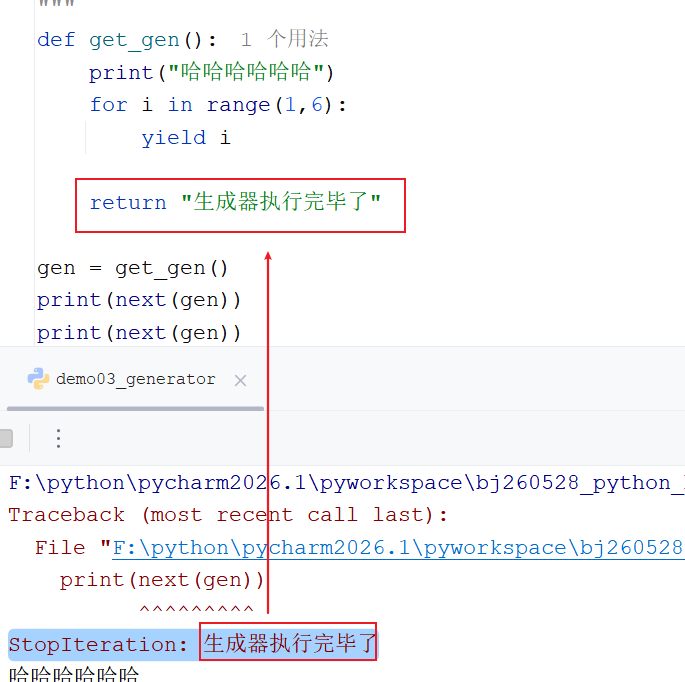

```python
获取return的值:
===================================================
def get_gen():
    print("哈哈哈哈哈哈")
    for i in range(1,6):
        yield i

    return "生成器执行完毕了"

gen = get_gen()

while True:
   try:
       print(next(gen))
   except StopIteration as e:
       # 拿到异常的描述
       print(e.value)
       break
```

## 41.4.send函数

```python
1.问题:
  刚开始我们都是用next方法去触发生成器,并从生成器中获取数据,那么还有一个方法也可以触发生成器,这个方法就是send方法

2.send和next方法的区别:
  a.相同点:两个都可以触发生成器
  b.不同点:
    next()只从生成器中获取数据
    send()是从生成器中获取数据的同时,往生成器中再传一个数据过去

3.send方法的作用:
  Python 生成器的 send() 用来在 yield 暂停处往生成器里“送一个值”，并同时取到下一个 yield 产出的值
def get_gen():
    print("生成器开始执行了")
    for i in range(1,6):
        msg = yield i
        print(f"接收到消息：{msg}")

    return "生成器执行完毕了"

gen = get_gen()
print("第1次获取的值:",next(gen))
print("第2次获取的值:",gen.send("第一次发送值"))
print("第3次获取的值:",gen.send("第二次发送值"))
print("第4次获取的值:",gen.send("第三次发送值"))
print("第5次获取的值:",gen.send("第四次发送值"))
print("===================================")
try:
    print("第6次获取的值:",gen.send("第五次发送值"))
except StopIteration as e:
    print(e.value)
```

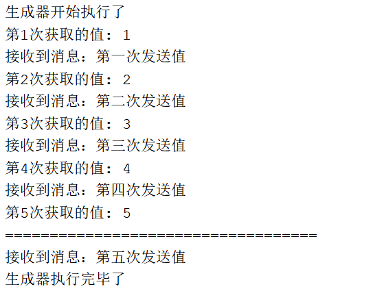

```python
执行流程:
=====================================================
gen = get_gen()
   ↓
next(gen)
   → 打印“生成器开始执行”
   → yield 1
   → 返回 1
gen.send("第一次发送")
   → msg = "第一次发送"
   → 打印“收到 send：第一次发送”
   → yield 2
   → 返回 2
gen.send("第二次发送")
   → msg = "第二次发送"
   → 打印“收到 send：第二次发送”
   → yield 3
   → 返回 3
...
最后 send 后循环结束
   → return "生成器执行完毕"
   → StopIteration.value 拿到 return 值
```

**使用send函数启动生成器**

```python
send(None)
def get_gen():
    print("生成器开始执行了")
    for i in range(1,6):
        msg = yield i
        print(f"接收到消息：{msg}")

    return "生成器执行完毕了"

gen = get_gen()
print("第1次获取的值:",gen.send(None))
print("第2次获取的值:",gen.send("第一次发送值"))
print("第3次获取的值:",gen.send("第二次发送值"))
print("第4次获取的值:",gen.send("第三次发送值"))
print("第5次获取的值:",gen.send("第四次发送值"))
print("===================================")
try:
    print("第6次获取的值:",gen.send("第五次发送值"))
except StopIteration as e:
    print(e.value)
```

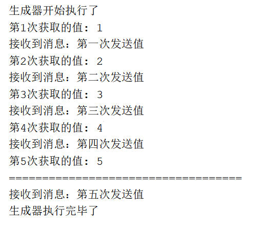

# 42.命名空间和作用域

## 42.1. 命名空间介绍

```python
1.概述:是一种用来管理变量名和对应对象映射关系的代名词
      命名空间（namespace） 就是 Python 存放名字和对象对应关系的地方。可以把它理解成：名字 → 对象的“字典”。
      说白了:命名空间 = 名字在哪里有效、名字指向哪个对象。
            a = 10 ->意思是：在当前命名空间里，名字 `a` 绑定到对象 `10`。
2.举例:
  比如每一个房间,有卧室,客厅,厨房等(命名空间)里面有自己的储物柜(变量名/函数名/类名),那么即使两个储物柜名字一样(比如都叫做a),也不会互相干扰(比如客厅的a放钥匙,卧室的a放手机)
3.作用:
  可以区分重名的成员,给重名的成员加上一个命名空间,可以避免名字冲突,明确名字的查找规则
```

## 42.2. 为什么需要命名空间

避免名字冲突：

```python
def func():
  x = 1
x = 100
全局里有一个 x
func() 里有一个 x
它们互不影响
就是因为它们处在不同命名空间。
```

## 42.3. Python 的命名空间类型

| 类型             | 说明              | 例子                   |
| ---------------- | ----------------- | ---------------------- |
| 内置命名空间     | Python 自带的名字 | `print`, `len`, `int`  |
| 全局命名空间     | 模块级变量        | 文件顶层定义的变量     |
| 局部命名空间     | 函数内部变量      | 函数里的临时变量       |
| 嵌套局部命名空间 | 外层函数变量      | 嵌套函数中的 enclosing |

```python
x = "全局x"

def outer():

   x = "外层x"

   def inner():
       
       x = "内层x"

       print(x)   # 内层x

   inner()

outer()

print(x)   # 全局x
说明：
inner() 里的 x → 局部命名空间
outer() 里的 x → 外层命名空间
文件顶层的 x → 全局命名空间
```

## 42.4. 内置命名空间

```python
print("hello")

len([1, 2, 3])

print、len 来自 built-in 命名空间，不用定义就能用。
```

## 42.5. 全局命名空间

```python
name = "张三"

age = 18

def show():

  print(name)
name、age 属于当前模块的全局命名空间。
```

## 42.6. 局部命名空间

```python
def func():

    a = 10

    b = 20

    print(a + b)

func()
# print(a)   # ❌ 报错，a 不在全局命名空间
a、b 只在 func() 的局部命名空间里有效
```

## 42.7.作用域

### 42.7.1.介绍

```python
1.概述:指的是一种区域中成员的作用范围
2.python中的作用域:
  在python中有四种作用域,分别用四个不同的关键字来表示不同的作用域:
      Local:最内层作用域,表示局部的成员
      Enclosing:非局部,非全局的作用域(中间的),嵌套作用域
      Global:倒数第二层作用域,包含当前模块的全局名称
      Built-in:最外层作用域,是内置名称的命名空间
3.LEGB查找规则:Python 找变量时，按这个顺序
  L → Local      局部
  E → Enclosing  嵌套外层
  G → Global     全局
  B → Built-in   内置

 找到就用，找不到就报 `NameError`。
    
4.作用域中最常用的两个关键字:
  global:代表全局作用域中的成员
  nonlocal:代表的是嵌套作用域中的成员    
```

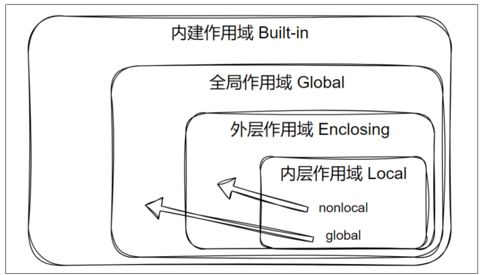

### 42.7.2.global和nonlocal的使用

```python
1.global:代表全局作用域中的成员
2.nonlocal:代表的是嵌套作用域中的成员  
count = 0
def add():
    global count
    count += 1
    print(count)
add()
def outer():
    x = 10 #这就是嵌套作用域中的 x
    def inner():
        nonlocal x
        x = 20
    inner()
    print(x)   # 20

outer()
```

# 43.闭包

## 43.1.闭包的介绍

```python
1.问题:
  当函数调用完毕之后,函数就会在内存中消失,函数中的变量也会被销毁;那么我们有的时候希望在函数执行完毕之后,那么函数中的数据还能继续使用,怎么办呢? -> 用到了闭包

2.概述:其实闭包就是让函数中的变量能重复使用的一种手段

3.构建闭包的条件:
  a.外部函数内定义一个内部函数
  b.内部函数访问外部函数的变量
  c.外部函数将内部函数作为返回值返回->让外层函数中的变量活下来的关键步骤

4.作用:延长外部函数中变量的生命周期
```

## 43.2.闭包的使用

```python
def outer():
    num = 10
    def inner():
        print(num)
    return inner

inner = outer()
inner()
inner()
inner()
```

## 43.3.闭包的说明

```python
def outer():
    num = 10
    def inner():
        nonlocal num
        num+=1
        print(num)
    return inner

inner = outer()
inner()#11
inner()#12  -> 记住了上一次的值,按常理来说调用第一次调用outer之后里面的num就消失了,应该重头开始记
inner()#13
1.说明:
  当我们调用完outer()之后,outer()里面的num就消失了,但是我们调用inner的时候还能操作num,这是为啥呢?
2.解释:在生成num的时候,其实内存会为num生成一个容器,然后将num放到这个容器中,这时我们再操作就是操作这个容器中的num了
3.验证:
  a.__closure__:可以查看是否是闭包函数,如果是,返回一个元组;如果是一个普通函数,返回就是none
```

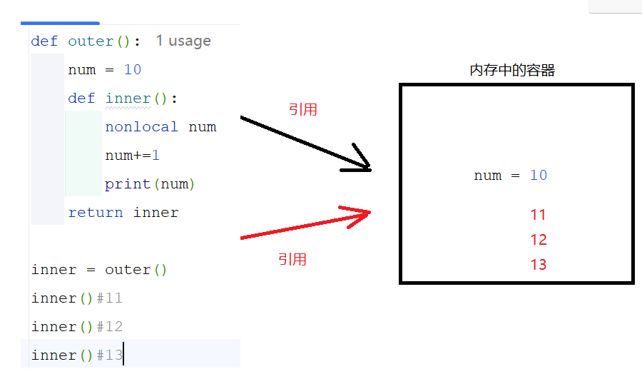

```python
def outer():
    num = 10
    # 获取num的地址值,将其变成十六进制 0x7ff9950aead8
    print(hex(id(num)))
    def inner():
        nonlocal num
        num+=1
        print(num)
    return inner

inner = outer()

# (<cell at 0x0000022C131A4DC0: int object at 0x00007FF9950AEAD8>,)元组
print(inner.__closure__)
```

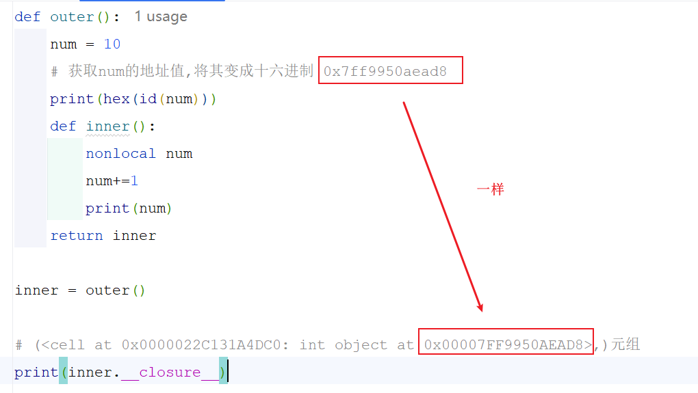

> 注意:
>
> 1.在闭包中使用的变量会放到元组中,如果没有被内层函数使用的变量,就不会在元组中
>
> 2.调用多次外层函数,会得到多个不同的闭包,多个闭包之间的数据互不影响
>
> ```python
> def outer():
>     num = 10
>     def inner():
>         nonlocal num
>         num+=1
>         print(num)
>     return inner
> 
> inner = outer()
> inner()#11
> inner()#12
> inner()#13
> print("=======================")
> inner2 = outer()
> inner2()#11
> inner2()#12
> inner2()#13
> ```

## 43.4.使用场景

```python
如果想定义一个固定的"定制版函数",就可以使用闭包函数
举例:
  调用方法,传递一个参数,让这个参数内容的前面和后面加指定的字符,比如: ***lining-lo***
def concat(char,n):
    def show_concat(str1):
        print(char*n+str1+char*n)

    return show_concat

concat1 = concat("*",3)
concat1("lining-lo")
concat1("Python")
```

> 缺点:
>
> 1. 对初学者理解起来不太友好,滥用闭包的话可读性会比较差
> 2. 如果闭包中引用了很大的对象,又长期不释放,会占用内存
> 3. 很多场景下,其实用[类+实例属性]会更清晰,不一定非得用闭包
>
> ```python
> class Concat:
>     def __init__(self,str1,n):
>         self.str1 = str1
>         self.n = n
> 
>     def show(self,msg):
>         print(self.str1*self.n+msg+self.str1*self.n)
> 
> 
> c1 = Concat("*",3)
> c1.show("lining-lo")
> ```

# 44.装饰器

## 44.1.装饰器的介绍和基本使用

```python
1.概述:装饰器可以简单理解为是一个函数,这个函数能接收另外一个函数作为参数,然后处理之后返回一个新的函数
2.作用:
  在不改变原函数代码的前提下,动态的增强或者修改这个函数的功能

3.语法:以下语法很明显就是一个闭包操作
  def decorator(function):
      def inner(参数):
          #写增强方法的代码
          return function(参数)
          #写增强方法的代码
      return inner      
import math


def math_sqrt(num):
    return math.sqrt(num)

# print(math_sqrt(4))
# print(math_sqrt(-4))#如果传递负数,会报错

print("==============================")

"""
  定义一个装饰器,对math_sqrt进行增强
  将传递过来的值,先取一个绝对值,变成整数
"""

def decorator(func):
    def inner(num):
        #对num进行预处理,先获取绝对值
        num = abs(int(num))
        #将处理过后的num传递到func代表的函数中,并接收这个函数的返回值
        return func(num)

    return inner

"""
 1.调用decorator,执行要装饰的方法,这个decorator方法返回的是inner方法
 2.调用inner(4)方法,传递要开平方的数据,然后走到return func(4)
 3.return后面的func方法其实代表的就是当初调用decorator方法是传递的math_sqrt方法
 4.那么就会先走math_sqrt算出结果,并通过inner中的return将结果返回给调用处
 5.直接输出
"""
inner = decorator(math_sqrt)
print(inner(4))
print(inner(-4))
```

## 44.2.装饰器增强方式和普通方法区别

### 44.2.1.复用性说明

```python
1.装饰器方式我们只需要调用一次decorator,它就为我们留下了inner方法,而且还记住了被装饰的方法,以后我们想要求平方根,直接调用inner方法,只需要给inner传递值即可,不需要每次都要传递被装饰的方法,复用性强

2.普通方式虽然也能实现增强,但是执行完毕之后什么都没有留下,下次调用我们必须要指定增强的方法是谁,操作的值是谁
复用性不强  
def math_sqrt(num):
    return math.sqrt(num)

# print(math_sqrt(4))
# print(math_sqrt(-4))#如果传递负数,会报错

print("==============================")

"""
  定义一个装饰器,对math_sqrt进行增强
  将传递过来的值,先取一个绝对值,变成整数
"""

def decorator(func):
    def inner(num):
        #对num进行预处理,先获取绝对值
        num = abs(int(num))
        #将处理过后的num传递到func代表的函数中,并接收这个函数的返回值
        return func(num)

    return inner


# 普通的方式增强
def decorator1(function,x):
    x = abs(x)
    return function(x)

"""
 1.调用decorator,执行要装饰的方法,这个decorator方法返回的是inner方法
 2.调用inner(4)方法,传递要开平方的数据,然后走到return func(4)
 3.return后面的func方法其实代表的就是当初调用decorator方法是传递的math_sqrt方法
 4.那么就会先走math_sqrt算出结果,并通过inner中的return将结果返回给调用处
 5.直接输出
"""
inner = decorator(math_sqrt)
print(inner(4))
print(inner(-4))

print("==============================")
print(decorator1(math_sqrt, 4))
print(decorator1(math_sqrt, -4))
```

### 44.2.2.记录状态说明

```python
1.如果想分别记录不同方法被调用了多少次,那么用装饰器方式可以清楚地记录
    
2.如果使用普通方法记录不同方法被调用了多少次,次数就会错乱    
def math_sqrt(num):
    return math.sqrt(num)

def math_sqrt1(num):
    return math.sqrt(num)

def decorator(func):
    count = 0
    def inner(num):
        nonlocal count
        count+=1
        print(f"这是{func.__name__}的第{count}次调用")
        #对num进行预处理,先获取绝对值
        num = abs(int(num))
        #将处理过后的num传递到func代表的函数中,并接收这个函数的返回值
        return func(num)

    return inner

inner = decorator(math_sqrt)
inner1 = decorator(math_sqrt1)
print(inner(4))
print(inner1(-4))
print(inner(4))
print(inner1(-4))
```

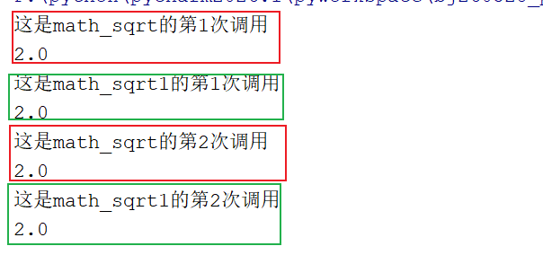

```python
def math_sqrt(num):
    return math.sqrt(num)

def math_sqrt1(num):
    return math.sqrt(num)

count = 0#全局变量
# 普通的方式增强
def decorator1(function,x):
    global  count
    count+=1
    print(f"这是{function.__name__}的第{count}次调用")
    x = abs(x)
    return function(x)

print(decorator1(math_sqrt, 4))
print(decorator1(math_sqrt1, -4))
print("=========================")
print(decorator1(math_sqrt, 4))
print(decorator1(math_sqrt1, -4))
```

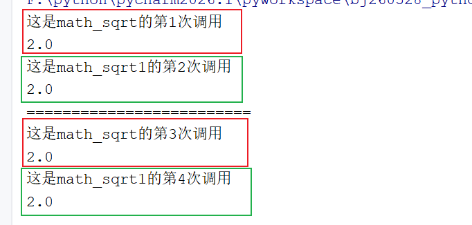

## 44.3.装饰器的语法糖

```python
1.注解:
  @装饰器方法名
2.编写位置:
  被装饰的方法上
3.作用:
  简化调用
import math

def decorator(func):
    def inner(num):
        #对num进行预处理,先获取绝对值
        num = abs(int(num))
        #将处理过后的num传递到func代表的函数中,并接收这个函数的返回值
        return func(num)

    return inner

@decorator
def math_sqrt(num):
    return math.sqrt(num)

print(math_sqrt(4))
print(math_sqrt(-4))
```

> 第1步：定义 math_sqrt 函数
>
> 第2步：自动执行 decorator(math_sqrt)
>
> 第3步：decorator 返回 inner
>
> 第4步：math_sqrt = inner

## 44.4.多层装饰器(多个装饰器)

```python
1.概述:说白了就是写多个装饰器共同作用一个函数
2.调用方式:
  想让哪个装饰器函数先执行,就先调用哪个装饰器函数
def decorator_int(func):
    def inner(num):
        #对num进行预处理,先获取绝对值
        num = int(num)
        #将处理过后的num传递到func代表的函数中,并接收这个函数的返回值
        return func(num)

    return inner


def decorator_abs(func):
    def inner(num):
        #对num进行预处理,先获取绝对值
        num = abs(num)
        #将处理过后的num传递到func代表的函数中,并接收这个函数的返回值
        return func(num)

    return inner

@decorator_int
@decorator_abs
def math_sqrt(num):
    return math.sqrt(num)

print(math_sqrt("-4"))
```

## 44.5.带参数的装饰器

```
1.需求:定义一个函数,实现两次开平方根
```

### 44.5.1.解决方式1:直接给装饰器内嵌函数加一个形参

```python
import math

def decorator(func):
    def inner(num,n):
        #对num进行预处理,先获取绝对值
        num = abs(int(num))
        for i in range(n):
            num = func(num)
        #将处理过后的num传递到func代表的函数中,并接收这个函数的返回值
        return num

    return inner

@decorator
def math_sqrt(num):
    return math.sqrt(num)
print(math_sqrt(16,2))
1.我们使用装饰器的目的就是单纯的想在装饰阶段就决定规则,但是现在这个规则被我们放到了每次调用里面,每次调用还要再指定开几次平方根这种规则,这样写就不太像装饰器了
    
2.怎么办呢?
  看了一使用@time语法糖
```

### 44.5.2.解决方式2:利用语法糖的方式再套一层函数当做次数

```python
def times(n):
    def decorator_abs(func):
        def inner(num):
            # 对num进行预处理,先获取绝对值
            num = abs(int(num))
            for i in range(n):
                num = func(num)
            # 将处理过后的num传递到func代表的函数中,并接收这个函数的返回值
            return num

        return inner

    return decorator_abs


"""
 time方法最终返回的是一个装饰器
"""
@times(2)
def math_sqrt(num):
    return math.sqrt(num)


print(math_sqrt(16))
print(math_sqrt(256))
@times(2)
def math_sqrt(...)
        ↓
times(2) 返回 decorator_abs
        ↓
decorator_abs(math_sqrt) 返回 inner
        ↓
math_sqrt = inner
print(math_sqrt(256))
        ↓
inner(256)
        ↓
abs(256) = 256
        ↓
func(256) = 16
        ↓
func(16) = 4
        ↓
返回 4
```

## 44.6.类装饰器

```python
1.概述:包含了__call__这个魔法方法的类,叫做类装饰器
2.调用时机:对象后面加括号 () 调用时，就会执行 __call__()
class DecoratorClass:
    def __init__(self):
        print("__init__方法执行了")

    def __call__(self):
        print("__call__方法执行了")

#创建对象之后会自动调用__init__方法
dc = DecoratorClass()

#对象名后面加()会自动调用__call__方法
dc()
```

### 44.6.1.普通类装饰器实现

```python
class DecoratorClass:
    def __init__(self,func):
        self.func = func

    def __call__(self,x):
        x = abs(x)
        return self.func(x)

def math_sqrt(num):
    return math.sqrt(num)


dc = DecoratorClass(math_sqrt)
print(dc(4))
```

### 44.6.2.配合语法糖实现类装饰器

```python
import math


class DecoratorClass:
    def __init__(self,func):
        self.func = func

    def __call__(self,x):
        x = abs(x)
        return self.func(x)

@DecoratorClass
def math_sqrt(num):
    return math.sqrt(num)

print(math_sqrt(4))
```

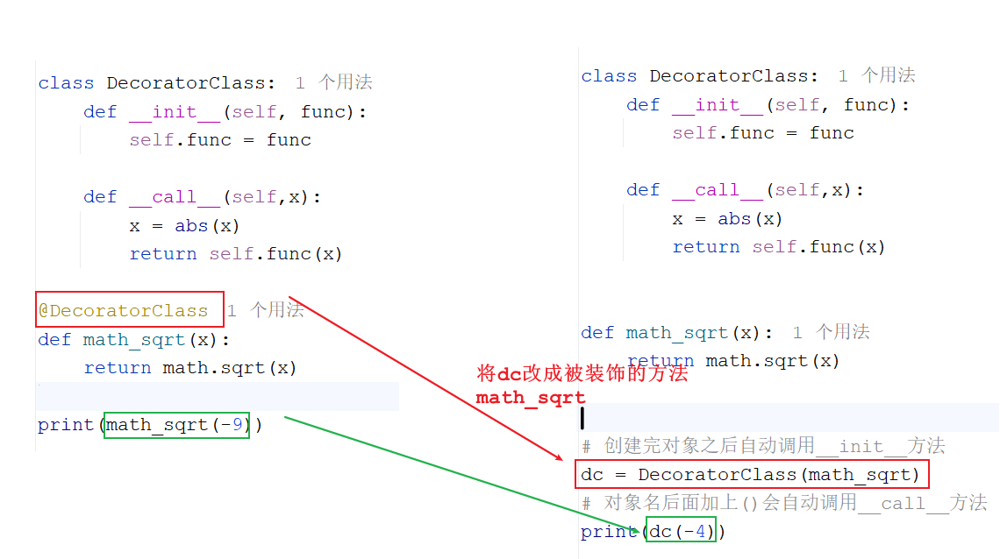

# 45.多线程和多进程基本知识

## 45..并发和并行

```python
1.概述:并发和并行指的是多个任务的执行方式
并行:在同一个时刻,有多个指令在多个CPU上(同时)执行(好比是多个人做不同的事儿)
    比如:多个厨师在炒多个菜
```

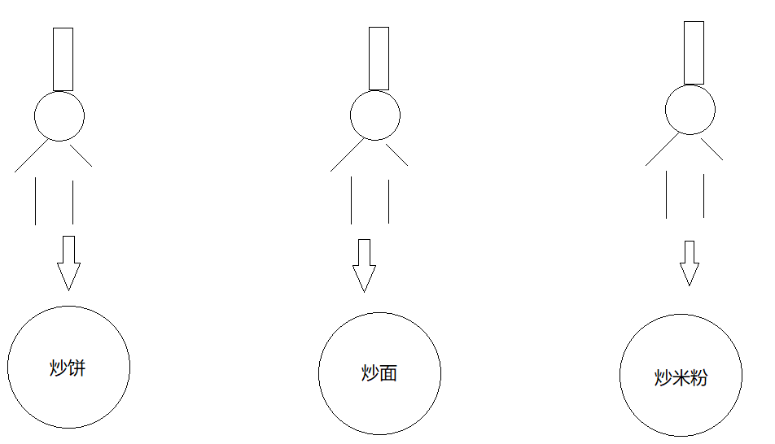

```python
并发:在同一个时刻,有多个指令在单个CPU上(交替)执行
    比如:一个厨师在炒多个菜
```

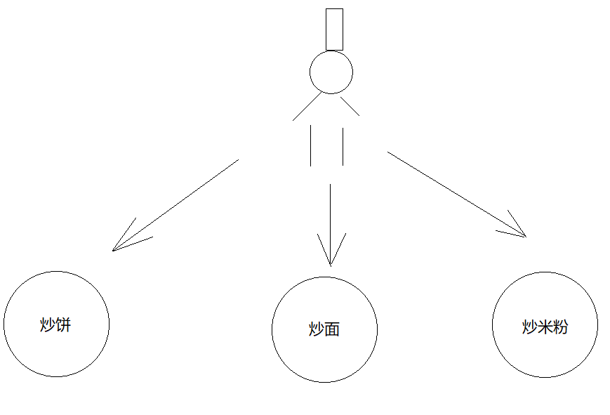

```python
细节:
  1.之前CPU是单核,但是在执行多个程序的时候好像是在同时执行,原因是CPU在多个线程之间做高速切换
  2.现在咱们的CPU都是多核多线程的了,比如2核4线程,那么CPU可以同时运行4个线程,此时不用切换,但是如果多了,CPU就要切换了,所以现在CPU在执行程序的时候并发和并行都存在
```

## 45..同步和异步

```python
多个任务之间的依赖关系
1.同步:多个任务中,一个任务执行,其他任务不能执行,需要排队
2.异步:多个任务可以同时执行,多个任务之间不互相影响
```

# 46.多进程

```python
1.进程的概述:进入到内存中执行的应用程序,一个程序运行起来就会有一个主进程
```

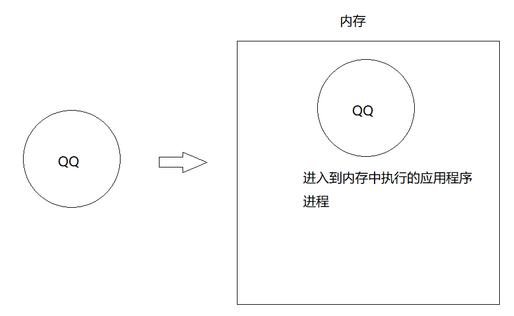

## 46.1.创建进程的方式1_multiprocessing.Process

> 不同的操作系统创建进程的方式是不一样的
>
> Unix/Linux操作系统提供了一个 **os.fork()** 系统调用，它非常特殊。普通的函数调用，调用一次，返回一次，但是 **fork()** 调用一次，返回两次，因为操作系统自动把当前进程（父进程）复制了一份（子进程），然后，分别在父进程和子进程内返回
>
> Windows 中没有 **fork()** 调用，不过Python提供了一个跨平台的多进程模块 **multiprocessing**。**multiprocessing** 模块提供了一个 **Process** 类来代表一个进程对象。

```python
1.导入进程工具包
  import mutiprocessing
2.通过进程类创建进程对象
  进程对象 = mutiprocessing.Process(参数1,参数2...)
3.启动进程执行任务
  进程对象.start() -> 调用start底层会调用run方法(写的是执行的进程任务),然后再调用target调用的函数
进程对象 = multiprocessing.Process(group=None, target=None, name=None, args=(), kwargs={}, *, daemon=None)

1.group=None:指明当前进程属于哪个组,可以通过分组来管理多个进程,一般不用传递 
2.target=函数名:指的是调用的是哪个函数
  启动进程调用start方法,start方法底层会自动调用run方法,在run方法中会调用target配置的函数
    
3.name=进程名字:给当前进程取的名字
4.arges=(参数1,参数2...):以元组的形式给target调用的函数传递参数,用元组形式给target调用的函数传递参数,参数顺序必须一致
5.kwargs={}:以字典的形式给target调用的函数传递参数,用字典形式给target调用的函数传递参数,参数顺序可以不一致
import multiprocessing


def coding():
    for i in range(10):
        print(f"敲代码{i}...")

def music():
    for i in range(10):
        print(f"听音乐{i}......")


if __name__ == '__main__':

    #创建进程对象
    p1 = multiprocessing.Process(target=coding)
    p2 = multiprocessing.Process(target=music)

    #开启进程
    p1.start()
    p2.start()
```

> ```python
> 1.问题:如果不加if __name__ == '__main__'会报错
> 2.原因:
>   如果不加if __name__ == '__main__'判断,那么当执行p1.start方法的时候会创建子进程,子进程会重新导入当前的python文件或者叫做python模块,一导入,默认会执行当前模块中的所有代码(在导入模块的时候讲过),然后就又执行到p1.start(),然后再创建子进程,子进程再重新导入当前python文件或者python模块,然后再执行当前模块中所有的代码,再执行p1.start,这样就会造成无限创建子进程的情况
>       
>   所以加上if __name__ == '__main__'判断,加上之后当第一次执行p1.start或者p2.start的时候,创建子进程,重新导入当前模块,之后就不会再执行if __name__ == '__main__'里面的代码了,因为子进程的名字不叫__main__
> ```

**Process参数解释**

```python
1.group=None:指明当前进程属于哪个组,可以通过分组来管理多个进程 
2.target=函数名:指的是调用的是哪个函数
3.name=进程名字:给当前进程取的名字
4.arges=(参数1,参数2...):以元组的形式给target调用的函数传递参数,用元组形式给target调用的函数传递参数,参数顺序必须一致
5.kwargs={}:以字典的形式给target调用的函数传递参数,用字典形式给target调用的函数传递参数,参数顺序可以不一致
def coding(name,count):
    for i in range(count):
        print(f"{name}正在敲代码{i}...")

def music(name,count):
    for i in range(count):
        print(f"{name}正在听音乐{i}......")


if __name__ == '__main__':

    #创建进程对象
    p1 = multiprocessing.Process(target=coding,args=("金莲",10))
    p2 = multiprocessing.Process(target=music,kwargs={"name":"涛哥","count":10})

    #开启进程
    p1.start()
    p2.start()
```

## 46.2.创建进程的方式2_继承Process

```python
继承Process,重写run函数,设置线程任务
import time
from multiprocessing import Process


class Coding(Process):
    def run(self):
        for i in range(10):
            print(f"{self.name}正在敲代码{i}...")
            #让进程睡眠,参数传递秒
            # time.sleep(1)


class Sleep(Process):
    def run(self):
        for i in range(10):
            print(f"{self.name}正在睡大觉{i}......")
            # time.sleep(1)


if __name__ == '__main__':
    p1 = Coding(name="金莲")
    p2 = Sleep(name="涛哥")
    p1.start()
    p2.start()
```

## 46.3.创建进程的方式3_进程池

```python
1.概述:进程池（Process Pool） 就是：提前创建好几个子进程，任务来了直接分配给空闲进程执行，用完再把进程留着复用，而不是每来一个任务就 创建一次进程对象
2.为什么需要进程池:
  之前的写法会频繁创建进程,任务执行完毕就会频繁销毁进程,开销大,管理起来也很麻烦,如果用进程池,提前创建指定数量的进程对象,然后来了任务自动分配
      
3.使用到的对象和方法
  a.multiprocessing.Pool(进程对象数量) -> 创建进程池对象,指定进程对象数量
      
  b.apply(要执行的方法名)  同步执行
    apply_async(要执行的方法名)  异步执行        
import multiprocessing
import time


def coding():
    for i in range(10):
        print(f"敲代码{i}...")

def music():
    for i in range(10):
        print(f"听音乐{i}......")


if __name__ == '__main__':
    # 创建进程池对象,指定有多少个进程对象
    pool = multiprocessing.Pool(5)
    # pool.apply(coding)
    # pool.apply(music)

    """
      1.如果调用apply_async方法证明是异步调用
        异步操作的特点就是多个进程谁也不等谁,同时执行
        当两个进程任务放到进程池中找进程对象执行的过程中
        主进程会快速执行到代码最后,当主进程执行完毕,程序结束了
        那么那两个进程任务没来得及执行,所有控制台没有输出内容
    """
    pool.apply_async(coding)
    pool.apply_async(music)

    """
      1.join的含义:让主进程等待,等待其他进程执行完毕之后,主进程再结束
      2.但是直接使用join会有问题:ValueError: Pool is still running
      3.问题的原因:
        join有等待的效果,等待所有代码执行完毕主进程再结束 
        但是进程池有一个特点,如果不close,进程池会一直等待新的进程任务
        
        所以就造成了一个局面:
          进程池再等待新的进程任务
          join再等待所有进程都执行完毕
          此时双方等死了,所以报错
          
      4.解决方案:
        在join前关闭进程池,不然进程池等待新的进程任务了    
    """

    pool.close()

    pool.join()

    # time.sleep(5)
```

## 46.4.获取进程编号_扩展

```python
1.概述:进程编号是进程的唯一标识,当进程关闭的时候,进程编号也会被同时释放
2.作用:
  a.根据锁定的唯一进程,方便我们管理和维护进程
  b.可以梳理子父进程的关系
3.方法:    
  a.os.getpid() 获取当前进程编号
  b.os.getppid() 获取父进程编号
def coding():
    for i in range(10):
        print(f"敲代码{i}...")
        #获取当前进程的编号
        print(f"进程编号:{os.getpid()}...")
        #获取父进程的编号
        print(f"父进程编号:{os.getppid()}......")

def music():
    for i in range(10):
        print(f"听音乐{i}......")
        print(f"进程编号:{os.getpid()}...")
        #获取父进程的编号
        print(f"父进程编号:{os.getppid()}......")


if __name__ == '__main__':
    # 创建进程池对象,指定有多少个进程对象
    pool = multiprocessing.Pool(5)
    # pool.apply(coding)
    # pool.apply(music)

    """
      1.如果调用apply_async方法证明是异步调用
        异步操作的特点就是多个进程谁也不等谁,同时执行
        当两个进程任务放到进程池中找进程对象执行的过程中
        主进程会快速执行到代码最后,当主进程执行完毕,程序结束了
        那么那两个进程任务没来得及执行,所有控制台没有输出内容
    """
    pool.apply_async(coding)
    pool.apply_async(music)

    """
      1.join的含义:让主进程等待,等待其他进程执行完毕之后,主进程再结束
      2.但是直接使用join会有问题:ValueError: Pool is still running
      3.问题的原因:
        join有等待的效果,等待所有代码执行完毕主进程再结束 
        但是进程池有一个特点,如果不close,进程池会一直等待新的进程任务
        
        所以就造成了一个局面:
          进程池再等待新的进程任务
          join再等待所有进程都执行完毕
          此时双方等死了,所以报错
          
      4.解决方案:
        在join前关闭进程池,不然进程池等待新的进程任务了    
    """

    pool.close()

    print(f"主进程的编号为:{os.getpid()}..........")

    pool.join()

    # time.sleep(5)
```

## 46.5.多进程注意事项

```python
1.多进程之间不共享全局变量,数据互相隔离
2.原因:
  每个进程执行都会重新导入当前模块,所以每个进程都会有自己的一个独立内存
定义一个列表,一个进程添加数据,另外一个进程查看数据,看看是否能查到添加的数据
# 定义一个进程来添加元素
def add_list(list1):
    for i in range(5):
        list1.append(i)

    print(list1)


# 定义一个进程来直接查看列表
def show_list(list1):
    # 为了防止还没有添加元素就开始执行查看元素进程，所以让查看元素进程睡2秒
    time.sleep(2)
    print(list1)

# 定义main函数启动进程
if __name__ == '__main__':
    # 定义一个列表
    list1 = []
    p1 = Process(target = add_list,args = (list1,))
    p2 = Process(target = show_list,args = (list1,))
    p1.start()
    p2.start()
```

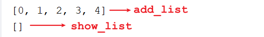

## 46.6.多进程之间实现数据共享

```python
1.问题描述:
  上面咱们说过,进程之间的数据是隔离的,那么将来我们有的需求需要让一个数据在多个进程之间共享操作,怎么办呢?
2.解决:使用Queue队列  

3.Queue队列的使用:
  a.获取Queue队列:multiprocessing.Manager().Queue()
  b.存取数据函数:
    put(数据):往队列中保存数据
    get():从队列中获取数据 
4.注意:
  a.队列对象一旦调用了get方法,那么对象中的数据也就没有了,第二次get是拿不到数据的
  b.使用队列的时候主进程不能提前结束,所以可以用join()函数,join函数只阻塞主进程
import multiprocessing
import time


# 定义一个方法添加元素
def add_list(queue):
    list1 = queue.get()
    for i in range(5):
        list1.append(i)
        
    queue.put(list1)

    print(list1)


# 定义一个方法去看列表中的元素
def show_list(queue):
    time.sleep(3)
    list1 = queue.get()
    print(list1,".......")


if __name__ == '__main__':
   list1 = []
   manager = multiprocessing.Manager()
   queue = manager.Queue()
   #将list列表 放到 队列中
   queue.put(list1)

   #创建两个进程对象
   p1 = multiprocessing.Process(target=add_list,args=(queue,))
   p2 = multiprocessing.Process(target=show_list,args=(queue,))
   p1.start()
   p2.start()

   # 主进程在这里等待 p1 执行完
   p1.join()
   # 主进程在这里等待 p2 执行完
   p2.join()
```

# 47.多线程

```python
1.线程:进程中的一个执行单元
2.线程作用:负责当前进程中程序的运行.一个进程中至少有一个线程(这个我们通常叫做主线程),一个进程还可以有多个线程,这样的应用程序就称之为多线程程序   
3.简单理解:
  进程中的一个功能就需要一条线程去执行
```

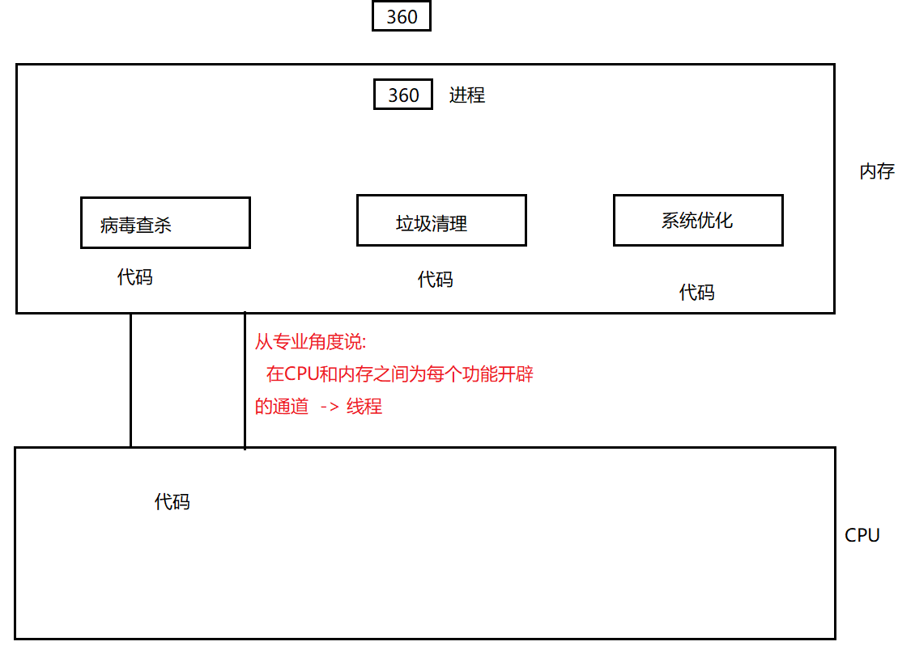

## 47.1.创建多线程方式1_直接利用threading对象

```python
1.导入模块:
  import threading
2.通过线程类创建线程对象:
  线程对象 = threading.Thread(target=要执行的方法名,name=线程名,args=(为方法赋值))
  
  注意:除了target参数之外,其他的参数写不写视情况而定
3.启动线程对象:
  线程对象.start()
def music(name):
    for i in range(10):
        print(f"{name}正在听第{i}首歌......")
        time.sleep(0.1)


def movie(name):
    for i in range(10):
        print(f"{name}正在看第{i}部电影......")
        time.sleep(0.1)


if __name__ == '__main__':
    t1 = threading.Thread(target=music, args=("广坤",))
    t2 = threading.Thread(target=movie, args=("赵四",))
    # 启动线程
    t1.start()
    t2.start()
```

## 47.2.创建多线程方式2_通过继承Thread创建多线程

```python
1.定义一个子类,继承threading.Thread
2.重写run函数,设置线程任务
3.调用start开启线程,自动执行run函数
class Music(threading.Thread):
    """
    继承 Python 内置 / 标准库类（如threading.Thread）时，
    必须调用父类__init__，否则功能失效；
    """
    def __init__(self, name):
        super().__init__()
        self.name = name

    def run(self):
        for i in range(10):
            print(f"{self.name}正在听第{i}首歌......")
            time.sleep(0.1)


class Movie(threading.Thread):
    """
    继承 Python 内置 / 标准库类（如threading.Thread）时，
    必须调用父类__init__，否则功能失效；
    """
    def __init__(self, name):
        super().__init__()
        self.name = name

    def run(self):
        for i in range(10):
            print(f"{self.name}正在看第{i}部电影......")
            time.sleep(0.1)


if __name__ == '__main__':
    t1 = Music("广坤")
    t2 = Movie("赵四")
    # 启动线程
    t1.start()
    t2.start()
```

## 47.3.创建多线程方式3_通过线程池创建线程

```python
1.获取线程池对象:
  concurrent.futures.ThreadPoolExecutor(max_workers=None, thread_name_prefix="", initializer=None, initargs=())

  a.max_workers:指定线程池最多能同时运行的线程数量（工作线程数上限） -> 最重要
  b.thread_name_prefix:辅助参数->线程池创建的线程会自动生成名称，比如默认是 ThreadPoolExecutor-0_0、                                    ThreadPoolExecutor-0_1 等；
                       如果设置了 thread_name_prefix="music-"，线程名称会变成 music-0、music-1 等，在多线程调试                        时能快速识别线程归属
  c.initializer=None:高级参数->指定一个初始化函数，线程池中的每个工作线程启动时都会执行这个函数
                     None 表示不执行任何初始化操作；
                     如果将None换成需要初始化的函数名,就代表每次工作线程启动都会先执行这个函数
                     适合需要给每个线程初始化资源的场景（比如每个线程初始化一个数据库连接、加载一个配置文件等）。
  d.initargs=():配合 initializer 使用,给 initializer 指定的初始化函数传递参数，是一个元组类型,要按照参数顺序传递

2.提交线程任务:
  submit(函数名,[元组或者字典])
  a.参数:
    函数名:将哪个函数设置的线程任务给线程池
    元组或者字典:给提交函数的参数赋值
  c.返回值:返回的是Future对象,可以调用其中的result()函数获取被提交执行函数的返回值
import concurrent.futures

def music(name):
    return f"{name}正在听歌"

def movie(name):
    return f"{name}正在看电影"

if __name__ == '__main__':
    pool = concurrent.futures.ThreadPoolExecutor(3)
    future1 = pool.submit(music, "张三")
    future2 = pool.submit(movie, "赵四")
    print(future1.result())
    print(future2.result())

    #关闭线程池
    pool.shutdown()
    
    # with concurrent.futures.ThreadPoolExecutor(3) as pool:
    #     future1 = pool.submit(music, "张三")
    #     future2 = pool.submit(movie, "赵四")
    #     print(future1.result())
    #     print(future2.result())
```

## 47.4.守护线程_扩展

```python
需求:定义一个线程,循环100次输出 f"线程1执行了第{i}次...",然后在主线程中开启线程,但是要让主线程执行完毕之后,自己定义的线程也结束

解决方案:将自定义线程变成守护线程(当被守护的先线程死掉,守护线程也会死掉)
        线程对象.daemon = True
def music(name):
    for i in range(100):
        print(f"{name}正在听第{i}首歌......")
        time.sleep(0.1)


if __name__ == '__main__':
    t1 = threading.Thread(target=music, args=("金莲",))

    #将t1设置为守护线程
    t1.daemon = True
    t1.start()

    #主线程循环10次
    for i in range(10):
        print(f"主线程正在听第{i}首歌......")
        time.sleep(0.1)
```

## 47.5.线程之间共享全局变量

```python
线程之间是可以共享全局变量的
import threading
import time

list = []

def add_list():
    for i in range(5):
        list.append(i)
    print(list)

def show_list():
    time.sleep(3)
    print(list,"==========")

if __name__ == '__main__':
    t1 = threading.Thread(target=add_list)
    t2 = threading.Thread(target=show_list)
    t1.start()
    t2.start()
```

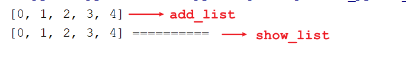

## 47.6.线程不安全问题

```python
问题的原因:多个线程共同访问同一个资源
需求:有100张票,定义三个线程分别买票,每买一张就减一张
import threading
import time

num = 100
def ticket():
    global num
    while True:
        time.sleep(0.1)
        if num>0:

            """
              threading.current_thread().name
              获取当前正在执行的线程名称
              哪个线程正在执行,就获取哪个线程的名称
            """
            print(f"{threading.current_thread().name}正在出售第{num}张票")
            num -= 1

if __name__ == '__main__':
    t1 = threading.Thread(target=ticket, name="广坤")
    t2 = threading.Thread(target=ticket, name="赵四")
    t3 = threading.Thread(target=ticket, name="刘能")
    t1.start()
    t2.start()
    t3.start()
```

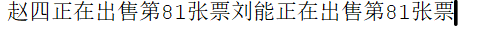

## 47.7.解决线程不安全问题

```python
1.造成上述问题的原因:
  CPU在多个线程之间做高速切换
2.解决:上锁
3.互斥锁:对共享数据锁定,一个线程去执行,其他线程需要等待
3.互斥锁使用:
  a.获取锁对象:
    变量名 = threading.Lock()
  b.上锁:
    变量名.acquire()
  c.释放锁:
    变量名.release()  
num = 100
#获取锁对象
lock = threading.Lock()
def ticket():
    global num
    while True:
        time.sleep(0.1)
        #上锁
        lock.acquire()
        if num>0:
            print(f"{threading.current_thread().name}正在出售第{num}张票")
            num -= 1
        #释放锁
        lock.release()

if __name__ == '__main__':
    t1 = threading.Thread(target=ticket, name="广坤")
    t2 = threading.Thread(target=ticket, name="赵四")
    t3 = threading.Thread(target=ticket, name="刘能")
    t1.start()
    t2.start()
    t3.start()
```

# 48.线程和进程的区别

```python
直接问AI即可
```

# 49.正则表达式

## 49.1.正则表达式的概念及演示

```python
1.概述:是一个具有特殊规则的字符串
2.作用:校验,查找,替换,提取
3.用到的函数:re模块中的函数
  re.match(正则,指定字符串) -> 判断指定的字符串是否符合正则表达式,如果匹配不上返回None
4.举例说明:
  验证一个qq号:  
    要求 不能以0开头 必须都是数字  必须是5-15位  
        [1-9][0-9]{4,14}
        
5.注意:
  match方法是匹配指定的字符串是否以指定的规定字符开头,所以需要在正则表达式前面加上^,最后加上$
  ^代表以什么什么开头
  $代表以什么什么结尾
import re
data = input("请您输入一个QQ号:")
result01 = re.match("^[1-9][0-9]{4,14}$", data)
if result01!= None:
    print("您输入的QQ号格式正确")
else:
    print("您输入的QQ号格式不对")
```

## 49.2.正则表达式-字符类

```python
正则表达式-字符类:[]表示一个区间,范围可以自己定义
        语法示例：
        1. [abc]：代表a或者b，或者c字符中的一个。
        2. [^abc]：代表除a,b,c以外的任何字符。
        3. [a-z]：代表a-z的所有小写字符中的一个。
        4. [A-Z]：代表A-Z的所有大写字符中的一个。
        5. [0-9]：代表0-9之间的某一个数字字符。
        6. [a-zA-Z0-9]：代表a-z或者A-Z或者0-9之间的任意一个字符。
        7. [a-dm-p]：a 到 d 或 m 到 p之间的任意一个字符
        #1.验证字符串是否以h开头,d结尾,中间是aeiou的某一个字符

        #2.验证字符串是否以h开头,d结尾,中间不是aeiou的某一个字符
       
        #3.验证字符串是否是开头a-z的任意一个小写字母,后面跟ad
import re
# 1.验证字符串是否以h开头,d结尾,中间是aeiou的某一个字符
result01 = re.match("^[h][aeiou][d]$", "had")
# 2.验证字符串是否以h开头,d结尾,中间不是aeiou的某一个字符
result02 = re.match("^[h][^aeiou][d]$", "had")
# 3.验证字符串是否是开头a-z的任意一个小写字母,后面跟ad
result03 = re.match("^[a-z][a][d]$", "had")

if result03!=None:
    print("匹配成功")
else:
    print("匹配失败")
```

## 49.3.正则表达式-预定义字符

```python
 正则表达式-预定义字符
    语法示例：
    1. "." ： 匹配任何字符。(重点)  不能加[]
    2. "\d"：任何数字[0-9]的简写；(重点)
    3. "\D"：任何非数字[^0-9]的简写；
    4. "\s"： 空白字符：[ \t\n\x0B\f\r] 的简写
    5. "\S"： 非空白字符：[^\s] 的简写
    6. "\w"：单词字符：[a-zA-Z_0-9]的简写(重点)
    7. "\W"：非单词字符：[^\w]
     
 注意:如果使用预定义字符,需要在正则表达式前面写r,代表忽略\的转义字符含义    
        #1.验证字符串是否是三位数字


        #2.验证手机号: 1开头 第二位3 5 8 剩下的都是0-9的数字


        #3.验证字符串是否以h开头,d结尾,中间是任意一个字符
import re

# 1.验证字符串是否是三位数字
result01 = re.match(r"^\d\d\d$", "123")
# 2.验证手机号: 1开头 第二位3 5 8 剩下的都是0-9的数字
result02 = re.match(r"^[1][358]\d\d\d\d\d\d\d\d\d$", "13812345678")
# 3.验证字符串是否以h开头,d结尾,中间是任意一个字符
result03 = re.match("^[h].[d]$", "had")
if result03!=None:
    print("匹配成功")
else:
    print("匹配失败")
```

## 49.4. 正则表达式-数量词

```python
 正则表达式-数量词
        语法示例：x代表字符
        1. X? : x出现的数量为 0次或1次
        2. X* : x出现的数量为 0次到多次 任意次
        3. X+ : x出现的数量为 1次或多次 X>=1次
        4. X{n} : x出现的数量为 恰好n次 X=n次
        5. X{n,} : x出现的数量为 至少n次 X>=n次  x{3,}
        6. X{n,m}: x出现的数量为 n到m次(n和m都是包含的)   n=<X<=m
        #1.验证字符串是否是三位数字


        #2.验证手机号: 1开头 第二位3 5 8 剩下的都是0-9的数字


        #3.验证qq号:  不能是0开头,都是数字,长度为5-15
import re

# 1.验证字符串是否是三位数字
result01 = re.match(r"^\d{3}$", "122")
# 2.验证手机号: 1开头 第二位3 5 8 剩下的都是0-9的数字
result02 = re.match(r"^[1][358]\d{9}$", "13812345678")
# 3.验证qq号:  不能是0开头,都是数字,长度为5-15
result03 = re.match(r"^[1-9]\d{4,14}$", "0111111")
if result03!=None:
    print("匹配成功")
else:
    print("匹配失败")
```

## 49.5.正则表达式-分组括号( )

```python
正则表达式-分组括号( )  (abc)
import re
result01 = re.match("^(abc)*$", "abcabcab")
if result01!=None:
    print("匹配成功")
else:
    print("匹配失败")
```

## 49.6.正则表达式生成网址

```python
https://www.sojson.com/regex/generate
```