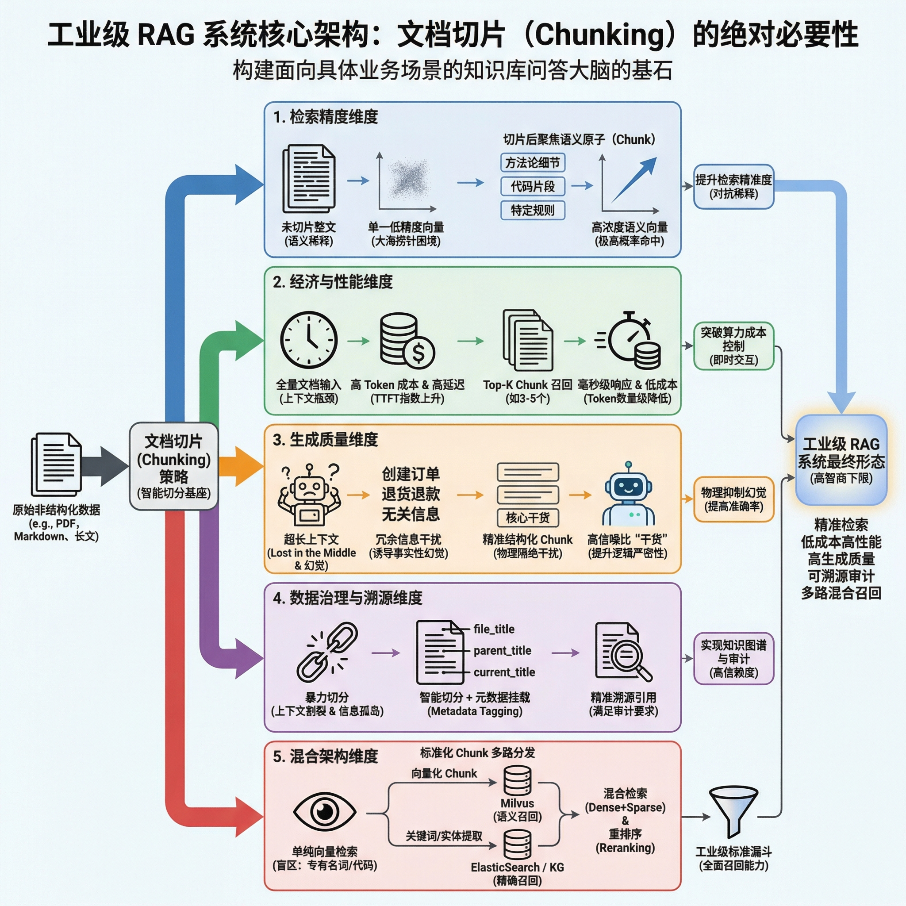

# RAG文档切割的必要性

在构建面向具体业务场景的知识库问答大脑时，文档切片（Chunking）往往决定了整体架构的智商下限。初期的误区在于，认为只需把完整的 PDF 或 Markdown 暴力灌入向量数据库即可。但在工业级应用中，精细的文本切分是不可或缺的基石。

五个核心维度，深度解析切片策略在工程中的绝对必要性：

## 1. 检索精度维度

### 目的：对抗“语义稀释”效应

* **物理限制**：Embedding 模型（如 BGE-M3）通常会将输入文本映射为一个固定维度的稠密向量（如 768 维或 1024 维）。
* **语义稀释灾难**：如果直接把包含复杂技术细节的万字长文映射为单一向量，文章中具体的方法论、代码片段或特定规则的特征，会被庞杂的宏观语义完全淹没（即所谓的“大海捞针”困境）。
* **切片收益**：通过切分，我们将大文本打碎成聚焦的“语义原子”。当用户提问非常具体的细节时，拥有单一、高浓度语义的 Chunk 能够在向量空间中被极高概率地精准命中。

## 2. 经济与性能维度

### 目的：突破 Token与算力成本控制

* **上下文瓶颈**：尽管当前的主流大模型支持 128K 甚至更长的上下文，但将海量原文档全部塞入 Prompt，会导致首字生成时间（TTFT）呈指数级上升，产生严重的交互延迟。
* **财务黑洞**：商业大模型的 API 严格按 Token 计费。工业级系统每天面对海量并发，每次都携带冗长且无关的背景上下文，是不可接受的资源浪费。
* **切片收益**：切片后，RAG 系统只需挑选召回得分最高的 Top-K（如 3-5 个最相关的分片）喂给大模型。这不仅将系统响应压缩至毫秒级，更将大模型推理的 Token 成本降低了几个数量级。

## 3. 生成质量维度

### 目的：提升信噪比与物理抑制“幻觉”

* **迷失在中间 (Lost in the Middle)**：当 LLM 处理超长上下文时，对文本开头和结尾的注意力较高，但极易遗忘或混淆中间地带的关键信息。
* **信息干扰**：如果在询问“如何取消订单”时，检索系统带回了包含“创建订单”、“退货退款”的整章内容，冗余信息极易诱导模型张冠李戴，产生事实性幻觉。
* **切片收益**：精准的结构化切片物理隔绝了不相关的干扰信息。投喂给 LLM 的上下文变成了高纯度“干货”，极大提升了最终答案的逻辑严密性和准确率。

## 4. 数据治理与溯源维度

### 目的：元数据挂载的前提

* **信息孤岛陷阱**：单纯的按字数（Token）暴力切分会导致上下文割裂，这也是通常为什么我们需要引入基于 Markdown 标题树（Heading Tree）的智能切分。
* **切片收益**：切片不仅是“切”，更是“装”。切分过程让我们能够为每一个 Chunk 打上极其详细的元数据标签（如 `file_title`, `parent_title`, `current_title`）。这不仅使得知识图谱的构建成为可能，也让系统能够在生成答案时附带极其精准的文件溯源引用，满足高信赖度场景的审计要求。

## 5. 混合架构维度

### 目的：多路召回（Hybrid Search）的要求

* **单纯向量检索的盲区**：向量检索擅长处理“模糊语义泛化”，但在遭遇专有名词、商品编号、等特定代码片段的精确匹配时，效果极差。
* **切片收益**：切片后，每一个标准化的 Chunk 可以兵分两路：一路被向量化存入 Milvus 提供语义召回，另一路被提取关键词甚至实体存入知识图谱或 ElasticSearch 提供精确召回。没有细粒度的切分基座，混合检索（Dense + Sparse）加重排序（Reranking）的工业级标准漏斗便无从谈起。

## 全方位图解分析

