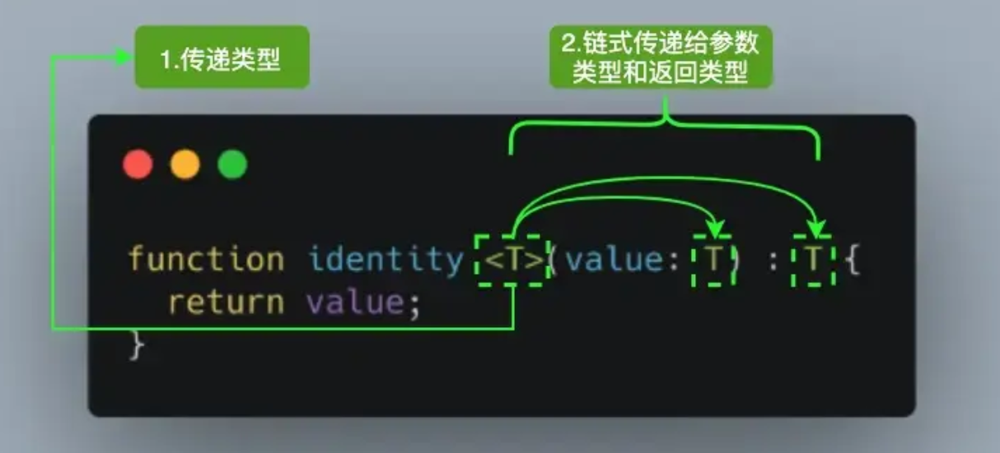
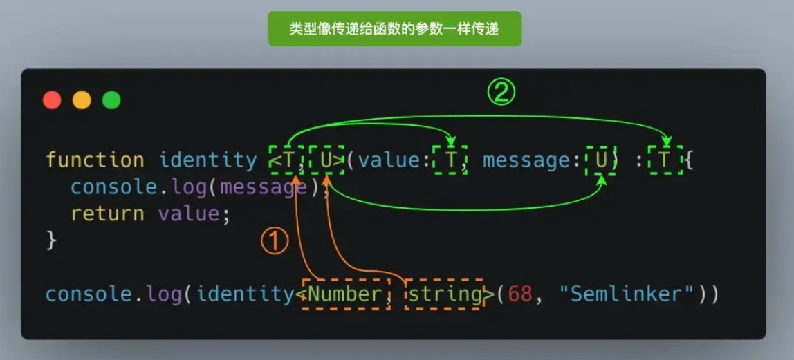

# 1.TypeScript介绍
## 1.1 TypeScript 是什么
1.TypeScript 简称 TS

2.TS 和 JS 之间的关系其实就是 Less/Sass 和 CSS 之间的关系

+ 就像 Less/Sass 是对 CSS 进行扩展一样, TS 也是对 JS 进行扩展
+ 就像 Less/Sass 最终会转换成 CSS 一样, 我们编写好的 TS 代码最终也会换成 JS

3.TypeScript 是 JavaScript 的超集，因为它扩展了 JavaScript，有 JavaScript 没有的东西

4.硬要以父子类关系来说的话，TypeScript 是 JavaScript 子类，继承的基础上去扩展

## 1.2 为什么要用 TypeScript
1.简单来说就是因为 JavaScript 是弱类型, 很多错误只有在运行时才会被发现  
2.而 TypeScript 提供了一套静态检测机制, 可以帮助我们在编译时就发现错误

## 1.3 TypeScript 的特点
1.支持最新的 JavaScript 新特特性

2.支持代码静态检查

3.支持诸如 C, C++, Java, Go等后端语言中的特性 (枚举、泛型、类型转换、命名空间、声明文件、类、接口等)


# 2.搭建开发环境
## 2.1 playground
1.官方也提供了一个在线开发 TypeScript 的云环境——[Playground](https://www.typescriptlang.org/zh/play/)

2.基于它，我们无须在本地安装环境，只需要一个浏览器即可随时学习和编写 TypeScript

3.同时还可以方便地选择 TypeScript 版本、配置 tsconfig，并对 TypeScript 实时静态类型检测、转译输出 JavaScript 和在线执行

4.而且在体验上，它也一点儿不逊色于任何本地的 IDE，对于刚刚学习 TypeScript 的我们来说，算是一个不错的选择

## 2.2 本地使用
> 确保已经安装 nodejs
>

1.安装 typescript

```shell
npm i -g typescript
```

2.创建 hello.ts 文件

```typescript
console.log("hello typescript")
```

3.进入命令行编译

```shell
tsc hello.ts
```

# 3.基础数据类型
## 3.1 JS的八种原始类型
1.原始类型

```typescript
let str: string = "zhangsan"; 
let num: number = 24; 
let bool: boolean = false; 
let u: undefined = undefined; 
let n: null = null; 
let obj: object = {x: 1}; 
let big: bigint = 100n; 
let sym: symbol = Symbol("me");
```

2.默认情况下 null和 undefined 是所有类型的子类型, 也就是说你可以把 null 和 undefined 赋值给其他类型

```typescript
// null和undefined赋值给string
let str:string = "666";
str = null
str= undefined

// null和undefined赋值给number
let num:number = 666;
num = null
num= undefined

// null和undefined赋值给object
let obj:object ={};
obj = null
obj= undefined

// null和undefined赋值给Symbol
let sym: symbol = Symbol("me"); 
sym = null
sym= undefined

// null和undefined赋值给boolean
let isDone: boolean = false;
isDone = null
isDone= undefined

// null和undefined赋值给bigint
let big: bigint =  100n;
big = null
big= undefined
```

> 如果你在tsconfig.json指定了"strictNullChecks":true ，null 和 undefined 只能赋值给 void 和它们各自的类型
>

3.虽然number和 bigint 都表示数字，但是这两个类型不兼容

```typescript
let big: bigint =  100n;
let num: number = 6;
big = num; // error
num = big; // error
```

## 3.2 原生类型与包装类型
> Number、String、Boolean、Symbol
>

首先，我们来回顾一下初学 TypeScript 时，很容易和原始类型 number、string、boolean、symbol 混淆的首字母大写的 Number、String、Boolean、Symbol 类型，后者是相应原始类型的包装对象，姑且把它们称之为对象类型。  

从类型兼容性上看，原始类型兼容对应的对象类型，反过来对象类型不兼容对应的原始类型。  

下面我们看一个具体的示例：

```typescript
let num: number;
let Num: Number;
Num = num; // ok
num = Num; // ts(2322)报错
```

在示例中的第 3 行，我们可以把 number 赋给类型 Number，但在第 4 行把 Number 赋给 number 就会提示 ts(2322) 错误

> 因此，我们需要铭记不要使用对象类型来注解值的类型，因为这没有任何意义
>

# 4.其他数据类型
## 4.1 void
void表示没有任何类型，和其他类型是平等关系，不能直接赋值:

```typescript
let a: void; 
let b: number = a; // Error
```

你只能为它赋予 null 和 undefined（在strictNullChecks未指定为true时）。声明一个void类型的变量没有什么大用，我们一般也只有在函数没有返回值时去声明。

值得注意的是，方法没有返回值将得到 undefined，但是我们需要定义成 void 类型，而不是 undefined 类型。否则将报错:

```typescript
function fun(): undefined {
  console.log("this is TypeScript");
};
fun(); // Error
```

## 4.2 never
never 类型表示的是那些永不存在的值的类型

值会永不存在的两种情况：  

+ 如果一个函数执行时抛出了异常，程序会中断，那么这个函数永远不存在返回值
+ 函数中执行无限循环的代码（死循环），使得程序永远无法运行到函数返回值那一步，永不存在返回

```typescript
// 异常
function err(msg: string): never { // OK
  throw new Error(msg); 
}

// 死循环
function loopForever(): never { // OK
  while (true) {};
}
```

never 类型同 null 和 undefined 一样，也是任何类型的子类型，也可以赋值给任何类型。  

但是没有类型是 never 的子类型或可以赋值给 never 类型（除了never本身之外），即使 any 也不可以赋值给 never

```typescript
let ne: never;
let nev: never;
let an: any;

ne = 123; // Error
ne = nev; // OK
ne = an; // Error
ne = (() => { throw new Error("异常"); })(); // OK
ne = (() => { while(true) {} })(); // OK
```

在 TypeScript 中，可以利用 never 类型的特性来实现全面性检查，具体示例如下：

```typescript
type Foo = string | number;

function controlFlowAnalysisWithNever(foo: Foo) {
  if (typeof foo === "string") {
    // 这里 foo 被收窄为 string 类型
  } else if (typeof foo === "number") {
    // 这里 foo 被收窄为 number 类型
  } else {
    // foo 在这里是 never
    const check: never = foo;
  }
}
```

注意在 else 分支里面，我们把收窄为 never 的 foo 赋值给一个显示声明的 never 变量。如果一切逻辑正确，那么这里应该能够编译通过。但是假如后来有一天你的同事修改了 Foo 的类型：

```typescript
type Foo = string | number | boolean;
```

然而他忘记同时修改 controlFlowAnalysisWithNever 方法中的控制流程，这时候 else 分支的 foo 类型会被收窄为 boolean 类型，导致无法赋值给 never 类型，这时就会产生一个编译错误。通过这个方式，我们可以确保controlFlowAnalysisWithNever 方法总是穷尽了 Foo 的所有可能类型。 

> 通过这个示例，我们可以得出一个结论：使用 never 避免出现新增了联合类型没有对应的实现，目的就是写出类型绝对安全的代码。
>

## 4.3 any
在 TypeScript 中，任何类型都可以被归为 any 类型。这让 any 类型成为了类型系统的顶级类型

如果是一个普通类型，在赋值过程中改变类型是不被允许的：  js 代码解读 复制代码

```typescript
let a: string = 'seven';
a = 7;
// TS2322: Type 'number' is not assignable to type 'string'.
```

但如果是 any 类型，则允许被赋值为任意类型

```typescript
let a: any = 666;
a = "Semlinker";
a = false;
a = 66
a = undefined
a = null
a = []
a = {}
```

在 any 上访问任何属性都是允许的,也允许调用任何方法

```typescript
let anyThing: any = 'hello';
console.log(anyThing.myName);
console.log(anyThing.myName.firstName);
let anyThing: any = 'Tom';
anyThing.setName('Jerry');
anyThing.setName('Jerry').sayHello();
anyThing.myName.setFirstName('Cat');
```

变量如果在声明的时候，未指定其类型，那么它会被识别为任意值类型

```typescript
let something; // 等价于 let something: any;
something = 'seven';
something = 7;
something.setName('Tom');
```

> 在许多场景下，这太宽松了。使用 `any` 类型，可以很容易地编写类型正确但在运行时有问题的代码。如果我们使用 `any` 类型，就无法使用 TypeScript 提供的大量的保护机制。请记住，`any 是魔鬼！`尽量不要用any
>

为了解决 any 带来的问题，TypeScript 3.0 引入了 unknown 类型

## 4.4 unknown
unknown 与 any 一样，所有类型都可以分配给 unknown:

```typescript
let notSure: unknown = 4;
notSure = "maybe a string instead"; // OK
notSure = false; // OK
```

unknown与any的最大区别是： 任何类型的值可以赋值给any，同时any类型的值也可以赋值给任何类型。unknown 任何类型的值都可以赋值给它，但它只能赋值给 unknown 和 any

```typescript
let notSure: unknown = 4;
let uncertain: any = notSure; // OK

let notSure: any = 4;
let uncertain: unknown = notSure; // OK

let notSure: unknown = 4;
let uncertain: number = notSure; // Error
```

如果不缩小类型，就无法对unknown类型执行任何操作：

```typescript
function getDog() {
 return '123'
}
 
const dog: unknown = {hello: getDog};
dog.hello(); // Error
```

这种机制起到了很强的预防性，更安全，这就要求我们必须缩小类型，我们可以使用typeof、类型断言等方式来缩小未知范围：

```typescript
function getDogName() {
 let x: unknown;
 return x;
};
const dogName = getDogName();
// 直接使用
const upName = dogName.toLowerCase(); // Error
// typeof
if (typeof dogName === 'string') {
  const upName = dogName.toLowerCase(); // OK
}
// 类型断言 
const upName = (dogName as string).toLowerCase(); // OK
```

## 4.5 Array
对数组类型的定义有两种方式：

```typescript
let arr:string[] = ["1","2"];
let arr2:Array<string> = ["1","2"]；
```

定义联合类型数组

```typescript
let arr:(number | string)[];
// 表示定义了一个名称叫做arr的数组, 
// 这个数组中将来既可以存储数值类型的数据, 也可以存储字符串类型的数据
arr3 = [1, 'b', 2, 'c'];
```

定义指定对象成员的数组：

```typescript
// interface是接口,后面会讲到
interface Arrobj{
    name:string,
    age:number
}
let arr3:Arrobj[]=[{name:'jimmy',age:22}]
```

## 4.6 tuple（元组）
### （1）元组的定义
众所周知，数组一般由同种类型的值组成，但有时我们需要在单个变量中存储不同类型的值，这时候我们就可以使用元组。在 JavaScript 中是没有元组的，元组是 TypeScript 中特有的类型，其工作方式类似于数组。

元组最重要的特性是可以限制数组元素的个数和类型，它特别适合用来实现多值返回。

元祖用于保存定长定数据类型的数据

```typescript
let x: [string, number]; 
// 类型必须匹配且个数必须为2

x = ['hello', 10]; // OK 
x = ['hello', 10,10]; // Error 
x = [10, 'hello']; // Error
```

注意，元组类型只能表示一个已知元素数量和类型的数组，长度已指定，越界访问会提示错误。如果一个数组中可能有多种类型，数量和类型都不确定，那就直接 any[]

### （2）元组的解构赋值
我们可以通过下标的方式来访问元组中的元素，当元组中的元素较多时，这种方式并不是那么便捷。其实元组也是支持解构赋值的

```typescript
let employee: [number, string] = [1, "Semlinker"];
let [id, username] = employee;
console.log(`id: ${id}`);
console.log(`username: ${username}`);
```

以上代码成功运行后，控制台会输出以下消息：

```typescript
id: 1
username: Semlinker
```

这里需要注意的是，在解构赋值时，如果解构数组元素的个数是不能超过元组中元素的个数，否则也会出现错误，比如：

```typescript
let employee: [number, string] = [1, "Semlinker"];
let [id, username, age] = employee; // Error
```

在以上代码中，我们新增了一个 age 变量，但此时 TypeScript 编译器会提示以下错误信息：

```typescript
Tuple type '[number, string]' of length '2' has no element at index '2'.
```

很明显元组类型 [number, string] 的长度是 2，在位置索引 2 处不存在任何元素。

### （3）元组的可选元素
在定义元组类型时，我们也可以通过 ` ? ` 号来声明元组类型的可选元素

```typescript
let optionalTuple: [string, boolean?];
optionalTuple = ["Semlinker", true]; // OK 
optionalTuple = ["Kakuqo"]; // OK 
```

在上面代码中，我们定义了一个名为 optionalTuple 的变量，该变量的类型要求包含一个必须的字符串属性和一个可选布尔属性，该代码正常运行后，控制台会输出以下内容：

```typescript
optionalTuple : Semlinker,true
optionalTuple : Kakuqo
```

那么在实际工作中，声明可选的元组元素有什么作用？这里我们来举一个例子，在三维坐标轴中，一个坐标点可以使用 (x, y, z) 的形式来表示，对于二维坐标轴来说，坐标点可以使用 (x, y) 的形式来表示，而对于一维坐标轴来说，只要使用 (x) 的形式来表示即可。针对这种情形，在 TypeScript 中就可以利用元组类型可选元素的特性来定义一个元组类型的坐标点，具体实现如下：

```typescript
type Point = [number, number?, number?];

const x: Point = [10]; // 一维坐标点
const xy: Point = [10, 20]; // 二维坐标点
const xyz: Point = [10, 20, 10]; // 三维坐标点

console.log(x.length); // 1
console.log(xy.length); // 2
console.log(xyz.length); // 3
```

### （4）元组的剩余元素
元组类型里最后一个元素可以是剩余元素，形式为 ...X，这里 X 是数组类型。剩余元素代表元组类型是开放的，可以有零个或多个额外的元素。 例如，[number, ...string[]] 表示带有一个 number 元素和任意数量string 类型元素的元组类型。

为了能更好的理解，我们来举个具体的例子

```typescript
type RestTupleType = [number, ...string[]];
let restTuple: RestTupleType = [666, "Semlinker", "Kakuqo", "Lolo"]; // OK 
console.log(restTuple[0]);
console.log(restTuple[1]);
```

### （5）只读的元组类型
TypeScript 3.4 还引入了对只读元组的新支持。我们可以为任何元组类型加上 readonly 关键字前缀，以使其成为只读元组。具体的示例如下：

```typescript
const point: readonly [number, number] = [10, 20];
```

在使用 readonly 关键字修饰元组类型之后，任何企图修改元组中元素的操作都会抛出异常：

```typescript
// Cannot assign to '0' because it is a read-only property.
point[0] = 1;
// Property 'push' does not exist on type 'readonly [number, number]'.
point.push(0);
// Property 'pop' does not exist on type 'readonly [number, number]'.
point.pop();
// Property 'splice' does not exist on type 'readonly [number, number]'.
point.splice(1, 1);
```

## 4.7 函数
### （1）函数声明
```typescript
function sum(x: number, y: number): number {
    return x + y;
}
```

### （2）函数表达式
```typescript
let mySum: (x: number, y: number) => number = function (x: number, y: number): number {
    return x + y;
};
```

### （3）用接口定义函数
```typescript
interface SearchFunc{
  (source: string, subString: string): boolean;
}
```

> 采用函数表达式接口定义函数的方式时，对等号左侧进行类型限制，可以保证以后对函数名赋值时保证参数个数、参数类型、返回值类型不变
>

### （4）可选参数
```typescript
function buildName(firstName: string, lastName?: string) {
    if (lastName) {
        return firstName + ' ' + lastName;
    } else {
        return firstName;
    }
}
let tomcat = buildName('Tom', 'Cat');
let tom = buildName('Tom');
```

> 注意点：可选参数后面不允许再出现必需参数
>

### （5）参数默认值
```typescript
function buildName(firstName: string, lastName: string = 'Cat') {
    return firstName + ' ' + lastName;
}
let tomcat = buildName('Tom', 'Cat');
let tom = buildName('Tom');
```

### （6）剩余参数
```typescript
function push(array: any[], ...items: any[]) {
    items.forEach(function(item) {
        array.push(item);
    });
}
let a = [];
push(a, 1, 2, 3);
```

### （7）函数重载
由于 JavaScript 是一个动态语言，我们通常会使用不同类型的参数来调用同一个函数，该函数会根据不同的参数而返回不同的类型的调用结果：

```typescript
function add(x, y) {
 return x + y;
}
add(1, 2); // 3
add("1", "2"); //"12"
```

由于 TypeScript 是 JavaScript 的超集，因此以上的代码可以直接在 TypeScript 中使用，但当 TypeScript 编译器开启 noImplicitAny 的配置项时，以上代码会提示以下错误信息：

```typescript
Parameter 'x' implicitly has an 'any' type.
Parameter 'y' implicitly has an 'any' type.
```

该信息告诉我们参数 x 和参数 y 隐式具有 any 类型。为了解决这个问题，我们可以为参数设置一个类型。因为我们希望 add 函数同时支持 string 和 number 类型，因此我们可以定义一个 string | number 联合类型，同时我们为该联合类型取个别名：

```typescript
type Combinable = string | number;
```

在定义完 Combinable 联合类型后，我们来更新一下 add 函数：

```typescript
function add(a: Combinable, b: Combinable) {
    if (typeof a === 'string' || typeof b === 'string') {
     return a.toString() + b.toString();
    }
    return a + b;
}
```

为 add 函数的参数显式设置类型之后，之前错误的提示消息就消失了。那么此时的 add 函数就完美了么，我们来实际测试一下：

```typescript
const result = add('Semlinker', ' Kakuqo');
result.split(' ');
```

在上面代码中，我们分别使用 'Semlinker' 和 ' Kakuqo' 这两个字符串作为参数调用 add 函数，并把调用结果保存到一个名为 result 的变量上，这时候我们想当然的认为此时 result 的变量的类型为 string，所以我们就可以正常调用字符串对象上的 split 方法。但这时 TypeScript 编译器又出现以下错误信息了：

```typescript
Property 'split' does not exist on type 'number'.
```

很明显 number 类型的对象上并不存在 split 属性。问题又来了，那如何解决呢？这时我们就可以利用 TypeScript 提供的函数重载特性。

> 函数重载或方法重载是使用相同名称和不同参数数量或类型创建多个方法的一种能力。 要解决前面遇到的问题，方法就是为同一个函数提供多个函数类型定义来进行函数重载，编译器会根据这个列表去处理函数的调用。
>

```typescript
type Types = number | string
function add(a:number,b:number):number;
function add(a: string, b: string): string;
function add(a: string, b: number): string;
function add(a: number, b: string): string;
function add(a:Types, b:Types) {
  if (typeof a === 'string' || typeof b === 'string') {
    return a.toString() + b.toString();
  }
  return a + b;
}
const result = add('Semlinker', ' Kakuqo');
result.split(' ');
```

在以上代码中，我们为 add 函数提供了多个函数类型定义，从而实现函数的重载。之后，可恶的错误消息又消失了，因为这时 result 变量的类型是 string 类型。

## 4.8 object、Object 和 {}
另外，object（首字母小写，以下称“小 object”）、Object（首字母大写，以下称“大 Object”）和 {}（以下称“空对象”）

小 object 代表的是所有非原始类型，也就是说我们不能把 number、string、boolean、symbol等 原始类型赋值给 object。在严格模式下，null 和 undefined 类型也不能赋给 object。

> JavaScript 中以下类型被视为原始类型：string、boolean、number、bigint、symbol、null 和 undefined。
>

下面我们看一个具体示例：

```typescript
let lowerCaseObject: object;
lowerCaseObject = 1; // ts(2322)
lowerCaseObject = 'a'; // ts(2322)
lowerCaseObject = true; // ts(2322)
lowerCaseObject = null; // ts(2322)
lowerCaseObject = undefined; // ts(2322)
lowerCaseObject = {}; // ok
```

在示例中的第 2~6 行都会提示 ts(2322) 错误，但是我们在第 7 行把一个空对象赋值给 object 后，则可以通过静态类型检测。

大Object 代表所有拥有 toString、hasOwnProperty 方法的类型，所以所有原始类型、非原始类型都可以赋给 Object。同样，在严格模式下，null 和 undefined 类型也不能赋给 Object。

下面我们也看一个具体的示例：

```typescript
let upperCaseObject: Object;
upperCaseObject = 1; // ok
upperCaseObject = 'a'; // ok
upperCaseObject = true; // ok
upperCaseObject = null; // ts(2322)
upperCaseObject = undefined; // ts(2322)
upperCaseObject = {}; // ok
```

在示例中的第 2到4 行、第 7 行都可以通过静态类型检测，而第 5~6 行则会提示 ts(2322) 错误。

从上面示例可以看到，大 Object 包含原始类型，小 object 仅包含非原始类型，所以大 Object 似乎是小 object 的父类型。实际上，大 Object 不仅是小 object 的父类型，同时也是小 object 的子类型。

下面我们还是通过一个具体的示例进行说明。

```typescript
type isLowerCaseObjectExtendsUpperCaseObject = object extends Object ? true : false; // true
type isUpperCaseObjectExtendsLowerCaseObject = Object extends object ? true : false; // true
upperCaseObject = lowerCaseObject; // ok
lowerCaseObject = upperCaseObject; // ok
```

在示例中的第 1 行和第 2 行返回的类型都是 true，第3 行和第 4 行的 upperCaseObject 与 lowerCaseObject 可以互相赋值。

> 注意：尽管官方文档说可以使用小 object 代替大 Object，但是我们仍要明白大 Object 并不完全等价于小 object。
>

{}空对象类型和大 Object 一样，也是表示原始类型和非原始类型的集合，并且在严格模式下，null 和 undefined 也不能赋给 {} ，如下示例：

```typescript
let ObjectLiteral: {};
ObjectLiteral = 1; // ok
ObjectLiteral = 'a'; // ok
ObjectLiteral = true; // ok
ObjectLiteral = null; // ts(2322)
ObjectLiteral = undefined; // ts(2322)
ObjectLiteral = {}; // ok
type isLiteralCaseObjectExtendsUpperCaseObject = {} extends Object ? true : false; // true
type isUpperCaseObjectExtendsLiteralCaseObject = Object extends {} ? true : false; // true
upperCaseObject = ObjectLiteral;
ObjectLiteral = upperCaseObject;
```

在示例中的第 8 行和第 9 行返回的类型都是 true，第10 行和第 11 行的 ObjectLiteral 与 upperCaseObject 可以互相赋值，第2~4 行、第 7 行的赋值操作都符合静态类型检测；而第5 行、第 6 行则会提示 ts(2322) 错误

> 综上结论：{}、大 Object 是比小 object 更宽泛的类型（least specific），{} 和大 Object 可以互相代替，用来表示原始类型（null、undefined 除外）和非原始类型；而小 object 则表示非原始类型
>

# 5.类型推断
```typescript
{
  let str: string = 'this is string';
  let num: number = 1;
  let bool: boolean = true;
}
{
  const str: string = 'this is string';
  const num: number = 1;
  const bool: boolean = true;
}
```

看着上面的示例，可能你已经在嘀咕了：定义基础类型的变量都需要写明类型注解，TypeScript 太麻烦了吧？

在示例中，使用 let 定义变量时，我们写明类型注解也就罢了，毕竟值可能会被改变。可是，使用 const 常量时还需要写明类型注解，那可真的很麻烦。  

实际上，TypeScript 早就考虑到了这么简单而明显的问题。  在很多情况下，TypeScript 会根据上下文环境自动推断出变量的类型，无须我们再写明类型注解。

因此，上面的示例可以简化为如下所示内容：

```typescript
{
  let str = 'this is string'; // 等价 let str: string = 'this is string'; 下面类似
  let num = 1; // 等价
  let bool = true; // 等价
}
{
  const str = 'this is string'; // 不等价
  const num = 1; // 不等价
  const bool = true; // 不等价
}
```

我们把 TypeScript 这种基于赋值表达式推断类型的能力称之为`类型推断`

在 TypeScript 中，具有初始化值的变量、有默认值的函数参数、函数返回的类型都可以根据上下文推断出来。

比如我们能根据 return 语句推断函数返回的类型，如下代码所示：

```typescript
{
  /** 根据参数的类型，推断出返回值的类型也是 number */
  function add1(a: number, b: number) {
    return a + b;
  }
  const x1= add1(1, 1); // 推断出 x1 的类型也是 number
  
  /** 推断参数 b 的类型是数字或者 undefined，返回值的类型也是数字 */
  function add2(a: number, b = 1) {
    return a + b;
  }
  const x2 = add2(1);
  const x3 = add2(1, '1'); // ts(2345) Argument of type "1" is not assignable to parameter of type 'number | undefined
}
```

如果定义的时候没有赋值，不管之后有没有赋值，都会被推断成 any 类型而完全不被类型检查

```typescript
let myFavoriteNumber;
myFavoriteNumber = 'seven';
myFavoriteNumber = 7;
```

# 6.类型断言
## 6.1 引入
有时候你会遇到这样的情况，你会比 TypeScript 更了解某个值的详细信息。通常这会发生在你清楚地知道一个实体具有比它现有类型更确切的类型。

通过类型断言这种方式可以告诉编译器，“相信我，我知道自己在干什么”。类型断言好比其他语言里的类型转换，但是不进行特殊的数据检查和解构。它没有运行时的影响，只是在编译阶段起作用。

TypeScript 类型检测无法做到绝对智能，毕竟程序不能像人一样思考。有时会碰到我们比 TypeScript 更清楚实际类型的情况，比如下面的例子：

```typescript
const arrayNumber: number[] = [1, 2, 3, 4];
const greaterThan2: number = arrayNumber.find(num => num > 2); // 提示 ts(2322)
```

其中，greaterThan2 一定是一个数字（确切地讲是 3），因为 arrayNumber 中明显有大于 2 的成员，但静态类型对运行时的逻辑无能为力。

在 TypeScript 看来，greaterThan2 的类型既可能是数字，也可能是 undefined，所以上面的示例中提示了一个 ts(2322) 错误，此时我们不能把类型 undefined 分配给类型 number。

不过，我们可以使用一种笃定的方式——**类型断言**（类似仅作用在类型层面的强制类型转换）告诉 TypeScript 按照我们的方式做类型检查。

比如，我们可以使用 as 语法做类型断言，如下代码所示：

```typescript
const arrayNumber: number[] = [1, 2, 3, 4];
const greaterThan2: number = arrayNumber.find(num => num > 2) as number;
```

## 6.2 语法
```typescript
// 尖括号 语法
let someValue: any = "this is a string";
let strLength: number = (<string>someValue).length;

// as 语法
let someValue: any = "this is a string";
let strLength: number = (someValue as string).length;
```

> 以上两种方式虽然没有任何区别，但是尖括号格式会与react中JSX产生语法冲突，因此我们更推荐使用 as 语法
>

## 6.3 非空断言
1.在上下文中当类型检查器无法断定类型时，一个新的后缀表达式操作符` ! `可以用于断言操作对象是非 null 和非 undefined 类型

2.具体而言，x! 将从 x 值域中排除 null 和 undefined 。 

3.具体看以下示例：

```typescript
let mayNullOrUndefinedOrString: null | undefined | string;
mayNullOrUndefinedOrString!.toString(); // ok
mayNullOrUndefinedOrString.toString(); // ts(2531)
```

```typescript
type NumGenerator = () => number;

function myFunc(numGenerator: NumGenerator | undefined) {
  // Object is possibly 'undefined'.(2532)
  // Cannot invoke an object which is possibly 'undefined'.(2722)
  const num1 = numGenerator(); // Error
  const num2 = numGenerator!(); //OK
}
```

## 6.4 确定赋值断言
允许在实例属性和变量声明后面放置一个 `!` 号，从而告诉 TypeScript 该属性会被明确地赋值。为了更好地理解它的作用，我们来看个具体的例子：

```typescript
let x: number;
initialize();

// Variable 'x' is used before being assigned.(2454)
console.log(2 * x); // Error
function initialize() {
  x = 10;
}
```

很明显该异常信息是说变量 x 在赋值前被使用了，要解决该问题，我们可以使用确定赋值断言：

```typescript
let x!: number;
initialize();
console.log(2 * x); // Ok

function initialize() {
  x = 10;
}
```

通过 `let x!: number;` 确定赋值断言，TypeScript 编译器就会知道该属性会被明确地赋值

# 7.字面量类型
## 7.1 引入
在 TypeScript 中，字面量不仅可以表示值，还可以表示类型，即所谓的字面量类型。  

目前，TypeScript 支持 3 种字面量类型：字符串字面量类型、数字字面量类型、布尔字面量类型，对应的字符串字面量、数字字面量、布尔字面量分别拥有与其值一样的字面量类型，具体示例如下：

```typescript
{
  let specifiedStr: 'this is string' = 'this is string';
  let specifiedNum: 1 = 1;
  let specifiedBoolean: true = true;
}
```

比如 'this is string' （这里表示一个字符串字面量类型）类型是 string 类型（确切地说是 string 类型的子类型），而 string 类型不一定是 'this is string'（这里表示一个字符串字面量类型）类型，如下具体示例：

```typescript
{
  let specifiedStr: 'this is string' = 'this is string';
  let str: string = 'any string';
  specifiedStr = str; // ts(2322) 类型 '"string"' 不能赋值给类型 'this is string'
  str = specifiedStr; // ok 
}
```

比如说我们用“马”比喻 string 类型，即“黑马”代指 'this is string' 类型，“黑马”肯定是“马”，但“马”不一定是“黑马”，它可能还是“白马”“灰马”。因此，'this is string' 字面量类型可以给 string 类型赋值，但是 string 类型不能给 'this is string' 字面量类型赋值，这个比喻同样适合于形容数字、布尔等其他字面量和它们父类的关系。

## 7.2 字符串字面量类型
一般来说，我们可以使用一个字符串字面量类型作为变量的类型，如下代码所示：

```typescript
let hello: 'hello' = 'hello';
hello = 'hi'; // ts(2322) Type '"hi"' is not assignable to type '"hello"'
```

实际上，定义单个的字面量类型并没有太大的用处，它真正的应用场景是可以把多个字面量类型组合成一个联合类型（后面会讲解），用来描述拥有明确成员的实用的集合。

如下代码所示，我们使用字面量联合类型描述了一个明确、可 'up' 可 'down' 的集合，这样就能清楚地知道需要的数据结构了。

```typescript
type Direction = 'up' | 'down';

function move(dir: Direction) {
  // ...
}
move('up'); // ok
move('right'); // ts(2345) Argument of type '"right"' is not assignable to parameter of type 'Direction'
```

通过使用字面量类型组合的联合类型，我们可以限制函数的参数为指定的字面量类型集合，然后编译器会检查参数是否是指定的字面量类型集合里的成员。

因此，相较于使用 string 类型，使用字面量类型（组合的联合类型）可以将函数的参数限定为更具体的类型。这不仅提升了程序的可读性，还保证了函数的参数类型，可谓一举两得。

## 7.3 数字及布尔字面量类型
数字字面量类型和布尔字面量类型的使用与字符串字面量类型的使用类似，我们可以使用字面量组合的联合类型将函数的参数限定为更具体的类型，比如声明如下所示的一个类型 Config：

```typescript
interface Config {
    size: 'small' | 'big';
    isEnable:  true | false;
    margin: 0 | 2 | 4;
}
```

在上述代码中，我们限定了 size 属性为字符串字面量类型 'small' | 'big'，isEnable 属性为布尔字面量类型 true | false（布尔字面量只包含 true 和 false，true | false 的组合跟直接使用 boolean 没有区别），margin 属性为数字字面量类型 0 | 2 | 4。

## 7.4 let和const分析
我们先来看一个 const 示例，如下代码所示： 

```typescript
{
  const str = 'this is string'; // str: 'this is string'
  const num = 1; // num: 1
  const bool = true; // bool: true
}
```

在上述代码中，我们将 const 定义为一个不可变更的常量，在缺省类型注解的情况下，TypeScript 推断出它的类型直接由赋值字面量的类型决定，这也是一种比较合理的设计。

接下来我们看看如下所示的 let 示例:

```typescript
{

  let str = 'this is string'; // str: string
  let num = 1; // num: number
  let bool = true; // bool: boolean
}
```

在上述代码中，缺省显式类型注解的可变更的变量的类型转换为了赋值字面量类型的父类型，比如 str 的类型是 'this is string' 类型（这里表示一个字符串字面量类型）的父类型 string，num 的类型是 1 类型的父类型 number。

这种设计符合编程预期，意味着我们可以分别赋予 str 和 num 任意值（只要类型是 string 和 number 的子集的变量）：

```typescript
str = 'any string';
num = 2;
bool = false;
```

我们将 TypeScript 的字面量子类型转换为父类型的这种设计称之为 "literal widening"，也就是字面量类型的拓宽，比如上面示例中提到的字符串字面量类型转换成 string 类型，下面我们着重介绍一下。

# 8.类型拓宽
所有通过 let 或 var 定义的变量、函数的形参、对象的非只读属性，如果满足指定了初始值且未显式添加类型注解的条件，那么它们推断出来的类型就是指定的初始值字面量类型拓宽后的类型，这就是字面量类型拓宽

下面我们通过字符串字面量的示例来理解一下字面量类型拓宽

```typescript
let str = 'this is string'; // 类型是 string
let strFun = (str = 'this is string') => str; // 类型是 (str?: string) => string;
const specifiedStr = 'this is string'; // 类型是 'this is string'
let str2 = specifiedStr; // 类型是 'string'
let strFun2 = (str = specifiedStr) => str; // 类型是 (str?: string) => string;
```

因为第 1~2 行满足了 let、形参且未显式声明类型注解的条件，所以变量、形参的类型拓宽为 string（形参类型确切地讲是 string | undefined）

因为第 3 行的常量不可变更，类型没有拓宽，所以 specifiedStr 的类型是 'this is string' 字面量类型

第 4~5 行，因为赋予的值 specifiedStr 的类型是字面量类型，且没有显式类型注解，所以变量、形参的类型也被拓宽了。其实，这样的设计符合实际编程诉求。我们设想一下，如果 str2 的类型被推断为 'this is string'，它将不可变更，因为赋予任何其他的字符串类型的值都会提示类型错误

基于字面量类型拓宽的条件，我们可以通过如下所示代码添加显示类型注解控制类型拓宽行为

```typescript
{
  const specifiedStr: 'this is string' = 'this is string'; // 类型是 '"this is string"'
  let str2 = specifiedStr; // 即便使用 let 定义，类型是 'this is string'
}
```

实际上，除了字面量类型拓宽之外，TypeScript 对某些特定类型值也有类似 "Type Widening" （类型拓宽）的设计，下面我们具体来了解一下

比如对 null 和 undefined 的类型进行拓宽，通过 let、var 定义的变量如果满足未显式声明类型注解且被赋予了 null 或 undefined 值，则推断出这些变量的类型是 any

```typescript
{
  let x = null; // 类型拓宽成 any
  let y = undefined; // 类型拓宽成 any

  /** -----分界线------- */
  const z = null; // 类型是 null

  /** -----分界线------- */
  let anyFun = (param = null) => param; // 形参类型是 null
  let z2 = z; // 类型是 null
  let x2 = x; // 类型是 null
  let y2 = y; // 类型是 undefined
}
```

> 注意：在严格模式下，一些比较老的版本中（2.0）null 和 undefined 并不会被拓宽成“any”
>

# 9.类型缩小
在 TypeScript 中，我们可以通过某些操作将变量的类型由一个较为宽泛的集合缩小到相对较小、较明确的集合，这就是 "Type Narrowing"

比如，我们可以使用类型守卫（后面会讲到）将函数参数的类型从 any 缩小到明确的类型，具体示例如下：

```typescript
{
  let func = (anything: any) => {
    if (typeof anything === 'string') {
      return anything; // 类型是 string 
    } else if (typeof anything === 'number') {
      return anything; // 类型是 number
    }
    return null;
  };
}
```

在 VS Code 中 hover 到第 4 行的 anything 变量提示类型是 string，到第 6 行则提示类型是 number

```typescript
{
  let func = (anything: string | number) => {
    if (typeof anything === 'string') {
      return anything; // 类型是 string 
    } else {
      return anything; // 类型是 number
    }
  };
}
```

当然，我们也可以通过字面量类型等值判断（===）或其他控制流语句（包括但不限于 if、三目运算符、switch 分支）将联合类型收敛为更具体的类型，如下代码所示

```typescript
{
  type Goods = 'pen' | 'pencil' |'ruler';
  const getPenCost = (item: 'pen') => 2;
  const getPencilCost = (item: 'pencil') => 4;
  const getRulerCost = (item: 'ruler') => 6;
  const getCost = (item: Goods) =>  {
    if (item === 'pen') {
      return getPenCost(item); // item => 'pen'
    } else if (item === 'pencil') {
      return getPencilCost(item); // item => 'pencil'
    } else {
      return getRulerCost(item); // item => 'ruler'
    }
  }
}
```

在上述 getCost 函数中，接受的参数类型是字面量类型的联合类型，函数内包含了 if 语句的 3 个流程分支，其中每个流程分支调用的函数的参数都是具体独立的字面量类型

那为什么类型由多个字面量组成的变量 item 可以传值给仅接收单一特定字面量类型的函数 getPenCost、getPencilCost、getRulerCost 呢？这是因为在每个流程分支中，编译器知道流程分支中的 item 类型是什么。比如 item === 'pencil' 的分支，item 的类型就被收缩为“pencil”

事实上，如果我们将上面的示例去掉中间的流程分支，编译器也可以推断出收敛后的类型，如下代码所示：

```typescript
  const getCost = (item: Goods) =>  {
    if (item === 'pen') {
      item; // item => 'pen'
    } else {
      item; // => 'pencil' | 'ruler'
    }
  }
```

一般来说 TypeScript 非常擅长通过条件来判别类型，但在处理一些特殊值时要特别注意 —— 它可能包含你不想要的东西！例如，以下从联合类型中排除 null 的方法是错误的：

```typescript
const el = document.getElementById("foo"); // Type is HTMLElement | null
if (typeof el === "object") {
  el; // Type is HTMLElement | null
}
```

因为在 JavaScript 中 typeof null 的结果是 "object" ，所以你实际上并没有通过这种检查排除 null 值。除此之外，falsy 的原始值也会产生类似的问题：

```typescript
function foo(x?: number | string | null) {
  if (!x) {
    x; // Type is string | number | null | undefined
  }
}
```

因为空字符串和 0 都属于 falsy 值，所以在分支中 x 的类型可能是 string 或 number 类型。帮助类型检查器缩小类型的另一种常见方法是在它们上放置一个明确的 “标签”：

```typescript
interface UploadEvent {
  type: "upload";
  filename: string;
  contents: string;
}

interface DownloadEvent {
  type: "download";
  filename: string;
}

type AppEvent = UploadEvent | DownloadEvent;

function handleEvent(e: AppEvent) {
  switch (e.type) {
    case "download":
      e; // Type is DownloadEvent 
      break;
    case "upload":
      e; // Type is UploadEvent 
      break;
  }
}
```

这种模式也被称为 ”标签联合“ 或 ”可辨识联合“，它在 TypeScript 中的应用范围非常广。

# 10.联合类型
联合类型表示取值可以为多种类型中的一种，使用 `|` 分隔每个类型

```typescript
let myFavoriteNumber: string | number;
myFavoriteNumber = 'seven'; // OK
myFavoriteNumber = 7; // OK
```

联合类型通常与 null 或 undefined 一起使用：

```typescript
const sayHello = (name: string | undefined) => {
  /* ... */
};
```

例如，这里 name 的类型是 string | undefined 意味着可以将 string 或 undefined 的值传递给sayHello 函数

```typescript
sayHello("semlinker"); 
sayHello(undefined);
```

通过这个示例，你可以凭直觉知道类型 A 和类型 B 联合后的类型是同时接受 A 和 B 值的类型。此外，对于联合类型来说，你可能会遇到以下的用法：

```typescript
let num: 1 | 2 = 1;
type EventNames = 'click' | 'scroll' | 'mousemove';
```

以上示例中的 1、2 或 'click' 被称为字面量类型，用来约束取值只能是某几个值中的一个

# 11.类型别名
类型别名用来给一个类型起个新名字。类型别名常用于联合类型。

```typescript
type Message = string | string[];
let greet = (message: Message) => {
  // ...
};
```

> 注意：类型别名，诚如其名，即我们仅仅是给类型取了一个新的名字，并不是创建了一个新的类型
>

# 12.交叉类型
## 12.1 介绍
交叉类型是将多个类型合并为一个类型。 这让我们可以把现有的多种类型叠加到一起成为一种类型，它包含了所需的所有类型的特性，使用`&`定义交叉类型。

```typescript
{
  type Useless = string & number;
}
```

很显然，如果我们仅仅把原始类型、字面量类型、函数类型等原子类型合并成交叉类型，是没有任何用处的，因为任何类型都不能满足同时属于多种原子类型，比如既是 string 类型又是 number 类型。因此，在上述的代码中，类型别名 Useless 的类型就是个 never。

交叉类型真正的用武之地就是将多个接口类型合并成一个类型，从而实现等同接口继承的效果，也就是所谓的合并接口类型，如下代码所示：

```typescript
type IntersectionType = { id: number; name: string; } & { age: number };
const mixed: IntersectionType = {
  id: 1,
  name: 'name',
  age: 18
}
```

在上述示例中，我们通过交叉类型，使得 IntersectionType 同时拥有了 id、name、age 所有属性，这里我们可以试着将合并接口类型理解为求并集。

## 12.2 思考
这里，我们来发散思考一下：如果合并的多个接口类型存在同名属性会是什么效果呢？

如果同名属性的类型不兼容，比如上面示例中两个接口类型同名的 name 属性类型一个是 number，另一个是 string，合并后，name 属性的类型就是 number 和 string 两个原子类型的交叉类型，即 never，如下代码所示：

```typescript
  type IntersectionTypeConfict = { id: number; name: string; } 
  & { age: number; name: number; };
  const mixedConflict: IntersectionTypeConfict = {
    id: 1,
    name: 2, // ts(2322) 错误，'number' 类型不能赋给 'never' 类型
    age: 2
  };
```

此时，我们赋予 mixedConflict 任意类型的 name 属性值都会提示类型错误。而如果我们不设置 name 属性，又会提示一个缺少必选的 name 属性的错误。在这种情况下，就意味着上述代码中交叉出来的 IntersectionTypeConfict 类型是一个无用类型。

如果同名属性的类型兼容，比如一个是 number，另一个是 number 的子类型、数字字面量类型，合并后 name 属性的类型就是两者中的子类型。

如下所示示例中 name 属性的类型就是数字字面量类型 2，因此，我们不能把任何非 2 之外的值赋予 name 属性。

```typescript
  type IntersectionTypeConfict = { id: number; name: 2; } 
  & { age: number; name: number; };

  let mixedConflict: IntersectionTypeConfict = {
    id: 1,
    name: 2, // ok
    age: 2
  };
  mixedConflict = {
    id: 1,
    name: 22, // '22' 类型不能赋给 '2' 类型
    age: 2
  };
```

那么如果同名属性是非基本数据类型的话，又会是什么情形。我们来看个具体的例子：

```typescript
interface A {
  x:{d:true},
}
interface B {
  x:{e:string},
}
interface C {
  x:{f:number},
}
type ABC = A & B & C
let abc:ABC = {
  x:{
    d:true,
    e:'',
    f:666
  }
}
```

以上代码成功运行后，会输出以下结果：

```typescript
{ ×:{ d:true, e: , f: 666 } }
```

由上可知，在混入多个类型时，若存在相同的成员，且成员类型为非基本数据类型，那么是可以成功合并。

# 13.接口（Interfaces）
在 TypeScript 中，我们使用接口（Interfaces）来定义对象的类型

## 13.1 什么是接口
在面向对象语言中，接口（Interfaces）是一个很重要的概念，它是对行为的抽象，而具体如何行动需要由类（classes）去实现（implement）。

TypeScript 中的接口是一个非常灵活的概念，除了可用于[对类的一部分行为进行抽象]以外，也常用于对「对象的形状（Shape）」进行描述。

```typescript
interface Person {
    name: string;
    age: number;
}
let tom: Person = {
    name: 'Tom',
    age: 25
};
```

上面的例子中，我们定义了一个接口 Person，接着定义了一个变量 tom，它的类型是 Person。这样，我们就约束了 tom 的形状必须和接口 Person 一致。

接口一般首字母大写

定义的变量比接口少了一些属性是不允许的

```typescript
interface Person {
    name: string;
    age: number;
}
let tom: Person = {
    name: 'Tom'
};

// index.ts(6,5): error TS2322: Type '{ name: string; }' is not assignable to type 'Person'.
//   Property 'age' is missing in type '{ name: string; }'.
```

多一些属性也是不允许的：

```typescript
interface Person {
    name: string;
    age: number;
}

let tom: Person = {
    name: 'Tom',
    age: 25,
    gender: 'male'
};

// index.ts(9,5): error TS2322: Type '{ name: string; age: number; gender: string; }' is not assignable to type 'Person'.
//   Object literal may only specify known properties, and 'gender' does not exist in type 'Person'.
```

> 可见，赋值的时候，变量的形状必须和接口的形状保持一致
>

## 13.2 可选 | 只读属性
```typescript
interface Person {
  readonly name: string;
  age?: number;
}
```

只读属性用于限制只能在对象刚刚创建的时候修改其值。此外 TypeScript 还提供了 ReadonlyArray 类型，它与 Array 相似，只是把所有可变方法去掉了，因此可以确保数组创建后再也不能被修改。

```typescript
let a: number[] = [1, 2, 3, 4];
let ro: ReadonlyArray<number> = a;
ro[0] = 12; // error!
ro.push(5); // error!
ro.length = 100; // error!
a = ro; // error!
```

## 13.3 任意属性
有时候我们希望一个接口中除了包含必选和可选属性之外，还允许有其他的任意属性，这时我们可以使用 索引签名 的形式来满足上述要求。

```typescript
interface Person {
    name: string;
    age?: number;
    [propName: string]: any;
}

let tom: Person = {
    name: 'Tom',
    gender: 'male'
};
```

需要注意的是，一旦定义了任意属性，那么确定属性和可选属性的类型都必须是它的类型的子集

```typescript
interface Person {
    name: string;
    age?: number;
    [propName: string]: string;
}

let tom: Person = {
    name: 'Tom',
    age: 25,
    gender: 'male'
};

// index.ts(3,5): error TS2411: Property 'age' of type 'number' is not assignable to string index type 'string'.
// index.ts(7,5): error TS2322: Type '{ [x: string]: string | number; name: string; age: number; gender: string; }' is not assignable to type 'Person'.
//   Index signatures are incompatible.
//     Type 'string | number' is not assignable to type 'string'.
//       Type 'number' is not assignable to type 'string'.
```

上例中，任意属性的值允许是 string，但是可选属性 age 的值却是 number，number 不是 string 的子属性，所以报错了。

另外，在报错信息中可以看出，此时 `{ name: 'Tom', age: 25, gender: 'male' }` 的类型被推断成了 `{ [x: string]: string | number; name: string; age: number; gender: string; }`，这是联合类型和接口的结合。

一个接口中只能定义一个任意属性。如果接口中有多个类型的属性，则可以在任意属性中使用联合类型：

```typescript
interface Person {
    name: string;
    age?: number; // 这里真实的类型应该为：number | undefined
    [propName: string]: string | number | undefined;
}

let tom: Person = {
    name: 'Tom',
    age: 25,
    gender: 'male'
};
```

## 13.4 绕开额外属性检查
### （1）鸭式辨型法
谓的鸭式辨型法就是像鸭子一样走路并且嘎嘎叫的就叫鸭子，即具有鸭子特征的认为它就是鸭子，也就是通过制定规则来判定对象是否实现这个接口。  

```typescript
interface LabeledValue {
  label: string;
}
function printLabel(labeledObj: LabeledValue) {
  console.log(labeledObj.label);
}
let myObj = { size: 10, label: "Size 10 Object" };
printLabel(myObj); // OK
```

```typescript
interface LabeledValue {
  label: string;
}
function printLabel(labeledObj: LabeledValue) {
  console.log(labeledObj.label);
}
printLabel({ size: 10, label: "Size 10 Object" }); // Error
```

### （2）类型断言
类型断言的意义就等同于你在告诉程序，你很清楚自己在做什么，此时程序自然就不会再进行额外的属性检查了。

```typescript
interface Props { 
  name: string; 
  age: number; 
  money?: number;
}

let p: Props = {
  name: "兔神",
  age: 25,
  money: -100000,
  girl: false
} as Props; // OK
```

### （3）索引签名
```typescript
interface Props { 
  name: string; 
  age: number; 
  money?: number;
  [key: string]: any;
}

let p: Props = {
  name: "兔神",
  age: 25,
  money: -100000,
  girl: false
}; // OK
```

# 14.接口与类型别名的区别
实际上，在大多数的情况下使用接口类型和类型别名的效果等价，但是在某些特定的场景下这两者还是存在很大区别。

TypeScript 的核心原则之一是对值所具有的结构进行类型检查。 而接口的作用就是为这些类型命名和为你的代码或第三方代码定义数据模型。

type(类型别名)会给一个类型起个新名字。 type 有时和 interface 很像，但是可以作用于原始值（基本类型），联合类型，元组以及其它任何你需要手写的类型。起别名不会新建一个类型 - 它创建了一个新 名字来引用那个类型。给基本类型起别名通常没什么用，尽管可以做为文档的一种形式使用。

## 14.1 Objects / Functions
两者都可以用来描述对象或函数的类型，但是语法不同

**Interface**

```typescript
interface Point {
  x: number;
  y: number;
}

interface SetPoint {
  (x: number, y: number): void;
}
```

**Type alias**

```typescript
type Point = {
  x: number;
  y: number;
};

type SetPoint = (x: number, y: number) => void;
```

## 14.2 Other Types
与接口不同，类型别名还可以用于其他类型，如基本类型（原始值）、联合类型、元组。

```typescript
// primitive
type Name = string;

// object
type PartialPointX = { x: number; };
type PartialPointY = { y: number; };

// union
type PartialPoint = PartialPointX | PartialPointY;

// tuple
type Data = [number, string];

// dom
let div = document.createElement('div');
type B = typeof div;
```

## 14.3 定义的次数
接口可以定义多次,类型别名不可以

与类型别名不同，接口可以定义多次，会被自动合并为单个接口。

```typescript
interface Point { x: number; }
interface Point { y: number; }
const point: Point = { x: 1, y: 2 };
```

## 14.4 扩展
两者的扩展方式不同，但并不互斥。接口可以扩展类型别名，同理，类型别名也可以扩展接口。

接口的扩展就是继承，通过 extends 来实现。类型别名的扩展就是交叉类型，通过 & 来实现。

### （1）接口扩展接口
```typescript
interface PointX {
    x: number
}

interface Point extends PointX {
    y: number
}
```

### （2）类型别名扩展类型别名
```typescript
type PointX = {
    x: number
}

type Point = PointX & {
    y: number
}
```

### （3）接口扩展类型别名
```typescript
type PointX = {
    x: number
}
interface Point extends PointX {
    y: number
}
```

### （4）类型别名扩展接口
```typescript
interface PointX {
    x: number
}
type Point = PointX & {
    y: number
}
```

# 15.面向对象
1.要想面向对象，操作对象，首先便要拥有对象

2.要创建对象，必须要先定义类，所谓的类可以理解为对象的模型

3.程序中可以根据类创建指定类型的对象

4.举例来说：可以通过 Person 类来创建人的对象，通过 Dog 类创建狗的对象，不同的类可以用来创建不同的对象

## 15.1 类
1.类的定义

```typescript
class 类名 {
    属性名: 类型;
    
    constructor(参数: 类型){
        this.属性名 = 参数;
    }
    
    方法名(){
        ....
    }

}
```

2.代码示例：

```typescript
    class Person{
        name: string;
        age: number;
    
        constructor(name: string, age: number){
            this.name = name;
            this.age = age;
        }
    
        sayHello(){
            console.log(`大家好，我是${this.name}`);
        }
    }
```

3.使用类：

```typescript
const p = new Person('孙悟空', 18);
p.sayHello();
```

## 15.2 构造函数
1.可以使用 `constructor` 定义一个构造器方法；

```typescript
class C{
  name: string;
  age: number

  constructor(name: string, age: number) {
    this.name = name;
    this.age = age;
  }
}
```

> 注1：在TS中只能有一个构造器方法
>

2.同时也可以直接将属性定义在构造函数中：

```typescript
class C {
  constructor(public name: string, public age: number) {
  }
}
```

> 上面两种定义方法是完全相同的！
>

3.子类继承父类时，必须调用父类的构造方法（如果子类中也定义了构造方法）

```typescript
class A {
  protected num: number;
  constructor(num: number) {
    this.num = num;
  }
}

class X extends A {
  protected name: string;
  constructor(num: number, name: string) {
    super(num);
    this.name = name;
  }
}
```

> 如果在X类中不调用 `super` 将会报错！
>

## 15.3 封装
1.对象实质上就是属性和方法的容器，它的主要作用就是存储属性和方法，这就是所谓的封装

3.默认情况下，对象的属性是可以任意的修改的，为了确保数据的安全性，在TS中可以对属性的权限进行设置

+ 静态属性（static）：声明为static的属性或方法不再属于实例，而是属于类的属性
+ 只读属性（readonly）：如果在声明属性时添加一个readonly，则属性便成了只读属性无法修改
+ TS中属性具有三种修饰符：① public（默认值），可以在类、子类和对象中修改② protected ，可以在类、子类中修改③ private ，可以在类中修改

```typescript
class Person{
  public name: string; // 写或什么都不写都是public
  protected age: number;
  private gender:string

  constructor(name: string, age: number, gender:string){
    this.name = name; // 可以在类中修改
    this.age = age; // 可以在类中修改
    this.gender = gender // 可以在类中修改
  }

  sayHello(){
    console.log(`大家好，我是${this.name}`);
  }
}

class Employee extends Person{
  constructor(name: string, age: number, gender:string){
    super(name, age, gender);
    this.name = name; // 子类中可以修改
    this.age = age; // 子类中可以修改
    this.gender = gender; // 子类中不能修改
  }
}

const p = new Person('孙悟空', 18 ,'男');
p.name = '猪八戒';// 可以通过对象修改
p.age = 3000; // 不能修改
p.gender = '女' // 不能修改
```

## 15.4 属性存取器
1.对于一些不希望被任意修改的属性，可以将其设置为 private

2.直接将其设置为 private 将导致无法再通过对象修改其中的属性

3.我们可以在类中定义一组读取、设置属性的方法，这种对属性读取或设置的属性被称为属性的存取器

4.读取属性的方法叫做 setter 方法，设置属性的方法叫做 getter 方法

5.代码示例：

```typescript
class Person{
  private _name: string;

  constructor(name: string){
    this._name = name;
  }

  get name(){
    return this._name;
  }

  set name(name: string){
    this._name = name;
  }

}

const p1 = new Person('孙悟空');
// 实际通过调用getter方法读取name属性
console.log(p1.name);
// 实际通过调用setter方法修改name属性 
p1.name = '猪八戒'; 
```

## 15.5 静态属性
1.静态属性（方法），也称为类属性。使用静态属性无需创建实例，通过类即可直接使用

2.静态属性（方法）使用static开头

3.代码示例：

```typescript
class Tools{
  static PI = 3.1415926;

  static sum(num1: number, num2: number){
    return num1 + num2
  }
}

console.log(Tools.PI);
console.log(Tools.sum(123, 456));
```

## 15.6 this
在类中，使用this表示当前对象

## 15.7 继承
1.继承时面向对象中的又一个特性

2.通过继承可以将其他类中的属性和方法引入到当前类中

3.代码示例：

```typescript
class Animal{
  name: string;
  age: number;

  constructor(name: string, age: number){
    this.name = name;
    this.age = age;
  }
}

class Dog extends Animal{

  bark(){
    console.log(`${this.name}在汪汪叫！`);
  }
}

const dog = new Dog('旺财', 4);
dog.bark();
```

> 通过继承可以在不修改类的情况下完成对类的扩展
>

## 15.8 重写
1.发生继承时，如果子类中的方法会替换掉父类中的同名方法，这就称为方法的重写

2.代码示例：

```typescript
class Animal{
  name: string;
  age: number;

  constructor(name: string, age: number){
    this.name = name;
    this.age = age;
  }

  run(){
    console.log(`父类中的run方法！`);
  }
}

class Dog extends Animal{

  bark(){
    console.log(`${this.name}在汪汪叫！`);
  }

  run(){
    console.log(`子类中的run方法，会重写父类中的run方法！`);
  }
}

const dog = new Dog('旺财', 4);
dog.bark();
```

> 在子类中可以使用super来完成对父类的引用
>

## 15.9 抽象类
1.抽象类是专门用来被其他类所继承的类，它只能被其他类所继承不能用来创建实例

2.代码示例：

```typescript
abstract class Animal{
  abstract run(): void;
  bark(){
    console.log('动物在叫~');
  }
}

class Dog extends Animals{
  run(){
    console.log('狗在跑~');
  }
}
```

> 使用abstract开头的方法叫做抽象方法，抽象方法没有方法体只能定义在抽象类中，继承抽象类时抽象方法必须要实现;
>

# 16.泛型
## 16.1 泛型介绍
假如让你实现一个函数 identity，函数的参数可以是任何值，返回值就是将参数原样返回，并且其只能接受一个参数，你会怎么做？

你会觉得这很简单，顺手就写出这样的代码：

```typescript
const identity = (arg) => arg;
```

由于其可以接受任意值，也就是说你的函数的入参和返回值都应该可以是任意类型。 现在让我们给代码增加类型声明：

```typescript
type idBoolean = (arg: boolean) => boolean;
type idNumber = (arg: number) => number;
type idString = (arg: string) => string;
...
```

一个笨的方法就像上面那样，也就是说 JS 提供多少种类型，就需要复制多少份代码，然后改下类型签名。这对程序员来说是致命的。这种复制粘贴增加了出错的概率，使得代码难以维护，牵一发而动全身。并且将来 JS 新增新的类型，你仍然需要修改代码，也就是说你的代码对修改开放，这样不好。还有一种方式是使用 any 这种“万能语法”。缺点是什么呢？我举个例子：

```typescript
identity("string").length; // ok
identity("string").toFixed(2); // ok
identity(null).toString(); // ok
...
```

如果你使用 any 的话，怎么写都是 ok 的， 这就丧失了类型检查的效果。实际上我知道我传给你的是 string，返回来的也一定是 string，而 string 上没有 toFixed 方法，因此需要报错才是我想要的。也就是说我真正想要的效果是：当我用到id的时候，你根据我传给你的类型进行推导。比如我传入的是 string，但是使用了 number 上的方法，你就应该报错。

为了解决上面的这些问题，我们使用泛型对上面的代码进行重构。和我们的定义不同，这里用了一个 类型 T，这个 T 是一个抽象类型，只有在调用的时候才确定它的值，这就不用我们复制粘贴无数份代码了。

```typescript
function identity<T>(arg: T): T {
  return arg;
}
```

其中 T 代表 Type，在定义泛型时通常用作第一个类型变量名称。但实际上 T 可以用任何有效名称代替。除了 T 之外，以下是常见泛型变量代表的意思：

+ K（Key）：表示对象中的键类型；
+ V（Value）：表示对象中的值类型；
+ E（Element）：表示元素类型。



其实并不是只能定义一个类型变量，我们可以引入希望定义的任何数量的类型变量。比如我们引入一个新的类型变量 U，用于扩展我们定义的 identity 函数：

```typescript
function identity <T, U>(value: T, message: U) : T {
  console.log(message);
  return value;
}
console.log(identity<Number, string>(68, "Semlinker"));
```



除了为类型变量显式设定值之外，一种更常见的做法是使编译器自动选择这些类型，从而使代码更简洁。我们可以完全省略尖括号，比如

```typescript
function identity <T, U>(value: T, message: U) : T {
  console.log(message);
  return value;
}
console.log(identity(68, "Semlinker"));
```

对于上述代码，编译器足够聪明，能够知道我们的参数类型，并将它们赋值给 T 和 U，而不需要开发人员显式指定它们

## 16.2 泛型约束
假如我想打印出参数的 size 属性呢？如果完全不进行约束 TS 是会报错的：

```typescript
function trace<T>(arg: T): T {
  console.log(arg.size); // Error: Property 'size doesn't exist on type 'T'
  return arg;
}
```

报错的原因在于 T 理论上是可以是任何类型的，不同于 any，你不管使用它的什么属性或者方法都会报错（除非这个属性和方法是所有集合共有的）。那么直观的想法是限定传给 trace 函数的参数类型应该有 size 类型，这样就不会报错了。如何去表达这个类型约束的点呢？实现这个需求的关键在于使用类型约束。 使用 extends 关键字可以做到这一点。简单来说就是你定义一个类型，然后让 T 实现这个接口即可。

```typescript
interface Sizeable {
  size: number;
}
function trace<T extends Sizeable>(arg: T): T {
  console.log(arg.size);
  return arg;
}
```

有的人可能说我直接将 Trace 的参数限定为 Sizeable 类型可以么？如果你这么做，会有类型丢失的风险，详情可以参考这篇文章[A use case for TypeScript Generics](https://link.juejin.cn/?target=https%3A%2F%2Fjuliangaramendy.dev%2Fwhen-ts-generics%2F)

## 16.3 泛型工具类型
为了方便开发者 TypeScript 内置了一些常用的工具类型，比如 Partial、Required、Readonly、Record 和 ReturnType 等。不过在具体介绍之前，我们得先介绍一些相关的基础知识，方便读者可以更好的学习其它的工具类型。

### （1）typeof
typeof 的主要用途是在类型上下文中获取变量或者属性的类型，下面我们通过一个具体示例来理解一下。

```typescript
interface Person {
  name: string;
  age: number;
}
const sem: Person = { name: "semlinker", age: 30 };
type Sem = typeof sem; // type Sem = Person
```

在上面代码中，我们通过 typeof 操作符获取 sem 变量的类型并赋值给 Sem 类型变量，之后我们就可以使用 Sem 类型：

```typescript
const lolo: Sem = { name: "lolo", age: 5 }
```

你也可以对嵌套对象执行相同的操作：

```typescript
const Message = {
  name: "jimmy",
  age: 18,
  address: {
    province: '四川',
    city: '成都'   
  }
}
type message = typeof Message;
/*
 type message = {
    name: string;
    age: number;
    address: {
        province: string;
        city: string;
    };
}
*/
```

此外，typeof 操作符除了可以获取对象的结构类型之外，它也可以用来获取函数对象的类型，比如：

```typescript
function toArray(x: number): Array<number> {
  return [x];
}
type Func = typeof toArray; // -> (x: number) => number[]
```

### （2）keyof
keyof 操作符是在 TypeScript 2.1 版本引入的，该操作符可以用于获取某种类型的所有键，其返回类型是联合类型。

```typescript
interface Person {
  name: string;
  age: number;
}

type K1 = keyof Person; // "name" | "age"
type K2 = keyof Person[]; // "length" | "toString" | "pop" | "push" | "concat" | "join" 
type K3 = keyof { [x: string]: Person };  // string | number
```

在 TypeScript 中支持两种索引签名，数字索引和字符串索引：

```typescript
interface StringArray {
  // 字符串索引 -> keyof StringArray => string | number
  [index: string]: string; 
}

interface StringArray1 {
  // 数字索引 -> keyof StringArray1 => number
  [index: number]: string;
}
```

为了同时支持两种索引类型，就得要求数字索引的返回值必须是字符串索引返回值的子类。其中的原因就是当使用数值索引时，JavaScript 在执行索引操作时，会先把数值索引先转换为字符串索引。所以 keyof { [x: string]: Person } 的结果会返回 string | number。

keyof也支持基本数据类型：

```typescript
let K1: keyof boolean; // let K1: "valueOf"
let K2: keyof number; // let K2: "toString" | "toFixed" | "toExponential" | ...
let K3: keyof symbol; // let K1: "valueOf"
```

**keyof 的作用**

JavaScript 是一种高度动态的语言。有时在静态类型系统中捕获某些操作的语义可能会很棘手。以一个简单的prop 函数为例：

```typescript
function prop(obj, key) {
  return obj[key];
}
```

该函数接收 obj 和 key 两个参数，并返回对应属性的值。对象上的不同属性，可以具有完全不同的类型，我们甚至不知道 obj 对象长什么样。

那么在 TypeScript 中如何定义上面的 prop 函数呢？我们来尝试一下：

```typescript
function prop(obj: object, key: string) {
  return obj[key];
}
```

在上面代码中，为了避免调用 prop 函数时传入错误的参数类型，我们为 obj 和 key 参数设置了类型，分别为 {} 和 string 类型。然而，事情并没有那么简单。针对上述的代码，TypeScript 编译器会输出以下错误信息：

```typescript
Element implicitly has an 'any' type because expression of type 'string' can't be used to index type '{}'.
```

元素隐式地拥有 any 类型，因为 string 类型不能被用于索引 {} 类型。要解决这个问题，你可以使用以下非常暴力的方案：

```typescript
function prop(obj: object, key: string) {
  return (obj as any)[key];
}
```

很明显该方案并不是一个好的方案，我们来回顾一下 prop 函数的作用，该函数用于获取某个对象中指定属性的属性值。因此我们期望用户输入的属性是对象上已存在的属性，那么如何限制属性名的范围呢？这时我们可以利用本文的主角 keyof 操作符：  js 代码解读 复制代码

```typescript
function prop<T extends object, K extends keyof T>(obj: T, key: K) {
  return obj[key];
}
```

在以上代码中，我们使用了 TypeScript 的泛型和泛型约束。首先定义了 T 类型并使用 extends 关键字约束该类型必须是 object 类型的子类型，然后使用 keyof 操作符获取 T 类型的所有键，其返回类型是联合类型，最后利用 extends 关键字约束 K 类型必须为 keyof T 联合类型的子类型。  是骡子是马拉出来遛遛就知道了，我们来实际测试一下：

```typescript
type Todo = {
  id: number;
  text: string;
  done: boolean;
}

const todo: Todo = {
  id: 1,
  text: "Learn TypeScript keyof",
  done: false
}

function prop<T extends object, K extends keyof T>(obj: T, key: K) {
  return obj[key];
}

const id = prop(todo, "id"); // const id: number
const text = prop(todo, "text"); // const text: string
const done = prop(todo, "done"); // const done: boolean
```

很明显使用泛型，重新定义后的 prop<T extends object, K extends keyof T>(obj: T, key: K) 函数，已经可以正确地推导出指定键对应的类型。那么当访问 todo 对象上不存在的属性时，会出现什么情况？比如：

```typescript
const date = prop(todo, "date");
```

对于上述代码，TypeScript 编译器会提示以下错误：

```typescript
Argument of type '"date"' is not assignable to parameter of type '"id" | "text" | "done"'.
```

这就阻止我们尝试读取不存在的属性。

### （3）in
in 用来遍历枚举类型：

```typescript
type Keys = "a" | "b" | "c"

type Obj =  {
  [p in Keys]: any
} // -> { a: any, b: any, c: any }
```

### （4）infer
在条件类型语句中，可以用 infer 声明一个类型变量并且对它进行使用。

```typescript
type ReturnType<T> = T extends (
  ...args: any[]
) => infer R ? R : any;
```

以上代码中 infer R 就是声明一个变量来承载传入函数签名的返回值类型，简单说就是用它取到函数返回值的类型方便之后使用。

### （5）extends
有时候我们定义的泛型不想过于灵活或者说想继承某些类等，可以通过 extends 关键字添加泛型约束。

```typescript
interface Lengthwise {
  length: number;
}

function loggingIdentity<T extends Lengthwise>(arg: T): T {
  console.log(arg.length);
  return arg;
}
```

现在这个泛型函数被定义了约束，因此它不再是适用于任意类型：

```typescript
loggingIdentity(3);  // Error, number doesn't have a .length property
```

这时我们需要传入符合约束类型的值，必须包含length属性：

```typescript
loggingIdentity({length: 10, value: 3});
```

### （6）索引类型
在实际开发中，我们经常能遇到这样的场景，在对象中获取一些属性的值，然后建立对应的集合。

```typescript
let person = {
  name: 'musion',
  age: 35
}

function getValues(person: any, keys: string[]) {
  return keys.map(key => person[key])
}

console.log(getValues(person, ['name', 'age'])) // ['musion', 35]
console.log(getValues(person, ['gender'])) // [undefined]
```

在上述例子中，可以看到getValues(persion, ['gender'])打印出来的是[undefined]，但是ts编译器并没有给出报错信息，那么如何使用ts对这种模式进行类型约束呢？这里就要用到了索引类型,改造一下getValues函数，通过 索引类型查询和 索引访问 操作符：

```typescript
function getValues<T, K extends keyof T>(person: T, keys: K[]): T[K][] {
  return keys.map(key => person[key]);
}

interface Person {
  name: string;
  age: number;
}

const person: Person = {
  name: 'musion',
  age: 35
}

getValues(person, ['name']) // ['musion']
getValues(person, ['gender']) // 报错：
// Argument of Type '"gender"[]' is not assignable to parameter of type '("name" | "age")[]'.
// Type "gender" is not assignable to type "name" | "age".
```

编译器会检查传入的值是否是Person的一部分。通过下面的概念来理解上面的代码：

```typescript
T[K]表示对象T的属性K所表示的类型，在上述例子中，T[K][] 表示变量T取属性K的值的数组

  // 通过[]索引类型访问操作符, 我们就能得到某个索引的类型
  class Person {
    name:string;
    age:number;
  }
type MyType = Person['name'];  //Person中name的类型为string type MyType = string
```

介绍完概念之后，应该就可以理解上面的代码了。首先看泛型，这里有T和K两种类型，根据类型推断，第一个参数person就是person，类型会被推断为Person。而第二个数组参数的类型推断（K extends keyof T），keyof关键字可以获取T，也就是Person的所有属性名，即['name', 'age']。而extends关键字让泛型K继承了Person的所有属性名，即['name', 'age']。这三个特性组合保证了代码的动态性和准确性，也让代码提示变得更加丰富了

```typescript
getValues(person, ['gender']) // 报错：
// Argument of Type '"gender"[]' is not assignable to parameter of type '("name" | "age")[]'.
// Type "gender" is not assignable to type "name" | "age".
```

### （7）映射类型
根据旧的类型创建出新的类型, 我们称之为映射类型

比如我们定义一个接口

```typescript
interface TestInterface{
  name:string,
  age:number
}
```

我们把上面定义的接口里面的属性全部变成可选

```typescript
// 我们可以通过+/-来指定添加还是删除

type OptionalTestInterface<T> = {
  [p in keyof T]+?:T[p]
}

type newTestInterface = OptionalTestInterface<TestInterface>
// type newTestInterface = {
//    name?:string,
//    age?:number
// }
```

比如我们再加上只读

```typescript
type OptionalTestInterface<T> = {
 +readonly [p in keyof T]+?:T[p]
}

type newTestInterface = OptionalTestInterface<TestInterface>
// type newTestInterface = {
//   readonly name?:string,
//   readonly age?:number
// }
```

由于生成只读属性和可选属性比较常用, 所以TS内部已经给我们提供了现成的实现 Readonly / Partial,会面内置的工具类型会介绍.

### （8）Partial
Partial 将类型的属性变成可选

定义

```typescript
type Partial<T> = {
  [P in keyof T]?: T[P];
};
```

在以上代码中，首先通过 keyof T 拿到 T 的所有属性名，然后使用 in 进行遍历，将值赋给 P，最后通过 T[P] 取得相应的属性值的类。中间的 ? 号，用于将所有属性变为可选。

```typescript
interface UserInfo {
    id: string;
    name: string;
}
// error：Property 'id' is missing in type '{ name: string; }' but required in type 'UserInfo'
const xiaoming: UserInfo = {
    name: 'xiaoming'
}
```

使用  Partial

```typescript
type NewUserInfo = Partial<UserInfo>;
const xiaoming: NewUserInfo = {
    name: 'xiaoming'
}
```

这个  NewUserInfo 就相当于

```typescript
interface NewUserInfo {
    id?: string;
    name?: string;
}
```

但是 Partial 有个局限性，就是只支持处理第一层的属性，如果我的接口定义是这样的

```typescript
interface UserInfo {
    id: string;
    name: string;
    fruits: {
        appleNumber: number;
        orangeNumber: number;
    }
}

type NewUserInfo = Partial<UserInfo>;

// Property 'appleNumber' is missing in type '{ orangeNumber: number; }' but required in type '{ appleNumber: number; orangeNumber: number; }'.
const xiaoming: NewUserInfo = {
    name: 'xiaoming',
    fruits: {
        orangeNumber: 1,
    }
}
```

可以看到，第二层以后就不会处理了，如果要处理多层，就可以自己实现

### （9）DeepPartial
```typescript
type DeepPartial<T> = {
     // 如果是 object，则递归类型
    [U in keyof T]?: T[U] extends object
      ? DeepPartial<T[U]>
      : T[U]
};

type PartialedWindow = DeepPartial<T>; // 现在T上所有属性都变成了可选啦
```

### （10）Required
Required将类型的属性变成必选

定义

```typescript
type Required<T> = { 
    [P in keyof T]-?: T[P] 
};
```

其中 -? 是代表移除 ? 这个 modifier 的标识。再拓展一下，除了可以应用于 ? 这个 modifiers ，还有应用在 readonly ，比如 Readonly 这个类型

```typescript
type Readonly<T> = {
    readonly [p in keyof T]: T[p];
}
```

### （11）Readonly
Readonly 的作用是将某个类型所有属性变为只读属性，也就意味着这些属性不能被重新赋值。

定义

```typescript
type Readonly<T> = {
 readonly [P in keyof T]: T[P];
};
```

举例说明

```typescript
interface Todo {
 title: string;
}

const todo: Readonly<Todo> = {
 title: "Delete inactive users"
};

todo.title = "Hello"; // Error: cannot reassign a readonly property
```

### （12）Pick
Pick 从某个类型中挑出一些属性出来

定义

```typescript
type Pick<T, K extends keyof T> = {
    [P in K]: T[P];
};
```

举例说明

```typescript
interface Todo {
  title: string;
  description: string;
  completed: boolean;
}

type TodoPreview = Pick<Todo, "title" | "completed">;

const todo: TodoPreview = {
  title: "Clean room",
  completed: false,
};
```

### （13）Record
Record<K extends keyof any, T> 的作用是将 K 中所有的属性的值转化为 T 类型。

定义

```typescript
type Record<K extends keyof any, T> = {
    [P in K]: T;
};
```

举例说明

```typescript
interface PageInfo {
  title: string;
}

type Page = "home" | "about" | "contact";

const x: Record<Page, PageInfo> = {
  about: { title: "about" },
  contact: { title: "contact" },
  home: { title: "home" },
};
```

### （14）ReturnType
用来得到一个函数的返回值类型

定义

```typescript
type ReturnType<T extends (...args: any[]) => any> = T extends (
  ...args: any[]
) => infer R
  ? R
  : any;
```

infer在这里用于提取函数类型的返回值类型。ReturnType 只是将 infer R 从参数位置移动到返回值位置，因此此时 R 即是表示待推断的返回值类型。

举例说明

```typescript
type Func = (value: number) => string;
const foo: ReturnType<Func> = "1";
```

ReturnType获取到 Func 的返回值类型为 string，所以，foo 也就只能被赋值为字符串了。

### （15）Exclude
Exclude<T, U> 的作用是将某个类型中属于另一个的类型移除掉。

定义

```typescript
type Exclude<T, U> = T extends U ? never : T;
```

如果 T 能赋值给 U 类型的话，那么就会返回 never 类型，否则返回 T 类型。最终实现的效果就是将 T 中某些属于 U 的类型移除掉。

举例说明

```typescript
type T0 = Exclude<"a" | "b" | "c", "a">; // "b" | "c"
type T1 = Exclude<"a" | "b" | "c", "a" | "b">; // "c"
type T2 = Exclude<string | number | (() => void), Function>; // string | number
```

### （16）Extract
定义

```typescript
type Extract<T, U> = T extends U ? T : never;
```

举例说明

```typescript
type T0 = Extract<"a" | "b" | "c", "a" | "f">; // "a"
type T1 = Extract<string | number | (() => void), Function>; // () =>void
```

### （17）Omit
Omit<T, K extends keyof any> 的作用是使用 T 类型中除了 K 类型的所有属性，来构造一个新的类型。

定义

```typescript
type Omit<T, K extends keyof any> = Pick<T, Exclude<keyof T, K>>;
```

举例说明

```typescript
interface Todo {
  title: string;
  description: string;
  completed: boolean;
}

type TodoPreview = Omit<Todo, "description">;

const todo: TodoPreview = {
  title: "Clean room",
  completed: false,
};
```

### （18）NonNullable
NonNullable 的作用是用来过滤类型中的 null 及 undefined 类型。

定义

```typescript
type NonNullable<T> = T extendsnull | undefined ? never : T;
```

举例说明

```typescript
type T0 = NonNullable<string | number | undefined>; // string | number
type T1 = NonNullable<string[] | null | undefined>; // string[]
```

### （19）Parameters
Parameters 的作用是用于获得函数的参数类型组成的元组类型。

定义

```typescript
type Parameters<T extends (...args: any) => any> = T extends (...args: infer P) => any
? P : never;
```

举例说明

```typescript
type A = Parameters<() =>void>; // []
type B = Parameters<typeofArray.isArray>; // [any]
type C = Parameters<typeofparseInt>; // [string, (number | undefined)?]
type D = Parameters<typeofMath.max>; // number[]
```

# 17.tsconfig.json
## 17.1 tsconfig.json介绍
tsconfig.json 是 TypeScript 项目的配置文件。如果一个目录下存在一个 tsconfig.json 文件，那么往往意味着这个目录就是 TypeScript 项目的根目录。

tsconfig.json 包含 TypeScript 编译的相关配置，通过更改编译配置项，我们可以让 TypeScript 编译出 ES6、ES5、node 的代码。

## 17.2 tsconfig.json 重要字段
+ files - 设置要编译的文件的名称；
+ include - 设置需要进行编译的文件，支持路径模式匹配；
+ exclude - 设置无需进行编译的文件，支持路径模式匹配；
+ compilerOptions - 设置与编译流程相关的选项。

## 17.3 compilerOptions 选项
```typescript
{
  "compilerOptions": {
  
    /* 基本选项 */
    "target": "es5",                       // 指定 ECMAScript 目标版本: 'ES3' (default), 'ES5', 'ES6'/'ES2015', 'ES2016', 'ES2017', or 'ESNEXT'
    "module": "commonjs",                  // 指定使用模块: 'commonjs', 'amd', 'system', 'umd' or 'es2015'
    "lib": [],                             // 指定要包含在编译中的库文件
    "allowJs": true,                       // 允许编译 javascript 文件
    "checkJs": true,                       // 报告 javascript 文件中的错误
    "jsx": "preserve",                     // 指定 jsx 代码的生成: 'preserve', 'react-native', or 'react'
    "declaration": true,                   // 生成相应的 '.d.ts' 文件
    "sourceMap": true,                     // 生成相应的 '.map' 文件
    "outFile": "./",                       // 将输出文件合并为一个文件
    "outDir": "./",                        // 指定输出目录
    "rootDir": "./",                       // 用来控制输出目录结构 --outDir.
    "removeComments": true,                // 删除编译后的所有的注释
    "noEmit": true,                        // 不生成输出文件
    "importHelpers": true,                 // 从 tslib 导入辅助工具函数
    "isolatedModules": true,               // 将每个文件做为单独的模块 （与 'ts.transpileModule' 类似）.

    /* 严格的类型检查选项 */
    "strict": true,                        // 启用所有严格类型检查选项
    "noImplicitAny": true,                 // 在表达式和声明上有隐含的 any类型时报错
    "strictNullChecks": true,              // 启用严格的 null 检查
    "noImplicitThis": true,                // 当 this 表达式值为 any 类型的时候，生成一个错误
    "alwaysStrict": true,                  // 以严格模式检查每个模块，并在每个文件里加入 'use strict'

    /* 额外的检查 */
    "noUnusedLocals": true,                // 有未使用的变量时，抛出错误
    "noUnusedParameters": true,            // 有未使用的参数时，抛出错误
    "noImplicitReturns": true,             // 并不是所有函数里的代码都有返回值时，抛出错误
    "noFallthroughCasesInSwitch": true,    // 报告 switch 语句的 fallthrough 错误。（即，不允许 switch 的 case 语句贯穿）

    /* 模块解析选项 */
    "moduleResolution": "node",            // 选择模块解析策略： 'node' (Node.js) or 'classic' (TypeScript pre-1.6)
    "baseUrl": "./",                       // 用于解析非相对模块名称的基目录
    "paths": {},                           // 模块名到基于 baseUrl 的路径映射的列表
    "rootDirs": [],                        // 根文件夹列表，其组合内容表示项目运行时的结构内容
    "typeRoots": [],                       // 包含类型声明的文件列表
    "types": [],                           // 需要包含的类型声明文件名列表
    "allowSyntheticDefaultImports": true,  // 允许从没有设置默认导出的模块中默认导入。

    /* Source Map Options */
    "sourceRoot": "./",                    // 指定调试器应该找到 TypeScript 文件而不是源文件的位置
    "mapRoot": "./",                       // 指定调试器应该找到映射文件而不是生成文件的位置
    "inlineSourceMap": true,               // 生成单个 soucemaps 文件，而不是将 sourcemaps 生成不同的文件
    "inlineSources": true,                 // 将代码与 sourcemaps 生成到一个文件中，要求同时设置了 --inlineSourceMap 或 --sourceMap 属性

    /* 其他选项 */
    "experimentalDecorators": true,        // 启用装饰器
    "emitDecoratorMetadata": true          // 为装饰器提供元数据的支持
  }
}
```

# 18.webpack 打包ts代码
> 通常情况下，实际开发中我们都需要使用构建工具对代码进行打包；
>
> TS 同样也可以结合构建工具一起使用，下边以webpack为例介绍一下如何结合构建工具使用 TS；
>

## 18.1 项目结构
```typescript
source # 项目根目录（所有指令必须在这个目录运行）
    └── config # 配置文件目录
    │   ├── webpack.config.js # 合并后的配置文件
    │   ├── webpack.dev.js # 开发环境的配置文件
    │   └── webpack.prod.js # 生产环境的配置文件
    └── node_modules
    └── public # 静态资源目录
    │   ├── index.html
    │   └── favicon.ico
    └── src # 项目源码目录
    │   ├── pages
    │   │   ├── About
    │   │   │   └── index.jsx
    │   │   └── Home
    │   │       ├── index.jsx
    │   │       └── index.less
    │   ├── App.jsx
    │   └── main.js # 项目主文件
    └── .eslintrc.js
    └── babel.config.js
    └── package-lock.json
    └── package.json
```

## 18.2 基本整合
1.进入项目根目录,初始化项目

```shell
npm init -y
```

2.下载依赖包

```shell
npm i -D webpack webpack-cli webpack-dev-server typescript ts-loader clean-webpack-plugin html-webpack-plugin
```

共安装了7个包:

+ webpack：构建工具 webpack
+ webpack-cli：webpack 的命令行工具
+ webpack-dev-server：webpack 的开发服务器
+ typescript：ts 编译器
+ ts-loader：ts 加载器，用于在 webpack 中编译 ts 文件
+ html-webpack-plugin：webpack 中 html 插件，用来自动创建 html 文件
+ clean-webpack-plugin：webpack 中的清除插件，每次构建都会先清除目录

3.配置 webpack

根目录下创建webpack的配置文件 `webpack.config.js`：

```typescript
const path = require("path");
const HtmlWebpackPlugin = require("html-webpack-plugin");
const { CleanWebpackPlugin } = require("clean-webpack-plugin");

module.exports = {
   optimization:{
       minimize: false // 关闭代码压缩，可选
   },

   entry: "./src/index.ts",

   devtool: "inline-source-map",

   devServer: {
       contentBase: './dist'
   },

   output: {
       path: path.resolve(__dirname, "dist"),
       filename: "bundle.js",
       environment: {
           arrowFunction: false // 关闭webpack的箭头函数，可选
       }
   },

   resolve: {
       extensions: [".ts", ".js"]
   },

   module: {
       rules: [
           {
               test: /\.ts$/,
               use: {
                   loader: "ts-loader"     
               },
               exclude: /node_modules/
           }
       ]
   },

   plugins: [
       new CleanWebpackPlugin(),
       new HtmlWebpackPlugin({
           title:'TS测试'
       }),
   ]
}
```

4.配置TS编译选项

根目录下创建 tsconfig.json，配置可以根据自己需要

```typescript
{
   "compilerOptions": {
       "target": "ES2015",
       "module": "ES2015",
       "strict": true
   }
}
```

5.修改 package.json 配置

```typescript
{
   ...
   "scripts": {
       "build": "webpack",
       "start": "webpack serve --open chrome.exe"
   },
   ...
}
```

6.在 src/index.ts 编写测试代码

```typescript
function sum(a: number, b: number): number {
    return a + b
}
console.log(sum(123, 456));
```

7.运行命令

```typescript
npm run build
npm start
```

## 18.3 整合 Babel
除了webpack，开发中还经常需要结合babel来对代码进行转换；

以使其可以兼容到更多的浏览器，在上述步骤的基础上，通过以下步骤再将babel引入到项目中；

>   虽然TS在编译时也支持代码转换，但是只支持简单的代码转换；
>
>   对于例如：Promise等ES6特性，TS无法直接转换，这时还要用到babel来做转换；
>

1.安装依赖包：

```typescript
npm i -D @babel/core @babel/preset-env babel-loader core-js
```

共安装了4个包，分别是：

+ @babel/core：babel的核心工具
+ @babel/preset-env：babel的预定义环境
+ @babel-loader：babel在webpack中的加载器
+ core-js：core-js用来使老版本的浏览器支持新版ES语法

2.修改webpack.config.js配置文件

```typescript
...
module: {
    rules: [
        {
            test: /\.ts$/,
            use: [
                {
                    loader: "babel-loader",
                    options:{
                        presets: [
                            [
                                "@babel/preset-env",
                                {
                                    "targets":{
                                        "chrome": "58",
                                        "ie": "11"
                                    },
                                    "corejs":"3",
                                    "useBuiltIns": "usage"
                                }
                            ]
                        ]
                    }
                },
                {
                    loader: "ts-loader",

                }
            ],
            exclude: /node_modules/
        }
    ]
}
...
```

如此一来，使用ts编译后的文件将会再次被babel处理；使得代码可以在大部分浏览器中直接使用；同时可以在配置选项的targets中指定要兼容的浏览器版本；
