# 1.Vue3简介
1.2020年9月18日，`Vue.js`发布版`3.0`版本，代号：`One Piece`（海贼王）

2.经历了：[4800+次提交](https://github.com/vuejs/core/commits/main)、[40+个RFC](https://github.com/vuejs/rfcs/tree/master/active-rfcs)、[600+次PR](https://github.com/vuejs/vue-next/pulls?q=is%3Apr+is%3Amerged+-author%3Aapp%2Fdependabot-preview+)、[300+贡献者](https://github.com/vuejs/core/graphs/contributors)

3.官方发版地址：[Release v3.0.0 One Piece · vuejs/core](https://github.com/vuejs/core/releases/tag/v3.0.0)

4.截止2023年10月，最新的公开版本为：`3.3.4`

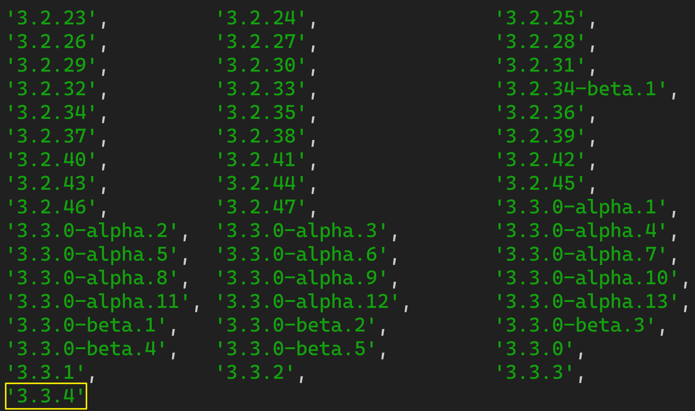

## 1.1.性能的提升
1.打包大小减少`41%`

2.初次渲染快`55%`, 更新渲染快`133%`

3.内存减少`54%`

## 1.2.源码的升级
1.使用 `Proxy` 代替 `defineProperty` 实现响应式

2.重写虚拟 `DOM` 的实现和 `Tree-Shaking`

## 1.3.拥抱 TypeScript
`Vue3` 可以更好的支持 `TypeScript`

## 1.4.新的特性
1.`Composition API`（组合`API`）：

+ `setup`
+ `ref` 与 `reactive`
+ `computed` 与 `watch`...

2.新的内置组件：

+ `Fragment`
+ `Teleport`
+ `Suspense`...

3.其他改变：

+ 新的生命周期钩子
+ `data` 选项应始终被声明为一个函数
+ 移除 `keyCode` 支持作为 ` v-on`  的修饰符...

# 2.创建 Vue3 工程
## 2.1.基于 vue-cli 创建
> 官方文档：[https://cli.vuejs.org/zh/guide/creating-a-project.html#vue-create](https://cli.vuejs.org/zh/guide/creating-a-project.html#vue-create)
>
> 备注：目前`vue-cli`已处于维护模式，官方推荐基于 `Vite` 创建项目
>

```shell
## 查看@vue/cli版本，确保@vue/cli版本在4.5.0以上
vue --version

## 安装或者升级你的@vue/cli 
npm install -g @vue/cli

## 执行创建命令
vue create vue_test

##  随后选择3.x
##  Choose a version of Vue.js that you want to start the project with (Use arrow keys)
##  > 3.x
##    2.x

## 启动
cd vue_test
npm run serve
```

---

## 2.2.基于 vite 创建 (推荐)
1.`vite` 是新一代前端构建工具，官网地址：[https://vitejs.cn](https://vitejs.cn/)

2.`vite` 的优势如下：

+ 轻量快速的热重载（`HMR`），能实现极速的服务启动
+ 对 `TypeScript`、`JSX`、`CSS` 等支持开箱即用
+ 真正的按需编译，不再等待整个应用编译完成

3.`webpack`构建 与 `vite` 构建对比图如下：  
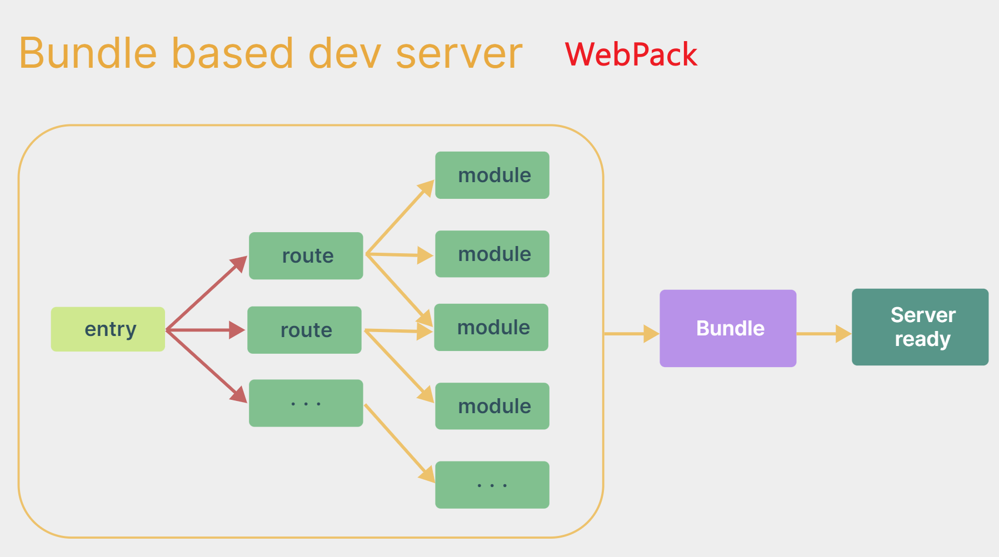

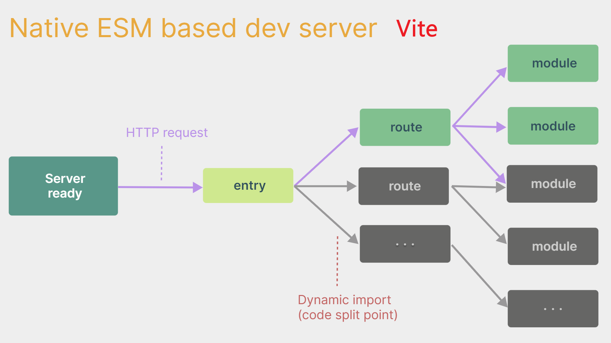

4.具体操作如下

> 官方文档：[https://cn.vuejs.org/guide/quick-start.html#creating-a-vue-application](https://cn.vuejs.org/guide/quick-start.html#creating-a-vue-application)
>

（1）创建工程

```shell
npm create vue@latest
```

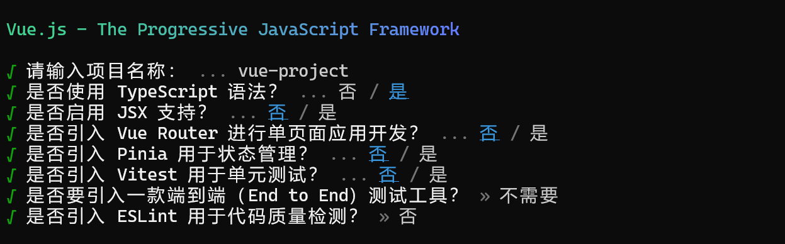

（2）安装官方推荐的`vscode`插件：

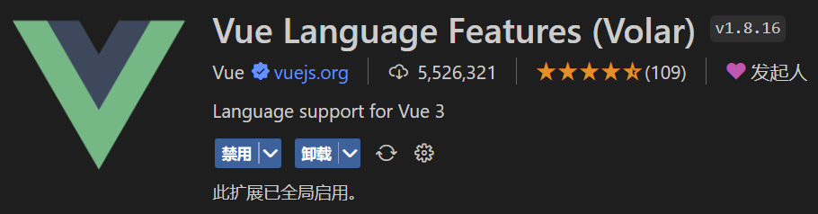

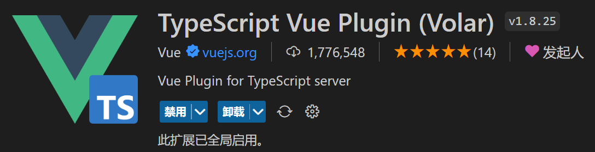

（3）下载依赖

```shell
npm i
```

（4）启动项目

```shell
npm run dev
```

> 总结：
>
> + `Vite` 项目中，`index.html` 是项目的入口文件，在项目最外层
> + 加载 `index.html` 后，`Vite` 解析 `<script type="module" src="xxx">` 指向的`JavaScript`
> + `Vue3` 中是通过 `createApp` 函数创建一个应用实例
>

## 2.3.一个简单的效果
`Vue3` 向下兼容 `Vue2` 语法，且 `Vue3` 中的模板中可以没有根标签

```vue
<template>
  <div class="person">
    <h2>姓名：{{name}}</h2>

    <h2>年龄：{{age}}</h2>

    <button @click="changeName">修改名字</button>

    <button @click="changeAge">年龄+1</button>

    <button @click="showTel">点我查看联系方式</button>

  </div>

</template>

<script lang="ts">
  export default {
    name:'App',
    data() {
      return {
        name:'张三',
        age:18,
        tel:'13888888888'
      }
    },
    methods:{
      changeName(){
        this.name = 'zhang-san'
      },
      changeAge(){
        this.age += 1
      },
      showTel(){
        alert(this.tel)
      }
    },
  }
</script>

```


# 3.Vue3核心语法
## 3.1.OptionsAPI 与 CompositionAPI
> `Vue2` 的 `API` 设计是 `Options`（配置）风格的
>
> `Vue3` 的 `API` 设计是 `Composition`（组合）风格的
>

### （1）Options API 的弊端
`Options` 类型的 `API`，数据、方法、计算属性等，是分散在：`data`、`methods`、`computed`中的，若想新增或者修改一个需求，就需要分别修改：`data`、`methods`、`computed`，不便于维护和复用

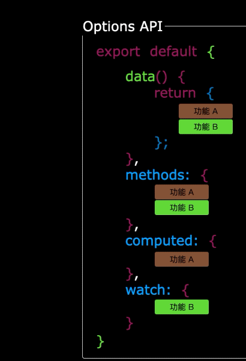

### （2）Composition API 的优势
可以用函数的方式，更加优雅的组织代码，让相关功能的代码更加有序的组织在一起

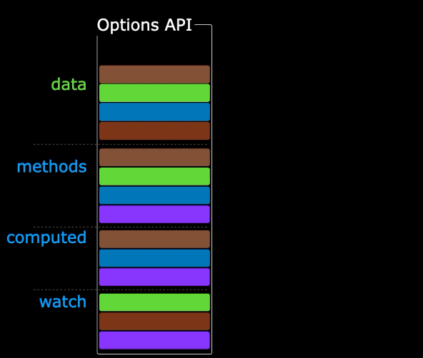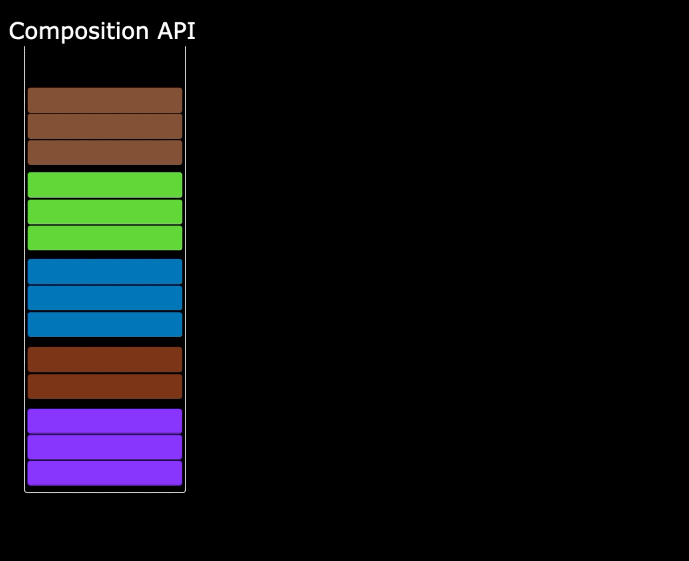

## 3.2.setup
### （1）setup 概述
1.`setup` 是 `Vue3` 中一个新的配置项，值是一个函数，它是 `Composition API`  “表演的舞台” ，组件中所用到的：数据、方法、计算属性、监视......等等，均配置在`setup`中。

2.特点如下：

+ `setup` 函数返回的对象中的内容，可直接在模板中使用
+ `setup` 中访问 `this` 是 `undefined`
+ `setup` 函数会在 `beforeCreate` 之前调用，它是“领先”所有钩子执行的

3.代码示例：

```vue
<template>
  <div class="person">
    <h2>姓名：{{name}}</h2>

    <h2>年龄：{{age}}</h2>

    <button @click="changeName">修改名字</button>

    <button @click="changeAge">年龄+1</button>

    <button @click="showTel">点我查看联系方式</button>

  </div>

</template>

<script lang="ts">
  export default {
    name:'Person',
    setup(){
      // 数据，原来写在data中（注意：此时的name、age、tel数据都不是响应式数据）
      let name = '张三'
      let age = 18
      let tel = '13888888888'

      // 方法，原来写在methods中
      function changeName(){
        name = 'zhang-san' //注意：此时这么修改name页面是不变化的
        console.log(name)
      }
      function changeAge(){
        age += 1 //注意：此时这么修改age页面是不变化的
        console.log(age)
      }
      function showTel(){
        alert(tel)
      }

      // 返回一个对象，对象中的内容，模板中可以直接使用
      return {name,age,tel,changeName,changeAge,showTel}
    }
  }
</script>

```

### （2）setup 的返回值
1.若返回一个对象：则对象中的：属性、方法等，在模板中均可以直接使用（重点关注）

2.若返回一个函数：则可以自定义渲染内容，代码如下：

```tsx
setup(){
  return () => '你好啊！'
}
```

### （3）setup 与 Options API 的关系
1.`Vue2` 的配置（`data`、`methos`...）中可以访问到  `setup` 中的属性、方法

2.但在 `setup` 中不能访问到 `Vue2` 的配置（`data`、`methos`..）

3.如果与 `Vue2` 冲突，则 `setup` 优先

### （4）setup 语法糖
1.`setup` 函数有一个语法糖，这个语法糖，可以让我们把 `setup` 独立出去，代码如下：

```vue
<template>
  <div class="person">
    <h2>姓名：{{name}}</h2>

    <h2>年龄：{{age}}</h2>

    <button @click="changName">修改名字</button>

    <button @click="changAge">年龄+1</button>

    <button @click="showTel">点我查看联系方式</button>

  </div>

</template>

<script lang="ts">
  export default {
    name:'Person',
  }
</script>

<!-- 下面的写法是setup语法糖 -->
<script setup lang="ts">
  console.log(this) //undefined

  // 数据（注意：此时的name、age、tel都不是响应式数据）
  let name = '张三'
  let age = 18
  let tel = '13888888888'

  // 方法
  function changName(){
    name = '李四'//注意：此时这么修改name页面是不变化的
  }
  function changAge(){
    console.log(age)
    age += 1 //注意：此时这么修改age页面是不变化的
  }
  function showTel(){
    alert(tel)
  }
</script>

```

2.上述代码，还需要编写一个不写 `setup` 的 `script` 标签来指定组件名字，比较麻烦，我们可以借助 `vite` 中的插件简化

（1）下载插件

```shell
npm i vite-plugin-vue-setup-extend -D
```

（2）配置 `vite.config.ts`

```tsx
...
import VueSetupExtend from 'vite-plugin-vue-setup-extend'

export default defineConfig({
  plugins: [ 
    ...
    VueSetupExtend() 
  ]
})
```

（3）删除不要的 srcipt 标签，指定组件名称

```vue
<template>
  ...
</template>

<!--
<script lang="ts">
export default {
name:'Person',
}
</script>

-->

<script setup lang="ts" name="Person">
  ...
</script>

```

## 3.3.ref 基本类型响应式数据
1.作用：定义响应式变量

2.语法：`let xxx = ref(初始值)`

3.返回值：一个 `RefImpl` 的实例对象，简称 `ref对象` 或 `ref` ，`ref` 对象的 `value` 属性是响应式的

4.注意点：

+ 使用 `ref` 必须先引入  `import {ref} from 'vue'`
+ `JS` 中操作数据需要：`xxx.value`，但模板中不需要`.value`，直接使用 `{{xxx}}` 即可
+ 对于 `let name = ref('张三')` 来说，`name` 不是响应式的，`name.value` 是响应式的

5.代码示例：

```vue
<template>
  <div class="person">
    <h2>姓名：{{name}}</h2>

    <h2>年龄：{{age}}</h2>

    <button @click="changeName">修改名字</button>

    <button @click="changeAge">年龄+1</button>

    <button @click="showTel">点我查看联系方式</button>

  </div>

</template>

<script setup lang="ts" name="Person">
  import {ref} from 'vue'
  // name和age是一个RefImpl的实例对象，简称ref对象，它们的value属性是响应式的。
  let name = ref('张三')
  let age = ref(18)
  // tel就是一个普通的字符串，不是响应式的
  let tel = '13888888888'

  function changeName(){
    // JS中操作ref对象时候需要.value
    name.value = '李四'
    console.log(name.value)

    // 注意：name不是响应式的，name.value是响应式的，所以如下代码并不会引起页面的更新。
    // name = ref('zhang-san')
  }
  function changeAge(){
    // JS中操作ref对象时候需要.value
    age.value += 1 
    console.log(age.value)
  }
  function showTel(){
    alert(tel)
  }
</script>

```

## 3.4.reactive 对象类型响应式数据
1.作用：定义一个响应式对象（基本类型不要用它，要用 `ref`，否则报错）

2.语法：`let 响应式对象= reactive(源对象)`

3.返回值：一个 `Proxy` 的实例对象，简称：响应式对象

4.注意点：

+ 使用 `reactive` 必须先引入  `import { reactive } from 'vue`
+ `reactive` 定义的响应式数据是“深层次”的

5.代码示例：

```vue
<template>
  <div class="person">
    <h2>汽车信息：一台{{ car.brand }}汽车，价值{{ car.price }}万</h2>

    <h2>游戏列表：</h2>

    <ul>
      <li v-for="g in games" :key="g.id">{{ g.name }}</li>

    </ul>

    <h2>测试：{{obj.a.b.c.d}}</h2>

    <button @click="changeCarPrice">修改汽车价格</button>

    <button @click="changeFirstGame">修改第一游戏</button>

    <button @click="test">测试</button>

  </div>

</template>

<script lang="ts" setup name="Person">
  import { reactive } from 'vue'

  // 数据
  let car = reactive({ brand: '奔驰', price: 100 })
  let games = reactive([
    { id: 'ahsgdyfa01', name: '英雄联盟' },
    { id: 'ahsgdyfa02', name: '王者荣耀' },
    { id: 'ahsgdyfa03', name: '原神' }
  ])
  let obj = reactive({
    a:{
      b:{
        c:{
          d:666
        }
      }
    }
  })

  function changeCarPrice() {
    car.price += 10
  }
  function changeFirstGame() {
    games[0].name = '流星蝴蝶剑'
  }
  function test(){
    obj.a.b.c.d = 999
  }
</script>

```

## 3.5.ref 对象类型响应式数据
1.其实 `ref` 接收的数据可以是：基本类型、对象类型

2.若 `ref` 接收的是对象类型，内部其实也是调用了 `reactive` 函数

3.代码示例：

```vue
<template>
  <div class="person">
    <h2>汽车信息：一台{{ car.brand }}汽车，价值{{ car.price }}万</h2>

    <h2>游戏列表：</h2>

    <ul>
      <li v-for="g in games" :key="g.id">{{ g.name }}</li>

    </ul>

    <h2>测试：{{obj.a.b.c.d}}</h2>

    <button @click="changeCarPrice">修改汽车价格</button>

    <button @click="changeFirstGame">修改第一游戏</button>

    <button @click="test">测试</button>

  </div>

</template>

<script lang="ts" setup name="Person">
  import { ref } from 'vue'

  // 数据
  let car = ref({ brand: '奔驰', price: 100 })
  let games = ref([
    { id: 'ahsgdyfa01', name: '英雄联盟' },
    { id: 'ahsgdyfa02', name: '王者荣耀' },
    { id: 'ahsgdyfa03', name: '原神' }
  ])
  let obj = ref({
    a:{
      b:{
        c:{
          d:666
        }
      }
    }
  })

  console.log(car)

  function changeCarPrice() {
    car.value.price += 10
  }
  function changeFirstGame() {
    games.value[0].name = '流星蝴蝶剑'
  }
  function test(){
    obj.value.a.b.c.d = 999
  }
</script>

```

## 3.6.ref vs reactive
1.宏观角度看：

+ `ref` 用来定义：基本类型数据、对象类型数据
+ `reactive` 用来定义：对象类型数据

2.区别：

+ `ref` 创建的变量必须使用 `.value`（可以使用 `volar` 插件自动添加 `.value`）
+ `reactive` 重新分配一个新对象，会失去响应式（可以使用 `Object.assign` 去整体替换）


3.使用原则：

+ 若需要一个基本类型的响应式数据，必须使用 `ref`
+ 若需要一个响应式对象，层级不深，`ref`、`reactive` 都可以
+ 若需要一个响应式对象，且层级较深，推荐使用 `reactive`

## 3.7.toRefs 与 toRef
1.作用：将一个响应式对象中的每一个属性，转换为 `ref` 对象

2.备注：

+ `toRefs` 与 `toRef` 功能一致，但`toRefs`可以批量转换
+ `toRefs` 与 `toRef` 使用时都必须先引入 `import {toRefs,toRef} from 'vue'`

3.代码示例：

```vue
<template>
  <div class="person">
    <h2>姓名：{{person.name}}</h2>

    <h2>年龄：{{person.age}}</h2>

    <h2>性别：{{person.gender}}</h2>

    <button @click="changeName">修改名字</button>

    <button @click="changeAge">修改年龄</button>

    <button @click="changeGender">修改性别</button>

  </div>

</template>

<script lang="ts" setup name="Person">
  import {ref,reactive,toRefs,toRef} from 'vue'

  // 数据
  let person = reactive({name:'张三', age:18, gender:'男'})

  // 通过toRefs将person对象中的n个属性批量取出，且依然保持响应式的能力
  let {name,gender} =  toRefs(person)

  // 通过toRef将person对象中的gender属性取出，且依然保持响应式的能力
  let age = toRef(person,'age')

  // 方法
  function changeName(){
    name.value += '~'
  }
  function changeAge(){
    age.value += 1
  }
  function changeGender(){
    gender.value = '女'
  }
</script>

```

## 3.8.计算属性 (computed)
1.作用：根据已有数据计算出新数据（和 `Vue2` 中的 `computed` 作用一致）

2.注意：使用 `computed` 必须先引入 `import {computed} from 'vue'`

3.代码示例：

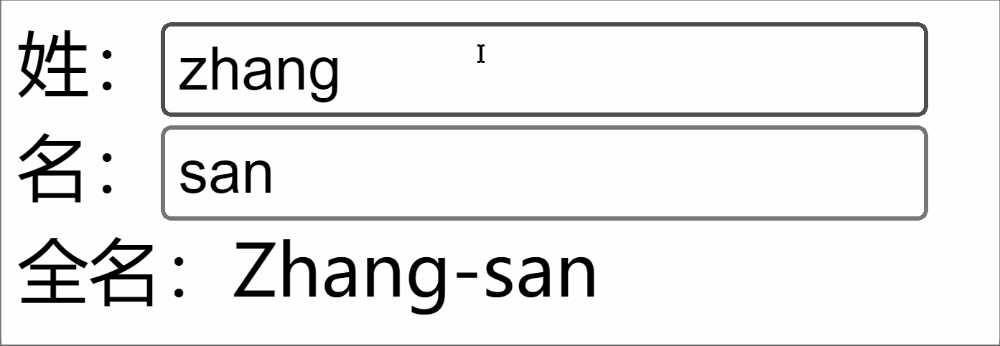

```vue
<template>
  <div class="person">
    姓：<input type="text" v-model="firstName"> <br>
      名：<input type="text" v-model="lastName"> <br>
        全名：<span>{{fullName}}</span> <br>
          <button @click="changeFullName">全名改为：li-si</button>

        </div>

</template>

<script setup lang="ts" name="App">
  import {ref,computed} from 'vue'

  let firstName = ref('zhang')
  let lastName = ref('san')

  // 计算属性——只读取，不修改
  /* let fullName = computed(()=>{
    return firstName.value + '-' + lastName.value
  }) */


  // 计算属性——既读取又修改
  let fullName = computed({
    // 读取
    get(){
      return firstName.value + '-' + lastName.value
    },
    // 修改
    set(val){
      console.log('有人修改了fullName',val)
      firstName.value = val.split('-')[0]
      lastName.value = val.split('-')[1]
    }
  })

  function changeFullName(){
    fullName.value = 'li-si'
  } 
</script>

```

## 3.9.监视属性 (watch)
1.作用：监视数据的变化（和 `Vue2` 中的 `watch` 作用一致）

2.`Vue3` 中的 `watch` 只能监视以下四种数据：

+ `ref` 定义的数据
+ `reactive` 定义的数据
+ 函数返回一个值（`getter` 函数）
+ 一个包含上述内容的数组

3.我们在`Vue3` 中使用 `watch` 的时候，通常会遇到以下几种情况：

### （1）监视 ref 基本类型
监视 `ref` 定义的【基本类型】数据：直接写数据名即可，监视的是其 `value` 值的改变。

```vue
<template>
  <div class="person">
    <h1>情况一：监视【ref】定义的【基本类型】数据</h1>

    <h2>当前求和为：{{sum}}</h2>

    <button @click="changeSum">点我sum+1</button>

  </div>

</template>

<script lang="ts" setup name="Person">
  import {ref,watch} from 'vue'
  // 数据
  let sum = ref(0)
  // 方法
  function changeSum(){
    sum.value += 1
  }
  // 监视，情况一：监视【ref】定义的【基本类型】数据
  const stopWatch = watch(sum,(newValue,oldValue)=>{
    console.log('sum变化了',newValue,oldValue)
    if(newValue >= 10){
      stopWatch()
    }
  })
</script>

```

### （2）监视 ref 对象类型
1.监视 `ref` 定义的【对象类型】数据：直接写数据名，监视的是对象的【地址值】，若想监视对象内部的数据，要手动开启深度监视

2.注意：

+ 若修改的是 `ref` 定义的对象中的属性，`newValue`  和  `oldValue`  都是新值，因为它们是同一个对象
+ 若修改整个 `ref` 定义的对象，`newValue`  是新值， `oldValue`  是旧值，因为不是同一个对象了

3.代码示例：

```vue
<template>
  <div class="person">
    <h1>情况二：监视【ref】定义的【对象类型】数据</h1>

    <h2>姓名：{{ person.name }}</h2>

    <h2>年龄：{{ person.age }}</h2>

    <button @click="changeName">修改名字</button>

    <button @click="changeAge">修改年龄</button>

    <button @click="changePerson">修改整个人</button>

  </div>

</template>

<script lang="ts" setup name="Person">
  import {ref,watch} from 'vue'
  // 数据
  let person = ref({
    name:'张三',
    age:18
  })
  // 方法
  function changeName(){
    person.value.name += '~'
  }
  function changeAge(){
    person.value.age += 1
  }
  function changePerson(){
    person.value = {name:'李四',age:90}
  }
  /* 
    监视，情况一：监视【ref】定义的【对象类型】数据，监视的是对象的地址值，若想监视对象内部属性的变化，需要手动开启深度监视
    watch的第一个参数是：被监视的数据
    watch的第二个参数是：监视的回调
    watch的第三个参数是：配置对象（deep、immediate等等.....） 
  */
  watch(person,(newValue,oldValue)=>{
    console.log('person变化了',newValue,oldValue)
  },{deep:true})

</script>

```

### （3）监视 reactive 对象类型
监视 `reactive` 定义的【对象类型】数据，且默认开启了深度监视

```vue
<template>
  <div class="person">
    <h1>情况三：监视【reactive】定义的【对象类型】数据</h1>

    <h2>姓名：{{ person.name }}</h2>

    <h2>年龄：{{ person.age }}</h2>

    <button @click="changeName">修改名字</button>

    <button @click="changeAge">修改年龄</button>

    <button @click="changePerson">修改整个人</button>

    <hr>
      <h2>测试：{{obj.a.b.c}}</h2>

      <button @click="test">修改obj.a.b.c</button>

    </div>

</template>

<script lang="ts" setup name="Person">
  import {reactive,watch} from 'vue'
  // 数据
  let person = reactive({
    name:'张三',
    age:18
  })
  let obj = reactive({
    a:{
      b:{
        c:666
      }
    }
  })
  // 方法
  function changeName(){
    person.name += '~'
  }
  function changeAge(){
    person.age += 1
  }
  function changePerson(){
    Object.assign(person,{name:'李四',age:80})
  }
  function test(){
    obj.a.b.c = 888
  }

  // 监视，情况三：监视【reactive】定义的【对象类型】数据，且默认是开启深度监视的
  watch(person,(newValue,oldValue)=>{
    console.log('person变化了',newValue,oldValue)
  })
  watch(obj,(newValue,oldValue)=>{
    console.log('Obj变化了',newValue,oldValue)
  })
</script>

```

### （4）监视对象类型中的属性
1.监视 `ref` 或 `reactive` 定义的【对象类型】数据中的某个属性，注意点如下：

+ 若该属性值不是【对象类型】，需要写成函数形式
+ 若该属性值依然是【对象类型】，可直接编，也可写成函数（建议写成函数）

2.结论：监视的要是对象里的属性，那么最好写函数式

> 注意点：若是对象监视的是地址值，需要关注对象内部，需要手动开启深度监视
>

3.代码示例：

```vue
<template>
  <div class="person">
    <h1>情况四：监视【ref】或【reactive】定义的【对象类型】数据中的某个属性</h1>

    <h2>姓名：{{ person.name }}</h2>

    <h2>年龄：{{ person.age }}</h2>

    <h2>汽车：{{ person.car.c1 }}、{{ person.car.c2 }}</h2>

    <button @click="changeName">修改名字</button>

    <button @click="changeAge">修改年龄</button>

    <button @click="changeC1">修改第一台车</button>

    <button @click="changeC2">修改第二台车</button>

    <button @click="changeCar">修改整个车</button>

  </div>

</template>

<script lang="ts" setup name="Person">
  import {reactive,watch} from 'vue'

  // 数据
  let person = reactive({
    name:'张三',
    age:18,
    car:{
      c1:'奔驰',
      c2:'宝马'
    }
  })
  // 方法
  function changeName(){
    person.name += '~'
  }
  function changeAge(){
    person.age += 1
  }
  function changeC1(){
    person.car.c1 = '奥迪'
  }
  function changeC2(){
    person.car.c2 = '大众'
  }
  function changeCar(){
    person.car = {c1:'雅迪',c2:'爱玛'}
  }

  // 监视，情况四：监视响应式对象中的某个属性，且该属性是基本类型的，要写成函数式
  watch(()=> person.name,(newValue,oldValue)=>{
    console.log('person.name变化了',newValue,oldValue)
  })

  // 监视，情况四：监视响应式对象中的某个属性，且该属性是对象类型的，可以直接写，也能写函数，更推荐写函数
  watch(()=>person.car,(newValue,oldValue)=>{
    console.log('person.car变化了',newValue,oldValue)
  },{deep:true})
</script>

```

### （5）监视多个数据
监视上述的多个数据

```vue
<template>
  <div class="person">
    <h1>情况五：监视上述的多个数据</h1>

    <h2>姓名：{{ person.name }}</h2>

    <h2>年龄：{{ person.age }}</h2>

    <h2>汽车：{{ person.car.c1 }}、{{ person.car.c2 }}</h2>

    <button @click="changeName">修改名字</button>

    <button @click="changeAge">修改年龄</button>

    <button @click="changeC1">修改第一台车</button>

    <button @click="changeC2">修改第二台车</button>

    <button @click="changeCar">修改整个车</button>

  </div>

</template>

<script lang="ts" setup name="Person">
  import {reactive,watch} from 'vue'

  // 数据
  let person = reactive({
    name:'张三',
    age:18,
    car:{
      c1:'奔驰',
      c2:'宝马'
    }
  })
  // 方法
  function changeName(){
    person.name += '~'
  }
  function changeAge(){
    person.age += 1
  }
  function changeC1(){
    person.car.c1 = '奥迪'
  }
  function changeC2(){
    person.car.c2 = '大众'
  }
  function changeCar(){
    person.car = {c1:'雅迪',c2:'爱玛'}
  }

  // 监视，情况五：监视上述的多个数据
  watch([()=>person.name,person.car],(newValue,oldValue)=>{
    console.log('person.car变化了',newValue,oldValue)
  },{deep:true})

</script>

```

## 3.10.watchEffect
1.官网的定义：立即运行一个函数，同时响应式地追踪其依赖，并在依赖更改时重新执行该函数

2.`watch` 对比 `watchEffect`

+ 都能监听响应式数据的变化，不同的是监听数据变化的方式不同
+ `watch`：要明确指出监视的数据
+ `watchEffect`：不用明确指出监视的数据（函数中用到哪些属性，那就监视哪些属性）

3.示例代码：

```vue
<template>
  <div class="person">
    <h1>需求：水温达到50℃，或水位达到20cm，则联系服务器</h1>

    <h2 id="demo">水温：{{temp}}</h2>

    <h2>水位：{{height}}</h2>

    <button @click="changePrice">水温+1</button>

    <button @click="changeSum">水位+10</button>

  </div>

</template>

<script lang="ts" setup name="Person">
  import {ref,watch,watchEffect} from 'vue'
  // 数据
  let temp = ref(0)
  let height = ref(0)

  // 方法
  function changePrice(){
    temp.value += 10
  }
  function changeSum(){
    height.value += 1
  }

  // 用watch实现，需要明确的指出要监视：temp、height
  watch([temp,height],(value)=>{
    // 从value中获取最新的temp值、height值
    const [newTemp,newHeight] = value
    // 室温达到50℃，或水位达到20cm，立刻联系服务器
    if(newTemp >= 50 || newHeight >= 20){
      console.log('联系服务器')
    }
  })

  // 用watchEffect实现，不用
  const stopWtach = watchEffect(()=>{
    // 室温达到50℃，或水位达到20cm，立刻联系服务器
    if(temp.value >= 50 || height.value >= 20){
      console.log(document.getElementById('demo')?.innerText)
      console.log('联系服务器')
    }
    // 水温达到100，或水位达到50，取消监视
    if(temp.value === 100 || height.value === 50){
      console.log('清理了')
      stopWtach()
    }
  })
</script>

```

## 3.11.标签的 ref 属性
1.作用：用于注册模板引用

+ 用在普通 `DOM` 标签上，获取的是 `DOM` 节点
+ 用在组件标签上，获取的是组件实例对象

2.代码示例1：用在普通`DOM`标签上

```vue
<template>
  <div class="person">
    <h1 ref="title1">北京</h1>

    <h2 ref="title2">上海</h2>

    <h3 ref="title3">深圳</h3>

    <input type="text" ref="inpt"> <br><br>
      <button @click="showLog">点我打印内容</button>

    </div>

</template>

<script lang="ts" setup name="Person">
  import {ref} from 'vue'

  let title1 = ref()
  let title2 = ref()
  let title3 = ref()

  function showLog(){
    // 通过id获取元素
    const t1 = document.getElementById('title1')
    // 打印内容
    console.log((t1 as HTMLElement).innerText)
    console.log((<HTMLElement>t1).innerText)
    console.log(t1?.innerText)

    // 通过ref获取元素
    console.log(title1.value)
    console.log(title2.value)
    console.log(title3.value)
  }
</script>

```

3.代码示例2：用在组件标签上

```vue
<!-- 父组件App.vue -->
<template>
  <Person ref="ren"/>
  <button @click="test">测试</button>

</template>

<script lang="ts" setup name="App">
  import Person from './components/Person.vue'
  import {ref} from 'vue'

  let ren = ref()

  function test(){
    console.log(ren.value.name)
    console.log(ren.value.age)
  }
</script>


<!-- 子组件Person.vue中要使用defineExpose暴露内容 -->
<script lang="ts" setup name="Person">
  import {ref,defineExpose} from 'vue'
  // 数据
  let name = ref('张三')
  let age = ref(18)

  // 使用defineExpose将组件中的数据交给外部
  defineExpose({name,age})
</script>

```

## 3.12.props
`types/index.ts` 中代码：

```tsx
// 定义一个接口，限制每个Person对象的格式
export interface PersonInter {
  id:string,
  name:string,
  age:number
}

// 定义一个自定义类型Persons
export type Persons = Array<PersonInter>
```

`App.vue` 中代码：

```vue
<template>
  <Person :list="persons"/>
</template>

<script lang="ts" setup name="App">
  import Person from './components/Person.vue'
  import {reactive} from 'vue'
  import {type Persons} from './types'

  let persons = reactive<Persons>([
    {id:'e98219e12',name:'张三',age:18},
    {id:'e98219e13',name:'李四',age:19},
    {id:'e98219e14',name:'王五',age:20}
  ])
</script>

```

`Person.vue` 中代码：

```vue
<template>
  <div class="person">
    <ul>
      <li v-for="item in list" :key="item.id">
        {{item.name}}--{{item.age}}
      </li>

    </ul>

  </div>

</template>

<script lang="ts" setup name="Person">
  import {defineProps} from 'vue'
  import {type PersonInter} from '@/types'

  // 第一种写法：仅接收
  // const props = defineProps(['list'])

  // 第二种写法：接收+限制类型
  // defineProps<{list:Persons}>()

  // 第三种写法：接收+限制类型+指定默认值+限制必要性
  let props = withDefaults(defineProps<{list?:Persons}>(),{
    list:()=>[{id:'asdasg01',name:'小猪佩奇',age:18}]
  })
  console.log(props)
</script>

```

## 3.13.生命周期
1.概念：`Vue` 组件实例在创建时要经历一系列的初始化步骤，在此过程中`Vue`会在合适的时机，调用特定的函数，从而让开发者有机会在特定阶段运行自己的代码，这些特定的函数统称为生命周期钩子

2.生命周期整体分为四个阶段，分别是：**创建、挂载、更新、销毁**，每个阶段都有两个钩子，一前一后

3.`Vue2` 的生命周期

+ 创建阶段：`beforeCreate`、`created`
+ 挂载阶段：`beforeMount`、`mounted`
+ 更新阶段：`beforeUpdate`、`updated`
+ 销毁阶段：`beforeDestroy`、`destroyed`

4.`Vue3` 的生命周期

+ 创建阶段：`setup`
+ 挂载阶段：`onBeforeMount`、`onMounted`（常用）
+ 更新阶段：`onBeforeUpdate`、`onUpdated`（常用）
+ 卸载阶段：`onBeforeUnmount`（常用）、`onUnmounted`

5.示例代码：

```vue
<template>
  <div class="person">
    <h2>当前求和为：{{ sum }}</h2>

    <button @click="changeSum">点我sum+1</button>

  </div>

</template>

<!-- vue3写法 -->
<script lang="ts" setup name="Person">
  import { 
    ref, 
    onBeforeMount, 
    onMounted, 
    onBeforeUpdate, 
    onUpdated, 
    onBeforeUnmount, 
    onUnmounted 
  } from 'vue'

  // 数据
  let sum = ref(0)
  // 方法
  function changeSum() {
    sum.value += 1
  }
  console.log('setup')
  // 生命周期钩子
  onBeforeMount(()=>{
    console.log('挂载之前')
  })
  onMounted(()=>{
    console.log('挂载完毕')
  })
  onBeforeUpdate(()=>{
    console.log('更新之前')
  })
  onUpdated(()=>{
    console.log('更新完毕')
  })
  onBeforeUnmount(()=>{
    console.log('卸载之前')
  })
  onUnmounted(()=>{
    console.log('卸载完毕')
  })
</script>

```

## 3.14.自定义 hook
1.什么是 `hook`？—— 本质是一个函数，把 `setup` 函数中使用的 `Composition API` 进行了封装，类似于 `vue2.x` 中的 `mixin`

2.自定义 `hook` 的优势：复用代码, 让 `setup` 中的逻辑更清楚易懂

3.示例代码：

`src/hooks/useSum.ts` 中内容如下：

```vue
import { ref ,onMounted,computed} from 'vue'

  export default function () {
    // 数据
    let sum = ref(0)
    let bigSum = computed(()=>{
      return sum.value * 10
    })

    // 方法
    function add() {
      sum.value += 1
    }

    // 钩子
    onMounted(()=>{
      add()
    })

    // 给外部提供东西
    return {sum,add,bigSum}
  }
```

`src/hooks/useDog.ts` 中内容如下：

```ts
import {reactive,onMounted} from 'vue'
  import axios from 'axios'

  export default function (){
    // 数据
    let dogList = reactive([
      'https://images.dog.ceo/breeds/pembroke/n02113023_4373.jpg'
    ])
    // 方法
    async function getDog(){
      try {
        let result = await axios.get('https://dog.ceo/api/breed/pembroke/images/random')
        dogList.push(result.data.message)
      } catch (error) {
        alert(error)
      }
    }
    // 钩子
    onMounted(()=>{
      getDog()
    })
    // 向外部提供东西
    return {dogList,getDog}
  }
```

`Person.vue` 中内容如下：

```vue
<template>
  <div class="person">
    <h2>当前求和为：{{ sum }}，放大10倍后：{{ bigSum }}</h2>

    <button @click="add">点我sum+1</button>

    <hr>
      
        <br>
          <button @click="getDog">再来一只小狗</button>

        </div>

</template>

<script lang="ts" setup name="Person">
  import useSum from '@/hooks/useSum'
  import useDog from '@/hooks/useDog'

  const {sum,add,bigSum} = useSum()
  const {dogList,getDog} = useDog()
</script>

```

# 4.路由
## 4.1.对路由的理解
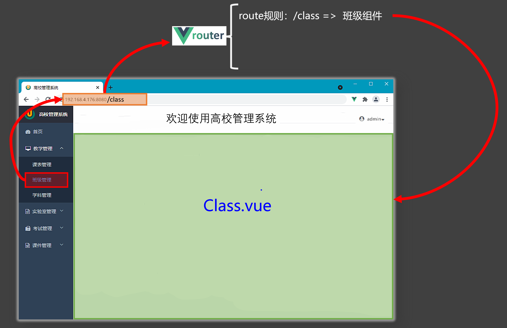

## 4.2.路由的基本使用
1.安装 vue-router，命令：`npm i vue-router`

2.创建文件 `src/router/index.ts`，并编写 router 配置项:

```tsx
// 引入createRouter
import {createRouter,createWebHistory} from 'vue-router'
// 引入一个一个可能要呈现组件
import Home from '@/components/Home.vue'
import News from '@/components/News.vue'
import About from '@/components/About.vue'

// 创建路由器
const router = createRouter({
  history:createWebHistory(), //路由器的工作模式（稍后讲解）
  routes:[ //一个一个的路由规则
    {
      path:'/home',
      component:Home
    },
    {
      path:'/news',
      component:News
    },
    {
      path:'/about',
      component:About
    },
  ]
})

// 暴露出去router
export default router
```

3.在 `main.ts` 引入并应用 router

```tsx
import {createApp} from 'vue'
import App from './App.vue'
// 1.引入路由器
import router from './router'

const app = createApp(App)
// 2.使用路由器
app.use(router)
app.mount('#app')
```

4.在 `App.vue` 实现切换并指定展示

```vue
<template>
  <div class="app">
    <h2 class="title">Vue路由测试</h2>

    <div class="navigate">
      <!-- 2.实现切换 -->
      <RouterLink to="/home" active-class="active">首页</RouterLink>

      <RouterLink to="/news" active-class="active">新闻</RouterLink>

      <RouterLink to="/about" active-class="active">关于</RouterLink>

    </div>


    <div class="main-content">
      <!-- 3.指定展示 -->
      <RouterView></RouterView>

    </div>

  </div>

</template>

<script lang="ts" setup name="App">
  // 1.引入
  import {RouterLink,RouterView} from 'vue-router'  
</script>

```

## 4.3.两个注意点
1.路由组件通常存放在 `pages`  或  `views` 文件夹，一般组件通常存放在 `components` 文件夹

2.通过点击导航，视觉效果上“消失” 了的路由组件，默认是被 **卸载** 掉的，需要的时候再去 **挂载**

## 4.4.路由器工作模式
1.`history`模式

+ 优点：`URL` 更加美观，不带有 `#`，更接近传统的网站 `URL`
+ 缺点：后期项目上线，需要服务端配合处理路径问题，否则刷新会有 `404` 错误

```tsx
const router = createRouter({
  history:createWebHistory(), //history模式
})
```

2.`hash`模式

+ 优点：兼容性更好，因为不需要服务器端处理路径。
+ 缺点：`URL` 带有 `#` 不太美观，且在 `SEO` 优化方面相对较差。

```tsx
const router = createRouter({
  history:createWebHashHistory(), //hash模式
})
```

## 4.5.to的两种写法
1.to 的字符串写法

```vue
<router-link active-class="active" to="/home">主页</router-link>
```

2.to 的对象写法

```vue
<router-link active-class="active" :to="{path:'/home'}">Home</router-link>
```

## 4.6.命名路由
1.作用：可以简化路由跳转及传参

2.代码示例：

（1）给路由规则命名：

```tsx
routes:[
  {
    name:'zhuye',
    path:'/home',
    component:Home
  },
  {
    name:'xinwen',
    path:'/news',
    component:News,
  },
  {
    name:'guanyu',
    path:'/about',
    component:About
  }
]
```

（2）跳转路由：

```vue
<!--简化前：需要写完整的路径（to的字符串写法） -->
<router-link to="/news/detail">跳转</router-link>

<!--简化后：直接通过名字跳转（to的对象写法配合name属性） -->
<router-link :to="{name:'guanyu'}">跳转</router-link>

```

## 4.7.嵌套路由
1.使用 `children` 配置项

```tsx
const router = createRouter({
  history:createWebHistory(),
  routes:[
    {
      name:'xinwen',
      path:'/news',
      component:News,
      children:[ // 使用 children 配置项
        {
          name:'xiang',
          path:'detail',
          component:Detail
        }
      ]
    },
    ...
  ]
})
export default router
```

2.跳转路由（记得要加完整路径）

```vue
<router-link to="/news/detail">xxxx</router-link>
```

3.指定展示位置

```vue
<RouterView></RouterView>
```

## 4.8.路由传参
### （1）query 参数
1.传递参数

```vue
<!-- 跳转并携带query参数（to的字符串写法） -->
<RouterLink :to="`/news/detail?id=${news.id}&title=${news.title}&content=${news.content}`">
                                                                                             {{news.title}}
</RouterLink>


  <!-- 跳转并携带query参数（to的对象写法） -->
  <RouterLink 
  :to="{
  //name:'xiang', //用name也可以跳转
  path:'/news/detail',
    query:{
    id:news.id,
      title:news.title,
      content:news.content
  }
  }"
    >
    {{news.title}}
</RouterLink>

```

2.接收参数：

```vue
import {toRefs} from 'vue'
  import {useRoute} from 'vue-router'
  let route = useRoute()
  let {query} = toRefs(route)
  console.log(query.id)
  console.log(query.title)
  console.log(query.content)
```

### （2）params 参数
1.在 `src/router/index.ts` 中占位

```tsx
const router = createRouter({
  history:createWebHistory(),
  routes:[
    {
      name:'xinwen',
      path:'/news',
      component:News,
      children:[ 
        {
          name:'xiang',
          path:'detail/:id/:title/:content?',// ？表示可选项
          component:Detail
        }
      ]
    },
    ...
  ]
})
export default router
```

2.传递参数

```vue
<!-- 跳转并携带params参数（to的字符串写法） -->
<RouterLink :to="`/news/detail/001/新闻001/内容001`">{{news.title}}</RouterLink>


  <!-- 跳转并携带params参数（to的对象写法） -->
  <RouterLink 
  :to="{
    name:'xiang', 
    params:{
    id:news.id,
      title:news.title,
      content:news.content
  }
  }"
    >
    {{news.title}}
</RouterLink>

```

3.接收参数

```vue
import {useRoute} from 'vue-router'
  const route = useRoute()
  let {params} = toRefs(route)
  console.log(params.id)
  console.log(params.title)
  console.log(params.content)
```

> 备注1：传递 `params` 参数时，若使用 `to` 的对象写法，必须使用 `name` 配置项，不能用 `path`
>
> 备注2：传递 `params` 参数时，需要提前在规则中占位
>

## 4.9.路由的props配置
1.作用：让路由组件更方便的收到参数（可以将路由参数作为 `props` 传给组件）

2.基本使用：

（1）配置 `src/router/index.ts` 的 `props` 选项

```tsx
{
  name:'xinwen',
    path:'/news',
    component:News,
    children:[
    {
      name:'xiang',
      path:'detail',
      component:Detail,

      // 第一种写法：将路由收到的所有params参数作为props传给路由组件
      // props:true,

      // 第二种写法：函数写法，可以自己决定将什么作为props给路由组件
      props(route){
        return route.query
      }

      // 第三种写法：对象写法，可以自己决定将什么作为props给路由组件
      /* props:{
            a:100,
            b:200,
            c:300
          } */
    }
  ]
}
```

（2）接收并使用数据

```vue
<template>
  <ul class="news-list">
    <!-- 2.使用数据 -->
    <li>编号：{{id}}</li>

    <li>标题：{{title}}</li>

    <li>内容：{{content}}</li>

  </ul>

</template>

<script setup lang="ts" name="About">
  // 1.接收数据
  defineProps(['id','title','content'])
</script>

```

## 4.10.replace属性
1.作用：控制路由跳转时操作浏览器历史记录的模式

2.浏览器的历史记录有两种写入方式：分别为 `push` 和 `replace`

+ `push` 是追加历史记录（默认值）
+ `replace` 是替换当前记录

3.开启 `replace` 模式：

```vue
<RouterLink replace>News</RouterLink>
```

## 4.11.编程式路由导航
> vue2 中路由组件的两个重要的属性 `$route` 和 `$router` 变成了两个 `hooks`
>

1.作用：不借助`RouterLink `，而是通过编码实现路由跳转，让路由跳转更加灵活

2.基本使用

```tsx
import {useRouter} from 'vue-router'

const router = useRouter()

function showNewsDetail(news){
  // 路由跳转时以 replace 模式保存浏览器历史记录
  router.replace({
    name:'xiang',
    query:{
      id:news.id,
      title:news.title,
      content:news.content
    }
  })
}

function showNewsDetail2(news){
  // 路由跳转时以 push 模式保存浏览器历史记录
  router.push({
    name:'xiang',
    params:{
      id:news.id,
      title:news.title,
      content:news.content
    }
  })
}
```

## 4.12.重定向
1.作用：将特定的路径，重新定向到已有路由

2.在 `src/router/index.ts` 配置

```tsx
{
  path:'/',
    redirect:'/home'
}
```

# 5.pinia
## 5.1.pinia 是什么
> vue2 使用 vuex，而 vue3 中使用 pinia
>

1.pinia 是在 Vue 中实现集中式状态（数据）管理的一个 Vue `插件`

 2.pinia 可以对 vue 应用中多个组件的`共享状态（数据`）进行集中式的管理（读/写）

 3.pinia 是一种组件间通信的方式，且适用于`任意组件间通信`

4.何时使用 pinia? ——多个组件需要共享数据时

## 5.2.准备一个效果
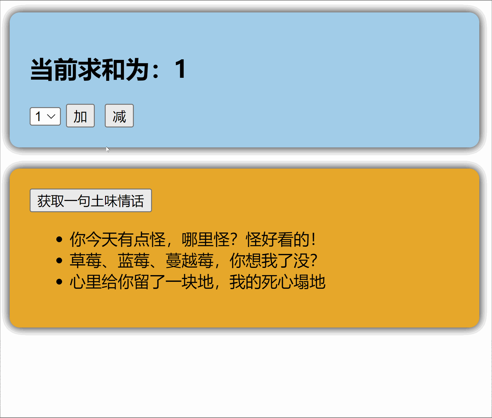

## 5.2.搭建 pinia 环境
1.下载 pinia

```powershell
npm install pinia
```

2.在 `src/main.ts` 配置 pinia

```powershell
import {createApp} from 'vue'
import App from './App.vue'
// 1.引入pinia
import {createPinia} from 'pinia'
const app = createApp(App)
// 2.创建pinia
const pinia = createPinia()
// 3.使用pinia
app.use(pinia)
app.mount('#app')
```

3.此时开发者工具中已经有了`pinia`选项

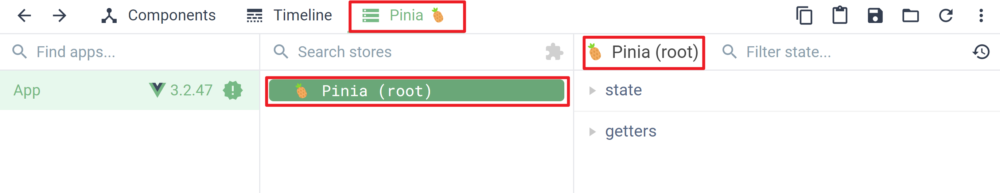

## 5.3.存储+读取数据
1.`Store` 是一个保存：状态、业务逻辑的实体，每个组件都可以读取、写入它

2.它有三个概念：`state`、`getter`、`action`，相当于组件中的 `data`、 `computed` 和 `methods`

3.代码示例：

`src/store/count.ts`

```tsx
import {defineStore} from 'pinia'

export const useCountStore = defineStore('count',{
  actions:{},

  // 1.初始化数据    
  state(){
    return {
      sum:6
    }
  },

  getters:{}
})
```

`Count.vue`

```vue
<template>
  <!-- 4.使用数据 -->
  <h2>当前求和为：{{ sumStore.sum }}</h2>

</template>

<script setup lang="ts" name="Count">
  // 2.引入
  import {useSumStore} from '@/store/sum'

  // 3.调用
  const sumStore = useSumStore()
</script>

```

## 5.4.修改数据
1.第一种修改方式，直接修改

```tsx
countStore.sum = 666
```

2.第二种修改方式：批量修改

```tsx
countStore.$patch({
  sum:999,
  school:'jialidun'
})
```

3.第三种修改方式：借助`action`修改（`action`中可以编写一些业务逻辑）

（1）在 `src/store/count.ts` 配置 action

```tsx
import { defineStore } from 'pinia'

export const useCountStore = defineStore('count', {
  actions: {
    increment(value) {
      if (this.sum < 10) {
        this.sum += value
      }
    },
  })
```

（2）组件中调用 `action` 即可

```tsx
const countStore = useCountStore()
countStore.incrementOdd(n.value)
```

## 5.5.storeToRefs
1.借助 `storeToRefs` 将 `store` 中的数据转为 `ref` 对象，方便在模板中使用

2.注意：`pinia` 提供的 `storeToRefs` 只会将数据做转换，而 `Vue` 的 `toRefs` 会转换 `store` 中数据

3.代码示例：

```vue
<template>
  <div class="count">
    <!-- 3.使用数据 -->
    <h2>当前求和为：{{sum}}</h2>

  </div>

</template>

<script setup lang="ts" name="Count">
  import { useCountStore } from '@/store/count'
  // 1.引入
  import { storeToRefs } from 'pinia'
  const countStore = useCountStore()
  // 2.解构
  const {sum} = storeToRefs(countStore)
</script>

```

## 5.6.getters
1.概念：当 `state` 中的数据，需要经过处理后再使用时，可以使用 `getters` 配置

2.代码示例：

（1）在 `src/store/count.ts` 配置 getters

```tsx
import {defineStore} from 'pinia'

export const useCountStore = defineStore('count',{
  state(){
    return {
      sum:1,
    }
  },
  // 1.配置 getters
  getters:{
    bigSum(state){
      return state.sum *10
    }  
  }
})
```

（2）组件中读取数据：

```tsx
let {bigSum} = storeToRefs(countStore)
```

## 5.7.$subscribe
通过 store 的 `$subscribe()` 方法侦听 `state` 及其变化

```tsx
talkStore.$subscribe((mutate,state)=>{
  console.log('LoveTalk',mutate,state)
  localStorage.setItem('talk',JSON.stringify(state.talkList))
})
```

## 5.8.store 组合式写法
```vue
import {defineStore} from 'pinia'
  import axios from 'axios'
  import {nanoid} from 'nanoid'
  import {reactive} from 'vue'

  export const useTalkStore = defineStore('talk',()=>{
    // talkList就是state
    const talkList = reactive(
      JSON.parse(localStorage.getItem('talkList') as string) || []
    )

    // getATalk函数相当于action
    async function getATalk(){
      let {data:{content:title}} = await axios.get('https://api.uomg.com/api/rand.qinghua?format=json')
      let obj = {id:nanoid(),title}
      talkList.unshift(obj)
    }

    return {talkList,getATalk}
  })
```

# 6.组件通信
1.`Vue3` 组件通信和 `Vue2` 的区别：

+ 移出事件总线，使用 `mitt` 代替
+ `vuex` 换成了 `pinia`
+ 把 `.sync` 优化到了 `v-model` 里面了
+ 把 `$listeners` 所有的东西，合并到 `$attrs` 中了
+ `$children` 被砍掉了

2.常见搭配形式：

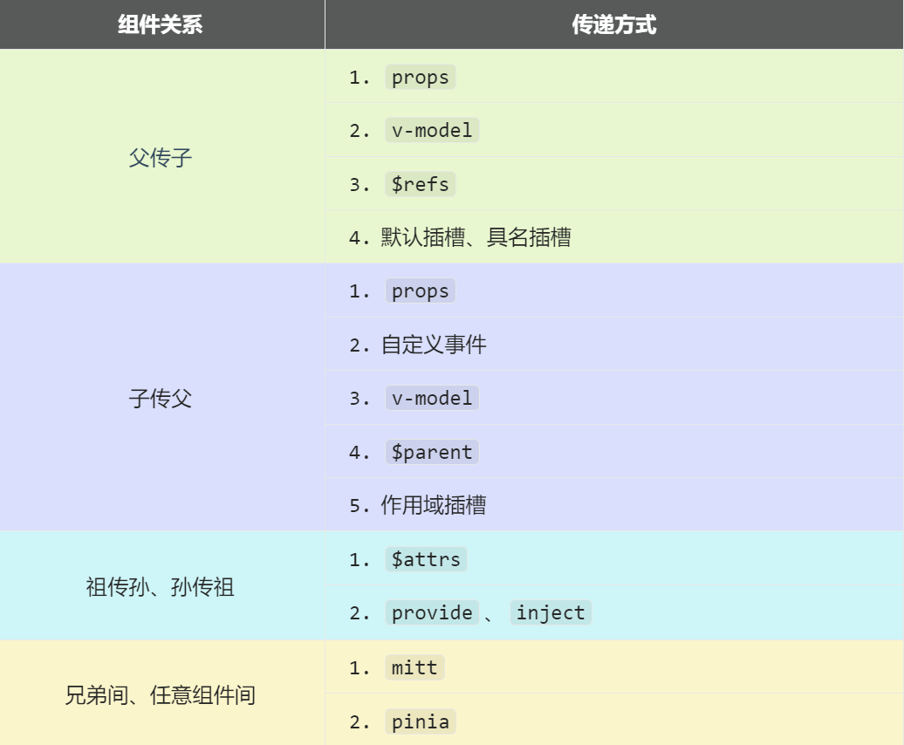

## 6.1.props
1.概述：`props` 是使用频率最高的一种通信方式，常用于 父 ↔↔ 子

+ 若父传子：属性值是非函数
+ 若子传父：属性值是函数

2.代码示例1：父传子

父组件：

```vue
<template>
  <div class="father">
    <!-- 2.传递数据 -->
    <Child :car="car"/>
  </div>

</template>

<script setup lang="ts" name="Father">
  import Child from './Child.vue'
  import { ref } from "vue";
  // 1.准备数据
  const car = ref('奔驰')
</script>

```

子组件：

```vue
<template>
  <div class="child">
    <!-- 4.使用数据 -->
    <h4>父给我的车：{{ car }}</h4>

  </div>

</template>

<script setup lang="ts" name="Child">
  // 3.接收数据
  defineProps(['car'])
</script>

```

3.代码示例2：子传父

父组件：

```vue
<template>
  <div class="father">
    <!-- 7.使用数据 -->
    <h4>儿子给的玩具：{{ toy }}</h4>

    <!-- 2.将方法传递给儿子 -->
    <Child :getToy="getToy"/>
  </div>

</template>

<script setup lang="ts" name="Father">
  import Child from './Child.vue'
  import { ref } from "vue";
  // 6.接收数据
  const toy = ref()
  // 1.准备一个方法
  function getToy(value){
    toy.value = value
  }
</script>

```

子组件

```vue
<template>
  <div class="child">
    <!-- 5.调用方法并传递数据 -->
    <button @click="getToy(toy)">玩具给父亲</button>

  </div>

</template>

<script setup lang="ts" name="Child">
  import { ref } from "vue";
  // 4.准备数据
  const toy = ref('奥特曼')
  // 3.接收方法
  defineProps(['getToy'])
</script>

```

## 6.2.自定义事件
1.概述：自定义事件常用于： 子 => 父 

2.注意区分好：原生事件、自定义事件

+ 原生事件：
    - 事件名是特定的（`click`、`mosueenter` 等等）	
    - 事件对象 `$event` : 是包含事件相关信息的对象（`pageX`、`pageY`、`target`、`keyCode`）
+ 自定义事件：
    - 事件名是任意名称
    - 事件对象 `$event` : 是调用 `emit` 时所提供的数据，可以是任意类型

3.代码示例：

父组件

```vue
<template>
  <div class="father">
    <h4 v-show="toy">儿子给的玩具：{{ toy }}</h4>

    <!-- 2.给子组件绑定事件 -->
    <Child @send-toy="saveToy"/>
  </div>

</template>

<script setup lang="ts" name="Father">
  import Child from './Child.vue'
  import { ref } from "vue";
  // 6.接收数据
  let toy = ref('')
  // 1.准备一个方法
  function saveToy(value:string){
    toy.value = value
  }
</script>

```

子组件

```vue
<template>
  <div class="child">
    <!-- 5.调用方法并传递数据 -->
    <button @click="emit('send-toy',toy)">测试</button>

  </div>

</template>

<script setup lang="ts" name="Child">
  import { ref } from "vue";
  // 4.准备数据
  let toy = ref('奥特曼')
  // 3.接收方法
  const emit =  defineEmits(['send-toy'])
</script>

```

## 6.3.mitt
1.概述：与消息订阅与发布（`pubsub`）功能类似，可以实现任意组件间通信

2.基本使用

（1）安装 `mitt`

```shell
npm i mitt
```

（2）在 `src\utils\emitter.ts` 配置 mitt

```tsx
// 引入mitt 
import mitt from "mitt";

// 创建emitter
const emitter = mitt()

// 创建并暴露mitt
export default emitter
```

（3）在接收数据的组件中：绑定事件、同时在销毁前解绑事件

```tsx
import emitter from "@/utils/emitter";
import { onUnmounted } from "vue";

// 绑定事件
emitter.on('send-toy',(value)=>{
  console.log('send-toy事件被触发',value)
})

onUnmounted(()=>{
  // 解绑事件
  emitter.off('send-toy')
})
```

（4）在提供数据的组件：触发事件

```tsx
import emitter from "@/utils/emitter";

function sendToy(){
  // 触发事件
  emitter.emit('send-toy',toy.value)
}
```

> 注意这个重要的内置关系，总线依赖着这个内置关系
>

## 6.4.v-model
1.概述：实现 父 ↔ 子 之间相互通信

2.前序知识 —— `v-model` 的本质

```vue
<!-- 使用v-model指令 -->
<input type="text" v-model="userName">

<!-- v-model的本质是下面这行代码 -->
<input 
  type="text" 
  :value="userName" 
  @input="userName =(<HTMLInputElement>$event.target).value"
  >
```

3.组件标签上的 `v-model` 的本质：`:moldeValue` ＋ `update:modelValue` 事件

```vue
<!-- 组件标签上使用v-model指令 -->
<AtguiguInput v-model="userName"/>

<!-- 组件标签上v-model的本质 -->
<AtguiguInput :modelValue="userName" @update:model-value="userName = $event"/>
```

`AtguiguInput` 组件中：

```vue
<template>
  <div class="box">
    <!--将接收的value值赋给input元素的value属性，目的是：为了呈现数据 -->
    <!--给input元素绑定原生input事件，触发input事件时，进而触发update:model-value事件-->
    <input 
      type="text" 
      :value="modelValue" 
      @input="emit('update:model-value',$event.target.value)"
      >
    </div>

</template>

<script setup lang="ts" name="AtguiguInput">
  // 接收props
  defineProps(['modelValue'])
  // 声明事件
  const emit = defineEmits(['update:model-value'])
</script>

```

4.也可以更换 `value`，例如改成 `abc`

```vue
<!-- 也可以更换value，例如改成abc-->
<AtguiguInput v-model:abc="userName"/>

  <!-- 上面代码的本质如下 -->
  <AtguiguInput :abc="userName" @update:abc="userName = $event"/>
```

`AtguiguInput` 组件中：

```vue
<template>
  <div class="box">
    <input 
      type="text" 
      :value="abc" 
      @input="emit('update:abc',$event.target.value)"
      >
    </div>

</template>

<script setup lang="ts" name="AtguiguInput">
  // 接收props
  defineProps(['abc'])
  // 声明事件
  const emit = defineEmits(['update:abc'])
</script>

```

5.如果 `value` 可以更换，那么就可以在组件标签上多次使用`v-model`

```vue
<AtguiguInput v-model:abc="userName" v-model:xyz="password"/>
```

## 6.5.$attrs
1.概述：`$attrs` 用于实现当前组件的父组件，向当前组件的子组件通信（祖 → 孙）

2.具体说明：`$attrs` 是一个对象，包含所有父组件传入的标签属性

>  注意：`$attrs` 会自动排除 `props` 中声明的属性(可以认为声明过的 `props ` 被子组件自己“消费”了)
>

3.代码示例：

父组件：

```vue
<template>
  <div class="father">
    <!-- 2.向儿子传递数据 -->
    <Child :a="a" :b="b" :c="c" :d="d" v-bind="{x:100,y:200}" :updateA="updateA"/>
  </div>

</template>

<script setup lang="ts" name="Father">
  import Child from './Child.vue'
  import { ref } from "vue";
  // 1.准备数据
  let a = ref(1)
  let b = ref(2)
  let c = ref(3)
  let d = ref(4)
  function updateA(value){
    a.value = value
  }
</script>

```

子组件：

```vue
<template>
  <div class="child">
    <!-- 3.直接向儿子传递数据 -->
    <GrandChild v-bind="$attrs"/>
  </div>

</template>

<script setup lang="ts" name="Child">
  import GrandChild from './GrandChild.vue'
</script>

```

孙组件：

```vue
<template>
  <div class="grand-child">
    <!-- 5.使用数据 -->
    <h4>a：{{ a }}</h4>

    <h4>b：{{ b }}</h4>

    <h4>c：{{ c }}</h4>

    <h4>d：{{ d }}</h4>

    <h4>x：{{ x }}</h4>

    <h4>y：{{ y }}</h4>

    <button @click="updateA(666)">点我更新A</button>

  </div>

</template>

<script setup lang="ts" name="GrandChild">
  // 4.接收数据
  defineProps(['a','b','c','d','x','y','updateA'])
</script>

```

## 6.6.refs 和 parent
1.概述：

+ `$refs` 用于 ：父 → 子
+ `$parent` 用于：子 → 父

> `ref` 同样也可以用于 父 → 子
>

2.原理如下：

| 属性 | 说明 |
| --- | --- |
| `$refs` | 值为对象，包含所有被 `ref` 属性标识的 `DOM` 元素或组件实例 |
| `$parent` | 值为对象，当前组件的父组件实例对象 |


3.代码示例1：`$ref` 实现 父 → 子

父组件

```vue
<template>
  <div class="father">
    <button @click="changeToy">修改Child的玩具</button>

    <!-- 1.给儿子打标签 -->
    <Child ref="c"/>
  </div>

</template>

<script setup lang="ts" name="Father">
  import Child from './Child.vue'
  import { ref,reactive } from "vue";

  // 2.获取儿子的示例对象
  let c = ref()

  // 3.准备一个方法
  function changeToy(){
    c1.value.toy = '小猪佩奇'
  }

</script>

```

子组件

```vue
<template>
  <div class="child">
    <h4>玩具：{{ toy }}</h4>

  </div>

</template>

<script setup lang="ts" name="Child1">
  import { ref } from "vue";

  // 4.准备数据
  let toy = ref('奥特曼')

  // 5.把数据交给外部
  defineExpose({toy})
</script>

```

4.代码示例2：`$refs` 实现 父 → 子

父组件

```vue
<template>
  <div class="father">
    <!-- 2.传递参数$refs -->
    <button @click="getAllChild($refs)">让所有孩子的书变多</button>

    <Child1/>
    <Child2/>
  </div>

</template>

<script setup lang="ts" name="Father">
  import Child1 from './Child1.vue'
  import Child2 from './Child2.vue'
  import { ref,reactive } from "vue";

  // 1.准备一个方法
  function getAllChild(refs){
    console.log(refs)
    for (let key in refs){
      refs[key].book += 3
    }
  }

</script>

```

子组件

```vue
<template>
  <div class="child1">
    <h4>书籍：{{ book }} 本</h4>

  </div>

</template>

<script setup lang="ts" name="Child1">
  import { ref } from "vue";

  // 3.准备数据
  let book = ref(3)

  // 4.把数据交给外部
  defineExpose({book})

</script>

```

5.代码示例3：`$parent` 实现 子 → 父

父组件

```vue
<template>
  <div class="father">
    <h4>房产：{{ house }}</h4>

  </div>

</template>

<script setup lang="ts" name="Father">
  import { ref,reactive } from "vue";

  // 1.准备数据
  let house = ref(4)

  // 2.向外部提供数据
  defineExpose({house})
</script>

```

子组件

```vue
<template>
  <div class="child">
    <!-- 4.传递参数$parent -->
    <button @click="minusHouse($parent)">干掉父亲的一套房产</button>

  </div>

</template>

<script setup lang="ts" name="Child1">
  import { ref } from "vue";

  // 3.准备一个方法
  function minusHouse(parent:any){
    parent.house -= 1
  }

</script>

```

## 6.7.provide 和 inject
1.概述：实现祖 ↔ 孙组件直接通信

2.具体使用：

+ 在祖先组件中通过 `provide` 配置向后代组件提供数据
+ 在后代组件中通过 `inject` 配置来声明接收数据

3.代码示例：

父组件中，使用 `provide` 提供数据

```vue
<template>
  <div class="father">
    <h4>资产：{{ money }}</h4>

    <h4>汽车：{{ car }}</h4>

    <button @click="money += 1">资产+1</button>

    <button @click="car.price += 1">汽车价格+1</button>

    <Child/>
  </div>

</template>

<script setup lang="ts" name="Father">
  import Child from './Child.vue'
  import { ref,reactive,provide } from "vue";
  // 数据
  let money = ref(100)
  let car = reactive({
    brand:'奔驰',
    price:100
  })
  // 用于更新money的方法
  function updateMoney(value:number){
    money.value += value
  }
  // 提供数据
  provide('moneyContext',{money,updateMoney})
  provide('car',car)
</script>

```

> 注意：子组件中不用编写任何东西，是不受到任何打扰的
>

孙组件中使用 `inject` 配置项接受数据

```vue
<template>
  <div class="grand-child">
    <h4>资产：{{ money }}</h4>

    <h4>汽车：{{ car }}</h4>

    <button @click="updateMoney(6)">点我</button>

  </div>

</template>

<script setup lang="ts" name="GrandChild">
  import { inject } from 'vue';
  // 接收数据
  let {money,updateMoney} = inject('moneyContext',{money:0,updateMoney:(x:number)=>{}})
  let car = inject('car')
</script>

```

## 6.8.pinia
`pinia` 也可以实现任意组件间通信

## 6.9.slot
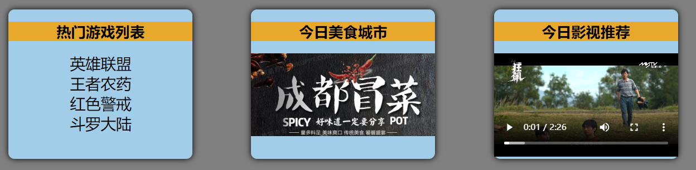

### （1）默认插槽
App.vue：父组件

```vue
<template>
  <div class="container">
    <Category title="游戏">
      <!-- 1.准备好要插入的html结构 -->  
      <div>html结构</div>

    </Category>

  </div>

</template>

```

Category.vue：子组件

```vue
<template>
  <div class="category">
    <h3>{{title}}分类</h3>

    <!-- 2.指定要插入的位置 -->
    <slot>没有传入html结构，文字显示</slot>

  </div>    
</template>

```

### （2）具名插槽
App.vue：父组件

```vue
<template>
  <div class="container">
    <Category>
      <!-- 1.准备好要插入的html结构 -->  
      <template v-slot="center">
        <div>html结构1</div>

      </template>

      <template #footer>
        <div>html结构2</div>

      </template>

   </Category>

  </div>

</template>

```

Category.vue：子组件

```vue
<template>
  <div>
    <!-- 2.指定要插入的位置 -->
    <slot name="center">没有传入html结构，文字显示</slot>

    <slot name="footer">没有传入html结构，文字显示</slot>

  </div>

</template>

```

### （3）作用域插槽
1.理解：<font style="color:red;">数据在组件的自身，但根据数据生成的结构需要组件的使用者来决定</font>

 2.注意： 

+ 使用作用域插槽时插入的 html 结构必须用 `template` 标签包裹 
+ 接收数据可以用 `scope="xxx"` 或者 `slot-scope="xxx"`（可以用结构赋值）

3.代码示例：games 数据在 Category 组件中，但使用数据所遍历出来的结构由App组件决定

App.vue：父组件

```vue
<template>
  <div>
    <Category>
      <!-- 1.准备好要插入的html结构 -->
      <template scope="{games}">
        <ul>
          <li v-for="g in games" :key="g">{{g}}</li>

        </ul>

      </template>

    </Category>

    <Category>
      <!-- 1.准备好要插入的html结构 -->
      <template slot-scope="scopeData">
        <h4 v-for="g in scopeData.games" :key="g">{{g}}</h4>

      </template>

    </Category>

  </div>

</template>

```

Category.vue：子组件

```vue
<template>
  <div>
    <!-- 2.指定要插入的位置 -->
    <slot :games="games">没有传入html结构，文字显示</slot>

  </div>

</template>

        
<script setup lang="ts" name="Category">
  import {reactive} from 'vue'
    
  //数据在子组件自身
  let games = reactivegames:['红色警戒','穿越火线','劲舞团','超级玛丽'])
  
</script>

```

# 7.其它 API
## 7.1.shallowRef
1.作用：创建一个响应式数据，但只对顶层属性进行响应式处理

2.用法：

```javascript
import { shallowRef } from 'vue'
let myVar = shallowRef(initialValue);
```

3.特点：只跟踪引用值的变化，不关心值内部的属性变化

## 7.2.shallowReactive
1.作用：创建一个浅层响应式对象，只会使对象的最顶层属性变成响应式的，对象内部的嵌套属性则不会变成响应式的

2.用法：

```javascript
import { shallowReactive } from 'vue'
const myObj = shallowReactive({ ... });
```

3.特点：对象的顶层属性是响应式的，但嵌套对象的属性不是

> 通过使用 `shallowRef()` 和 `shallowReactive()` 来绕开深度响应。浅层式 `API` 创建的状态只在其顶层是响应式的，对所有深层的对象不会做任何处理，避免了对每一个内部属性做响应式所带来的性能成本，这使得属性的访问变得更快，可提升性能。
>

## 7.3.readonly
1.作用：用于创建一个对象的深只读副本

2.用法：

```javascript
import { reactive,readonly } from 'vue'
const original = reactive({ ... });
const readOnlyCopy = readonly(original);
```

2.特点：

+ 对象的所有嵌套属性都将变为只读
+ 任何尝试修改这个对象的操作都会被阻止（在开发模式下，还会在控制台中发出警告）

3.应用场景：

+ 创建不可变的状态快照。
+ 保护全局状态或配置不被修改。

## 7.4.shallowReadonly
1.作用：与 `readonly` 类似，但只作用于对象的顶层属性

2.用法：

```javascript
import { reactive,shallowReadonly } from 'vue'
const original = reactive({ ... });
const shallowReadOnlyCopy = shallowReadonly(original);
```

3.特点：

+ 只将对象的顶层属性设置为只读，对象内部的嵌套属性仍然是可变的
+ 适用于只需保护对象顶层属性的场景

## 7.5.toRaw
1.作用：用于获取一个响应式对象的原始对象， `toRaw`  返回的对象不再是响应式的，不会触发视图更新

> 官网描述：这是一个可以用于临时读取而不引起代理访问/跟踪开销，或是写入而不触发更改的特殊方法。不建议保存对原始对象的持久引用，请谨慎使用。
>
> 何时使用？ —— 在需要将响应式对象传递给非  `Vue`  的库或外部系统时，使用 `toRaw` 可以确保它们收到的是普通对象
>

2.具体编码：

```javascript
import { reactive,toRaw } from "vue";

// 响应式对象
let person = reactive({name:'tony',age:18})
// 原始对象
let rawPerson = toRaw(person)

console.log(isReactive(person))
console.log(isReactive(rawPerson))
```

## 7.6.markRaw
1.作用：标记一个对象，使其永远不会变成响应式的

> 例如使用 `mockjs` 时，为了防止误把 `mockjs` 变为响应式对象，可以使用  `markRaw` 去标记 `mockjs`
>

2.编码：

```javascript
import { reactive,markRaw } from "vue";

/* markRaw */
let citys = markRaw([
  {id:'asdda01',name:'北京'},
  {id:'asdda02',name:'上海'},
  {id:'asdda03',name:'天津'},
  {id:'asdda04',name:'重庆'}
])

// 根据原始对象citys去创建响应式对象citys2 —— 创建失败，因为citys被markRaw标记了
let citys2 = reactive(citys)
```

## 7.7.customRef
1.作用：创建一个自定义的 `ref`，并对其依赖项跟踪和更新触发进行逻辑控制

2.代码示例：

将自定义的 `ref` 封装成 `hooks`

```typescript
import { customRef } from "vue";

export default function(initValue:string,delay:number){
  // 使用Vue提供的customRef定义响应式数据
  let timer:number
  // track(跟踪)、trigger(触发)
  let msg = customRef((track,trigger)=>{
    return {
      // get何时调用？—— msg被读取时
      get(){
        track() //告诉Vue数据msg很重要，你要对msg进行持续关注，一旦msg变化就去更新
        return initValue
      },
      // set何时调用？—— msg被修改时
      set(value){
        clearTimeout(timer)
        timer = setTimeout(() => {
          initValue = value
          trigger() //通知Vue一下数据msg变化了
        }, delay);
      }
    }
  })
  return {msg}
}
```

组件中使用：

```vue
<template>
    <div class="app">
        <h2>{{ msg }}</h2>

        <input type="text" v-model="msg">
    </div>

</template>

<script setup lang="ts" name="App">
    import {ref} from 'vue'
    import useMsgRef from './useMsgRef'

    // 使用Vue提供的默认ref定义响应式数据，数据一变，页面就更新
    // let msg = ref('你好')

    // 使用useMsgRef来定义一个响应式数据且有延迟效果
    let {msg} = useMsgRef('你好',2000)

</script>

```

# 8.Vue3 新组件
## 8.1.Teleport
什么是Teleport？—— Teleport 是一种能够将我们的组件html结构移动到指定位置的技术

```html
<teleport to='body' >
    <div class="modal" v-show="isShow">
      <h2>我是一个弹窗</h2>

      <p>我是弹窗中的一些内容</p>

      <button @click="isShow = false">关闭弹窗</button>

    </div>

</teleport>

```

## 8.2.Suspense
1.等待异步组件时渲染一些额外内容，让应用有更好的用户体验 

3.使用步骤： 

+ 异步引入组件
+ 使用 `Suspense` 包裹组件，并配置好`default` 与 `fallback`

```vue
<template>
  <div class="child">
    <h2>我是Child组件</h2>

    <h3>当前求和为：{{ sum }}</h3>

  </div>

</template>

<script setup lang="ts" name="child">
  import {ref} from 'vue'
  import axios from 'axios'

  let sum = ref(0)
  let {data:{content}} = await axios.get('https://api.uomg.com/api/rand.qinghua?format=json')
  console.log(content)

</script>

```

```vue
<template>
    <div class="app">
        <h3>我是App组件</h3>

        <Suspense>
          <template v-slot:default>
            <Child/>
          </template>

          <template v-slot:fallback>
            <h3>加载中.......</h3>

          </template>

        </Suspense>

    </div>

</template>

```

## 8.3.全局API转移到应用对象
+ `app.component`
+ `app.config`
+ `app.directive`
+ `app.mount`
+ `app.unmount`
+ `app.use`

## 8.4.其他
+ 过渡类名 `v-enter` 修改为 `v-enter-from`、过渡类名 `v-leave` 修改为 `v-leave-from`
+ `keyCode` 作为 `v-on` 修饰符的支持
+ `v-model` 指令在组件上的使用已经被重新设计，替换掉了 `v-bind.sync`
+ `v-if` 和 `v-for` 在同一个元素身上使用时的优先级发生了变化
+ 移除了`$on`、`$off` 和 `$once` 实例方法
+ 移除了过滤器 `filter`
+ 移除了`$children` 实例 `propert`......
