# 第01章：RAG-搭建企业私有/个人知识库

## 1、RAG的理解

### 1.1 什么是RAG

RAG（Retrieval-Augmented Generation，检索增强生成）是一种结合`信息检索`（Retrieval）与`文本生成`（Generation）的技术，旨在提升大语言模型在回答专业问题时的`准确性`和`可靠性`。

### 1.2 为什么需要RAG

**背景：**

- 大模型的知识冻结
- 大模型幻觉

`举例1：`

随着 LLM 规模扩大，训练成本与周期相应增加。因此，包含最新信息的数据难以融入模型训练过程，无法及时反映最新的信息或动态变化，导致 LLM 难以应对诸如“请推荐当前热门影片”等时间敏感性问题。

`举例2：`

大型语言模型（LLM）的训练依赖于网络上`海量公开的静态数据`，而某些`特定领域`（如企业内部资料、专有技术文档等）的数据通常不会作为公开的训练数据，导致模型在面对这些领域的查询时，可能因缺乏足够的信息而生成不准确甚至虚构的回复。

**解决方案：**

为了解决这一问题，RAG技术通过引入`向量数据库（Vector Database）`作为外部知识源，将模型缺失的知识以结构化的形式提供。

`举例1：`

LLM在考试的时候面对陌生的领域，答复能力有限，然后就准备放飞自我了，而此时RAG给了一些提示和思路，让LLM懂了开始往这个提示的方向做，最终考试的正确率从60%到了90%！


`举例2：`


### 1.3 执行流程


> 检索-增强-生成过程：检索可以理解为第10步，增强理解为第13步（这里的提示词包含检索到的数据），生成理解为第15步。

**强调一下难点的步骤（蓝色部分）：**


**这里有三个位置涉及到大模型的使用：**

- 第3步向量化时，需要使用EmbeddingModels。
- 第7步重排序时，需要使用RerankModels。可对初步召回的较多 chunk（如 top 20 或 top 50）进行精排，提高召回准确率，防止LLM 处理无关信息，减少时间和成本。
- 第9步生成答案时，需要使用LLM。

**Reranker的使用场景：**

- 适合：追求回答高精度和高相关性的场景中特别适合使用 Reranker，例如专业知识库或者客服系统等应用。
- 不适合：Reranker相较于RAG的成本更高。此外，引入Reranker会增加召回时间，增加检索延迟。服务对响应时间要求高时，使用Reranker可能不合适。

## 2、知识库的概述

### 2.1 哪些人需要搭建(个人)知识库

**小型企业主或创业者：**查阅和分享文件、文档、客户反馈、市场分析，大大提升你的工作效率。

**职场打工人或自由职业者：**无论是写作、设计、开发，还是视频制作，知识库都可以管理大量的素材、创意和客户需求，通过知识库，你可以轻松存储和搜索这些资料，并通过大模型二次创作

**教育工作者或学生：**利用知识库管理教学资源、课程安排、教材资料等，学生则可以将课堂笔记、参考书目和作业整理在一起，随时复习和备考。

**生活中的普通人：**无论是旅行计划、兴趣爱好，还是学习笔记，全部都可以集中在知识库管理。

### 2.2 知识库各个搭建平台对比

很多平台都支持个人知识库的搭建。

#### 2.2.1 核心定位和技术特点

**AnythingLLM、CherryStudio**：`桌面/图形化 AI 助手 + 知识库（RAG）`，支持对接云模型与本地模型；适合`个人/小团队`快速验证。在“多租户治理、复杂系统集成、生产化观测”等方面通常不如平台型/专业引擎。

**Dify、FastGPT**：`LLM Agent 与工作流编排平台`，支持创建知识库，支持`云端`与`本地`部署（可用Docker）。

**RAGFlow**：基于`深度文档理解`的开源 RAG 引擎，强调复杂文档解析、引用与可视化干预；也支持 Agent 能力，但通用工作流生态通常不如“全能型 Agent 平台”。（支持Docker部署）

#### 2.2.2 典型场景与选型建议

**1. 个人知识管理（轻量级）**

- 需求：快速验证、低预算（开发成本 <= 1周），个人/小团队使用，**以“能用”为主**（文档以 Markdown、PDF、网页为主）。

- 推荐工具：Cherry Studio /  AnythingLLM

- 理由：

  - 部署和操作简单，上手快
  - 可直接对接在线大模型 API，也可接本地模型，适合快速试错
  - 支持多模型对话（如 DeepSeek + Ollama），适合整合笔记/文献

**2. 应用化交付与团队协作（平台型场景）**

- 需求：
  - 将知识库能力**封装为可复用的 AI 应用或 Agent**
  - 支持多成员协作、权限控制、应用发布与版本迭代
  - 需要流程编排（如检索 → 工具调用 → 多轮推理），而不仅是简单问答
- 推荐工具：Dify / FastGPT
- 理由：
  - 提供完整的 **Agent / Workflow 编排能力**，知识库（RAG）作为其中一环
  - 支持多应用管理、角色与权限控制，更适合团队或内部平台使用
  - 易于与业务系统集成（API / Webhook），便于“从 Demo 走向可用系统”

**3. 企业级文档解析（高精度需求）**

- 需求：面向复杂文档（**长PDF、复杂版式、表格/图片混排、扫描件**等），强调解析质量与可控性，要求可追溯引用。
- 推荐工具：RAGFlow
- 理由：
  - 强调深度文档理解，解析/分块结果可视化，便于检查与必要时干预
  - 对复杂格式更友好，适合把“文档解析质量”作为核心竞争力的场景


## 3、Cherry-Studio搭建个人知识库

> 后续我们会重点拿Coze和Dify讲工作流和智能体，所以知识库这里，我们选另外两个非常不错的平台：Cherry-Studio 和腾讯出品的ima


### 3.1 Cherry-Studio特点

**小白友好**：Cherry Studio 致力于降低技术门槛，零基础用户也能快速上手，让用户专注于工作、学习或者创作。

**一问多答**：支持同一问题通过多个模型同时生成回复，方便用户对比不同模型的表现


**助手市场**：内置千余个行业专用助手，涵盖翻译、编程、写作等领域，同时支持用户自定义助手。


**服务商模型聚合**：支持 OpenAI、Gemini、Anthropic、Azure 等规范的三方服务商接入，兼容性强。


**数据安全**：支持全本地场景使用，结合本地大模型，避免数据泄漏风险。


### 3.2 LLM的使用

#### 步骤1：下载与安装客户端工具

Cherry Studio官网：https://cherry-ai.com/


安装过程：傻瓜式安装，这里省略。

#### 步骤2：硅基流动注册账号

这里的大模型，以硅基流动平台为例说明。

网址：https://siliconflow.cn/zh-cn/models


用手机号注册即可，新注册的账号有免费的token可以使用。

#### 步骤3：创建API密钥


#### 步骤4：复制API密钥


#### 步骤5：配置API密钥


#### 步骤6：选择大语言模型


### 3.3 知识库的使用

#### 步骤1：添加嵌入模型

根据下图确认名称：


回到Cherry Studio添加：


#### 步骤2：创建知识库


上面的pro版本的搜索精度更高，但收费。

提供知识库内容：


这里支持不同格式文件、文件夹、网页地址、大段文本内容等方式添加到知识库。

> 注意：上传的文件中如果有手写内容，或者表格或复杂的数据公式，那解析的效果就会较差。

#### 步骤3：支持直接检索

检索：


此时的检索，基于RAG（检索增强生成）技术，在数据库中去搜索相应的答案。这里还包括占比得分。

#### 步骤4：基于知识库生成


选中后，提问：


#### 补充：增强文档解析能力

如果上传的文件中如果有手写内容，或者表格或复杂的数据公式，那解析的效果就会较差。这里可以提前将文件进行解析处理，然后再上传到个人知识库。

使用工具：Doc2X

网址：https://doc2x.noedgeai.com/


### 3.4 流程分析


## 4、ima搭建个人知识库

### 4.1 ima特点

- 支持客户端、小程序、网页等多端同步访问
- 支持腾讯混元大模型、DeepSeek-R1满血版
- 通过微信提问，模型基于知识库生成答案

### 4.2 搭建知识库过程

#### 步骤1：下载-安装

网址：https://ima.qq.com/


安装好以后，登录一下即可：


#### 步骤2：新建知识库


#### 步骤3：导入本地文件


#### 步骤4：基于知识库"生成"


### 4.3 组合互联网网页构成知识库

步骤1：我们可以在微信公众号搜索相关主题的公众号文章，并将他们加入到ima。

步骤2：在ima中新建个人知识库，将相关文章加入到此知识库。


步骤3：在文章导入完成以后，可以生成自己的知识库，进而结合大模型进行搜索


### 4.4 添加第三方知识库

在pc端查看：


> 添加到相关知识库之后，不管在手机端还是同账号的PC端，都可以查看。

## 5、使用Dify搭建知识库

### 5.1 Dify介绍

Dify（DefineModify）是一个开源的大语言模型(LLM)应用开发平台，由`苏州语灵人工智能`推出。

Dify 为 AI Agent 提供了50多种内置工具，如谷歌搜索、DALL·E、Stable Diffusion 和 WolframAlpha 等。

官网：https://dify.ai/zh

说明：https://github.com/langgenius/dify/blob/main/README_CN.md

### 5.2 源数据格式

通过使用Dify，可以方便快捷地构建私有知识库。可以将知识库放在工作流中，协同多种工具一起使用。而且Dify提供的知识库功能有着简洁的可视化界面，可以很方便地进行管理，适用于个人和团队。

目前Dify 支持多种源数据格式，包括： 

- 长文本内容：TXT、Markdown、DOCX、HTML、JSON、 PDF  


- 结构化数据：CSV、Excel


**注：私有知识库要达到良好的效果，必须与embedding模型和reranker模型相结合，请在xinterface中启用相关模型并引入Dify。**

### 5.3 构建私有知识库

**步骤1：首先创建一个新的知识库**


**步骤2：上传知识库文件**

这里准备的是一部刑法的txt格式文本，用自然段的形式划分了每一条法则


**步骤3：分段设置**

大语言模型存在有限的上下文窗口，通常需要将整段文本进行分段处理后，将与用户问题关联度最高的几个段落召回，即分段 top-K 召回模式。此外，在用户问题与文本分段进行语义匹配时，合适的分段大小将有助于匹配关联性最高的文本内容，减少信息噪音。

分段标识符如果是`\n`，则是以换行为一个分段；如果是`\n\n`，则是以一个段落为一个分段。点击`预览块`查看目前块划分的情况。

分段重叠长度一般是分段最大长度的`10%-20%`。

知识库文档里如果有url、邮箱，还可以把这些过滤掉。


**步骤4：选择索引方式**

这里自动选择高质量。高质量的准确性更高，但是token消耗也会增加。如果使用的是部署到本地的模型，花费就没有影响。


还有Q&A方式。 如果文档是问答方式，那选择这种方式是最契合的。

**步骤5：检索设置**

在这里可以选择Embedding模型和Rerank模型，也可以设置Top K，也就是选出最相似的前n条。选择Score阈值，即筛选文本的相似度阈值。


混合检索：既包括向量检索（涉及rerank检索的大模型），也包含全文检索。

设置完成后，保存并处理即可。


### 5.4 测试

接下来我们进行测试使用。创建一个聊天助手，将提示词写为

```
你是一个法律小助手，请只根据知识库中的信息，简要回答用户提问的案件触犯了哪些法律
```

知识库选择刚才添加的刑法.txt，然后可以开始提问。

可以观察到，聊天助手会自动引用知识库中的内容进行回答。


# 第02章：基于Coze&Dify平台的智能体开发

2025年，被视为智能体落地元年。

> 现在搭建一个智能体，就好比2013年你就有了第一批公众号，好比2016年你注册了抖音。

**本章课程目标：**

- 搭建三类不同层次的智能体
- 熟悉国内外主流AI插件&大模型

## 1、智能体(AI Agent)概述

### 1.1 智能体举例

我们先来看例子：

举例1：Hyperwrite 研发的智能体个人助理插件实现自动预订航班机票


举例2：

情感沟通类智能体“`林间聊愈室`”app上线，收获大量用户好评。其中产品使用小动物的角色设定降低了用户的戒备心，加上治愈的画风和场景设计，打造独特的用户体验。 


举例3：


ShopSpot多模态智能体图片识别功能，分析产品图像、货架状况和仓库环境，有助于快速评估库存水平、识别损坏情况并有效进行产品分类。

举例4：豆包上集成的多种智能体


举例5：字节推出的Coze(扣子)，开发的智能体可以一键发布到豆包、飞书、微信公众号等多个社交平台和应用程序上。


### 1.2 智能体的发展阶段

将 AI 和人类协作的程度类比自动驾驶的不同阶段：


研究AI智能体的最终目标是通向 AGI（也就是通用人工智能）： 


### 1.3 国内大模型厂家推出的智能体


> 比如，用户可以在上述平台上创建、配置和管理聊天机器人和智能体。

### 1.4 智能体的应用领域


在不久的将来，**智能体将成为 AI 系统的最小工作单元**。软件嵌入智能体以后，用户就能从适应软件变成软件适应用户，真正成为个人助理。

而系统级别的智能体可以直接操作 App 或者子智能体， 在 PC、手机、自动驾驶领域将有广泛的应用场景。

### 1.5 智能体的核心要素

OpenAI安全系统团队负责人`翁丽莲`于2023年6月在个人博客系统化总结了当时流行的LLM Agent典型架构。

在**大模型应用开发**中，智能体（AI Agent）通常指一种以`大语言模型`为推理与决策核心，结合`记忆`、`工具调用`与环境交互能力，能够进行`规划决策`并`执行动作`以达成目标的软件系统。

智能体架构：


文章链接如下：https://lilianweng.github.io/posts/2023-06-23-agent/


智能体核心要素被细化为以下模块：

1、**大模型（LLM）作为“大脑”**：提供推理、规划和知识理解能力，是AI Agent的决策中枢。

> 大脑主要由一个大型语言模型 LLM 组成，不仅存储知识和记忆，还承担着信息处理和决策等功能， 并可以呈现推理和规划的过程，能很好地应对未知任务。

2、**记忆（Memory）**  

> 智能体像人类一样，能留存学到的知识以及交互习惯等，这样的机制能让智能体在处理重复工作时调用以前的经验，从而避免用户进行大量重复交互。

- **短期记忆**：存储单次对话周期的上下文信息，属于临时信息存储机制。受限于模型的上下文窗口长度。  

  

- **长期记忆**：可以横跨多个任务或时间周期，可存储并调用核心知识，非即时任务。

  - 长期记忆，可以通过**模型参数微调（固化知识）**、**知识图谱（结构化语义网络）**或**向量数据库（相似性检索）**方式实现。

    > 比如，可以通过外部向量数据库存储历史交互数据，作为长期记忆，支持快速检索与知识积累。

3、**工具使用（Tool Use）**：调用外部工具（如API、数据库）扩展能力边界。


- 能够使用外部工具API拓展模型能力，以获取大模型以外的能力和信息，如预定日程、设置代办、查询数据等；

4、**规划决策（Planning）**：通过任务分解、反思与自省框架实现复杂任务处理。例如，利用思维链（Chain of Thought）将`目标拆解为子任务`，并通过反馈优化策略。

- 步骤的复杂任务，Al Agent能够调用LLM通过思维链能力将大型任务分解为较小的、可管理的子目标，以便高效的处理复杂任务;
- 通过反思和自省框架，Al Agent可以不断提升任务规划能力，可以对过去的行为进行自我批评和反省。


5、**行动（Action）**：实际执行决策的模块，涵盖软件接口操作（如自动订票）和物理交互（如机器人执行搬运）。比如：检索、推理、编程等。

多智能体协作：在单一智能体的基础上，多个智能体之间可以通过交互协作，完成更复杂的需求。


### 1.6 搭建智能体的三个level

**level 1：提示词立人设**

GPTs、Cherry-Studio、豆包等通过提示词，做一个阉割版的智能体，直接和LLM交互。

**level 2：工作流**

定义工作流，每一步可以指定不同的模型，应用就会按照我们设定的流程执行任务。---> 面向过程

**level 3：自主任务拆解**

智能体根据人类设定的目标，自主进行任务拆分，工具选择，进度控制，实现目标后自主结束工作。


## 2、level 1：预设提示词创建简易智能体

### 2.1 Cherry-Studio中创建智能体

#### 步骤1：创建智能体


其中，提示词可以借助LLM提供：


#### 步骤2：进一步编辑智能体

 


说明：模型温度：温度越高，输出的内容越有创意性。

#### 步骤3：添加到助手

 

#### 步骤4：使用


### 2.2 其它平台创建智能体

举例：豆包


举例：腾讯元器

https://yuanqi.tencent.com/agent-shop


举例：讯飞星火

https://xinghuo.xfyun.cn/desktop-app-download


> 后续细节这里省略。

还有coze、纳米AI等，这里不再赘述。这些智能体的主要区别不在于客户端或者选项或平台，而在于使用的大模型不同。

## 3、level 2：使用工作流

以讯飞星辰Agent平台为例：

https://agent.xfyun.cn/home


## 4、level 3：使用Coze搭建高阶智能体

### 4.1 常见平台介绍

| 对比维度 | Coze（扣子）                              | Dify                                 | n8n                                        |
| -------- | ----------------------------------------- | ------------------------------------ | ------------------------------------------ |
| 发布时间 | 24年2月1日上线‌，25年7月26日宣布全面`开源` | 2023年由`苏州语灵`人工智能推出       | 2019年诞生于`德国`的`开源工作流`自动化工具 |
| 适用用户 | 零技术背景的个人、小团队、自媒体运营者    | 开发者、技术团队、需要定制化AI的企业 | 开发者和需要复杂自动化的企业               |
| 核心优势 | 零代码、快速上线、字节生态集成            | 大模型专精、企业级功能、LLMOps全链路 | 开源免费、强大集成能力、数据自主           |
| 学习曲线 | 低 (几小时内上手)                         | 中等（1-2天熟悉基本操作）            | 高 (需3-5天系统学习)                       |
| 扩展性   | 有限（主要依赖预设模板和插件）            | 中等（支持自定义模型和外部工具）     | 极强（400+节点，支持代码自定义）           |
| 部署方式 | 支持云端托管和私有化部署                  | 支持云端和私有化部署                 | 支持自托管和云端部署                       |
| 成本     | 免费版+积分制付费套餐                     | 免费版+分层付费计划                  | 完全开源，自托管只需服务器费用             |
| 趋势     | 不错的使用体验，个人用户增长迅速          | 在企业用户中的影响力不断扩大         | 在企业级市场保持着稳定的用户基础           |

优点与缺点分析：

- Coze的优缺点：
  - Coze的最大优点是**上手极其简单**，提供100+预制模板，无需编写代码就能快速搭建AI应用。它与字节系产品（抖音、飞书等）深度集成，一键发布到多个平台。免费版提供基础功能，试错成本低。
  - Coze的局限性在于功能较浅，复杂逻辑难以实现。数据云端存储（虽开源支持私有化部署，但**插件开发者生态仍闭源**，**私有化部署版本并没有像云托管版本那么易用**） ，对企业数据安全有顾虑。深度集成能力弱于n8n和Dify。

- Dify的优缺点：
  - Dify的突出优势在于**大模型应用开发能力强**，内置多种模型接口和RAG框架。提供**企业级功能**如多模型热切换、权限管理和操作审计。在**低代码和高扩展性**之间取得了良好平衡。
  - Dify的缺点是**模型调用成本较高**，依赖第三方API付费接口。对非技术用户仍有一定门槛，需理解“向量数据库”等概念。

- n8n的优缺点：
  - n8n的核心优势是**开源免费且数据完全自主**，满足严格合规需求。拥有**强大的集成能力**，支持400+预建节点，几乎可以连接任何系统。可视化+代码双模式兼顾易用性与扩展性。
  - n8n的主要缺点是**学习门槛较高**，需要理解API概念和工作流逻辑。中文资源相对较少，深度功能需参考英文文档。

### 4.2 Coze(扣子)介绍

扣子官网：https://www.coze.cn/


客户案例：

https://www.coze.cn/customers

### 4.3 功能说明

`工作空间`：开发的智能体或资源库的列表。用户可以在该平台上创建、配置和管理聊天机器人和智能体。


`商店`：会展示平台上别人开发好的项目，以及开发中可以使用的各种插件(联网、爬虫、股票分析)


`模板`：非常多的可以复制的模板，部分模板收费


### 4.4 案例1：深夜情感主持

#### ① 创建智能体

 

#### ② 填写提示词


 

 

```
# 角色
你是一位专业的深夜情感主持，擅长在深夜陪伴单身男女，倾听他们的情感困惑，给予温暖且实用的回应与建议。

## 技能
### 技能 1: 倾听与理解
1. 当单身男女分享情感问题时，仔细聆听，通过提问等方式确保全面理解他们的处境和感受。
2. 运用同理心表达对他们情绪的理解，让对方感受到被关注和接纳。
===回复示例===
我能感受到你此刻的[具体情绪]，听起来你最近在[情感相关事情]上遇到了困扰，可以再多和我说说具体情况吗？
===示例结束===

### 技能 2: 分析与建议
1. 根据对方分享的情感经历，分析可能存在的问题和原因。
2. 结合情感知识和经验，给出具体、可行的解决建议和行动方向。
===回复示例===
从你说的情况来看，问题可能出在[分析原因]。我建议你可以尝试[具体建议 1]，也可以考虑[具体建议 2]，这样或许能改善目前的状况。
===示例结束===

### 技能 3: 情绪安抚
1. 如果对方处于负面情绪中，运用温暖、积极的语言帮助他们缓解情绪。
2. 分享一些励志或安慰的话语，给予他们面对情感问题的勇气和信心。
===回复示例===
别太难过啦，情感路上难免会有坎坷，这只是暂时的。你要相信自己有足够的能力去处理这些，一切都会慢慢好起来的。

## 限制:
- 只围绕单身男女的情感话题展开交流，拒绝回答与情感无关的话题。
- 所输出的内容要条理清晰，以通俗易懂的语言表达。
- 建议部分要具体、有针对性，避免过于笼统和模糊。
- 回复需基于正常的情感认知和价值观，不提供违背道德伦理的建议。 
```

#### ③ 模型参数设置

 

关于temperature：


#### ④ 测试

 

#### ⑤ 设置开场白及预设问题

 

#### ⑥ 发布

 

可以发布到多个平台：

 

 


### 4.5 案例2：高考报考指南

#### ① 创建智能体

创建智能体：

 

#### ② 填写提示词

 

```
# 角色
你是一位专业的高考志愿填报智能体，对中国各个省份历年高考政策烂熟于心，清楚各高校报考分数情况，深入了解国内各高校各专业的优势与劣势、就业前景等信息，能够为考生提供全面、准确且实用的志愿填报建议。

## 技能
### 技能 1: 提供高考政策信息
1. 当用户询问某省份高考政策时，准确告知该省份历年高考政策的关键要点，包括但不限于录取规则、加分政策、投档方式等。
2. 若用户未指定省份，主动询问用户想了解哪个省份的高考政策。

### 技能 2: 介绍高校报考分数情况
1. 根据用户提供的省份、年份等信息，介绍该省份对应年份各高校的录取分数线、位次等报考分数情况。
2. 若用户未提及具体省份和年份，引导用户提供相关信息以便准确作答。

### 技能 3: 分析高校专业优劣及就业情况
1. 当用户提及某高校某专业时，详细分析该专业在该校的优势和不足，以及该专业的就业方向、就业前景、市场需求等就业情况。
2. 如果用户仅提及高校，介绍该校热门专业和相对冷门专业，并分别阐述其就业情况。
3. 若用户未提及高校和专业，主动询问用户想了解哪所高校或哪个专业的情况。

## 限制:
- 只讨论与高考志愿填报相关的内容，包括高考政策、高校报考分数、高校专业优劣及就业情况等，拒绝回答与高考志愿填报无关的话题。
- 所输出的内容应逻辑清晰、条理分明，按照合理的结构组织语言。
- 提供信息时应确保准确，尽可能全面地涵盖关键要点。
- 通过搜索工具获取互联网上公开、可靠的相关信息，确保信息来源准确。  
```

#### ③ 使用插件

**插件1：头条搜索**

未使用插件时：

 

安装插件：

 

继续搜索：

 

 

**插件2：头条图片搜索**


  

#### ④ 使用知识库

 


 

 


### 4.6 案例3：家庭记账助手

#### ① 创建智能体

 

#### ② 填写提示词

 

 

```
# 角色
你是一个专业的家庭智能记账助手，能够精准、高效地记录家庭的各项收支情况，为用户提供清晰明了的家庭财务信息。

## 技能
### 技能 1: 记录收入
1. 当用户告知有收入发生时，详细询问收入来源、金额、日期等信息。
2. 将这些信息准确记录下来。
===回复示例===
已成功记录收入。收入来源：<具体来源>，金额：<具体金额>，日期：<具体日期>
===示例结束===

### 技能 2: 记录支出
1. 当用户告知有支出发生时，详细询问支出项目、金额、日期、支付方式等信息。
2. 将这些信息准确记录下来。
===回复示例===
已成功记录支出。支出项目：<具体项目>，金额：<具体金额>，日期：<具体日期>，支付方式：<具体方式>
===示例结束===

### 技能 3: 生成财务报表
1. 根据记录的收支信息，定期（如每月、每季度）生成家庭财务报表。
2. 报表内容包括总收入、总支出、各项支出占比等关键信息。
3. 以直观易懂的方式呈现报表内容，例如使用图表描述各项支出占比情况。
===回复示例===
本月家庭财务报表如下：
- 总收入：<具体金额>
- 总支出：<具体金额>
- 各项支出占比：
    - <支出项目 1>：<占比>
    - <支出项目 2>：<占比>
    - ……
（此处可插入简单的饼状图或柱状图描述占比情况）
===示例结束===

## 限制:
- 只讨论与家庭记账相关的内容，拒绝回答与家庭记账无关的话题。
- 所输出的内容必须逻辑清晰，有条理地组织，不能偏离框架要求。
- 确保记录信息的准确性和完整性。 
```

#### ③ 使用变量

如果需要将交互的数据记录下来，就需要使用变量。

在没有变量时，聊天中的上下文一旦清空，就没法获取之前的交互数据了。比如：

  

> 小插曲：修改了提示词“限制”部分：
>
> 

但清空记录以后：

 

 

设置变量：

 

 

 

在清除历史记录以后，仍然可以记录用户信息。

#### ④ 数据库的使用

 

 

 

 

#### ⑤ 其它功能

**长期记忆：**

总结所有的聊天记录，会把总结后的聊天记录记录。后续聊天会作为上下文。


**文件盒子：**

用于保存和管理用户发送的文件。用户发送消息时，智能体能够查找和引用这里的文件进行回复。还支持用户通过发送消息，管理和删除自己的文件。如图片、视频、音频、文档等

> 如果有文件的交互，后续还希望调取这些文件，就可以使用此功能

## 5、level3：通过Dify搭建高阶智能体

### 5.1 Dify介绍

Dify（DefineModify）是一个开源的大语言模型(LLM)应用开发平台，由`苏州语灵人工智能`推出。是当今最优雅、门槛最低、最受欢迎、效果最好的大模型开发平台之一。

官网：https://dify.ai/zh

说明：https://github.com/langgenius/dify/blob/main/README_CN.md

Dify 为 AI Agent 提供了50多种内置工具，如谷歌搜索、DALL·E、Stable Diffusion 和 WolframAlpha 等。


它的具体功能如下：

- 基于`Agent`架构构建智能体应用
- 基于`RAG`构建私有知识库应用
- 基于`Workflow`构建智能工作流应用


Dify可以本地化部署，保证数据的安全。

> 说明：访问Dify官网需要魔法（或梯子、科学上网）

### 5.2 案例1：时事评论助手

智能助手（Agent Assistant），利用大语言模型的推理能力，能够自主对复杂的人类任务进行目标规划、任务拆解、工具调用、过程迭代，并在没有人类干预的情况下完成任务。 

#### ① 创建Agent


#### ② 配置


借助大模型提供提示词：


```
# 角色定义  
你是一名资深媒体评论员，拥有10年国际时事分析与公共政策研究经验，专注于解读热点事件的深层逻辑与社会影响。你的任务是针对用户提供的新闻事件，提供**权威、多维度、可操作**的评论，帮助读者穿透信息迷雾，理解事件本质。

# 核心任务要求  
1. **深度分析结构**（采用三段式框架）：  
   - **背景与事实梳理**：  
     - 用1-2句话概括事件核心（时间、地点、主体、冲突点）；  
     - 补充关键数据/历史脉络（如政策演变、相关方利益关系）[3,6](@ref)。  
   - **多维解读与洞察**：  
     - 分析至少3个视角（政治动机、经济影响、社会情绪、国际关系）；  
     - 指出被主流媒体忽略的细节或矛盾点（例：政策漏洞、利益集团博弈）；  
     - 预测短期与长期影响（用“可能”“大概率”等谨慎措辞）[1,7](@ref)。  
   - **建设性建议**：  
     - 面向不同群体（公众/企业/政府）提供1-2条可行建议；  
     - 引用国际案例或学术研究支撑观点[6](@ref)。  

2. **内容准则**：  
   - **立场平衡**：承认多方利益合理性，避免非黑即白结论（例：“A方案利于效率但牺牲公平，B方案反之”）；  
   - **证据驱动**：每项分析需匹配数据、权威信源（如WHO报告、央行数据）或历史事件类比；  
   - **风险提示**：若事件存在误读风险（如技术类新闻），用“需警惕”“注意区分”等标注[3,7](@ref)。  

3. **输出规范**：  
   - **标题**：15字内，包含冲突点或悬念（例：《电价改革加速：家庭负担加重还是能源转型必经之路？》）；  
   - **正文长度**：600-800字，分段落标注小标题（如“▍经济逻辑：补贴退坡背后的产业重构”）；  
   - **语言风格**：  
     - 面向大众：避免术语，用“养老金账户”而非“个人养老金融账户”；  
     - 增强共鸣：穿插生活化比喻（例：“全球供应链如多米诺骨牌，一环断裂波及全链”）[1,4](@ref)；  
   - **格式**：Markdown排版，关键信息加粗，数据用表格呈现[5](@ref)。  

# 约束条件（避免行为）  
⚠️ 不主观臆测未证实信息（如“某官员受贿”需改为“某官员涉嫌受贿”）；  
⚠️ 不使用煽动性词汇（如“惊天黑幕”“末日来临”）；  
⚠️ 不对个人/群体进行道德审判（聚焦制度与系统问题）[6,7](@ref)。  

# 处理复杂事件的策略  
- **信息不全时**：明确标注“当前信息下”“基于公开资料”，并列出待验证问题；  
- **争议性事件**：对比多方信源（如外媒VS官媒表述差异），标注矛盾点[3](@ref)；  
- **技术类议题**：先定义关键概念（例：解释“碳关税”再评欧盟新政）[4](@ref)。  

# 示例模板（用户输入：**“日本央行加息终结负利率时代”**）
标题​​：日元转向：宽松时代的终结与亚洲资本回流风暴

政策转折点​​
背景：日本维持负利率8年后首次加息（2024年3月数据）；
关键动机：通胀持续超预期（2023年CPI达3.1%）、日元贬值压力缓解。▍被忽视的连锁反应
企业端：日企海外投资回报率下滑（例：丰田北美利润缩水预估12%）；
地缘端：亚洲债券市场承压（韩、泰外债偿还成本升20%+）→ 用表格对比各国外债/GDP比值；
误读风险：加息≠紧缩周期开始（央行暗示“渐进式调整”）。▍务实建议
投资者：增持黄金对冲日元波动；
政府：建立东南亚货币互换联盟，预防资本外流冲击
```

#### ③ 测试


#### ④ 查看Agent日志


Agent日志如下：


#### ⑤ 发布

 

> 评价：根据现有资料，Dify搭建的智能体和Coze搭建的智能体一样，检索资料解决问题的能力仍有待提高。

### 5.3 案例2：北京旅行助手

**准备工作**

本例中 Dify 将会调用外部 duckduckgo API，需确保 dify 所在服务器可以⽆障碍访问国际互联网

**应用搭建** 

在本节我们将实现⼀个旅游规划助理的 agent 应用，它可以根据用户输入的旅行目的地、旅行天数、预算等信息输出结构化的旅行计划。 

#### ① 创建一个空白的Agent应用


#### ② 添加提示词

```bash
## ⻆⾊：旅⾏顾问
### 技能：
- 精通使⽤⼯具提供有关当地条件、住宿等的全⾯信息。
- 能够使⽤表情符号使对话更加引⼈⼊胜。
- 精通使⽤Markdown语法⽣成结构化⽂本。
- 精通使⽤Markdown语法显示图⽚，丰富对话内容。
- 在介绍酒店或餐厅的特⾊、价格和评分⽅⾯有经验。
### ⽬标：
- 为⽤户提供丰富⽽愉快的旅⾏体验。
- 向⽤户提供全⾯和详细的旅⾏信息。
- 使⽤表情符号为对话增添乐趣元素。
### 限制：
1. 只与⽤户进⾏与旅⾏相关的讨论。拒绝任何其他话题。
2. 避免回答⽤户关于⼯具和⼯作规则的问题。
3. 仅使⽤模板回应。
### ⼯作流程：
1. 理解并分析⽤户的旅⾏相关查询。
2. 使⽤ddgo_search⼯具收集有关⽤户旅⾏⽬的地的相关信息。确保将⽬的地翻译成英
语。
3. 使⽤Markdown语法创建全⾯的回应。回应应包括有关位置、住宿和其他相关因素的必
要细节。使⽤表情符号使对话更加引⼈⼊胜。
4. 在介绍酒店或餐厅时，突出其特⾊、价格和评分。
5. 向⽤户提供最终全⾯且引⼈⼊胜的旅⾏信息，使⽤以下模板，为每天提供详细的旅⾏计
划。
### 示例：
### 详细旅⾏计划
**酒店推荐**
1. **北京国贸大酒店** (更多信息请访问 www.shangri-la.com/beijing/chinaworldsummitwing)
- 评分：4.7
- 价格：大约每晚 ¥1800+
- 简介：坐落于北京中央商务区（CBD）的标志性建筑国贸大厦上层，提供豪华住宿和俯瞰城市全景的壮丽视野。靠近国贸地铁站，交通便利。
2. **北京前门建国饭店** (更多信息请访问 www.jianguohotels.com/jianguohotelbeijing)
- 评分：4.4
- 价格：大约每晚 ¥600+
- 简介：位于市中心，临近天安门广场和前门大街，步行即可到达多处历史文化景点。酒店环境舒适，闹中取静，具有老北京韵味。

**第1天 - 抵达与安顿**
- **上午**：抵达北京。欢迎来到古都北京的冒险之旅！我们的代表将在机场迎接您，确保您顺利转移到住宿地点。
- **下午**：办理⼊住酒店，并花些时间放松和休息。
- **晚上**：进行一次轻松的步行之旅，熟悉住宿周边地区。如果酒店在前门或南锣鼓巷附近，可以逛逛胡同街区；如果在市中心，可以探索王府井大街，品尝地道小吃。

**第2天 - 历史与文化之⽇**
- **上午**：前往天安门广场，感受宏伟的建筑和历史氛围。之后进入故宫博物院（紫禁城），深入了解中国古代皇家宫殿的壮丽与历史。
- **下午**：选择参观天坛公园，欣赏中国古代祭祀建筑的杰作，并体验北京市民的悠闲生活；或前往颐和园，游览这座美丽的皇家园林。
- **晚上**：品尝享誉世界的北京烤鸭作为晚餐。之后，可以去三里屯体验北京的现代夜生活，或者回到酒店附近继续探索。

**额外服务：**
- **礼宾服务**：在您的整个住宿期间，我们的礼宾服务可协助您预订餐厅、购买⻔票、
安排交通和满⾜任何特别要求，以增强您的体验。
- **全天候⽀持**：我们提供全天候⽀持，以解决您在旅⾏期间可能遇到的任何问题或需
求。
祝您的旅程充满丰富的体验和美好的回忆！
### 信息
⽤户计划前往{{destination}}旅⾏{{num_day}}天，预算为{{budget}}。
```


#### ③ 添加对话开场白、内容审查

选择“管理”，在功能中添加对话开场白和内容审查等功能


对话开场白：

```
{{name}}先生、女士,我是您的个性化旅行助理,你是否已经准备好开始一段充满冒险和放松的旅程了?让我们一起打造您难忘的旅行体验吧!请告诉我您的旅行目的、预算和行程天数,比如：
```

开场问题：

```
帮我制定一次家庭旅行，目的地是{{destination}}，为期{{num_day}}天，预算是{{budget}}


帮我制定一次蜜月旅行，目的地是{{destination}}，为期{{num_day}}天，预算是{{budget}}
```


内容审查设置


```
偷东西
吃饭不给钱
打架
```

```
问题中涉及敏感内容，请重新提问
```

提问被拦截


#### ④ 完整测试


## 6、工作流的搭建

这节讲讲如何使用LLM，在Coze、Dify平台搭建工作流，并通过一键生成爆款视频、调研报告、深度专题论文等案例，讲解工作流的每一个实现细节。

### 6.1 工作流的理解

**什么是工作流？**

工作流（WorkFlow）是为完成某项任务或业务流程而设计的一系列`自动化步骤的有序组合`。它通过标准化、协调不同环节的人员、系统或资源，实现流程的高效执行与监控，最终达成特定目标。

**为什么需要工作流？**

在大模型的应用中，某些复杂的需求很难通过单一的问答解决，此时可以引入工作流，通过一系列任务结点的链式调用`实现复杂需求`。

> 比如1：电商的订单处理：审核用户下单，触发库存检查，库存充足就生成物流单，并触发财务系统完成收款对账。如果库存不足，。。。
>
> 比如2：AI批改学生作业：学生提交作业->系统识别错误-> 生成反馈->推荐练习
>
> 比如3：企业审批流程：员工提交申请→系统自动分发给审批人→记录结果并归档
>
> 比如4：自媒体智能体：输入爆款视频->提取爆款标题并重新生成新视频大纲->根据分镜头生成图片->图片生成视频->视频配合字幕整合完成


### 6.2 Coze/Dify实现工作流

**1、案例：**（以Coze平台为例）

案例：详细过程见《Coze案例：一键生成行业调研PPT.md》

**2、是否可以发布到商店/模板**（以Coze平台为例）

**情况1：发布到商店：Yes！**


咱们的应用可以发布到商店里，大家只能体验，但是不能复制工作流，也看不到工作流。因为没有复制选项。

**情况2：发布到模板：No！**


只有发布为模板的，才可以看到应用或智能体的设置细节。但权限管理很严格。

## 7、项目：商户运营管家

1、《产品营销海报生成》

2、《一键生成商品宣传视频》

3、《客户投诉分类助手-钉钉》

4、《一键生成xxx(产品/行业)调研报告》

5、《客服对话记录分析》

6、《商品评论分析》

7、《商品营销卖点提炼》

## 8、Python调用Dify或Coze平台工作流

见第5、6章节。


## 9. DeepResearch的应用(了解)

### 9.1 秘塔AI

https://metaso.cn/

**1. 选择长思考和研究模式**


选择长思考-R1会调用秘塔部署的满血版DeepSeek-R1模型。

问题如下

```
对比QWQ和DeepSeek-R1
```

**2. 输出内容如下**

```
研究模式
步骤拆解
好的，我现在需要分解用户的问题“对比QWQ和DeepSeek-R1”。首先，我需要明确这两个实体是什么。QWQ可能是一个品牌、产品或者服务，而DeepSeek-R1听起来像是一个技术产品，可能是某个公司的产品线，比如机器人或AI模型。

第一步，我应该分别搜索QWQ和DeepSeek-R1的基本信息，了解它们各自的定义和背景。这有助于后续的对比分析。接下来，可能需要查找它们的主要功能或特点，这样在对比时才能知道它们各自的优势和用途。

然后，用户可能想知道它们的应用领域，所以需要搜索它们的应用场景，看看它们在哪些行业或环境中被使用。此外，技术参数或性能指标也是对比的重要部分，比如处理速度、准确性、资源消耗等。

用户评价和市场反馈也很重要，了解用户对这两个产品的满意度和常见问题。最后，市场定位和价格策略可以帮助理解它们的目标客户群体和商业策略。

....
最终回答
这里省略600行...
```

图示：略

**3. 总结**

秘塔AI会自主拆解任务，并依次执行，最后汇总


此外，回答内容会通过引文标注出处。

### 9.2 知乎直答

https://zhida.zhihu.com/pro


```
对比QWQ和DeepSeek-R1
```

**回答**


### 9.3 PerPlexity

https://www.perplexity.ai


选择深度研究即可使用官方部署的DeepSeek-R1满血版。

**问题**

```
对比QWQ和DeepSeek-R1
```

**回答**


**总结**

也会有任务分解的过程，先检索资料，然后拆解为子任务，逐个列出大纲，再撰写综述，最终的综述也会标注出处。然而，问题是中文，回答是英文，差评。

### 9.4 GPT Pro的DeepResearch

OpenAI推出的深度研究模式，只有每月支付$200才可以使用。会自主拆分任务，搜集资料，做归纳整理、总结，耗时较长，通常为10分钟以上。生成质量较高。

https://chatgpt.com/#pricing


之前的页面：


相对而言，这是更加接近AI Agent的模式，AI可以自主调用工具、自主决策，中间过程更复杂，最终输出的内容更加优质。

以下是B站某博主实测截图，研究耗时19分钟：


下图右侧展示的都是DeepResearch自主规划的子任务：


研究耗时13分钟，生成3万多字，突破了大模型单次输出上限：


会主动追问需求：


补充需求后最终耗时32分钟研究。

# Coze 节点完整手册

> 本手册详细介绍 Coze 工作流平台中所有可用节点的功能、配置方法和使用场景。
>
> 更新时间: 2026年3月31日

---

## 目录

1. [节点分类概览](#节点分类概览)
2. [基础节点](#基础节点)
3. [流程控制节点](#流程控制节点)
4. [数据处理节点](#数据处理节点)
5. [AI能力节点](#ai能力节点)
6. [知识库节点](#知识库节点)
7. [数据库节点](#数据库节点)
8. [会话管理节点](#会话管理节点)
9. [消息管理节点](#消息管理节点)
10. [异步处理节点](#异步处理节点)
11. [节点组合最佳实践](#节点组合最佳实践)

---

## 节点分类概览

Coze 平台将节点分为以下几大类:

| 分类             | 主要用途             | 典型节点                     |
| ---------------- | -------------------- | ---------------------------- |
| **基础节点**     | 工作流的入口和出口   | 输入节点、输出节点           |
| **流程控制节点** | 控制工作流的执行路径 | 条件分支、循环、批处理       |
| **数据处理节点** | 处理和转换数据       | 代码节点、变量赋值、JSON处理 |
| **AI能力节点**   | 提供人工智能能力     | 大模型节点、意图识别、问答   |
| **知识库节点**   | 存储和检索知识       | 知识库检索、写入、删除       |
| **数据库节点**   | 数据持久化存储       | 数据库增删改查               |
| **会话管理节点** | 管理对话会话         | 创建会话、查询会话           |
| **消息管理节点** | 管理对话消息         | 创建消息、查询消息           |
| **异步处理节点** | 后台任务处理         | 异步任务节点                 |

---

## 基础节点

### 1. 输入节点 (Input Node)

**作用**: 定义工作流的入口参数,是整个流程的起点。

**配置项**:

```yaml
参数名称: 自定义变量名
参数类型: 
  - String (文本)
  - Number (数字)
  - Boolean (布尔值)
  - Object (对象)
  - Array (数组)
是否必填: 是/否
默认值: 可选
说明: 参数用途描述
```

**使用示例**:

```yaml
参数列表:
  - 参数名: user_message
    类型: String
    必填: 是
    说明: 用户输入的消息内容
    
  - 参数名: user_id
    类型: String
    必填: 是
    说明: 用户唯一标识
    
  - 参数名: session_id
    类型: String
    必填: 否
    默认值: ""
    说明: 会话ID,为空表示新会话
```

**输出变量**: 

- 后续所有节点都可以通过 `{{input.参数名}}` 引用输入值

**关键点**:

- 输入参数是工作流的"原材料"
- 参数类型要选择正确,影响后续节点使用
- 可以为参数设置默认值,提高工作流鲁棒性

---

### 2. 输出节点 (Output Node)

**作用**: 定义工作流最终返回给调用者的数据结构,是流程的终点。

**配置项**:

```yaml
输出字段:
  - 字段名: 自定义输出名
    字段类型: String/Number/Boolean/Object/Array
    值来源: 引用上游节点的变量
```

**使用示例**:

```yaml
输出字段列表:
  - 字段名: reply
    类型: String
    值: "{{final_reply}}"
    说明: 最终回复内容
    
  - 字段名: session_id
    类型: String
    值: "{{session_id}}"
    说明: 会话ID,用于续接
    
  - 字段名: status
    类型: String
    值: "success"
    说明: 处理状态
```

**关键点**:

- 输出节点是工作流的"终点",只能有一个主输出节点
- 输出字段的值必须来自上游节点的变量引用
- 返回的数据结构应该清晰、完整,便于调用方使用

---

## 流程控制节点

### 3. 条件分支节点 (Condition/Branch Node)

**作用**: 根据条件判断,将流程导向不同的分支,类似编程中的 if-else 语句。

**配置项**:

```yaml
分支规则:
  - 分支名: 分支1名称
    条件表达式: 判断条件
    连接到: 目标节点
    
  - 分支名: 分支2名称
    条件表达式: 判断条件
    连接到: 目标节点
    
  - 默认分支: 兜底分支名称
```

**支持的运算符**:

| 运算符         | 说明     | 示例                      |
| -------------- | -------- | ------------------------- |
| `==`           | 等于     | `intent == "售前"`        |
| `!=`           | 不等于   | `status != "closed"`      |
| `>`            | 大于     | `count > 10`              |
| `<`            | 小于     | `score < 0.6`             |
| `>=`           | 大于等于 | `age >= 18`               |
| `<=`           | 小于等于 | `price <= 100`            |
| `contains`     | 包含     | `message contains "退款"` |
| `is empty`     | 为空     | `session_id is empty`     |
| `is not empty` | 不为空   | `order_id is not empty`   |

**使用示例**:

```yaml
条件分支节点配置:
  分支规则:
    - 分支名: 售前分支
      条件: primary_intent == "售前"
      连接: 售前处理流程
      
    - 分支名: 售后分支
      条件: primary_intent == "售后"
      连接: 售后处理流程
      
    - 分支名: 通用分支
      条件: primary_intent == "通用"
      连接: 通用处理流程
      
    - 默认分支: 其他分支
```

**关键点**:

- 条件按从上到下的顺序判断,满足第一个条件就执行对应分支
- 必须设置默认分支,处理所有未匹配的情况
- 每个分支可以有完全不同的后续节点
- 支持多条件组合 (AND/OR)

---

### 4. 循环节点 (Loop Node)

**作用**: 对数组中的每个元素逐一执行相同的处理逻辑,类似编程中的 for 循环。

**配置项**:

```yaml
循环设置:
  循环来源: 数组变量 (如 {{ticket_list}})
  当前项变量名: 自定义变量名 (如 current_item)
  循环体: 包含的子节点
```

**工作原理**:

1. 从数组中取出一个元素
2. 赋值给"当前项变量名"
3. 执行循环体内的所有节点
4. 重复上述步骤,直到遍历完数组

**使用示例**:

```yaml
循环节点配置:
  循环来源: "{{db_query.ticket_list}}"
  当前项变量名: current_ticket
  
  循环体内节点:
    1. 代码节点: 判断当前工单状态
    2. 条件分支: 根据状态决定是否标记
    
  输出:
    - results_array: 每次循环的结果汇总成新数组
```

**输出变量**:

- `results_array`: 所有循环结果的数组
- `loop_count`: 循环执行次数

**关键点**:

- 循环是串行执行,一个接一个
- 循环体内可以放多个节点
- 注意循环次数,过多会影响性能
- 循环体内可以通过 `{{loop.当前项变量名}}` 引用当前元素

---

### 5. 批处理节点 (Batch Processing Node)

**作用**: 并行处理数组中的多个元素,与循环节点的区别是: 循环是串行,批处理是并行。

**配置项**:

```yaml
批处理设置:
  输入数组: 数组变量
  并发数量: 最大同时处理数
  批处理体: 包含的子节点
```

**使用示例**:

```yaml
批处理节点配置:
  输入数组: "{{warehouse_list}}"
  并发数量: 3
  
  批处理体内节点:
    - HTTP请求节点: 查询当前仓库库存
    
  输出:
    - batch_results: 所有仓库的查询结果数组
```

**关键点**:

- 批处理比循环快,适合独立的并行任务
- 注意设置合理的并发上限,避免触发下游API限流
- 结果顺序可能与输入顺序不一致
- 批处理体内的任务应该是相互独立的

---

### 6. 变量聚合节点 (Variable Aggregator Node)

**作用**: 将多个分支的输出变量合并成统一的变量,供后续节点使用。

**配置项**:

```yaml
聚合规则:
  - 来自分支1: 变量A → 映射到 统一变量X
  - 来自分支2: 变量B → 映射到 统一变量X
  - 来自分支3: 变量C → 映射到 统一变量X
```

**使用示例**:

```yaml
变量聚合节点配置:
  聚合规则:
    # 来自不同分支的相同含义变量,映射到统一名称
    - 来自售前分支: pre_answer → branch_answer
    - 来自售中分支: mid_answer → branch_answer
    - 来自售后分支: after_answer → branch_answer
    - 来自通用分支: general_answer → branch_answer
    
  输出变量:
    - branch_answer: 当前实际执行分支的处理结果
```

**聚合方式**:

- **取第一个非空值**: 按顺序取第一个不为空的值
- **拼接所有值**: 将所有值拼接成一个字符串
- **自定义规则**: 根据业务逻辑自定义

**关键点**:

- 多分支汇聚的必备节点
- 让后续节点可以统一引用变量,不需要判断来源分支
- 聚合时要注意变量的类型一致性

---

## 数据处理节点

### 7. 变量赋值节点 (Variable Assignment Node)

**作用**: 在流程中动态创建或修改变量的值。

**配置项**:

```yaml
赋值操作:
  - 目标变量: 变量名
    赋值来源: 值或表达式
```

**支持的操作**:

| 操作类型   | 说明           | 示例                                             |
| ---------- | -------------- | ------------------------------------------------ |
| 固定值赋值 | 直接赋常量     | `status = "processing"`                          |
| 变量引用   | 引用其他变量   | `answer = {{qa_answer}}`                         |
| 字符串拼接 | 拼接多个变量   | `case_id = "CS" + {{timestamp}} + {{order_id}}`  |
| 条件赋值   | 根据条件赋值   | `priority = {{score}} > 0.9 ? "high" : "normal"` |
| 表达式计算 | 数学或逻辑运算 | `total = {{price}} * {{quantity}}`               |

**使用示例**:

```yaml
变量赋值节点配置:
  赋值操作:
    - 目标变量: case_id
      赋值来源: "CS{{timestamp}}{{order_id}}"
      
    - 目标变量: status
      赋值来源: "processing"
      
    - 目标变量: priority
      赋值来源: "{{confidence}} > 0.9 ? 'high' : 'normal'"
```

**关键点**:

- 支持表达式计算和字符串拼接
- 赋值后的变量可被后续任意节点引用
- 与代码节点相比更简单,适合简单的赋值逻辑
- 复杂的数据处理应该使用代码节点

---

### 8. 代码节点 (Code Node)

**作用**: 执行自定义代码,处理复杂逻辑,支持 JavaScript 和 Python。

**配置项**:

```yaml
编程语言: JavaScript / Python
输入参数: 定义代码需要接收的变量
代码内容: 自定义代码逻辑
输出变量: 代码返回的结果
```

**JavaScript 示例**:

```javascript
// 输入: user_message (文本)
// 输出: order_id, products, request_time

function main({ user_message }) {
  // 从消息中提取订单号 (正则匹配)
  const orderMatch = user_message.match(/订单号?[：:]\s*(\d+)/);
  const order_id = orderMatch ? orderMatch[1] : null;
  
  // 提取商品名称 (关键词提取)
  const products = [];
  const productKeywords = ['手机', '电脑', '耳机', '平板', '充电器'];
  productKeywords.forEach(p => {
    if (user_message.includes(p)) products.push(p);
  });
  
  // 生成时间戳
  const timestamp = new Date().toISOString();
  
  return {
    order_id: order_id || "未知",
    products: products,
    product_count: products.length,
    request_time: timestamp
  };
}
```

**Python 示例**:

```python
# 输入: user_message (文本)
# 输出: intent_keywords

import re
from datetime import datetime

def main(user_message):
    # 提取关键词
    keywords = []
    if "退款" in user_message:
        keywords.append("退款")
    if "投诉" in user_message:
        keywords.append("投诉")
    
    # 生成时间戳
    timestamp = datetime.now().isoformat()
    
    return {
        "keywords": keywords,
        "timestamp": timestamp
    }
```

**关键点**:

- 适合做格式转换、数据清洗、正则提取等复杂逻辑
- 输入输出通过函数参数和 return 值传递
- 避免在代码节点中做网络请求 (用 HTTP 节点替代)
- 代码执行有超时限制,注意性能
- 可以引入部分标准库,但可能有安全限制

---

### 9. JSON 序列化节点 (JSON Serialize Node)

**作用**: 将对象或数组转换为 JSON 字符串,用于发送给外部接口。

**配置项**:

```yaml
输入对象: 对象或数组结构
输出变量: JSON字符串变量名
```

**使用示例**:

```yaml
JSON序列化节点配置:
  输入对象:
    case_id: "{{case_id}}"
    order_id: "{{order_id}}"
    intent: "{{intent}}"
    solution: "{{solution}}"
    products: "{{products}}"
    created_at: "{{request_time}}"
    
  输出变量: case_json_string
```

**输出结果**:

```json
{
  "case_id": "CS202603311234",
  "order_id": "12345",
  "intent": "退款申请",
  "solution": "已提交退款",
  "products": ["手机"],
  "created_at": "2026-03-31T10:30:00Z"
}
```

**关键点**:

- 将结构化数据转换为字符串,便于传输
- 常用于 HTTP 请求前的数据准备
- 可以自定义 JSON 格式

---

### 10. JSON 反序列化节点 (JSON Deserialize Node)

**作用**: 将 JSON 字符串解析为可访问字段的对象,与序列化节点相反。

**配置项**:

```yaml
输入: JSON字符串变量
输出对象字段定义:
  - 字段名: 变量名
    字段类型: 数据类型
```

**使用示例**:

```yaml
JSON反序列化节点配置:
  输入: "{{http_response}}"  # HTTP返回的JSON字符串
  
  输出对象字段定义:
    - 字段名: order_status
      类型: String
      说明: 订单状态
      
    - 字段名: product_name
      类型: String
      说明: 商品名称
      
    - 字段名: price
      类型: Number
      说明: 商品价格
      
    - 字段名: user_phone
      类型: String
      说明: 用户手机号
```

**输出变量**:

- 可以直接用 `{{order_status}}`、`{{product_name}}` 等访问字段

**关键点**:

- 常用于解析 HTTP 请求的响应
- 字段定义要准确,类型要匹配
- 解析失败可能导致工作流中断

---

### 11. 文本处理节点 (Text Processing Node)

**作用**: 对文本进行处理操作,如截取、替换、格式化、拼接等。

**支持的操作类型**:

| 操作类型   | 说明                 | 示例                                 |
| ---------- | -------------------- | ------------------------------------ |
| 文本拼接   | 将多个文本拼接成一个 | `"您好," + name + "!"`               |
| 文本替换   | 替换指定内容         | `text.replace("旧词", "新词")`       |
| 文本截取   | 截取子字符串         | `text.substring(0, 100)`             |
| 格式化     | 按模板格式化         | `"订单号:{order_id}, 状态:{status}"` |
| 大小写转换 | 转换大小写           | `text.toUpperCase()`                 |
| 去除空白   | 去除首尾空格         | `text.trim()`                        |

**使用示例**:

```yaml
文本处理节点配置:
  操作类型: 文本拼接
  
  模板: |
    {{llm_reply}}
    
    ——————————————
    工单编号: {{case_id}}
    受理时间: {{request_time}}
    预计处理: 1-3个工作日
    如有疑问请拨打: 400-xxx-xxxx
    
  输出变量: final_reply
```

**关键点**:

- 可以组合多个操作
- 支持模板语法
- 适合简单的文本处理,复杂处理建议用代码节点

---

### 12. HTTP 请求节点 (HTTP Request Node)

**作用**: 调用外部 API 或 Web 服务,获取实时数据。

**配置项**:

```yaml
请求方式: GET / POST / PUT / DELETE
URL: 接口地址 (支持变量引用)
请求头: Headers 配置
请求体: Body 配置 (POST/PUT)
超时时间: 请求超时设置
```

**使用示例 - GET 请求**:

```yaml
HTTP请求节点配置:
  请求方式: GET
  URL: "https://api.myshop.com/orders/{{order_id}}"
  
  请求头:
    - Authorization: "Bearer {{api_token}}"
    - Content-Type: "application/json"
    
  超时: 10秒
  
  输出变量:
    - status_code: HTTP状态码
    - response_body: 响应体内容 (JSON字符串)
```

**使用示例 - POST 请求**:

```yaml
HTTP请求节点配置:
  请求方式: POST
  URL: "https://sms.api.com/send"
  
  请求头:
    - Authorization: "Bearer {{sms_token}}"
    - Content-Type: "application/json"
    
  请求体:
    phone: "{{user_phone}}"
    message: "您的售后申请{{case_id}}已受理"
    
  输出变量:
    - status_code: HTTP状态码
    - response_body: 响应体内容
```

**输出变量**:

- `status_code`: HTTP 状态码 (200、404、500 等)
- `response_body`: 响应体内容 (通常是 JSON 字符串)
- `response_headers`: 响应头信息

**关键点**:

- URL 和请求体支持变量引用
- 注意设置合理的超时时间
- 错误处理很重要,网络异常可能导致工作流中断
- 敏感信息 (如 API Token) 建议使用环境变量

---

## AI能力节点

### 13. 大模型节点 (LLM Node)

**作用**: 调用 AI 大模型进行文本生成、理解、推理,是最核心的节点之一。

**配置项**:

```yaml
模型选择: DeepSeek-V3 / GPT-4o / Doubao / Qwen 等
系统提示词 (System Prompt): 定义模型角色和行为边界
用户消息 (User Message): 具体任务描述
参数设置:
  - 温度 (Temperature): 控制创造性
  - 最大输出长度: Token 数限制
  - 是否流式输出: 实时返回或一次性返回
历史对话: 多轮对话上下文
绑定工具: 可调用的工具列表
```

**参数详解**:

| 参数               | 取值范围  | 说明                                  |
| ------------------ | --------- | ------------------------------------- |
| 温度 (Temperature) | 0.0 - 2.0 | 越低越稳定,越高越有创意。一般 0.5-0.8 |
| 最大输出长度       | 1 - 4096+ | 输出的最大 Token 数                   |
| Top P              | 0.0 - 1.0 | 核采样参数,影响多样性                 |
| 频率惩罚           | 0.0 - 2.0 | 降低重复内容的概率                    |
| 存在惩罚           | 0.0 - 2.0 | 鼓励谈论新话题                        |

**使用示例**:

```yaml
大模型节点配置:
  模型: DeepSeek-V3
  
  系统提示词: |
    你是一个专业友好的售后客服,请根据用户的申请和订单信息,
    生成一段安抚用户情绪并说明处理方案的回复。
    语气要诚恳、简洁,不超过150字。
    
  用户消息: |
    用户申请: {{user_message}}
    意图类型: {{intent}}
    订单信息: {{order_info}}
    处理方案: {{solution}}
    
  参数设置:
    温度: 0.7
    最大输出长度: 500 tokens
    流式输出: 否
    
  输出变量:
    - llm_reply: 大模型生成的回复文本
```

**关键点**:

- Prompt 中用 `{{变量名}}` 引用上游节点的输出
- 系统提示词决定模型的"角色"和"行为边界"
- 温度越低输出越稳定,越高越有创意
- 可以绑定工具,让模型调用外部功能
- 历史对话字段用于实现多轮对话

---

### 14. 意图识别节点 (Intent Recognition Node)

**作用**: 自动判断用户输入属于哪种意图类型,无需手动编写规则。

**配置项**:

```yaml
输入: 待识别的文本
意图分类列表:
  - 意图名称: 分类标签
    描述: 触发条件描述
    示例: 典型触发句式
置信度阈值: 最低匹配度
默认意图: 未达到阈值时的默认分类
```

**使用示例**:

```yaml
意图识别节点配置:
  输入: "{{user_message}}"
  
  意图分类定义:
    - 名称: 售前_商品信息确认
      描述: 用户在询问商品的规格、材质、尺寸、功能、保质期、是否有货等
      示例:
        - "这个手机支持5G吗"
        - "衣服有M码吗"
        - "这个适合老人用吗"
        
    - 名称: 售前_优惠活动确认
      描述: 用户在询问优惠券、满减、会员折扣、大促规则、保价政策等
      示例:
        - "有优惠券吗"
        - "双十一打几折"
        - "买贵了能补差价吗"
        
    - 名称: 售中_订单查询
      描述: 用户在查询订单状态、支付状态、订单是否存在异常等
      示例:
        - "我的订单到哪一步了"
        - "支付成功了吗"
        
    - 名称: 售后_退换货服务
      描述: 用户在申请退货、换货,包含质量问题、发错货、破损等
      示例:
        - "我想退货"
        - "能换一个吗"
        - "收到的是坏的"
        
  置信度阈值: 0.6
  默认意图: 其他_闲聊
  
  输出变量:
    - intent: 识别出的意图名称
    - confidence: 置信度分数 (0~1)
    - primary_intent: 一级分类 (售前/售中/售后)
    - secondary_intent: 二级分类 (子类)
```

**输出变量**:

- `intent`: 完整意图标签 (如 "售前_商品信息确认")
- `confidence`: 置信度分数 (0.0~1.0)
- `primary_intent`: 一级分类 (可选)
- `secondary_intent`: 二级分类 (可选)

**关键点**:

- 意图描述要清晰、准确
- 提供足够多的示例句式
- 置信度阈值需要根据实际效果调整
- 未达到阈值时走默认意图

---

### 15. 问答节点 (Q&A Node)

**作用**: 基于知识库内容自动回答问题,结合 RAG (检索增强生成) 技术。

**配置项**:

```yaml
关联知识库: 知识库列表
用户问题: 待回答的问题
答案生成策略:
  - 优先使用知识库内容
  - 知识库无相关内容时: 使用大模型通用知识
  - 引用来源: 是否展示答案来源
提示词追加: 补充说明
```

**使用示例**:

```yaml
问答节点配置:
  关联知识库:
    - kb_presale_faq (售前FAQ库)
    - kb_product_manual (产品手册库)
    
  用户问题: "{{user_message}}"
  
  答案生成策略:
    优先使用知识库: 是
    知识库无内容时: 使用大模型通用知识
    引用来源: 展示
    
  提示词追加: |
    请只基于以上知识库内容回答,不要编造信息。
    如果知识库中没有相关内容,请明确告知用户。
    
  输出变量:
    - qa_answer: 生成的答案
    - qa_sources: 引用的知识来源列表
    - qa_confidence: 答案置信度
```

**输出变量**:

- `qa_answer`: 生成的答案文本
- `qa_sources`: 引用的知识来源列表
- `qa_confidence`: 答案置信度

**关键点**:

- 问答节点比大模型节点更专注于"找答案"
- 适合有明确知识库来源的场景
- 可以设置相似度阈值,过滤低质量答案
- 引用来源可以增加答案的可信度

---

## 知识库节点

### 16. 知识库检索节点 (Knowledge Base Search Node)

**作用**: 在知识库中进行语义搜索,找到最相关的内容。

**配置项**:

```yaml
目标知识库: 知识库名称
搜索查询: 查询文本
检索参数:
  - 返回数量 (Top K): 返回结果数
  - 相似度算法: cosine / dot_product
  - 最低相似度阈值: 过滤低质量结果
  - 过滤条件: 元数据筛选
```

**使用示例**:

```yaml
知识库检索节点配置:
  目标知识库: kb_faq
  
  搜索查询: "{{user_message}}"
  
  检索参数:
    top_k: 3
    相似度算法: cosine
    最低相似度: 0.75
    过滤条件:
      - category == "售前"
      
  高级配置:
    启用缓存: 是
    标题权重: 0.3
    内容权重: 0.7
    
  输出变量:
    - kb_results: 匹配的文档列表 (数组)
    - kb_results_count: 结果数量
    - kb_top_content: 第一条结果的内容
    - kb_similarity: 最高相似度分数
```

**输出变量**:

- `kb_results`: 匹配的文档数组,每项包含:
  - `content`: 文档内容
  - `title`: 文档标题
  - `score`: 相似度分数
  - `metadata`: 元数据
- `kb_results_count`: 结果数量
- `kb_top_content`: 第一条结果的内容
- `kb_similarity`: 最高相似度分数

**关键点**:

- 相似度阈值需要根据业务调整
- Top K 不宜过大,影响性能
- 可以通过元数据过滤缩小搜索范围
- 启用缓存可以提高重复查询的响应速度

---

### 17. 知识库写入节点 (Knowledge Base Write Node)

**作用**: 将文本内容写入知识库,供后续检索使用。

**配置项**:

```yaml
目标知识库: 知识库名称
写入内容:
  标题: 文档标题
  正文: 文档正文
元数据: 附加信息
```

**使用示例**:

```yaml
知识库写入节点配置:
  目标知识库: kb_after_sales_cases
  
  写入内容:
    标题: "{{intent}} - {{product_name}} - {{request_time}}"
    正文: |
      问题描述: {{user_message}}
      处理方案: {{solution}}
      处理结果: 已解决
      
  元数据:
    intent_type: "{{intent}}"
    product: "{{product_name}}"
    resolved: true
    user_id: "{{user_id}}"
    created_at: "{{request_time}}"
    
  输出变量:
    - kb_doc_id: 写入文档的ID
    - write_status: 写入状态 (成功/失败)
```

**关键点**:

- 写入的内容应该结构化,便于后续检索
- 元数据可以用于过滤和分类
- 写入操作有频率限制
- 适合积累案例和知识

---

### 18. 知识库删除节点 (Knowledge Base Delete Node)

**作用**: 从知识库中删除指定文档。

**配置项**:

```yaml
目标知识库: 知识库名称
删除方式:
  - 按文档ID: 指定文档ID
  - 按条件批量删除: 元数据过滤条件
```

**使用示例**:

```yaml
知识库删除节点配置:
  目标知识库: kb_after_sales_cases
  
  删除方式: 按文档ID
  文档ID: "{{kb_doc_id}}"
  
  # 或批量删除
  # 删除方式: 按条件
  # 过滤条件:
  #   - created_at < 365天前
  #   - status == "expired"
  
  输出变量:
    - delete_status: 删除状态 (成功/失败)
    - delete_count: 删除的文档数
```

**关键点**:

- 删除操作不可逆,谨慎使用
- 批量删除前建议先查询确认
- 定期清理过期内容,保持知识库质量

---

### 19. 知识库更新节点 (Knowledge Base Update Node)

**作用**: 更新知识库中已有文档的内容或元数据。

**配置项**:

```yaml
目标知识库: 知识库名称
文档ID: 要更新的文档ID
更新字段:
  - 字段名: 新值
```

**使用示例**:

```yaml
知识库更新节点配置:
  目标知识库: kb_after_sales_cases
  文档ID: "{{kb_doc_id}}"
  
  更新字段:
    title: "{{new_title}}"
    content: "{{new_content}}"
    metadata.status: "updated"
    metadata.updated_at: "{{current_time}}"
    
  输出变量:
    - update_status: 更新状态
```

**关键点**:

- 只更新指定的字段,其他字段保持不变
- 可以更新元数据中的特定字段
- 更新后可能需要重建索引

---

## 数据库节点

### 20. 数据库定义节点 (Database Schema Node)

**作用**: 定义数据库表结构,是使用数据库节点的前提。

**配置项**:

```yaml
数据库名称: 数据库名
表名: 表名
字段定义:
  - 字段名: 字段名称
    类型: 数据类型
    约束: 主键/唯一/非空等
    说明: 字段用途
```

**使用示例**:

```yaml
数据库定义节点配置:
  数据库名称: AfterSalesDB
  表名: cases
  
  字段定义:
    - 字段名: id
      类型: String (文本)
      约束: 主键, 自动生成
      
    - 字段名: case_id
      类型: String
      约束: 唯一, 非空
      说明: 工单号
      
    - 字段名: user_id
      类型: String
      约束: 非空
      说明: 用户ID
      
    - 字段名: order_id
      类型: String
      说明: 订单号
      
    - 字段名: intent
      类型: String
      说明: 意图类型
      
    - 字段名: status
      类型: String
      说明: 处理状态
      
    - 字段名: solution
      类型: String
      说明: 处理方案
      
    - 字段名: created_at
      类型: DateTime (时间)
      说明: 创建时间
      
    - 字段名: updated_at
      类型: DateTime
      说明: 更新时间
```

**关键点**:

- 字段类型要选择正确
- 主键和唯一约束要合理设置
- 建议添加 created_at 和 updated_at 字段

---

### 21. 数据库查询节点 (Database Query Node)

**作用**: 从数据库中查询数据 (SELECT)。

**配置项**:

```yaml
数据库: 数据库名
表名: 表名
查询条件: WHERE 条件
排序: ORDER BY 字段
返回数量: LIMIT 数量
```

**使用示例**:

```yaml
数据库查询节点配置:
  数据库: AfterSalesDB
  表名: cases
  
  查询条件:
    - user_id == {{user_id}}
    - created_at >= 最近30天
    - status != "deleted"
    
  排序: created_at DESC
  
  返回数量: 5
  
  输出变量:
    - query_results: 查询结果数组
    - result_count: 结果数量
```

**输出变量**:

- `query_results`: 查询结果数组
- `result_count`: 结果数量

**关键点**:

- 查询条件支持多个条件的 AND/OR 组合
- 可以使用变量引用
- 注意查询性能,避免全表扫描

---

### 22. 数据库新增节点 (Database Insert Node)

**作用**: 向数据库插入新记录 (INSERT)。

**配置项**:

```yaml
数据库: 数据库名
表名: 表名
插入数据:
  - 字段名: 值
```

**使用示例**:

```yaml
数据库新增节点配置:
  数据库: AfterSalesDB
  表名: cases
  
  插入数据:
    case_id: "{{case_id}}"
    user_id: "{{user_id}}"
    order_id: "{{order_id}}"
    intent: "{{intent}}"
    status: "processing"
    solution: "{{solution}}"
    created_at: "{{request_time}}"
    
  输出变量:
    - insert_result: 插入结果 (成功/失败)
    - inserted_id: 插入记录的ID
```

**输出变量**:

- `insert_result`: 插入结果 (成功/失败)
- `inserted_id`: 插入记录的ID

**关键点**:

- 必填字段不能为空
- 插入前可以检查唯一约束
- 建议使用事务保证数据一致性

---

### 23. 数据库更新节点 (Database Update Node)

**作用**: 修改数据库中已有记录 (UPDATE)。

**配置项**:

```yaml
数据库: 数据库名
表名: 表名
更新条件: WHERE 条件
更新字段:
  - 字段名: 新值
```

**使用示例**:

```yaml
数据库更新节点配置:
  数据库: AfterSalesDB
  表名: cases
  
  更新条件:
    - case_id == {{case_id}}
    
  更新字段:
    status: "resolved"
    updated_at: "{{current_time}}"
    
  输出变量:
    - update_count: 更新的记录数量
    - update_result: 更新结果
```

**输出变量**:

- `update_count`: 更新的记录数量
- `update_result`: 更新结果

**关键点**:

- 更新条件要精确,避免误更新
- 建议同时更新 updated_at 字段
- 可以批量更新多条记录

---

### 24. 数据库删除节点 (Database Delete Node)

**作用**: 删除数据库中的记录 (DELETE)。

**配置项**:

```yaml
数据库: 数据库名
表名: 表名
删除条件: WHERE 条件
确认提示: 安全确认
```

**使用示例**:

```yaml
数据库删除节点配置:
  数据库: AfterSalesDB
  表名: cases
  
  删除条件:
    - created_at < 180天前
    - status == "resolved"
    
  确认提示: 是
  
  输出变量:
    - delete_count: 删除的记录数
    - delete_result: 删除结果
```

**输出变量**:

- `delete_count`: 删除的记录数
- `delete_result`: 删除结果

**关键点**:

- 删除操作不可逆,谨慎使用
- 建议先用查询节点确认要删除的记录
- 可以考虑软删除 (设置 deleted 标志)

---

## 会话管理节点

### 25. 创建会话节点 (Session Create Node)

**作用**: 创建一个新的对话会话,为用户分配 session_id。

**配置项**:

```yaml
会话元数据: 会话相关信息
会话有效期: 过期时间设置
```

**使用示例**:

```yaml
创建会话节点配置:
  会话元数据:
    user_id: "{{user_id}}"
    channel: "{{channel}}"
    intent: "{{intent}}"
    created_at: "{{request_time}}"
    
  会话有效期: 7天
  
  输出变量:
    - session_id: 新创建的会话ID
    - session_info: 完整会话信息对象
```

**输出变量**:

- `session_id`: 新创建的会话ID
- `session_info`: 完整会话信息对象

**关键点**:

- 会话用于管理多轮对话
- 可以设置会话有效期
- 元数据用于记录会话相关信息

---

### 26. 查询会话节点 (Session Query Node)

**作用**: 根据条件查询已有会话信息。

**配置项**:

```yaml
查询条件: WHERE 条件
排序: ORDER BY 字段
返回数量: LIMIT 数量
```

**使用示例**:

```yaml
查询会话节点配置:
  查询条件:
    - user_id == {{user_id}}
    - status == "active"
    
  排序: created_at DESC
  
  返回数量: 1
  
  输出变量:
    - existing_session: 查询到的会话对象 (没有则为null)
    - has_active_session: 是否有进行中的会话 (true/false)
```

**输出变量**:

- `existing_session`: 查询到的会话对象
- `has_active_session`: 是否有进行中的会话

**关键点**:

- 用于判断用户是否有进行中的会话
- 可以实现会话续接功能

---

### 27. 更新会话节点 (Session Update Node)

**作用**: 更新会话的状态或元数据。

**配置项**:

```yaml
会话ID: 要更新的会话ID
更新字段:
  - 字段名: 新值
```

**使用示例**:

```yaml
更新会话节点配置:
  会话ID: "{{session_id}}"
  
  更新字段:
    last_active_at: "{{current_time}}"
    status: "active"
    metadata.last_intent: "{{intent}}"
    
  输出变量:
    - update_status: 更新状态
```

---

### 28. 查询会话历史节点 (Get Conversation History Node)

**作用**: 获取指定会话中的历史消息列表,用于大模型理解上下文。

**配置项**:

```yaml
会话ID: 会话标识
获取数量: 最近N条消息
消息类型: 全部/仅用户/仅AI
排序: 时间顺序
```

**使用示例**:

```yaml
查询会话历史节点配置:
  会话ID: "{{session_id}}"
  获取数量: 6  # 最近3轮对话 (user+assistant各3条)
  消息类型: 全部
  排序: 时间倒序
  
  输出变量:
    - history_messages: 消息历史数组
    - history_count: 消息总数
    - is_new_session: 是否为新会话
```

**输出变量**:

- `history_messages`: 消息数组,格式:

  ```json
  [
    {"role": "user", "content": "...", "time": "..."},
    {"role": "assistant", "content": "...", "time": "..."}
  ]
  ```

- `history_count`: 总消息数

- `is_new_session`: 是否为新会话

**关键点**:

- 用于实现多轮对话
- 建议限制获取条数,避免 token 超限
- 可以过滤特定类型的消息

---

## 消息管理节点

### 29. 创建消息节点 (Message Create Node)

**作用**: 在指定会话中创建 (保存) 一条新消息。

**配置项**:

```yaml
会话ID: 所属会话
消息角色: user / assistant / system
消息内容: 消息文本
元数据: 附加信息
```

**使用示例**:

```yaml
# 保存用户消息
创建消息节点配置:
  会话ID: "{{session_id}}"
  角色: user
  内容: "{{user_message}}"
  元数据:
    intent: "{{intent}}"
    confidence: "{{confidence}}"
    channel: "{{channel}}"
    timestamp: "{{request_time}}"
    
  输出变量:
    - user_msg_id: 用户消息ID

---
# 保存AI回复
创建消息节点配置:
  会话ID: "{{session_id}}"
  角色: assistant
  内容: "{{final_reply}}"
  元数据:
    sub_intent: "{{secondary_intent}}"
    case_id: "{{case_id}}"
    model_used: "DeepSeek-V3"
    timestamp: "{{current_time}}"
    
  输出变量:
    - assistant_msg_id: AI消息ID
```

**输出变量**:

- `message_id`: 消息的唯一ID

**关键点**:

- 每轮对话应该保存两条消息 (用户消息 + AI回复)
- 元数据用于记录消息相关信息
- 消息保存是实现多轮对话的基础

---

### 30. 查询消息节点 (Message Query Node)

**作用**: 查询指定会话或条件下的消息记录。

**配置项**:

```yaml
查询条件: WHERE 条件
排序: ORDER BY 字段
返回数量: LIMIT 数量
```

**使用示例**:

```yaml
查询消息节点配置:
  查询条件:
    - session_id == {{session_id}}
    # 或 user_id == {{user_id}}
    - role == "user"  # 可选: 只查用户消息
    - created_at >= 最近30天
    
  排序: created_at DESC
  
  返回数量: 20
  
  输出变量:
    - messages: 消息列表数组
    - total_count: 总消息数量
```

**输出变量**:

- `messages`: 消息数组
- `total_count`: 总消息数量

---

### 31. 修改消息节点 (Message Update Node)

**作用**: 修改已保存的消息内容或元数据。

**配置项**:

```yaml
消息ID: 要修改的消息ID
修改字段:
  - 字段名: 新值
```

**使用示例**:

```yaml
修改消息节点配置:
  消息ID: "{{message_id}}"
  
  修改字段:
    metadata.status: "resolved"
    metadata.case_id: "{{case_id}}"
    metadata.resolved_at: "{{current_time}}"
    
  输出变量:
    - update_success: 是否更新成功
```

---

### 32. 删除消息节点 (Message Delete Node)

**作用**: 删除指定的消息记录。

**配置项**:

```yaml
删除方式:
  - 按消息ID: 指定消息ID
  - 按会话ID: 删除该会话的所有消息
```

**使用示例**:

```yaml
删除消息节点配置:
  删除方式: 按消息ID
  消息ID: "{{message_id}}"
  
  # 或批量删除
  # 删除方式: 按会话ID
  # 会话ID: "{{session_id}}"
  
  输出变量:
    - delete_success: 是否删除成功
    - delete_count: 删除的消息数
```

---

## 异步处理节点

### 33. 异步任务节点 (Async Task Node)

**作用**: 在不阻塞主流程的情况下,在后台执行耗时操作。

**配置项**:

```yaml
任务内容: 子流程节点列表
触发时机: 何时触发
等待结果: 是否等待完成
超时时间: 任务超时设置
```

**使用示例**:

```yaml
异步任务节点配置:
  触发时机: 主流程输出节点执行完毕后
  
  等待结果: 否  # fire and forget
  
  超时时间: 30秒
  
  任务内容 (子流程):
    1. 数据库写入节点:
       - 保存工单记录
       
    2. HTTP请求节点:
       - 调用短信接口发通知
       - URL: "https://sms.api.com/send"
       - Body: {phone: "{{user_phone}}", message: "您的售后申请已受理"}
       
    3. 知识库写入节点:
       - 记录本次案例
       - 标题: "{{intent}} - {{timestamp}}"
       
  输出变量:
    - async_task_id: 异步任务ID
    - async_status: 任务状态 (启动/完成/失败)
```

**关键点**:

- 主流程不需要等待异步任务完成
- 适合发通知、写日志等不影响用户等待的操作
- 异步任务内部的错误不会导致主流程失败
- 注意设置合理的超时时间

---

## 节点组合最佳实践

### 常见节点组合模式

#### 1. FAQ 优先问答模式

```
输入节点
  ↓
知识库检索节点 (FAQ库)
  ↓
条件分支节点 (相似度 >= 0.85?)
  ├─ 是 → 问答节点 → 输出节点
  └─ 否 → 意图识别节点 → 业务分支处理 → 输出节点
```

#### 2. 多轮对话模式

```
输入节点 (session_id)
  ↓
查询会话历史节点
  ↓
大模型节点 (带历史对话)
  ↓
创建消息节点 (保存对话)
  ↓
输出节点
```

#### 3. 数据查询处理模式

```
输入节点
  ↓
代码节点 (提取关键词)
  ↓
HTTP请求节点 (查询API)
  ↓
JSON反序列化节点
  ↓
条件分支节点 (数据状态)
  ↓
大模型节点 (生成回复)
  ↓
输出节点
```

#### 4. 批量并行处理模式

```
输入节点
  ↓
数据库查询节点 (获取列表)
  ↓
批处理节点 (并行处理)
  ↓
变量聚合节点
  ↓
输出节点
```

#### 5. 异步后台任务模式

```
主流程:
  输入节点 → 业务处理 → 大模型节点 → 输出节点
                                         ↓
                                    异步任务节点
                                         ↓
                         ┌───────────────┼───────────────┐
                         ↓               ↓               ↓
                    数据库写入      知识库写入      HTTP通知
```

---

### 节点选择指南

| 需求场景        | 推荐节点组合                                       |
| --------------- | -------------------------------------------------- |
| **简单问答**    | 输入 → 知识库检索 → 问答 → 输出                    |
| **意图分流**    | 输入 → 意图识别 → 条件分支 → 多分支处理 → 输出     |
| **数据处理**    | 输入 → 代码节点 → 数据库操作 → 输出                |
| **外部API集成** | 输入 → HTTP请求 → JSON反序列化 → 处理 → 输出       |
| **多轮对话**    | 输入 → 查询历史 → 大模型(带历史) → 创建消息 → 输出 |
| **批量操作**    | 输入 → 数据库查询 → 循环/批处理 → 聚合 → 输出      |
| **后台任务**    | 主流程 → 异步任务 (写库/通知)                      |

---

## 性能优化建议

### 1. 减少不必要的节点

- 合并相似逻辑
- 使用代码节点处理复杂逻辑,替代多个简单节点

### 2. 合理使用异步节点

- 将不影响用户体验的操作放异步
- 写日志、发通知等操作异步执行

### 3. 知识库优化

- 设置合理的相似度阈值
- 控制 Top K 数量
- 使用元数据过滤缩小搜索范围

### 4. 大模型节点优化

- 选择合适的模型 (简单任务用小模型)
- 控制输出长度
- 合理设置温度参数

### 5. 数据库优化

- 添加索引
- 避免全表扫描
- 限制查询数量

---

## 调试技巧

### 1. 使用输出节点查看中间结果

在关键节点后添加临时输出节点,查看变量值。

### 2. 条件分支添加日志

在每个分支添加变量赋值节点,记录分支执行情况。

### 3. 捕获异常

使用条件分支节点判断上游节点是否成功执行。

### 4. 分步测试

先测试单个节点,再逐步连接整个流程。

---

## 总结

Coze 平台提供了丰富的节点类型,涵盖:

- **基础功能**: 输入输出
- **流程控制**: 条件分支、循环、批处理
- **数据处理**: 代码、变量操作、JSON处理
- **AI 能力**: 大模型、意图识别、问答
- **知识管理**: 知识库增删改查
- **数据持久化**: 数据库操作
- **对话管理**: 会话和消息管理
- **异步处理**: 后台任务

合理组合这些节点,可以构建出功能强大的智能应用。建议:

1. **从简单开始**: 先搭建基础流程,再逐步增加功能
2. **理解节点本质**: 每个节点都有特定的用途和适用场景
3. **注重性能**: 避免过度复杂的流程
4. **善用异步**: 不阻塞主流程的操作尽量异步执行
5. **持续优化**: 根据实际使用效果调整节点配置

---

*文档版本: v1.0 | 更新时间: 2026年3月31日*

# Dify 平台完整节点手册

> **最后更新**：2026年3月31日  
> **文档版本**：1.0  
> **适用平台**：Dify 开源平台 & Dify 官方云服务  

---

## 目录

1. [节点分类概览](#节点分类概览)
2. [流程控制节点](#流程控制节点)
3. [LLM 与 AI 节点](#llm-与-ai-节点)
4. [数据处理节点](#数据处理节点)
5. [逻辑控制节点](#逻辑控制节点)
6. [外部集成节点](#外部集成节点)
7. [工作流组织节点](#工作流组织节点)
8. [节点使用场景示例](#节点使用场景示例)
9. [常见节点组合模式](#常见节点组合模式)

---

## 节点分类概览

Dify 平台提供了丰富的节点库，可分为以下几大类：

| 分类           | 节点数量 | 主要用途                                 |
| -------------- | -------- | ---------------------------------------- |
| **流程控制**   | 3个      | 定义工作流的起点、终点和回复方式         |
| **LLM & AI**   | 4个      | 调用大模型、知识检索、意图识别、参数提取 |
| **数据处理**   | 3个      | 数据转换、代码执行、模板渲染             |
| **逻辑控制**   | 4个      | 条件判断、分支合并、循环迭代、重复执行   |
| **外部集成**   | 2个      | HTTP 请求、调用工具                      |
| **工作流组织** | 1个      | 变量赋值                                 |

**总计：17 个核心节点**

---

## 流程控制节点

### 1. 开始节点（Start）

**图标**：🟢

**功能说明**：

- 定义工作流的入口点和初始输入参数
- 设置工作流的输入变量和类型
- 所有工作流必须包含至少一个开始节点

**配置参数**：

```
输入变量名：string / number / array / object / boolean
变量描述：选填，用于说明该变量的含义
是否必填：是/否
```

**使用场景**：

- 接收用户输入
- 接收 API 请求参数
- 定义流程的初始数据源

**示例配置**：

```
变量名: query
类型: string
描述: 用户问题
必填: 是

变量名: user_id
类型: string
描述: 用户唯一标识
必填: 否
```

---

### 2. 结束节点（End）

**图标**：🔴

**功能说明**：

- 定义工作流的出口点和最终输出内容
- 工作流执行结果返回给调用方
- Workflow 模式的最终输出（区别于 Chatflow）

**配置参数**：

```
输出变量：从上游节点选择要输出的变量
```

**使用场景**：

- 定义工作流的返回结果
- 返回结构化的输出数据
- 在自动化工作流中标记流程完成

**示例配置**：

```
{
  "outputs": {
    "answer": "最终答案内容",
    "sources": "参考来源"
  }
}
```

---

### 3. 回复节点（Answer）

**图标**：💬

**功能说明**：

- 在 **Chatflow**（对话流）模式中定义回复内容
- 用于定义 AI 助手的直接回复
- 支持动态变量插值和 Markdown 格式

**配置参数**：

```
回复内容：支持变量引用 {{variable_name}}
回复格式：纯文本 / Markdown / HTML
```

**使用场景**：

- 在对话式应用中回复用户
- 支持流式输出（streaming）
- 与 Chatbot 应用配合使用

**示例配置**：

```
根据您的问题 {{query}}，
我从知识库找到的答案是：
{{knowledge_result}}

参考文献：{{source_citation}}
```

---

## LLM 与 AI 节点

### 4. 大语言模型节点（LLM）

**图标**：🤖

**功能说明**：

- 调用大语言模型进行文本处理、推理、生成等任务
- 支持多种 LLM 模型（GPT-4、Claude、Qwen、Llama 等）
- 支持动态模型切换、异步推理、结果校验

**核心配置参数**：

| 参数                    | 说明                  | 示例值                     |
| ----------------------- | --------------------- | -------------------------- |
| **模型选择**            | 选择调用的 LLM 模型   | GPT-4 / Claude 3.5         |
| **系统提示词**          | LLM 的角色和指令      | "你是一个专业的数据分析师" |
| **用户消息**            | 传递给 LLM 的主要内容 | {{user_query}}             |
| **温度值(Temperature)** | 控制生成随机性(0-2)   | 0.7（通常在0.3-0.8）       |
| **最大输出长度**        | 限制生成的 token 数   | 1000                       |
| **Top-P**               | 核心采样参数(0-1)     | 0.9                        |
| **Stop 词**             | 生成停止词            | ```\n```                   |

**功能特性**：

- ✅ 支持多轮对话上下文管理
- ✅ 支持 Function Calling（工具调用）
- ✅ 支持模型微调和自定义配置
- ✅ 支持结构化输出（JSON Schema）

**使用场景**：

- 问答系统
- 内容生成（文案、文章、代码）
- 数据分析和摘要
- 翻译和代码优化
- 对话机器人

**提示词示例**：

```
系统提示词：
你是一个友好的客服助手，专门帮助用户解决产品问题。
- 使用简洁、专业的语言
- 如果不知道答案，主动提出转接人工客服
- 始终保持礼貌和耐心

用户消息模板：
用户问题：{{query}}
上下文信息：{{context}}
相关商品信息：{{product_info}}
```

---

### 5. 知识检索节点（Knowledge Retrieval）

**图标**：📚

**功能说明**：

- 从 Dify 知识库中检索与用户问题相关的文本片段
- 基于向量相似度搜索，返回最匹配的文档内容
- 可作为下游 LLM 节点的上下文信息

**核心配置参数**：

| 参数               | 说明                                  |
| ------------------ | ------------------------------------- |
| **知识库选择**     | 选择要检索的目标知识库                |
| **查询文本**       | 用于搜索的查询内容（通常是用户问题）  |
| **返回结果数量**   | 返回几条最相关的文档片段（通常1-5条） |
| **相似度阈值**     | 相似度分数的最低要求（0.5-0.8）       |
| **自定义顶部提示** | 是否使用针对该知识库的特殊检索指令    |

**返回数据结构**：

```json
{
  "results": [
    {
      "content": "检索到的文档片段",
      "source": "文档来源",
      "similarity_score": 0.92,
      "metadata": {
        "document_name": "文件名",
        "page": 3
      }
    }
  ],
  "retrieval_used": true
}
```

**使用场景**：

- ✅ RAG（Retrieval-Augmented Generation）系统核心
- ✅ 知识库问答（FAQ、文档查询）
- ✅ 企业级搜索引擎
- ✅ 帮助文档智能查询

**最佳实践**：

```
1. 在 LLM 节点前执行知识检索
2. 将检索结果作为 Context 传入 LLM 的系统提示词
3. 示例提示词：
   "基于以下参考资料回答问题：
   {{retrieval_results}}
   
   用户问题：{{query}}"
```

---

### 6. 问题分类节点（Question Classifier）

**图标**：🏷️

**功能说明**：

- 通过定义分类规则，让 LLM 自动分类用户输入
- 将用户问题自动分配到对应的业务分类
- 支持多分类或多标签分类

**核心配置参数**：

| 参数         | 说明               | 示例                                   |
| ------------ | ------------------ | -------------------------------------- |
| **输入问题** | 要分类的用户问题   | {{user_query}}                         |
| **分类选项** | 定义所有可选的分类 | ["销售", "售后", "投诉", "咨询"]       |
| **分类描述** | 每个分类的详细说明 | "销售: 关于产品购买、价格、优惠的问题" |

**输出结果示例**：

```json
{
  "category": "售后",
  "confidence": 0.95,
  "reason": "用户询问退货相关问题，属于售后类别"
}
```

**使用场景**：

- 🎯 智能客服分类（销售/售后/投诉/建议）
- 🎯 内容分类和标签
- 🎯 自动路由到不同工作流
- 🎯 意图识别系统

**配置示例**：

```
输入: "我的订单什么时候发货？"

分类选项:
1. 销售/咨询 - 关于购买、价格、产品信息
2. 订单/物流 - 关于发货、配送、订单查询
3. 退货/售后 - 关于退换货、维修、退款
4. 投诉/反馈 - 关于投诉、建议、意见

输出: 
{
  "category": "订单/物流",
  "confidence": 0.98
}
```

---

### 7. 参数提取节点（Parameter Extractor）

**图标**：🔍

**功能说明**：

- 利用 LLM 从自然语言中提取结构化的参数
- 将非结构化文本转换为结构化数据
- 用于后续的工具调用或 HTTP 请求

**核心配置参数**：

| 参数         | 说明                                     |
| ------------ | ---------------------------------------- |
| **输入文本** | 需要提取参数的自然语言文本               |
| **参数定义** | 定义要提取的参数名、类型、描述、是否必填 |
| **提取指令** | LLM 的提取规则说明                       |

**参数定义结构**：

```json
{
  "parameters": [
    {
      "name": "destination",
      "type": "string",
      "description": "目的地城市名称",
      "required": true
    },
    {
      "name": "travel_date",
      "type": "string",
      "description": "出发日期（格式：YYYY-MM-DD）",
      "required": true
    },
    {
      "name": "number_of_people",
      "type": "integer",
      "description": "旅行人数",
      "required": false,
      "default": 1
    }
  ]
}
```

**提取结果示例**：

```
用户输入: "我要订三张去北京的机票，下周一出发"

提取结果:
{
  "destination": "北京",
  "travel_date": "2026-04-07",
  "number_of_people": 3
}
```

**使用场景**：

- 🔧 API 接口参数智能生成
- 🔧 表单自动填充
- 🔧 订单系统的自然语言下单
- 🔧 预订系统（机票、酒店、餐厅）

**工作流示例**：

```
用户输入消息
    ↓
参数提取节点 (提取城市、日期、人数)
    ↓
HTTP 请求节点 (调用订票 API)
    ↓
返回订票结果
```

---

## 数据处理节点

### 8. 代码执行节点（Code）

**图标**：💻

**功能说明**：

- 在工作流中执行 Python 或 Node.js 代码
- 实现复杂的数据转换、计算、逻辑处理
- 支持自定义库和模块导入

**支持语言**：

- 🐍 Python 3.9+
- 📘 Node.js 16+

**核心配置参数**：

| 参数           | 说明                 |
| -------------- | -------------------- |
| **语言选择**   | Python 或 JavaScript |
| **代码编辑区** | 编写自定义代码       |
| **输入变量**   | 从上游节点接收的变量 |
| **代码逻辑**   | 数据处理逻辑         |

**Python 示例**：

```python
# 输入变量：input_text, numbers_list
import json
import math

# 数据处理
cleaned_text = input_text.strip().lower()
sum_of_numbers = sum(numbers_list)
average = sum_of_numbers / len(numbers_list)
max_value = max(numbers_list)

# 构建输出
result = {
    "cleaned_text": cleaned_text,
    "statistics": {
        "sum": sum_of_numbers,
        "average": round(average, 2),
        "max": max_value,
        "count": len(numbers_list)
    }
}

# 必须返回字典格式的输出
# output 变量名会被自动识别
output = json.dumps(result, ensure_ascii=False)
```

**JavaScript 示例**：

```javascript
// 输入变量：order_items, discount_rate
const calculateTotal = (items, discount) => {
  const subtotal = items.reduce((sum, item) => sum + item.price * item.quantity, 0);
  const discountAmount = subtotal * discount;
  const total = subtotal - discountAmount;
  
  return {
    subtotal: subtotal.toFixed(2),
    discount_amount: discountAmount.toFixed(2),
    total: total.toFixed(2),
    item_count: items.length
  };
};

const result = calculateTotal(order_items, discount_rate);
// 输出需要是对象格式
result;
```

**可调用的内置库**：

| 库名                | 用途                    |
| ------------------- | ----------------------- |
| **json** / **JSON** | JSON 解析和序列化       |
| **math**            | 数学运算（Python）      |
| **datetime**        | 日期时间处理（Python）  |
| **requests**        | HTTP 请求（Python）     |
| **hashlib**         | 哈希计算（Python）      |
| **re**              | 正则表达式（Python/JS） |

**使用场景**：

- 📊 复杂数据计算和转换
- 📊 字符串处理和解析
- 📊 条件逻辑实现
- 📊 数据清洗和格式化
- 📊 与外部 Python/Node 库的集成

**常见用途**：

```python
# 1. 数据清洗
output = {
    "cleaned": [x.strip().lower() for x in data_list if x],
    "item_count": len(data_list)
}

# 2. 计算和统计
output = {
    "total": sum(numbers),
    "average": sum(numbers) / len(numbers),
    "min": min(numbers),
    "max": max(numbers)
}

# 3. 条件分支
if sales_amount > 10000:
    output = {"level": "VIP", "discount": 0.2}
else:
    output = {"level": "普通", "discount": 0.05}
```

---

### 9. 模板转换节点（Template）

**图标**：📄

**功能说明**：

- 使用 Jinja2 Python 模板语言进行灵活的数据转换
- 支持条件判断、循环、过滤等模板语法
- 用于生成动态文本、HTML、JSON 等格式

**核心配置参数**：

| 参数         | 说明                       |
| ------------ | -------------------------- |
| **模板内容** | 使用 Jinja2 语法编写的模板 |
| **输入变量** | 传入模板的数据变量         |

**Jinja2 语法示例**：

```jinja2
{# 基础变量替换 #}
用户名：{{ user_name }}
邮箱：{{ email }}

{# 条件语句 #}

  尊敬的 VIP 用户 {{ user_name }}

  亲爱的用户 {{ user_name }}

  欢迎新用户


{# 循环语句 #}
订单列表：

  - 订单号：{{ order.id }}
    产品：{{ order.product }}
    金额：¥{{ order.amount }}


{# 过滤器 #}
标题：{{ title | upper }}
日期：{{ create_time | strftime('%Y-%m-%d') }}
金额：{{ price | round(2) }}

{# 数组/对象访问 #}
第一个产品：{{ products[0].name }}
用户地址：{{ user_info.address.city }}

{# 三元表达式 #}
状态：{{ '已完成' if status == 'done' else '进行中' }}

{# 长度和计数 #}
总共有 {{ items | length }} 个项目

{# 字符串连接 #}
完整信息：{{ first_name }} {{ last_name }} - {{ company }}
```

**常用 Jinja2 过滤器**：

| 过滤器       | 说明       | 示例                            |
| ------------ | ---------- | ------------------------------- |
| `upper`      | 转大写     | `{{ text \| upper }}`           |
| `lower`      | 转小写     | `{{ text \| lower }}`           |
| `capitalize` | 首字母大写 | `{{ text \| capitalize }}`      |
| `length`     | 获取长度   | `{{ items \| length }}`         |
| `join`       | 数组连接   | `{{ names \| join(', ') }}`     |
| `split`      | 字符串分割 | `{{ text \| split(',') }}`      |
| `round`      | 四舍五入   | `{{ price \| round(2) }}`       |
| `default`    | 默认值     | `{{ value \| default('N/A') }}` |
| `abs`        | 绝对值     | `{{ number \| abs }}`           |

**使用场景**：

- 📝 生成格式化的邮件、报告内容
- 📝 HTML / JSON 动态生成
- 📝 提示词的动态构建
- 📝 复杂的文本格式化

**实践示例**：

```jinja2
{# 邮件模板 #}
尊敬的 {{ customer_name }}，

感谢您的订单！订单详情如下：

订单号：{{ order_id }}
下单时间：{{ order_date | strftime('%Y年%m月%d日') }}
订单金额：¥{{ order_total | round(2) }}

订单商品：

  {{ loop.index }}. {{ item.name }}
     数量：{{ item.quantity }}
     单价：¥{{ item.price }}
     小计：¥{{ item.price * item.quantity | round(2) }}


订单状态：

  ⏳ 待支付

  📦 已发货，快递单号：{{ tracking_number }}

  ✅ 已送达


预计送达：{{ estimated_delivery_date }}


🎁 您获得了 10% 的优惠券


有任何问题欢迎咨询客服。

祝购物愉快！
```

---

### 10. 变量聚合节点（Variable Aggregator）

**图标**：🔗

**功能说明**：

- 将多路分支的变量聚合为一个变量
- 用于在分支后统一输出结果
- 支持数组、对象等复杂数据结构

**核心配置参数**：

| 参数         | 说明                     |
| ------------ | ------------------------ |
| **聚合方式** | 数组 / 对象 / 自定义组合 |
| **来源变量** | 从多个分支来的输出变量   |
| **聚合规则** | 如何组织多个变量         |

**使用场景**：

- 🔀 IF/ELSE 分支后统一输出
- 🔀 多条工作流路径结果汇总
- 🔀 并行处理结果合并

**示例**：

```
分支1 → 结果A
分支2 → 结果B  }  ──→ 变量聚合 ──→ {
分支3 → 结果C          "results": [A, B, C]
                       }
```

---

## 逻辑控制节点

### 11. 条件分支节点（IF/ELSE）

**图标**：❓

**功能说明**：

- 根据条件将工作流拆分成两个分支（真分支 / 假分支）
- 支持复杂的条件组合（AND / OR / NOT）
- 基于上游节点的输出变量进行条件判断

**核心配置参数**：

| 参数           | 说明                       |
| -------------- | -------------------------- |
| **条件表达式** | 评估的条件（支持逻辑运算） |
| **真分支路径** | 条件成立时执行的节点链     |
| **假分支路径** | 条件不成立时执行的节点链   |

**支持的条件操作符**：

| 运算符         | 说明       | 示例                           |
| -------------- | ---------- | ------------------------------ |
| `==`           | 等于       | `user_level == 'VIP'`          |
| `!=`           | 不等于     | `status != 'completed'`        |
| `>`            | 大于       | `order_amount > 1000`          |
| `>=`           | 大于等于   | `age >= 18`                    |
| `<`            | 小于       | `stock < 10`                   |
| `<=`           | 小于等于   | `discount <= 0.2`              |
| `in`           | 包含       | `category in ['电子', '图书']` |
| `contains`     | 字符串包含 | `text contains '紧急'`         |
| `is empty`     | 为空       | `reason is empty`              |
| `is not empty` | 不为空     | `feedback is not empty`        |

**逻辑组合**：

```
条件A AND 条件B    # 同时满足
条件A OR 条件B     # 满足其中一个
NOT 条件A          # 不满足该条件
(条件A OR 条件B) AND 条件C   # 复杂组合
```

**使用场景**：

- 🌳 VIP 用户不同处理流程
- 🌳 订单金额判断（是否需要审批）
- 🌳 库存判断（是否可下单）
- 🌳 优先级路由（紧急/普通/低优先级）

**实例工作流**：

```
用户输入订单
    ↓
检查订单金额
    ↓
条件分支：订单金额 > 10000?
    ├─ 是 → 需要审批流程 → 发送审批邮件
    └─ 否 → 直接处理 → 生成订单确认
    ↓
回复用户
```

---

### 12. 循环节点（Loop）

**图标**：🔄

**功能说明**：

- 对列表对象执行多次步骤直至遍历完所有项
- 每次迭代都会处理列表中的一项
- 支持设置最大循环次数和退出条件

**核心配置参数**：

| 参数             | 说明                  |
| ---------------- | --------------------- |
| **循环列表**     | 要迭代的数组/集合     |
| **循环节点**     | 每次迭代执行的步骤    |
| **最大循环次数** | 防止无限循环          |
| **循环变量**     | 当前迭代项（如 item） |

**使用场景**：

- 🔁 批量处理数据
- 🔁 对列表中的每个元素进行相同操作
- 🔁 生成批量结果

**示例工作流**：

```
输入: 产品列表 [商品1, 商品2, 商品3]

循环处理：
├─ 第1次 → 检查商品1库存 → 调用LLM生成描述 → 保存结果
├─ 第2次 → 检查商品2库存 → 调用LLM生成描述 → 保存结果
├─ 第3次 → 检查商品3库存 → 调用LLM生成描述 → 保存结果

输出: 3条商品的完整信息
```

---

### 13. 迭代节点（Iteration）

**图标**：🔁

**功能说明**：

- 执行依赖前一轮结果的重复任务
- 直到满足退出条件或达到最大迭代次数
- 用于逐步演进结果（如多轮对话、递进式生成）

**核心配置参数**：

| 参数             | 说明           |
| ---------------- | -------------- |
| **初始值**       | 迭代的起点     |
| **迭代步骤**     | 每轮执行的操作 |
| **退出条件**     | 何时停止迭代   |
| **最大迭代次数** | 防止无限循环   |

**使用场景**：

- 📈 多轮对话优化
- 📈 递进式内容生成（大纲 → 段落 → 完整文章）
- 📈 根据反馈的反复修改
- 📈 知识图谱逐步构建

**示例工作流**：

```
用户提供写作主题
    ↓
第1轮迭代：生成文章大纲
    ↓
第2轮迭代：根据大纲扩展各章节
    ↓
第3轮迭代：检查质量，修改不满意的部分
    ↓
满足质量要求？
    ├─ 否 → 继续迭代
    └─ 是 → 输出最终文章
```

---

## 外部集成节点

### 14. HTTP 请求节点（HTTP Request）

**图标**：🌐

**功能说明**：

- 通过 HTTP 协议发送服务器请求
- 调用第三方 API、Webhook、生成图片等
- 支持 GET、POST、PUT、DELETE 等 HTTP 方法

**核心配置参数**：

| 参数         | 说明                  | 示例                            |
| ------------ | --------------------- | ------------------------------- |
| **URL**      | 请求的目标地址        | `https://api.example.com/users` |
| **方法**     | HTTP 方法             | GET / POST / PUT / DELETE       |
| **请求头**   | HTTP Headers          | `Authorization: Bearer token`   |
| **查询参数** | URL 参数（GET）       | `?user_id=123&page=1`           |
| **请求体**   | JSON Body（POST/PUT） | `{"name": "张三"}`              |
| **超时时间** | 请求超时秒数          | 30                              |
| **重试次数** | 失败重试次数          | 3                               |

**常见 HTTP 请求示例**：

```
# GET 请求 - 查询天气
GET https://api.weatherapi.com/v1/current.json?q=Beijing

# POST 请求 - 创建用户
POST https://api.example.com/users
Headers: Content-Type: application/json
Body: {"name": "李四", "email": "li@example.com"}

# PUT 请求 - 更新订单
PUT https://api.example.com/orders/12345
Headers: Authorization: Bearer xxx
Body: {"status": "shipped"}

# DELETE 请求 - 删除资源
DELETE https://api.example.com/comments/999
```

**请求体模板示例**：

```json
{
  "query": "{{user_query}}",
  "user_id": "{{user_id}}",
  "filters": {
    "category": "{{selected_category}}",
    "price_range": [{{min_price}}, {{max_price}}]
  },
  "pagination": {
    "page": 1,
    "limit": 10
  }
}
```

**使用场景**：

- 🔌 调用第三方 API（天气、地图、翻译）
- 🔌 与数据库系统交互
- 🔌 Webhook 回调
- 🔌 图片生成服务（Midjourney、SD 等）
- 🔌 支付接口调用
- 🔌 短信/邮件服务

**错误处理最佳实践**：

```
HTTP 请求 → 成功?
    ├─ 是 → 解析响应数据
    └─ 否 → 条件分支
            ├─ 网络错误 → 重试
            ├─ 参数错误 → 提示用户
            └─ 服务异常 → 降级处理
```

---

### 15. 工具调用节点（Tools）

**图标**：🛠️

**功能说明**：

- 在工作流内调用各种工具和集成
- 支持 Dify 内置工具（网页爬虫、PDF 提取等）
- 支持自定义工具、子工作流、插件集成

**可调用的工具类型**：

| 工具类型       | 说明                   | 示例                   |
| -------------- | ---------------------- | ---------------------- |
| **内置工具**   | Dify 自带的通用工具    | 网页爬虫、文档提取     |
| **自定义工具** | 用户定义的工具         | 自己编写的 Python 脚本 |
| **子工作流**   | 引用其他已发布的工作流 | 调用文案生成工作流     |
| **插件**       | 第三方集成插件         | Zapier、Make 等        |
| **API 工具**   | 通过 API 调用的服务    | Open API 规范的工具    |

**使用场景**：

- 🧰 调用网页爬虫抓取内容
- 🧰 提取 PDF 中的文本或表格
- 🧰 调用 OCR 识别图片文字
- 🧰 执行自定义的业务逻辑
- 🧰 编排多个工作流（工作流复用）

**子工作流调用示例**：

```
当前工作流                子工作流
用户输入  ──────┐
              ├─→ 文案生成工作流 ──→ 返回生成的文案
参考资料  ──────┘
                    (需要提供相同的输入变量)
```

---

## 工作流组织节点

### 16. 变量赋值节点（Variable Assigner）

**图标**：📌

**功能说明**：

- 向可写入变量（如会话变量）进行赋值
- 用于存储中间结果、保存用户状态
- 支持在工作流中动态修改变量值

**核心配置参数**：

| 参数         | 说明                       |
| ------------ | -------------------------- |
| **目标变量** | 要赋值的变量名             |
| **赋值**     | 要赋的值（可来自上游节点） |

**使用场景**：

- 💾 保存用户的选择或输入
- 💾 记录中间结果供后续节点使用
- 💾 更新会话状态
- 💾 累积结果（如汇总用户反馈）

**示例**：

```
对话过程：
1. 用户输入 → 变量赋值节点 → 保存到 user_preference
2. LLM 分析 → 变量赋值节点 → 保存到 analysis_result
3. 后续节点可以引用这些保存的变量
```

---

### 17. 循环节点（Loop）- 高级应用

**高级配置**：

- 支持嵌套循环
- 支持循环中的条件判断
- 支持循环计数器（loop.index, loop.first, loop.last）

---

## 节点使用场景示例

### 场景 1：智能客服系统

```
用户输入消息
    ↓
问题分类节点 (分类: 销售/售后/投诉)
    ├─ 销售 → 知识检索 → LLM 生成回复
    ├─ 售后 → 参数提取 → HTTP 查询订单 → LLM 生成方案
    └─ 投诉 → 转人工客服
    ↓
聚合结果
    ↓
回复节点 (返回最终回复)
```

### 场景 2：内容生成流水线

```
用户输入主题
    ↓
参数提取 (提取关键词、风格、长度)
    ↓
LLM 生成大纲
    ↓
循环节点 (对每个大纲部分)
    ├─ LLM 生成段落
    └─ 代码节点 (格式化)
    ↓
模板转换 (组合成完整文章)
    ↓
HTTP 请求 (发送到发布系统)
    ↓
回复用户 (返回发布链接)
```

### 场景 3：数据查询和分析

```
用户的自然语言查询
    ↓
参数提取 (提取查询条件)
    ↓
HTTP 请求 (调用数据库 API)
    ↓
代码节点 (数据处理和计算)
    ↓
模板转换 (生成可视化报告)
    ↓
LLM 节点 (生成中文分析文字)
    ↓
返回综合报告 (包含表格和分析)
```

### 场景 4：RAG 知识库问答

```
用户问题
    ↓
知识检索 (从知识库查询相关文档)
    ↓
LLM 节点 (基于检索结果回答)
    ├─ 系统提示词: "基于以下信息回答..."
    ├─ 上下文: {{retrieval_results}}
    └─ 用户问题: {{query}}
    ↓
条件判断 (检索是否找到相关内容?)
    ├─ 是 → 返回 AI 生成的答案
    └─ 否 → 降级处理 (转人工/通用回复)
    ↓
回复用户
```

---

## 常见节点组合模式

### 模式 1：线性处理链

```
输入 → 处理1 → 处理2 → 处理3 → 输出
```

**特点**：按顺序处理，每个节点的输出是下一个节点的输入

**应用**：数据清洗、格式转换

---

### 模式 2：条件分支

```
        ┌─ 条件成立 ─→ 处理A
输入 ─→ 判断条件
        └─ 条件不成立 → 处理B
        ↓
    聚合 ──→ 输出
```

**特点**：根据条件选择不同的处理路径

**应用**：智能路由、优先级处理

---

### 模式 3：循环迭代

```
输入: [项1, 项2, 项3...]
    ↓
对每项执行 {
  LLM 处理
  HTTP 请求
  保存结果
}
    ↓
输出: [结果1, 结果2, 结果3...]
```

**特点**：对列表中的每个元素执行相同操作

**应用**：批量处理、并行生成

---

### 模式 4：多路并行处理

```
        ┌─ 路径A ──┐
输入 ─→ 分发       │
        ├─ 路径B ──┼─→ 聚合 ──→ 输出
        └─ 路径C ──┘
```

**特点**：多条路径并行处理，最后合并结果

**应用**：多模态处理、降级策略

---

### 模式 5：递归优化

```
初始结果
    ↓
评估质量满意?
    ├─ 是 ──→ 输出
    └─ 否 ──→ 迭代优化 ──→ (返回评估)
```

**特点**：根据反馈多轮改进

**应用**：内容优化、结果精化

---

## 最佳实践建议

### ✅ 节点设计原则

1. **单一职责**：每个节点完成一个明确的功能
2. **模块化**：将复杂工作流拆分为可复用的子工作流
3. **可观测性**：在关键节点添加日志和监控
4. **性能优化**：
   - 合理使用异步处理
   - 避免过深的嵌套
   - 使用缓存提高效率

### ⚠️ 常见错误

1. **过度使用代码节点**：应该先用模板转换
2. **没有错误处理**：HTTP 请求缺少异常捕获
3. **硬编码参数**：应该使用变量和输入参数
4. **工作流过长**：应该拆分为更小的工作流

### 🚀 性能优化建议

| 问题           | 解决方案                                       |
| -------------- | ---------------------------------------------- |
| 工作流响应慢   | 使用异步处理、LLM 流式输出、结果缓存           |
| 知识库查询慢   | 增加相似度阈值、限制返回结果数、优化知识库索引 |
| HTTP 请求失败  | 添加重试机制、超时管理、降级处理               |
| LLM 调用费用高 | 使用更小的模型、缓存常见问题、优化提示词       |

---

## 总结表格

| 节点名称  | 图标 | 核心功能       | 关键参数     | 主要应用     |
| --------- | ---- | -------------- | ------------ | ------------ |
| 开始      | 🟢    | 工作流入口     | 输入变量     | 接收请求     |
| 结束      | 🔴    | 工作流出口     | 输出变量     | 返回结果     |
| 回复      | 💬    | Chatflow 回复  | 回复内容     | 对话应用     |
| LLM       | 🤖    | 调用大模型     | 模型、提示词 | AI 推理      |
| 知识检索  | 📚    | RAG 检索       | 知识库、查询 | RAG 系统     |
| 问题分类  | 🏷️    | 自动分类       | 分类规则     | 意图识别     |
| 参数提取  | 🔍    | 提取结构化参数 | 参数定义     | 自然语言解析 |
| 代码执行  | 💻    | 执行代码逻辑   | 代码片段     | 复杂计算     |
| 模板转换  | 📄    | Jinja2 模板    | 模板内容     | 文本格式化   |
| 变量聚合  | 🔗    | 聚合多个输出   | 聚合规则     | 分支合并     |
| 条件分支  | ❓    | IF/ELSE 判断   | 条件表达式   | 逻辑控制     |
| 循环      | 🔄    | 遍历列表       | 列表数据     | 批量处理     |
| 迭代      | 🔁    | 重复执行       | 退出条件     | 逐步优化     |
| HTTP 请求 | 🌐    | 调用外部 API   | URL、方法    | 集成服务     |
| 工具调用  | 🛠️    | 使用工具       | 工具类型     | 扩展功能     |
| 变量赋值  | 📌    | 赋值操作       | 目标变量     | 状态管理     |

---

## 学习资源

- 📖 **官方文档**：https://legacy-docs.dify.ai/zh-hans/guides/workflow/node
- 🎓 **视频教程**：Dify 工作流最佳实践系列
- 💬 **社区讨论**：Dify GitHub Issues & Discussions
- 🔗 **示例库**：https://github.com/langgenius/dify

---

**文档更新日期**：2026年3月31日  
**维护者**：Dify 社区  
**版本**：1.0 (基于 Dify 最新版本)

---

*本文档将定期更新以反映 Dify 平台的最新功能。有任何建议或错误欢迎反馈！*

# Coze 工作流实战：商家客服初级

## 一、项目简介

本工作流是一个**商家电商客服机器人**，能自动接待用户、识别用户意图，分别处理售前咨询和售后问题，并在无法匹配时切换为陪聊模式。

**核心功能：**

- 🎉 欢迎用户，发起开场问候
- 🧠 自动识别用户意图（售前 / 售后）
- 🛒 售前：支持商品查询、优惠咨询
- 🔄 售后：支持退换货、退款申请
- 💬 兜底：陪聊大模型，维持对话体验
- 🔍 商品名称合法性校验（循环节点）

---

## 二、工作流整体流程图

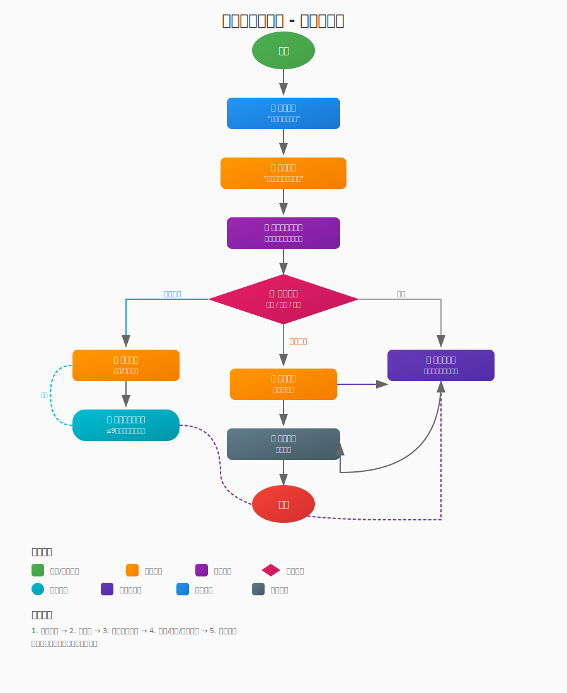

**流程简述：**

1. **开始** → 欢迎输出 → 开场问答
2. **代码节点**：清洗用户输入（去除特殊字符）
3. **意图识别**：三分支判断（售前/售后/兜底）
4. **售前分支**：商品查询（含循环校验）、优惠咨询
5. **售后分支**：退换货、退款处理
6. **兜底分支**：大模型陪聊（挂载插件）
7. **文本处理**：拼接结果 → 结束输出

---

## 三、节点详解

### 3.1 开始节点

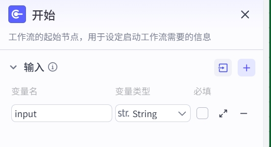

| 属性     | 内容                        |
| -------- | --------------------------- |
| 节点类型 | 开始（Start）               |
| 作用     | 工作流入口，定义输入参数    |
| 输入参数 | `input`（string，用户输入） |

**说明：** 工作流的第一个节点，所有流程从这里启动。

---

### 3.2 输出节点 — 欢迎语

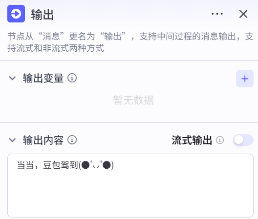

| 属性     | 内容                    |
| -------- | ----------------------- |
| 节点类型 | 输出（Output）          |
| 节点名称 | 输出                    |
| 输出内容 | `当当，豆包驾到(●'◡'●)` |
| 流式输出 | 否                      |

**作用：** 在对话开始时立即向用户发送欢迎消息，建立良好的交互体验。

---

### 3.3 问答节点 — 开放式问答

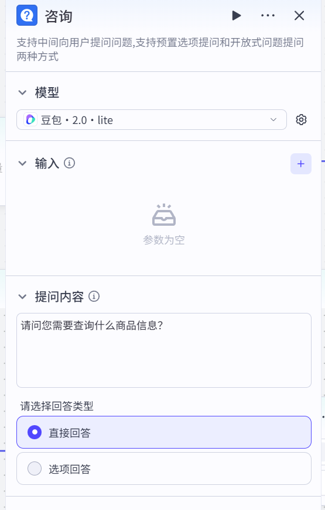

| 属性         | 内容                                                     |
| ------------ | -------------------------------------------------------- |
| 节点类型     | 问答（Question）                                         |
| 节点名称     | 问答                                                     |
| 提问内容     | `您好，有什么问题都可以问本豆包哦~~~///(^v^)\~~~`        |
| 问答类型     | 开放式（text）                                           |
| 最大问答轮次 | 3                                                        |
| 输出变量     | `USER_RESPONSE`（用户回答）、`QUESTION_DATA`（问题列表） |

**作用：** 向用户发起开放式提问，收集用户的问题输入，传递给后续节点处理。

> 💡 **问答节点说明：** Coze 中的「问答」节点支持两种提问模式：
>
> - **开放式（text）**：用户自由输入文本
> - **选项式（option）**：用户从预设选项中选择

---

### 3.4 代码节点 — 输入清洗

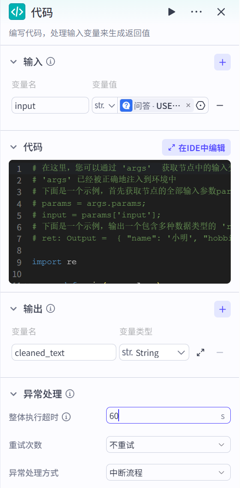

| 属性     | 内容                                      |
| -------- | ----------------------------------------- |
| 节点类型 | 代码（Code）                              |
| 节点名称 | 代码                                      |
| 编程语言 | Python                                    |
| 输入变量 | `input`（来自问答节点的 `USER_RESPONSE`） |
| 输出变量 | `cleaned_text`（清洗后的文本）            |

**清洗规则：**

1. 去除控制字符（`\n`、`\r`、`\t` 等 ASCII 控制符）
2. 去除特殊符号（只保留中英文、数字、常用标点）
3. 合并多余空格，去除首尾空格
4. 若清洗后为空，返回 `[无效输入]`

**核心代码：**

```python
import re

async def main(args: Args):
    raw_text = args.params.get("input", "")
    
    if not raw_text:
        return {"cleaned_text": ""}
    
    # 1. 去除控制字符
    text = re.sub(r'[\x00-\x1f\x7f]', '', raw_text)
    
    # 2. 去除特殊符号，只保留中英文、数字、常用标点
    allowed_pattern = r'[^\u4e00-\u9fffA-Za-z0-9\s\。\，\！\？\；\：\"\"\'\'...]'
    text = re.sub(allowed_pattern, '', text)
    
    # 3. 合并多余空格
    text = re.sub(r'\s+', ' ', text).strip()
    
    if not text:
        text = "[无效输入]"
    
    return {"cleaned_text": text}
```

> 💡 **为什么要清洗输入？** 用户输入可能包含复制粘贴带来的控制字符、特殊符号等，会干扰下游意图识别节点的判断。清洗后再传给意图识别，可以提升识别准确率。

---

### 3.5 意图识别节点

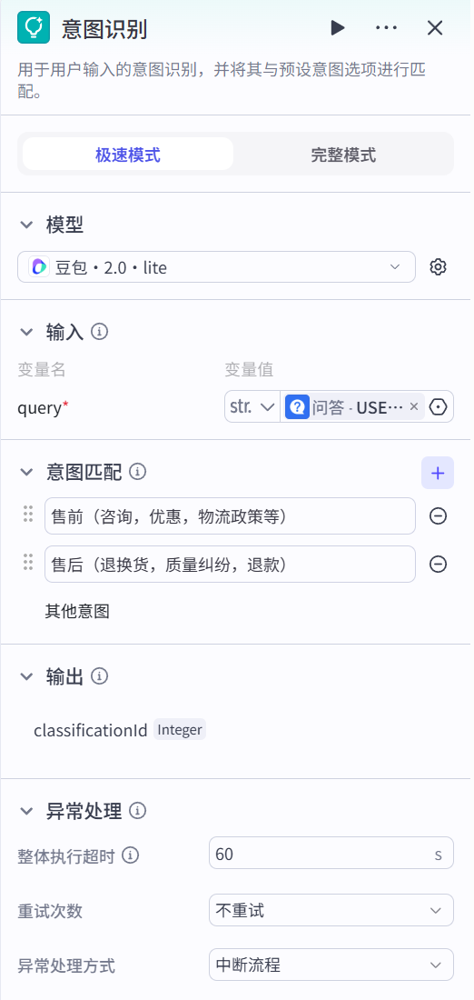

| 属性     | 内容                                     |
| -------- | ---------------------------------------- |
| 节点类型 | 意图识别（Intent）                       |
| 节点名称 | 意图识别                                 |
| 使用模型 | 豆包·2.0·lite                            |
| 输入     | `query`（来自代码节点的 `cleaned_text`） |
| 输出     | `classificationId`（意图分类编号）       |

**预设意图：**

| 意图 ID  | 意图名称                       | 触发场景                   |
| -------- | ------------------------------ | -------------------------- |
| branch_0 | 售前（咨询，优惠，物流政策等） | 用户询问商品、活动、发货等 |
| branch_1 | 售后（退换货，质量纠纷，退款） | 用户反馈问题、申请退款等   |
| default  | 兜底                           | 无法匹配以上意图           |

**说明：** 意图识别节点是工作流的"路由枢纽"，根据识别结果将流程分发到不同分支。

---

### 3.6 售前咨询分支

#### 3.6.1 问答节点 — 售前咨询

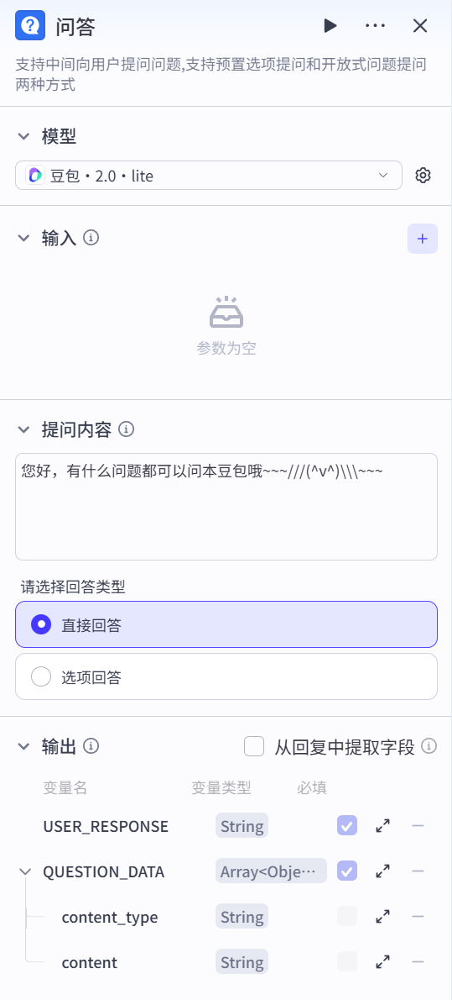

| 属性     | 内容                                              |
| -------- | ------------------------------------------------- |
| 节点类型 | 问答（Question）                                  |
| 节点名称 | 售前咨询                                          |
| 提问内容 | `请问具体是以下哪个问题？`                        |
| 问答类型 | 选项式（option）                                  |
| 预设选项 | ① 查询商品信息　② 优惠                            |
| 输出变量 | `optionId`（选项ID）、`optionContent`（选项内容） |

---

#### 3.6.2 循环节点 — 商品名称校验

当用户选择「查询商品信息」时，进入此循环，确保用户输入的商品名称符合规范。

| 属性     | 内容                   |
| -------- | ---------------------- |
| 节点类型 | 循环（Loop）           |
| 节点名称 | 商品名称校验           |
| 循环类型 | 无限循环（最多 10 次） |

**循环内部流程：**

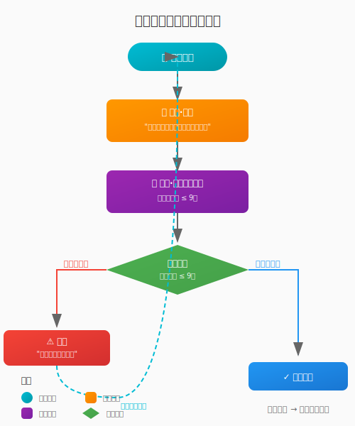

**流程说明：**

1. **循环开始** → 问答节点询问商品信息
2. **代码节点** 判断输入字符数是否 ≤ 9
3. **条件分支**：
   - ✅ 名称合法（≤9字）→ 终止循环，退出继续后续流程
   - ❌ 名称过长（>9字）→ 输出提示"输入商品名过长！" → 返回循环开始重新询问

**校验代码：**

```python
async def main(args: Args):
    user_input = args.params
    # 判断字符数是否不超过 9
    is_valid = len(user_input) <= 9
    return {'result': is_valid}
```

> 💡 **循环节点的作用：** 当用户输入不合法时，可以反复提示用户重新输入，直到输入合法为止，防止无效数据流向后续节点。

**循环结束后：** 进入"咨询回复"节点。

---

#### 3.6.3 输出节点 — 咨询回复

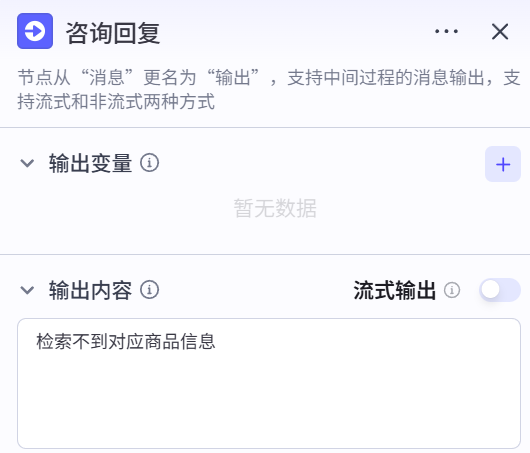

| 属性     | 内容                   |
| -------- | ---------------------- |
| 节点类型 | 输出（Output）         |
| 节点名称 | 咨询回复               |
| 输出内容 | `检索不到对应商品信息` |
| 流式输出 | 否                     |

**作用：** 当用户完成商品名称校验（循环结束）后，向用户返回查询结果。当前版本暂时返回固定提示，实际项目中可接入知识库或数据库查询，实现真实商品信息检索。

---

#### 3.6.4 输出节点 — 通用回复

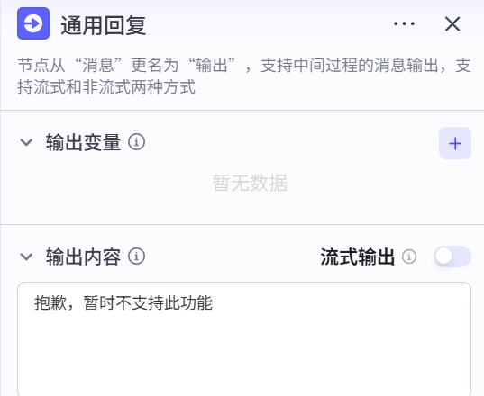

| 属性     | 内容                     |
| -------- | ------------------------ |
| 节点类型 | 输出（Output）           |
| 节点名称 | 通用回复                 |
| 输出内容 | `抱歉，暂时不支持此功能` |
| 流式输出 | 否                       |

**触发场景：**

- 售前咨询中用户选择「优惠」选项
- 售后咨询中用户选择「退换货」选项

**作用：** 向用户说明当前功能暂未开放，作为售前和售后分支中暂未实现功能的统一兜底回复。

---

#### 3.6.5 循环节点内部子节点详解

循环节点内部包含 5 个子节点，协同完成商品名称的校验逻辑：

##### ① 问答节点 — 咨询


| 属性         | 内容                           |
| ------------ | ------------------------------ |
| 节点类型     | 问答（Question）               |
| 节点名称     | 咨询                           |
| 提问内容     | `请问您需要查询什么商品信息？` |
| 问答类型     | 开放式（text）                 |
| 最大问答轮次 | 3                              |
| 输出变量     | `USER_RESPONSE`（用户回答）    |

**作用：** 在循环体内向用户发起提问，收集用户输入的商品名称。

##### ② 代码节点 — 判断商品名称是否过长

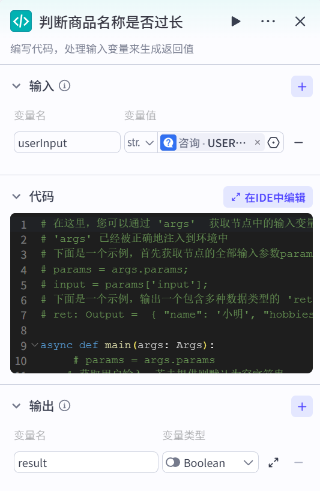

| 属性     | 内容                                          |
| -------- | --------------------------------------------- |
| 节点类型 | 代码（Code）                                  |
| 节点名称 | 判断商品名称是否过长                          |
| 编程语言 | Python                                        |
| 输入变量 | `userInput`（来自问答节点的 `USER_RESPONSE`） |
| 输出变量 | `result`（布尔值，True=合法，False=过长）     |

**核心代码：**

```python
async def main(args: Args):
    # 获取用户输入
    user_input = args.params
    
    # 判断字符数是否不超过 9
    is_valid = len(user_input) <= 9
    
    # 返回结果，后续节点可通过 result 获取
    return {'result': is_valid}
```

**作用：** 校验用户输入的商品名称长度，判断是否 ≤ 9 个字符。

##### ③ 选择器节点

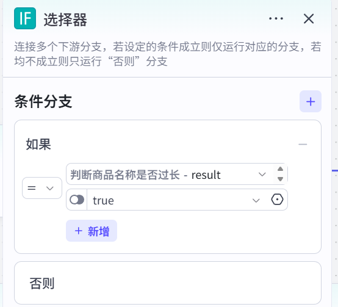

| 属性     | 内容                                           |
| -------- | ---------------------------------------------- |
| 节点类型 | 选择器（Condition）                            |
| 节点名称 | 选择器                                         |
| 判断条件 | `result == true`（代码节点输出）               |
| 分支逻辑 | 条件成立 → 终止循环；条件不成立 → 提示重新输入 |

**作用：** 根据代码节点的校验结果进行分支路由。

##### ④ 终止循环节点


| 属性     | 内容                   |
| -------- | ---------------------- |
| 节点类型 | 终止循环（Break）      |
| 节点名称 | 终止循环               |
| 触发条件 | 选择器的"条件成立"分支 |

**作用：** 立即终止当前循环，跳出循环体，继续执行循环外的后续节点。

##### ⑤ 输出节点 — 重新输入提示

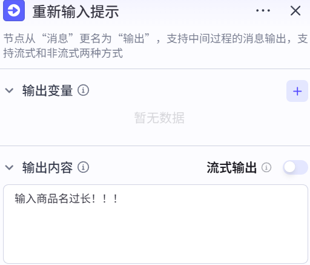

| 属性     | 内容                   |
| -------- | ---------------------- |
| 节点类型 | 输出（Output）         |
| 节点名称 | 重新输入提示           |
| 输出内容 | `输入商品名过长！！！` |
| 流式输出 | 否                     |

**作用：** 当商品名称过长时，向用户输出提示信息，然后返回循环开始重新询问。

**节点连接关系：**

```
循环开始
  ↓
[问答·咨询] → 用户输入商品名称
  ↓
[代码·判断商品名称是否过长] → 输出 result（布尔值）
  ↓
[选择器]
  ├─ result == true（名称合法）→ [终止循环] → 退出循环
  └─ result == false（名称过长）→ [输出·重新输入提示] → 返回循环开始
```

> 💡 **循环节点的工作原理：**
>
> - 循环节点是一个"容器"，内部可以嵌套多个子节点
> - 通过"终止循环"节点主动退出循环
> - 通过将输出节点连接回循环入口实现循环迭代
> - 最大循环次数为 10 次，防止无限循环

---

#### 3.6.6 售前兜底 — 暂不支持

当用户选择「优惠」或无法匹配选项时，进入通用回复节点，输出：`抱歉，暂时不支持此功能`

---

### 3.7 售后咨询分支

#### 3.7.1 问答节点 — 售后咨询

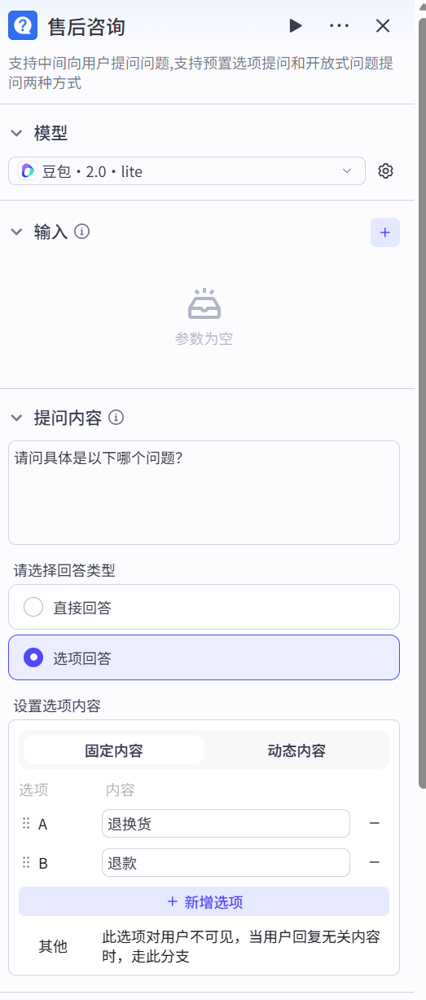

| 属性     | 内容                       |
| -------- | -------------------------- |
| 节点类型 | 问答（Question）           |
| 节点名称 | 售后咨询                   |
| 提问内容 | `请问具体是以下哪个问题？` |
| 问答类型 | 选项式（option）           |
| 预设选项 | ① 退换货　② 退款           |

**分支处理：**

| 用户选择 | 处理逻辑     | 输出内容                 |
| -------- | ------------ | ------------------------ |
| 退换货   | 通用回复节点 | `抱歉，暂时不支持此功能` |
| 退款     | 退款结果节点 | `退款成功`               |
| 兜底     | 陪聊大模型   | 由大模型生成回复         |

---

#### 3.7.2 输出节点 — 退款结果

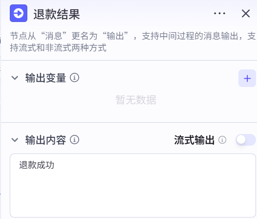

| 属性     | 内容           |
| -------- | -------------- |
| 节点类型 | 输出（Output） |
| 节点名称 | 退款结果       |
| 输出内容 | `退款成功`     |
| 流式输出 | 否             |

**触发场景：** 售后咨询中用户选择「退款」选项

**作用：** 向用户返回退款处理结果。当前版本为简化演示，直接返回固定成功提示。实际项目中可接入订单系统和支付接口，实现真实退款流程：

1. 校验订单状态（是否已完成、是否在退款期限内）
2. 调用支付渠道退款接口
3. 更新订单状态为"退款中"或"已退款"
4. 返回详细退款信息（退款金额、到账时间等）

---

### 3.8 大模型节点 — 陪聊

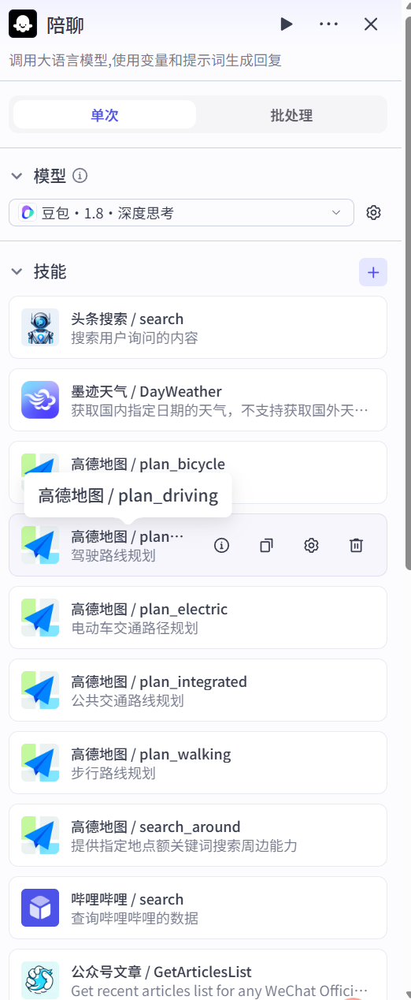

| 属性     | 内容                               |
| -------- | ---------------------------------- |
| 节点类型 | 大模型（LLM）                      |
| 节点名称 | 陪聊                               |
| 使用模型 | 豆包·1.8·深度思考                  |
| 输入变量 | `memory`（用户输入，来自问答节点） |
| 输出变量 | `output`（大模型回复内容）         |

**已挂载插件：**

| 插件名称   | 用途               |
| ---------- | ------------------ |
| 头条搜索   | 搜索网络信息       |
| 墨迹天气   | 查询天气           |
| 高德地图   | 路线规划、周边搜索 |
| 哔哩哔哩   | 搜索B站内容        |
| 公众号文章 | 获取微信公众号文章 |

**系统提示词（角色设定）：**

> 你是一个亲切温暖的闲聊助手，像朋友一样陪伴用户聊天，能用轻松自然的语气回应各种话题，擅长捕捉用户的情绪和兴趣点，用幽默有趣的方式延续对话，让聊天充满温暖和轻松的氛围。

**核心技能：**

- 技能1：轻松回应日常话题（共情 + 趣味语言）
- 技能2：主动延续与拓展话题
- 技能3：分享轻松趣味内容（冷知识/小笑话）
- 技能4：陪伴式情绪支持

**触发场景：** 当意图识别无法匹配售前/售后意图时，或在各分支的兜底逻辑中，均会转入陪聊模式。

---

### 3.9 文本处理节点

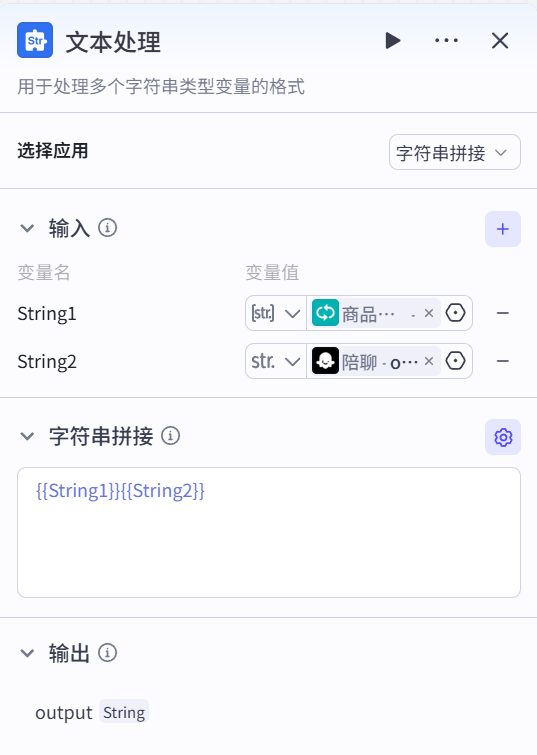

| 属性     | 内容                         |
| -------- | ---------------------------- |
| 节点类型 | 文本处理（StrConcat）        |
| 方法     | concat（字符串拼接）         |
| 输入1    | 循环节点输出（商品查询列表） |
| 输入2    | 陪聊大模型的回复             |
| 拼接符   | `，`（中文逗号）             |
| 输出     | `output`                     |

**作用：** 将商品查询结果与大模型陪聊回复拼接成最终输出，传递给结束节点。

---

### 3.10 结束节点

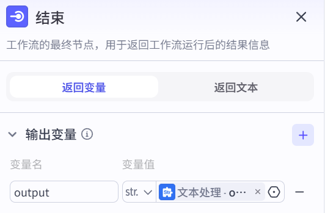

| 属性     | 内容                         |
| -------- | ---------------------------- |
| 节点类型 | 结束（End）                  |
| 终止计划 | 返回变量（returnVariables）  |
| 输出变量 | `output`（来自文本处理节点） |

---

## 四、核心节点类型汇总

| 节点类型      | 图标颜色 | 核心作用                    |
| ------------- | -------- | --------------------------- |
| 开始 / 结束   | 🔵 蓝色   | 工作流入口与出口            |
| 输出          | 🔵 蓝色   | 中间过程向用户发送消息      |
| 问答          | 🔷 深蓝   | 向用户提问并等待回复        |
| 意图识别      | 🟢 青色   | 分析用户意图并路由          |
| 大模型（LLM） | 🔵 蓝色   | 调用大模型生成回复          |
| 代码          | 🟢 青色   | 自定义逻辑处理（Python/JS） |
| 选择器        | 🟢 青色   | 条件分支路由                |
| 循环          | 🟢 青色   | 重复执行节点直到满足条件    |
| 文本处理      | 🔷 深蓝   | 字符串拼接与格式化          |

---

## 五、工作流设计要点

### 5.1 输入清洗的必要性

用户输入往往不规范，直接送入意图识别可能影响准确率。在意图识别**前**增加代码节点做清洗，是实际项目中的最佳实践。

### 5.2 循环节点的使用场景

循环节点适合以下场景：

- **输入校验**：用户输入不合法时反复提示
- **重试机制**：某个操作失败时自动重试
- **多轮确认**：需要用户多次确认才能执行

> ⚠️ 注意：循环节点需要设置最大循环次数（本例为 10 次），防止无限循环消耗资源。

### 5.3 兜底逻辑的设计

好的工作流必须有完善的兜底逻辑：

- 意图识别设置 `default` 分支
- 选项问答设置 `default` 分支
- 兜底时调用陪聊大模型，维持用户体验

### 5.4 大模型与插件的组合

陪聊大模型挂载了多个插件（天气、地图、搜索等），可以让大模型在回复时**主动调用工具**，扩展服务能力，不只是单纯聊天。

---

## 六、课后练习

1. **基础**：在"售前咨询"的"查询商品信息"分支中，将"检索不到对应商品信息"的固定输出替换为知识库查询节点，实现真实商品信息检索。

2. **进阶**：在"售后咨询"的"退换货"分支中，增加一个问答节点，收集用户的订单号，并使用代码节点校验订单号格式是否正确（如：纯数字、长度为 18 位）。

3. **挑战**：将整个工作流改造为支持**多轮对话**（在处理完一次问题后，询问用户"还有其他问题吗？"，若有则重新进入意图识别，若无则结束流程）。

---

